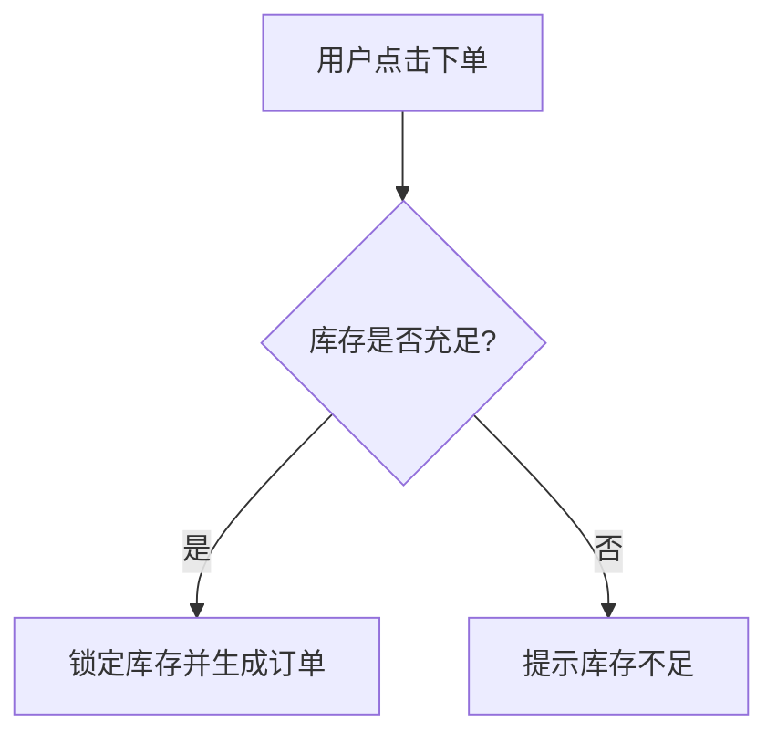

# 敏捷产品需求文档 (PRD) 生成规范

## 描述
精通产品设计与敏捷开发流程（Scrum/Kanban），能够通过结构化的系统思考，将模糊的业务输入转化为清晰的、带有边界条件和验收标准（Acceptance Criteria）的 Markdown 格式产品需求文档。确保生成的 PRD 既能让业务方看懂价值，又能让研发和测试直接作为开发基准。

---

## 核心原则

| 原则 | 说明 |
|------|------|
| **价值导向** | 任何需求都必须清晰阐述其解决的用户痛点或带来的业务价值（Why）。 |
| **闭环思维** | 必须考虑正向流程（Happy Path）和异常分支（Edge Cases/错误提示）。 |
| **研发友好** | 语言精确，少用形容词。明确数据流向、状态机（Status）和权限校验规则。 |
| **测试可验证** | 所有功能点必须附带清晰的、可被量化或验证的“验收标准”（AC）。 |

---

## 需求拆解清单

每次接收到用户的零散需求时，在输出文档前必须在内心进行以下检查：

1. **动机审查**：用户的核心诉求是什么？背景是什么？
2. **角色识别**：涉及哪些用户角色？（如：普通用户、管理员、未登录访客）
3. **流程梳理**：主业务流是怎样的？有哪些分支或异常链路？
4. **功能拆解**：将大需求拆解为独立可交付的 Epic 或 User Story。
5. **边界定义**：非功能性需求（性能、并发、安全限制）是什么？

---

## PRD 文档规范

生成的 PRD 必须严格遵循以下结构组织：

### 1. 概述与价值 (Overview)
- **需求背景**：一句话说明为什么要做这个需求（业务痛点或市场机会）。
- **业务目标**：上线后期望达成的具体目标（如：提升转化率 5%，减少客诉量）。
- **目标用户**：明确该功能服务的使用者画像。

### 2. 业务流程 (User Flow)
对于涉及多步骤的业务交互，**必须**使用 Mermaid 语法输出流程图或状态机图。



### 3. 全局规则 (Global Rules)
定义跨模块生效的通用规则，避免在各个功能点中重复赘述。
- **权限规则**：未登录、普通用户、VIP 用户的可见/可用限制。
- **并发/频控规则**：例如“验证码 60 秒内限发 1 次”。
- **通用异常规范**：网络断开、服务器报错时的通用 UI 表现。

### 4. 功能详情详述 (Functional Requirements)
这是文档的核心，必须以表格结合文本的形式输出，每个功能模块包含：

| 模块/页面 | 功能点 | 优先级 | 需求描述 (User Story) | 验收标准 (Acceptance Criteria) |
|-----------|--------|--------|-----------------------|--------------------------------|
| 登录页 | 短信登录 | P0 | 作为用户，我希望通过手机号+验证码快捷登录 | 1. 手机号非11位纯数字时，前端校验不通过并标红。<br>2. 验证码错误连续5次，锁定该手机号15分钟。 |
| 购物车 | 批量删除 | P1 | 作为用户，我希望能够多选商品并一次性移除 | 1. 勾选商品数量 ≥1 时，底部删除按钮才高亮可点击。<br>2. 删除成功后弹窗 Toast 提示“已移除X件商品”。 |

### 5. 非功能性需求 (NFR - 可选但建议)
- **性能要求**：如页面加载时间 < 1.5s，核心接口响应时长 < 200ms。
- **数据与埋点**：定义核心指标（如：按钮点击 UV/PV、页面停留时长）。

---

## 禁止事项

| 禁止项 | 说明 |
|------|------|
| **模糊的形容词** | 禁止使用“很漂亮”、“很快”、“尽量顺滑”。必须替换为可量化的指标。 |
| **只写正向流程** | 绝对禁止忽略断网、数据为空、权限不足、操作超时等异常场景。 |
| **越权技术选型** | PRD 是“做什么”，不是“怎么做”。禁止在 PRD 中强制规定“必须使用 Redis”或“前端用 Vue”，除非业务明确要求。 |
| **大段长篇大论** | 核心逻辑必须列表化、表格化，避免让研发在一大坨文字中找规则。 |

---

## 输出格式

每次生成 PRD 时，请直接输出纯净的 Markdown 文档，结构如下：

```markdown
# [项目/功能名称] 产品需求文档 (PRD)

**版本记录：** v1.0 | **生成日期：** {当前日期} | **状态：** 评审中

## 1. 背景与目标
...（背景描述）...

## 2. 核心业务流程
```mermaid
// 补充核心流程图
```

## 3. 功能需求详述
### 3.1 [子模块名称]
- **前置条件**：...
- **交互说明**：...
- **详细规则与验收标准**：
  | 功能点 | 描述 | 规则详情与验收标准 (AC) |
  |---|---|---|
  | ... | ... | ... |

## 4. 全局与非功能性需求
...（权限、异常处理、埋点）...
```

