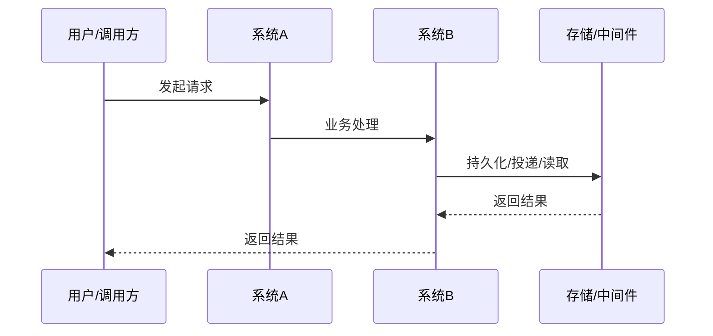

# [产品/项目名称] 需求文档 (PRD)

> **文档状态：** [草稿 / 评审中 / 已定稿 / 开发中]
> **职能说明：** [面向哪些团队、系统或端共同使用]
> **项目名称：** [项目名称]
> **模块名称：** [模块名称]
> **分支信息：**
> **主分支：** [分支名称]
> **相关分支：** [如 Java / Python / 前端 / 其他]
> **负责人：** [你的名字]
> **最后更新时间：** YYYY-MM-DD

---

## 1. 文档修订记录 (Change Log)
*规范：任何需求变更必须在此记录，杜绝口头需求。*

| 版本号 | 修改日期 | 修改内容简述 | 提出人 | 审核人 |
| :--- | :--- | :--- | :--- | :--- |
| v1.0 | 202X-XX-XX | 初始版本创建 | [姓名] | [姓名] |

---

## 2. 业务层 (Business Layer)

### 2.1 需求背景

- 当前现状：
- 当前问题：
- 触发本次需求的原因：

### 2.2 需求目标

- 业务目标：
- 用户目标：
- 本次完成后的预期收益：

### 2.3 范围与分期

**本期必须完成：**

- 

**本期明确不做：**

- 

**后续期次规划：**

- 一期：
- 二期：
- 三期：

### 2.4 角色与参与方

| 角色/系统 | 身份说明 | 在本需求中的职责 |
| :--- | :--- | :--- |
| 用户 |  |  |
| 管理员 |  |  |
| 内部服务 |  |  |
| 外部系统 |  |  |

### 2.5 核心业务场景

#### 场景 A：[场景名称]

- 触发条件：
- 主流程：
- 用户可见结果：

#### 场景 B：[场景名称]

- 触发条件：
- 主流程：
- 用户可见结果：

### 2.6 关键异常场景

| 异常场景 | 触发条件 | 系统预期行为 | 用户可见结果 |
| :--- | :--- | :--- | :--- |
|  |  |  |  |

### 2.7 验收标准

| 验收项 | 验收标准 | 验证方式 |
| :--- | :--- | :--- |
|  |  |  |

---

## 3. 架构约束层 (Architecture Constraint Layer)

### 3.1 主业务维度

- 本需求围绕的主业务对象：
- 其他对象如何归属于主业务对象：
- 明确不是主维度的对象：

### 3.2 系统职责划分

| 端 / 系统 / 模块 | 负责内容 | 明确不负责内容 |
| :--- | :--- | :--- |
| 前端 |  |  |
| Java 端 |  |  |
| Python 端 |  |  |
| 中间件 / 任务系统 |  |  |
| 对象存储 / 数据存储 |  |  |

### 3.3 核心业务流程

#### 主流程时序图

#### 关键补充说明

- 主链路说明：
- 与其他链路的衔接关系：
- 本期不进入的后续链路：

### 3.4 关键状态与结果

| 对象 | 关键状态 | 状态含义 | 谁负责更新 | 谁需要感知 |
| :--- | :--- | :--- | :--- | :--- |
|  |  |  |  |  |

### 3.5 核心数据对象

先列出本需求涉及的数据对象总览：

| 数据对象 | 职责说明 | 与主维度关系 | 本期是否需要 |
| :--- | :--- | :--- | :--- |
|  |  |  | 是 / 否 |

然后对每个关键数据对象分别补充以下说明：

#### 数据对象 A：[对象名称]

- 对象职责：
- 记录的核心事实：
- 归属关系：
- 与其他对象的关系：
- 本期是否必须存在：
- 关键状态/结果是否挂在该对象上：
- 明确不放在该对象中的内容：

#### 数据对象 B：[对象名称]

- 对象职责：
- 记录的核心事实：
- 归属关系：
- 与其他对象的关系：
- 本期是否必须存在：
- 关键状态/结果是否挂在该对象上：
- 明确不放在该对象中的内容：

说明：

- 本节在 PRD 中采用“对象级模型”，用于提前锁定业务边界、职责边界和对象关系
- 本节不要求给出最终表字段、字段类型、索引或 SQL
- 最终字段级模型放在 `technical_design.md`

### 3.6 依赖与协作关系

| 依赖项 | 依赖类型 | 对本需求的影响 | 当前状态 |
| :--- | :--- | :--- | :--- |
|  | 系统 / 组件 / 数据 / 人工流程 |  | 已具备 / 待确认 / 有风险 |

---

## 4. 技术边界层 (Technical Boundary Layer)

### 4.1 关键技术约束

本节用于提前敲定那些会影响需求边界和职责边界的技术约束，但不展开最终实现方案。

| 约束项 | 当前约束说明 | 是否本期定稿 |
| :--- | :--- | :--- |
| 核心存储边界 | 结构化数据、对象数据、中间产物分别放在哪里 | 是 / 否 |
| 系统间交互方式 | 同步调用、异步消息、轮询或其他方式 | 是 / 否 |
| 关键定位信息生成方 | 由哪个端/模块提前生成关键定位信息 | 是 / 否 |
| 幂等与稳定性要求 | 是否要求路径、任务或结果具备稳定幂等语义 | 是 / 否 |
| 交互载荷边界 | 系统间传递哪些最小必要信息 | 是 / 否 |
| 状态更新责任 | 哪个端负责更新哪些关键状态 | 是 / 否 |
| 扩展兼容要求 | 后续期次扩展时需要保持哪些兼容边界 | 是 / 否 |

### 4.2 涉及的存储与中间件类型

* [ ] 关系型数据库
* [ ] 缓存
* [ ] 消息队列
* [ ] 对象存储
* [ ] 搜索 / 向量检索
* [ ] 外部系统
* [ ] 其他：__________

### 4.3 本期需要提前确认的技术原则

- 

### 4.4 延后到技术方案确认的内容

以下内容可以在 PRD 中先描述原则，不要求在本阶段定到最终实现细节：

- 具体表字段与索引
- 具体消息结构与代码模型
- 具体接口字段
- 具体对象命名规则
- 具体包结构、类结构与实现方式

---

## 5. 风险、依赖与待确认问题 (Dependencies & Open Issues)

### 5.1 当前主要风险

- 

### 5.2 前置依赖

- 

### 5.3 待确认问题

- 
