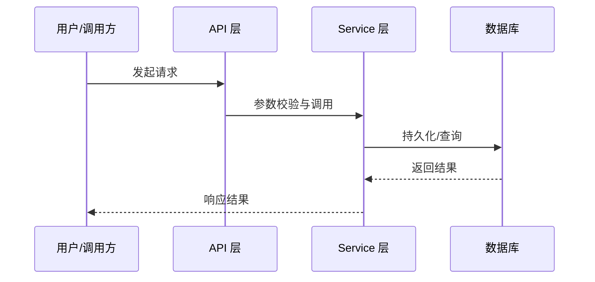
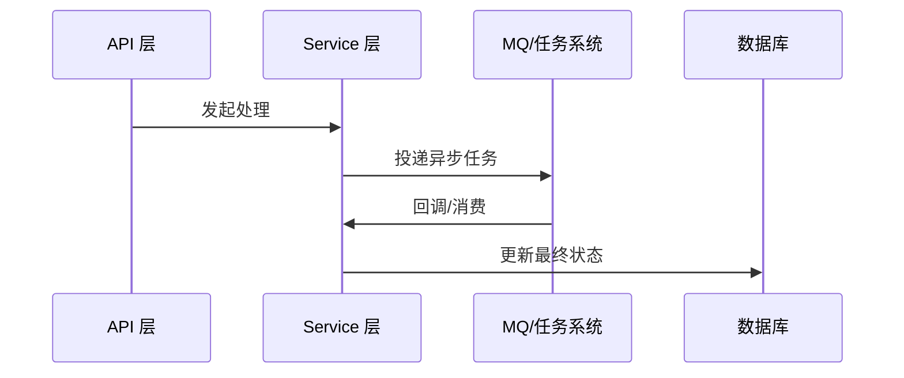

# [产品/项目名称] 技术实现文档

> **文档状态：** [草稿 / 评审中 / 已定稿 / 已实现]
> **项目名称**：[项目名称]
> **模块名称**：[模块名称]
> **需求文档**：[需求文档路径]
> **分支名称**：[分支名称]
> **技术负责人：** [你的名字]
> **最后更新时间：** YYYY-MM-DD

---

## 1. 文档修订记录 (Change Log)
*规范：任何技术方案调整必须在此记录，避免口头变更和实现偏差。*

| 版本号 | 修改日期 | 修改内容简述 | 修改人 | 审核人 |
| :--- | :--- | :--- | :--- | :--- |
| v1.0 | 202X-XX-XX | 初始版本创建 | [姓名] | [姓名] |

---

## 2. 技术目标与实现范围 (Overview)

### 2.1 技术目标与核心思路 (Technical Goals)
*说明本技术方案要解决什么问题，以及落地后的系统目标状态。*
* **技术目标：** 描述本次实现必须达成的核心系统能力。*
* **设计原则：** 描述本次方案采用的边界划分、复用策略、兼容策略。*
* **成功标准：** 说明如何从工程角度判断该方案已经完成。*

### 2.2 实现范围与边界 (In Scope / Out of Scope)

**必须实现：**

- 

**暂不实现：**

- 

### 2.3 验收项到实现点映射 (Requirement Mapping)

| 需求验收项 | 技术实现点 | 测试方式 | 责任模块 |
| :--- | :--- | :--- | :--- |
|  |  |  |  |

---

## 3. 当前系统分析与复用基础 (Current-State Analysis)

### 3.1 相关模块盘点
*说明本次需求涉及哪些现有模块，这些模块目前承担什么职责，哪些需要改动。*

| 模块 | 当前职责 | 现状说明 | 是否修改 |
| :--- | :--- | :--- | :--- |
| `link-api` | Controller / API 入口 |  |  |
| `link-service` | 业务服务 |  |  |
| `link-model` | Entity / DTO / Enum |  |  |
| `link-mapper` | Mapper / 持久化 |  |  |
| `link-core` | 通用配置 / 异常 / 工具 |  |  |
| `link-components` | 可复用基础组件 |  |  |

### 3.2 已复用能力 (Reusable Components)

- 

### 3.3 已参考代码 (Code References)

| 文件/模块 | 参考点 | 对方案的影响 |
| :--- | :--- | :--- |
|  |  |  |

### 3.4 现有问题与约束 (Constraints)

- 

---

## 4. 核心架构与实现方案 (Architecture & Solution)

### 4.1 总体设计思路 (Architecture Overview)
*说明采用什么改造策略、模块划分和边界约定。*

### 4.2 目标调用链路 (Call Flow)

```text
Controller -> Service -> Mapper/Component -> External System
```

### 4.3 核心模块职责划分 (Module Responsibilities)

| 模块/类 | 职责 | 输入/输出边界 |
| :--- | :--- | :--- |
|  |  |  |

### 4.4 核心时序图 (Sequence Diagrams)

#### 场景 1：[主流程名称]


#### 场景 2：[异步/异常流程名称]


---

## 5. 接口契约与交互方案 (API Contract)

### 5.1 接口清单

| 方法 | 路径 | 说明 | 权限 |
| :--- | :--- | :--- | :--- |
| GET | `/api/v1/...` |  |  |

### 5.2 请求参数

| 参数 | 位置 | 类型 | 必填 | 说明 |
| :--- | :--- | :--- | :--- | :--- |
|  | path/query/body |  |  |  |

### 5.3 响应结构

```json
{
  "code": 200,
  "message": "success",
  "data": {}
}
```

### 5.4 异常响应

| 场景 | HTTP 状态 | 业务错误码 | message |
| :--- | :--- | :--- | :--- |
|  | 400 |  |  |

### 5.5 异常类与错误码定义

#### 异常类设计

| 异常类 | 继承关系 | 使用场景 | 说明 |
| :--- | :--- | :--- | :--- |
|  | `BusinessException` / 其他 |  |  |

#### 错误码定义

| 错误码 | 枚举名/常量名 | HTTP 状态 | 触发场景 | 前端提示策略 |
| :--- | :--- | :--- | :--- | :--- |
|  |  |  |  |  |

说明：

- 若复用现有异常体系，必须明确复用哪个异常基类、错误码枚举或统一返回规则
- 若新增错误码，必须说明编码范围、命名方式和是否需要同步公共约定
- 若新增异常类，必须说明放置位置与适用边界，避免随意散落
- 异常类和错误码设计必须与仓库现有代码规范保持一致，优先参考现有 `BusinessException`、错误码枚举与全局异常处理实现

### 5.6 兼容性说明

- 是否兼容旧接口：
- 是否需要过渡期：
- 前端影响点：

---

## 6. 数据契约与存储设计 (Data & Storage)

### 6.1 数据模型与实体关系 (E-R)

- 

### 6.2 数据库组件与结构变更 (Database & Schema Changes)

#### MySQL 变更
| 表名 | 变更类型 | 变更说明 | 备注 |
| :--- | :--- | :--- | :--- |
|  | 新增/修改/删除 |  |  |

### 6.3 字段设计

| 表 | 字段 | 类型 | 是否必填 | 默认值 | 说明 |
| :--- | :--- | :--- | :--- | :--- | :--- |
|  |  |  |  |  |  |

### 6.4 索引与约束

- 

### 6.5 中间件与其他存储设计

| 组件 | 存储内容 | Key/Path 规则 | 备注 |
| :--- | :--- | :--- | :--- |
| Redis |  |  |  |
| MQ |  |  |  |
| OSS / MinIO |  |  |  |
| 其他 |  |  |  |

### 6.6 数据迁移与回滚

* **是否需要迁移：**
* **迁移策略：**
* **回滚策略：**

---

## 7. 核心实现逻辑 (Core Implementation)

### 7.1 Service / Component 设计

```java
public interface XxxService {
}
```

### 7.2 核心方法职责

| 方法 | 职责 | 输入 | 输出 |
| :--- | :--- | :--- | :--- |
|  |  |  |  |

### 7.3 关键处理流程

1. 
2. 
3. 

### 7.4 并发、幂等与一致性

- **并发控制：**
- **幂等策略：**
- **事务边界：**
- **跨组件一致性：**

---

## 8. 组件集成与配置方案 (Integration Design)

| 组件 | 用途 | 配置项 | 失败处理 |
| :--- | :--- | :--- | :--- |
| OSS |  |  |  |
| MQ |  |  |  |
| Redis |  |  |  |
| 第三方接口 |  |  |  |

---

## 9. 权限、安全与审计设计 (Security)

### 9.1 认证与授权

| 操作 | 权限要求 | 校验位置 |
| :--- | :--- | :--- |
|  |  |  |

### 9.2 敏感数据处理

- **敏感字段：**
- **脱敏策略：**
- **日志策略：**

### 9.3 审计要求

- 

---

## 10. 异常处理与降级策略 (Exceptions & Fallback)

| 异常场景 | 处理方式 | 错误码 | 用户提示 | 是否重试 |
| :--- | :--- | :--- | :--- | :--- |
|  |  |  |  |  |

---

## 11. 测试与验证方案 (Test Plan)

### 11.1 单元测试

| 测试类 | 覆盖内容 |
| :--- | :--- |
|  |  |

### 11.2 集成测试

| 测试类 | 覆盖接口/流程 |
| :--- | :--- |
|  |  |

### 11.3 回归测试

| 回归点 | 验证方式 |
| :--- | :--- |
|  |  |

### 11.4 验证命令

```bash
mvn -pl <module> -am test
```

---

## 12. 发布与上线方案 (Release Plan)

### 12.1 配置项

| 配置项 | 默认值 | 说明 |
| :--- | :--- | :--- |
|  |  |  |

### 12.2 发布步骤

1. 
2. 
3. 

### 12.3 回滚方案

- 

---

## 13. 遗留问题与依赖项 (Dependencies & Open Issues)

* **前置依赖：** [记录依赖哪个模块、组件、外部系统或环境条件]
* **待确认事项：** [记录在技术评审中尚未决定的事项及跟进人]
