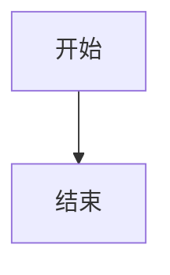

# [模块名称] 技术设计

- **文档状态：** 技术方案待审核
- **项目名称：** [项目名称]
- **业务域：** [业务域]
- **需求名称：** [需求名称]
- **业务输入：** [brief.md 路径]
- **验收输入：** [acceptance.feature 路径]
- **输出文件：** [technical_design.md 路径]
- **最后更新时间：** YYYY-MM-DD

---

## 1. 文档修订记录

| 版本号 | 修改日期 | 修改内容简述 | 来源/提出人 | 审核状态 |
| :--- | :--- | :--- | :--- | :--- |
| v1.0 | YYYY-MM-DD | 初始技术设计创建 | brief.md + acceptance.feature | 待审核 |

---

## 2. 输入依据与设计目标

### 2.1 输入依据映射

| 输入来源 | 关键结论 | 技术设计承接方式 |
| :--- | :--- | :--- |
| `brief.md` | [业务流程 / 模块实现思路 / 关键决策] | [实现侧约束] |
| `acceptance.feature` | [Scenario 总数 / 关键场景] | [方法级实现 + 测试映射] |

### 2.2 技术目标

-

---

## 3. 改动范围

### 3.1 改动文件目录树

```text
[repo]/
└── path/
    └── File.java # [修改] [一句话说明目的]
```

### 3.2 文件级改动说明

| 文件 | 动作 | 改动目的 | 是否必须 |
| :--- | :--- | :--- | :--- |
|  | [新增/修改/删除/不改/待确认] |  |  |

---

## 4. 当前系统分析

| 类型 | 文件/类/方法 | 当前行为 | 问题或复用点 |
| :--- | :--- | :--- | :--- |
|  |  |  |  |

---

## 5. 总体方案设计

### 5.1 总体流程



### 5.2 模块边界

| 模块 | 职责 | 本次是否改动 |
| :--- | :--- | :--- |
|  |  |  |

---

## 6. API、消息与数据设计

### 6.1 API 设计

-

### 6.2 MQ 消息设计

-

### 6.3 数据与存储设计

-

---

## 7. 方法级实现方案

### 7.1 方法级变更总表

| 文件 | 类/对象 | 方法/成员 | 动作 | 入参变化 | 返回变化 | 改动目的 | 对应 Scenario |
| :--- | :--- | :--- | :--- | :--- | :--- | :--- | :--- |
|  |  |  | [新增/修改/删除/不改] |  |  |  | [来自 acceptance.feature 的 Scenario 名] |

### 7.2 逐方法实现设计

#### 7.2.1 `[文件]::[类].[方法]`

- 当前行为：
- 修改后职责：
- 入参：
- 返回：
- 详细步骤：
- 事务与异常边界：
- 幂等与并发边界：
- 调用关系：
- 对应测试：

---

## 8. 组件与集成设计

-

---

## 9. 异常处理与降级策略

| 异常场景 | 处理方式 | 是否抛出 | 是否影响消息确认 |
| :--- | :--- | :--- | :--- |
|  |  |  |  |

---

## 10. 测试方案

### 10.1 方法级测试映射

| 被测文件/方法 | 测试文件 | 对应 Scenario | 断言要点 |
| :--- | :--- | :--- | :--- |
|  |  | [acceptance.feature 中的 Scenario 名] |  |

### 10.2 Scenario 覆盖自检

逐条 `acceptance.feature` 中的 Scenario 自查：

| Scenario | 承接方法 | 承接测试 | 是否覆盖 |
| :--- | :--- | :--- | :--- |
|  |  |  | ✅ / ❌（未覆盖必须在风险章节说明） |

### 10.3 回归命令

```bash
mvn -pl <module> test
mvn test
```

---

## 11. 发布与回滚

-

---

## 12. 风险与待确认问题

| 风险/问题 | 影响 | 建议处理 |
| :--- | :--- | :--- |
|  |  |  |

---

## 13. 实施顺序

1. 

---

## 14. 人工审核清单

- [ ] 改动文件目录树已确认
- [ ] 方法级变更总表已确认
- [ ] 消息 / 数据 / 事务边界已确认
- [ ] 测试方案已确认
