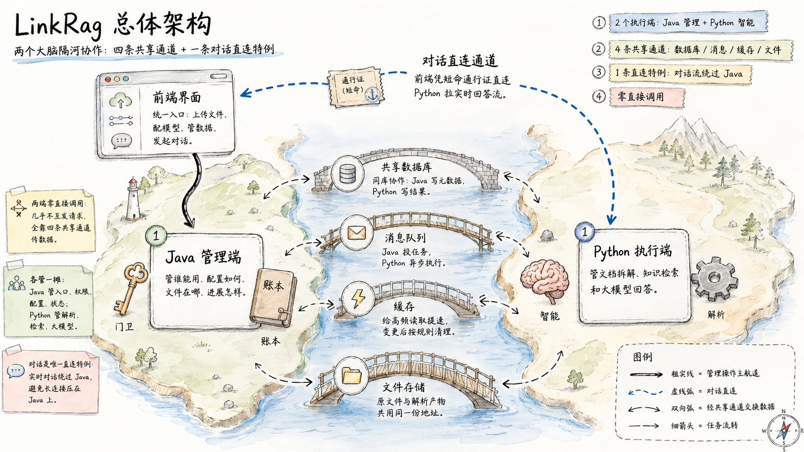
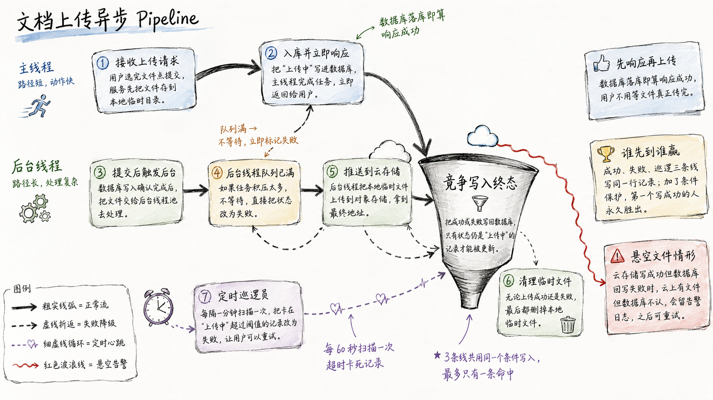
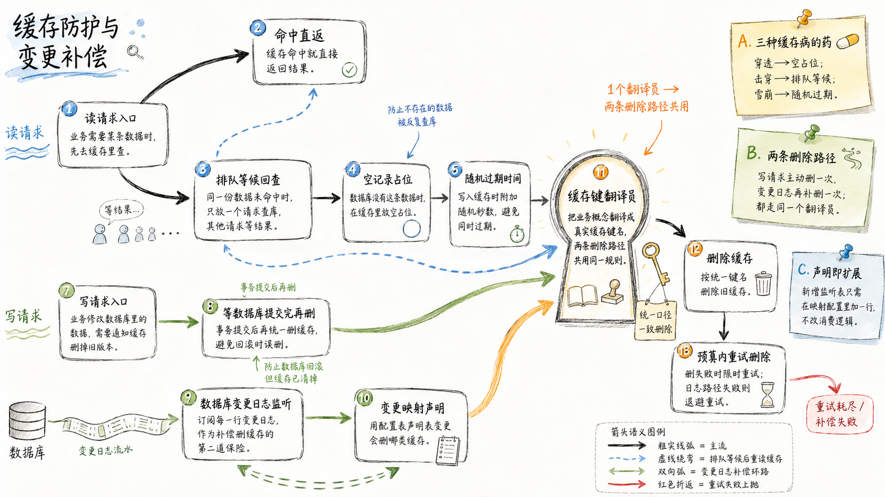
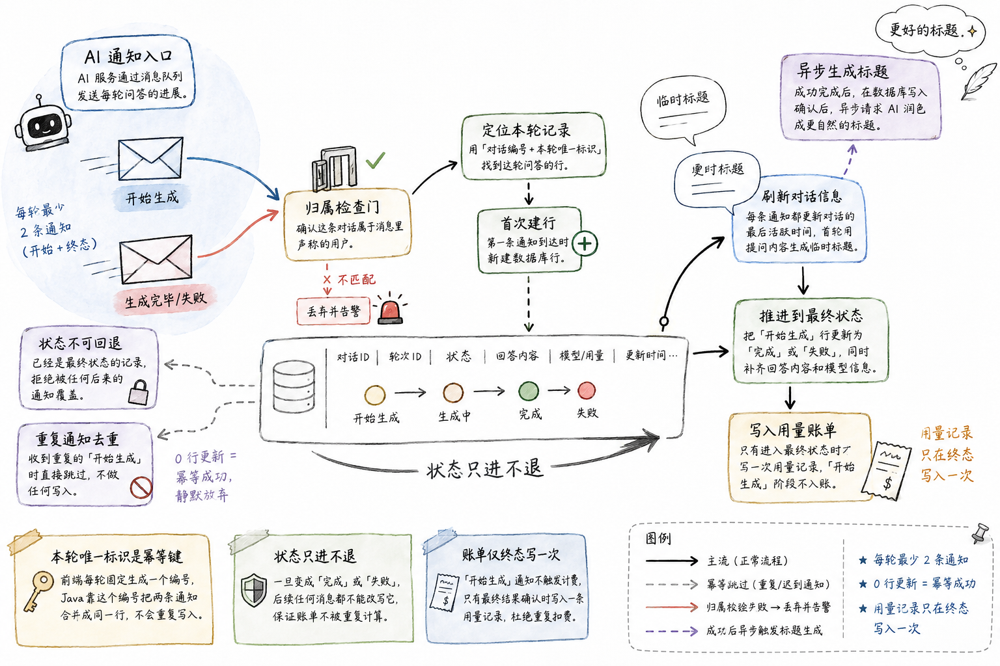
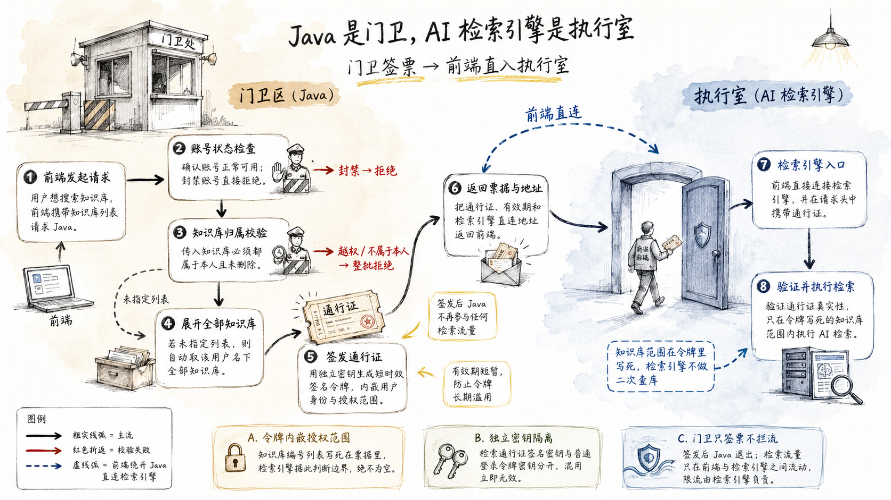
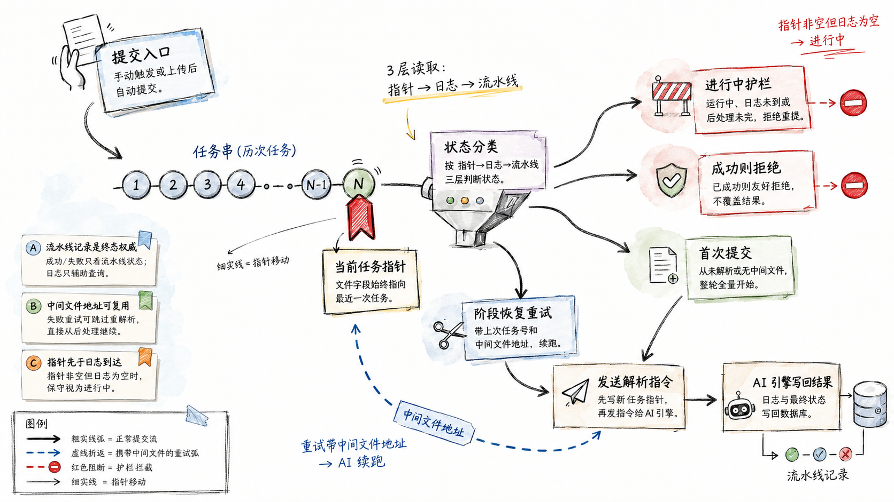
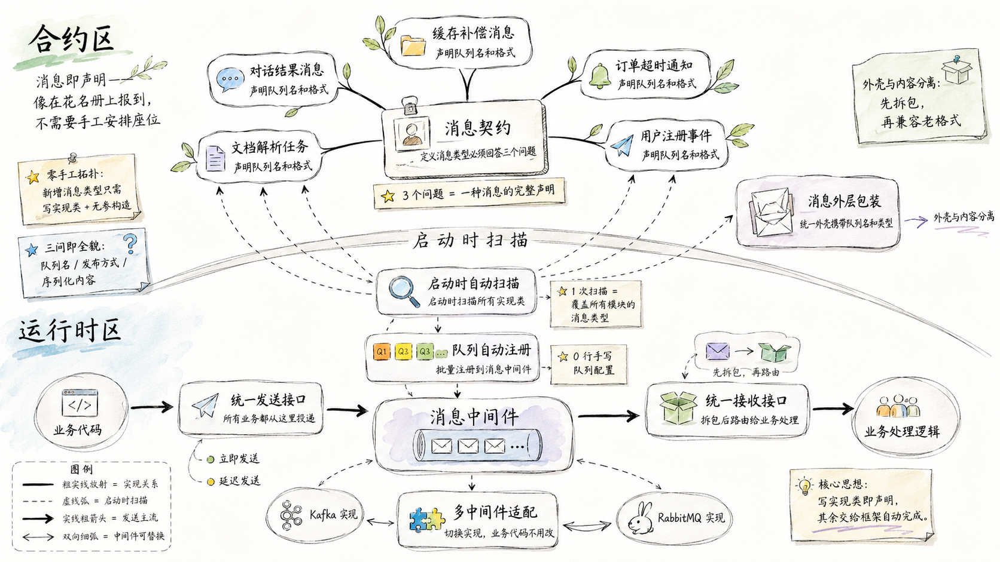

<div align="center">

# LinkRag-Service

The Java control plane for LinkRag — users, config, files, and task orchestration handled here, so Python can focus on RAG.

</div>

<p align="center">
  <a href="./README.md">简体中文</a> · <b>English</b>
</p>

<p align="center">
  
  
  
  
  
  
  
  
  
</p>

<p align="center">
  <a href="http://linkrag.cn/"></a>
</p>

<p align="center">
  
</p>

## What is LinkRag-Service?

`LinkRag-Service` is the **Java management end of the LinkRag system**. LinkRag is an enterprise-grade RAG system for everyone — turning complex documents into knowledge you can talk to — while the heavy lifting of parsing, chunking, vectorization, retrieval, and answer generation is handled by the Python RAG service ([ql-link/LinkRag](https://github.com/ql-link/LinkRag)).

This repo is the system's **control plane**: users and permissions, LLM configuration, chat and usage, datasets and knowledge files, object-storage entry, parse-task dispatch and result queries, cache consistency, and recall token issuance. Everything about "who can use it, how it's configured, where the files are, and how things are progressing" converges here, leaving Python to focus purely on "how to compute."

The whole system is a **Java management end + Python execution end** two-brain collaboration: the two ends never call each other directly, coordinating entirely through four shared channels — a shared MySQL database, message queue, Redis cache, and OSS/MinIO files. Java dispatches parse tasks; Python executes and writes terminal states back to the shared database, which the frontend reads via Java polling. The one real-time exception is the chat stream — the frontend connects directly to Python with a short-lived token signed by Java. See [docs/internals/project_structure.md](docs/internals/project_structure.md) for boundaries and module detail.

## Engineering Highlights

A control plane may look like "CRUD plus forwarding," but keeping state correct in a real environment that is highly concurrent, cross-process, and prone to jitter is engineering trade-offs all the way down. These six are where LinkRag-Service departs from an ordinary CRUD backend.

**1. Respond on upload, persist in the background — Async Document Upload Pipeline**

With large-file uploads, users dread staring at a progress bar only to lose everything when the connection drops. LinkRag-Service splits "persist" from "push the bytes": the request thread only writes metadata and returns immediately, while the actual object-storage push runs asynchronously on a background pool after the transaction commits — never holding a database transaction. Three lines — background upload, queue-full rejection, and a periodic sweeper — all converge on one "state-guarded" write, each carrying a `only if status is still uploading` condition: first writer wins, late arrivals no-op, idempotent by nature. In-flight tasks orphaned by a process restart are reclaimed to `failed` by a once-a-minute sweep so the user can retry.

<p align="center">
  
</p>

**2. Three cache failure modes, one guard; cache stays eventually consistent — Read Protection & Change Compensation**

Under high concurrency, caches fail in three classic ways: missing data hammering the DB (penetration), a hot key expiring under concurrent reload (breakdown), and masses of keys expiring at once (avalanche) — plus reading stale cache after an update. LinkRag-Service treats all three through one unified entry: a "null placeholder" blocks penetration, a per-key lock lets only one thread reload to block breakdown, and randomized TTL jitter blocks avalanche. The write path deletes on two tracks: once after the transaction commits, and once more via database-binlog CDC compensation — both routed through the same "cache-key translator," so key naming stays consistent and any miss on one track is reconciled by the other.

<p align="center">
  
</p>

**3. One turn, one clean row; billing never double-counts — Reliable Chat-Turn Persistence**

AI chat is asynchronous and streamed: Python sends several status messages per turn (start generating, completed / failed), cross-process, possibly out of order, possibly redelivered — one slip and you write duplicates, double-bill, or overwrite a finished record back to "generating." LinkRag-Service uses the per-turn stable identifier from the frontend as an idempotency key to merge all messages into the same row; the state machine only moves forward, and a terminal record refuses to be rewritten by any late message; the usage ledger is written exactly once on reaching a terminal state, with no billing during "generating." Ownership is enforced before persistence to rule out cross-user writes. However the messages are reordered or redelivered, the database always holds one clean row.

<p align="center">
  
</p>

**4. The control plane issues passes, not traffic — Recall Session Token Issuance**

Chat recall is a high-frequency, long-lived, high-volume SSE stream; routing it through the Java management end as a proxy would drown the control plane in long connections. LinkRag-Service steps back to a "gatekeeper" role: after validating login state, account status, and dataset ownership, it signs a short-lived token with a dedicated key, baking the authorized dataset scope into the token; the frontend then connects directly to Python with the token, and Java stays entirely off the data path — abuse is bounded by Python's per-user concurrency limit. The control plane does only lightweight auth and issuance, leaving the long-connection load to the dedicated execution end.

<p align="center">
  
</p>

**5. Resume parsing from the breakpoint, not from scratch — Parse Task & Retry Chain**

Parsing one document passes through many stages; a single step failing on external-service jitter can waste the user's wait, while duplicate submits and concurrent redelivery can scramble the task. LinkRag-Service keeps a "current task pointer" per file and, on submission, reads three layers — pointer → parse log → pipeline status — to classify first-time / retry / running / succeeded; running and succeeded are intercepted outright to avoid duplicate dispatch. On retry it reuses the intermediate file produced last round and carries the previous task id, letting Python skip completed stages and resume from the breakpoint; the terminal verdict trusts only the authoritative pipeline status, immune to replica lag.

<p align="center">
  
</p>

**6. One class per message type, topology auto-registers — Message Queue Abstraction**

As messages multiply, hand-maintaining topic declarations and bindings is tedious and easy to miss; switching MQ vendors becomes a whole-body operation. LinkRag-Service lets each message type implement one contract interface answering three things — what the queue is called, queue or broadcast, how the body serializes; at startup it scans every implementation and batch-registers the topology into Kafka, with zero config files. Sending and consuming each have a unified facade, and the Kafka and RabbitMQ implementations share one interface — switching vendors swaps the injected implementation while business code stays untouched. Adding a message type costs almost nothing, and the topology is never under-declared.

<p align="center">
  
</p>

## Live Demo

Live site: [http://linkrag.cn/](http://linkrag.cn/). Upload documents, auto-build a knowledge base, ask questions about the content, and get answers streamed token by token with traceability back to source passages — every upload, configuration, and chat you trigger in the UI is backed by this repo for entry, auth, task orchestration, and status queries.

## Related Repositories

LinkRag is built from three collaborating repositories:

| Repository | Role |
| --- | --- |
| [ql-link/LinkRag](https://github.com/ql-link/LinkRag) | Python RAG service: parsing, chunking, vectorization, indexing, and recall |
| [ql-link/LinkRag-Service](https://github.com/ql-link/LinkRag-Service) (this repo) | Java management end: users, config, file entry, task dispatch, and terminal-state collection |
| [ql-link/LinkRag-Web](https://github.com/ql-link/LinkRag-Web) | Frontend: knowledge-base management and interaction |

## Architecture Tour

LinkRag-Service is a multi-module Maven project, with dependencies reused top-down layer by layer:

```text
link-api         # Controllers and the Spring Boot entry point
link-service     # Core business services (user / config / dataset / file / parse / usage / recall / cache compensation)
link-mapper      # MyBatis-Plus mappers
link-components  # Redis / MQ / OSS cross-cutting components
link-core        # Exceptions, global exception handling, auth context, crypto and base utilities
link-model       # Entities, request / response DTOs, enums, unified response model
```

For the four shared channels and detailed boundaries between the two ends, see the internal docs:

- [project_structure.md](docs/internals/project_structure.md) — module boundaries and dependency direction
- [cache_module.md](docs/internals/cache_module.md) — Redis read protection, synchronous deletion, and CDC compensation
- [mq_module.md](docs/internals/mq_module.md) — MQ component abstraction and topology auto-registration
- [object_storage_module.md](docs/internals/object_storage_module.md) — OSS / MinIO object storage
- [document_file_module.md](docs/internals/document_file_module.md) — knowledge-file upload and parse collaboration

## Tech Stack

| Category | Technology |
| --- | --- |
| Language | Java 17 |
| Framework | Spring Boot 2.5.3 |
| Build | Maven multi-module |
| ORM | MyBatis-Plus |
| Auth | Sa-Token |
| Database | MySQL 8 (shared database `tolink_rag_db`) |
| Cache | Redis / Lettuce |
| MQ | Kafka / RabbitMQ component abstraction (Kafka by default) |
| Files | Local storage / MinIO OSS component |
| Testing | JUnit 5, Mockito, SpringBootTest, MockMvc |

## Quick Start

### 1. Initialize the database

```bash
mysql -h <DB_HOST> -u root -p < scripts/db/init.sql
mysql -h <DB_HOST> -u root -p < scripts/db/seed_llm_providers.sql
```

> The authoritative source for the database schema is the Python side's Alembic migrations; `scripts/db` here only keeps the local/test table initializer and provider seed.

### 2. Configure environment variables

Core variables (full reference in [docs/ops/configuration.md](docs/ops/configuration.md)):

| Variable | Description |
| --- | --- |
| `DB_HOST` / `DB_PORT` / `DB_NAME` / `DB_USERNAME` / `DB_PASSWORD` | MySQL connection |
| `REDIS_HOST` / `REDIS_PORT` / `REDIS_PASSWORD` / `REDIS_DB` | Redis connection |
| `KAFKA_BOOTSTRAP_SERVERS` | Kafka address |
| `TOLINK_MQ_VENDOR` | MQ implementation, default `kafka` |
| `OSS_SERVICE_TYPE` / `OSS_FILE_ROOT_PATH` / `OSS_MINIO_*` | OSS implementation and config |
| `LLM_SECRET` | API key encryption secret, 64-char hex string |

### 3. Run and test

```bash
mvn spring-boot:run -pl link-api    # start the service, default port 8080

mvn clean test                      # full test suite
mvn -pl link-service test           # single-module tests
```

### 4. Containerized deployment

```bash
cd deploy
docker compose up -d
```

The service connects to external MySQL / Redis / Kafka / OSS via environment variables; see [docs/ops/deployment.md](docs/ops/deployment.md).

## Documentation

Full navigation in [docs/README.md](docs/README.md). Common entries:

- **Contracts**: [API](docs/api/api_contracts.md) / [MySQL Schema](docs/api/mysql_schema.md) / [MQ messages](docs/api/mq_contracts.md) / [error codes](docs/api/error_codes.md)
- **Internals**: [project_structure](docs/internals/project_structure.md) / [cache_module](docs/internals/cache_module.md) / [mq_module](docs/internals/mq_module.md) / [object_storage_module](docs/internals/object_storage_module.md) / [document_file_module](docs/internals/document_file_module.md)
- **Ops & config**: [configuration](docs/ops/configuration.md) / [deployment](docs/ops/deployment.md) / [integration](docs/ops/integration.md)
- **Contributing**: [docs/contributing.md](docs/contributing.md) — branching, commits, testing, doc sync, Spec-as-Test flow
- **Project entry (AI / newcomers)**: [CLAUDE.md](CLAUDE.md)

## License

Released under the [MIT License](LICENSE).
