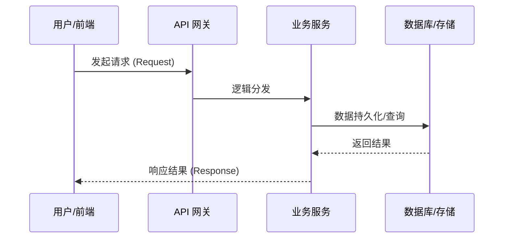
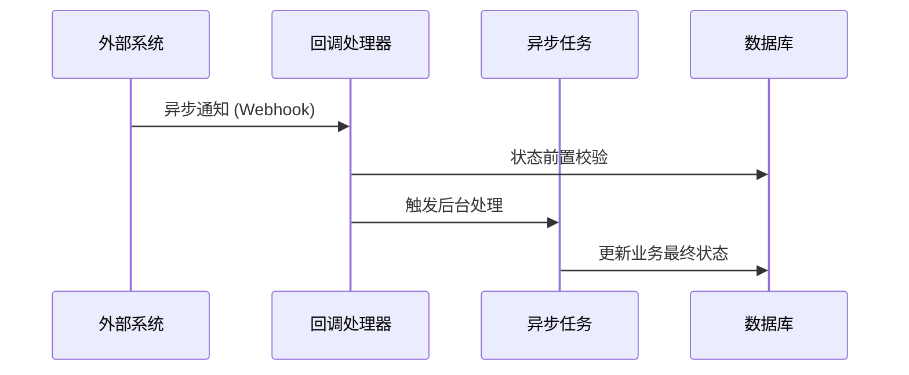

# [产品/项目名称] 产品需求文档 (PRD)

> **文档状态：** [草稿 / 评审中 / 已定稿 / 开发中]  
> **项目名称**：[项目名称]
> **模块名称**：[模块名称]
> **分支名称**：[分支名称]
> **产品负责人：** [你的名字]  
> **最后更新时间：** YYYY-MM-DD

---

## 1. 文档修订记录 (Change Log)
*规范：任何需求变更必须在此记录，杜绝口头需求。*

| 版本号 | 修改日期 | 修改内容简述 | 提出人 | 审核人 |
| :--- | :--- | :--- | :--- | :--- |
| v1.0 | 202X-XX-XX | 初始版本创建 | [姓名] | [姓名] |

---

## 2. 需求背景与业务目标 (Overview)

### 2.1 业务概览与核心逻辑 (Business Overview)
*对本模块的业务逻辑进行整体性描述，阐述其在系统中的定位及核心业务链路。*
* **业务定位：** 描述该模块在整体业务体系或系统架构中所扮演的核心角色。
* **核心逻辑主线：** 串联本需求的关键业务环节，描述从触发开始到业务终结的完整闭环逻辑。
* **核心价值：** 简述该业务逻辑实现后解决的关键问题或带来的业务增益。

### 2.2 核心节点目标与验收准则 (Key Milestones)
*明确本需求中各个关键业务节点预期达成的具体功能状态。*

| 核心功能节点 | 预期达成目标 | 关键验收点 (DoD) |
| :--- | :--- | :--- |
| **[节点 A：如支付请求发起]** | 成功构建请求并实现 [XX 逻辑] | 1. [关键表] 成功落库且状态正确；2. 接口返回符合预期报文 |
| **[节点 B：如异步通知处理]** | 能够准确处理 [XX 回调] 并触发后续 [XX 动作] | 1. 业务状态机流转至 [XX 状态]；2. 触发关联服务的 [XX 接口] |
| **[节点 C：如向量索引同步]** | 完成 [XX 增量数据] 的向量化并更新至 [Qdrant] | 1. 索引集合（Collection）计数更新；2. 检索响应 Top-K 命中率符合业务预期 |
| **[通用逻辑：幂等与一致性]** | 确保所有核心写接口在 [XX 场景] 下的幂等性 | 1. 重复请求时系统返回 [XX 错误/结果] 且不产生重复数据 |

---

## 3. 核心架构与业务流程 (Architecture & Flow)

### 3.1 核心业务时序图 (Sequence Diagrams)
*说明：本节由 AI 根据业务逻辑自动生成 Mermaid 时序图。若涉及多个核心功能或复杂异步链路，请分别提供。*

#### 场景 1：[功能名称 A - 逻辑主线]

#### 场景 2：[功能名称 B - 异步/补偿链路]

### 3.2 状态机定义 (State Machine)
*梳理核心业务对象的状态流转规则（如订单流转、文档解析状态）。*

| 当前状态 | 触发动作/条件 | 流转后状态 | 备注/逆向逻辑 |
| :--- | :--- | :--- | :--- |
| 待处理 | 用户发起请求 | 处理中 | 超时 15 分钟自动转为“已取消” |
| 处理中 | 异步回调成功 | 成功 | 若遇冲突触发冲突检测算法 |

---

## 4. 功能规格与交互逻辑 (Functional Specs)

### 4.1 页面交互与功能示意 (UI & Functionality)
* **核心功能需求：** 简述本模块需要实现的具体业务功能点，明确用户操作路径。
* **界面参考：** *(此处由开发者附上对应页面的截图或 UI 原型图，作为功能对接的视觉参考)*
    * 

### 4.2 接口契约规范
| 维度 | 要求与标准 | 备注 |
| :--- | :--- | :--- |
| **通讯协议** | 统一 RESTful API，JSON 格式交互，遵循小驼峰命名 | 适配现有前端调用规范 |
| **数据格式** | 金额（分/Long）、时间戳（ISO 8601）、枚举（Code/String） | 确保精度与国际化标准 |
| **异常处理** | 全局统一错误码体系，异常时下发 `toast_message` | 前端默认直接透传业务提示 |
| **异步机制** | 长时任务必须支持状态轮询或 Webhook 回调 | 配合前端 Loading 与进度展示 |

### 4.3 核心业务逻辑 (按模块拆分)
*说明：请按业务领域或微服务模块对核心逻辑进行拆分描述，每个模块必须包含以下统一维度：*

#### 模块 A：[模块名称，如：计费引擎]
* **业务逻辑概述：** 简述该模块承担的核心职责、处理流程及在整体业务流中的上下游位置。
* **核心处理规则：** 详述模块内部的业务算法、逻辑判断准则、数据转换规格及关键前置校验条件。
* **数据持久化规格：** 简述该模块涉及的核心实体变更、表结构调整建议（对应第 5 节）及关键字段的落库映射逻辑。
* **并发与一致性：** 明确高并发下的锁策略（分布式锁/乐观锁）、接口幂等方案及跨服务的数据一致性保障。
* **异常流与降级：** 定义模块特有的业务异常处理路径、自动重试机制及在依赖失效时的降级/兜底策略。

#### 模块 B：[模块名称]
* **业务逻辑概述：** 描述该模块处理的具体业务定位。
* **核心处理规则：** 详述具体的功能实现逻辑。
* **数据持久化规格：** 描述数据存储与实体变更规格。
* **并发与一致性：** 描述该模块在技术层面的保障措施。
* **异常流与降级：** 描述该模块的容错与兜底方案。

---

## 5. 数据契约与存储约束 (Data & Storage)

### 5.1 数据模型与实体关系 (E-R)
*简述核心实体间的映射关系。*
* 例如：`文档 (Document)` 1:N `问答对 (QA Pair)`。

### 5.2 数据库组件与表结构变更 (Database & Schema Changes)
*明确本需求涉及的底层存储组件及结构调整。*

**涉及存储组件清单：**
* [ ] MySQL（关系型核心业务数据）
* [ ] Redis（高频热数据缓存/分布式锁）
* [ ] Kafka（异步解耦/流计算）
* [ ] Qdrant（向量检索）
* [ ] MinIO（对象存储）
* [ ] Elasticsearch（全文检索）
* [ ] 其他：__________

**表结构/Schema 变更明细：**
*(注：任何涉及新增表、新增字段、修改字段类型的操作必须在此列出)*

#### MySQL 变更
| 库名 / 表名 | 变更类型 | 核心字段说明 / 变更详情 | 备注要求 |
| :--- | :--- | :--- | :--- |
| `pay_db` / `order_info` | 新增字段 | 新增 `channel_id` (varchar), `status` (int) | `channel_id` 需加普通索引 |

#### Redis 变更
| Key 名 | 变更类型 | 核心字段说明 / 变更详情 | 备注要求 |
| :--- | :--- | :--- | :--- |
| `cache:user:config:*` | 新增 Key | 存储用户基础配置，String 类型 | TTL 设置为 24 小时 |

#### Kafka 变更
| Topic 名 | 变更类型 | 核心字段说明 / 变更详情 | 备注要求 |
| :--- | :--- | :--- | :--- |
| `topic_rag_doc_parsed` | 新增 Topic | 存储文档解析完成的异步事件流 | 需保证分区顺序消费 |

#### Qdrant 变更
| 集合名 | 变更类型 | 核心字段说明 / 变更详情 | 备注要求 |
| :--- | :--- | :--- | :--- |
| `collection_qa_vectors` | 新建集合 | 包含 `vector` (FloatVector), `doc_id` (Int64) | 维度：1024，索引类型：HNSW |

### 5.3 缓存与持久化策略
* **热数据归档：** 高频访问数据在 Redis 中的淘汰策略（如 LRU）及过期时间规划。
* **冷数据处理：** 历史操作日志或超期流水明细的归档机制。

---

## 6. 异常处理与非功能性需求 (Exceptions & NFR)

### 6.1 稳定性与降级策略 (Reliability & Fallback)
* **外部依赖兜底：** 详述当第三方 API 或核心中间件（如 Redis、MQ）出现超时、故障或宕机时的降级方案（如：走缓存兜底、异步重试或提示业务维护中）。
* **重试与限流：** 定义关键链路的重试次数、指数退避策略（Backoff）以及防刷/限流阈值。
* **补偿机制：** 针对异步处理失败导致的数据不一致，定义自动补偿脚本或人工接入的 SOP。

### 6.2 性能与扩展性要求 (Performance & Scalability)
* **性能指标：** 核心接口 TP99 < [数值]ms，TP95 < [数值]ms。
* **吞吐能力：** 单机及集群预期需支撑的峰值 QPS/TPS 目标。
* **资源消耗：** 预期的 CPU、内存、磁盘 IO 使用率上限及扩容触发条件。

### 6.3 可观测性、安全与合规 (Security & Observability)
* **监控与报警：** 核心业务链路必须实现 Trace ID 全链路追踪，并针对特定错误码配置实时报警。
* **数据脱敏：** 敏感字段（手机号、身份证、密钥等）在日志记录及前端展示时的掩码规则。
* **权限审计：** 明确功能权限（RBAC）及数据行级权限的校验规则，确保越权防御。

### 6.4 数据埋点与运营要求
* **核心埋点：** 需要追踪的关键转化事件、用户行为埋点及其属性字段定义。

---

## 7. 遗留问题与依赖项 (Dependencies & Open Issues)

* **前置依赖：** 需等待 [XX 团队] 的 [XX 接口] 联调完毕（预计 X 月 X 日）。
* **待确认事项：** [记录在评审会议中未决定的事项及跟进人]。