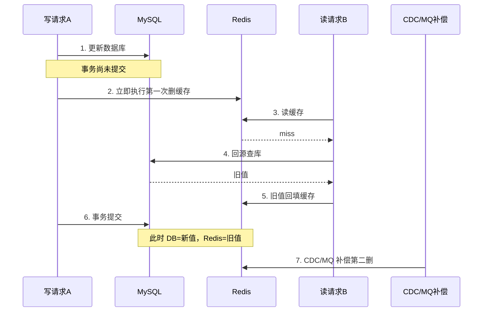
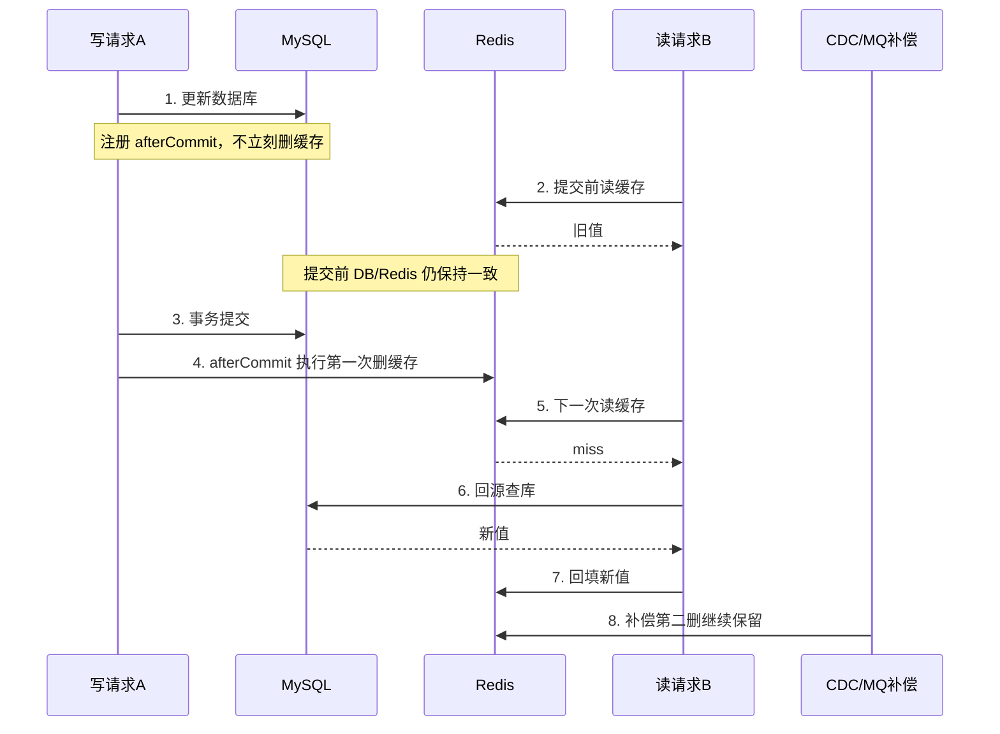

# cache-evict-after-commit Brief

> 来源：Linear issue LINKS-15「延迟双删优化建议」。
> 本 Brief 已对照真实代码核实现状：当前项目的缓存一致性整体采用“主流程删缓存 + CDC/MQ 补偿二删”的旁路缓存方案，整体方向成立；本次需求聚焦于把事务场景下的**第一次删缓存时机**从“事务方法体内”调整为“事务真正提交后”。

## 1. 需求摘要

### 做什么

- 优化主流程第一次删缓存的触发时机：当写请求处在 Spring 事务中时，不再立即删缓存，而是在事务成功提交后再执行第一次删除。
- 保持非事务写路径兼容：没有事务时，仍然按当前方式在写库成功后立即删缓存。
- 保留现有 CDC / MQ 补偿二次删除：`tolink.cache.evict` 继续作为最终一致性的补偿兜底，不改消息契约和消费职责。
- 把时机控制统一下沉到缓存一致性组件层，业务层继续复用原有删缓存入口。

### 为什么做

- 当前方案的问题不在“双删思路”，而在于**事务场景下首删发生得过早**：数据库事务尚未真正提交，缓存已经先被删掉了。
- 在这种窗口里，并发读请求更容易因为缓存 miss 回源数据库，并把**事务提交前的旧值**重新写回 Redis。
- 这会放大短暂不一致窗口，让补偿二删从“兜底”退化成“高频救火”。
- 如果事务最终回滚，提前删缓存虽然通常不会制造最终脏数据，但会带来无意义的 cache miss 和 DB 回源。
- 本次优化追求的不是“让旧缓存尽快消失”，而是**尽量缩小 DB 与 Redis 对外不一致的窗口**。事务提交前即使旧缓存多存活一会儿，只要此时数据库对外也仍是旧值，就比“提前删缓存导致脏回填”更可控。

### 本次不做

- 不改为“直接更新缓存”模式。
- 不引入分布式锁、版本号、CAS、outbox 或强一致缓存事务方案。
- 不重构 `tolink.cache.evict` 的 topic、消息结构、消费者职责和补偿时序。
- 不修改缓存 key 路由规则，也不调整现有缓存目标的覆盖范围。
- 不承诺消除所有最终一致性窗口；本次目标是**缩小事务前后竞态导致的不一致窗口**。

## 2. 业务流程

### 2.1 主流程图

**当前问题流程：事务未提交，缓存已先删**

**目标流程：事务提交后再执行第一次删缓存**

### 2.2 流程详解

- 当前缓存一致性链路已经具备两个阶段：
  - 主流程写库后删缓存
  - 外部数据库变更事实到达后做补偿二删
- 本次不改变“双删”结构，只改变第一删的时机：
  - **有事务**：事务提交成功后再删
  - **无事务**：保持当前立即删
- 这样可以让事务提交前对外仍保持“旧库 + 旧缓存”的一致状态，避免主动制造缓存 miss。
- 事务提交后第一次删缓存，后续读请求再回源时，更容易直接读到新值。
- 补偿第二删继续存在，用于兜底那些“第一次删除之后脏缓存仍然存活下来”的场景，例如首删失败、并发读把旧值重新写回缓存、外部数据库变更入口触发的补偿清理、多实例复杂竞态等。

## 3. 核心模块与实现思路

### 3.1 缓存一致性组件

- **位置**：`link-components` 下的 Redis 缓存一致性组件。
- **当前职责**：统一接收业务层的缓存驱逐请求，按逻辑目标路由出 Redis key，并执行主流程删除或补偿删除。
- **本次思路**：
  - 保持业务层调用入口不变。
  - 在组件层感知当前是否存在 Spring 事务。
  - 有事务时，把第一次删除延后到事务提交成功之后。
  - 无事务时，保持当前同步删除行为。
- **复用能力**：
  - 已有统一删缓存入口
  - 已有统一 key 路由
  - 已有补偿删除入口
  - 项目内已有成熟的 `afterCommit` 使用模式可复用

### 3.2 业务服务调用方

- **位置**：用户资料、管理员用户、系统 provider、用户 LLM 配置等写路径服务。
- **当前职责**：写库成功后调用统一缓存删除入口。
- **本次思路**：
  - 不要求业务服务自己判断事务状态。
  - 继续使用原有删缓存调用方式。
  - 让事务时机差异由底层组件统一承担。
- **收益**：
  - 改动面更小
  - 业务层无须重复实现事务判断
  - 后续新增缓存目标时不容易漏掉时机控制

### 3.3 补偿删除链路

- **位置**：缓存补偿 MQ 消费链路。
- **当前职责**：根据外部数据库变更事实再次删除对应缓存，清理并发窗口中可能残留的脏值。
- **本次思路**：
  - 消息契约、消费入口和补偿职责保持不变。
  - 不改成固定延时 sleep，也不改成异步重建缓存。
- **期望变化**：
  - 第二删仍保留
  - 但角色从“高频纠错主流程事务前首删问题”回归到“低频兜底”

### 3.4 性能影响判断

- **对写请求总耗时**：
  - 如果事务路径仍在 `afterCommit` 中同步执行删除，那么单次 Redis 删除成本并没有消失，只是从“事务提交前”移动到了“事务提交后”。
  - 因此接口 RT 预期大体仍是当前量级，不应出现明显数量级恶化。
- **对数据库事务时长**：
  - 当前模式下，删缓存及其重试等待发生在事务方法体内，会占用事务持续时间。
  - 改造后，数据库事务可以先提交，再执行第一次删缓存，因此事务持有时间预期会缩短。
- **对读路径与数据库回源**：
  - 事务提交前旧缓存仍可被命中，能减少提前删缓存带来的 cache miss、DB 回源和旧值回填。
  - 在读多写少场景下，这部分收益通常比写路径时序移动带来的成本更实际。
- **总体判断**：
  - 本次改动更像是把原有成本从“事务内”挪到“事务后”，同时减少读侧被动回源。
  - 在不引入额外异步线程和额外删除次数的前提下，整体性能预期应是中性到小幅正向，而不是显著负向。

### 3.5 事务语义与失败处理

- **当前职责**：主流程删缓存失败时，可按配置把请求判为失败。
- **本次需要明确的点**：
  - 当第一次删除延到事务提交后，删除失败时数据库事实上已经成功提交。
  - 无事务路径里，只要数据库写已经成功，第一次删缓存失败本质上也只是“缓存收敛延后”，并不改变业务写入已经生效的事实。
  - 因此如果继续把“第一次删缓存失败”直接等价为请求失败，会让主流程语义和补偿二删的设计目标互相打架。
- **当前判断**：
  - 只要数据库写已经成功，第一次删缓存失败统一按“日志/指标 + 补偿链路收敛”处理，不再回头改变请求结果。
  - 事务路径只是因为 afterCommit 时点，让“数据库已成功提交”这一事实更明确。

### 3.6 事务内待删 key 的组织方式

- **本次目标**：保证事务场景下第一次删缓存的执行时机正确，不改变业务层调用方式。
- **当前判断**：
  - 同一事务中可能多次触发 `evict(...)`，也可能命中重复 key。
  - 为避免重复注册回调、重复删除和日志噪音，倾向于在事务上下文中做待删 key 聚合与去重。
- **本次范围边界**：
  - 是否采用事务级 key 聚合与去重，作为实现方案优化项保留到 `technical_design.md` 收敛。
  - 这不改变 brief 的需求方向，也不影响 acceptance 阶段先定义对外可见行为。

## 4. 风险与不确定性

| 风险 / 问题 | 触发条件 | 影响 | 当前判断 / 应对方向 |
| :--- | :--- | :--- | :--- |
| 首删失败语义不清 | 数据库写成功后第一次删缓存失败 | 可能出现业务已生效但接口仍失败的歧义，或与补偿二删职责冲突 | 需要在 TD 中明确“数据库写成功后统一不改请求结果”的处理方式 |
| 同一事务里多次触发删缓存 | 一个业务动作会驱逐多个缓存目标 | 可能重复注册回调、重复删除相同 key | 需要在 TD 中评估是否做事务级 key 聚合与去重 |
| 读写间仍有极短窗口 | commit 完成到 afterCommit 真正执行之间 | 仍存在短暂最终一致性窗口 | 本次接受，目标是缩小窗口而不是追求强一致 |
| 性能收益被误判 | 把“旧缓存还存在”误解为性能倒退 | 可能错误地把方案否掉或做成过度异步化 | 需要明确：目标是缩小不一致窗口，写 RT 预期大体同量级，事务时长更短、读侧回源更少 |
| 无事务写路径被误伤 | 统一改造时忽略非事务场景 | 兼容行为丢失，低风险路径反而变慢或失效 | 需要把“无事务仍立即删”列为明确验收项 |
| 测试环境误判事务行为 | 单测绕过代理或没有真实事务边界 | 可能误以为 afterCommit 逻辑失效 | 需要在测试设计中区分真实事务场景和无事务场景 |
| 补偿链路被弱化 | 实施时只关注首删优化 | 极端场景失去最终兜底 | 需要在设计和验收中明确第二删保持不变 |

## 5. 已冻结决策

1. **首删失败语义**  
   选择方案 B（统一口径）：只要数据库写已经成功，第一次删缓存失败时，不再把请求整体判失败，而是记录日志/指标，并依赖补偿链路做最终收敛；事务路径只是更明确地暴露了这一事实。

2. **事务内待删 key 的组织方式**  
   选择方案 B：倾向于做事务级 key 聚合与去重；具体承载方式、去重粒度和回调组织方式留待 `technical_design.md` 收敛。

3. **阶段推进**  
   当前 brief 可视为已冻结，进入下一阶段，生成 `acceptance.feature`。
