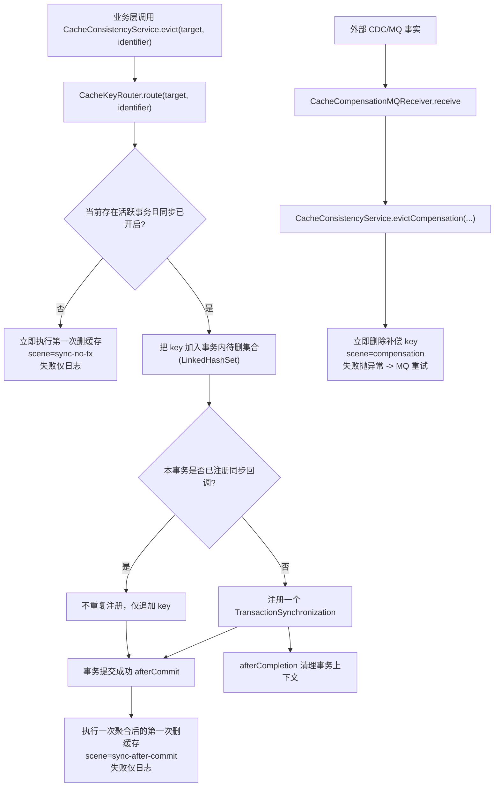

# 缓存首删时机调整为事务提交后执行 技术设计

- **文档状态：** 技术方案待审核
- **项目名称：** toLink-Service
- **业务域：** Redis 缓存一致性（cache-consistency）
- **需求名称：** cache-evict-after-commit
- **业务输入：** `docs/cache-evict-after-commit/brief.md`（已冻结 2026-06-02）
- **验收输入：** `docs/cache-evict-after-commit/acceptance.feature`（已冻结 2026-06-02，14 Scenario）
- **输出文件：** `docs/cache-evict-after-commit/technical_design.md`
- **最后更新时间：** 2026-06-02

---

## 1. 文档修订记录

| 版本号 | 修改日期 | 修改内容简述 | 来源/提出人 | 审核状态 |
| :--- | :--- | :--- | :--- | :--- |
| v1.0 | 2026-06-02 | 基于已冻结 brief 与 acceptance 生成初始技术设计 | brief.md + acceptance.feature | 待审核 |

---

## 2. 输入依据与设计目标

### 2.1 输入依据映射

| 输入来源 | 关键结论 | 技术设计承接方式 |
| :--- | :--- | :--- |
| `brief.md` | 主流程仍保留“双删”结构，只优化第一次删缓存时机；业务层调用入口不变；首删失败统一走日志/补偿收敛；倾向事务级 key 聚合去重 | §5 总体方案 + §7 方法级实现 |
| `acceptance.feature` | 14 Scenario 覆盖事务提交/回滚/并发读、无事务兼容、补偿二删、首删失败统一语义、多 key 删除正确性 | §7 方法级实现 + §10 测试映射逐条承接 |
| `docs/architecture/cache_module.md` | 当前缓存模块职责、读保护与补偿删除边界已存在 | §4 当前系统分析 + 文档同步 |
| `docs/reference/mq_contracts.md` | `tolink.cache.evict` 为既有补偿契约，本次不改消息结构 | §6.2 MQ 设计（明确不变） |

### 2.2 技术目标

- 在不修改业务层调用方式的前提下，让 `CacheConsistencyService.evict(...)` 具备事务感知能力：
  - 有事务时，第一次删缓存延后到 `afterCommit`
  - 无事务时，保持立即删除
- 保留 `CacheCompensationMQ -> CacheConsistencyService.evictCompensation(...)` 的补偿删除链路与强失败重试语义。
- 统一首删失败语义：只要数据库写已经成功，第一次删缓存失败都不再改变请求结果，而是记录日志并依赖补偿链路最终收敛。
- 在同一事务内对待删 key 做聚合与去重，避免重复注册回调、重复删除和日志噪音。
- 不改变 Redis key 路由、缓存目标覆盖范围、读保护与回填策略。

### 2.3 非目标

- 不引入直接更新缓存、版本号缓存、CAS、outbox、分布式锁或强一致缓存事务方案。
- 不修改 `tolink.cache.evict` 的 topic、消息字段、消费者职责和重试机制。
- 不新增数据库表、字段或索引。
- 不改业务 Service / Controller 的删缓存调用位置，只改缓存一致性组件内部时机控制。
- 不新增 Micrometer 指标；本次失败可观测性以结构化日志为主。

---

## 3. 改动范围

### 3.1 改动文件目录树

```text
toLink-Service/
├── link-components/toLink-components-redis/src/main/java/com/qingluo/link/components/redis/
│   ├── config/CacheConsistencyProperties.java                          # [修改] 补兼容说明：syncDeleteRequired 不再决定首删是否抛错
│   └── service/CacheConsistencyService.java                            # [修改] 核心改造：事务感知首删、afterCommit、事务级 key 聚合去重、统一首删失败语义
├── link-service/src/test/java/com/qingluo/link/service/cache/
│   └── CacheConsistencyServiceTest.java                                # [新增] 事务/无事务/失败语义/多 key 聚合与去重测试
├── link-service/src/test/java/com/qingluo/link/service/mq/
│   └── CacheCompensationMQReceiverTest.java                            # [新增] 补偿接收器仍调用 evictCompensation 的回归测试
├── docs/architecture/cache_module.md                                   # [修改] 更新首删时机与失败语义
├── docs/guides/configuration.md                                        # [修改] 增补 cache-consistency 配置说明与 syncDeleteRequired 兼容语义
└── docs/cache-evict-after-commit/feature_info.md                       # [修改] technical_design 生成后的阶段状态
```

### 3.2 文件级改动说明

| 文件 | 动作 | 改动目的 | 是否必须 |
| :--- | :--- | :--- | :--- |
| `CacheConsistencyService.java` | 修改 | 引入事务感知首删、事务级 key 聚合去重、统一首删失败语义 | 是 |
| `CacheConsistencyProperties.java` | 修改 | 说明 `syncDeleteRequired` 对首删的兼容语义变化，避免配置误导 | 是 |
| `CacheConsistencyServiceTest.java` | 新增 | 验证事务提交/回滚/无事务/失败语义/多 key 聚合 | 是 |
| `CacheCompensationMQReceiverTest.java` | 新增 | 验证补偿接收链路不回归 | 建议 |
| `docs/architecture/cache_module.md` | 修改 | 同步缓存模块真实语义 | 是 |
| `docs/guides/configuration.md` | 修改 | 同步配置行为变化 | 是 |
| `feature_info.md` | 修改 | 阶段推进记录 | 是 |

---

## 4. 当前系统分析

| 类型 | 文件/类/方法 | 当前行为 | 问题或复用点 |
| :--- | :--- | :--- | :--- |
| 组件 | `CacheConsistencyService.evict(...)` | 不判断事务状态，路由完 key 后立即 `redisTemplate.delete(keys)`；是否抛错由 `syncDeleteRequired` 决定 | 问题根源：事务未提交时就删缓存，且首删失败可直接影响请求结果 |
| 组件 | `CacheConsistencyService.evictCompensation(...)` | 路由后立即删除，失败抛异常，交 MQ 重试 | 复用点：补偿链路语义无需改变 |
| 组件 | `CacheConsistencyService.deleteKeysWithinBudget(...)` | 在时间预算内快速重试，`alwaysThrow=false` 时仅日志，`true` 时抛 `CACHE_DELETE_FAILED` | 复用点：失败重试与日志逻辑已存在；首删只需改调用策略 |
| 组件 | `CacheKeyRouter.route(...)` | 统一把逻辑目标转换成一个或多个 Redis key | 复用点：多 key 路由已具备；本次只需保证全部 key 最终被删 |
| 配置 | `CacheConsistencyProperties.syncDeleteRequired` | 当前控制主流程首删失败是否抛错 | 语义将变化：首删不再读取该开关，需文档澄清兼容性 |
| 业务服务 | `UserLLMConfigServiceImpl` 多个 `@Transactional` 写方法 | 在事务方法体内直接调用 `cacheConsistencyService.evict(...)` | 证明 issue 中“事务前首删”是当前真实行为 |
| 业务服务 | `AdminProviderServiceImpl` 等无事务写路径 | DB 写成功后直接调用 `cacheConsistencyService.evict(...)` | 说明无事务路径也存在“DB 成功后首删失败”的独立语义问题 |
| 读保护 | `CacheReadProtectionService.getOrLoad(...)` | 缓存 miss 时回源 DB 并回填 Redis | 解释为什么事务前首删会放大旧值回填 |
| MQ 接收 | `CacheCompensationMQReceiver.receive(...)` | 只做消息到 `evictCompensation(...)` 的薄转换 | 复用点：无须侵入补偿接收层 |
| 文档 | `docs/architecture/cache_module.md` | 仍声明 `sync-delete-required=true` 时主流程首删失败必须向上抛出 | 需要与新语义同步 |

---

## 5. 总体方案设计

### 5.1 总体流程



### 5.2 模块边界

| 模块 | 职责 | 本次是否改动 |
| :--- | :--- | :--- |
| `toLink-components-redis` | 首删、补偿删、key 路由、配置 | 是（核心改造） |
| `link-service` | 业务写路径调用方、补偿接收器 | 代码不改，测试补充 |
| `link-api` | 对外接口层 | 不改 |
| `docs/architecture` | 缓存模块行为说明 | 是 |
| `docs/guides` | 配置行为说明 | 是 |

### 5.3 关键设计决策

1. **首删失败统一语义**
   - 只要数据库写已经成功，第一次删缓存失败统一只记录日志，不再抛业务异常。
   - 该规则同时适用于：
     - 事务路径 `afterCommit`
     - 无事务路径的“DB 写已成功 -> 立即首删”

2. **补偿删除强失败语义保留**
   - `evictCompensation(...)` 继续失败抛异常，交 MQ 重试，保持最终一致性兜底能力。

3. **事务级 key 聚合与去重**
   - 事务中多次调用 `evict(...)` 时，不重复注册多个 `afterCommit` 回调。
   - 使用事务上下文中的 `LinkedHashSet<String>` 聚合待删 key，保持去重和可读日志顺序。

4. **`syncDeleteRequired` 兼容保留但不再控制首删**
   - 配置项为兼容现有 yml 与绑定测试继续保留。
   - 但 `evict(...)` 不再读取它来决定是否抛错。
   - `evictCompensation(...)` 与 `evictDirect(...)` 仍保持强失败语义。

---

## 6. API、消息与数据设计

### 6.1 API 设计

- **无对外 API 改动**。
- Controller、Request/Response DTO、接口路径、HTTP 返回码均不因本需求新增或变更。

### 6.2 MQ 消息设计

- **无 MQ 契约改动**。
- `CacheCompensationMQ` 的 topic `tolink.cache.evict`、字段结构、方向与消费者入口保持不变。
- 文档层仅需强调：补偿第二删继续承担最终兜底职责。

### 6.3 Redis、数据与配置设计

- **Redis key 设计**：
  - 无新增 key 前缀。
  - `CacheKeyRouter` 路由结果保持不变。
- **事务内暂存结构**：
  - 新增事务上下文内的待删 key 集合（内存态，不落 Redis / DB）。
  - 采用 `LinkedHashSet<String>`，兼顾去重与日志可读顺序。
- **数据库与持久化**：
  - 无表结构变化、无数据迁移。
- **配置影响**：
  - `tolink.cache-consistency.sync-delete-required` 保留绑定兼容，但不再影响 `evict(...)` 的首删失败语义。
  - `syncDeleteMaxWaitMs`、`syncDeleteRetryIntervalMs` 仍控制删除重试预算。

---

## 7. 方法级实现方案

### 7.1 方法级变更总表

| 文件 | 类/对象 | 方法/成员 | 动作 | 入参变化 | 返回变化 | 改动目的 | 对应 Scenario |
| :--- | :--- | :--- | :--- | :--- | :--- | :--- | :--- |
| `CacheConsistencyService.java` | `CacheConsistencyService` | `evict(CacheEvictTarget, Object)` | 修改 | 无 | 无 | 首删事务感知 + 统一失败语义 | 事务写请求在提交前不删除缓存；事务成功提交后才执行第一次删缓存；事务回滚时不执行第一次删缓存；无事务写路径仍在写库成功后立即删缓存；无事务路径数据库写成功后首删失败不改变请求结果 |
| `CacheConsistencyService.java` | `CacheConsistencyService` | `evictCompensation(CacheEvictTarget, Object)` | 不改 | 无 | 无 | 保持补偿第二删强失败语义 | 补偿消息到达后仍按原逻辑删除对应缓存；首删后仍残留的脏缓存会被补偿第二删清理；外部数据库变更事实仍可单独触发补偿删除 |
| `CacheConsistencyService.java` | `CacheConsistencyService` | `evictDirect(Collection<String>)` | 不改 | 无 | 无 | 保持显式直接删除的强失败语义 | 无直接 Scenario，作为现有特殊场景兼容接口保留 |
| `CacheConsistencyService.java` | `CacheConsistencyService` | `deleteKeysWithinBudget(Collection<String>, boolean, String)` | 修改 | 无 | 建议保留 `void` | 按不同 scene 复用预算重试；首删仅日志，补偿继续抛错 | 无事务路径数据库写成功后首删失败不改变请求结果；数据库写成功后首删失败统一记录并交补偿链路收敛 |
| `CacheConsistencyService.java` | `CacheConsistencyService` | `collectOrDeleteNow(Collection<String>)` | 新增 | `Collection<String>` | `void` | 根据事务状态分发“立即删”或“收集到事务上下文” | 事务写请求在提交前不删除缓存；无事务写路径仍在写库成功后立即删缓存 |
| `CacheConsistencyService.java` | `CacheConsistencyService` | `registerAfterCommitIfNeeded(DeferredFirstDeleteHolder)` | 新增 | holder | `void` | 每事务只注册一次同步回调 | 同一事务内多次触发删缓存后最终结果正确 |
| `CacheConsistencyService.java` | `CacheConsistencyService` | `flushDeferredFirstDelete(DeferredFirstDeleteHolder)` | 新增 | holder | `void` | afterCommit 聚合删除全部待删 key | 一个逻辑目标映射到多个缓存键时全部被删除；同一事务内多次触发删缓存后最终结果正确；事务路径下 afterCommit 删除失败不改变成功请求结果 |
| `CacheConsistencyService.java` | `CacheConsistencyService` | `DeferredFirstDeleteHolder`（内部类） | 新增 | - | - | 事务级 key 聚合与去重 | 同一事务内多次触发删缓存后最终结果正确 |
| `CacheConsistencyProperties.java` | `CacheConsistencyProperties` | `syncDeleteRequired` 注释/兼容说明 | 修改 | 无 | 无 | 明确该开关不再控制主流程首删是否抛错 | 无直接 Scenario；承接文档与配置一致性 |

### 7.2 逐方法实现设计

#### 7.2.1 `CacheConsistencyService.evict(CacheEvictTarget, Object)`（修改）

- 当前行为：
  - 路由出 key 后立即调用 `deleteKeysWithinBudget(keys, properties.isSyncDeleteRequired(), "sync")`
- 修改后职责：
  - 统一承接“数据库写成功后的第一次删缓存”
  - 按事务状态选择“立即删”或“延后到 afterCommit”
  - 首删失败一律不再向上抛业务异常
- 入参：
  - 不变：`target`、`identifier`
- 返回：
  - 不变：`void`
- 详细步骤：
  1. 若 `properties.enabled=false`，保持当前直接跳过。
  2. 调用 `cacheKeyRouter.route(target, String.valueOf(identifier))`。
  3. 若 key 为空，直接返回。
  4. 调用新私有方法 `collectOrDeleteNow(keys)`：
     - 无事务：立即删，`alwaysThrow=false`
     - 有事务：聚合并注册 afterCommit
- 事务与异常边界：
  - 本方法不主动开启事务。
  - 首删失败只记日志，不抛 `BusinessException`。
- 幂等与并发边界：
  - 同一调用多次执行删相同 key 是安全的。
  - 真正的重复压缩由事务级 `LinkedHashSet` 去重。
- 调用关系：
  - 现有所有业务 `cacheConsistencyService.evict(...)` 调用方保持不变。
- 对应测试：
  - `CacheConsistencyServiceTest`

#### 7.2.2 `CacheConsistencyService.collectOrDeleteNow(Collection<String>)`（新增）

- 当前行为：
  - 无此方法。
- 修改后职责：
  - 封装“无事务立即删 / 有事务收集后延迟删”的统一分支。
- 详细步骤：
  1. 判断 `TransactionSynchronizationManager.isActualTransactionActive()` 与 `isSynchronizationActive()`。
  2. 若二者都为 true：
     - 获取或创建 `DeferredFirstDeleteHolder`
     - 把 keys 加入 holder 的 `LinkedHashSet`
     - 调用 `registerAfterCommitIfNeeded(holder)`
  3. 否则：
     - 直接调用 `deleteKeysWithinBudget(keys, false, "sync-no-tx")`
- 事务与异常边界：
  - 立即删场景失败只记日志。
  - 有事务场景只注册回调，不执行 Redis 删除。
- 幂等与并发边界：
  - `LinkedHashSet` 保证同一事务内重复 key 只保留一份。
- 对应测试：
  - 事务写请求在提交前不删除缓存
  - 无事务写路径仍在写库成功后立即删缓存
  - 同一事务内多次触发删缓存后最终结果正确

#### 7.2.3 `CacheConsistencyService.registerAfterCommitIfNeeded(DeferredFirstDeleteHolder)`（新增）

- 当前行为：
  - 无此方法。
- 修改后职责：
  - 为当前事务最多注册一次首删同步回调。
- 详细步骤：
  1. 若 holder 已标记注册过，同一事务不再重复注册。
  2. 否则注册一个 `TransactionSynchronization`：
     - `afterCommit()` -> `flushDeferredFirstDelete(holder)`
     - `afterCompletion(int status)` -> 清理事务上下文中的 holder
     - 如实现需要，可补 `suspend()/resume()` 以兼容 `REQUIRES_NEW` 嵌套事务的资源挂起/恢复
  3. 标记 holder 为已注册。
- 事务与异常边界：
  - 注册阶段不做 Redis I/O。
  - 回调中删除失败不抛给业务调用方。
- 幂等与并发边界：
  - 同事务只有一个同步回调。
  - `REQUIRES_NEW` 嵌套事务采用“各事务各自持有一份 holder”的策略，避免内外事务串键。
- 对应测试：
  - 同一事务内多次触发删缓存后最终结果正确

#### 7.2.4 `CacheConsistencyService.flushDeferredFirstDelete(DeferredFirstDeleteHolder)`（新增）

- 当前行为：
  - 无此方法。
- 修改后职责：
  - 在 `afterCommit` 中一次性删除当前事务聚合的全部待删 key。
- 详细步骤：
  1. 读取 holder 中的去重 key 集合。
  2. 调用 `deleteKeysWithinBudget(keys, false, "sync-after-commit")`
  3. 删除完成或失败后都由 `afterCompletion` 负责清理 holder
- 事务与异常边界：
  - 运行于事务提交之后。
  - 删除失败只记录日志，不改变请求结果。
- 幂等与并发边界：
  - 多 key 一次性删除，避免同事务重复删。
- 对应测试：
  - 事务成功提交后才执行第一次删缓存
  - 事务路径下 afterCommit 删除失败不改变成功请求结果
  - 一个逻辑目标映射到多个缓存键时全部被删除
  - 同一事务内多次触发删缓存后最终结果正确

#### 7.2.5 `CacheConsistencyService.deleteKeysWithinBudget(Collection<String>, boolean, String)`（修改）

- 当前行为：
  - 根据 `alwaysThrow` 决定预算耗尽后是抛错还是仅日志。
- 修改后职责：
  - 保持预算内重试删除逻辑不变，但首删与补偿删除通过不同 `alwaysThrow` 策略复用。
- 详细步骤：
  - `scene=sync-no-tx` / `sync-after-commit`：`alwaysThrow=false`
  - `scene=compensation` / `direct`：`alwaysThrow=true`
- 事务与异常边界：
  - 本方法本身不感知事务，只按调用方传入的 `alwaysThrow` 决定行为。
- 对应测试：
  - 无事务路径数据库写成功后首删失败不改变请求结果
  - 数据库写成功后首删失败统一记录并交补偿链路收敛
  - 补偿消息到达后仍按原逻辑删除对应缓存

#### 7.2.6 `CacheConsistencyService.evictCompensation(CacheEvictTarget, Object)`（不改）

- 当前行为：
  - 路由后立即删除，失败抛异常。
- 本次职责：
  - 不改业务行为，仅通过测试验证不回归。
  - 该方法不是“主流程第一次删缓存”，而是 CDC / MQ 驱动的“第二次补偿删除”入口。
- 为什么补偿删除失败仍然抛异常：
  - 补偿删除的职责是为已经漏删、删失败或被旧值重新回填的脏缓存做最终收敛。
  - 它不处在用户请求主链路中，不存在“DB 已成功但接口返回失败”的语义冲突。
  - 如果这里吞掉异常，消息会被错误确认，残留脏缓存可能长期留在 Redis，失去第二删作为最终兜底的意义。
  - 因此本次保留现有强失败语义：删除失败时抛异常，由 MQ / 消费框架负责重试，直到补偿成功或进入既有告警处理。
- 对应测试：
  - 补偿消息到达后仍按原逻辑删除对应缓存
  - 首删后仍残留的脏缓存会被补偿第二删清理
  - 外部数据库变更事实仍可单独触发补偿删除

#### 7.2.7 `CacheConsistencyProperties.syncDeleteRequired`（修改说明）

- 当前行为：
  - 控制主流程首删失败是否抛错。
- 修改后职责：
  - 仅做绑定兼容字段保留，不再影响 `evict(...)` 的首删失败语义。
- 设计说明：
  - 本次不删除字段，避免破坏现有配置文件与绑定测试。
  - 通过类注释 / 字段注释 / 配置指南明确“兼容保留、不再控制首删抛错”。

---

## 8. 组件与集成设计

- **事务上下文承载方式**
  - 采用 `TransactionSynchronizationManager` 挂载事务级 holder。
  - holder 内容只包含：
    - `LinkedHashSet<String> keys`
    - `boolean synchronizationRegistered`
  - 不新增外部存储，也不通过 ThreadLocal 手工维护全局状态。

- **REQUIRES_NEW / 嵌套事务处理**
  - 设计上要求回调支持 `suspend()/resume()` 或等价资源隔离方案，避免外层事务的 holder 泄漏到内层事务。
  - 若实现期发现挂载资源与嵌套事务交互复杂，可退一步：
    - 先保证单层事务正确
    - 把嵌套事务差异记录为实现偏差并补测试说明
  - 但首选仍是一次性把挂起/恢复处理干净。

- **日志设计**
  - 首删失败日志至少包含：
    - `scene`
    - `keys`
    - `attempt`
    - `error`
    - `transactional=true/false`
  - 不新增指标依赖，避免把 Micrometer 拉进 `toLink-components-redis`。

---

## 9. 异常处理与降级策略

| 异常场景 | 处理方式 | 是否抛出 | 是否影响消息确认 |
| :--- | :--- | :--- | :--- |
| 无事务路径首删失败（DB 写已成功） | 预算内重试，耗尽后 warn 日志 | 否 | 不涉及 |
| 事务路径 `afterCommit` 首删失败 | 预算内重试，耗尽后 warn 日志 | 否 | 不涉及 |
| 事务回滚 | 不执行首删 | 否 | 不涉及 |
| 补偿第二删失败 | 预算内重试，耗尽后抛 `CACHE_DELETE_FAILED` | 是 | 是，交 MQ/消费框架重试 |
| `CacheKeyRouter.route()` 返回空集合 | 直接返回 | 否 | 不涉及 |
| 事务上下文 holder 清理异常 | 记录日志，避免影响主流程 | 否 | 不涉及 |

---

## 10. 测试方案

### 10.1 方法级测试映射

| 被测文件/方法 | 测试文件 | 对应 Scenario | 断言要点 |
| :--- | :--- | :--- | :--- |
| `CacheConsistencyService.evict` | `link-service/src/test/java/com/qingluo/link/service/cache/CacheConsistencyServiceTest.java` | 事务写请求在提交前不删除缓存 | 事务进行中调用 `evict` 后，Redis delete 尚未发生 |
| `CacheConsistencyService.evict` | 同上 | 事务成功提交后才执行第一次删缓存 | 事务提交后才发生 delete |
| `CacheConsistencyService.evict` | 同上 | 事务回滚时不执行第一次删缓存 | 回滚后从未 delete |
| `CacheConsistencyService.evict` | 同上 | 事务提交前的并发读不因主流程提前删缓存而触发 miss | 通过“提交前未 delete”承接，不新增 miss 前提 |
| `CacheConsistencyService.evict` + 现有 `UserCacheServiceImplTest` 读穿透语义 | 同上 + 现有测试 | 事务提交后的下一次缓存 miss 回源新值 | 首删在提交后发生，读穿透行为沿用现有测试承接 |
| `CacheConsistencyService.evict` | `CacheConsistencyServiceTest.java` | 无事务写路径仍在写库成功后立即删缓存 | 无事务调用时立即 delete |
| `CacheConsistencyService.evict` | 同上 | 无事务路径数据库写成功后首删失败不改变请求结果 | delete 抛异常时方法不抛，记录日志 |
| `CacheConsistencyService.evictCompensation` | 同上 | 补偿消息到达后仍按原逻辑删除对应缓存 | 立即 delete，场景标识 compensation |
| `CacheConsistencyService.evictCompensation` | 同上 | 首删后仍残留的脏缓存会被补偿第二删清理 | compensation 仍删除残留 key |
| `CacheCompensationMQReceiver.receive` | `link-service/src/test/java/com/qingluo/link/service/mq/CacheCompensationMQReceiverTest.java` | 外部数据库变更事实仍可单独触发补偿删除 | receiver 仅做 payload -> evictCompensation 转发 |
| `flushDeferredFirstDelete` | `CacheConsistencyServiceTest.java` | 事务路径下 afterCommit 删除失败不改变成功请求结果 | afterCommit 内 delete 抛异常不传播给调用方 |
| `deleteKeysWithinBudget` | `CacheConsistencyServiceTest.java` | 数据库写成功后首删失败统一记录并交补偿链路收敛 | sync-no-tx / sync-after-commit 下不抛；compensation 仍抛 |
| `flushDeferredFirstDelete` | `CacheConsistencyServiceTest.java` | 一个逻辑目标映射到多个缓存键时全部被删除 | 多 key 一次性全部 delete |
| `registerAfterCommitIfNeeded` + holder | `CacheConsistencyServiceTest.java` | 同一事务内多次触发删缓存后最终结果正确 | 单事务只注册一次回调，delete 集合去重后正确 |

### 10.2 Scenario 覆盖自检

| Scenario | 承接方法 | 承接测试 | 是否覆盖 |
| :--- | :--- | :--- | :--- |
| 事务写请求在提交前不删除缓存 | `evict` + `collectOrDeleteNow` | `CacheConsistencyServiceTest.Should_DeferFirstDelete_UntilAfterCommit` | ✅ |
| 事务成功提交后才执行第一次删缓存 | `flushDeferredFirstDelete` | `CacheConsistencyServiceTest.Should_DeleteAfterCommit_When_TransactionCommitted` | ✅ |
| 事务回滚时不执行第一次删缓存 | `registerAfterCommitIfNeeded` | `CacheConsistencyServiceTest.Should_NotDelete_When_TransactionRolledBack` | ✅ |
| 事务提交前的并发读不因主流程提前删缓存而触发 miss | `evict`（提交前不 delete） | `CacheConsistencyServiceTest.Should_DeferFirstDelete_UntilAfterCommit` | ✅ |
| 事务提交后的下一次缓存 miss 回源新值 | `flushDeferredFirstDelete` + 既有读穿透 | `CacheConsistencyServiceTest` + `UserCacheServiceImplTest` 组合承接 | ✅ |
| 无事务写路径仍在写库成功后立即删缓存 | `collectOrDeleteNow` | `CacheConsistencyServiceTest.Should_DeleteImmediately_When_NoTransaction` | ✅ |
| 无事务路径数据库写成功后首删失败不改变请求结果 | `deleteKeysWithinBudget` | `CacheConsistencyServiceTest.Should_NotThrow_When_FirstDeleteFails_NoTransaction` | ✅ |
| 补偿消息到达后仍按原逻辑删除对应缓存 | `evictCompensation` | `CacheConsistencyServiceTest.Should_KeepCompensationDeleteBehavior` | ✅ |
| 首删后仍残留的脏缓存会被补偿第二删清理 | `evictCompensation` | `CacheConsistencyServiceTest.Should_DeleteResidualDirtyCache_When_CompensationArrives` | ✅ |
| 外部数据库变更事实仍可单独触发补偿删除 | `CacheCompensationMQReceiver.receive` | `CacheCompensationMQReceiverTest.Should_DelegateToEvictCompensation` | ✅ |
| 事务路径下 afterCommit 删除失败不改变成功请求结果 | `flushDeferredFirstDelete` | `CacheConsistencyServiceTest.Should_NotThrow_When_FirstDeleteFails_AfterCommit` | ✅ |
| 数据库写成功后首删失败统一记录并交补偿链路收敛 | `deleteKeysWithinBudget` | `CacheConsistencyServiceTest.Should_LogAndContinue_When_FirstDeleteFails` | ✅ |
| 一个逻辑目标映射到多个缓存键时全部被删除 | `flushDeferredFirstDelete` | `CacheConsistencyServiceTest.Should_DeleteAllRoutedKeys_ForMultiKeyTarget` | ✅ |
| 同一事务内多次触发删缓存后最终结果正确 | `registerAfterCommitIfNeeded` + holder | `CacheConsistencyServiceTest.Should_DeduplicateKeys_WithinSameTransaction` | ✅ |

### 10.3 回归命令

```bash
mvn -pl link-service test
mvn -pl link-api test
mvn test
python3 scripts/check_ai_links.py
python3 scripts/check_docs_sync.py --working
```

---

## 11. 发布与回滚

- **发布**
  - 无数据库变更、无消息契约变更，可按普通代码发布。
  - 发布后重点观察：
    - 首删失败 warn 日志是否异常增多
    - `tolink.cache.evict` 补偿消费是否出现异常堆积

- **回滚**
  - 回滚仅需回退 `CacheConsistencyService`、文档和测试改动。
  - 无数据迁移，无状态清理动作。
  - 若线上观察到首删统一不抛错带来不可接受的脏数据停留，可快速回滚到“首删失败抛错”的旧行为。

---

## 12. 风险与待确认问题

| 风险/问题 | 影响 | 建议处理 |
| :--- | :--- | :--- |
| `syncDeleteRequired` 仍存在但不再控制首删抛错 | 运维或开发者可能误判配置仍有效 | 在 `cache_module.md` 与 `configuration.md` 明确写成“兼容保留，不再影响首删”；实现中补注释 |
| 事务级 holder 与 `REQUIRES_NEW` / 嵌套事务交互复杂 | 可能出现外层事务 key 泄漏到内层事务或重复删除 | 实现时优先使用支持 `suspend/resume` 的同步回调；补对应测试 |
| 首删失败只记录日志，不加指标 | 初期只能从日志看异常趋势 | 本次接受；若上线后首删失败频繁，再单独立项补指标 |
| 既有“删缓存失败=请求失败”的观念惯性 | reviewer 可能质疑为何不抛错 | 在 TD、acceptance 与文档中统一强调：只要 DB 写已成功，首删失败本质是收敛延后，由第二删兜底 |
| 事务提交后到 afterCommit 执行之间仍有极短窗口 | 不是强一致 | 需求接受；本次目标是显著缩小窗口而非消除一切窗口 |

---

## 13. 实施顺序

1. 修改 `CacheConsistencyService`：引入事务感知首删与统一失败语义。
2. 在同一类中落事务级 key 聚合与单次 afterCommit 回调。
3. 保持 `evictCompensation` 与 `evictDirect` 强失败语义不变。
4. 更新 `CacheConsistencyProperties` 注释 / 兼容说明。
5. 新增 `CacheConsistencyServiceTest` 与 `CacheCompensationMQReceiverTest`。
6. 更新 `docs/architecture/cache_module.md` 与 `docs/guides/configuration.md`。
7. 执行模块测试、全量测试、AI links 与 doc sync 校验。

---

## 14. 人工审核清单

- [ ] 改动文件目录树已确认
- [ ] 方法级变更总表已确认
- [ ] 首删与补偿删的异常边界已确认
- [ ] `syncDeleteRequired` 兼容语义已确认
- [ ] 事务级 key 聚合与去重方式已确认
- [ ] 测试方案已确认
