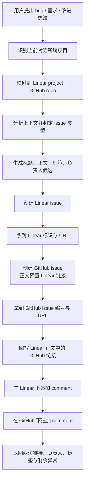

# cowork-linear-github-issue-sync Brief

> 来源：当前对话需求。目标是取消 Linear team 对 GitHub 的自动关联，改为用一个 Cowork Skill 手动完成 Linear 与 GitHub issue 的双向同步。
> 本 Brief 已核实现状：当前仓库中的 `issue-writer` 仅支持 GitHub issue 创建；Linear 当前 team 为 `QIngluo`（key `LINK`），目标 project 为 `LinkRag` / `LinkRag-Service` / `LinkRag-Web`；三者对应的 GitHub 仓库分别为 `ql-link/LinkRag` / `ql-link/LinkRag-Service` / `ql-link/LinkRag-Web`；当前可选 4 个真人成员。

## 1. 需求摘要

### 做什么

新增一个面向协作流程的 Cowork Skill，用来替代 Linear 的 GitHub 自动同步能力，由 Agent 根据当前对话上下文手动完成 Linear 与 GitHub issue 的双向创建与回链：

1. **项目感知**：skill 能识别当前对话属于哪个项目，并自动映射到对应的 Linear project 和 GitHub 仓库。
2. **issue 内容生成**：skill 根据当前对话中的需求背景、问题现象、目标边界与上下文证据，生成结构化 issue 标题与正文，而不是要求用户手工补完整模板。
3. **双平台创建**：先创建 Linear issue，再创建 GitHub issue，保证 GitHub issue 正文能直接带上 Linear 链接。
4. **双向回链**：Linear 和 GitHub 两边都要在**正文**与**comment**中放上对方的链接，形成稳定互跳。
5. **负责人双写**：从当前 4 个团队成员中选择 1 个负责人，并把同一个人同时写入 Linear 与 GitHub 的 assignee。
6. **标签按类型分流**：按 bug / feature / improvement 等类型生成不同正文模板，并同步打上对应标签；标签体系以 Linear 为准，必要时允许 skill 补充缺失标签。

### 为什么做

- Linear 免费版只能创建 2 个 team，继续依赖 team 级 GitHub 自动关联会占用稀缺 team 名额。
- 当前自动同步能力绑定在 team 上，无法细粒度地按“当前对话所属项目”灵活路由到对应仓库。
- 自动同步只能解决“创建一条镜像 issue”，无法满足项目感知、内容增强、负责人双写、正文与 comment 双重回链等细化协作约束。
- 现有项目中的 `issue-writer` 是 GitHub-only，无法作为 Linear 受限后的替代方案。

### 本次不做

- 不改造 `branch-pr-workflow` 的提 PR 流程；本需求只覆盖“建 issue 与双向同步”，不触及发 PR。
- 不恢复或模拟 Linear 原生的自动同步开关；仍以 Agent 主导的手动编排为主。
- 不做“任意仓库/任意 team 的开放配置中心”；本次只覆盖 `QIngluo/LINK` 下的 3 个既定项目映射。
- 不做 GitHub Project、Milestone、PR 自动关联、状态回写或 issue 生命周期双向同步；仅覆盖“创建时的双写与回链”。
- 不做自动从历史 issue 中聚类、去重或智能合并；重复 issue 识别仅作为可提示信息，不作为本期主目标。
- 不要求用户每次显式输入仓库名、项目名或完整模板；但在项目归属无法从上下文可靠推断时，skill 允许追问一次。

## 2. 业务流程

### 2.1 主流程图

### 2.2 流程详解

- **项目识别优先级**：
  1. 当前工作区仓库 remote / 仓库名。
  2. 对话中显式提到的“Python 端 / Java 端 / 前端 / LinkRag / LinkRag-Service / LinkRag-Web”。
  3. 若仍不明确，再追问一次，不允许盲猜。
- **项目映射表（已确认直接映射）**：
  - `LinkRag` → Linear project `LinkRag` → GitHub repo `ql-link/LinkRag`
  - `LinkRag-Service` → Linear project `LinkRag-Service` → GitHub repo `ql-link/LinkRag-Service`
  - `LinkRag-Web` → Linear project `LinkRag-Web` → GitHub repo `ql-link/LinkRag-Web`
- **issue 类型识别**：
  - `Bug`：有明确异常、错误行为、回归、线上问题或复现路径。
  - `Feature`：新增业务能力、接口、页面、流程或协作能力。
  - `Improvement`：已有能力优化、流程改良、质量提升、文档增强、自动化补齐。
  - 若上下文不足以可靠区分，skill 允许提示用户确认类型，但不应在已有明显语义时多问。
- **创建顺序**：
  - 先建 Linear：因为 team / project / assignee 都受 Linear 约束，且 GitHub issue 正文需要带上 Linear 链接。
  - 后建 GitHub：创建时把 Linear issue key 和 URL 直接写入 GitHub 正文。
- **双向回链要求**：
  - Linear 正文必须包含 GitHub issue 链接。
  - GitHub 正文必须包含 Linear issue 链接。
  - Linear comment 与 GitHub comment 也都要各写一条回链说明，避免正文后续被编辑时丢失唯一关联。
- **负责人双写**：
  - 负责人从当前 4 个成员中选 1 个：`bianyuning`、`zhan82789`、`yyifan355`、`jixu0090`。
  - 同一个人同时写入 Linear assignee 与 GitHub assignee。
  - 若 GitHub 仓库中该成员没有可分配权限，需报告 GitHub 分配失败，但不回滚已经创建的 issue。
- **标签生成规则**：
  - 以 Linear 标签体系为主：`Bug` / `Feature` / `Improvement` 为优先 canonical 类型。
  - 若 Linear 缺少需要的标签，skill 可以先补建 Linear label，再继续创建 issue。
  - GitHub 侧优先使用与类型语义最接近的现有 label；若仓库缺失且需要保持跨平台一致，可补建同名或约定名 label。

### 2.3 正文与 comment 的目标形态

| 平台 | 正文必须包含 | comment 必须包含 |
| --- | --- | --- |
| Linear | 问题/需求描述、范围与边界、标签语义、负责人、GitHub issue 链接 | 一条 GitHub issue 回链 comment，说明已同步到 GitHub |
| GitHub | 问题/需求描述、范围与边界、标签语义、负责人、Linear issue 链接 | 一条 Linear issue 回链 comment，说明已同步到 Linear |

## 3. 核心模块与实现思路

### 3.1 Cowork issue skill 的职责边界

- **位置**：新增 `.ai/skills/<新 skill>/SKILL.md`，并在项目入口中把“提 issue”的推荐路由切到该 skill。
- **职责**：
  - 识别项目归属。
  - 汇总上下文生成 issue 内容。
  - 编排 Linear 创建、GitHub 创建、正文更新、comment 回链、assignee 双写、label 补齐。
- **不负责**：
  - 提 PR、建分支、提交代码。
  - 跟踪 issue 后续状态迁移。
  - 自动分析并关闭重复 issue。

### 3.2 项目感知与映射

- **输入来源**：当前仓库 remote、当前对话主题、用户显式提到的项目名。
- **映射策略**：采用直接映射，不引入别名数据库或复杂配置文件。
- **已知项目集合**：
  - Python 端：`LinkRag` / `ql-link/LinkRag`
  - Java 端：`LinkRag-Service` / `ql-link/LinkRag-Service`
  - 前端：`LinkRag-Web` / `ql-link/LinkRag-Web`
- **team 归属**：Linear 统一使用 `QIngluo`（team key `LINK`）；新 issue 始终落在该 team 下，再挂到对应 project。

### 3.3 内容生成与模板分流

- **统一输入**：用户原始诉求、当前对话中的背景解释、项目上下文、必要时补充的一次澄清。
- **输出**：中文标题 + 结构化 Markdown 正文。
- **模板分流建议**：
  - `Bug`：问题描述、复现路径/触发条件、预期行为、实际行为、影响范围、相关位置。
  - `Feature`：背景、目标、非目标、业务价值、影响范围、验收要点。
  - `Improvement`：现状问题、改进目标、约束、不做什么、收益与风险。
- **差异化要求**：
  - Bug 不提前写修复方案。
  - Feature / Improvement 不直接下沉到代码实现细节，但要把业务边界写清。
  - 正文中可追加“项目识别结果”“同步目标仓库”辅助字段，便于人工审阅。

### 3.4 标签与负责人同步

- **负责人来源**：当前 4 位真人成员。
- **选择方式**：允许用户指定；未指定时，skill 可以在结果中列出候选并默认不自动猜负责人，避免误分配。
- **标签体系**：
  - 主标签以 Linear 为准。
  - Linear label 缺失时，skill 可以补建，例如补 `Improvement`、`Feature` 等。
  - GitHub 各仓库现有标签并不完全一致，因此需要显式处理“存在则复用，不存在则补建或映射”的分支。

### 3.5 双向回链与失败处理

- **顺序要求**：
  1. 创建 Linear issue。
  2. 创建 GitHub issue，正文直接带 Linear 链接。
  3. 更新 Linear issue 正文，补充 GitHub 链接。
  4. 在 Linear / GitHub 两边各发一条 comment。
- **失败处理原则**：
  - 若 Linear 创建失败，流程终止，不创建 GitHub issue。
  - 若 Linear 成功但 GitHub 创建失败，保留 Linear issue，并在最终结果中明确报告 GitHub 侧失败；是否追加失败 comment 由技术方案阶段细化。
  - 若正文更新或 comment 回链失败，不回滚已创建 issue，但必须在结果中报告“主记录已创建、回链不完整”。
- **幂等边界**：
  - 本期不做严格的跨平台去重与幂等锁。
  - 允许后续在技术方案中增加“若同一会话已创建过 Linear/GitHub issue，则提示复用”的保护。

## 4. 风险与不确定性

| 风险 / 问题 | 触发条件 | 影响 | 当前判断 / 应对方向 |
| --- | --- | --- | --- |
| 当前 `issue-writer` 仍是 GitHub-only | 用户仍按旧入口理解“提 issue” | Agent 可能继续只建 GitHub issue，漏掉 Linear | 需要新增 Cowork Skill，并把项目入口路由从 `issue-writer` 切到新 skill 或把 `issue-writer` 升级为包装入口 |
| 项目归属误判 | 用户跨项目讨论，或当前仓库与话题不一致 | issue 被建到错误的 Linear project / GitHub repo | 项目识别优先用当前仓库，其次对话关键词；仍不明确时允许追问一次 |
| GitHub 仓库 assignee 权限不一致 | Linear 成员存在，但 GitHub 仓库不可分配 | Linear 分配成功，GitHub assignee 失败 | 允许 issue 创建成功但 assignee 部分失败；最终结果要明确报告 |
| 三个 GitHub 仓库 label 不一致 | 现有 label 命名与 Linear 不完全对齐 | 自动打标签失败或跨仓库语义不一致 | 以 Linear 为 canonical，GitHub 侧显式处理“复用 / 新建 / 映射”分支 |
| 正文与 comment 都要回链 | 两边至少涉及 4 次写操作 | 任一步失败都会导致链接状态不完整 | 将“主 issue 创建成功”和“回链完整”拆成两个结果层级，失败时不回滚主 issue |
| 先建 Linear 再建 GitHub 的半成功状态 | GitHub 创建接口失败或权限不足 | 留下只有 Linear 的 issue | 这是可接受的中间状态；需要明确反馈并保留后续人工补建入口 |
| 内容生成过度推断 | 对话中上下文不充分 | issue 内容失真或漏边界 | 明显缺关键事实时只追问一次；其余信息从当前对话和项目上下文补齐，但要避免伪造证据 |

## 5. 决策与待确认

### 已按保守方案落地

- **skill 形态**：新增独立 skill `cowork-issue-sync` 作为默认入口，不直接覆盖旧 `issue-writer`；旧 skill 保留为 GitHub-only fallback。
- **GitHub 标签策略**：优先复用 GitHub 仓库已有语义标签；若缺失则允许补建。当前约定优先级为 `Bug -> bug`、`Feature -> Feature / enhancement`、`Improvement -> Improvement`。
- **未指定负责人时的策略**：不自动猜，追问一次，由用户从 4 位成员中选择。

### 当前状态

- brief 已补充到可继续推进 skill 设计与实现的程度。
- 若后续需要把 `cowork-issue-sync` 合并回 `issue-writer`，或调整 GitHub 标签命名策略，可作为下一轮优化，不阻塞当前方案。
