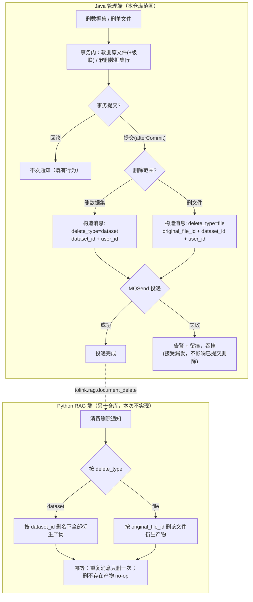

# delete-notify-mq Brief

> 来源：GitHub issue ql-link/LinkRag-Service#29「删除链路（续）：MQ 通知 Python + Python 侧删除衍生产物（落地 #27 占位）」。
> 承接 #27 / PR #28（已合并）：删除已改为隐性删除（软删保留原文件），并约定「衍生产物的删除交 Python，通过 MQ 通知触发」，当时仅在 Java 侧留了占位发送点。本需求负责**落地该删除通知的 Java 半**（producer + 契约 + 文档）。Python 侧消费删产物在另一套代码库实现（issue 第 2 部分），不在本仓库范围；本 brief 把契约定清楚作为 Python 实现依据。
> 本 Brief 已对照真实代码核实现状（占位 notifier、两个删除入口的 afterCommit 调用点与各自载荷、既有 MQ 框架与 parse_task 风格、RabbitMQ 拓扑自动声明、parse_result 消费兜底）。

## 0. 现状前提（决定范围的关键事实，已核实）

- **删除通知发送点已就位、但只是占位**：`DocumentDeleteNotifier.notifyAfterDelete(originalFileIds, datasetId, userId)`（`link-service/.../service/delete/DocumentDeleteNotifier.java`）当前**只打一行留痕日志、未投递任何 MQ**，类注释明确「本次仅留痕占位，不落 producer / topic / 消息体」。
- **两个删除入口已接好 afterCommit 调用，各自载荷不同**：
  - 删数据集 `DatasetServiceImpl.delete()`：当前**先查名下所有活文件 id**（`selectList` 仅为喂给通知用），软删整批 + 级联物理删会话/消息 + 软删数据集行，afterCommit 调 `notifyAfterDelete(整批 originalFileIds, datasetId, userId)`。
  - 删单文件 `DocumentFileServiceImpl.delete(userId, fileId)`：**单个文件**，软删该行，afterCommit 调 `notifyAfterDelete(单元素列表, datasetId, userId)`。
  - 两处都用 `TransactionSynchronizationManager` 注册 afterCommit（**回滚不发**）、无事务时直发。**发送时机本需求复用、不改**；载荷形态按新契约调整（见 §1/§3）。
- **既有 MQ 框架与风格（仿写对象）**：业务消息实现 `AbstractMQ`（`getMQName` / `getMQType` / `getMessage`）；统一经 `MQSend.send(...)` 投递。`DocumentParseTaskMQ` → topic `tolink.rag.parse_task`，类型 `QUEUE`，**扁平 JSON + snake_case**（fastjson `@JSONField(name=...)`），发送前做字段完整性 `validate`。`DocumentParseTaskServiceImpl` 通过 `ObjectProvider<MQSend>` 获取发送器。
- **RabbitMQ 拓扑自动声明**：`RabbitMQTopologyScanner` 扫描所有 `AbstractMQ` 实现（需无参构造）自动声明队列；`RabbitMQSend.send` 按 `getMQName()` 路由 `convertAndSend(queueName, message)`。→ **新增一个删除通知消息模型即自动获得队列**，无需手写队列/绑定声明。
- **现有失败兜底是消费侧、非生产侧**：`parse_result` 用专用容器工厂 + `SeekToCurrentErrorHandler`（指数退避最多 3 次、recover=告警日志+监控指标、**无 DLQ**），并有卡住扫描作为「通知丢失」的观测兜底。这些都在 **Java 消费侧**；本需求是 **Java 生产侧 afterCommit 发送**，兜底形态不同（见 §3.3）。
- **删除归属（前序已定）**：`document_parsed_log` 由 Python 全程写、`document_parse_file` 由 Java 建壳/Python 维护；前序已把**整个解析域 + Python 侧 OSS 产物的删除交 Python**，Java 删除路径不再触碰 parse 两表。
- **本需求要消除的「已知缺口」**：PR #28 上线后，被软删原文件对应的 `document_parse_file` / `document_parsed_log` 行 + Python 侧 OSS 产物（清洗文件 / Markdown / 向量）**滞留无人清理**。本需求落地 Java 发通知这一半，是消除该缺口的前提（真正清理由 Python 侧消费完成）。

## 1. 需求摘要

### 做什么

把删除通知从「占位留痕」升级为「真正投递」，并定义 Java→Python 的删除通知契约：

1. **定义删除通知消息契约（按删除范围两种形态）**：新增一个实现 `AbstractMQ` 的删除通知消息（topic `tolink.rag.document_delete`，类型 `QUEUE`，扁平 JSON + snake_case），用 `delete_type` 区分两种范围——
   - **删数据集**：带 `dataset_id`（+ `user_id`）；Python 按 `dataset_id` 删该数据集名下**全部**衍生产物。
   - **删文件**：带 `original_file_id` + `dataset_id`（+ `user_id`）；Python 按 `original_file_id` 删该文件衍生产物。
   - **关键好处**：删超大数据集也只发一条带 `dataset_id` 的小消息，**从源头避免「上万个 id 的长列表撑爆消息体」**（这正是用户对粒度问题的决策）。
2. **落地 producer**：把 `DocumentDeleteNotifier` 的占位发送点接到真实 `MQSend`，在已就位的 afterCommit 时机按删除范围构造并投递对应消息（回滚不发——既有行为，不改）。
3. **失败兜底（轻量口径，已与用户确认）**：**尽力发**；发送失败只**告警 + 留痕**、在 notifier 内部吞掉，**不影响已提交的删除**（接受偶尔漏发，不引入 DLQ、不做 transactional outbox、不做漏发对账扫描）。**幂等**由「按 `dataset_id` / `original_file_id` 删衍生产物」天然保证（删第二次是 no-op），Java 侧无需额外去重字段，**不加 trace id**（保持载荷最简）。
4. **同步契约文档**：`docs/reference/mq_contracts.md`（消息清单 + 删除通知字段段）、`docs/architecture/mq_module.md`（当前消息表 + 约定）、`docs/guides/integration.md`（删除链路从「占位」改「已落地」）。

### 为什么做

- 前序软删上线后，被删原文件的解析域衍生产物（parse 两表行 + Python 侧 OSS 清洗文件/向量）**滞留无人清理**；当初约定的「Java 发 MQ 通知 Python 删」仅占位。本需求落地 Java 半，让通知真正发出，Python 才能据此清理。
- 复用既有 `tolink.rag.*` 风格与 afterCommit 时机，改动小、隔离好，不触碰删除主流程语义。

### 本次不做

- **不实现 Python 侧消费 + 真删衍生产物**（另一套代码库 / issue 第 2 部分）。本 brief 只把契约定清楚作为 Python 实现依据。
- **不做端到端联调验收**（issue 第 3 部分）：依赖 Python 侧就绪后另行联调；本仓库验收到「删除通知按契约正确投递 / 回滚不发 / 失败不影响删除」为止。
- **不改 afterCommit 调用时机**：前序已就位，本次仅复用（在 notifier 内部把占位日志换成真实投递；载荷按新契约调整）。
- **不引入 transactional outbox / DLQ / 强投递保证 / 漏发对账扫描**：已确认接受偶尔漏发。
- **不加 trace/notify id 等去重或排查字段**：幂等天然成立，载荷保持最简。
- **不做隐藏原文件冷数据 GC、用户可见回收站/恢复**（后续另议）。
- **不改删除接口对外形态、不改 Java 软删本身**（#27/#28 已完成）；**不改既有 MQ 契约**（`parse_task` / `parse_result` / `cache.evict`）。

## 2. 业务流程

### 2.1 主流程图

### 2.2 流程详解

- **触发与载荷**：删除主流程（软删 + 级联）已在事务内完成。afterCommit 按删除范围构造消息：删数据集只需 `dataset_id`（**可省去当前为收集 file id 而做的查询**）；删文件用单个 `original_file_id`。
- **发送时机**：沿用既有 afterCommit——事务提交后才发，回滚不发（避免通知 Python 删一个其实没删成的东西）。
- **失败处理**：afterCommit 已脱离事务、无法回滚；发送失败在 notifier 内部 catch、告警 + 留痕后**吞掉**，绝不外抛（避免污染事务同步回调链）。漏发的代价是衍生产物再次滞留——惰性垃圾，不影响活记录，已接受。
- **跨系统消费（Python，非本仓库）**：Python 按 `delete_type` 分流——`dataset` 按 `dataset_id` 删名下全部衍生产物（parse 两表 + OSS），`file` 按 `original_file_id` 删该文件衍生产物；要求重复消息只删一次、删不存在产物安全 no-op。

## 3. 核心模块与实现思路

### 3.1 删除通知消息模型（`link-service` MQ 域）

- **位置**：与 `DocumentParseTaskMQ` 同域（`link-service/.../service/mq`）。
- **新增能力**：新增一个实现 `AbstractMQ` 的删除通知消息（命名待 TD），`getMQName()` = `tolink.rag.document_delete`、`getMQType()` = `QUEUE`、`getMessage()` 输出扁平 JSON。
- **载荷字段（snake_case，仿 parse_task）**：
  - `delete_type`：`dataset` 或 `file`（范围判别）。
  - `dataset_id`：两种范围都带。
  - `user_id`：两种范围都带。
  - `original_file_id`：仅 `delete_type=file` 时带。
- **复用**：队列由 `RabbitMQTopologyScanner` 自动声明、`RabbitMQSend` 按 topic 路由——无需手写队列/绑定。需提供无参构造（供拓扑扫描实例化）。发送前做最小完整性校验（仿 parse_task 的 `validate`）：`delete_type` 合法、`dataset_id`/`user_id` 非空、`file` 范围时 `original_file_id` 非空。

### 3.2 producer 落地（`DocumentDeleteNotifier`）

- **位置**：`link-service/.../service/delete/DocumentDeleteNotifier.java`（已存在的占位类）。
- **改造**：注入发送器（仿 parse task 用 `ObjectProvider<MQSend>` 容错获取）；按删除范围构造删除通知消息并 `send(...)`，替换当前的留痕日志。两个调用点（数据集 / 文件）传入各自范围与标识——既有调用点已分处两个 Service，天然可区分（具体 notifier 方法形态留 TD：可为两个方法或带范围参数）。
- **简化**：删数据集路径在新契约下**不再需要为消息收集名下 file id**，可省去 `DatasetServiceImpl` 当前那次 `selectList` 查询（实现级，TD 确认）。
- **边界**：标识缺失（如 file 范围 `original_file_id` 为空）等异常输入按完整性校验拦下、不发送并留痕。
- **不改**：两个删除入口的 afterCommit 注册 / 无事务直发结构保持原样。

### 3.3 失败兜底与幂等

- **生产侧失败**：`MQSend.send` 抛异常时，notifier 内部 catch → 告警日志 +（建议）监控指标 → **吞掉不外抛**。不重试或仅做极少量 in-process 重试（次数留 TD）；不阻断、不回滚已提交的删除。
- **幂等**：删除语义天然幂等——Python 按 `dataset_id` / `original_file_id` 删衍生产物，删第二次为 no-op。**Java 侧无需额外去重/序号字段，也不加 trace id**。
- **不做漏发对账**：与 parse_result 的消费侧退避重试 + 卡住扫描不同，删除通知是生产侧 afterCommit、且已接受漏发，**本次不引入对账/补发扫描**（如需后续单独立项）。

### 3.4 契约与文档同步

- `docs/reference/mq_contracts.md`：消息清单加一行（删除通知，Java→Python），新增「删除通知字段」段（`delete_type` 分流语义 + 两种范围字段 + 幂等约定 + Java 尽力发/无 DLQ 口径）。
- `docs/architecture/mq_module.md`：「当前消息」表加一行 + 约定补充（删除通知走 QUEUE、afterCommit 发送、失败告警吞掉、按范围分流）。
- `docs/guides/integration.md`：删除链路从「占位/铺垫」更新为「已落地（Java 发通知）+ Python 侧消费待其仓库实现」。

### 3.5 跨系统协作说明（Python 侧，非本仓库实现）

作为契约对端，Python 消费方需（在其仓库）实现：按 `delete_type` 分流——
- `dataset`：按 `dataset_id` 删该数据集名下**全部** `document_parse_file` / `document_parsed_log` 行 + OSS 清洗文件/Markdown/向量（含历史软删死行遗留的产物，整集清理更彻底）。
- `file`：按 `original_file_id` 删该文件对应的上述衍生产物。

并保证重复消息只删一次、删不存在产物安全 no-op。**本 brief 仅定义契约，不在本仓库实现这部分**。

> **契约要求（移交 Python 设计）**：Python 侧消费端**尚未设计**，将**按本契约设计为支持按 `dataset_id` 批量删除**衍生产物（parse 两表按 `dataset_id` 列、OSS 对象键按 dataset 分层定位）。本 brief 的契约即 Python 设计输入。万一 Python 设计后确认无法按 `dataset_id` 聚合删除，再回退到「数据集删除也下发 `original_file_id` 列表」的方案。

## 4. 风险与不确定性

| 风险 / 问题 | 触发条件 | 影响 | 当前判断 / 应对方向 |
| :--- | :--- | :--- | :--- |
| 通知漏发（已接受） | afterCommit 后 MQ 不可用 / 进程崩溃 / 网络抖动 | 删除已提交但 Python 收不到 → 衍生产物再次滞留 | **已确认接受**：滞留为惰性垃圾、不影响活记录；失败告警+留痕可观测；不引 outbox/DLQ、不做漏发对账扫描 |
| Python 未按 dataset_id 支持删除 | `dataset` 范围依赖 Python 按 `dataset_id` 聚合删衍生产物（Python 端尚未设计） | 若 Python 最终不支持，数据集删除通知到达但删不动 | **低**：Python 为新建、将按本契约设计为支持 `dataset_id` 批量删除（§3.5）；本 brief 契约即设计输入。万一不支持再回退下发 `original_file_id` 列表 |
| 删除与在途解析竞争（顺序） | 文件软删后通知先到 Python，而该文件解析仍在写产物 | Python 删完产物后又被解析写回 → 再次滞留 | 边界，主要由 **Python 消费侧**处理（如校验原文件已删 / 最终一致兜底）；Java 侧只保证 afterCommit 发送 |
| 契约漂移 | topic / 字段名 / `delete_type` 取值与 Python 实现不一致 | Python 删错或删不到 | 契约文档先行、字段 snake_case 严格仿 parse_task；Python 按 `mq_contracts.md` 实现，双端评审 |
| afterCommit 异常外抛 | 发送失败未在 notifier 内吞掉 | 污染事务同步回调链 / 刷错误栈 | notifier 内部 catch 吞掉 + 告警，**绝不外抛**（§3.2/§3.3） |

## 5. 决策与待确认

### 已决策（用户确认）

- **范围与可靠性**：落地删除通知的 **Java 半**（producer + 契约 + 文档）；Python 消费与端到端联调不在本仓库。可靠性走**尽力发 + 失败告警/留痕、吞掉不影响删除**的轻量口径，**接受偶尔漏发**，无 DLQ、不做 outbox、不做漏发对账扫描。
- **消息粒度（用户决策）**：**删数据集传 `dataset_id`、删文件传 `original_file_id`**，从源头避免长列表撑爆消息体；不再下发整批 file id。
- **幂等与排查**：幂等天然成立（按 id 删，删二次 no-op），Java 侧不加去重字段，**不加 trace id**（保持载荷最简）。
- **命名**：需求目录/分支用 `delete-notify-mq`。
- **队列**：跟 `parse_task` 一致走 RabbitMQ（QUEUE），队列由拓扑扫描自动声明。
- **保留 `delete_type` 判别字段**（取值 `dataset` / `file`）：跨仓库契约显式标注删除范围，Python 不靠「有无 `original_file_id`」推断。
- **数据集范围按 `dataset_id` 删除成立**：Python 侧消费端尚未设计，将按本契约设计为支持按 `dataset_id` 批量删除衍生产物；本 brief 契约即其设计输入。万一 Python 设计后不支持，再回退到数据集删除下发 `original_file_id` 列表。

### 状态

- **brief 已冻结（2026-05-30）**，无遗留待确认项。决策全集（落地 Java 半 producer + 契约、删数据集传 `dataset_id` / 删文件传 `original_file_id` + `delete_type` 判别、尽力发/接受漏发/无 DLQ、不加 trace id、不做漏发对账、走 RabbitMQ）已固化。进入 acceptance 阶段（acceptance-generator）。

> 留待 technical_design 收敛的实现级细节（不影响验收）：删除通知消息类命名与字段定义、`validate` 完整性规则、notifier 方法形态（两个方法 vs 范围参数）、发送器注入方式（`ObjectProvider<MQSend>`）、失败 catch 的告警/指标形态与是否少量 in-process 重试、`DatasetServiceImpl` 省去 file id 收集查询的改动。
