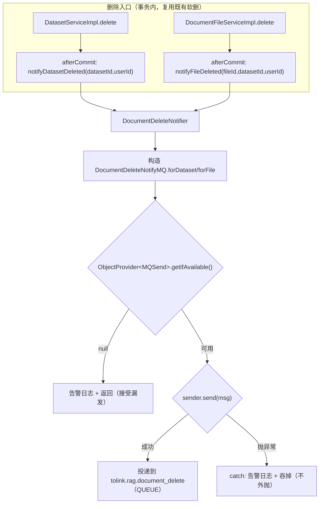

# delete-notify-mq 技术设计

- **文档状态：** 技术方案待审核
- **项目名称：** toLink-Service（GitHub 仓库 ql-link/LinkRag-Service）
- **业务域：** 删除链路 / MQ 通知（Java → Python）
- **需求名称：** delete-notify-mq（issue #29 第 1 部分：删除通知 Java 半）
- **业务输入：** `docs/delete-notify-mq/brief.md`（已冻结）
- **验收输入：** `docs/delete-notify-mq/acceptance.feature`（已冻结，9 Scenario 含 5 Outline）
- **输出文件：** `docs/delete-notify-mq/technical_design.md`
- **最后更新时间：** 2026-05-30

---

## 1. 文档修订记录

| 版本号 | 修改日期 | 修改内容简述 | 来源/提出人 | 审核状态 |
| :--- | :--- | :--- | :--- | :--- |
| v1.0 | 2026-05-30 | 初始技术设计：删除通知消息模型 + DocumentDeleteNotifier producer 落地 + 两删除入口按范围分流 + 文档同步 | brief.md + acceptance.feature | 待审核 |

---

## 2. 输入依据与设计目标

### 2.1 输入依据映射

| 输入来源 | 关键结论 | 技术设计承接方式 |
| :--- | :--- | :--- |
| `brief.md` | 落地删除通知 Java 半；删数据集传 `dataset_id`、删文件传 `original_file_id`，`delete_type` 判别；尽力发/接受漏发/无 DLQ；不加 trace；afterCommit 复用 | 新增 `DocumentDeleteNotifyMQ` 消息模型 + `DocumentDeleteNotifier` 真实投递（两语义方法）+ 两删除入口调用切换；失败 try/catch 吞掉 |
| `acceptance.feature` | 9 Scenario：投递主流程（file/dataset 分流、多文件仍一条）、消息形态不变量、回滚不发、发送失败兜底、完整性校验、边界（未删不发 / 空数据集仍发） | 方法级实现 + 4 个测试文件（2 新增 2 修改）映射全部 Scenario，§10 自检 |

### 2.2 技术目标

- 把 `DocumentDeleteNotifier` 从「占位留痕」升级为真实 MQ 投递，按删除范围分流投递删除通知。
- 定义稳定的 Java→Python 删除通知契约（topic `tolink.rag.document_delete`、扁平 JSON snake_case、`delete_type` 判别），并同步契约文档。
- afterCommit 投递失败绝不影响已提交的删除（吞掉 + 告警），不引入 DLQ / outbox / 对账。
- **非目标**：Python 侧消费与真删衍生产物（另一仓库）；端到端联调；冷数据 GC / 回收站；改动软删本身或 afterCommit 注册结构。

---

## 3. 改动范围

### 3.1 改动文件目录树

```text
toLink-Service/
├── link-service/src/main/java/com/qingluo/link/service/
│   ├── mq/DocumentDeleteNotifyMQ.java                         # [新增] 删除通知消息模型（implements AbstractMQ）
│   ├── delete/DocumentDeleteNotifier.java                     # [修改] 占位→真实投递，两语义方法 + 失败吞掉
│   └── impl/
│       ├── DatasetServiceImpl.java                            # [修改] 删数据集→dataset 范围通知；移除仅为载荷的 selectList
│       └── document/DocumentFileServiceImpl.java              # [修改] 删文件→file 范围通知
├── link-service/src/test/java/com/qingluo/link/service/
│   ├── mq/DocumentDeleteNotifyMQTest.java                     # [新增] 消息序列化/字段/校验单测
│   ├── delete/DocumentDeleteNotifierTest.java                # [新增] producer 投递 + 失败吞掉单测
│   └── impl/
│       ├── DatasetServiceImplTest.java                        # [修改] 通知断言改 notifyDatasetDeleted；移除多余 selectList stub
│       └── DocumentFileServiceImplTest.java                   # [修改] 通知断言改 notifyFileDeleted
├── link-api/src/test/java/com/qingluo/link/api/mq/
│   └── DeleteNotifyIntegrationTest.java                       # [可选新增] 端到端：发送失败时删除接口仍成功
└── docs/
    ├── reference/mq_contracts.md                              # [修改] 消息清单 + 删除通知字段段
    ├── architecture/mq_module.md                              # [修改] 当前消息表 + 约定
    └── guides/integration.md                                 # [修改] 删除链路「占位」→「已落地（Java 半）」
```

### 3.2 文件级改动说明

| 文件 | 动作 | 改动目的 | 是否必须 |
| :--- | :--- | :--- | :--- |
| `service/mq/DocumentDeleteNotifyMQ.java` | 新增 | 删除通知消息契约（topic/类型/字段/校验/工厂） | 是 |
| `service/delete/DocumentDeleteNotifier.java` | 修改 | 注入 `ObjectProvider<MQSend>`；`notifyDatasetDeleted` / `notifyFileDeleted` 真实投递；失败吞掉 | 是 |
| `service/impl/DatasetServiceImpl.java` | 修改 | afterCommit 调 `notifyDatasetDeleted(datasetId,userId)`；移除仅为旧载荷收集的 `selectList` | 是 |
| `service/impl/document/DocumentFileServiceImpl.java` | 修改 | afterCommit 调 `notifyFileDeleted(fileId,datasetId,userId)` | 是 |
| `mq/DocumentDeleteNotifyMQTest.java` | 新增 | 序列化/字段集合/snake_case/校验 | 是 |
| `delete/DocumentDeleteNotifierTest.java` | 新增 | 投递载荷 + 发送失败/缺 sender 吞掉 | 是 |
| `impl/DatasetServiceImplTest.java` | 修改 | 既有占位断言（行 87-126）改为新方法语义 | 是 |
| `impl/DocumentFileServiceImplTest.java` | 修改 | 既有占位断言（行 98-126）改为新方法语义 | 是 |
| `api/mq/DeleteNotifyIntegrationTest.java` | 可选新增 | 端到端兜底证明（MQ 抛异常→删除仍 200） | 否（notifier 单测已覆盖核心，整测为加强） |
| `docs/reference/mq_contracts.md` / `architecture/mq_module.md` / `guides/integration.md` | 修改 | 契约/文档同步（doc-sync 强制） | 是 |

---

## 4. 当前系统分析

| 类型 | 文件/类/方法 | 当前行为 | 问题或复用点 |
| :--- | :--- | :--- | :--- |
| 占位 | `DocumentDeleteNotifier.notifyAfterDelete(Collection<Long>, Long, Long)`（行 29-34） | 仅 `log.info` 留痕，未投递 | 升级为真实投递；方法签名改两语义方法 |
| 调用点 | `DatasetServiceImpl.delete`（行 126-159） | 行 130-132 `selectList` 收集名下活文件 id（**仅供 notify**），行 158 afterCommit 调 `notifyAfterDelete(originalFileIds,…)` | dataset 范围只需 `datasetId` → 移除 selectList；改调 `notifyDatasetDeleted` |
| 调用点 | `DocumentFileServiceImpl.delete`（行 210-241） | 单文件软删，afterCommit 调 `notifyAfterDelete(List.of(fileId),…)` | 改调 `notifyFileDeleted(fileId,datasetId,userId)` |
| 仿写对象 | `DocumentParseTaskMQ`（`tolink.rag.parse_task`） | `implements AbstractMQ`；`MQ_NAME` 常量；`getMQType()=QUEUE`；`getMessage()=JSON.toJSONString(payload)` 前置 `validate`；内部 `MsgPayload` 用 `@JSONField(name)` snake_case | 直接照此结构新增 `DocumentDeleteNotifyMQ` |
| 发送器 | `DocumentParseTaskServiceImpl`（行 183-187） | `ObjectProvider<MQSend> mqSendProvider.getIfAvailable()`，null 抛 `IllegalStateException` | notifier 复用 `ObjectProvider<MQSend>`；但 null 改为**告警+吞掉**（best-effort，非抛出） |
| 框架 | `RabbitMQTopologyScanner` / `RabbitMQSend` | 扫描 `AbstractMQ` 无参实现自动声明队列；`QUEUE` 走 `convertAndSend(getMQName(), message)` | 新增消息模型即自动获得队列，无需手写声明 |
| 既有测试 | `DatasetServiceImplTest`（行 50/88-98/100-112/114-126）、`DocumentFileServiceImplTest`（行 57/98-113/115-126） | mock `DocumentDeleteNotifier`，`verify(...).notifyAfterDelete(...)` / `never()`；无事务走直发路径 | 改方法名；移除 dataset 测试中多余 `selectList` stub（严格桩） |
| 枚举 | `MQSendType`（QUEUE / BROADCAST） | — | 用 `QUEUE` |

---

## 5. 总体方案设计

### 5.1 总体流程



### 5.2 模块边界

| 模块 | 职责 | 本次是否改动 |
| :--- | :--- | :--- |
| `link-service/service/mq` | 删除通知消息契约 `DocumentDeleteNotifyMQ` | 新增 |
| `link-service/service/delete` | `DocumentDeleteNotifier` producer 落地 | 修改 |
| `link-service/service/impl`（dataset/file） | 删除入口按范围调用 notifier | 修改 |
| `link-components/toLink-components-mq` | MQ 框架（发送 / 拓扑声明） | 不改（复用，队列自动声明） |
| Python 侧消费端 | 按契约删衍生产物 | 不在本仓库 |

---

## 6. API、消息与数据设计

### 6.1 API 设计

- 删除接口对外形态（URL / 入参 / HTTP 返回）**不变**。无新增/修改 HTTP API。

### 6.2 MQ 消息设计

- **Topic / 类型**：`tolink.rag.document_delete`，`MQSendType.QUEUE`（点对点，与 `parse_task` 一致，非广播）。队列由 `RabbitMQTopologyScanner` 启动时自动声明（新增 `AbstractMQ` 无参实现）。
- **方向**：Java → Python。
- **序列化**：扁平 JSON，字段 snake_case（fastjson `@JSONField(name)`）。fastjson `JSON.toJSONString` 默认**跳过 null 字段**，故 dataset 范围不会出现 `original_file_id` 键（与 `parse_task` 省略空 `previous_task_id` 同理；由单测 `containsKey` 守护）。
- **字段**：

  | 字段 | 类型 | dataset 范围 | file 范围 | 说明 |
  | :--- | :--- | :--- | :--- | :--- |
  | `delete_type` | string | `"dataset"` | `"file"` | 范围判别 |
  | `dataset_id` | long | 必填 | 必填 | 所属数据集 |
  | `user_id` | long | 必填 | 必填 | 操作用户 |
  | `original_file_id` | long | **不含** | 必填 | 被删原文件（仅 file 范围） |

- **消息样例**：
  - dataset：`{"delete_type":"dataset","dataset_id":10,"user_id":100}`
  - file：`{"delete_type":"file","dataset_id":200,"user_id":100,"original_file_id":1}`
- **发送前完整性校验**（`getMessage()` 内，仿 `parse_task`，缺字段抛 `IllegalArgumentException`）：
  1. `delete_type` ∈ {`dataset`,`file`}，否则 `document_delete delete_type is invalid`；
  2. `dataset_id` / `user_id` 非空，否则 `document_delete ownership is missing`；
  3. `delete_type=file` 时 `original_file_id` 非空，否则 `document_delete original_file_id is missing for file`。
- **幂等**：天然（Python 按 id 删，删二次 no-op）；不加 trace/去重字段。
- **可靠性**：尽力发；无 DLQ、无对账。

### 6.3 数据与存储设计

- **无 DB schema 变更、无数据迁移**（仅消息投递）。
- 不触碰 OSS、Redis、解析两表（沿用前序：解析域删除交 Python）。

---

## 7. 方法级实现方案

### 7.1 方法级变更总表

| 文件 | 类/对象 | 方法/成员 | 动作 | 入参变化 | 返回变化 | 改动目的 | 对应 Scenario |
| :--- | :--- | :--- | :--- | :--- | :--- | :--- | :--- |
| `DocumentDeleteNotifyMQ` | 消息模型 | `MQ_NAME` / `getMQName` / `getMQType` / `getMessage` | 新增 | — | — | topic/QUEUE/序列化+校验 | 消息形态不变量、完整性校验 |
| `DocumentDeleteNotifyMQ` | `MsgPayload` | `deleteType/datasetId/userId/originalFileId` + `validate` | 新增 | — | — | 扁平字段 snake_case + 校验 | 消息形态、完整性校验 |
| `DocumentDeleteNotifyMQ` | 静态工厂 | `forDataset(datasetId,userId)` / `forFile(originalFileId,datasetId,userId)` | 新增 | — | 返回消息 | 按范围构造 | 主流程 file/dataset |
| `DocumentDeleteNotifier` | 成员 | `ObjectProvider<MQSend> mqSendProvider` | 新增 | — | — | 容错获取发送器 | 发送失败兜底 |
| `DocumentDeleteNotifier` | — | `notifyAfterDelete(Collection,Long,Long)` | 删除 | — | — | 占位方法被替换 | — |
| `DocumentDeleteNotifier` | — | `notifyDatasetDeleted(Long datasetId, Long userId)` | 新增 | — | void | dataset 范围投递 | 删数据集投递、多文件仍一条、空数据集仍发 |
| `DocumentDeleteNotifier` | — | `notifyFileDeleted(Long originalFileId, Long datasetId, Long userId)` | 新增 | — | void | file 范围投递 | 删文件投递 |
| `DocumentDeleteNotifier` | — | `private send(DocumentDeleteNotifyMQ)` | 新增 | — | void | 统一投递 + try/catch 吞掉 + null sender 兜底 | 发送失败兜底 |
| `DatasetServiceImpl` | — | `delete(Long userId, Long datasetId)` | 修改 | 不变 | 不变 | 移除仅为载荷的 `selectList`；改调 dataset 范围通知 | 删数据集投递、回滚不发、未删不发、多文件仍一条、空数据集 |
| `DatasetServiceImpl` | — | `notifyPythonAfterCommit(List,Long,Long)` → `notifyDatasetDeletedAfterCommit(Long datasetId, Long userId)` | 修改 | 去掉 file id 列表 | void | afterCommit 调 `notifyDatasetDeleted` | 删数据集投递、回滚不发 |
| `DocumentFileServiceImpl` | — | `delete(Long userId, Long fileId)` | 修改 | 不变 | 不变 | 改调 file 范围通知 | 删文件投递、回滚不发、未删不发 |
| `DocumentFileServiceImpl` | — | `notifyPythonAfterCommit(Long,Long,Long)` → `notifyFileDeletedAfterCommit(Long originalFileId, Long datasetId, Long userId)` | 修改 | 不再包 `List.of` | void | afterCommit 调 `notifyFileDeleted` | 删文件投递、回滚不发 |

### 7.2 逐方法实现设计

#### 7.2.1 `DocumentDeleteNotifyMQ`（新增）

- 职责：删除通知消息契约。`implements AbstractMQ`，`public static final String MQ_NAME = "tolink.rag.document_delete"`。
- `getMQName()` → `MQ_NAME`；`getMQType()` → `MQSendType.QUEUE`；`getMessage()` → `validate(msgPayload); return JSON.toJSONString(msgPayload);`。
- 构造：无参构造（`new MsgPayload()`，供拓扑扫描）+ 带 `MsgPayload` 构造。
- 静态工厂 `forDataset` / `forFile` 设置对应字段；file 工厂额外设 `originalFileId`。
- 内部 `@Data @NoArgsConstructor @AllArgsConstructor static class MsgPayload`，字段加 `@JSONField(name="delete_type"|"dataset_id"|"user_id"|"original_file_id")`。
- `validate(MsgPayload)`：见 §6.2；非法抛 `IllegalArgumentException`。
- 异常边界：`getMessage()` 校验失败抛出，由发送链路（`RabbitMQSend.send` 调 `getMessage()`）向上传播 → 被 `DocumentDeleteNotifier.send` 捕获吞掉（即缺字段不投递）。
- 对应测试：`DocumentDeleteNotifyMQTest`。

#### 7.2.2 `DocumentDeleteNotifier`（修改）

- 当前行为：仅 `log.info` 占位。
- 修改后职责：注入 `ObjectProvider<MQSend>`（构造注入，与 `DocumentParseTaskServiceImpl` 一致风格）；提供两语义方法，内部统一 `send`。
- 实现：
  ```text
  notifyDatasetDeleted(datasetId, userId): send(DocumentDeleteNotifyMQ.forDataset(datasetId, userId))
  notifyFileDeleted(originalFileId, datasetId, userId): send(DocumentDeleteNotifyMQ.forFile(originalFileId, datasetId, userId))
  private send(DocumentDeleteNotifyMQ msg):
      try {
          MQSend sender = mqSendProvider.getIfAvailable();
          if (sender == null) { log.error("[delete-notify] MQ sender unavailable, drop notify: {}", 摘要); return; }
          sender.send(msg);
      } catch (RuntimeException e) {
          log.error("[delete-notify] send failed, drop notify: {}", 摘要, e);  // 吞掉，不外抛
      }
  ```
- 事务与异常边界：本方法在 afterCommit（已脱离事务）被调用；**任何异常都不外抛**（外抛会污染 `TransactionSynchronization` 回调链并可能刷 500）。与 `parse_task`「null sender 抛 IllegalStateException、失败外抛 BusinessException」**刻意相反**——parse 在事务内需阻断，delete 在提交后尽力发。
- 幂等与并发边界：无状态；幂等交 Python。
- 对应测试：`DocumentDeleteNotifierTest`（投递载荷 + 发送失败/缺 sender 不外抛）。

#### 7.2.3 `DatasetServiceImpl.delete`（修改）

- 当前行为：`getOwnedDataset` → `selectList` 收集名下活文件 id → 软删名下原文件（`update … setSql("deleted_seq = id")`）→ 物理删会话/消息 → 软删数据集 → afterCommit `notifyAfterDelete(originalFileIds, datasetId, userId)`。
- 修改后：**移除 `selectList`（行 130-132）及局部变量 `originalFileIds`**（其唯一消费者是通知，新契约 dataset 范围不需要）；软删/级联逻辑不变；afterCommit 改调 `notifyDatasetDeleted(datasetId, userId)`。
- `notifyPythonAfterCommit` 改名/改签名为 `notifyDatasetDeletedAfterCommit(Long datasetId, Long userId)`，afterCommit 体内 `deleteNotifier.notifyDatasetDeleted(datasetId, userId)`，无事务直发分支同步改。
- 事务与异常边界：软删在事务内；中途异常 → 回滚 → afterCommit 不触发 → 不通知（结构不变）。
- 对应测试：`DatasetServiceImplTest`。

#### 7.2.4 `DocumentFileServiceImpl.delete`（修改）

- 当前行为：`getOwnedFile` → 软删该原文件 → afterCommit `notifyAfterDelete(List.of(fileId), datasetId, userId)`。
- 修改后：软删不变；`notifyPythonAfterCommit` 改名/改签名为 `notifyFileDeletedAfterCommit(Long originalFileId, Long datasetId, Long userId)`，afterCommit 体内 `deleteNotifier.notifyFileDeleted(originalFileId, datasetId, userId)`（去掉 `List.of` 包裹），无事务直发分支同步改。
- 事务与异常边界：同上，回滚不通知。
- 对应测试：`DocumentFileServiceImplTest`。

---

## 8. 组件与集成设计

- **队列声明**：`RabbitMQTopologyScanner` 扫描业务消息模型基包内的 `AbstractMQ` 无参实现并声明队列；`DocumentDeleteNotifyMQ` 须在被扫描的基包内、且提供无参构造（已设计）。实现期确认其所在包在拓扑扫描基包范围内（与 `DocumentParseTaskMQ` 同包 `service/mq`，已在范围内）。
- **发送**：`RabbitMQSend.send` 对 `QUEUE` 走 `convertAndSend(getMQName(), getMessage())`。
- **发送器获取**：`ObjectProvider<MQSend>` 容忍 MQ 未装配（测试 / 降级）——返回 null 时 notifier 告警吞掉。

---

## 9. 异常处理与降级策略

| 异常场景 | 处理方式 | 是否抛出 | 是否影响删除/消息确认 |
| :--- | :--- | :--- | :--- |
| `MQSend.send` 抛 RuntimeException（broker 不可用 / AmqpException） | notifier `catch` + 告警日志，吞掉 | 否 | 不影响已提交删除；消息漏发（已接受） |
| `MQSend` bean 缺失（`getIfAvailable()==null`） | 告警日志 + 直接返回 | 否 | 同上（best-effort 漏发） |
| 消息完整性校验失败（`validate` 抛 `IllegalArgumentException`） | 经 `getMessage()`→`send` 抛出 → 被 notifier 捕获吞掉 | 否 | 不投递（防御性；正常路径工厂保证字段齐全） |
| 删除事务回滚 | afterCommit 不触发，notifier 不被调用 | — | 不通知（结构保证） |

---

## 10. 测试方案

### 10.1 方法级测试映射

| 被测文件/方法 | 测试文件 | 对应 Scenario | 断言要点 |
| :--- | :--- | :--- | :--- |
| `DocumentDeleteNotifyMQ.getMessage/getMQName/getMQType` | `DocumentDeleteNotifyMQTest`（新增） | 消息形态不变量、完整性校验 | `getMQName=="tolink.rag.document_delete"`；`getMQType==QUEUE`；file JSON 含 4 键且 snake_case、dataset JSON `!containsKey("original_file_id")`；无 `payload/mq_name` 等额外键；各缺字段 `assertThatThrownBy(getMessage()).isInstanceOf(IllegalArgumentException)` |
| `DocumentDeleteNotifier.notifyDatasetDeleted/notifyFileDeleted/send` | `DocumentDeleteNotifierTest`（新增） | 主流程 file/dataset、发送失败兜底 | `ArgumentCaptor<AbstractMQ>` 捕获 send 入参，断言其 `getMessage()` 字段；`mqSend.send` `thenThrow` 时方法不抛；`getIfAvailable()` 返回 null 时不抛、不 NPE |
| `DatasetServiceImpl.delete` | `DatasetServiceImplTest`（修改） | 删数据集投递、多文件仍一条、空数据集、回滚不发、未删不发 | `verify(deleteNotifier,times(1)).notifyDatasetDeleted(10L,100L)`；`verify(...,never()).notifyFileDeleted(...)`；异常/未授权 `never()`；移除多余 `selectList` stub |
| `DocumentFileServiceImpl.delete` | `DocumentFileServiceImplTest`（修改） | 删文件投递、回滚不发、未删不发 | `verify(deleteNotifier).notifyFileDeleted(1L,200L,100L)`；未授权 `never()` |
| 删除接口（端到端） | `DeleteNotifyIntegrationTest`（可选新增，`@SpringBootTest`+`@MockBean MQSend` 抛异常） | 发送失败兜底 | 调删除端点返回成功（200/与正常一致），软删已发生 |

### 10.2 Scenario 覆盖自检

| Scenario | 承接方法 | 承接测试 | 是否覆盖 |
| :--- | :--- | :--- | :--- |
| 删文件→file 范围通知 | `DocumentFileServiceImpl.delete`+`notifyFileDeleted`+`forFile` | `DocumentFileServiceImplTest` + `DocumentDeleteNotifierTest` + `DocumentDeleteNotifyMQTest` | ✅ |
| 删数据集→dataset 范围通知 | `DatasetServiceImpl.delete`+`notifyDatasetDeleted`+`forDataset` | `DatasetServiceImplTest` + notifier 测 + MQ 测 | ✅ |
| 多文件仍一条 dataset 通知（无列表） | `DatasetServiceImpl.delete`（不枚举文件） | `DatasetServiceImplTest`（多文件 `times(1)` + 不含 original_file_id） | ✅ |
| 消息形态不变量（扁平/ snake_case / QUEUE / 最简无 trace） | `DocumentDeleteNotifyMQ` | `DocumentDeleteNotifyMQTest`（两范围 Outline） | ✅ |
| 回滚不发 + 删除未生效 | 既有 afterCommit 注册结构（不改） | `DatasetServiceImplTest`/`DocumentFileServiceImplTest`（异常→`never()`） | ✅（单测以异常路径近似；afterCommit 结构未改，真回滚语义继承自前序） |
| 发送失败兜底（删除仍成功、不外抛） | `DocumentDeleteNotifier.send` | `DocumentDeleteNotifierTest`（抛异常不外抛）；可选 `DeleteNotifyIntegrationTest`（端点仍 200） | ✅ |
| 完整性校验缺字段拒发 | `DocumentDeleteNotifyMQ.validate` | `DocumentDeleteNotifyMQTest`（逐字段缺失抛） | ✅ |
| 未删（不存在/无权）不投递 | `DatasetServiceImpl.delete`/`DocumentFileServiceImpl.delete` 鉴权分支 | 两 Service 测 `never()` | ✅ |
| 删空数据集仍投递 dataset 通知 | `DatasetServiceImpl.delete`（不依赖文件存在） | `DatasetServiceImplTest`（无文件 → `verify notifyDatasetDeleted`） | ✅ |

### 10.3 回归命令

```bash
mvn -pl link-service test
mvn -pl link-api test   # 若新增 DeleteNotifyIntegrationTest
mvn test
python3 scripts/check_docs_sync.py --working
python3 scripts/check_ai_links.py
```

---

## 11. 发布与回滚

- **发布内容**：纯代码 + 文档；新增 topic `tolink.rag.document_delete`（RabbitMQ 队列启动时自动声明）。**无 DB schema 变更、无数据迁移**。
- **发布协同（已决策：靠上线协调，不加开关）**：代码可先合入（producer 始终真实投递，无配置开关）。但 **Java producer 不单独上生产**——`QUEUE` 无消费者会致消息积压，故约定**待 Python 消费端就绪后，两端一起发布**。该协同为发布前置硬约束，需在发布检查单/PR 说明中显式标注，避免 Java 侧被单独部署到生产。
- **回滚**：移除消息模型 + 还原 `DocumentDeleteNotifier` 为占位（或保留方法但不 send）即可；无 schema 回滚。若误先上线致队列积压，可在 broker 侧清队列。

---

## 12. 风险与待确认问题

| 风险/问题 | 影响 | 建议处理 |
| :--- | :--- | :--- |
| **队列积压（Python 未就绪）** | Python 消费端未实现，`document_delete` 队列无消费者 → 消息无界积压，占 broker 内存/磁盘 | **已决策：靠上线协调**——代码先合、不加开关，但 Java producer 不单独上生产，待 Python 消费端就绪后两端一起发布（发布检查单/PR 显式标注此硬约束） |
| Python 能否按 `dataset_id` 删（brief §3.5） | dataset 范围方案前提；Python 新建将按本契约设计 | 契约文档移交 Python；低风险 |
| 删除与在途解析竞争 | Python 删产物后解析又写回 → 再次滞留 | Python 消费侧处理；Java 仅保证 afterCommit 发送 |
| 通知漏发（已接受） | broker 抖动 / 进程崩 → 漏发 → 产物滞留 | 已接受：告警可观测，无 DLQ/对账 |
| `selectList` 移除影响既有 dataset 测试 | 严格桩下多余 stub 致测试失败 | 同步移除 `DatasetServiceImplTest` 相关 `selectList` stub（§10.1） |
| 拓扑扫描基包覆盖 | 新消息模型不在扫描包则队列不声明 | 与 `DocumentParseTaskMQ` 同包 `service/mq`，实现期确认在扫描范围 |

---

## 13. 实施顺序

1. 新增 `DocumentDeleteNotifyMQ`（消息模型 + 校验 + 工厂）。
2. 改造 `DocumentDeleteNotifier`（注入 `ObjectProvider<MQSend>` + 两语义方法 + `send` 吞掉）。
3. 改 `DatasetServiceImpl.delete`（移除 selectList、改调 `notifyDatasetDeleted`）与 `DocumentFileServiceImpl.delete`（改调 `notifyFileDeleted`）。
4. 新增 `DocumentDeleteNotifyMQTest` / `DocumentDeleteNotifierTest`；修改 `DatasetServiceImplTest` / `DocumentFileServiceImplTest`；（可选）`DeleteNotifyIntegrationTest`。
5. 同步文档：`mq_contracts.md` / `mq_module.md` / `integration.md`。
6. `mvn -pl link-service test`（必要时 `-pl link-api`）→ `mvn test` → `check_docs_sync.py --working` / `check_ai_links.py`。
7. 进入 code-review-and-quality；发布前落实 §11/§12 的「队列积压」决策。

---

## 14. 人工审核清单

- [ ] 改动文件目录树已确认
- [ ] 方法级变更总表已确认（两语义方法 + 移除 selectList）
- [ ] 消息契约（topic / 字段 / snake_case / 校验 / dataset 省略 original_file_id）已确认
- [ ] 事务边界（afterCommit 复用、失败吞掉不外抛）已确认
- [ ] 测试方案与 9 Scenario 全覆盖已确认
- [x] **发布前置「队列积压」处理方式已决策（§12）**：靠上线协调（不加开关，Java 不单独上生产，待 Python 就绪两端一起发布）
