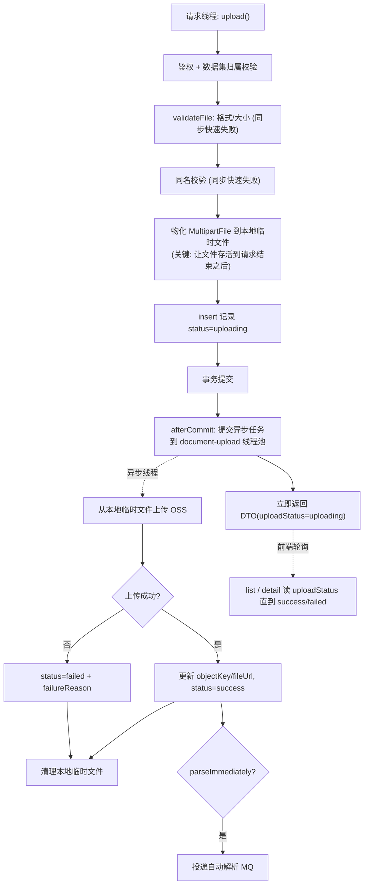

# document-upload-async Brief

> 来源：GitHub issue ql-link/LinkRag-Service#1「线程池僵尸配置清理 & 异步化场景规划」。
> 本 Brief 已对照真实代码核实 issue 的每条前提：核心判断（线程池僵尸 + 上传同步阻塞）成立；范围已按用户决策收敛为「**保留线程池并接入 P1 上传异步化 + 配置规范化**」，issue 中 P2/P3 及不存在的字段（`parseNoticeRetryCount`）不在本次范围。

## 0. 现状前提（决定范围的关键事实，已核实）

- **线程池是僵尸配置，但本就为上传预留**：`link-core` 的 `ThreadPoolConfig`（Bean `customThreadPool`）在全仓**无任何** `@Async` / `@Qualifier("customThreadPool")` / `CompletableFuture` 使用，确是僵尸。但三处配置的 `thread-name-prefix` 均为 `document-file-upload-`，表明它原本就是为文档上传异步化预留、只是从未接线。用户已决策：**保留并接入**，而非删除。
- **上传的慢点是请求线程内的 OSS 网络上传**：`DocumentFileServiceImpl.upload()` 标注 `@Transactional(noRollbackFor = BusinessException.class)`，在请求线程**同步**调用 `ossService.upload2PreviewUrl()`（网络 IO，大文件时阻塞明显）。
- **异步化所需的状态机已存在**：记录在 OSS 上传**之前**即以 `uploading` 落库；成功后更新为 `success` 并写 `objectKey`/`fileUrl`，失败则置 `failed` + `failureReason`。`DocumentFileDTO` 已含 `uploadStatus`，list 接口已支持按 `uploadStatus` 过滤，detail 可查单文件——**轮询终态所需的接口已具备**。
- **但前端当前未轮询**（已确认）：前端现在把 `upload` 的返回当作终态，**没有**基于 `uploadStatus` 轮询 list/detail 的逻辑。因此本需求**不是纯后端**，需前端配合改为轮询（见 §4 风险、§5 已决策）。
- **自动解析投递已用 afterCommit 模式**：`parseImmediately=true` 时，经 `submitAutoParseAfterCommit` 注册事务同步，在**事务提交后**才投递解析 MQ（`documentParseTaskService.submitAutoParseAfterUpload`）。本需求可复用同一 afterCommit 时机来触发异步上传。
- **上传 API 已定型**：`POST /api/v1/datasets/{datasetId}/files`（`file` + `parseImmediately`），返回 `Result<DocumentFileDTO>`。本次拟不改 URL/入参，仅改变返回时 `uploadStatus` 的语义。
- **请求体接收发生在 Controller 之前**：浏览器→Java 的 multipart 接收由 Servlet 容器在进入 `upload()` 前完成并落到容器临时文件。**因此异步化能省的是「Java→OSS」这一段网络上传时间，省不了「浏览器→Java」的请求体接收时间**（诚实标注，见 §4）。
- **配置暴露不一致**：`application-dev.yml` 已对 `core/max/queue` 暴露 `THREAD_POOL_*` 环境变量，但 `keep-alive-seconds`、`thread-name-prefix` 未暴露。两个相关测试只断言 yaml 的 key/内容（`EnvVarOverrideTest` 断言 `thread-pool.core-pool-size` 被 `THREAD_POOL_CORE_SIZE=10` 覆盖；`ConfigFileContentTest` 断言 dev 配置文本含 `${THREAD_POOL_*}`），**只要保留现有 yaml key 名，改 `@ConfigurationProperties` 不会破坏它们**。

## 1. 需求摘要

### 做什么

1. **接入线程池、上传异步化**：把 OSS 上传及其后续（状态回写、`parseImmediately` 时的自动解析投递）从请求线程移到专用线程池执行。`upload` 接口在记录落库（`uploading`）后**立即返回**，前端经既有 list/detail 轮询 `uploadStatus` 获取终态。
2. **线程池配置规范化（多池就绪）**：`ThreadPoolConfig` 从散落的 `@Value` 改为 `@ConfigurationProperties(prefix=thread-pool)` + 校验，配置由扁平单池改为**按池命名的嵌套结构** `thread-pool.<池名>.*`（本次仅 `document-upload`）；抽通用 `PoolProperties` + 工厂，**每业务一个独立池、各自拒绝策略与线程名,不共用通用池**；为 `keep-alive-seconds`、`thread-name-prefix` 补环境变量覆盖。
3. **在途上传兜底**：启动时清理残留的本地临时文件；定时扫描超时仍停在 `uploading` 的记录并置 `failed`，避免进程重启/崩溃导致记录永久卡在 `uploading`。

### 为什么做

- 大文件上传时 `ossService.upload2PreviewUrl()` 在请求线程同步阻塞，接口响应慢、占用请求线程，直接影响用户体验（issue P1）。
- `ThreadPoolConfig` 是僵尸配置（已核实），但其 `document-file-upload-` 前缀表明本就为此预留；与其留着不用，不如按原意接入，同时消除「散落 `@Value`、无校验、env 暴露不一致」的配置异味。

### 本次不做

- **不做 issue 的 P2/P3**：数据集删除并行化、缓存补偿改造、MQ 投递重试调度均不在本次。
- **不改不存在的东西**：issue 提到的 `parseNoticeRetryCount` 字段经全仓核实**不存在**，不处理；`CacheConsistencyService` 的 `Thread.sleep` 是「时间预算内主线程快速重试 + 补偿链路抛异常交 MQ 重投」的刻意设计，**不改**。
- **不删线程池配置**（用户已决定保留并接入）。
- **不引入分布式/持久化任务队列**：异步仍是**进程内**线程池。「进程重启丢失在途上传任务」的边界**不靠队列持久化解决**，而是用「启动清理 + `uploading` 超时扫描置 `failed`」兜底（已纳入本次范围，见 §1.3、§3.5）；这是**自愈到可重试态**，不是恢复在途上传本身。
- **不改 Python 端、不改 MQ 契约、不改解析链路语义**。
- **不改上传 API 的 URL 与入参**；仅改变返回时 `uploadStatus` 的语义（详见 §5 待确认：是否需要前端配合）。

## 2. 业务流程

### 2.1 主流程图（异步化后）

### 2.2 流程详解

- **同步阶段（请求线程，保留快速失败）**：鉴权、数据集归属、文件格式/大小、同名校验仍在请求线程同步执行，使「无权/格式不支持/超大/重名」等错误**仍能即时返回**，不退化体验。
- **临时文件物化**：Servlet 容器的 multipart 临时文件会在请求结束后被回收，异步线程无法再读。故请求线程需先把内容**物化到一份自管理的本地临时文件**（如 `transferTo`），交给异步任务，由异步任务在终态后清理。
- **事务边界**：请求侧事务仅负责「insert `uploading` 记录」并提交；异步任务在自己的事务里做终态回写。复用现有 afterCommit 时机，确保异步线程一定能看到已提交的 `uploading` 记录。
- **终态回写**：异步线程完成 OSS 上传后回写 `success`（含 `objectKey`/`fileUrl`）或 `failed`（含 `failureReason`）。
- **自动解析投递**：`parseImmediately=true` 的解析 MQ 投递从「请求侧 afterCommit」**移到异步上传成功分支之后**——只有 OSS 上传真正成功才投递，避免对尚未落 OSS 的文件触发解析。
- **前端获取终态**：复用既有 list（按 `uploadStatus` 过滤）/ detail 轮询，无需新增查询接口。

## 3. 核心模块与实现思路

### 3.1 线程池配置规范化（多池就绪，`link-core`）

- **位置**：`link-core/.../config/ThreadPoolConfig.java` + 三处 `thread-pool` 配置段（`application.yml` / `application-dev.yml` / `test/application.yml`）。
- **配置结构（多池就绪）**：从扁平单池改为**按池命名的嵌套结构** `thread-pool.<池名>.*`，本次只落 `thread-pool.document-upload.*`；未来业务加池 = 加一段同构配置 + 一个 `@Bean`，与已有池互不影响。原则是「一类业务一个专用池」，**按 IO 画像 / 拒绝策略 / 失败域隔离**，但不按方法泛滥拆。
- **改造**：`@Value` 散落字段 → `@ConfigurationProperties(prefix=thread-pool)` POJO，内含通用 `PoolProperties`（core/max/queue/keep-alive/thread-name-prefix + 校验，如均为正、`max≥core`）；抽**通用工厂方法**按 `PoolProperties` 构建池，每个池一个 `@Bean`、各带自己的线程名前缀与拒绝策略。
- **Bean 命名**：僵尸 bean 名 `customThreadPool` 改为场景名 `documentUploadExecutor`（避免未来被图省事共用）；该池线程名前缀沿用 `document-file-upload-`。
- **env 覆盖**：env 覆盖经 yaml 显式 `${THREAD_POOL_*:默认}` 占位符（非 Spring 松绑定），**document-upload 池的 env 占位符名保留不变**（故 `ConfigFileContentTest` 断言的占位符文本不破）；为 `keep-alive-seconds`、`thread-name-prefix` 在 dev 补占位符。未来池的 env 命名约定（如池作用域前缀）TD 定。
- **关键决策（修订原决策）**：放弃原「保留扁平 key」表述，属性路径改为嵌套 `thread-pool.document-upload.*`；`ConfigFileContentTest`（断言 dev 文本含 `${THREAD_POOL_*}`）经保留占位符名而**不破**，`EnvVarOverrideTest`（`@Value` 读取路径）随属性路径**微调**。拒绝策略见 §3.3。

### 3.2 上传异步化（`link-service`）

- **位置**：`link-service/.../impl/document/DocumentFileServiceImpl.java`（核心）；`DocumentFileController` 不改 URL/入参；DTO 不增字段（复用 `uploadStatus`）。
- **复用能力**：现有 `uploading/success/failed` 状态机、`failureReason` 回写、afterCommit 事务同步模式、list/detail 轮询。
- **新增能力**：请求侧物化临时文件；提交异步任务到专用线程池；异步任务内独立事务回写终态 + 清理临时文件 + 条件触发解析投递。
- **同名重试（已决策）**：现有重名校验对**所有**状态计数，导致一次 `failed` 后用户原名重试被「已存在同名」拦死。改为：撞到的同名记录若为 `failed` → **复用该行**（重置回 `uploading` 重新上传），若为 `uploading`/`success` → 才拦截。注意数据库存在唯一约束 `uk_dataset_user_name_suffix (dataset_id, user_id, original_filename, file_suffix)`，故只能**复用旧行**、不能插新行（否则撞唯一索引）。
- **上下游**：上游 `DocumentFileController.upload`；下游 `IOssService`（OSS 上传）、`DocumentParseTaskService.submitAutoParseAfterUpload`（解析投递）。

### 3.3 失败、背压与清理（横切）

- **失败可见性**：OSS 上传失败不再以 HTTP 错误抛给用户，而是落 `failed` + `failureReason`，由前端轮询发现。需保证「异步任务即使异常也能可靠写入 failed 状态 + 清理临时文件」。
- **背压/拒绝策略（已决策：拒绝 + 标记 `failed`）**：document-upload 池**不**沿用现 `ThreadPoolConfig` 的 `CallerRunsPolicy`（避免过载时退回请求线程同步执行、破坏「快速返回」保证）。改为：池+队列满时拒绝任务，提交侧捕获拒绝（提交发生在 afterCommit、仍在请求线程）后把已落库记录置 `failed` + 友好 `failureReason`（如「服务繁忙，请稍后重试」）并清理临时文件，由用户重试。该池为专用池，拒绝语义与 link-core 其他潜在用途隔离。
- **临时文件清理**：终态后清理；并需有重启残留临时文件的兜底清理思路（见 §4）。
- **孤儿对象（已决策：打日志兜底）**：异步任务「OSS 上传成功 → DB 回写 `success`」非原子，若 OSS 成功但 DB 回写失败，会出现「OSS 有对象、DB 记录无 `objectKey` 且最终被超时扫描置 `failed`」的孤儿。OSS 与 DB 无法纳入同一事务，首版**不做对象补偿删除**，按标准务实做法：**在 DB 回写失败时打告警日志并带上 `objectKey`**，留痕供事后人工/对账清理。

### 3.4 契约与文档同步

- `uploadStatus` 返回语义变化（同步终态 → 立即 `uploading`）→ `docs/reference/api_contracts.md`。
- 线程池配置项 / 新增 env var → `docs/guides/configuration.md`。
- 文档文件链路说明 → `docs/architecture/document_file_module.md`（上传段落）。

### 3.5 在途上传持久性兜底（`link-service`，已决策纳入本次）

- **启动清理**：应用启动时清理本地临时目录中残留的上传临时文件（上次进程异常退出遗留）。
- **`uploading` 超时扫描**：定时扫描创建后超过阈值仍停在 `uploading` 的记录，置 `failed` + `failureReason`（如「上传超时，请重试」），使其自愈到用户可重试态。
- **关键决策**：这是「自愈到可重试」而非「恢复在途上传」；阈值与扫描间隔为实现级参数（TD 定，需明显大于正常 OSS 上传耗时以免误杀正常在途任务）。可参考 `parse-result-consumer-resilience` 的卡住扫描思路（按时间阈值扫描 + 兜底处置）。

## 4. 风险与不确定性

| 风险 / 问题 | 触发条件 | 影响 | 当前判断 / 应对方向 |
| :--- | :--- | :--- | :--- |
| 进程内线程池不持久 | 异步任务在途时进程重启/崩溃 | 记录停在 `uploading`，本地临时文件残留 | **已决策兜底**：启动清理残留临时文件 + 定时扫描 `uploading` 超时记录置 `failed`（§3.5）；自愈到可重试态，不引持久队列。阈值/间隔 TD 定 |
| 返回语义变化破坏前端（跨端） | 前端把 upload 返回当终态、不轮询（**已确认**） | 前端拿到 `uploading` 误判为已完成，永远看不到终态 | **跨端依赖**：需前端同步改为按 `uploadStatus` 轮询 list/detail。需与前端排期联动，本需求落地前置依赖（§5 已决策） |
| 池满拒绝导致部分上传失败 | 高并发打满核心线程+队列 | 过载时部分上传被拒、落 `failed`，用户需重试 | **已决策**：拒绝 + 标记 `failed`（不退回同步）。需在 api/配置文档标注过载行为；池大小/队列容量按预期并发调参（默认 5/10/50） |
| 本地临时磁盘占用 | 大文件 / 高并发物化到本地临时目录 | 磁盘打满导致上传失败 | 选定临时目录与容量预期；失败即落 `failed`；清理策略兜底（§5.3） |
| 异步失败无人察觉 | OSS 持续故障，大量文件落 `failed` | 仅状态+日志，无聚合告警 | 首版至少保证 failed+failureReason+日志；是否加指标/告警见 §5.4（可参考 parse-result-consumer-resilience 的指标做法） |
| 收益预期被高估 | 误以为异步化能加速「浏览器→Java」 | 大文件慢上传体验未达预期 | 诚实标注：异步化只省「Java→OSS」段；浏览器→Java 接收时间不变（§0） |
| 物化与同步校验顺序 | 校验依赖已读取的文件内容 | 顺序不当导致重复读流/读空流 | 明确「先校验格式/大小（用元数据）→ 再物化」；MultipartFile 流只读一次的约束在 TD 固化 |
| OSS 成功但 DB 回写失败 → 孤儿对象 | OSS 上传成功瞬间 DB 抖动/超时 | OSS 留下无人引用对象，白占存储；DB 最终被扫描置 `failed` 与 OSS 不一致 | **已决策**：OSS/DB 无法同事务，首版不做补偿删除，**回写失败时打告警日志 + `objectKey`** 留痕；对账/补偿删除留作后续增强 |

## 5. 已冻结决策（2026-05-29）

- **返回语义 + 前端配合**：upload 改为落库后立即返回 `uploadStatus=uploading`，OSS 失败落 `failed`。前端当前**未轮询**，需同步改为按 `uploadStatus` 轮询 list/detail——**本需求为跨端需求**，需与前端排期联动。
- **拒绝策略**：document-upload 池满时**拒绝 + 标记 `failed`**（友好 `failureReason`，用户重试），不沿用 `CallerRunsPolicy` 降级为同步。
- **线程池结构（多池就绪）**：**每业务一个专用池、不共用通用池**；配置改为嵌套 `thread-pool.<池名>.*`，本次仅实现 `document-upload`（bean `documentUploadExecutor`，前缀 `document-file-upload-`），未来加池 = 加配置段 + bean。**修订**原「保留扁平 key」决策：env 占位符名保留、属性路径转嵌套（§3.1）。
- **持久性兜底**：纳入「启动清理残留临时文件 + 定时扫描 `uploading` 超时记录置 `failed`」（§3.5）；不引入持久化任务队列。
- **同名重试**：同名校验区分状态——撞到 `failed` 记录则复用该行重置为 `uploading` 重传，撞到 `uploading`/`success` 才拦截。受唯一约束 `uk_dataset_user_name_suffix` 限制，只复用旧行、不插新行（§3.2）。
- **孤儿对象**：OSS/DB 不可同事务，首版不做对象补偿删除；DB 回写失败时打告警日志 + `objectKey` 留痕兜底（§3.3）。
- **失败可观测性（首版）**：至少 `failed` 状态 + `failureReason` + 日志；指标/告警本次不做（如需可后续单独增强）。
- **actuator 线程池指标**：本次不做，后续单独评估（保持范围聚焦）。
- **需求命名**：`document-upload-async`。
- **API 形态**：upload 的 URL 与入参不变，仅 `uploadStatus` 返回语义变化；不新增查询接口（复用 list/detail）。

> 留待 technical_design 收敛的实现级细节（不影响验收）：线程池核心/最大/队列与拒绝处理的具体接线；本地临时目录位置与容量预期（是否复用 `PrivateFileResolver` 目录约定）；`uploading` 超时阈值与扫描间隔；afterCommit 提交被拒时回写 `failed` 与已构建 DTO 的一致性处理；config 校验规则（max≥core 等）。
