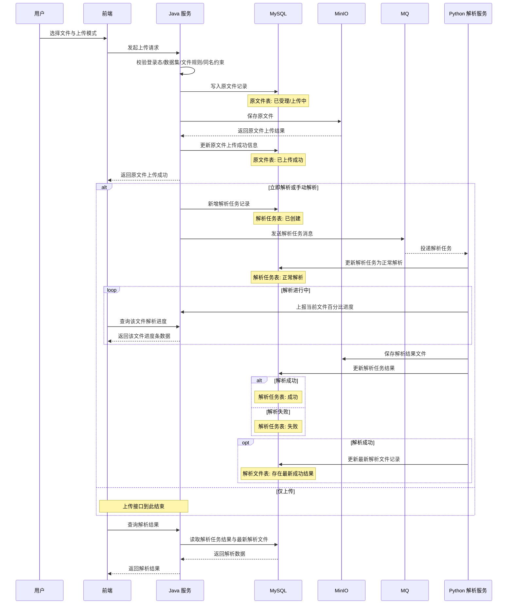
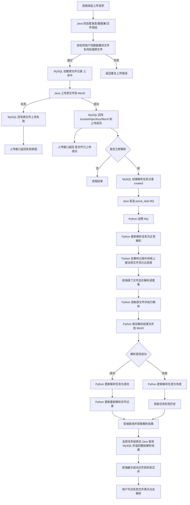

# ToLink Service 文件上传与解析协同重构 一期需求文档

> **文档状态：** 草稿 
> **职能说明：** 面向产品、Java 服务、Python 解析服务与测试协同使用 
> **项目名称：** ToLink Service 
> **模块名称：** 文件上传与解析协同重构（一期） 
> **分支信息：** 
> **主分支：** master 
> **相关分支：** skill-test 
> **负责人：** AI 协作草拟 
> **最后更新时间：** 2026-04-24 

---

## 1. 文档修订记录 (Change Log)
*规范：任何需求变更必须在此记录，杜绝口头需求。*

| 版本号 | 修改日期 | 修改内容简述 | 提出人 | 审核人 |
| :--- | :--- | :--- | :--- | :--- |
| v1.0 | 2026-04-24 | 初始化一期 PRD，明确上传、解析触发与解析任务边界 | AI | 待审核 |

---

## 2. 业务层 (Business Layer)

### 2.1 需求背景

- 当前现状：项目已具备数据集、对象存储和异步协作能力，但“文件上传后如何进入解析链路”缺少一份统一、清晰、可审核的需求定义。
- 当前问题：
  - 原文件上传、解析触发、解析结果落地的职责边界没有统一沉淀。
  - 用户上传后的可见状态和失败反馈规则没有完整定义。
  - 原文件唯一、解析可重复触发、历史任务保留等业务约束尚未固化为正式需求。
- 触发本次需求的原因：需要围绕数据集文件上传主链路重建一份可独立交付的一期需求文档，为后续技术设计和实现提供稳定边界。

### 2.2 需求目标

- 业务目标：一期先支持用户在指定数据集下上传原始文件，并稳定记录原文件上传事实，为二期解析协同链路预留数据边界。
- 用户目标：用户能够在上传阶段看到每个文件的上传进度，并在上传完成后看到原文件上传结果。
- 本次完成后的预期收益：
  - 原文件上传主链路边界清晰。
  - 原文件唯一性、上传状态、MinIO 定位信息形成统一口径。
  - 后续技术设计可围绕稳定的业务对象和流程展开，而不是边做边猜。

### 2.3 范围与分期

**本期必须完成：**

- 定义用户在数据集下上传原始文件的业务规则。
- 定义本期只完成原文件上传与原文件记录，不触发真实解析链路。
- 定义原文件唯一约束和用户可见状态规则。
- 定义上传进度展示边界：上传进度由前端在上传过程中本地展示，不要求后端落库。
- 在本期 PRD 中保留二期解析协同目标，作为后续技术设计依据。

**本期明确不做：**

- 不投递解析 MQ。
- 不接入 Python 解析服务。
- 不实现 Python 返回百分比解析进度。
- 不创建真实解析任务。
- 不写入解析任务结果和最新解析文件。
- 不定稿具体接口字段、表字段、索引名和对象路径实现方案。
- 不扩展到检索、问答、向量化等后续消费链路。

**后续期次规划：**

- 一期：完成原文件上传、MinIO 存储、原文件记录落库、同名唯一约束和上传结果反馈。
- 二期：补充解析任务创建、MQ 投递、Python 解析、解析百分比进度、解析任务结果、最新解析文件、失败文件重试。
- 三期：视业务需要再评估是否扩展到下游知识处理、检索联动或更多解析模式。

### 2.4 角色与参与方

| 角色/系统 | 身份说明 | 在本需求中的职责 |
| :--- | :--- | :--- |
| 用户 | 已登录并可访问目标数据集的业务用户 | 一期上传文件并查看上传结果；二期选择是否立即解析、查看解析进度和结果 |
| 管理员 | 平台管理或运维角色 | 本期不作为独立主流程角色，但可能参与排查异常任务 |
| Java 服务 | 上传主链路提供方 | 一期接收上传请求、记录原文件事实、保存原文件到 MinIO、返回上传结果 |
| Python 解析服务 | 异步解析执行方 | 二期消费解析消息、执行解析、写入解析任务表、保存解析结果文件，并更新最新解析文件 |
| MQ / 对象存储 / 数据存储 | 中间件能力提供方 | 一期使用对象存储和 MySQL；二期接入 MQ 与解析进度通道 |

### 2.5 核心业务场景

#### 场景 A：用户仅上传原始文件

- 触发条件：用户在数据集下选择文件上传，并关闭“立即解析”开关。
- 主流程：
  - 用户提交上传请求。
  - 系统受理请求并创建原文件记录。
  - 系统完成原文件存储。
  - 系统向用户返回上传结果。
- 用户可见结果：文件上传成功，解析状态为“未解析”或等价业务语义。

#### 场景 B：二期目标：用户上传后立即解析

- 触发条件：二期用户在数据集下选择文件上传，并开启“立即解析”开关。
- 主流程：
  - 用户提交上传请求。
  - 系统完成原文件记录和原文件存储，并返回上传成功。
  - 系统创建一次解析任务并发送解析消息。
  - Python 解析服务后续异步处理解析任务，并负责更新解析任务状态与最终结果。
- 用户可见结果：
  - 上传阶段：原文件上传成功。
  - 解析阶段：前端可按文件持续查看解析百分比进度条。
  - 完成阶段：解析完成后，前端可查看最终解析结果。
- 本期说明：本场景仅作为二期目标保留在 PRD 中，一期不实现 MQ 投递、Python 解析、解析进度和解析结果。

#### 场景 C：二期目标：用户对已上传文件再次发起解析

- 触发条件：二期用户在已上传文件上点击解析按钮。
- 主流程：
  - 系统为该原文件新增一次解析任务。
  - 系统发送新的解析消息。
  - Python 解析服务异步执行本次解析，并负责更新解析任务状态与最终结果。
- 用户可见结果：
  - 任务受理后进入解析中。
  - 前端可按文件持续查看本次解析百分比进度条。
  - 本次解析完成后，可查看对应解析结果。
- 本期说明：本场景仅作为二期目标保留在 PRD 中，一期不实现手动解析入口。

#### 场景 D：用户批量上传多个文件

- 触发条件：用户一次选择多个文件发起上传。
- 主流程：
  - 前端按文件逐个发起上传。
  - 每个文件在上传阶段显示独立上传进度。
  - 当前文件上传完成后，前端切换展示下一个文件的上传进度。
  - 二期对于已进入解析的文件，前端按队列逐个展示当前文件在解析过程中的百分比进度。
  - 二期当某个文件解析完成后，前端切换展示下一个待解析文件的进度。
  - 二期当本次批量上传中的全部解析任务结束后，前端统一查询全部文件的解析结果。
  - 二期前端在结果列表中展示解析成功文件和解析失败文件。
  - 二期对于解析失败文件，用户可再次点击解析发起重试。
- 用户可见结果：一期用户能逐个看到每个文件的上传进度和上传结果；二期继续补齐解析进度、整批解析结果汇总和失败文件重试。

### 2.6 关键异常场景

| 异常场景 | 触发条件 | 系统预期行为 | 用户可见结果 |
| :--- | :--- | :--- | :--- |
| 重复上传已成功的同名原文件 | 同一用户在同一数据集下已存在相同文件名、相同后缀且上传成功的原文件 | 系统拒绝重复创建新的原文件事实 | 用户看到文件已存在或重复上传被拒绝的明确信息 |
| 失败原文件重试上传 | 同一用户在同一数据集下已存在相同文件名、相同后缀但上传失败的原文件 | 系统复用原失败记录重新上传对象存储，不新建原文件记录 | 用户可再次上传同名同后缀文件，成功后该记录变为上传成功 |
| 上传中断后状态悬挂 | 原文件记录已进入上传中，但 1 分钟内没有成功或失败状态更新 | 系统通过后台超时补偿将上传中的记录更新为上传失败，并记录失败原因 | 用户后续可再次上传同名同后缀文件并触发失败记录重试 |
| 原文件存储失败 | 原文件记录已受理，但对象存储未成功 | 系统保留可识别的上传失败状态和失败原因，允许后续复用该记录重试 | 用户看到上传失败或文件未完成入库的明确信息 |
| 上传成功但解析任务未完成 | 二期选择立即解析或手动解析后，本次解析任务仍处于处理中或尚未产出成功结果 | 上传结果仍然成立，并允许在解析完成前持续查看解析百分比进度条 | 用户看到上传成功，解析仍在进行中 |
| Python 解析失败 | 二期解析服务处理失败后写入失败任务 | 保留本次解析任务历史与失败结果，不覆盖当前最新解析文件 | 用户可见本次解析失败，并可再次发起解析 |

### 2.7 验收标准

| 验收项 | 验收标准 | 验证方式 |
| :--- | :--- | :--- |
| 原文件上传 | 用户可在有权限的数据集下上传原始文件，并得到明确成功或失败反馈 | 接口联调、人工验证 |
| 原文件唯一 | 同一用户在同一数据集下，相同文件名和相同后缀的原文件不能被重复作为新文件上传 | 人工验证、测试用例验证 |
| 失败上传重试 | 上传失败的同名同后缀原文件可复用原记录重新上传，重试成功后变为上传成功 | 人工验证、测试用例验证 |
| 上传模式区分 | 一期只完成原文件上传；上传后立即解析作为二期目标保留，不触发真实解析链路 | 接口联调、状态验证 |
| 分阶段反馈 | 一期前端能够获得原文件上传成功；解析过程中百分比进度条和最终解析结果放到二期验收 | 联调验证、前端交互验证 |
| 批量上传可视化 | 批量上传时，前端能够按文件展示上传进度，一个完成后展示下一个 | 联调验证、前端交互验证 |
| 批量解析汇总 | 二期批量解析全部结束后，前端能够统一查询并展示全部文件的解析结果，且失败文件可再次发起解析 | 联调验证、前端交互验证 |
| 重复解析支持 | 二期已上传文件可多次发起解析，且每次都形成独立解析任务记录 | 人工验证、测试用例验证 |
| 任务历史保留 | 二期系统不会因重新解析而覆盖掉历史解析任务事实，并能在最新解析文件中体现当前成功解析次数 | 人工验证、测试用例验证 |
| 解析失败可感知 | 二期上传成功但解析任务未成功完成时，用户能看见明确状态，并允许再次发起解析 | 人工验证、状态展示验证 |

---

## 3. 架构约束层 (Architecture Constraint Layer)

### 3.1 主业务维度

- 本需求围绕的主业务对象：数据集下的原始文件及其解析任务。
- 其他对象如何归属于主业务对象：解析任务归属于原始文件，原始文件归属于数据集，操作行为归属于当前登录用户。
- 明确不是主维度的对象：下游检索数据、问答数据、向量化结果、运营统计结果。

### 3.2 系统职责划分

| 端 / 系统 / 模块 | 负责内容 | 明确不负责内容 |
| :--- | :--- | :--- |
| 前端 | 一期选择文件、触发上传、按文件展示上传进度；二期展示解析百分比进度和解析结果 | 不负责定义解析任务内部规则 |
| Java 端 | 一期接收上传请求、保存原文件事实；二期创建解析任务、发送 MQ，并对前端提供解析任务状态与最终结果查询能力 | 不负责执行文件解析，也不负责推进解析任务状态 |
| Python 端 | 二期消费解析任务、拉取原文件、执行解析、保存解析结果文件，并负责更新解析任务状态、最终结果以及解析进度通道 | 不负责原文件上传入口与前端交互 |
| 中间件 / 任务系统 | 一期使用对象存储；二期承接异步消息传递和解析进度临时存储 | 不负责业务规则判定 |
| 对象存储 / 数据存储 | 一期保存原文件和原文件记录；二期保存解析结果文件、解析任务和最新解析文件记录 | 不负责决定是否触发解析 |

### 3.3 核心业务流程

#### 全量目标时序图（二期目标链路）

说明：下图保留完整上传与解析目标链路。虚线之后的 MQ、Python 解析、解析进度和解析结果属于二期目标，不进入一期实现范围。

#### 全量目标流程图（二期目标链路）

说明：下图保留完整任务与结果链路。MQ 投递、Python 百分比进度、解析任务结果和最新解析文件更新属于二期目标。

#### 关键补充说明

- 主链路说明：一期用户先完成原文件上传，并获得原文件上传结果；后续解析是否触发、解析进度和解析结果统一放到二期。
- 批量展示说明：一期前端一次上传多个文件时，上传进度按文件逐个展示；二期补齐按文件解析进度、整批结果汇总和失败文件再次解析入口。
- 与其他链路的衔接关系：解析链路是上传后的异步协同链路，不改变“上传成功”本身的业务成立条件。
- 本期不进入的后续链路：解析结果如何被检索、消费或选为当前生效版本，不在本期范围内。
- 上传接口返回口径：一期上传接口只返回原文件上传结果。自动解析、解析任务标识、解析进度和最终解析结果放到二期接口补齐。
- 进度展示口径：
  - 上传进度由前端在文件上传过程中本地展示，不要求落库。
  - 二期解析进度由 Python 通过独立进度通道上报给 Java，供前端在解析完成前按文件展示百分比进度条，不要求写入解析任务表。

### 3.4 关键状态与结果

| 对象 | 关键状态 | 状态含义 | 谁负责更新 | 谁需要感知 |
| :--- | :--- | :--- | :--- | :--- |
| 原始文件 | 已受理 / 已上传成功 / 上传失败 | 描述原文件上传事实是否完成 | Java 端 | 用户、前端 |
| 解析任务（二期） | 已创建 / 正常解析 / 成功 / 失败 | 描述某次独立解析任务的生命周期与结果 | Java 端创建，Python 端直接写入与推进 | 用户、前端、排障人员 |
| 解析文件（二期） | 无最新结果 / 存在最新成功结果 | 描述当前原文件是否已有最新成功解析文件 | Python 端在成功时更新 | 用户、前端 |

### 3.5 核心数据对象

先列出本需求涉及的数据对象总览：

| 数据对象 | 职责说明 | 与主维度关系 | 本期是否需要 |
| :--- | :--- | :--- | :--- |
| 数据集 | 原文件的业务归属容器 | 主维度上游对象 | 是 |
| 原始文件 | 记录用户上传的源文件事实 | 主维度核心对象 | 是 |
| 解析任务 | 记录每次解析尝试及其结果 | 原始文件的派生对象 | 二期 |
| 解析文件 | 描述原文件当前最新成功解析结果 | 与原始文件一一对应的结果对象 | 二期 |

然后对每个关键数据对象分别补充以下说明：

#### 数据对象 A：原始文件

- 对象职责：承载用户上传的原始文件事实，并作为后续解析任务的来源对象。
- 记录的核心事实：归属哪个数据集、由谁上传、是否已完成对象存储、原文件访问定位信息是什么。
- 归属关系：归属于某个数据集，并由某个用户发起上传。
- 与其他对象的关系：一个原始文件可对应多次解析任务。
- 本期是否必须存在：是。
- 关键状态/结果是否挂在该对象上：只挂原文件上传状态，不挂解析过程状态、解析次数和解析结果。
- 明确不放在该对象中的内容：不在本期要求该对象承担解析任务历史、解析进度、解析失败原因和最新解析结果文件明细。

#### 数据对象 B：解析任务

- 对象职责：二期记录一次独立解析触发的事实、状态和结果。
- 记录的核心事实：由哪一个原始文件触发、本次解析当前处于什么任务状态、解析发生时间、是否执行成功、失败时的任务结果。
- 归属关系：归属于某个原始文件。
- 与其他对象的关系：同一个原始文件可保留多条解析任务。
- 本期是否必须存在：否，二期实现。
- 关键状态/结果是否挂在该对象上：是，解析历史与每次解析结果需要挂在该对象上，并由 Python 端负责写入和推进。
- 明确不放在该对象中的内容：不在本期要求该对象承担原文件上传事实、解析百分比进度值，也不承担最新解析文件的唯一读取入口职责。

#### 数据对象 C：解析文件

- 对象职责：二期承载原文件当前最新一次成功解析后的结果文件事实。
- 记录的核心事实：当前最新成功解析文件由哪次成功任务产生、该结果文件的存储定位信息，以及当前原文件累计成功解析次数。
- 归属关系：与某个原始文件一一对应。
- 与其他对象的关系：解析任务成功后由 Python 端更新该对象，并递增成功解析次数；历史解析过程仍保留在解析任务对象中。
- 本期是否必须存在：否，二期实现。
- 关键状态/结果是否挂在该对象上：是，但只承载“当前最新成功结果”，不承载全部解析历史。
- 明确不放在该对象中的内容：不在本期定义历史版本列表和结果切换策略。

说明：

- 本节在 PRD 中采用“对象级模型”，用于提前锁定业务边界、职责边界和对象关系。
- 本节不要求给出最终表字段、字段类型、索引或 SQL。
- 最终字段级模型放在 `technical_design.md`。

### 3.6 依赖与协作关系

| 依赖项 | 依赖类型 | 对本需求的影响 | 当前状态 |
| :--- | :--- | :--- | :--- |
| 登录与鉴权 | 系统 | 决定谁能上传和谁能再次触发解析 | 已具备 |
| 数据集管理 | 系统 | 决定原始文件归属和权限边界 | 已具备 |
| 对象存储 | 组件 | 决定原文件和解析结果文件能否落地保存 | 已具备 |
| MQ 异步协作 | 组件 | 二期决定解析任务能否从 Java 侧传递给 Python 侧 | 已具备 |
| Python 解析服务 | 外部系统 | 二期决定解析任务能否被实际执行，并直接写入任务状态、结果文件与最新解析结果 | 待确认 |

---

## 4. 技术边界层 (Technical Boundary Layer)

### 4.1 关键技术约束

本节用于提前敲定那些会影响需求边界和职责边界的技术约束，但不展开最终实现方案。

| 约束项 | 当前约束说明 | 是否本期定稿 |
| :--- | :--- | :--- |
| 核心存储边界 | 一期原文件属于对象数据，上传状态属于结构化业务数据；二期补充解析文件、任务状态与任务结果 | 是 |
| 系统间交互方式 | 一期不接入 Java/Python 异步协作；二期 Java 通过 MQ 下发任务，Python 解析后直接写入任务与结果数据 | 是 |
| 关键定位信息生成方 | 二期每次解析都需要一个独立任务标识，用于识别一次解析尝试 | 否 |
| 幂等与稳定性要求 | 一期原文件上传以“数据集 + 用户 + 文件名 + 后缀”识别重复提交；二期重复解析需保留历史事实 | 是 |
| 交互载荷边界 | 二期确认 parse_task 消息需要传递最小必要的原文件定位与任务识别信息 | 否 |
| 进度展示边界 | 一期上传进度走前端本地链路；二期解析进度走独立进度通道，不进入解析任务表 | 是 |
| 状态更新责任 | 一期 Java 负责原文件上传结果；二期 Java 负责解析任务创建，Python 负责解析任务状态、结果以及最新解析文件的写入与更新 | 是 |
| 扩展兼容要求 | 后续期次需要保留重复解析、结果治理与失败补偿的扩展空间 | 是 |

### 4.2 涉及的存储与中间件类型

* [x] 关系型数据库
* [ ] 缓存
* [x] 消息队列
* [x] 对象存储
* [ ] 搜索 / 向量检索
* [x] 外部系统
* [ ] 其他：__________

### 4.3 本期需要提前确认的技术原则

- 上传成功与解析成功是两类不同业务结果，不能混为同一成功语义。
- 原文件事实需要稳定保留，解析任务允许重复产生并保留历史。
- 二期解析文件对象只承载当前最新成功结果，不承载历史任务过程。
- 二期解析任务的状态、结果和失败原因统一沉淀在解析任务对象中。
- 二期解析百分比进度仅用于前端展示，不进入解析任务表持久化。
- 用户可感知状态必须覆盖“上传成功但解析未成功”的业务场景。
- 需求阶段只确认原则和边界，不在本期固化消息体细节和最终数据结构细节。

### 4.4 延后到技术方案确认的内容

以下内容可以在 PRD 中先描述原则，不要求在本阶段定到最终实现细节：

- 具体表字段与索引
- 具体消息结构与代码模型
- 具体接口字段
- 具体对象命名规则
- 具体包结构、类结构与实现方式

---

## 5. 风险、依赖与待确认问题 (Dependencies & Open Issues)

### 5.1 当前主要风险

- 一期上传链路同时涉及 MySQL 与 MinIO。对象存储失败是主要异常；对象存储成功但数据库回写失败属于低概率异常，技术方案中按告警和人工排查处理。
- 二期 Python 解析服务的结果回写边界若后续变化，可能影响解析任务状态流转口径。
- 二期当前按“最新成功结果”更新解析文件对象，后续若要支持人工切换生效版本，读取侧语义需要补充。

### 5.2 前置依赖

- 一期需要现有登录、数据集权限、对象存储和 MySQL 能力保持可用。
- 二期需要 MQ 能力、Python 解析服务、解析进度通道与本需求约定保持一致。

### 5.3 待确认问题

- 二期 MQ 消息体的业务载荷范围由谁最终确认。
- 一期上传中记录的超时补偿已定：1 分钟内没有成功或失败状态更新，即由后台补偿任务置为上传失败。
- 二期重复解析后，是否需要在后续期次中引入“当前生效版本”的业务语义。
- 二期管理员或运营侧是否需要查看解析任务历史和失败原因列表。
