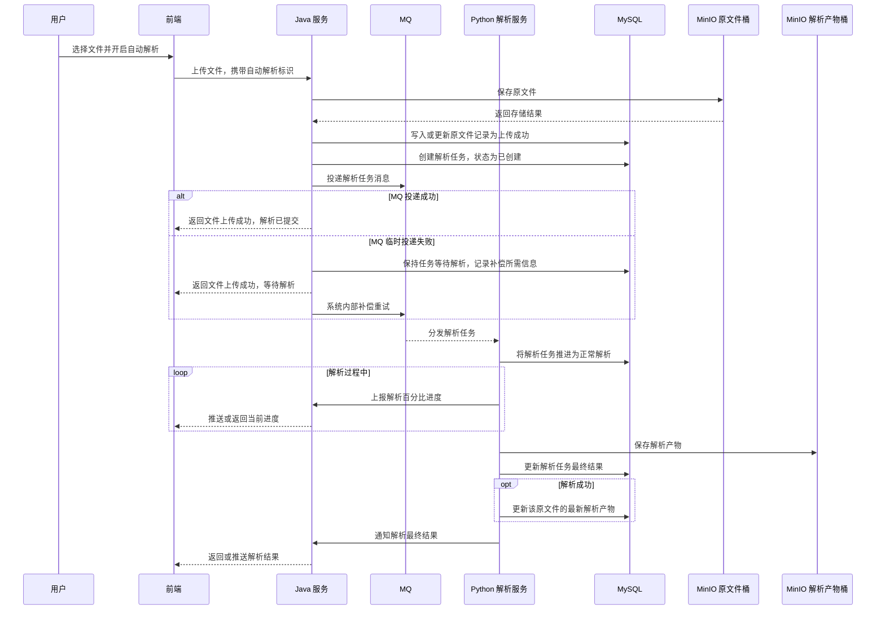
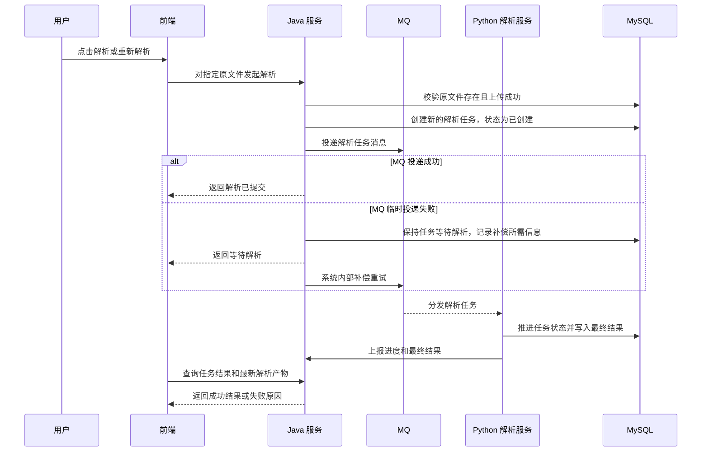

# ToLink Service 文件上传与解析协同重构二期产品需求文档 (PRD)

> **文档状态：** 已审核
> **项目名称：** ToLink Service
> **模块名称：** 文件上传与解析协同重构（二期）
> **分支名称：** feature/knowledge_file_upload_and_parse
> **产品负责人：** AI 协作草拟
> **最后更新时间：** 2026-04-26

---

## 1. 文档修订记录 (Change Log)

| 版本号 | 修改日期 | 修改内容简述 | 提出人 | 审核人 |
| :--- | :--- | :--- | :--- | :--- |
| v1.0 | 2026-04-25 | 初始化二期 PRD，明确解析任务、MQ 协作、Python 解析、进度展示与解析结果边界 | AI | 待审核 |
| v1.1 | 2026-04-26 | 按一期已落地链路重建二期需求边界，确认 Java 创建解析任务、上传后自动解析、手动解析、进度展示与结果通知口径 | AI | 待审核 |

---

## 2. 需求背景与业务目标 (Overview)

### 2.1 业务概览与核心逻辑 (Business Overview)

* **业务定位：** 一期已经完成原文件上传、MinIO 存储、原文件记录、幂等上传、上传失败重试和上传超时处理。二期在此基础上补齐“文件解析协同链路”，让上传成功的原文件可以进入异步解析流程，并将解析任务、解析状态、失败原因和最新解析产物变成前端可感知、可查询、可重试的业务能力。
* **核心逻辑主线：** 用户上传成功后可选择自动解析，也可在文件列表中手动解析。Java 端负责创建解析任务并投递 MQ；Python 端消费任务后执行解析，并通过回调接口或 MQ 通知 Java 解析进度和最终结果；前端展示当前文件的解析进度，批量任务全部完成后展示成功和失败文件，并允许失败文件再次解析。
* **核心价值：** 上传链路与解析链路解耦，避免文件上传被长耗时解析阻塞；重复解析以任务历史形式保留；每个原文件始终有一个最新成功解析产物入口，便于后续知识处理链路继续扩展。

### 2.2 核心节点目标与验收准则 (Key Milestones)

| 核心功能节点 | 预期达成目标 | 关键验收点 (DoD) |
| :--- | :--- | :--- |
| 解析触发 | 已上传成功的原文件支持自动解析和手动解析 | 上传成功且开启自动解析时进入解析链路；文件列表中可对上传成功文件手动发起解析 |
| 解析任务创建 | 每次解析触发都形成独立解析任务 | 同一原文件可多次触发解析，每次都有独立任务记录和任务状态 |
| MQ 投递 | Java 创建任务后将解析请求投递给 Python | Python 能接收到解析请求并开始处理；临时投递失败由系统内部补偿，超过补偿范围后任务失败并可重新触发 |
| 解析进度展示 | 前端能在解析完成前展示百分比进度 | Python 解析过程中通知 Java，前端可看到当前文件解析进度条 |
| 解析结果反馈 | Python 解析完成后通知 Java 并更新业务结果 | 成功时可查询最新解析产物；失败时可展示失败原因 |
| 批量文件体验 | 多文件上传/解析时前端逐个展示进度并汇总结果 | 当前文件完成后切换下一个；全部完成后列出失败文件并提供重试入口 |

---

## 3. 核心架构与业务流程 (Architecture & Flow)

### 3.1 核心业务时序图 (Sequence Diagrams)

#### 场景 1：上传后自动解析



#### 场景 2：手动解析 / 失败重试



### 3.2 状态机定义 (State Machine)

| 对象 | 当前状态 | 触发动作/条件 | 流转后状态 | 备注 |
| :--- | :--- | :--- | :--- | :--- |
| 解析任务 | 已创建 | Java 创建解析任务成功 | 已创建 | 表示任务已被业务接受，等待投递或消费 |
| 解析任务 | 已创建 | MQ 临时投递失败 | 已创建 | 仍表现为等待解析，由系统内部补偿 |
| 解析任务 | 已创建 | MQ 超过补偿范围仍无法投递 | 失败 | 失败原因用于前端展示和用户重试 |
| 解析任务 | 已创建 | Python 接收任务并开始解析 | 正常解析 | Python 负责推进解析执行状态 |
| 解析任务 | 正常解析 | Python 解析成功 | 成功 | 成功后可更新最新解析产物 |
| 解析任务 | 正常解析 | Python 解析失败 | 失败 | 失败原因用于前端展示和用户重试 |
| 解析产物 | 无最新成功产物 | 原文件首次解析成功 | 存在最新成功产物 | 与原文件一一对应 |
| 解析产物 | 存在最新成功产物 | 原文件再次解析成功 | 更新为最新成功产物 | 成功解析次数只在解析成功后更新 |

说明：解析进度百分比是前端展示数据，不作为解析任务表的持久化状态。

---

## 4. 功能规格与交互逻辑 (Functional Specs)

### 4.1 页面交互与功能示意 (UI & Functionality)

* **只上传模式：** 用户上传文件但不开启自动解析时，前端展示上传中；上传失败时展示上传失败；上传成功后展示“已上传，待解析”，用户后续可手动点击解析。
* **上传并立即解析模式：** 用户上传文件并开启自动解析时，前端先展示上传中；上传成功后不需要单独停留在“上传成功”，而是直接进入“等待解析”或“解析中”；上传失败时只展示上传失败，不进入解析流程。
* **手动解析：** 用户可对上传成功的原文件点击解析。适用场景包括未解析、解析失败、需要重新解析。手动解析提交后，前端展示“等待解析”，Python 开始处理后进入“解析中”。
* **解析进度条：** 解析进行中，前端展示当前文件的百分比进度。若用户批量上传或批量解析多个文件，当前文件完成后再切换展示下一个文件。
* **解析结果汇总：** 所有文件解析流程结束后，前端查询并展示本批文件解析结果，结果只展示解析文件名和解析结果，失败文件展示业务化失败原因。
* **失败重试：** 解析失败的文件允许用户再次点击解析。再次解析创建新的解析任务，不覆盖历史任务。
* **重复点击限制：** 同一原文件存在等待解析或解析中的任务时，前端不允许用户再次点击解析。
* **解析产物访问：** 二期前端不提供解析产物下载和预览能力，只展示解析结果状态。

### 4.1.1 前端统一展示状态

| 前端状态 | 展示含义 | 适用场景 |
| :--- | :--- | :--- |
| 上传中 | 原文件正在上传 | 两种模式均适用 |
| 上传失败 | 原文件上传失败，可重新上传 | 两种模式均适用 |
| 已上传，待解析 | 原文件上传成功，但未自动提交解析 | 只上传模式 |
| 等待解析 | 解析任务已提交，等待系统投递、消费或开始处理 | 手动解析、上传并立即解析 |
| 解析中 | Python 正在解析，展示百分比进度 | 手动解析、上传并立即解析 |
| 解析成功 | 当前文件解析完成且成功 | 手动解析、上传并立即解析 |
| 解析失败 | 当前文件解析失败，可再次解析 | 手动解析、上传并立即解析 |

状态流转说明：

```text
只上传模式：
上传中 -> 上传失败
上传中 -> 已上传，待解析 -> 等待解析 -> 解析中 -> 解析成功 / 解析失败

上传并立即解析模式：
上传中 -> 上传失败
上传中 -> 等待解析 -> 解析中 -> 解析成功 / 解析失败
```

说明：上传成功但 MQ 临时投递失败时，前端不直接展示“解析提交失败”，仍展示“等待解析”，由系统内部补偿。超过补偿范围后，前端再展示“解析失败”及失败原因。

### 4.2 接口契约规范

| 维度 | 要求与标准 | 备注 |
| :--- | :--- | :--- |
| 前端通讯 | Java 面向前端提供上传、解析触发、进度展示、结果查询能力 | 具体接口路径和 DTO 在技术设计阶段确定 |
| 异步解析 | Java 通过 MQ 将解析任务交给 Python | MQ 消息体在技术设计阶段确定 |
| 进度通知 | Python 在解析过程中通知 Java 当前百分比进度，Java 通过 SSE 向前端反馈进度 | 本期不引入 Redis |
| 结果通知 | Python 解析完成后通过回调接口或 MQ 告知 Java 最终结果 | 最终采用哪种通知方式进入技术设计确认 |
| 错误提示 | 解析任务需要记录失败原因，用于前端展示和排查 | 字段命名、长度和覆盖规则进入技术设计 |

### 4.3 核心业务逻辑

#### 模块 A：解析任务触发

* **业务逻辑概述：** 解析任务由 Java 创建，来源包括上传后自动解析和用户手动解析。
* **核心处理规则：** 只有上传成功的原文件才能触发解析；每次触发都创建新的解析任务；同一原文件允许重复解析。
* **数据持久化规格：** 解析任务需要记录任务标识、归属原文件、触发来源、任务状态、失败原因、解析耗时或解析时间等需求级信息。
* **并发与一致性：** 重复解析不做幂等合并，历史任务保留；同一原文件存在等待解析或解析中的任务时，不允许再次发起解析。
* **异常流与降级：** MQ 临时投递失败时，原文件上传成功事实不受影响，解析任务仍保持等待解析，由系统内部补偿重试；超过补偿范围后，任务进入失败状态并记录业务化失败原因，用户可以再次触发解析。

#### 模块 B：Python 解析执行

* **业务逻辑概述：** Python 是解析执行方，负责消费解析任务、读取原文件、生成解析产物，并写入解析任务结果和最新解析产物。
* **核心处理规则：** Python 开始解析后推进任务状态；解析成功后保存解析产物并更新最新解析产物；解析失败后记录失败原因。
* **数据持久化规格：** 解析任务记录每次解析尝试；解析产物只记录原文件当前最新成功结果；解析成功次数放在解析产物侧，并只在解析成功后更新。
* **并发与一致性：** 任务标识用于区分每一次解析尝试，Python 侧处理结果必须对应到唯一解析任务。
* **异常流与降级：** 解析失败不覆盖已有最新成功解析产物。

#### 模块 C：解析进度与结果展示

* **业务逻辑概述：** 前端需要在解析过程中看到当前文件进度，并在批量流程结束后看到本次文件列表的整体解析结果。
* **核心处理规则：** 进度展示以 Python 上报给 Java 的百分比为准；任务完成后以最终任务状态和解析产物结果为准。
* **数据持久化规格：** 百分比进度不要求持久化到解析任务表；任务最终状态、失败原因、成功结果必须可查询。
* **并发与一致性：** 批量文件以本次文件列表为单位，由前端根据每个文件任务是否到达终态判断整体流程是否完成；本期不引入批次表。
* **异常流与降级：** 进度连接异常时，前端可降级展示“解析中”，最终仍通过任务状态和结果查询完成闭环。

---

## 5. 数据契约与存储约束 (Data & Storage)

### 5.1 数据模型与实体关系 (E-R)

```text
原文件 1 - N 解析任务
原文件 1 - 1 最新解析产物
```

说明：

* 原文件由一期上传链路创建，二期只基于“上传成功”的原文件发起解析。
* 解析任务记录每一次解析尝试，允许重复解析并保留历史。
* 解析产物只记录当前最新成功解析结果，不承担历史版本管理职责。

### 5.2 数据库组件与表结构变更 (Database & Schema Changes)

**涉及存储组件清单：**

* [x] MySQL：保存解析任务、最新解析产物和相关状态。
* [x] MQ：Java 向 Python 投递解析任务。
* [x] MinIO：保存解析产物文件。
* [ ] Redis：本期不作为解析进度的默认依赖。
* [ ] Qdrant：本期不做向量检索。
* [ ] Elasticsearch：本期不做全文检索。

**表结构 / Schema 变更明细：**

| 存储对象 | 变更类型 | 需求级说明 | 备注 |
| :--- | :--- | :--- | :--- |
| 解析任务 | 新增或调整 | 记录每次解析触发、任务状态、失败原因、解析时间和最终结果 | 字段、索引和写入方在技术设计阶段确定 |
| 解析产物 | 新增或调整 | 记录每个原文件当前最新成功解析产物和成功解析次数 | 与原文件一一对应，解析成功后更新 |

### 5.3 缓存与持久化策略

* **临时进度：** 百分比进度属于运行期展示数据，本期不要求落库，也不默认引入 Redis。
* **最终状态：** 解析任务最终状态、失败原因、成功结果必须持久化。
* **最新结果：** 只有解析成功才更新最新解析产物；解析失败不覆盖已有最新成功结果。
* **历史保留：** 解析任务历史保留，便于排查重复解析、失败原因和解析耗时。

---

## 6. 异常处理与非功能性需求 (Exceptions & NFR)

### 6.1 稳定性与降级策略 (Reliability & Fallback)

* **MQ 投递失败：** Java 创建解析任务后投递 MQ；若临时投递失败，前端仍展示等待解析，由系统内部补偿重试；超过补偿范围后，任务进入失败状态并记录业务化失败原因，用户可重新触发解析。
* **Python 解析失败：** Python 记录任务失败状态和失败原因，不影响原文件上传成功事实，不覆盖最新成功解析产物。
* **进度通知失败：** 前端可降级展示“解析中”，最终以任务完成后的成功或失败结果为准。
* **解析产物保存失败：** 本次解析任务失败，需能展示可排查的失败原因。

### 6.2 性能与扩展性要求 (Performance & Scalability)

* **异步处理：** 解析任务不得阻塞文件上传主链路；自动解析只能在上传成功后提交。
* **批量体验：** 多文件场景下，前端需要能逐个展示当前文件解析进度，并按本次文件列表在全部完成后汇总解析文件名和解析结果。
* **重复解析：** 同一原文件多次解析不能覆盖历史任务；最新解析产物只代表最近一次成功结果。
* **扩展空间：** 后续可扩展解析产物版本管理、人工切换、向量化、检索消费、本地消息表 / Outbox 等能力。

### 6.3 可观测性、安全与合规 (Security & Observability)

* **可追踪性：** 每个解析任务必须具备可追踪任务标识，日志、MQ 消息、Python 处理和前端查询均可围绕该标识排查。
* **权限边界：** 用户只能解析和查看自己有权限访问的数据集文件。
* **内部通知安全：** Python 向 Java 上报进度或结果时，需要具备内部服务鉴权或等价安全约束。
* **敏感信息保护：** MQ、日志和前端响应不得暴露 MinIO 密钥、私有签名 URL 或其他敏感凭据。

### 6.4 数据埋点与运营要求

* **建议埋点：** 解析发起、解析成功、解析失败、失败重试、批量解析完成。
* **建议统计：** 文件解析成功率、平均解析耗时、失败原因分布、重复解析次数。

---

## 7. 遗留问题与依赖项 (Dependencies & Open Issues)

* **结果通知方式待技术设计确认：** Python 通知 Java 最终结果采用回调接口还是 MQ。
* **MQ 投递失败补偿待技术设计确认：** 本期采用简化补偿思路，解析任务创建后若 MQ 临时投递失败，不立即暴露给用户，由系统内部重试；超过补偿范围后再进入失败状态。
* **解析失败原因规范待技术设计确认：** 失败原因字段命名、长度、枚举边界和覆盖规则在技术设计阶段确定。

## 8. 三期候选目标 (Phase 3 Candidates)

* **本地消息表 / Outbox：** 后续如需进一步提升数据库任务记录与 MQ 消息投递之间的一致性，可在三期引入本地消息表。Java 在同一数据库事务中创建解析任务和待发送消息记录，后台发送器负责投递 MQ、标记发送结果并重试失败消息。
* **投递链路精细化观测：** 三期可进一步区分“任务已创建、消息待发送、消息已发送、消息发送失败、消费中”等更细状态，用于运维排查和自动补偿。
* **原文件软删除与解析产物删除：** 三期再调整一期原文件删除链路。目标是原文件记录软删除、前端不展示；解析产物对象由 Java 端删除；解析任务历史保留。
* **解析产物版本管理：** 三期可考虑保留多次成功解析产物，并支持用户选择当前生效版本。
* **知识处理下游衔接：** 三期可衔接向量化、检索、问答消费等后续知识处理能力。
