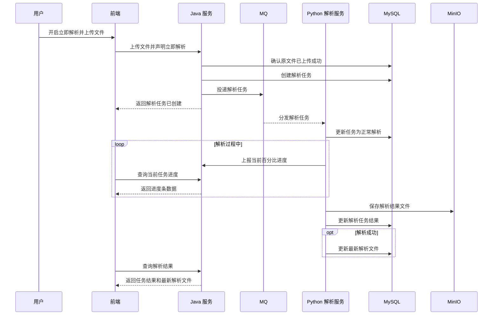
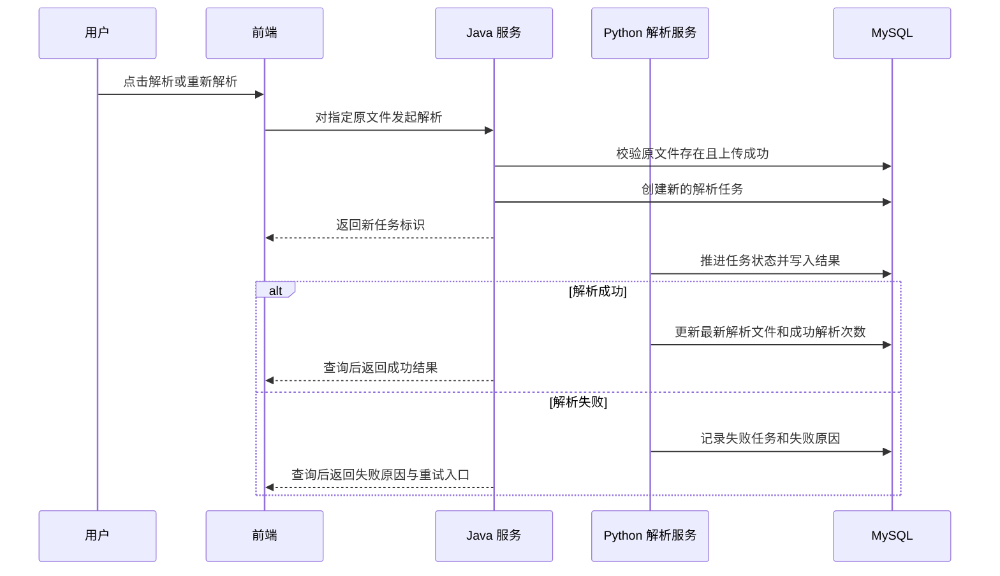

# ToLink Service 文件上传与解析协同重构 二期需求文档

> **文档状态：** 草稿
> **职能说明：** 面向产品、Java 服务、Python 解析服务、前端与测试协同使用
> **项目名称：** ToLink Service
> **模块名称：** 文件上传与解析协同重构（二期）
> **上游期次：** `docs/module-development-files/storage-file-management/一期/`
> **相关分支：** skill-test
> **负责人：** AI 协作草拟
> **最后更新时间：** 2026-04-25

---

## 1. 文档修订记录 (Change Log)
*规范：任何需求变更必须在此记录，杜绝口头需求。*

| 版本号 | 修改日期 | 修改内容简述 | 提出人 | 审核人 |
| :--- | :--- | :--- | :--- | :--- |
| v1.0 | 2026-04-25 | 初始化二期 PRD，明确解析任务、MQ 协作、Python 解析、进度展示与解析结果边界 | AI | 待审核 |

---

## 2. 需求背景与业务目标 (Overview)

### 2.1 业务概览与核心逻辑 (Business Overview)

* **业务定位：** 二期负责补齐原文件上传后的解析协同能力，使已上传成功的原文件能够进入异步解析链路，并将解析任务、解析状态和最新解析结果沉淀为可查询的业务数据。
* **核心逻辑主线：** 用户上传成功或手动点击解析后，Java 端创建解析任务并投递给 Python；Python 执行解析、反馈进度、记录任务结果；解析成功后维护该原文件的最新解析文件；前端按文件展示进度、结果和失败重试入口。
* **核心价值：** 上传与解析解耦，用户能感知每个文件的解析过程和结果；重复解析形成任务历史；最新成功解析结果有稳定读取入口。

### 2.2 核心节点目标与验收准则 (Key Milestones)

| 核心功能节点 | 预期达成目标 | 关键验收点 (DoD) |
| :--- | :--- | :--- |
| 解析任务创建 | 已上传成功的原文件可创建独立解析任务 | 每次触发解析都生成独立任务标识和任务记录 |
| MQ 任务投递 | Java 端将解析任务交给 Python 处理 | Python 能接收到解析任务并开始处理 |
| 解析进度展示 | 用户能在解析完成前看到当前文件百分比进度 | 前端可按任务查询到 0-100 的进度值 |
| 解析结果记录 | Python 解析完成后记录成功或失败结果 | 成功任务有解析结果定位；失败任务有失败原因 |
| 最新解析文件 | 每个原文件保留当前最新成功解析结果 | 最新解析文件与原文件一一对应，成功解析次数只在成功后递增 |
| 失败重试 | 解析失败文件可再次发起解析 | 重新解析生成新任务，历史失败任务不丢失 |

---

## 3. 核心架构与业务流程 (Architecture & Flow)

### 3.1 核心业务时序图 (Sequence Diagrams)

#### 场景 1：上传后立即解析



#### 场景 2：已上传文件手动解析 / 失败重试



### 3.2 状态机定义 (State Machine)

| 对象 | 当前状态 | 触发动作/条件 | 流转后状态 | 备注 |
| :--- | :--- | :--- | :--- | :--- |
| 解析任务 | 已创建 | Java 创建任务成功 | 已创建 | 等待 MQ 投递或 Python 消费 |
| 解析任务 | 已创建 | Python 已接收并开始解析 | 正常解析 | Python 负责推进 |
| 解析任务 | 正常解析 | Python 解析成功 | 成功 | 写入任务结果 |
| 解析任务 | 正常解析 | Python 解析失败 | 失败 | 记录失败原因 |
| 解析文件 | 无最新结果 | 首次解析成功 | 存在最新成功结果 | 与原文件一一对应 |
| 解析文件 | 存在最新成功结果 | 后续解析成功 | 存在最新成功结果 | 覆盖为新的最新成功结果，并递增成功解析次数 |

说明：解析进度百分比只用于前端展示，不作为解析任务状态持久化。

---

## 4. 功能规格与交互逻辑 (Functional Specs)

### 4.1 页面交互与功能示意 (UI & Functionality)

* **上传后立即解析：** 用户上传文件时开启“立即解析”开关，上传成功后系统自动进入解析任务流程。
* **手动解析：** 用户可对已上传成功但未解析、解析失败或需要重新解析的文件点击解析。
* **批量解析展示：** 前端按文件展示上传或解析进度，一个文件完成后切换展示下一个文件；全部解析任务结束后统一展示结果。
* **失败文件展示：** 批量解析完成后，前端需要明确展示解析失败文件和失败原因，并允许用户再次解析。
* **结果展示：** 解析成功后，用户可查看当前最新成功解析结果；历史任务保留用于排查和追踪。

### 4.2 接口契约规范

| 维度 | 要求与标准 | 备注 |
| :--- | :--- | :--- |
| 通讯协议 | Java 对前端提供 RESTful API | 具体路径和 DTO 进入技术文档 |
| 异步机制 | Java 通过 MQ 将解析任务投递给 Python | MQ 消息体在技术文档定稿 |
| 进度展示 | Python 解析过程中向 Java 上报百分比，前端查询展示 | 百分比不落入解析任务表 |
| 结果记录 | Python 直接写入解析任务结果和最新解析文件 | Java 不再消费解析结果 MQ 后二次写库 |
| 错误提示 | 前端展示任务失败原因和重试入口 | 失败不覆盖最新成功解析结果 |

### 4.3 核心业务逻辑

#### 模块 A：解析任务触发

* **业务逻辑概述：** 解析任务由上传后立即解析或用户手动解析触发，前提是原文件已经上传成功。
* **核心处理规则：** 每次触发都创建新的解析任务；重复解析是允许行为，不要求任务幂等合并。
* **数据持久化规格：** 解析任务必须记录归属原文件、任务标识、触发方式、任务状态、解析结果或失败原因。
* **并发与一致性：** 同一原文件可同时存在多个历史任务；是否限制并发解析不在当前需求中强制定义。
* **异常流与降级：** MQ 投递失败时，上传成功事实不受影响；解析任务需保留可识别状态，允许后续再次触发或补偿。

#### 模块 B：Python 解析执行

* **业务逻辑概述：** Python 是解析执行方，负责接收任务、解析原文件、更新任务状态、保存解析结果并维护最新解析文件。
* **核心处理规则：** Python 开始解析后将任务推进为正常解析；成功时写成功结果，失败时写失败原因。
* **数据持久化规格：** 任务结果只沉淀在解析任务对象中；最新成功结果只沉淀在解析文件对象中。
* **并发与一致性：** 解析任务以任务标识作为一次解析尝试的唯一标识。
* **异常流与降级：** Python 解析失败不覆盖当前最新成功解析文件，用户可以再次解析。

#### 模块 C：解析进度与结果展示

* **业务逻辑概述：** 前端需要在解析过程中展示当前文件百分比进度，在批量任务结束后展示成功和失败文件。
* **核心处理规则：** 进度在解析完成前可查询；任务成功或失败后，以任务最终状态和结果为准。
* **数据持久化规格：** 百分比进度不要求持久化到任务表。
* **并发与一致性：** 批量文件按前端队列逐个展示当前文件进度，最终结果按任务完成情况统一查询。
* **异常流与降级：** 若进度查询暂不可用，前端仍可通过任务最终状态展示结果。

---

## 5. 数据契约与存储约束 (Data & Storage)

### 5.1 数据模型与实体关系 (E-R)

```text
原文件 1 - N 解析任务
原文件 1 - 1 解析文件
```

说明：

- 原文件由一期创建，二期只基于“上传成功”的原文件发起解析。
- 解析任务记录每次解析尝试，允许重复解析并保留历史。
- 解析文件只记录当前最新成功解析结果，不记录全部历史版本。

### 5.2 数据库组件与表结构变更 (Database & Schema Changes)

**涉及存储组件清单：**

* [x] MySQL：保存解析任务和最新解析文件。
* [x] Redis：保存解析过程中的临时百分比进度。
* [x] MQ：Java 向 Python 投递解析任务。
* [x] MinIO：保存解析结果文件。
* [ ] Qdrant：本期不做向量检索。
* [ ] Elasticsearch：本期不做全文检索。

**表结构 / Schema 变更明细：**

| 存储对象 | 变更类型 | 需求级说明 | 备注 |
| :--- | :--- | :--- | :--- |
| 解析任务 | 新增 | 记录每次解析触发、任务状态、解析时间、成功/失败结果 | 字段和索引进入技术文档 |
| 解析文件 | 新增或调整 | 记录每个原文件当前最新成功解析文件和成功解析次数 | 与原文件一一对应 |

### 5.3 缓存与持久化策略

* **临时进度：** 解析百分比进度属于临时展示数据，可放入缓存并设置过期时间。
* **最终状态：** 解析任务最终状态、成功结果、失败原因必须持久化。
* **最新结果：** 只有解析成功才更新解析文件；解析失败不覆盖最新成功结果。
* **历史保留：** 解析任务历史保留，便于查看重复解析记录和失败原因。

---

## 6. 异常处理与非功能性需求 (Exceptions & NFR)

### 6.1 稳定性与降级策略 (Reliability & Fallback)

* **MQ 投递失败：** 解析任务应保留可识别状态，允许用户再次触发或后续补偿。
* **Python 解析失败：** 任务记录失败状态和失败原因，不影响原文件上传成功事实，不覆盖最新成功解析文件。
* **进度不可用：** 前端可退化为展示“解析中”，最终以任务成功或失败结果为准。
* **结果文件保存失败：** 本次解析任务应失败，并给出可排查失败原因。

### 6.2 性能与扩展性要求 (Performance & Scalability)

* **异步处理：** 解析任务不得阻塞文件上传主链路。
* **批量展示：** 批量文件解析时，前端可按文件展示进度并在全部结束后统一拉取结果。
* **重复解析：** 同一原文件多次解析不能覆盖历史任务。
* **扩展空间：** 后续可扩展解析结果版本管理、向量化、检索消费等能力。

### 6.3 可观测性、安全与合规 (Security & Observability)

* **可追踪性：** 解析任务必须具备可追踪任务标识，日志与前端查询均可围绕该标识排查。
* **权限边界：** 用户只能解析和查看自己有权限访问的数据集文件。
* **内部接口安全：** Python 上报进度或结果相关接口需要内部服务鉴权。
* **敏感信息保护：** MQ、日志和前端响应不得暴露对象存储密钥或私有签名 URL。

### 6.4 数据埋点与运营要求

* **建议埋点：** 解析发起、解析成功、解析失败、失败重试、批量解析完成。
* **建议统计：** 文件解析成功率、平均解析耗时、失败原因分布、重复解析次数。

---

## 7. 遗留问题与依赖项 (Dependencies & Open Issues)

### 7.1 前置依赖

- 一期原文件上传链路已落地，原文件能稳定记录上传成功状态和对象存储定位。
- MQ 能力可用，Java 能向 Python 投递解析任务。
- Python 解析服务具备消费任务、读取原文件、保存解析结果和写入数据库的能力。
- Java 与 Python 对任务标识、任务状态、结果写入责任边界达成一致。

### 7.2 待确认事项

- Python 返回的解析结果摘要结构是文本、JSON，还是按文件类型区分。
- Python 内部上报接口采用共享 token、网关白名单还是服务间签名。
- MQ 投递失败后的自动补偿是否纳入二期，还是先通过人工或再次触发解析处理。
- 后续是否需要在三期引入“当前生效版本”或解析结果历史版本切换。
- 管理员或运营侧是否需要查看全局解析任务历史和失败原因列表。
