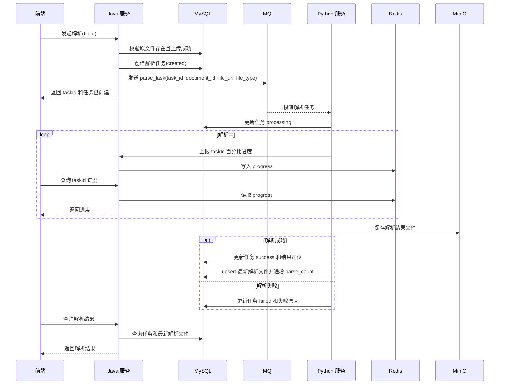

# ToLink Service 文件上传与解析协同重构 二期技术实现文档

> **文档状态：** 草稿
> **项目名称**：ToLink Service
> **模块名称**：文件上传与解析协同重构（二期）
> **需求文档**：`docs/module-development-files/storage-file-management/二期/requirement.md`
> **一期技术文档**：`docs/module-development-files/storage-file-management/一期/technical_design.md`
> **分支名称**：skill-test
> **技术负责人：** AI 协作草拟
> **最后更新时间：** 2026-04-25

---

## 1. 文档修订记录 (Change Log)
*规范：任何技术方案调整必须在此记录，避免口头变更和实现偏差。*

| 版本号 | 修改日期 | 修改内容简述 | 修改人 | 审核人 |
| :--- | :--- | :--- | :--- | :--- |
| v1.0 | 2026-04-25 | 初始化二期技术方案，沉淀解析任务、MQ、Python、进度、解析文件设计 | AI | 待审核 |

---

## 2. 技术目标与实现范围 (Overview)

### 2.1 技术目标与核心思路 (Technical Goals)

* **技术目标：** 在一期原文件上传成功的基础上，补齐“解析任务创建 -> MQ 投递 -> Python 解析 -> 进度展示 -> 结果写回 -> 最新解析文件维护”的异步协同链路。
* **设计原则：** Java 端负责解析任务创建、MQ 投递和前端查询接口；Python 端负责消费任务、执行解析、写入解析任务结果、保存解析结果文件并维护最新解析文件。
* **成功标准：** 同一原文件可重复解析且每次都有独立任务记录；前端可查看单个任务百分比进度和最终结果；成功解析后最新解析文件被更新，历史任务不丢失。

### 2.2 实现范围与边界 (In Scope / Out of Scope)

**本期必须实现：**

- 新增解析任务表 `document_parse_task`。
- 新增或调整解析文件表 `document_parsed_file`。
- 支持上传后立即解析和已上传文件手动解析。
- Java 端创建解析任务并投递 `parse_task` MQ。
- 定义 `parse_task` MQ 消息体。
- Python 端消费任务后推进任务状态。
- Python 端解析过程中上报百分比进度，Java 端提供前端查询能力。
- Python 端解析成功后保存解析结果文件，并维护最新解析文件记录。
- 支持解析失败可见和再次解析。

**本期明确不实现：**

- 不实现解析结果历史版本人工切换。
- 不实现向量化、检索、问答消费链路。
- 不修改 MQ、Redis、OSS framework 抽象。
- 不让 Java 端消费 `parse_result` MQ 再写库，二期结果数据由 Python 端直接写入数据库。
- 不把解析百分比持久化到解析任务表。

### 2.3 验收项到实现点映射 (Requirement Mapping)

| 需求验收项 | 技术实现点 | 测试方式 | 责任模块 |
| :--- | :--- | :--- | :--- |
| 自动解析 | 上传成功后创建解析任务并投递 MQ | 接口集成测试 | `link-service` |
| 手动解析 | 已上传成功文件可再次创建解析任务 | Controller / Service 测试 | `link-api` / `link-service` |
| 重复解析历史 | 同一原文件可保留多条解析任务 | Mapper / 数据库测试 | `link-model` / `link-mapper` |
| 解析进度展示 | Python 上报百分比，前端按任务查询 | Redis / Controller 测试 | `link-service` |
| 最新解析文件 | 成功解析后 upsert 最新解析文件并递增成功解析次数 | Mapper / 回调测试 | `link-mapper` |
| 失败可重试 | 失败任务保留失败原因，不覆盖最新成功结果 | 接口与状态测试 | `link-service` |

---

## 3. 当前系统分析与复用基础 (Current-State Analysis)

### 3.1 相关模块盘点

| 模块 | 当前职责 | 本期处理方式 | 是否修改 |
| :--- | :--- | :--- | :--- |
| `link-api` | 文件 Controller 与内部接口入口 | 扩展解析任务创建、进度查询、结果查询、Python 进度上报接口 | 是 |
| `link-service` | 文件业务、MQ、解析结果处理 | 新增解析任务服务、进度服务、MQ 投递服务；废弃 Java 消费解析结果写库闭环 | 是 |
| `link-model` | Entity / DTO / Enum | 新增解析任务实体、调整解析文件实体、增加任务状态 DTO | 是 |
| `link-mapper` | 持久化 | 新增解析任务 Mapper，调整解析文件 Mapper | 是 |
| `link-components` | MQ / Redis / OSS framework | 只复用，不修改 framework | 否 |
| Python 解析服务 | 文件解析执行方 | 消费 MQ、解析文件、写任务状态、上报进度、维护最新解析文件 | 外部协作 |

### 3.2 已复用能力 (Reusable Components)

- MQ：复用 `AbstractMQ` 和 `MQSend`，业务消息放在 `link-service` 的业务 mq 包内。
- Redis：复用 `RedisTemplate<String, Object>` 或业务 cache service 封装进度读写，不在 Controller 直连 Redis。
- OSS：复用 `IOssService` / MinIO 存储解析结果文件，保留 bucket 与 objectKey。
- 鉴权：复用 `@SaCheckLogin` 和 `AuthContext.getLoginUserIdOrThrow()`。
- 异常：复用 `BusinessException` 和统一 `Result<T>` 出参。

### 3.3 已参考代码 (Code References)

| 文件/模块 | 参考点 | 对方案的影响 |
| :--- | :--- | :--- |
| `link-api/src/main/java/com/qingluo/link/api/controller/KnowledgeFileController.java` | 当前文件接口入口 | 二期解析任务接口可沿用文件业务入口 |
| `link-api/src/main/java/com/qingluo/link/api/controller/InternalKnowledgeFileController.java` | 当前内部接口入口 | Python 进度上报可放内部接口，但需加内部鉴权 |
| `link-service/src/main/java/com/qingluo/link/service/impl/KnowledgeFileServiceImpl.java` | 当前上传、MQ 投递、解析查询混合逻辑 | 二期拆分为文件服务与解析任务服务 |
| `link-service/src/main/java/com/qingluo/link/service/mq/KnowledgeParseResultMQ.java` | 当前解析结果 MQ 模型 | 二期不沿用 Java 消费结果写库闭环 |
| `link-service/src/main/java/com/qingluo/link/service/mq/kafka/KnowledgeParseResultKafkaReceiver.java` | 当前 Kafka 消费写库入口 | 二期需要停用或迁移该结果消费路径 |
| `link-service/src/main/java/com/qingluo/link/service/impl/KnowledgeParseResultServiceImpl.java` | 当前 Java 处理解析结果 | 二期结果由 Python 直接写库，该服务不作为主链路 |
| `link-model/src/main/java/com/qingluo/link/model/dto/entity/KnowledgeOriginalFile.java` | 原文件实体 | 解析任务必须引用原文件 ID 和对象定位 |
| `link-model/src/main/java/com/qingluo/link/model/dto/entity/KnowledgeParsedFile.java` | 当前解析文件实体 | 二期改为当前最新成功解析文件模型 |
| `link-mapper/src/main/java/com/qingluo/link/mapper/KnowledgeOriginalFileMapper.java` | 原文件查询 | 创建解析任务前校验原文件存在且上传成功 |
| `link-mapper/src/main/java/com/qingluo/link/mapper/KnowledgeParsedFileMapper.java` | 解析文件持久化 | 二期改为 upsert 最新解析文件 |
| `docs/architecture/middleware-components/kafka_component.md` | MQ 接入方式 | 业务新增 `AbstractMQ`，不改 framework |
| `docs/architecture/middleware-components/redis_component.md` | Redis 接入方式 | 进度通过业务 cache service 封装 |
| `docs/architecture/middleware-components/oss_component.md` | OSS 接入方式 | 解析结果文件保存 MinIO，保留 objectKey |
| `docs/architecture/middleware_contract.md` | MySQL / Redis / MQ / OSS 约定 | 新增公共 key、topic、表结构需回写公共契约 |

### 3.4 现有问题与约束 (Constraints)

- 当前存在 Java 消费 `parse_result` 后写解析文件的链路，二期目标改为 Python 直接写入解析任务和解析文件，需避免双写。
- 当前解析进度没有清晰的持久化边界，二期明确只走 Redis 临时进度，不写入解析任务表。
- MQ 消息体目前只有基础字段，二期需明确最小业务载荷、幂等键和失败补偿口径。

---

## 4. 核心架构与实现方案 (Architecture & Solution)

### 4.1 总体设计思路 (Architecture Overview)

二期采用“三表协同 + MQ 下发 + Redis 进度”的模型：

- `document_original_file`：一期已落地，作为解析来源。
- `document_parse_task`：保存每次解析任务状态、解析时间、结果和失败原因。
- `document_parsed_file`：保存每个原文件当前最新成功解析文件，与原文件一对一。
- MQ `tolink.rag.parse_task`：Java 创建任务后投递给 Python。
- Redis `storage:parse:progress:{taskId}`：保存解析过程百分比进度，供前端轮询。

### 4.2 二期调用链路 (Call Flow)

```text
自动解析:
上传成功 -> Java 创建解析任务(created) -> Java 投递 parse_task MQ -> 前端收到 taskId

手动解析:
前端点击解析 -> Java 校验原文件已上传成功 -> Java 创建解析任务(created) -> Java 投递 parse_task MQ -> 前端收到 taskId

解析执行:
Python 消费 MQ -> 更新任务 processing -> 解析中上报进度 -> 保存解析结果文件 -> 更新任务 success/failed -> 成功时 upsert 最新解析文件

前端展示:
前端轮询任务进度 -> 全部任务结束后查询任务结果与最新解析文件 -> 展示成功/失败文件 -> 失败文件可再次解析
```

### 4.3 核心模块职责划分 (Module Responsibilities)

| 模块/类 | 本期职责 | 输入/输出边界 |
| :--- | :--- | :--- |
| `KnowledgeFileController` | 手动解析、任务历史、最新结果、进度查询入口 | HTTP 请求 / `Result<T>` |
| `InternalKnowledgeFileController` | Python 解析进度上报入口 | 内部 token + taskId/progress |
| `KnowledgeParseTaskService` | 创建任务、投递 MQ、查询任务历史和结果 | fileId、taskId / task DTO |
| `KnowledgeParseProgressService` | 封装 Redis 进度写入与读取 | taskId、progress / progress DTO |
| `KnowledgeParseTaskMQ` | `parse_task` 业务消息模型 | task payload / `AbstractMQ` |
| `KnowledgeParseTaskMapper` | 解析任务持久化 | Entity / DB |
| `KnowledgeParsedFileMapper` | 最新解析文件 upsert 与查询 | Entity / DB |

### 4.4 二期核心时序图 (Sequence Diagram)



---

## 5. 接口契约与交互方案 (API Contract)

### 5.1 接口清单

| 方法 | 路径 | 说明 | 权限 |
| :--- | :--- | :--- | :--- |
| POST | `/api/v1/files/{fileId}/parse-tasks` | 手动发起一次解析 | 登录用户 |
| GET | `/api/v1/files/{fileId}/parse-tasks` | 查询某文件解析任务历史 | 登录用户 |
| GET | `/api/v1/parse-tasks/{taskId}/progress` | 查询某解析任务百分比进度 | 登录用户 |
| GET | `/api/v1/files/{fileId}/parsed-result` | 查询当前最新成功解析结果 | 登录用户 |
| POST | `/api/v1/internal/parse-tasks/{taskId}/progress` | Python 上报解析进度 | 内部服务 |

说明：上传后立即解析由一期上传接口的 `parseImmediately=true` 触发，二期在上传成功后复用创建解析任务逻辑。

### 5.2 请求参数

| 参数 | 位置 | 类型 | 必填 | 说明 |
| :--- | :--- | :--- | :--- | :--- |
| `fileId` | path | Long | 是 | 原文件 ID |
| `taskId` | path | String | 是 | 解析任务业务 ID |
| `triggerMode` | body/query | String | 否 | `upload_auto/manual_retry` |
| `progress` | body | Integer | 是 | Python 上报百分比，0-100 |

### 5.3 响应结构

创建解析任务响应：

```json
{
  "code": 200,
  "message": "success",
  "data": {
    "taskId": "task-uuid",
    "fileId": 1,
    "taskStatus": "created"
  }
}
```

进度响应：

```json
{
  "code": 200,
  "message": "success",
  "data": {
    "taskId": "task-uuid",
    "progress": 68,
    "taskStatus": "processing"
  }
}
```

### 5.4 异常响应

| 场景 | HTTP 状态 | 业务错误码 | message |
| :--- | :--- | :--- | :--- |
| 原文件不存在或无权访问 | 404 | 404 | 文件不存在或无权访问 |
| 原文件未上传成功 | 400 | 400 | 原文件尚未上传成功，不能解析 |
| 解析任务不存在 | 404 | 404 | 解析任务不存在 |
| 进度值非法 | 400 | 400 | 解析进度必须在 0 到 100 之间 |
| 内部接口鉴权失败 | 401 | 401 | 内部接口鉴权失败 |
| MQ 发送失败 | 500 | 500 | 解析任务创建成功但投递失败，请稍后重试 |

---

## 6. 数据契约与存储设计 (Data & Storage)

### 6.1 数据模型与实体关系 (E-R)

```text
document_original_file 1 - N document_parse_task
document_original_file 1 - 1 document_parsed_file
document_parse_task   1 - 0/1 document_parsed_file(latest_success_task_id)
```

### 6.2 数据库组件与结构变更 (Database & Schema Changes)

#### MySQL 变更

| 表名 | 变更类型 | 变更说明 | 备注 |
| :--- | :--- | :--- | :--- |
| `document_parse_task` | 新增 | 保存每次解析任务状态、解析时间、结果、失败原因和历史结果定位 | Java 创建，Python 推进 |
| `document_parsed_file` | 重建/调整 | 保存每个原文件当前最新成功解析文件 | 与原文件一对一 |

### 6.3 字段设计：`document_parse_task`

| 字段 | 类型 | 是否必填 | 默认值 | 说明 |
| :--- | :--- | :--- | :--- | :--- |
| `id` | bigint | 是 | 自增 | 主键 |
| `task_id` | varchar | 是 | 无 | 解析任务业务 ID，唯一 |
| `document_original_file_id` | bigint | 是 | 无 | 原文件 ID |
| `dataset_id` | bigint | 是 | 无 | 数据集 ID |
| `user_id` | bigint | 是 | 无 | 用户 ID |
| `trigger_mode` | varchar | 是 | 无 | `upload_auto/manual_retry` |
| `task_status` | varchar | 是 | `created` | `created/processing/success/failed` |
| `parse_started_at` | datetime | 否 | null | Python 开始解析时间 |
| `parse_finished_at` | datetime | 否 | null | Python 结束解析时间 |
| `parse_duration_ms` | bigint | 否 | null | 解析耗时 |
| `parsed_bucket_name` | varchar | 否 | null | 本次任务解析结果 bucket，固定为 `rag-parsed` |
| `parsed_object_key` | varchar | 否 | null | 本次任务解析结果 object key |
| `parsed_file_url` | varchar | 否 | null | 本次任务解析结果访问 URL |
| `parse_result` | text | 否 | null | Python 返回的结果摘要 |
| `failure_reason` | varchar | 否 | null | 失败原因 |
| `created_at` | datetime | 是 | 当前时间 | 创建时间 |
| `updated_at` | datetime | 是 | 当前时间 | 更新时间 |

### 6.4 字段设计：`document_parsed_file`

| 字段 | 类型 | 是否必填 | 默认值 | 说明 |
| :--- | :--- | :--- | :--- | :--- |
| `id` | bigint | 是 | 自增 | 主键 |
| `document_original_file_id` | bigint | 是 | 无 | 原文件 ID |
| `latest_success_task_id` | varchar | 是 | 无 | 最新成功解析任务 ID |
| `dataset_id` | bigint | 是 | 无 | 数据集 ID |
| `user_id` | bigint | 是 | 无 | 用户 ID |
| `original_filename` | varchar | 是 | 无 | 原始文件名 |
| `parsed_filename` | varchar | 否 | null | 解析结果文件名 |
| `parsed_bucket_name` | varchar | 是 | 无 | 最新解析文件 bucket，固定为 `rag-parsed` |
| `parsed_object_key` | varchar | 是 | 无 | 最新解析文件 object key |
| `parsed_file_url` | varchar | 否 | null | 最新解析文件访问 URL |
| `parsed_storage_path` | varchar | 否 | null | bucket/objectKey 组合定位 |
| `parse_result` | text | 否 | null | 最新解析摘要 |
| `parse_count` | int | 是 | 1 | 当前原文件累计成功解析次数，仅成功解析后递增 |
| `parsed_at` | datetime | 是 | 无 | 最新成功解析时间 |
| `created_at` | datetime | 是 | 当前时间 | 创建时间 |
| `updated_at` | datetime | 是 | 当前时间 | 更新时间 |

### 6.5 索引与约束

- `document_parse_task`：唯一索引 `uk_task_id(task_id)`。
- `document_parse_task`：普通索引 `idx_original_file(document_original_file_id)`。
- `document_parse_task`：普通索引 `idx_dataset_user_status(dataset_id, user_id, task_status)`。
- `document_parsed_file`：唯一索引 `uk_original_file(document_original_file_id)`。
- `document_parsed_file`：普通索引 `idx_latest_success_task(latest_success_task_id)`。

### 6.6 Redis 与 OSS 存储

| 组件 | 存储内容 | Bucket / Key 规则 | 备注 |
| :--- | :--- | :--- | :--- |
| Redis | 解析百分比进度 | `storage:parse:progress:{taskId}` | TTL 建议 24 小时，值为 0-100 |
| OSS / MinIO | 解析结果文件 | bucket: `rag-parsed`；object key: `parsed/user-{userId}/dataset-{datasetId}/{taskId}/{safeParsedFilename}` | Python 保存，DB 记录 bucket/objectKey；用户和数据集目录必须加语义前缀 |

---

## 7. MQ 消息体与异步协作设计

### 7.1 Topic 与发送方

| 项 | 设计 |
| :--- | :--- |
| Topic / MQ 名称 | `tolink.rag.parse_task` |
| 发送方 | Java `KnowledgeParseTaskService` |
| 消费方 | Python 解析服务 |
| 消息类型 | 普通异步任务消息 |
| 幂等主键 | `task_id` |

### 7.2 消息 Envelope

沿用项目 MQ 约定的 envelope + payload 结构：

```json
{
  "mq_type": "normal",
  "mq_name": "tolink.rag.parse_task",
  "payload": {}
}
```

### 7.3 Payload 字段

```json
{
  "task_id": "task-uuid",
  "document_id": 1,
  "dataset_id": 10,
  "user_id": 10001,
  "bucket_name": "rag-raw",
  "object_key": "original/user-10001/dataset-10/2026/04/25/1/demo.pdf",
  "file_url": "/api/v1/files/1/download",
  "original_filename": "demo.pdf",
  "file_type": "pdf",
  "trigger_mode": "manual_retry"
}
```

| 字段 | 必填 | 说明 |
| :--- | :--- | :--- |
| `task_id` | 是 | 解析任务业务 ID，Python 写库和幂等处理必须使用 |
| `document_id` | 是 | 原文件 ID |
| `dataset_id` | 是 | 数据集 ID |
| `user_id` | 是 | 上传用户 ID |
| `bucket_name` | 是 | 原文件 bucket，固定为 `rag-raw` |
| `object_key` | 是 | 原文件 object key |
| `file_url` | 否 | Java 受控下载地址，供 Python 需要时拉取 |
| `original_filename` | 是 | 原始文件名 |
| `file_type` | 是 | 文件类型或后缀 |
| `trigger_mode` | 是 | `upload_auto/manual_retry` |

### 7.4 发送失败处理

- Java 创建任务后发送 MQ。
- MQ 发送成功：任务保持 `created`，等待 Python 消费后推进为 `processing`。
- MQ 发送失败：任务仍保留为 `created`，记录错误日志，前端可再次触发解析或由后续补偿任务重发。
- 不引入 `sent` 状态，避免 `created` 与 `sent` 状态边界混淆；非成功任务均可按业务规则再次发送。

---

## 8. 核心实现逻辑 (Core Implementation)

### 8.1 Service / Component 设计

```java
public interface KnowledgeParseTaskService {
    KnowledgeParseTaskDTO createParseTask(Long userId, Long fileId, String triggerMode);
    PageResult<KnowledgeParseTaskDTO> listTasks(Long userId, Long fileId, int page, int pageSize);
    KnowledgeParsedResultDTO getLatestParsedResult(Long userId, Long fileId);
}

public interface KnowledgeParseProgressService {
    void reportProgress(String taskId, int progress);
    KnowledgeParseProgressDTO getProgress(Long userId, String taskId);
}
```

### 8.2 关键处理流程

1. Java 校验登录、文件归属、原文件上传成功。
2. Java 生成 `task_id`，插入 `document_parse_task`，状态为 `created`。
3. Java 构建 `parse_task` MQ 消息并发送。
4. Java 向前端返回 `taskId`。
5. Python 消费消息后以 `task_id` 做幂等校验。
6. Python 将任务更新为 `processing`，写入 `parse_started_at`。
7. Python 解析过程中调用 Java 内部进度接口，上报 0-100 百分比。
8. Java 将进度写入 Redis，不落库。
9. Python 解析成功后保存结果文件到 MinIO，更新任务为 `success`，写入结果定位、耗时和摘要。
10. Python 成功后 upsert `document_parsed_file`，更新最新成功结果并递增 `parse_count`。
11. Python 解析失败后更新任务为 `failed`，写入失败原因，不覆盖最新解析文件。

### 8.3 并发、幂等与一致性

- **重复解析：** 不做任务幂等拦截，每次用户触发都创建新任务。
- **消息幂等：** Python 以 `task_id` 判断是否重复消费；已为 `success/failed` 的任务不再重复执行。
- **最新结果一致性：** 只有任务成功时才更新 `document_parsed_file`；失败任务不覆盖最新成功结果。
- **进度一致性：** Redis 进度只用于展示，任务成功/失败后以 MySQL 任务状态为最终事实。
- **跨组件一致性：** MQ 与 MySQL 非强事务；发送失败保留 `created` 任务并记录日志，允许后续重发。

---

## 9. 组件集成与配置方案 (Integration Design)

| 组件 | 用途 | 配置项 | 失败处理 |
| :--- | :--- | :--- | :--- |
| MQ | Java 向 Python 投递解析任务 | `qingluopay.mq.*`，topic `tolink.rag.parse_task` | 任务保留 `created`，允许重试投递 |
| Redis | 保存解析百分比进度 | `storage:parse:progress:{taskId}`，TTL 24h | 查询不到时根据任务状态返回推导进度 |
| OSS / MinIO | 保存解析结果文件 | `tolink.oss.*` | Python 解析失败并写任务失败原因 |
| MySQL | 保存解析任务和最新解析文件 | `tolink_rag_db` | 写入失败记录日志并暴露失败状态 |

---

## 10. 权限、安全与审计设计 (Security)

### 10.1 认证与授权

| 操作 | 权限要求 | 校验位置 |
| :--- | :--- | :--- |
| 手动解析 | 登录且文件属于当前用户可访问数据集，原文件上传成功 | Service |
| 查询任务历史 | 登录且文件属于当前用户可访问数据集 | Service |
| 查询进度 | 登录且任务属于当前用户可访问文件 | Service |
| 查询最新解析结果 | 登录且文件属于当前用户可访问数据集 | Service |
| Python 上报进度 | 内部服务鉴权 | 内部接口拦截器或共享 token |

### 10.2 敏感数据处理

- MQ 消息不传 MinIO 密钥、签名 URL 或用户敏感信息。
- 日志记录 `task_id`、`document_original_file_id`、`dataset_id`，不打印完整私有访问 URL。
- Python 内部接口必须使用内部 token 或网关访问控制。

### 10.3 审计要求

- 记录解析任务创建、MQ 投递失败、Python 任务失败。
- 解析失败日志必须包含 `task_id`、`document_original_file_id`、`dataset_id`、`failure_reason`。

---

## 11. 异常处理与降级策略 (Exceptions & Fallback)

| 异常场景 | 处理方式 | 错误码 | 用户提示 | 是否重试 |
| :--- | :--- | :--- | :--- | :--- |
| 原文件未上传成功 | 拒绝创建解析任务 | 400 | 原文件尚未上传成功，不能解析 | 否 |
| MQ 发送失败 | 保留任务为 `created`，记录日志 | 500 | 解析任务未成功触发，请稍后重试 | 是 |
| Python 重复消费 | 以 `task_id` 幂等跳过已完成任务 | 无 | 无 | 否 |
| Python 解析失败 | 更新任务为 `failed`，记录失败原因 | 无 | 解析失败，可重试 | 是 |
| Redis 进度丢失 | 根据任务状态推导进度 | 200 | 显示处理中或最终状态 | 否 |
| 最新解析文件更新失败 | 任务成功但结果索引更新失败，记录告警 | 500/告警 | 解析结果暂不可用 | 是 |

---

## 12. 测试与验证方案 (Test Plan)

### 12.1 单元测试

| 测试类 | 覆盖内容 |
| :--- | :--- |
| `KnowledgeParseTaskServiceTest` | 创建任务、重复解析、多任务历史、MQ 发送失败 |
| `KnowledgeParseProgressServiceTest` | 进度写入、读取、范围校验、TTL |
| `KnowledgeParsedFileMapperTest` | 最新解析文件 upsert、parse_count 递增 |

### 12.2 集成测试

| 测试类 | 覆盖接口/流程 |
| :--- | :--- |
| `KnowledgeParseTaskControllerTest` | 手动解析、任务历史、最新结果查询 |
| `KnowledgeParseProgressControllerTest` | Python 上报进度、前端查询进度 |
| `KnowledgeParseTaskMQTest` | MQ 消息体序列化与投递 |

### 12.3 回归测试

| 回归点 | 验证方式 |
| :--- | :--- |
| 一期上传链路 | 上传成功后仍能正常返回原文件信息 |
| 旧解析结果消费 | 确认不再依赖 Java `parse_result` 消费链路写库 |
| 数据集权限 | 非本人可访问文件不能解析或查询结果 |
| 失败重试 | 失败任务保留历史，再次解析生成新任务 |

### 12.4 验证命令

```bash
mvn -pl link-api -am test
mvn -pl link-service -am test
```

---

## 13. 发布与上线方案 (Release Plan)

### 13.1 配置项

| 配置项 | 默认值 | 说明 |
| :--- | :--- | :--- |
| `qingluopay.mq.*` | 沿用现有 | MQ vendor、扫描包、topic 自动创建配置 |
| `storage.parse.progress.ttl` | 24h | 解析进度 Redis TTL，建议新增业务配置 |
| `storage.internal.callback-token` | 无 | Python 上报进度接口鉴权 token，建议新增 |
| `tolink.oss.*` | 沿用现有 | 解析结果文件 MinIO 配置 |

### 13.2 发布步骤

1. 合入二期数据库 DDL，创建解析任务表和解析文件表。
2. 部署 Java 服务，启用解析任务、进度和结果查询接口。
3. 确认 MQ topic `tolink.rag.parse_task` 可用。
4. 部署 Python 解析服务，确认可消费 MQ、访问 MinIO、写入 MySQL、调用 Java 进度接口。
5. 联调上传后自动解析、手动解析、进度查询、失败重试、最新结果查询。

### 13.3 回滚方案

- 暂停前端解析入口。
- 停止 Python 消费新解析任务。
- 回滚 Java 服务到上一版本。
- 保留 `document_parse_task` 和 `document_parsed_file` 数据用于排查，不直接删除。
- 如需恢复旧 Java 消费 `parse_result` 链路，必须先确认不会与 Python 直接写库形成双写。

---

## 14. 待确认问题 (Open Issues)

- Python 端最终解析结果摘要 `parse_result` 的结构是纯文本、JSON，还是按文件类型拆分。
- Python 上报进度接口是否采用共享 token、网关白名单，还是服务间签名。
- MQ 发送失败后的自动补偿任务是否在二期同步实现，还是先通过人工/接口重试。
- 解析成功后的下游向量化、检索消费是否进入三期独立设计。
