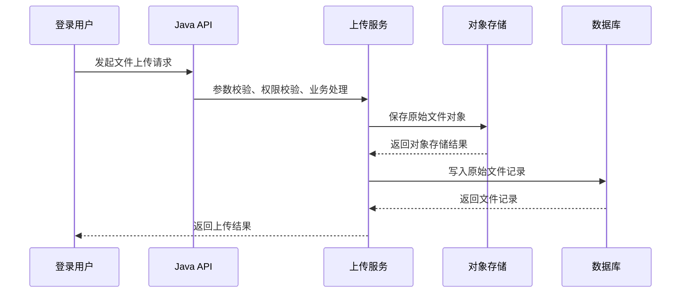
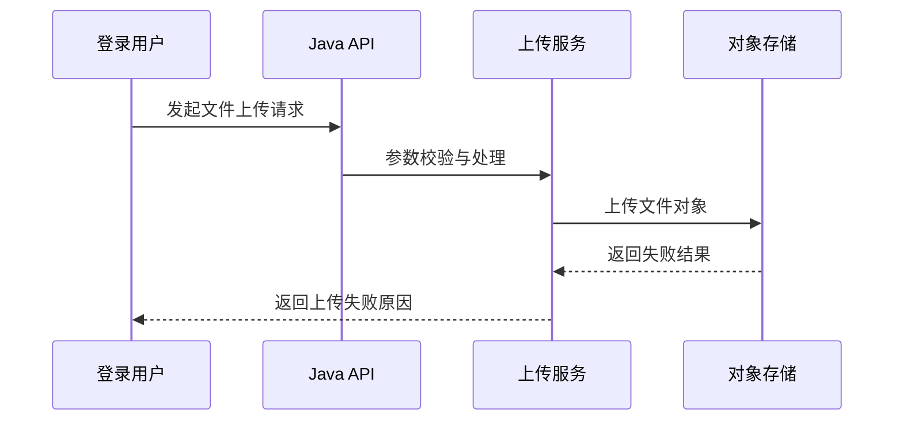

# ToLink Service 产品需求文档 (PRD)

> **文档状态：** 草稿
> **项目名称**：ToLink Service
> **模块名称**：文件上传模块重构（一期）
> **分支名称**：skill-test
> **产品负责人：** AI 协作草拟
> **最后更新时间：** 2026-04-24

---

## 1. 文档修订记录 (Change Log)
*规范：任何需求变更必须在此记录，杜绝口头需求。*

| 版本号 | 修改日期 | 修改内容简述 | 提出人 | 审核人 |
| :--- | :--- | :--- | :--- | :--- |
| v1.0 | 2026-04-24 | 初始版本创建，明确文件上传模块一期范围 | AI | 待审核 |

---

## 2. 需求背景与业务目标 (Overview)

### 2.1 业务概览与核心逻辑 (Business Overview)
*对本模块的业务逻辑进行整体性描述，阐述其在系统中的定位及核心业务链路。*
* **业务定位：** 文件上传模块负责承接登录用户在数据集维度下上传原始知识文件的动作，是知识文件生命周期的入口能力，也是后续文件管理、解析、检索链路的前置环节。*
* **核心逻辑主线：** 用户选择数据集并上传原始文件，Java 服务完成权限校验、上传请求处理、文件对象存储、知识文件元数据落库，并向调用方返回明确的上传结果与文件记录信息。*
* **核心价值：** 将文件上传从“单纯传文件”收敛成“可校验、可归属、可追踪”的业务主链路，为后续解析与文件管理奠定稳定边界。*

### 2.2 核心节点目标与验收准则 (Key Milestones)
*明确本需求中各个关键业务节点预期达成的具体功能状态。*

| 核心功能节点 | 预期达成目标 | 关键验收点 (DoD) |
| :--- | :--- | :--- |
| **节点 A：上传请求受理** | 登录用户能够在指定数据集下发起文件上传请求 | 1. 未登录或无权限用户不能上传；2. 请求参数非法时返回明确错误信息 |
| **节点 B：原始文件存储** | 原始文件能够被成功存入对象存储 | 1. 文件对象成功保存；2. 返回结果中能体现上传成功状态 |
| **节点 C：文件记录落库** | 为每个成功上传的文件生成可追踪的业务记录 | 1. 原始文件记录成功落库；2. 文件记录与用户、数据集归属正确 |
| **节点 D：上传结果反馈** | 调用方可拿到可用的上传结果与失败原因 | 1. 成功时返回文件关键信息；2. 失败时返回明确失败原因 |
| **通用逻辑：边界控制** | 一期仅覆盖 Java 端上传主链路 | 1. 本期不触发 MQ 解析；2. 不要求解析状态流转完成 |

---

## 3. 核心架构与业务流程 (Architecture & Flow)

### 3.1 核心业务时序图 (Sequence Diagrams)
*说明：本节由 AI 根据业务逻辑自动生成 Mermaid 时序图。若涉及多个核心功能或复杂异步链路，请分别提供。*

#### 场景 1：文件上传主链路

#### 场景 2：上传失败链路

### 3.2 状态机定义 (State Machine)
*梳理核心业务对象的状态流转规则（如订单流转、文档解析状态）。*

| 当前状态 | 触发动作/条件 | 流转后状态 | 备注/逆向逻辑 |
| :--- | :--- | :--- | :--- |
| 未创建 | 用户发起上传请求 | 上传处理中 | 仅表示进入本次上传业务处理 |
| 上传处理中 | 文件上传与落库成功 | 上传成功 | 一期只要求得到上传成功结果 |
| 上传处理中 | 参数错误、权限失败、存储失败 | 上传失败 | 必须返回明确错误原因 |

---

## 4. 功能规格与交互逻辑 (Functional Specs)

### 4.1 页面交互与功能示意 (UI & Functionality)
* **核心功能需求：** 用户在数据集下选择文件并提交上传，系统返回成功或失败结果，并能在后续文件管理场景中识别该文件记录。*
* **界面参考：** 本期以接口与 Java 端上传链路为主，前端页面展示样式不是本期重点，但需保证前端能够获得清晰的上传反馈。*

### 4.2 接口契约规范
| 维度 | 要求与标准 | 备注 |
| :--- | :--- | :--- |
| **通讯协议** | 统一 RESTful API，按现有项目接口风格对接 | 保持与现有前端调用习惯兼容 |
| **数据格式** | 上传参数需能表达数据集归属、文件信息和调用结果 | 具体字段在技术方案中细化 |
| **异常处理** | 参数错误、权限错误、上传失败需返回统一错误响应 | 错误原因必须可用于前端展示 |
| **异步机制** | 本期不要求异步解析能力 | MQ 相关能力移到二期 |

### 4.3 核心业务逻辑 (按模块拆分)

#### 模块 A：上传入口与权限校验
* **业务逻辑概述：** 接收登录用户上传请求，校验用户身份、数据集归属和上传前置条件。*
* **核心处理规则：** 只允许已登录且有权访问目标数据集的用户发起上传；非法请求必须在入口阶段被拦截。*
* **数据持久化规格：** 本模块本身不负责最终落库，但负责保证落库前的业务归属信息完整。*
* **并发与一致性：** 本期不要求复杂并发编排，但重复请求不能导致语义不清的结果返回。*
* **异常流与降级：** 参数缺失、权限不足、数据集不存在等情况必须直接失败返回。*

#### 模块 B：文件对象存储与记录生成
* **业务逻辑概述：** 将原始文件写入对象存储，并为上传成功的文件生成业务记录。*
* **核心处理规则：** 只有对象存储成功后才允许进入记录生成；若存储失败，不得产生“伪成功”文件记录。*
* **数据持久化规格：** 需要生成与用户、数据集、文件对象信息关联的原始文件记录。*
* **并发与一致性：** 需保证上传结果与记录结果一致，避免出现“文件已存但业务状态不可识别”的情况。*
* **异常流与降级：** 对象存储失败、记录写入失败时必须返回明确结果，并为后续补偿留出识别依据。*

---

## 5. 数据契约与存储约束 (Data & Storage)

### 5.1 数据模型与实体关系 (E-R)
*简述核心实体间的映射关系。*
* `用户 (User)` 1:N `数据集 (Dataset)`。*
* `数据集 (Dataset)` 1:N `原始知识文件记录 (Original File Record)`。*
* `原始知识文件记录` 与 OSS 中的原始文件对象一一对应。*

### 5.2 数据库组件与表结构变更 (Database & Schema Changes)
*明确本需求涉及的底层存储组件及结构调整。*

**涉及存储组件清单：**
* [x] MySQL（关系型核心业务数据）
* [ ] Redis（高频热数据缓存/分布式锁）
* [ ] Kafka（异步解耦/流计算）
* [ ] Qdrant（向量检索）
* [x] MinIO（对象存储）
* [ ] Elasticsearch（全文检索）
* [ ] 其他：__________

**表结构/Schema 变更明细：**
*(注：任何涉及新增表、新增字段、修改字段类型的操作必须在此列出。本期在需求侧只表达影响范围，不展开最终技术方案。)*

#### MySQL 变更
| 库名 / 表名 | 变更类型 | 核心字段说明 / 变更详情 | 备注要求 |
| :--- | :--- | :--- | :--- |
| `tolink_rag_db` / 原始知识文件相关表 | 评估调整 | 需要支撑用户、数据集、原始文件对象、上传结果之间的业务关联 | 最终表结构调整在技术文档中明确 |

#### MinIO / OSS 变更
| 存储项 | 变更类型 | 核心字段说明 / 变更详情 | 备注要求 |
| :--- | :--- | :--- | :--- |
| 原始文件对象路径规则 | 复用并校验 | 需要支持数据集归属与用户归属的对象路径生成 | 具体 object key 设计在技术文档中明确 |

### 5.3 缓存与持久化策略
* **热数据归档：** 本期文件上传主链路不以 Redis 缓存为前提，不新增上传相关缓存约定。*
* **冷数据处理：** 上传后的原始文件对象保存在 OSS，结构化元数据保存在 MySQL，具体清理与归档策略不在本期内展开。*

---

## 6. 异常处理与非功能性需求 (Exceptions & NFR)

### 6.1 稳定性与降级策略 (Reliability & Fallback)
* **外部依赖兜底：** 对象存储失败时必须返回明确失败结果，不允许继续生成成功业务记录。*
* **重试与限流：** 本期暂不定义复杂上传重试机制，但要避免同一请求在异常情况下产生语义不清的重复结果。*
* **补偿机制：** 若出现对象已上传但业务记录异常等不一致情况，必须在技术设计中补充可识别和可补偿方案。*

### 6.2 性能与扩展性要求 (Performance & Scalability)
* **性能指标：** 正常文件上传请求应在合理时间内返回明确结果，避免无响应或状态不明。*
* **吞吐能力：** 本期以功能正确性和主链路稳定为优先，不对大规模批量上传能力做承诺。*
* **资源消耗：** 上传链路不应引入明显的内存滞留或无边界临时文件堆积风险。*

### 6.3 可观测性、安全与合规 (Security & Observability)
* **监控与报警：** 上传失败、对象存储失败、记录落库失败应具备可排查的日志信息。*
* **数据脱敏：** 日志中不应无必要打印敏感路径、用户敏感信息或完整私有访问凭据。*
* **权限审计：** 必须保证只能操作自己有权访问的数据集，避免跨用户越权上传。*

### 6.4 数据埋点与运营要求
* **核心埋点：** 本期至少要能区分上传成功、上传失败、失败类型，为后续优化提供依据。*

---

## 7. 遗留问题与依赖项 (Dependencies & Open Issues)

* **前置依赖：** 依赖现有用户登录、数据集管理和 OSS 组件能力可用。*
* **待确认事项：**
  - 一期是否只支持单文件上传，还是需要兼容批量上传；
  - 文件类型、大小限制是否沿用现有逻辑还是需要统一重构；
  - 上传成功后的返回结构是否需要直接满足文件列表展示使用。*
