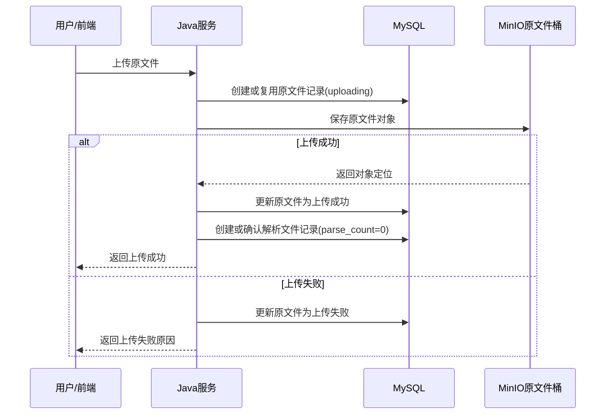

# ToLink Service 文件上传表结构与业务流程重构一期 PRD

> **文档状态：** 需求已确认，已完成实现与测试交付
> **项目名称：** ToLink Service
> **模块名称：** 文件上传表结构与业务流程重构（一期）
> **分支名称：** dev
> **产品负责人：** Fang / Codex
> **最后更新时间：** 2026-04-29

---

## 1. 文档修订记录 (Change Log)

| 版本号 | 修改日期 | 修改内容简述 | 提出人 | 审核人 |
| :--- | :--- | :--- | :--- | :--- |
| v1.0 | 2026-04-29 | 初始化一期 PRD，明确原文件上传和解析文件记录初始化边界 | Fang / Codex | Fang |
| v1.1 | 2026-04-29 | 补充文件上传完整生命周期，包括重复上传、失败重试、上传中保护、超时补偿、MinIO 失败和解析文件初始化失败 | Fang / Codex | Fang |
| v1.2 | 2026-04-29 | 调整上传配置方案为 YAML 默认配置 + Redis 动态覆盖，并补充按请求配置快照保障并发安全的需求口径 | Fang / Codex | Fang |
| v1.3 | 2026-04-29 | 调整上传配置 Redis key 为 `knowledge:file-upload:config` | Fang / Codex | Fang |
| v1.4 | 2026-04-29 | 明确原文件 `failure_reason` 作为稳定失败原因编码使用，支撑后续补偿判断和用户文案映射 | Fang / Codex | Fang |
| v1.5 | 2026-04-29 | 确认一期需求边界已收敛，进入技术方案审核阶段 | Fang / Codex | Fang |
| v1.6 | 2026-04-29 | 强化 `failure_reason` 字段保留要求，并固定一期上传失败原因编码集合 | Fang / Codex | Fang |

---

## 2. 需求背景与业务目标 (Overview)

### 2.1 业务概览与核心逻辑 (Business Overview)

- **业务定位：** 一期是文件解析重构前的上传基础能力整理，重点是稳定原文件上传事实，并在上传成功后为每个原文件建立唯一解析业务记录。
- **核心逻辑主线：** 用户上传原文件后，Java 端负责校验数据集权限、保存原文件对象、更新原文件上传状态。上传成功后，Java 端立即创建或确认该原文件对应的 `document_parsed_file` 记录，不管用户是否选择立即解析。
- **核心价值：** 后续前端和解析链路可以稳定地按原文件找到解析业务记录，不需要在解析触发时临时补建或猜测解析记录是否存在。

### 2.2 核心节点目标与验收准则 (Key Milestones)

| 核心功能节点 | 预期达成目标 | 关键验收点 (DoD) |
| :--- | :--- | :--- |
| 原文件上传事实 | 原文件表只表达上传事实、归属关系、上传状态和原文件对象定位 | 上传成功文件在 `document_original_file` 中状态明确，且不包含解析任务或解析结果职责 |
| 解析文件记录初始化 | 每个上传成功原文件都有一条一对一解析文件记录 | 上传成功后能通过原文件 ID 找到唯一 `document_parsed_file`，初始解析次数为 0 |
| 上传配置重构 | 上传大小和允许后缀等配置不再使用 MySQL 表，改为 YAML 默认配置 + Redis 动态覆盖 | Redis 有配置时运行时生效；Redis 无配置或不可用时回退 YAML 默认配置 |
| 失败边界 | 上传失败不创建解析文件记录 | 失败上传可以按上传规则重试，不产生孤立解析文件记录 |
| 上传生命周期 | 上传从受理、上传中、成功、失败、超时到重试都有明确用户可见口径 | 重复上传、失败重试、上传中悬挂、对象存储失败和解析文件初始化失败都有明确处理规则 |

---

## 3. 核心架构与业务流程 (Architecture & Flow)

### 3.1 核心业务时序图 (Sequence Diagrams)



### 3.2 状态机定义 (State Machine)

| 业务对象 | 当前状态 | 触发动作/条件 | 流转后状态 | 备注 |
| :--- | :--- | :--- | :--- | :--- |
| 原文件 | 上传中 | 原文件对象保存成功 | 上传成功 | 上传成功后创建或确认解析文件记录 |
| 原文件 | 上传中 | 上传失败或上传超时 | 上传失败 | 不创建解析文件记录 |
| 原文件 | 上传失败 | 用户重新上传同名文件 | 上传中 | 复用既有上传失败重试规则 |
| 解析文件 | 不存在 | 原文件上传成功 | 未解析 | 初始解析次数为 0，最新任务 ID 为空 |

### 3.3 文件上传生命周期

一期需要完整覆盖原文件从用户提交到最终可见结果的生命周期。

| 生命周期节点 | 触发条件 | 系统处理 | 用户可见结果 |
| :--- | :--- | :--- | :--- |
| 上传请求受理 | 用户在有权限的数据集下提交文件 | Java 校验登录态、数据集归属、文件名、后缀、大小和同名规则 | 上传开始，前端本地展示上传进度 |
| 创建上传中记录 | 校验通过且不存在已成功的同名同后缀文件 | Java 创建或复用原文件记录，状态进入上传中 | 用户等待上传结果 |
| 原文件对象保存 | 原文件记录进入上传中 | Java 将原文件保存到 MinIO 原文件桶 | 前端继续展示上传中 |
| 上传成功 | MinIO 保存成功并返回对象定位 | Java 回写原文件上传成功、对象定位和内部下载地址，并创建或确认解析文件记录 | 用户看到文件上传成功，解析状态为未解析 |
| 重复上传拒绝 | 同一用户、同一数据集下已存在同名同后缀且上传成功的原文件 | 系统拒绝创建新的原文件事实 | 用户看到文件已存在或重复上传提示 |
| 失败上传重试 | 同一唯一键下存在上传失败记录 | 系统复用失败记录重新上传，不新增原文件记录 | 用户可再次上传，成功后原记录变为上传成功 |
| 上传中保护 | 同一唯一键下存在未超时的上传中记录 | 系统拒绝并发重入，避免同一对象 key 被并发覆盖 | 用户看到文件正在上传中，请稍后重试 |
| 上传中悬挂超时 | 上传中记录超过约定时间未成功或失败 | 系统将上传中记录补偿为上传失败，并记录失败原因编码 | 用户后续可重新上传同名文件 |
| 原文件存储失败 | MinIO 上传失败、超时或返回异常 | 系统保留原文件失败记录，不创建解析文件记录 | 用户看到上传失败，可重试 |
| 解析文件初始化失败 | 原文件已上传成功，但解析文件记录创建失败 | 系统必须保留可排查信息，并在技术设计中明确回滚、补偿或人工处理策略 | 用户不应看到可正常解析的状态 |

说明：上传进度由前端在上传过程中本地展示，不要求后端落库；后端只保存上传终态和可重试所需的失败原因编码。

### 3.4 原文件失败原因编码

一期不新增独立失败编码字段，必须保留并复用 `document_original_file.failure_reason` 保存稳定失败原因编码。

| `failure_reason` | 含义 | 用户提示口径 | 是否适合补偿 |
| :--- | :--- | :--- | :--- |
| `OSS_UPLOAD_FAILED` | 原文件对象存储失败 | 文件上传失败，请重新上传 | 通常不补建解析文件记录 |
| `UPLOAD_TIMEOUT` | 上传等待超时，结果不确定 | 文件上传超时，请重新上传 | 可在技术设计中评估对象探测或等待用户重试 |
| `PARSED_FILE_INIT_FAILED` | 原文件已上传成功，但解析文件记录初始化失败 | 文件上传失败，请重新上传 | 适合后续补建解析文件记录 |
| `UNKNOWN_UPLOAD_FAILED` | 其他上传异常 | 文件上传失败，请重新上传 | 视具体日志人工判断 |

规则说明：

- `failure_reason` 不再存储自由文本失败说明，而是存储稳定编码。
- 一期允许写入的失败编码固定为：`OSS_UPLOAD_FAILED`、`UPLOAD_TIMEOUT`、`PARSED_FILE_INIT_FAILED`、`UNKNOWN_UPLOAD_FAILED`。
- 前端展示文案由服务端或前端根据编码映射。
- 后续补偿逻辑如需判断失败类型，应基于该编码判断，不依赖中文文案。

---

## 4. 功能规格与交互逻辑 (Functional Specs)

### 4.1 页面交互与功能示意 (UI & Functionality)

- 用户选择单个或多个文件上传时，前端按文件展示独立上传进度。
- 批量上传时，前端可以逐个展示当前文件上传进度，并在每个文件结束后展示对应成功或失败结果。
- 用户上传成功后，前端文件列表可展示“已上传，未解析”或等价状态。
- 用户上传失败时，只展示上传失败，不展示解析状态。
- 用户重复上传已成功的同名同后缀文件时，应看到明确重复提示。
- 用户上传失败后，应允许重新上传同名同后缀文件。
- 用户不需要感知解析文件记录初始化动作。

### 4.2 接口契约规范

| 维度 | 要求与标准 | 备注 |
| :--- | :--- | :--- |
| 上传入口 | 保持现有文件上传入口语义 | 本期不要求触发真实解析 |
| 前端展示 | 前端以原文件为主维度展示上传结果 | 解析状态可以通过后续查询聚合获得 |
| 配置来源 | 上传大小、后缀白名单等限制采用 YAML 默认配置 + Redis 动态覆盖 | 管理端修改配置写入 Redis，不再写入 MySQL 配置表 |

### 4.3 核心业务逻辑

#### 模块 A：原文件上传

- **业务逻辑概述：** Java 端负责原文件上传入口、文件规则校验、数据集权限校验、MinIO 保存和原文件表状态维护。
- **核心处理规则：** 只有原文件对象保存成功并回写上传成功后，才允许进入解析文件记录初始化。
- **数据持久化规格：** 原文件表只保存原文件事实，不保存解析任务 ID、解析状态或解析产物。
- **并发与一致性：** 同一用户、同一数据集、同名同后缀文件的重复上传和失败重试沿用既有上传规则。
- **异常流与降级：** 上传未成功时，原文件进入失败状态并写入稳定失败原因编码，不创建解析文件记录；失败原因可包括对象存储失败、上传超时或其他上传异常。

#### 模块 B：解析文件记录初始化

- **业务逻辑概述：** Java 端在原文件上传成功后，为该原文件创建或确认一条一对一解析文件记录。
- **核心处理规则：** 解析文件记录初始为未解析业务口径，解析次数为 0，最新解析任务 ID 为空。
- **数据持久化规格：** 解析文件表只表达原文件对应的解析业务记录，不记录每一次解析任务日志。
- **并发与一致性：** 解析文件记录需要以原文件 ID 保证唯一，重复初始化不能产生多条记录。
- **异常流与降级：** 若原文件已成功但解析文件记录初始化失败，原文件应进入失败状态并写入 `PARSED_FILE_INIT_FAILED`，后续可基于该编码补建解析文件记录。

#### 模块 C：上传配置重构

- **业务逻辑概述：** 上传限制配置不再使用 MySQL 表，改为 YAML 默认配置与 Redis 运行时动态配置结合。
- **核心处理规则：** 上传校验优先读取 Redis 中的动态配置；Redis 不存在、读取失败或配置非法时，回退 YAML 默认配置。
- **数据持久化规格：** `knowledge_file_config` 不再作为文件上传配置来源；Redis 保存运行时覆盖配置，YAML 保存服务默认配置。
- **并发与一致性：** 每次上传请求开始时获取一份配置快照，本次请求只使用该快照完成校验；管理员修改配置时覆盖 Redis 中的整份配置，不修改上传线程正在使用的配置对象。
- **异常流与降级：** Redis 不可用时不阻断基础上传能力，系统回退 YAML 默认配置；Redis 中配置格式非法时应忽略该动态配置并保留可排查日志。

---

## 5. 数据契约与存储约束 (Data & Storage)

### 5.1 数据模型与实体关系 (E-R)

```text
原文件 1 - 1 解析文件
```

### 5.2 数据库组件与表结构变更 (Database & Schema Changes)

**涉及存储组件清单：**

- [x] MySQL：原文件表、解析文件表、上传配置表移除
- [x] Redis：上传配置运行时动态覆盖
- [ ] Kafka / RabbitMQ：本期不投递解析消息
- [ ] Qdrant：本期不涉及
- [x] MinIO：原文件对象存储

**MySQL 变更**

| 表名 | 变更类型 | 核心说明 | 备注要求 |
| :--- | :--- | :--- | :--- |
| `document_original_file` | 保持职责收敛 | 只记录原文件上传事实、归属关系和原文件对象定位 | 不新增解析任务或解析结果职责 |
| `document_parsed_file` | 调整职责 | 作为原文件一对一解析业务记录，上传成功后由 Java 创建 | 初始解析次数为 0，最新任务 ID 为空 |
| `knowledge_file_config` | 移除 | 上传配置不再使用 MySQL 表 | 需要同步移除相关运行时依赖 |

**Redis 变更**

| Key 名 | 变更类型 | 核心说明 | 备注要求 |
| :--- | :--- | :--- | :--- |
| `knowledge:file-upload:config` | 新增 | 保存上传大小、允许后缀等运行时覆盖配置 | 不设置 TTL；Redis 不存在或不可用时回退 YAML 默认配置 |

### 5.3 缓存与持久化策略

- 原文件对象保存在 MinIO，MySQL 保存对象定位和上传状态。
- 上传配置默认值来自 YAML，运行时覆盖配置来自 Redis。
- 上传请求使用读取时刻的配置快照，避免管理员修改配置影响正在进行的上传校验。
- 本期不引入解析进度缓存。

---

## 6. 异常处理与非功能性需求 (Exceptions & NFR)

### 6.1 稳定性与降级策略 (Reliability & Fallback)

- 上传失败不创建解析文件记录，避免产生无法解析的孤立记录。
- 上传成功但解析文件记录创建失败时，原文件应标记为失败并写入 `PARSED_FILE_INIT_FAILED`，技术设计需明确补偿或重试策略。
- MinIO 上传超时仍按原文件上传失败处理，允许后续重试。
- 上传中记录长期悬挂时，必须有超时补偿口径，避免用户无法重新上传同名文件。
- 已上传成功的同名同后缀文件不得被重复创建为新的原文件事实。

### 6.2 性能与扩展性要求 (Performance & Scalability)

- 上传接口不得执行真实解析。
- 解析文件记录初始化必须足够轻量，不应显著增加上传成功后的响应耗时。

### 6.3 可观测性、安全与合规 (Security & Observability)

- 上传链路日志应包含原文件 ID、用户 ID、数据集 ID、对象 key 等排障信息。
- 上传配置动态修改后，不应在日志中输出敏感配置或内部服务 Token。
- 用户只能上传到自己有权限的数据集。

### 6.4 数据埋点与运营要求

- 建议记录上传成功、上传失败、解析文件记录初始化失败等事件，便于排查上传链路质量。

---

## 7. 遗留问题与依赖项 (Dependencies & Open Issues)

- 原文件上传成功但解析文件记录初始化失败时，是回滚上传成功状态、后台补偿，还是人工处理，需要技术设计阶段确认。
- 上传配置管理端接口保留或调整为写入 Redis，需要技术设计阶段结合前端管理页面确认。
- 本期完成后才能进入二期解析 MQ 投递与任务日志重构。
