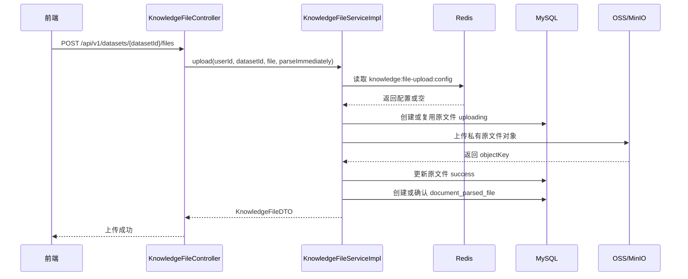
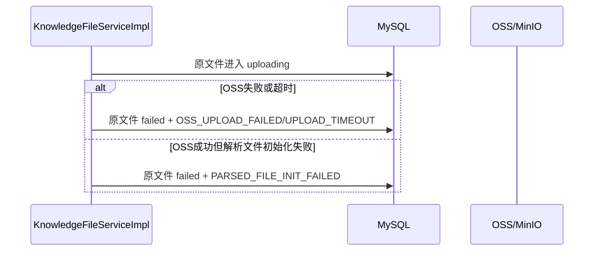

# ToLink Service 文件上传表结构与业务流程重构一期技术实现文档

> **文档状态：** 技术方案已确认，已完成实现与测试交付
> **项目名称**：ToLink Service
> **模块名称**：文件上传表结构与业务流程重构（一期）
> **需求文档**：`docs/module-development-files/文件上传与解析重构/一期/requirement.md`
> **分支名称**：dev
> **技术负责人：** Codex
> **最后更新时间：** 2026-04-29

---

## 1. 文档修订记录 (Change Log)

| 版本号 | 修改日期 | 修改内容简述 | 修改人 | 审核人 |
| :--- | :--- | :--- | :--- | :--- |
| v1.0 | 2026-04-29 | 初始版本创建，明确一期上传链路、解析文件初始化、Redis 上传配置和失败编码设计 | Codex | Fang |
| v1.1 | 2026-04-29 | 明确重构后表结构以 `docs/db/init.sql` 为准，补充三张文件表的一期/二期职责边界和脚本遗留清理要求 | Codex | Fang |
| v1.2 | 2026-04-29 | 明确 `document_original_file.failure_reason` 字段必须保留，并固定一期失败编码枚举集合 | Codex | Fang |
| v1.3 | 2026-04-29 | 调整 6.3 字段设计格式，将原文件表与解析文件表分表呈现 | Codex | Fang |
| v1.4 | 2026-04-29 | 补充前端联调所需响应结构，按上传、列表、详情、删除和管理端配置接口拆分响应契约 | Codex | Fang |
| v1.5 | 2026-04-29 | 收敛前端响应字段，明确 OSS 内部定位字段不在文件上传响应中暴露 | Codex | Fang |
| v1.6 | 2026-04-29 | 明确一期上传失败不做自动补偿，四类失败均由用户手动重试，失败编码仅作为后续补偿依据 | Codex | Fang |
| v1.7 | 2026-04-29 | 补充四类上传失败的当场处理动作，包括原文件落库、解析文件创建边界、对象定位处理和前端返回 | Codex | Fang |
| v1.8 | 2026-04-29 | 补充已参考的中间件公共契约文档，明确 Redis、OSS、MySQL 契约来源和 Kafka 本期不接入边界 | Codex | Fang |

---

## 2. 技术目标与实现范围 (Overview)

### 2.1 技术目标与核心思路 (Technical Goals)

- **技术目标：** 在现有原文件上传链路上完成一期重构：原文件上传成功后由 Java 创建一条一对一解析文件记录；上传配置从 MySQL 表迁移为 YAML 默认配置 + Redis 动态覆盖；原文件失败原因改为稳定编码。
- **设计原则：** 复用现有 `KnowledgeFileController`、`KnowledgeFileServiceImpl`、`IOssService`、`PrivateFileResolver`、MyBatis-Plus Mapper 和统一异常响应，不改 OSS/Redis framework 抽象。
- **成功标准：** 上传成功时 `document_original_file=success` 且存在唯一 `document_parsed_file(parse_count=0, latest_parse_task_id=null)`；上传失败只保留原文件失败记录；上传校验优先读 Redis 配置，Redis 不可用时回退 YAML。

### 2.2 实现范围与边界 (In Scope / Out of Scope)

**必须实现：**

- 上传成功后创建或确认 `document_parsed_file`。
- 调整 `KnowledgeParsedFile` 实体为一期目标表结构：`latest_parse_task_id`、`parse_count=0`，不再要求解析产物字段非空。
- `document_original_file.failure_reason` 改为稳定失败编码。
- `knowledge_file_config` 表、实体、Mapper 及 DB 读取依赖退出上传配置主链路。
- 上传配置读取改为 Redis 动态覆盖 + YAML fallback。
- 管理端上传配置接口保留，但读写 Redis，不再写 MySQL。
- 一期上传接口接收但忽略 `parseImmediately`，不创建解析任务、不投递 MQ。
- 同步调整 H2 测试 schema 和相关测试断言。

**暂不实现：**

- 不实现解析 MQ 投递。
- 不创建 `document_parse_task`。
- 不接入 Python 解析任务创建和结果回写。
- 不引入 Outbox 或复杂消息可靠投递。
- 不重构向量化、检索、问答消费链路。

### 2.3 验收项到实现点映射 (Requirement Mapping)

| 需求验收项 | 技术实现点 | 测试方式 | 责任模块 |
| :--- | :--- | :--- | :--- |
| 原文件上传事实 | 保留 `document_original_file` 上传状态机与唯一键规则 | Controller 集成测试 / Service 单元测试 | `link-api` / `link-service` |
| 解析文件记录初始化 | 上传成功后插入或确认 `document_parsed_file` | DB 断言 | `link-service` / `link-mapper` |
| 上传配置重构 | Redis key `knowledge:file-upload:config` + YAML fallback | Service 单元测试 / Admin 接口测试 | `link-service` / `link-api` |
| 失败原因编码 | `failure_reason` 写入稳定编码 | 失败分支测试 | `link-service` |
| 一期不触发解析 | 移除上传后 `KnowledgeParseTaskService` 调用 | Controller 集成测试 | `link-api` / `link-service` |

---

## 3. 当前系统分析与复用基础 (Current-State Analysis)

### 3.1 相关模块盘点

| 模块 | 当前职责 | 现状说明 | 是否修改 |
| :--- | :--- | :--- | :--- |
| `link-api` | Controller / API 入口 | `KnowledgeFileController` 已提供上传、列表、详情、删除和二期解析接口；`AdminController` 已有上传配置接口 | 是 |
| `link-service` | 业务服务 | `KnowledgeFileServiceImpl` 已实现上传、失败重试、超时补偿、删除；当前上传成功后 `parseImmediately=true` 会触发解析任务服务 | 是 |
| `link-model` | Entity / DTO / Enum | `KnowledgeOriginalFile` 已映射原文件表；`KnowledgeParsedFile` 仍是旧“最新成功产物”字段口径；`KnowledgeFileConfig` 仍映射配置表 | 是 |
| `link-mapper` | Mapper / 持久化 | 已有 `KnowledgeOriginalFileMapper`、`KnowledgeParsedFileMapper`、`KnowledgeFileConfigMapper` | 是 |
| `link-core` | 通用配置 / 异常 / 工具 | 复用 `BusinessException` 和 `ErrorCode` | 视错误码需要小改 |
| `link-components` | 可复用基础组件 | 复用 Redis 与 OSS 组件，不改 framework | 否 |

### 3.2 已复用能力 (Reusable Components)

- OSS：复用 `IOssService.upload2PreviewUrl` 保存私有原文件，复用 `PrivateFileResolver` 打开和清理私有对象缓存。
- Redis：复用 `RedisTemplate<String, Object>` 或 `RedisUtils` 读写上传配置，业务封装放在 `link-service`。
- MySQL：复用 MyBatis-Plus `BaseMapper` 风格。
- 统一响应：复用 `Result<T>` / `PageResult<T>`。
- 异常体系：复用 `BusinessException`、`ErrorCode`、`GlobalExceptionHandler`。
- 鉴权：复用 `@SaCheckLogin`、`@SaCheckRole("ADMIN")` 和 `AuthContext`。

### 3.3 已参考代码 (Code References)

| 文件/模块 | 参考点 | 对方案的影响 |
| :--- | :--- | :--- |
| `link-api/src/main/java/com/qingluo/link/api/controller/KnowledgeFileController.java` | 上传、列表、详情、删除接口与 `parseImmediately` 参数 | 一期保留上传接口，但上传阶段忽略 `parseImmediately` |
| `link-service/src/main/java/com/qingluo/link/service/impl/KnowledgeFileServiceImpl.java` | 上传状态机、失败重试、对象 key 生成、超时补偿 | 在成功分支补充解析文件初始化，在失败分支改写失败编码 |
| `link-model/src/main/java/com/qingluo/link/model/dto/entity/KnowledgeOriginalFile.java` | 原文件实体字段 | 继续复用字段，调整 `failure_reason` 语义为编码 |
| `link-model/src/main/java/com/qingluo/link/model/dto/entity/KnowledgeParsedFile.java` | 当前解析文件实体 | 需要改为 `latest_parse_task_id` 可空、移除成功产物必填口径 |
| `link-service/src/main/java/com/qingluo/link/service/impl/KnowledgeFileRuntimeConfigServiceImpl.java` | 当前从 `knowledge_file_config` 读取配置 | 改为 Redis 优先、YAML fallback |
| `link-service/src/main/java/com/qingluo/link/service/impl/AdminKnowledgeFileConfigServiceImpl.java` | 当前管理端写 DB 配置 | 改为读写 Redis 配置快照 |
| `link-api/src/test/resources/schema.sql` | 当前测试表仍包含旧解析文件表和配置表 | 需要同步一期目标 schema |
| `docs/architecture/middleware_contract.md` | MySQL、Redis、MQ、OSS、API 与日志追踪公共约定 | 确认本期新增 Redis key、移除 MySQL 配置表依赖、复用 OSS 路径边界，并明确公共契约需要回写 |
| `docs/architecture/middleware-components/oss_component.md` | OSS 接入方式 | 业务层使用组件，不改 framework |
| `docs/architecture/middleware-components/redis_component.md` | Redis 接入方式 | 新增业务缓存服务，不把配置逻辑写入 framework |
| `docs/architecture/middleware-components/kafka_component.md` | MQ 接入方式 | 一期不投递解析 MQ，不接入 Kafka；二期解析 MQ 投递阶段再按该组件文档设计 |

### 3.4 现有问题与约束 (Constraints)

- 当前上传成功且 `parseImmediately=true` 时会调用 `KnowledgeParseTaskService.submitAutoParseAfterUpload`，这不符合一期边界。
- 当前 `KnowledgeParsedFile` 和测试 schema 仍使用 `latest_success_task_id`、解析产物字段非空、`parse_count=1` 的旧成功产物口径。
- 当前上传配置依赖 `knowledge_file_config`，与本期“不再使用 MySQL 配置表”的需求冲突。
- 当前 `failure_reason` 保存中文文案，后续补偿不适合基于文案判断。
- Redis key `knowledge:file-upload:config` 是新增公共 key，应在 `middleware_contract.md` Redis 约定中回写。
- `middleware_contract.md` 当前 MySQL 典型表仍列出 `knowledge_file_config`，本期实现落地后需更新。

---

## 4. 核心架构与实现方案 (Architecture & Solution)

### 4.1 总体设计思路 (Architecture Overview)

一期采用“上传成功双记录”模型：

- `document_original_file`：上传请求通过基础校验后创建或复用，记录原文件上传事实。
- `document_parsed_file`：仅在原文件上传成功后创建或确认，作为原文件一对一解析业务记录，初始 `parse_count=0`、`latest_parse_task_id=null`。
- `knowledge:file-upload:config`：保存运行时上传配置覆盖值；YAML 作为默认值和 Redis 降级来源。

### 4.2 目标调用链路 (Call Flow)

```text
KnowledgeFileController.upload
  -> KnowledgeFileServiceImpl.upload
  -> 校验数据集归属
  -> KnowledgeFileRuntimeConfigService.getCurrent()
  -> 校验文件规则
  -> 创建或复用 document_original_file(uploading)
  -> IOssService.upload2PreviewUrl
  -> 更新 document_original_file(success)
  -> 创建或确认 document_parsed_file(parse_count=0)
  -> 返回 KnowledgeFileDTO
```

### 4.3 核心模块职责划分 (Module Responsibilities)

| 模块/类 | 职责 | 输入/输出边界 |
| :--- | :--- | :--- |
| `KnowledgeFileController` | 文件上传、列表、详情、删除入口 | HTTP 请求 / `Result<T>` |
| `KnowledgeFileServiceImpl` | 上传状态机、OSS 调用、原文件状态、解析文件初始化 | userId、datasetId、MultipartFile / `KnowledgeFileDTO` |
| `KnowledgeParsedFileMapper` | 解析文件记录持久化 | `KnowledgeParsedFile` / DB |
| `KnowledgeFileRuntimeConfigServiceImpl` | 获取上传配置快照 | Redis/YAML -> `KnowledgeFileRuntimeConfig` |
| `AdminKnowledgeFileConfigServiceImpl` | 管理端查询和修改上传配置 | DTO / Redis |
| `KnowledgeFileProperties` | YAML 默认上传配置和内部 URL 配置 | `tolink.knowledge-file.*` |

### 4.4 核心时序图 (Sequence Diagrams)

#### 场景 1：上传成功并初始化解析文件记录



#### 场景 2：上传失败与解析文件初始化失败



---

## 5. 接口契约与交互方案 (API Contract)

### 5.1 接口清单

| 方法 | 路径 | 说明 | 权限 |
| :--- | :--- | :--- | :--- |
| POST | `/api/v1/datasets/{datasetId}/files` | 上传原文件，一期上传成功后初始化解析文件记录 | 登录用户 |
| GET | `/api/v1/datasets/{datasetId}/files` | 查询数据集原文件列表 | 登录用户 |
| GET | `/api/v1/files/{fileId}` | 查询单个原文件详情 | 登录用户 |
| DELETE | `/api/v1/files/{fileId}` | 删除原文件 | 登录用户 |
| GET | `/api/v1/admin/knowledge-file-config` | 查询当前上传配置快照 | ADMIN |
| PATCH | `/api/v1/admin/knowledge-file-config` | 修改上传配置，写入 Redis | ADMIN |

说明：`POST /api/v1/datasets/{datasetId}/files` 一期继续接收 `parseImmediately` 兼容前端，但不触发解析任务。

### 5.2 请求参数

| 接口 | 参数 | 位置 | 类型 | 必填 | 说明 |
| :--- | :--- | :--- | :--- | :--- | :--- |
| 上传 | `datasetId` | path | Long | 是 | 数据集 ID |
| 上传 | `file` | multipart | File | 是 | 原文件 |
| 上传 | `parseImmediately` | query/form | boolean | 否 | 一期忽略，不触发解析 |
| 查询配置 | 无 | - | - | - | 返回 Redis 或 YAML 配置快照 |
| 修改配置 | `maxSizeBytes` | body | Long | 是 | 单文件大小上限 |
| 修改配置 | `allowedSuffixes` | body | List<String> | 是 | 允许后缀白名单 |

### 5.3 响应结构

本期接口统一沿用 `Result<T>` 包装结构。前端判断业务成功优先看 `code`，业务数据从 `data` 读取；分页接口的分页数据在 `data.items` 中。

#### 上传成功响应

`POST /api/v1/datasets/{datasetId}/files` 继续返回 `KnowledgeFileDTO`。本期不要求在上传响应中返回解析文件 ID；前端仍以原文件为主维度。

```json
{
  "code": 200,
  "message": "success",
  "data": {
    "id": 10000,
    "datasetId": 10001,
    "originalFilename": "report.pdf",
    "fileSuffix": "pdf",
    "fileSize": 102400,
    "uploadStatus": "success",
    "isUploadSuccess": true,
    "failureReason": null,
    "createdAt": "2026-04-29T12:00:00",
    "updatedAt": "2026-04-29T12:00:01"
  }
}
```

前端展示约定：

- `uploadStatus=success` 时展示上传成功，可展示“未解析”入口状态。
- `uploadStatus=failed` 时展示上传失败，失败原因从 `failureReason` 读取稳定编码后映射文案。
- `uploadStatus=uploading` 只可能出现在列表/详情查询中，表示后端仍认为文件上传中或等待超时补偿。
- `bucketName`、`objectKey`、`fileUrl` 属于服务端内部定位字段，文件上传、列表和详情响应默认不返回，避免暴露对象存储路径和内部下载地址。

#### 文件列表响应

`GET /api/v1/datasets/{datasetId}/files` 返回 `PageResult<KnowledgeFileDTO>`。

```json
{
  "code": 200,
  "message": "success",
  "data": {
    "items": [
      {
        "id": 10000,
        "datasetId": 10001,
        "originalFilename": "report.pdf",
        "fileSuffix": "pdf",
        "fileSize": 102400,
        "uploadStatus": "success",
        "isUploadSuccess": true,
        "failureReason": null,
        "createdAt": "2026-04-29T12:00:00",
        "updatedAt": "2026-04-29T12:00:01"
      }
    ],
    "total": 1,
    "page": 1,
    "pageSize": 20,
    "totalPages": 1
  }
}
```

列表筛选约定：

- `uploadStatus` 查询参数可选值：`uploading`、`success`、`failed`。
- 列表本期不返回解析任务状态、解析进度和解析产物地址。
- 列表本期不返回 OSS bucket、object key、内部下载 URL 等后端定位字段。

#### 文件详情响应

`GET /api/v1/files/{fileId}` 返回单个 `KnowledgeFileDTO`，字段与上传成功响应一致。前端详情页如需展示失败原因，应使用 `failureReason` 编码映射，不直接展示原始编码。

响应字段安全边界：

- 前端文件管理只需要 `id`、`datasetId`、`originalFilename`、`fileSuffix`、`fileSize`、`uploadStatus`、`isUploadSuccess`、`failureReason`、`createdAt`、`updatedAt`。
- `bucketName`、`objectKey`、`fileUrl` 只保存在服务端实体和内部链路中，不作为普通前端响应字段。
- 若后续需要文件下载或预览，应单独设计带权限校验的下载接口，不直接复用内部对象定位字段。

#### 删除响应

`DELETE /api/v1/files/{fileId}` 返回空数据。

```json
{
  "code": 200,
  "message": "success",
  "data": null
}
```

#### 管理端上传配置响应

`GET /api/v1/admin/knowledge-file-config` 返回当前生效配置快照。底层配置来源改为 Redis 优先、YAML 兜底，但响应结构保持 `KnowledgeFileConfigDTO`。

```json
{
  "code": 200,
  "message": "success",
  "data": {
    "maxSizeBytes": 20971520,
    "allowedSuffixes": ["md", "markdown", "pdf", "docx", "txt"],
    "updatedBy": 10000,
    "updatedAt": "2026-04-29T12:00:00"
  }
}
```

`PATCH /api/v1/admin/knowledge-file-config` 修改成功后返回空数据。

```json
{
  "code": 200,
  "message": "success",
  "data": null
}
```

说明：

- Redis 无配置时返回 YAML 默认配置，`updatedBy`、`updatedAt` 可为空。
- Redis 有配置时返回 Redis 中的运行时覆盖配置，并带上最近修改人和修改时间。
- `allowedSuffixes` 返回小写后缀列表，不带点号。

### 5.4 异常响应

| 场景 | HTTP 状态 | 业务错误码 | message |
| :--- | :--- | :--- | :--- |
| 未登录 | 401 | 401 | 未登录或登录已过期 |
| 数据集不存在或无权访问 | 404 | 404 | 数据集不存在或无权访问 |
| 已存在成功同名文件 | 400 | 400 | 当前数据集下已存在同名同后缀原文件 |
| 文件正在上传中 | 409 | 409 | 文件正在上传中，请稍后重试 |
| 文件格式不支持 | 400 | 400 | 当前文件格式暂不支持 |
| 文件大小超过限制 | 400 | 400 | 文件大小超过限制 |
| OSS 上传失败 | 500 | 500 | 文件上传失败，请稍后重试 |
| 解析文件初始化失败 | 500 | 500 | 文件上传失败，请稍后重试 |
| 上传配置非法 | 400 | 10010 | 知识文件上传配置不合法 |

### 5.5 异常类与错误码定义

#### 异常类设计

| 异常类 | 继承关系 | 使用场景 | 说明 |
| :--- | :--- | :--- | :--- |
| 复用 `BusinessException` | `RuntimeException` | 上传校验、重复上传、上传失败、配置非法 | 保持现有统一异常处理风格 |

#### 错误码定义

| 错误码 | 枚举名/常量名 | HTTP 状态 | 触发场景 | 前端提示策略 |
| :--- | :--- | :--- | :--- | :--- |
| 10010 | `KNOWLEDGE_FILE_CONFIG_INVALID` | 400 | 上传配置非法 | toast |
| 400 | 直接构造 `BusinessException` | 400 | 文件参数不合法、重复上传 | toast |
| 409 | 直接构造 `BusinessException` | 409 | 上传中并发保护 | toast |
| 500 | 直接构造 `BusinessException` | 500 | 上传失败或解析文件初始化失败 | toast |

说明：当前仓库已有大量文件上传分支直接使用 `new BusinessException(code,message,httpStatus)`。本期优先保持风格，不强制新增文件上传错误码枚举；配置非法继续复用 `KNOWLEDGE_FILE_CONFIG_INVALID`。

### 5.6 兼容性说明

- 上传接口路径和基础响应保持兼容。
- `parseImmediately` 一期接收但忽略，避免前端立即改动。
- 管理端配置接口路径保持兼容，但底层从 DB 改为 Redis。
- `knowledge_file_config` 表移除后，依赖该表的测试和初始化脚本必须同步调整。

---

## 6. 数据契约与存储设计 (Data & Storage)

### 6.1 数据模型与实体关系 (E-R)

```text
document_original_file 1 - 1 document_parsed_file
```

### 6.2 数据库组件与结构变更 (Database & Schema Changes)

本次重构后的文件上传与解析相关表结构，以 `docs/db/init.sql` 中的定义为准。实现阶段需要按该 SQL 同步实体、Mapper、测试 schema 和初始化脚本；若现有代码或旧文档字段与该 SQL 不一致，以该 SQL 为优先。

#### MySQL 变更

| 表名 | 变更类型 | 变更说明 | 备注 |
| :--- | :--- | :--- | :--- |
| `document_original_file` | 按 `docs/db/init.sql` 对齐 | 原文件上传事实表，只保存原文件归属、对象定位、上传状态和上传失败原因编码 | 一期由 Java 创建和更新 |
| `document_parsed_file` | 按 `docs/db/init.sql` 对齐 | 文件解析业务表，与原文件一对一，允许未解析态，保存最新解析任务 ID 和累计解析次数 | 一期由 Java 在上传成功后创建 |
| `document_parse_log` | 按 `docs/db/init.sql` 保留目标结构 | 文件解析日志表，记录每一次解析任务、解析产物、失败原因和耗时 | 二期由 Python 消费 MQ 后创建，本期不写入 |
| `knowledge_file_config` | 删除 | 上传配置不再使用 MySQL 表 | 代码、测试、脚本同步移除 |

### 6.3 字段设计

#### `document_original_file` 字段

| 字段 | 类型 | 是否必填 | 默认值 | 说明 |
| :--- | :--- | :--- | :--- | :--- |
| `dataset_id` | bigint unsigned | 是 | 无 | 所属数据集 ID |
| `user_id` | bigint unsigned | 是 | 无 | 上传用户 ID |
| `original_filename` | varchar(255) | 是 | 无 | 用户上传时的原始文件名 |
| `file_suffix` | varchar(32) | 是 | 无 | 标准化小写后缀 |
| `file_size` | bigint unsigned | 是 | 无 | 原文件大小，单位字节 |
| `content_type` | varchar(128) | 否 | null | 上传请求中的 Content-Type |
| `bucket_name` | varchar(64) | 是 | `rag-raw` | 原文件私有存储桶 |
| `object_key` | varchar(512) | 否 | null | 私有 OSS 对象 Key |
| `file_url` | varchar(1024) | 否 | null | Python/RAG 内部下载 URL |
| `upload_status` | varchar(20) | 是 | `uploading` | 上传状态：`uploading`、`success`、`failed` |
| `is_upload_success` | tinyint(1) | 是 | 0 | 是否上传成功 |
| `failure_reason` | varchar(512) | 否 | null | 必须保留，稳定失败原因编码：`OSS_UPLOAD_FAILED`、`UPLOAD_TIMEOUT`、`PARSED_FILE_INIT_FAILED`、`UNKNOWN_UPLOAD_FAILED` |

#### `document_parsed_file` 字段

| 字段 | 类型 | 是否必填 | 默认值 | 说明 |
| :--- | :--- | :--- | :--- | :--- |
| `document_original_file_id` | bigint | 是 | 无 | 原文件 ID，唯一 |
| `dataset_id` | bigint | 是 | 无 | 数据集 ID |
| `user_id` | bigint | 是 | 无 | 用户 ID |
| `latest_parse_task_id` | varchar(36) | 否 | null | 最新解析任务 ID，一期创建时为空 |
| `original_filename` | varchar(255) | 是 | 无 | 原文件名快照 |
| `parse_count` | int | 是 | 0 | 累计解析次数，一期始终为 0 |

说明：本期 `document_parsed_file` 不保存解析产物路径；解析产物路径在二期任务日志中设计。

`document_parse_log` 虽然已在目标 `docs/db/init.sql` 中定义，但属于二期解析链路的写入对象。一期实现只需要保证上传链路不再创建解析任务记录，并为二期预留 `document_parsed_file.latest_parse_task_id` 可空字段。

#### `failure_reason` 编码约束

`document_original_file.failure_reason` 字段必须保留，不新增额外失败编码字段。一期实现中该字段只允许写入以下稳定编码，不允许继续写入中文文案或异常堆栈：

| 编码 | 写入场景 | 后续处理口径 |
| :--- | :--- | :--- |
| `OSS_UPLOAD_FAILED` | MinIO/OSS 上传返回失败或抛出非超时异常 | 一期不自动补偿，原文件失败，允许用户手动重新上传，不创建解析文件记录 |
| `UPLOAD_TIMEOUT` | 上传线程等待超时，上传结果不确定 | 一期不做对象探测补偿，原文件失败，允许用户手动重新上传 |
| `PARSED_FILE_INIT_FAILED` | 原文件对象已上传成功，但 `document_parsed_file` 初始化失败 | 一期不自动补建解析文件记录，原文件失败，允许用户手动重试；编码仅作为后续补偿依据 |
| `UNKNOWN_UPLOAD_FAILED` | 其他未分类上传异常 | 一期不自动补偿，原文件失败，保留日志辅助人工判断，允许用户手动重试 |

### 6.4 索引与约束

- `document_original_file` 保留唯一约束：`dataset_id + user_id + original_filename + file_suffix`。
- `document_original_file` 保留索引：`dataset_id, created_at`、`user_id, created_at`、`upload_status, updated_at`。
- `document_parsed_file` 保留唯一约束：`document_original_file_id`。
- `document_parsed_file` 保留普通索引：`dataset_id, user_id, updated_at`。
- `document_parsed_file` 保留普通索引：`latest_parse_task_id`，为二期查询准备。
- `document_parse_log` 保留唯一约束：`task_id`。
- `document_parse_log` 保留索引：`document_original_file_id, task_status, updated_at`、`document_parsed_file_id, task_status, updated_at`，本期只同步 schema，不写入数据。

### 6.5 中间件与其他存储设计

| 组件 | 存储内容 | Key/Path 规则 | 备注 |
| :--- | :--- | :--- | :--- |
| Redis | 上传配置动态覆盖 | `knowledge:file-upload:config` | 不设置 TTL |
| OSS / MinIO | 原文件对象 | `original/user-{userId}/dataset-{datasetId}/{yyyy}/{MM}/{dd}/{fileId}/{originalFilename}` | 复用现有路径规则 |
| MySQL | 原文件和解析文件结构化记录 | 见表结构 | 结构化状态最终以 MySQL 为准 |

Redis value 建议保存为结构化对象：

```json
{
  "maxSizeBytes": 20971520,
  "allowedSuffixes": ["md", "markdown", "pdf", "docx", "txt"],
  "updatedBy": 10000,
  "updatedAt": "2026-04-29T12:00:00"
}
```

### 6.6 数据迁移与回滚

- **是否需要迁移：** 需要。需要移除 `knowledge_file_config` 表依赖，调整 `document_parsed_file` 旧成功产物表结构和测试 schema。
- **迁移策略：**
  - 发布前确认目标库中 `document_parsed_file` 可允许未解析态。
  - 若存在旧 `document_parsed_file` 成功产物数据，需要在二期前确认是否保留、迁移到任务日志或清理。
  - 删除 `knowledge_file_config` 前，确认上传配置默认值已进入 YAML。
  - 清理初始化脚本中与目标表结构不一致的旧脚本残留，例如不存在建表语句但仍执行自增调整的 `knowledge_file_config`。
- **回滚策略：**
  - 代码回滚到旧版本时，需要同步回滚 `knowledge_file_config` 表和旧 `document_parsed_file` 结构。
  - Redis 上传配置回滚不影响基础上传，YAML 仍可兜底。

---

## 7. 核心实现逻辑 (Core Implementation)

### 7.1 Service / Component 设计

```java
public interface KnowledgeFileRuntimeConfigService {
    KnowledgeFileRuntimeConfig getCurrent();
}
```

建议新增或调整的业务封装：

```java
public interface KnowledgeFileConfigCacheService {
    KnowledgeFileRuntimeConfig getConfig();
    void putConfig(KnowledgeFileRuntimeConfig config, Long updatedBy);
}
```

说明：也可以直接在 `KnowledgeFileRuntimeConfigServiceImpl` 中注入 `RedisTemplate` 实现读写，但技术上更推荐用独立缓存服务封装 key 和序列化细节。

### 7.2 核心方法职责

| 方法 | 职责 | 输入 | 输出 |
| :--- | :--- | :--- | :--- |
| `KnowledgeFileServiceImpl.upload` | 编排上传主链路 | userId、datasetId、file、parseImmediately | `KnowledgeFileDTO` |
| `initializeParsedFileIfAbsent` | 上传成功后创建或确认解析文件记录 | 原文件记录 | `KnowledgeParsedFile` |
| `KnowledgeFileRuntimeConfigServiceImpl.getCurrent` | 获取上传配置快照 | 无 | `KnowledgeFileRuntimeConfig` |
| `AdminKnowledgeFileConfigServiceImpl.updateConfig` | 校验并写入 Redis 动态配置 | adminUserId、request | void |
| `markFailed` | 写入失败状态和失败编码 | fileId、failureCode | void |

### 7.3 关键处理流程

1. Controller 获取登录用户，调用 `KnowledgeFileService.upload`。
2. Service 校验数据集归属。
3. Service 读取上传配置快照，优先 Redis，失败则 YAML。
4. Service 校验文件名、后缀、大小。
5. Service 按唯一键查询原文件记录。
6. 若已存在成功记录，返回重复上传错误。
7. 若存在未超时 uploading 记录，返回 409。
8. 若不存在记录则新建 uploading；若存在 failed 或已超时 uploading 则复用并重新置为 uploading。
9. 生成或复用 objectKey。
10. 通过上传线程池调用 `IOssService.upload2PreviewUrl`。
11. OSS 成功后更新原文件为 success。
12. 创建或确认 `document_parsed_file`。
13. 若解析文件初始化成功，返回上传成功。
14. 若 OSS 失败或超时，写 `OSS_UPLOAD_FAILED` / `UPLOAD_TIMEOUT`。
15. 若解析文件初始化失败，写 `PARSED_FILE_INIT_FAILED` 并返回上传失败。
16. 一期不启动自动补偿任务、不做 MinIO 对象探测、不自动补建解析文件记录；失败记录由用户重新上传触发重试。

### 7.4 并发、幂等与一致性

- **并发控制：** 原文件唯一键兜底并发插入；未超时 uploading 拒绝重入。
- **幂等策略：** failed 记录可复用，成功记录拒绝重复上传；用户手动重试时复用同一条原文件记录并重新置为 uploading。
- **事务边界：** `document_original_file` success 回写与 `document_parsed_file` 初始化应处于同一上传事务编排中；解析文件初始化失败时必须捕获异常并将原文件回写 failed。
- **跨组件一致性：** OSS 上传成功但 DB 初始化失败时，不强删对象；失败记录保留 objectKey，后续重试覆盖同 key。
- **配置线程安全：** 上传请求获取配置快照后仅使用本地对象；管理员修改 Redis 不影响正在执行的上传请求。

---

## 8. 组件集成与配置方案 (Integration Design)

| 组件 | 用途 | 配置项 | 失败处理 |
| :--- | :--- | :--- | :--- |
| OSS | 保存原文件对象 | `tolink.oss.*` | 写 `OSS_UPLOAD_FAILED` 或 `UPLOAD_TIMEOUT` |
| Redis | 上传配置动态覆盖 | `knowledge:file-upload:config` | 读取失败回退 YAML，写入失败返回配置修改失败 |
| MySQL | 原文件和解析文件记录 | DDL / Mapper | DB 异常进入失败编码或统一异常 |
| YAML | 上传配置默认值 | `tolink.knowledge-file.allowed-suffixes`、`max-size-bytes` | Redis 不可用时兜底 |

Middleware 契约结论：

- 本期触碰 MySQL、Redis、OSS 公共面。
- `knowledge:file-upload:config` 是新增 Redis 公共 key，需要回写 `docs/architecture/middleware_contract.md` Redis 章节。
- `knowledge_file_config` 退出 MySQL 典型表清单，需要回写 MySQL 章节。
- OSS 原文件 object key 继续复用现有公共路径规则，不新增 OSS 路径契约。

---

## 9. 权限、安全与审计设计 (Security)

### 9.1 认证与授权

| 操作 | 权限要求 | 校验位置 |
| :--- | :--- | :--- |
| 上传原文件 | 登录用户 | `@SaCheckLogin` + `AuthContext` |
| 查询文件列表/详情 | 登录用户且文件归属当前用户 | Service 查询条件 |
| 删除文件 | 登录用户且文件归属当前用户 | Service 查询条件 |
| 查询/修改上传配置 | ADMIN | `AdminController` 上的 `@SaCheckRole("ADMIN")` |

### 9.2 敏感数据处理

- Redis 配置中不保存密钥或 Token。
- `file_url` 为内部下载 URL，不包含服务间鉴权 Token。
- 日志记录 objectKey、fileId、datasetId、userId，避免输出 Redis 原始配置 JSON 和内部 Token。

### 9.3 审计要求

- 管理端修改上传配置时，Redis value 中记录 `updatedBy` 和 `updatedAt`，用于基础审计展示。
- 若后续需要完整配置变更历史，再单独设计审计日志，不在本期引入 MySQL 配置表。

---

## 10. 异常处理与降级策略 (Exceptions & Fallback)

| 异常场景 | 处理方式 | 错误码 | 用户提示 | 是否重试 |
| :--- | :--- | :--- | :--- | :--- |
| 文件为空 | 抛 `BusinessException` | 400 | 请选择要上传的文件 | 否 |
| 后缀不支持 | 抛 `BusinessException` | 400 | 当前文件格式暂不支持 | 否 |
| 文件超大小 | 抛 `BusinessException` | 400 | 文件大小超过限制 | 否 |
| 已存在成功文件 | 抛 `BusinessException` | 400 | 当前数据集下已存在同名同后缀原文件 | 否 |
| 文件正在上传中 | 抛 `BusinessException` | 409 | 文件正在上传中，请稍后重试 | 可稍后 |
| OSS 上传失败 | 原文件 failed + `OSS_UPLOAD_FAILED` | 500 | 文件上传失败，请稍后重试 | 是 |
| OSS 上传超时 | 原文件 failed + `UPLOAD_TIMEOUT` | 500 | 文件上传超时，请重新上传 | 是 |
| 解析文件初始化失败 | 原文件 failed + `PARSED_FILE_INIT_FAILED` | 500 | 文件上传失败，请稍后重试 | 是 |
| 未分类上传异常 | 原文件 failed + `UNKNOWN_UPLOAD_FAILED` | 500 | 文件上传失败，请稍后重试 | 是 |
| Redis 读取失败 | 回退 YAML | 无 | 用户无感 | 否 |
| Redis 写入失败 | 配置修改失败 | 500 | 配置保存失败，请稍后重试 | 是 |

一期失败处理结论：

- `OSS_UPLOAD_FAILED`、`UPLOAD_TIMEOUT`、`PARSED_FILE_INIT_FAILED`、`UNKNOWN_UPLOAD_FAILED` 均不触发自动补偿。
- 后端只负责写准 `upload_status=failed`、`is_upload_success=0`、`failure_reason=<稳定编码>`，并向前端返回失败。
- 用户手动重新上传同名同后缀文件时，后端复用 failed 原文件记录，重新置为 `uploading` 后再次执行上传链路。
- 失败编码只作为后续二期或独立补偿任务的判断依据；一期不实现定时扫描、对象探测或解析文件自动补建。

### 10.1 四类上传失败的当场处理

| 失败编码 | 触发点 | 当场原文件处理 | 当场解析文件处理 | 对象定位处理 | 前端返回 |
| :--- | :--- | :--- | :--- | :--- | :--- |
| `OSS_UPLOAD_FAILED` | 调用 `IOssService.upload2PreviewUrl` 期间 MinIO/OSS 明确失败或抛出非超时异常 | 将当前原文件记录更新为 `upload_status=failed`、`is_upload_success=0`、`failure_reason=OSS_UPLOAD_FAILED` | 不创建 `document_parsed_file`；如果此前不存在解析文件，本次不得补建 | 若本次尚未拿到可信对象定位，`object_key/file_url` 保持为空或保留原有失败记录中的旧值；不得把未确认成功的对象定位当作可用文件 | 返回 500，提示“文件上传失败，请稍后重试” |
| `UPLOAD_TIMEOUT` | 上传线程等待 OSS 结果超过配置超时时间 | 将当前原文件记录更新为 `upload_status=failed`、`is_upload_success=0`、`failure_reason=UPLOAD_TIMEOUT` | 不创建 `document_parsed_file` | 可保留本次生成的 `object_key` 作为排查线索，但一期不探测 MinIO 对象是否实际存在，不将其视为上传成功 | 返回 500，提示“文件上传超时，请重新上传” |
| `PARSED_FILE_INIT_FAILED` | OSS 已返回成功，原文件对象定位已回写，但创建或确认 `document_parsed_file` 失败 | 将当前原文件记录从成功候选状态回写为 `upload_status=failed`、`is_upload_success=0`、`failure_reason=PARSED_FILE_INIT_FAILED` | 不返回成功；如果 `document_parsed_file` 未创建成功，则保持不存在；如果发生唯一键并发导致已存在，应重新查询确认后再决定是否可返回成功 | 保留已成功上传的 `bucket_name/object_key/file_url` 供日志排查和后续人工判断；一期不删除 OSS 对象 | 返回 500，提示“文件上传失败，请稍后重试” |
| `UNKNOWN_UPLOAD_FAILED` | 上传链路出现未分类运行时异常，且无法归入 OSS 失败、上传超时或解析文件初始化失败 | 尽最大可能将当前原文件记录更新为 `upload_status=failed`、`is_upload_success=0`、`failure_reason=UNKNOWN_UPLOAD_FAILED`；若原文件记录尚未创建成功，仅记录错误日志并返回失败 | 默认不创建 `document_parsed_file` | 不主动清理 OSS 对象；若异常发生在 OSS 成功之后，需要通过日志和对象定位人工判断 | 返回 500，提示“文件上传失败，请稍后重试” |

当场处理补充规则：

- 四类失败都必须记录结构化日志，至少包含 `originalFileId`、`datasetId`、`userId`、`failureReason`，如已生成 `objectKey` 则记录到服务端日志中。
- 当场处理不得把异常堆栈、MinIO 内部地址、object key、内部下载 URL 返回给前端。
- 当场处理完成后，上传接口不得返回成功，也不得让前端看到“可解析”的状态。
- 用户后续手动重试时，统一走 failed 记录复用逻辑，重新置为 `uploading`，成功后清空 `failure_reason`。

---

## 11. 测试与验证方案 (Test Plan)

### 11.1 单元测试

| 测试类 | 覆盖内容 |
| :--- | :--- |
| `KnowledgeFileServiceImplTest` | 删除补偿、解析文件初始化失败、失败编码写入、上传中超时补偿 |
| `KnowledgeFileRuntimeConfigServiceImplTest` | Redis 有值、Redis 无值、Redis 异常、Redis 配置非法时的 YAML fallback |
| `AdminKnowledgeFileConfigServiceImplTest` | 配置校验、写 Redis、读取 Redis 配置快照 |

### 11.2 集成测试

| 测试类 | 覆盖接口/流程 |
| :--- | :--- |
| `KnowledgeFileControllerTest` | 上传成功创建原文件和解析文件记录；`parseImmediately=true` 不创建解析任务；失败重试；重复上传；上传超时 |
| `AdminControllerTest` | 查询/修改上传配置接口改为 Redis 配置 |

### 11.3 回归测试

| 回归点 | 验证方式 |
| :--- | :--- |
| 原文件列表、详情、删除仍可用 | MockMvc 集成测试 |
| OSS 公共上传与预览旧能力不受影响 | `OssFileControllerTest` |
| 数据集删除关联清理不因解析文件表结构调整失败 | `DatasetControllerTest` |
| 解析接口不在一期被上传链路触发 | 上传后断言 `document_parse_task` 无记录 |

### 11.4 验证命令

```bash
mvn -pl link-api -am -Dtest=KnowledgeFileControllerTest,AdminControllerTest,OssFileControllerTest,DatasetControllerTest test
mvn -pl link-service -am -Dtest=KnowledgeFileServiceImplTest test
```

---

## 12. 发布与回滚方案 (Release Plan)

### 12.1 发布步骤

1. 更新数据库结构：调整 `document_parsed_file`，移除 `knowledge_file_config`。
2. 发布 Java 代码：上传成功后初始化解析文件记录，配置读写切换 Redis。
3. 配置 YAML 默认上传限制。
4. 如需运行时覆盖配置，由管理员接口写入 Redis `knowledge:file-upload:config`。
5. 验证上传成功、失败重试、配置修改和解析文件记录初始化。

### 12.2 回滚策略

- 若代码回滚到旧版本，需要恢复 `knowledge_file_config` 表和旧配置写库逻辑。
- 若只回滚 Redis 配置，删除 `knowledge:file-upload:config` 即可回退 YAML 默认配置。
- 若解析文件初始化逻辑异常，可临时禁用本期代码并保留原文件上传链路，但需避免二期继续依赖解析文件记录。

### 12.3 风险与待确认项

- `document_parsed_file` 旧数据如何迁移或清理需要实现前确认。
- 一期上传失败已确定采用用户手动重试，不实现自动补偿；后续如需补偿任务，应在独立需求中基于 `failure_reason` 编码另行设计。
- 管理端配置接口返回 DTO 是否继续展示 `updatedBy/updatedAt`，需要和前端确认；Redis value 已预留这两个字段。
