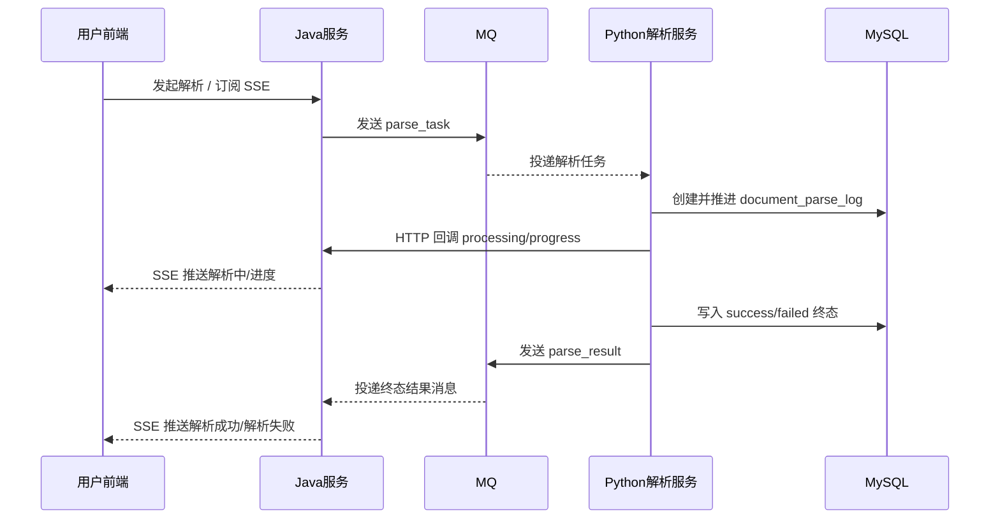
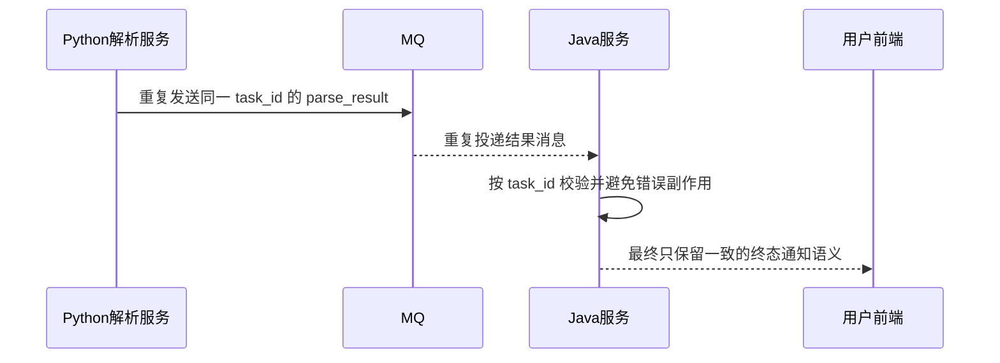

# ToLink Service 文件上传与解析重构三期 PRD

> **文档状态：** 需求待审核
> **项目名称**：ToLink Service
> **模块名称**：文件上传与解析重构（三期）
> **分支名称**：refactor/update-file-upload-parse
> **产品负责人：** Fang / Codex
> **最后更新时间：** 2026-04-30

---

## 1. 文档修订记录 (Change Log)

| 版本号 | 修改日期 | 修改内容简述 | 提出人 | 审核人 |
| :--- | :--- | :--- | :--- | :--- |
| v1.0 | 2026-04-30 | 初始化三期 PRD，明确 Python 解析终态结果由 `parse_result` MQ 回传给 Java | Fang / Codex | 待审核 |

---

## 2. 需求背景与业务目标 (Overview)

### 2.1 业务概览与核心逻辑 (Business Overview)

- **业务定位：** 三期承接二期“Java 发 `parse_task`、Python 执行解析、HTTP 回调转发 SSE”的主链路，把 Python -> Java 的终态通知方式从内部回调调整为 MQ 回传。
- **核心逻辑主线：** Java 继续负责解析受理、生成 `task_id`、发送 `parse_task`；Python 继续负责创建并更新 `document_parse_log`、更新 `document_parsed_file`、上报 `processing/progress`；当 Python 完成解析成功或失败后，不再调用终态回调接口，而是向 `tolink.rag.parse_result` 发送终态结果消息，由 Java 消费后转发前端。
- **核心价值：** 让解析终态通知与解析任务下发都统一到 MQ 协作方式，减少回调函数承担终态主链路的职责，同时为后续多节点事件分发和结果链路治理提供更稳定的异步边界。

### 2.2 核心节点目标与验收准则 (Key Milestones)

| 核心功能节点 | 预期达成目标 | 关键验收点 (DoD) |
| :--- | :--- | :--- |
| 终态结果回传 | Python 解析完成后向 `tolink.rag.parse_result` 发送终态消息 | Java 能消费 `success/failed` 终态消息并识别对应任务 |
| 回调职责收缩 | 内部 HTTP 回调不再承接 `success/failed` | `processing/progress` 仍能正常推送，终态不再依赖回调 |
| 消息契约统一 | 新 `parse_result` 按扁平 JSON 协议交互 | 不沿用旧 envelope + payload 废案格式 |
| 终态前端通知 | Java 收到结果 MQ 后向前端转发终态事件 | 前端可收到“解析成功/解析失败”并展示对应结果 |
| 数据真相归属 | Python 终态消息发送前已先完成写库 | Java 收到终态消息后不替代 Python 写主业务表 |

---

## 3. 核心架构与业务流程 (Architecture & Flow)

### 3.1 核心业务时序图 (Sequence Diagrams)

#### 场景 1：解析终态由 MQ 回传



#### 场景 2：终态消息重复或延迟到达



### 3.2 状态机定义 (State Machine)

| 当前状态 | 触发动作/条件 | 流转后状态 | 备注/逆向逻辑 |
| :--- | :--- | :--- | :--- |
| `created` | Python 开始处理并上报 `processing/progress` | `processing` | 进度仍走内部回调 |
| `processing` | Python 解析完成且写库成功 | `success` | 最终由 `parse_result` MQ 通知 Java |
| `processing` | Python 解析失败且写库完成 | `failed` | 最终由 `parse_result` MQ 通知 Java |

---

## 4. 功能规格与交互逻辑 (Functional Specs)

### 4.1 页面交互与功能示意 (UI & Functionality)

- **核心功能需求：** 用户侧不新增页面操作，继续沿用二期“发起解析 + SSE 订阅 + 查库兜底”的交互方式；本期只调整终态事件的 Java/Python 协作协议。
- **界面参考：** 继续沿用现有文件列表与解析状态展示页面，本期不新增独立 UI。

### 4.2 接口契约规范

| 维度 | 要求与标准 | 备注 |
| :--- | :--- | :--- |
| `parse_task` 方向 | Java -> Python，继续使用扁平 JSON | 沿用二期契约 |
| `parse_result` 方向 | Python -> Java，新增终态结果 MQ | 只承接 `success/failed` |
| HTTP 回调方向 | Python -> Java，继续上报 `processing/progress` | 终态不再走回调 |
| 消息格式 | JSON，扁平字段结构 | 不使用 envelope + payload |
| 时间格式 | `parse_finished_at` 必须使用带时区的 ISO 8601 字符串 | 例如 `2026-04-28T10:00:08+08:00` |

### 4.3 核心业务逻辑 (按模块拆分)

#### 模块 A：Python 终态结果回传

- **业务逻辑概述：** Python 在解析完成并先写数据库终态后，向 Java 发送 `parse_result` MQ 消息，告知本次 `task_id` 的最终结果。
- **核心处理规则：** 只有 `success/failed` 两类终态允许通过 `parse_result` MQ 回传；`processing/progress` 继续保留在内部 HTTP 回调链路中。
- **数据持久化规格：** Python 在发送消息前必须已更新 `document_parse_log` 与 `document_parsed_file` 的最终状态；消息只承担“通知 Java”职责，不替代数据库事实。
- **并发与一致性：** `task_id` 是本次终态消息的业务主键；同一 `task_id` 的重复终态消息不应导致 Java 端产生错误的二次副作用。
- **异常流与降级：** 若 MQ 发送失败，Python 不应回滚已完成的数据库终态；前端最终仍可通过查库兜底获得结果。

#### 模块 B：Java 结果消息消费与前端通知

- **业务逻辑概述：** Java 消费 `parse_result` 后，校验任务和归属信息，再把终态事件转换为前端可消费的 SSE 事件。
- **核心处理规则：** Java 收到终态消息后不重新判定解析成功与否，也不把消息内容当作主业务表写入依据；Java 只做消息校验、事件转发和必要日志记录。
- **数据持久化规格：** 本期不新增“Java 消费终态结果后写主业务表”的要求。
- **并发与一致性：** Java 需要确保重复消费同一 `task_id` 时不会让前端出现明显冲突的终态语义。
- **异常流与降级：** 若 Java 临时不可用或前端 SSE 已断开，数据库终态仍作为最终真相。

#### 模块 C：旧终态回调与旧废案链路收口

- **业务逻辑概述：** 二期主链路中由内部 HTTP 回调承接 `success/failed` 的职责，本期迁移到 MQ 后需要完成职责收缩。
- **核心处理规则：** 终态结果协议以新 `parse_result` MQ 为唯一主链路；旧 `parse_result` 废案格式不能直接复用为新协议；内部回调只保留进度事件。
- **数据持久化规格：** 本模块不引入新的持久化对象。
- **并发与一致性：** 迁移期间不得出现“终态既走回调又走 MQ”的双主链路冲突。
- **异常流与降级：** 若新链路未准备好，不能默认继续依赖旧 envelope 格式废案消息顶替正式协议。

---

## 5. 数据契约与存储约束 (Data & Storage)

### 5.1 数据模型与实体关系 (E-R)

- `document_original_file` 1:1 `document_parsed_file`
- `document_original_file` 1:N `document_parse_log`
- `task_id` 是 `parse_task` 与 `parse_result` 跨语言协作的统一业务键

### 5.2 数据库组件与表结构变更 (Database & Schema Changes)

**涉及存储组件清单：**
* [ ] MySQL（关系型核心业务数据）
* [ ] Redis（高频热数据缓存/分布式锁）
* [x] Kafka（异步解耦/结果回传）
* [ ] Qdrant（向量检索）
* [ ] MinIO（对象存储）
* [ ] Elasticsearch（全文检索）
* [ ] 其他：__________

**表结构/Schema 变更明细：**

#### Kafka 变更
| Topic 名 | 变更类型 | 核心字段说明 / 变更详情 | 备注要求 |
| :--- | :--- | :--- | :--- |
| `tolink.rag.parse_result` | 新增/重定义业务契约 | Python 向 Java 回传解析终态结果 | 分区数 `1`，副本数 `1`，消费者组 `tolink-document-prase`，消费者数 `1` |

### 5.3 缓存与持久化策略

- 本期不新增 Redis 缓存规则。
- 本期不改变“数据库为最终真相、SSE 为实时通知通道”的总体策略。
- `parse_result` MQ 的职责是终态通知，不是终态真相存储。

### 5.4 `parse_result` 消息体约定

```json
{
  "task_id": "9f6b7d7e-4e7b-4a3f-9f4d-8d2a1b6c7e90",
  "original_file_id": 10001,
  "document_parse_log_id": 10002,
  "dataset_id": 10003,
  "user_id": 10002,
  "task_status": "success",
  "failure_reason": null,
  "parse_finished_at": "2026-04-28T10:00:08+08:00"
}
```

字段约定：

| 字段 | 说明 |
| :--- | :--- |
| `task_id` | 本次解析任务业务 ID，对应 `document_parse_log.task_id` |
| `original_file_id` | 原文件 ID |
| `document_parse_log_id` | `document_parse_log` 表主键 |
| `dataset_id` | 数据集 ID |
| `user_id` | 用户 ID |
| `task_status` | 解析终态，只允许 `success` / `failed` |
| `failure_reason` | 失败原因，成功时必须为 `null` |
| `parse_finished_at` | Python 完成本次解析的时间，必须带时区 |

消息边界：

- 采用扁平 JSON，不使用历史 `payload` 包裹结构。
- 该消息只承接终态，不承接进度事件。
- Python 必须先写库，再发 `parse_result`。
- Java 收到消息后不替代 Python 写业务主表。

---

## 6. 异常处理与非功能性需求 (Exceptions & NFR)

### 6.1 稳定性与降级策略 (Reliability & Fallback)

- **结果通知失败兜底：** 若 `parse_result` 未成功送达 Java，前端最终仍通过结果查询接口查数据库终态。
- **重复消费约束：** 同一 `task_id` 的终态结果重复投递时，Java 侧不得产生错误的重复副作用。
- **双链路冲突防护：** 本期禁止“终态回调”和“终态 MQ”长期并存为双主链路。

### 6.2 性能与扩展性要求 (Performance & Scalability)

- `parse_result` 当前按单分区、单消费者配置，优先保证终态处理顺序与联调复杂度可控。
- 本期不以提升吞吐为目标，不额外引入多消费者并行消费设计。

### 6.3 可观测性、安全与合规 (Security & Observability)

- `task_id` 必须贯穿 Java 投递、Python 执行、Python 回传、Java 消费与 SSE 转发日志。
- 消息体不得包含对象存储密钥、服务 token 或其他敏感凭据。
- `parse_finished_at` 必须带时区，避免跨服务日志对时歧义。

### 6.4 数据埋点与运营要求

- 本期不新增用户侧运营埋点。
- 运维侧需要能按 `task_id`、`original_file_id` 检索结果消息消费链路。

---

## 7. 遗留问题与依赖项 (Dependencies & Open Issues)

- **前置依赖：** Python 端需要按新 `parse_result` 协议发送终态结果；Java 端需要按新扁平 JSON 协议消费。
- **明确不做：** 本期不同时处理 SSE 多实例广播、删除语义升级、版本管理、Outbox、日志治理与下游知识衔接，这些迁入四期。
- **待确认事项：**
  - `tolink-document-prase` 是否保持当前拼写作为正式消费者组名。
  - Java 收到终态消息后，前端 SSE 事件是否沿用当前事件模型还是补充更明确的来源标识。
  - 当前 Java 对 `parse_task` 的“投递失败”只按同步抛异常判定，Kafka 发送未等待 broker ack；后续需评估是否补充更严格的发送确认或可靠投递方案。
  - 当 `latest_parse_task_id` 已提交、但 Python 长时间未创建 `document_parse_log` 时，当前只能视为“疑似卡死的解析中”；是否引入超时失败化或巡检补偿，留待后续期次讨论。
