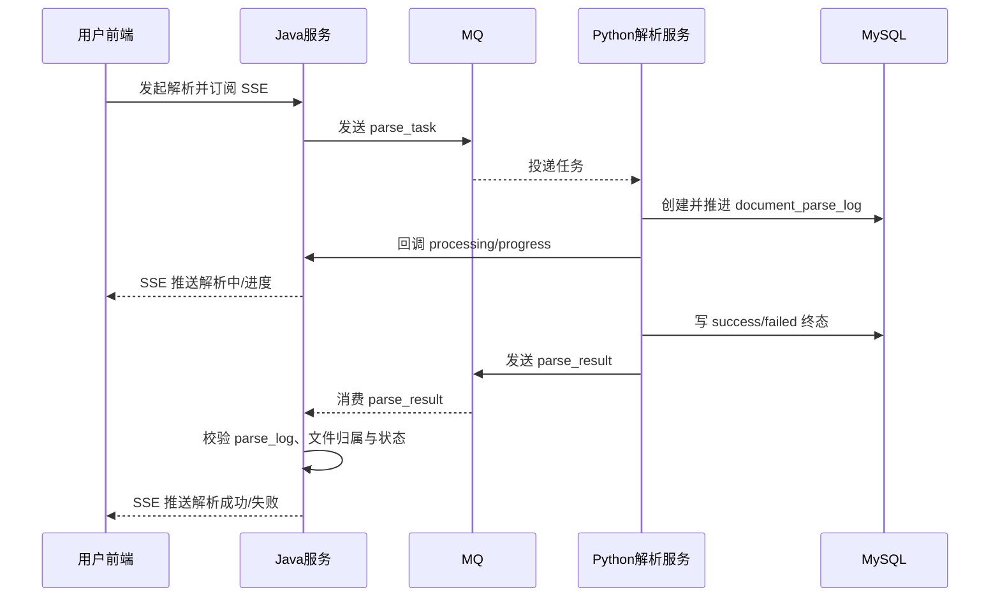
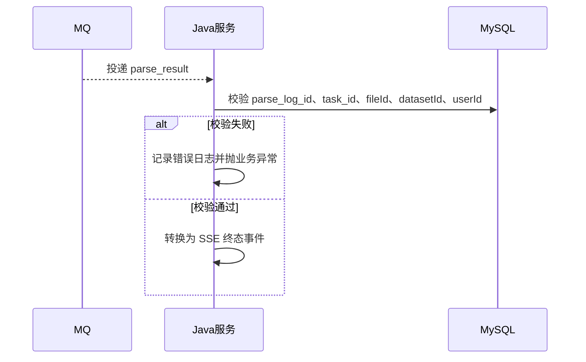

# ToLink Service 文件上传与解析重构三期技术实现文档

> **文档状态：** 技术方案待审核
> **项目名称**：ToLink Service
> **模块名称**：文件上传与解析重构（三期）
> **需求文档**：`docs/module-development-files/文件上传与解析重构/三期/requirement.md`
> **分支名称**：`refactor/update-file-upload-parse`
> **技术负责人：** Fang / Codex
> **最后更新时间：** 2026-04-30

---

## 1. 文档修订记录 (Change Log)

| 版本号 | 修改日期 | 修改内容简述 | 修改人 | 审核人 |
| :--- | :--- | :--- | :--- | :--- |
| v1.0 | 2026-04-30 | 初始化三期技术方案，明确 `parse_result` MQ 终态回传、SSE 转发和回调职责收缩 | Fang / Codex | 待审核 |

---

## 2. 技术目标与实现范围 (Overview)

### 2.1 技术目标与核心思路 (Technical Goals)

- **技术目标：** 在二期“Java 发 `parse_task`、Python 写库、HTTP 回调转发 SSE”的基础上，把 Python -> Java 的解析终态通知切换为 `tolink.rag.parse_result` MQ，并保持前端查询与 SSE 交互形态不变。
- **设计原则：**
  - `parse_task` 继续沿用二期扁平 JSON 任务消息，不重做提交流程。
  - `parse_result` 采用新的扁平 JSON 终态消息，不复用历史 envelope + payload 废案格式。
  - Python 继续负责写 `document_parse_log` 和 `document_parsed_file` 最终状态，Java 不写主业务表。
  - 内部 HTTP 回调入口收缩为只承接 `processing/progress`，终态 `success/failed` 改由 MQ 回传。
  - Java 收到结果 MQ 后只做消息校验、SSE 事件转发和日志记录，数据库仍是最终真相。
- **成功标准：**
  - Python 可以按新契约向 `tolink.rag.parse_result` 发送 `success/failed` 消息。
  - Java 能正确消费结果消息并向前端转发终态事件。
  - 内部回调接口拒绝新的终态事件，避免终态双主链路并存。
  - 现有结果查询接口仍按数据库终态工作，不依赖事件补写主表。

### 2.2 实现范围与边界 (In Scope / Out of Scope)

**必须实现：**

- `KnowledgeParseResultMQ` 重定义为三期扁平 JSON 终态结果消息。
- Kafka 结果消费者按新消息契约消费 `tolink.rag.parse_result`。
- Java 结果消费服务校验 `task_id`、`document_parse_log_id`、原文件归属信息后转发 SSE。
- `KnowledgeParseSseService` 增加终态结果转发能力。
- `InternalKnowledgeFileController` 的内部回调入口仅保留 `processing/progress`。
- 三期文档与四期遗留项边界对齐。

**暂不实现：**

- 不让 Java 在消费 `parse_result` 后回写 `document_parse_log` 或 `document_parsed_file`。
- 不处理 `parse_task` 更强发送确认、Outbox、本地消息表或 Kafka ack 等可靠投递增强。
- 不处理“`latest_parse_task_id` 已存在但长时间无 `document_parse_log`”的悬空任务失败化。
- 不解决多实例 Java 下的 SSE 跨节点广播。
- 不做删除语义升级、版本管理、日志治理和解析后下游衔接。

### 2.3 验收项到实现点映射 (Requirement Mapping)

| 需求验收项 | 技术实现点 | 测试方式 | 责任模块 |
| :--- | :--- | :--- | :--- |
| 终态结果回传 | `KnowledgeParseResultMQ` 扁平消息模型 + `KnowledgeParseResultKafkaReceiver` 消费 | 消息序列化测试、Kafka Receiver 单测 | `link-service` |
| 回调职责收缩 | `InternalKnowledgeFileController.parseEvent(...)` 仅接受 `processing/progress` | Controller 测试 | `link-api` |
| SSE 终态转发 | `KnowledgeParseResultServiceImpl` + `KnowledgeParseSseServiceImpl.publishResultEvent(...)` | Service 单测 | `link-service` |
| 数据真相不变 | Java 不写主业务表，只校验并转发 | Service 单测 | `link-service` |
| 旧废案替换 | 新 `parse_result` 不再使用 envelope + payload | 消息测试、文档校验 | `link-service` / 文档 |

---

## 3. 当前系统分析与复用基础 (Current-State Analysis)

### 3.1 相关模块盘点

| 模块 | 当前职责 | 现状说明 | 是否修改 |
| :--- | :--- | :--- | :--- |
| `link-api` | Controller / API 入口 | 已有 `KnowledgeFileController` 和 `InternalKnowledgeFileController`；内部回调入口当前同时接受进度与终态事件 | 是 |
| `link-service` | 业务服务 | 已有解析提交服务、SSE 推送服务、旧 `parse_result` 兼容消费服务 | 是 |
| `link-model` | Entity / DTO / Enum | 已有 `KnowledgeParseTask`（映射 `document_parse_log`）、SSE DTO、回调请求 DTO | 否 |
| `link-mapper` | Mapper / 持久化 | 已有 `KnowledgeParseTaskMapper`、`KnowledgeOriginalFileMapper` | 否 |
| `link-core` | 通用异常 / 工具 | 复用 `BusinessException` 和统一错误响应 | 否 |
| `link-components` | MQ 组件 | 已有 `AbstractMQ`、`MQSend`、Kafka / RabbitMQ 适配 | 否 |

### 3.2 已复用能力 (Reusable Components)

- **MQ 组件：** 继续复用 `AbstractMQ`、`MQSend` 与 `KafkaMQTopologyScanner` 的自动扫描注册能力，业务消息仍放在 `link-service/.../mq`。
- **SSE 推送：** 继续复用 `KnowledgeParseSseServiceImpl` 的单机内存 `SseEmitter` 管理模型。
- **内部服务鉴权：** 继续复用 `InternalKnowledgeFileController` 的 Bearer Token 鉴权。
- **统一异常与响应：** 继续复用 `BusinessException` 和 `Result<T>`。

### 3.3 已参考代码 (Code References)

| 文件/模块 | 参考点 | 对方案的影响 |
| :--- | :--- | :--- |
| [KnowledgeParseTaskServiceImpl.java](/Users/fang/Developer/Projects/toLink/toLink-Service/link-service/src/main/java/com/qingluo/link/service/impl/KnowledgeParseTaskServiceImpl.java:35) | 二期 `parse_task` 提交流程、`latest_parse_task_id` 事务边界 | 三期不重做任务提交流程 |
| [KnowledgeParseResultMQ.java](/Users/fang/Developer/Projects/toLink/toLink-Service/link-service/src/main/java/com/qingluo/link/service/mq/KnowledgeParseResultMQ.java:1) | 旧结果消息定义位置 | 三期沿用类位置，但重定义消息结构 |
| [KnowledgeParseResultKafkaReceiver.java](/Users/fang/Developer/Projects/toLink/toLink-Service/link-service/src/main/java/com/qingluo/link/service/mq/kafka/KnowledgeParseResultKafkaReceiver.java:1) | 结果 Kafka 消费入口 | 三期继续复用消费入口类 |
| [KnowledgeParseResultServiceImpl.java](/Users/fang/Developer/Projects/toLink/toLink-Service/link-service/src/main/java/com/qingluo/link/service/impl/KnowledgeParseResultServiceImpl.java:1) | 旧兼容消费服务 | 三期改成“校验 + SSE 转发” |
| [KnowledgeParseSseServiceImpl.java](/Users/fang/Developer/Projects/toLink/toLink-Service/link-service/src/main/java/com/qingluo/link/service/impl/KnowledgeParseSseServiceImpl.java:23) | 当前进度事件 SSE 转发逻辑 | 三期在同一服务内补终态结果转发 |
| [InternalKnowledgeFileController.java](/Users/fang/Developer/Projects/toLink/toLink-Service/link-api/src/main/java/com/qingluo/link/api/controller/InternalKnowledgeFileController.java:70) | Python 回调入口与 Token 校验 | 三期只保留进度事件 |
| [KnowledgeParseTask.java](/Users/fang/Developer/Projects/toLink/toLink-Service/link-model/src/main/java/com/qingluo/link/model/dto/entity/KnowledgeParseTask.java:11) | `document_parse_log` 实体映射 | 三期按 `document_parse_log_id` 对齐日志主键 |
| [kafka_component.md](/Users/fang/Developer/Projects/toLink/toLink-Service/docs/architecture/middleware-components/kafka_component.md:1) | MQ 组件接入方式 | 三期按业务层消息模型扩展，不改 framework |
| [middleware_contract.md](/Users/fang/Developer/Projects/toLink/toLink-Service/docs/architecture/middleware_contract.md:171) | 现有 MQ 契约和旧 `parse_result` 描述 | 三期需要回写 `parse_result` 新契约 |

### 3.4 现有问题与约束 (Constraints)

- 当前旧 `parse_result` 废案采用 envelope + payload 结构，和三期扁平 JSON 契约冲突。
- 当前内部回调入口允许 `success/failed`，如果不收缩职责，会与新 MQ 终态链路重叠。
- 当前 `KnowledgeParseResultConsumer` 默认关闭；三期需要把它转成正式主链路消费者。
- 当前 SSE 推送仍是单实例内存模型；多实例转发问题保持为四期限制。
- 当前 Java 对 `parse_task` 发送失败只按同步异常判定，不属于三期改造范围。

---

## 4. 核心架构与实现方案 (Architecture & Solution)

### 4.1 总体设计思路 (Architecture Overview)

三期在二期“四段式链路”的基础上，把“Python -> Java 终态事件”这一段从 HTTP 回调替换为 MQ：

```text
前端 -> Java：解析提交 / SSE 订阅 / 结果查询
Java -> MQ：parse_task 任务下发
Python -> Java：HTTP 回调 processing/progress
Python -> MQ -> Java：parse_result 终态回传
Java -> 前端：统一 SSE 事件转发
前端/Java -> DB：终态兜底查询
```

设计重点：

- 任务提交流程完全沿用二期，不改 `submitManualParse(...)` 的事务边界。
- 终态消息必须以 `document_parse_log_id + task_id` 共同定位同一次解析尝试。
- Java 不把终态消息作为主表写入依据，只做消息校验和事件转发。
- 三期不做“终态消息未送达时的自动补发”，仍由查库兜底。

### 4.2 目标调用链路 (Call Flow)

```text
前端触发解析
-> Java 生成 task_id 并发送 parse_task
-> Python 消费 parse_task，创建/推进 document_parse_log
-> Python 用 HTTP 回调上报 processing/progress
-> Java SSE 推送解析中与进度
-> Python 写 document_parse_log/document_parsed_file 终态
-> Python 发送 parse_result
-> Java 消费 parse_result，校验消息与归属
-> Java SSE 推送解析成功/解析失败
-> 前端必要时查库兜底
```

### 4.3 核心模块职责划分 (Module Responsibilities)

| 模块/类 | 职责 | 输入/输出边界 |
| :--- | :--- | :--- |
| `KnowledgeParseResultMQ` | 三期 `parse_result` 业务消息模型和校验 | `MsgPayload` / 扁平 JSON |
| `KnowledgeParseResultKafkaReceiver` | 监听 `tolink.rag.parse_result` 并把消息交给业务服务 | Kafka 字符串消息 / `MsgPayload` |
| `KnowledgeParseResultConsumer` | 暴露正式 MQReceiver Bean | `MsgPayload` / 业务服务调用 |
| `KnowledgeParseResultServiceImpl` | 校验 `document_parse_log`、原文件归属并委托 SSE 服务转发 | `MsgPayload` / 无持久化输出 |
| `KnowledgeParseSseServiceImpl` | 统一管理 `processing/progress` 与 `success/failed` 的 SSE 转发 | taskId 或 result payload / `FileParseEventDTO` |
| `InternalKnowledgeFileController` | 只承接进度回调 | HTTP 请求 / `Result<Void>` |

### 4.4 核心时序图 (Sequence Diagrams)

#### 场景 1：终态结果由 MQ 回传



#### 场景 2：终态消息校验失败



---

## 5. 接口契约与交互方案 (API Contract)

### 5.1 接口清单

| 方法 | 路径 | 说明 | 权限 |
| :--- | :--- | :--- | :--- |
| POST | `/api/v1/files/{fileId}/parse` | 手动触发解析 | 登录用户 |
| GET | `/api/v1/datasets/{datasetId}/files/parse-events` | SSE 订阅进度与终态 | 登录用户 |
| GET | `/api/v1/datasets/{datasetId}/files/parse-results` | 查询当前解析结果 | 登录用户 |
| POST | `/api/v1/internal/parse-tasks/{taskId}/events` | Python 上报 `processing/progress` | 内部服务 Token |

### 5.2 请求参数

| 参数 | 位置 | 类型 | 必填 | 说明 |
| :--- | :--- | :--- | :--- | :--- |
| `taskId` | path | String | 是 | 解析任务业务 ID |
| `eventType` | body | String | 是 | 只允许 `processing` / `progress` |
| `progress` | body | Integer | 否 | `progress` 事件必填，取值 `0-100` |
| `failureReason` | body | String | 否 | 三期进度回调默认不使用 |

### 5.3 响应结构

#### `POST /api/v1/files/{fileId}/parse`

成功响应：

```json
{
  "code": 200,
  "message": "success",
  "data": {
    "fileId": 10001,
    "originalFilename": "report.pdf",
    "frontendStatus": "parsing"
  }
}
```

字段说明：

- `fileId`：原文件 ID
- `originalFilename`：原始文件名
- `frontendStatus`：提交成功后固定为 `parsing`

#### `GET /api/v1/datasets/{datasetId}/files/parse-results`

成功响应：

```json
{
  "code": 200,
  "message": "success",
  "data": [
    {
      "fileId": 10001,
      "originalFilename": "report.pdf",
      "parsedFilename": "report.md",
      "frontendStatus": "parse_success",
      "parseStatus": "success",
      "failureReason": null
    },
    {
      "fileId": 10002,
      "originalFilename": "broken.pdf",
      "parsedFilename": "broken.md",
      "frontendStatus": "parse_failed",
      "parseStatus": "failed",
      "failureReason": "PARSE_TIMEOUT"
    }
  ]
}
```

字段说明：

- `fileId`：原文件 ID
- `originalFilename`：原始文件名
- `parsedFilename`：预期 Markdown 文件名
- `frontendStatus`：前端展示状态，三期继续使用 `parse_waiting / parsing / parse_success / parse_failed`
- `parseStatus`：后端任务状态，可能为 `created / processing / success / failed`，未提交解析时可为空
- `failureReason`：失败原因，成功或未失败时为空

前端判断口径：

- 以 `frontendStatus` 作为主要展示判断字段
- 以 `parseStatus` 作为辅助调试和状态细分字段
- 不返回 bucket、object key、内部 URL、服务 token 等内部字段

#### `GET /api/v1/datasets/{datasetId}/files/parse-events`

SSE 建连成功事件：

```json
event: connected
data: "ok"
```

SSE 解析事件：

```json
event: parse
data: {
  "fileId": 10001,
  "originalFilename": "report.pdf",
  "frontendStatus": "parsing",
  "progress": 80,
  "parseStatus": "processing",
  "failureReason": null
}
```

终态 SSE 事件示例：

```json
event: parse
data: {
  "fileId": 10001,
  "originalFilename": "report.pdf",
  "frontendStatus": "parse_success",
  "progress": null,
  "parseStatus": "success",
  "failureReason": null
}
```

```json
event: parse
data: {
  "fileId": 10002,
  "originalFilename": "broken.pdf",
  "frontendStatus": "parse_failed",
  "progress": null,
  "parseStatus": "failed",
  "failureReason": "PARSE_TIMEOUT"
}
```

字段说明：

- `progress`：仅进度事件有效，终态事件通常为空
- `parseStatus`：`processing / success / failed`
- `frontendStatus`：前端直接消费的展示状态

#### `POST /api/v1/internal/parse-tasks/{taskId}/events`

成功响应：

```json
{
  "code": 200,
  "message": "success",
  "data": null
}
```

失败响应示例：

```json
{
  "code": 400,
  "message": "解析回调事件类型仅支持 processing 或 progress",
  "data": null
}
```

### 5.4 异常响应

| 场景 | HTTP 状态 | 业务错误码 | message |
| :--- | :--- | :--- | :--- |
| Bearer Token 无效 | 401 | `401` | `服务鉴权失败` |
| 回调事件类型不是 `processing/progress` | 400 | `400` | `解析回调事件类型仅支持 processing 或 progress` |
| `progress` 超出 `0-100` | 400 | `400` | `解析进度必须在 0 到 100 之间` |
| `progress` 事件未带进度值 | 400 | `400` | `progress 事件必须携带解析进度` |
| 结果消息找不到对应解析日志 | 消费侧业务异常 | `404` | `解析任务不存在` |
| 结果消息归属校验失败 | 消费侧业务异常 | `400` | `解析结果消息归属信息不匹配` |

### 5.5 异常类与错误码定义

#### 异常类设计

| 异常类 | 继承关系 | 使用场景 | 说明 |
| :--- | :--- | :--- | :--- |
| `BusinessException` | 现有统一异常基类 | 结果消息校验失败、回调参数不合法 | 复用现有异常体系，不新增异常类 |

#### 错误码定义

| 错误码 | 枚举名/常量名 | HTTP 状态 | 触发场景 | 前端提示策略 |
| :--- | :--- | :--- | :--- | :--- |
| `400` | 现有统一数值码 | 400 | 消息字段不合法、归属不匹配 | 不直接面向前端，一般写日志并由消费方处理 |
| `404` | 现有统一数值码 | 404 | 找不到 `document_parse_log` 或原文件 | 不直接面向前端，一般写日志并由消费方处理 |

### 5.6 兼容性说明

- **是否兼容旧接口：** 前端接口兼容；内部回调接口路径兼容，但事件类型收缩。
- **是否需要过渡期：** 需要。Python 端必须先切成“终态走 MQ、进度走回调”后再完全废弃终态回调。
- **前端影响点：** 无新增前端接口，前端仍按现有 SSE 与结果查询模型工作。

---

## 6. 数据契约与存储设计 (Data & Storage)

### 6.1 数据模型与实体关系 (E-R)

- `document_original_file` 1:1 `document_parsed_file`
- `document_original_file` 1:N `document_parse_log`
- `parse_result.task_id` 对应 `document_parse_log.task_id`
- `parse_result.document_parse_log_id` 对应 `document_parse_log.id`

### 6.2 数据库组件与结构变更 (Database & Schema Changes)

#### MySQL 变更

| 表名 | 变更类型 | 变更说明 | 备注 |
| :--- | :--- | :--- | :--- |
| 无 | 无 | 三期不改 MySQL 表结构 | 继续沿用二期表结构 |

### 6.3 字段设计

#### `parse_result` 消息体示例

```json
{
  "task_id": "9f6b7d7e-4e7b-4a3f-9f4d-8d2a1b6c7e90",
  "original_file_id": 10001,
  "document_parse_log_id": 10002,
  "dataset_id": 10003,
  "user_id": 10002,
  "task_status": "success",
  "failure_reason": null,
  "parse_finished_at": "2026-04-28T10:00:08+08:00"
}
```

#### `parse_result` 消息字段

| 字段 | 类型 | 是否必填 | 默认值 | 说明 |
| :--- | :--- | :--- | :--- | :--- |
| `task_id` | String | 是 | 无 | 业务任务 ID，对应 `document_parse_log.task_id` |
| `original_file_id` | Long | 是 | 无 | 原文件主键 |
| `document_parse_log_id` | Long | 是 | 无 | 解析日志主键 |
| `dataset_id` | Long | 是 | 无 | 数据集主键 |
| `user_id` | Long | 是 | 无 | 用户主键 |
| `task_status` | String | 是 | 无 | 只允许 `success` / `failed` |
| `failure_reason` | String | 条件必填 | `null` | `failed` 时必填，`success` 时必须为 `null` |
| `parse_finished_at` | String | 是 | 无 | 必须为带时区的 ISO 8601 时间字符串 |

### 6.4 索引与约束

- 三期不新增数据库索引。
- `document_parse_log.id` 和 `task_id` 继续作为结果消息的双定位依据。
- `task_status` 仅允许 `success` / `failed` 进入 `parse_result` 链路。

### 6.5 中间件与其他存储设计

| 组件 | 存储内容 | Key/Path 规则 | 备注 |
| :--- | :--- | :--- | :--- |
| Kafka | 解析终态结果消息 | Topic：`tolink.rag.parse_result` | 分区 `1`，副本 `1` |
| Kafka 消费组 | Java 结果消费者 | `tolink-document-prase` | 暂按需求约定保持此拼写 |
| Redis | 无新增 | 无 | 三期不改 Redis |
| OSS / MinIO | 无新增 | 无 | 三期不改对象存储规则 |

### 6.6 数据迁移与回滚

- **是否需要迁移：** 不需要库表迁移。
- **迁移策略：** 代码与 Python 协议切换。
- **回滚策略：** 若三期链路回滚，需同步恢复 Python 终态回调逻辑与 Java 回调接受终态事件的能力。

---

## 7. 核心实现逻辑 (Core Implementation)

### 7.1 Service / Component 设计

```java
public interface KnowledgeParseResultService {
    void handleParseResult(KnowledgeParseResultMQ.MsgPayload payload);
}
```

扩展点：

- `KnowledgeParseSseService` 增加 `publishResultEvent(...)`
- `KnowledgeParseResultConsumer` 作为正式 MQReceiver Bean 暴露

### 7.2 核心方法职责

| 方法 | 职责 | 输入 | 输出 |
| :--- | :--- | :--- | :--- |
| `KnowledgeParseResultMQ.parseMsg` | 解析并校验扁平 JSON 结果消息 | Kafka 原始消息字符串 | `MsgPayload` |
| `KnowledgeParseResultServiceImpl.handleParseResult` | 校验结果消息与数据库归属，并委托 SSE 服务推送终态 | `MsgPayload` | 无 |
| `KnowledgeParseSseServiceImpl.publishResultEvent` | 将终态结果转换为 `FileParseEventDTO` 并按文件推送 | `MsgPayload` | 无 |
| `InternalKnowledgeFileController.parseEvent` | 校验进度回调事件类型并转发 | `taskId` + `KnowledgeParseCallbackRequest` | `Result<Void>` |

### 7.3 关键处理流程

1. `KnowledgeParseResultKafkaReceiver` 监听 `tolink.rag.parse_result`。
2. `KnowledgeParseResultMQ.parseMsg(...)` 将原始 JSON 转成 `MsgPayload` 并执行字段级校验。
3. `KnowledgeParseResultServiceImpl` 先按 `document_parse_log_id` 查询 `document_parse_log`。
4. 校验 `task_id` 与 `document_parse_log.task_id` 一致。
5. 再按 `original_file_id` 查询 `document_original_file`。
6. 校验 `dataset_id`、`user_id`、`original_file_id` 与日志和原文件归属一致。
7. 调用 `KnowledgeParseSseService.publishResultEvent(...)` 组装 `FileParseEventDTO` 并按文件维度推送给前端。
8. 内部回调 `parseEvent(...)` 拒绝 `success/failed`，只保留 `processing/progress`。

### 7.4 并发、幂等与一致性

- **并发控制：** 三期不新增锁；终态消息处理仍按 Kafka 单消费者组顺序消费。
- **幂等策略：** 消息定位依赖 `document_parse_log_id + task_id`；当前转发链路允许同一终态重复到达但不应产生数据库副作用。
- **事务边界：** 结果消费不包数据库写事务，因为 Java 不写主业务表；只做查询、校验和事件转发。

### 7.5 状态流转与职责边界

- `created/processing`：由 Python 执行阶段推进，Java 通过回调转发。
- `success/failed`：由 Python 先写数据库，再通过 `parse_result` MQ 通知 Java。
- Java 不负责创建、推进、终结 `document_parse_log` 状态，只负责通知前端。

---

## 8. 组件与集成设计 (Components & Integration)

### 8.1 MQ 集成设计

- 继续复用 `AbstractMQ` 与业务层消息模型接入方式。
- `KnowledgeParseResultMQ` 作为业务消息模型放在 `link-service/.../mq/`。
- Kafka 消费入口继续沿用 `link-service/.../mq/kafka/KnowledgeParseResultKafkaReceiver`。
- 三期不改 MQ framework，不引入新的 vendor 层抽象。

### 8.2 SSE 集成设计

- `KnowledgeParseSseServiceImpl` 保持单机内存连接表模型。
- 进度事件和终态事件仍复用同一个 `parse` SSE event name。
- `FileParseEventDTO` 继续沿用现有字段：
  - `fileId`
  - `originalFilename`
  - `frontendStatus`
  - `progress`
  - `parseStatus`
  - `failureReason`

### 8.3 Python 集成设计

- Python 继续消费 `parse_task`。
- Python 继续通过 HTTP 回调上报 `processing/progress`。
- Python 在写库终态后发送 `parse_result`。
- Python 发送 `parse_result` 时不得再沿用旧 envelope + payload 废案。

---

## 9. 权限、安全与审计 (Security & Audit)

- 内部回调继续使用 `Authorization: Bearer {service_token}`。
- `parse_result` 消息体不得携带对象存储密钥、服务 Token 或其他敏感凭据。
- 结果消息消费日志必须带 `task_id`、`document_parse_log_id`、`original_file_id` 方便排障。
- 三期不引入新的用户态接口，因此不新增 RBAC 规则。

---

## 10. 异常处理与降级策略 (Exceptions & Fallback)

- **结果消息缺字段：** 在 `KnowledgeParseResultMQ.validate(...)` 中直接拒绝。
- **找不到解析日志或原文件：** `KnowledgeParseResultServiceImpl` 抛 `BusinessException`，由消费侧记录异常。
- **归属校验不匹配：** 视为结果消息非法，不向前端转发。
- **SSE 无订阅连接：** 结果事件可直接丢弃，前端后续通过查库兜底。
- **终态消息未送达：** 三期不做自动补偿，由数据库查询兜底。

---

## 11. 测试方案 (Test Plan)

### 11.1 单元测试

- `KnowledgeParseResultMQTest`
  - 校验扁平 JSON 序列化
  - 校验 `document_parse_log_id` 必填
  - 校验 `task_status` 只允许 `success/failed`
  - 校验 `failure_reason` 与 `task_status` 组合规则
- `KnowledgeParseResultKafkaReceiverTest`
  - 校验新扁平 JSON 能被正确解析并分发
- `KnowledgeParseResultServiceImplTest`
  - 校验成功终态可通过归属校验
  - 校验失败终态可通过归属校验
  - 校验 `task_id` / `document_parse_log_id` / 文件归属不匹配时抛异常

### 11.2 Controller / 集成测试

- `KnowledgeParseResultIntegrationTest`
  - 更新为验证三期结果消费者默认启用
- `InternalKnowledgeFileController` 相关测试
  - `processing` 回调通过
  - `progress` 回调通过且必须有进度
  - `success/failed` 回调被拒绝

### 11.3 人工联调验证

- Java 触发 `parse_task` 后，Python 成功发送 `parse_result`，前端收到 `parse_success`
- Java 触发 `parse_task` 后，Python 失败发送 `parse_result`，前端收到 `parse_failed`
- 停掉终态 MQ 回传后，前端仍能通过结果查询接口查到数据库终态

---

## 12. 发布方案 (Release Plan)

- 先完成 Java 侧三期代码与测试。
- 与 Python 端同步新 `parse_result` 契约。
- 联调阶段允许短期保留终态回调能力，但生产切换前必须完成职责收缩。
- 完成中间件契约文档回写后再进入正式发布。

---

## 13. 已知限制与后续期次 (Known Limits)

- `parse_task` 发送失败目前只按同步异常判定，四期再评估更强投递确认。
- `latest_parse_task_id` 已提交但长时间无 `document_parse_log` 的悬空任务，四期再做失败化治理。
- 多实例 Java 场景的 SSE 跨节点广播，四期再设计。
- 删除语义、版本管理、日志治理和下游知识处理仍留在四期。
