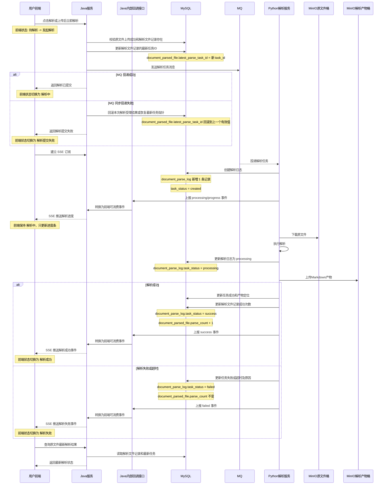

# ToLink Service 文件解析 MQ 投递与解析日志重构二期 PRD

> **文档状态：** 需求待审核
> **项目名称：** ToLink Service
> **模块名称：** 文件解析 MQ 投递与解析日志重构（二期）
> **分支名称：** dev
> **产品负责人：** Fang / Codex
> **最后更新时间：** 2026-04-29

---

## 1. 文档修订记录 (Change Log)

| 版本号 | 修改日期 | 修改内容简述 | 提出人 | 审核人 |
| :--- | :--- | :--- | :--- | :--- |
| v1.0 | 2026-04-29 | 初始化二期 PRD，明确解析触发、MQ 投递、Python 创建任务日志和结果维护职责 | Fang / Codex | 待审核 |
| v1.1 | 2026-04-29 | 按评审意见确认解析日志表改名为 `document_parse_log`，并锁定 Java/Python 职责边界与 MQ 失败口径 | Fang / Codex | 待审核 |

---

## 2. 需求背景与业务目标 (Overview)

### 2.1 业务概览与核心逻辑 (Business Overview)

- **业务定位：** 二期在一期上传成功即初始化解析文件记录的基础上，重构解析触发和异步执行链路。
- **核心逻辑主线：** 用户点击解析或上传时选择立即解析后，Java 端校验原文件和解析文件记录，生成本次解析任务 ID，更新解析文件记录的最新任务 ID，并发送 MQ。Python 端消费 MQ 后创建解析日志，读取原文件，执行解析，保存 Markdown 产物，并维护解析结果。
- **模块协作主线：** Java 与 Python 之间采用“MQ 下发任务 + 内部回调上报事件 + 数据库终态兜底”的协作方式。Java 负责提交解析请求并向 Python 下发任务；Python 负责执行解析并通过统一内部回调接口向 Java 上报进度事件和最终结果事件；若事件通知链路中断，最终以数据库中的解析日志和解析结果为准。
- **核心价值：** Java 端专注解析请求提交，Python 端专注解析任务执行和解析日志，三张表的职责边界更清楚，失败、重试和超时可以围绕解析日志收敛。

### 2.2 核心节点目标与验收准则 (Key Milestones)

| 核心功能节点 | 预期达成目标 | 关键验收点 (DoD) |
| :--- | :--- | :--- |
| 解析触发 | 上传成功原文件可以被用户手动解析或上传后立即解析 | Java 端生成任务 ID，更新解析文件记录，并发送解析 MQ |
| MQ 消息归属 | MQ 能完整表达本次解析任务和业务归属 | 消息包含任务 ID、原文件 ID、解析文件 ID、用户 ID、数据集 ID 和对象定位 |
| 模块交互统一 | Java 与 Python 的实时交互方式保持统一 | 进度事件与结果事件都通过同一个内部回调入口上报给 Java |
| Python 创建解析日志 | `document_parse_log` 由 Python 消费 MQ 后创建 | 每次解析尝试有独立解析日志，重复消息通过任务 ID 幂等处理 |
| 重新解析 | 重新解析不创建新的解析文件记录 | 复用同一条 `document_parsed_file`，新增新的 `document_parse_log` |
| 失败与超时 | 失败和超时进入解析日志，不增加成功解析次数 | 解析文件记录指向最新任务，前端可以看到最新失败或超时状态 |
| MQ 投递失败即时失败化 | Java 端同步投递失败时立即向前端返回失败 | 本次解析不创建解析日志，用户重新点击后生成新的 `task_id` 再次投递 |
| 结果兜底 | 事件通知异常时仍能拿到最终结果 | Java 和前端通过结果查询接口读取数据库终态，避免因事件丢失导致页面长期停留在处理中 |

---

## 3. 核心架构与业务流程 (Architecture & Flow)

### 3.1 核心业务时序图 (Sequence Diagrams)



### 3.2 状态机定义 (State Machine)

| 业务对象 | 当前状态 | 触发动作/条件 | 流转后状态 | 备注 |
| :--- | :--- | :--- | :--- | :--- |
| 解析文件 | 未解析或已有终态 | 用户触发解析 | 等待解析 | Java 写入最新任务 ID 并发送 MQ |
| 解析文件 | 等待解析 | Python 创建解析日志 | 解析中 | 可由最新任务状态推导展示 |
| 解析文件 | 解析中 | Python 解析成功 | 解析成功 | 成功解析次数增加 |
| 解析文件 | 解析中 | Python 解析失败或超时 | 解析失败或超时 | 成功解析次数不变 |
| 解析日志 | 待创建 | Python 消费 MQ | 已创建 | 使用任务 ID 做幂等 |
| 解析日志 | 已创建 | Python 开始解析 | 解析中 | 记录开始时间 |
| 解析日志 | 解析中 | 解析产物保存成功 | 成功 | 写入本次产物定位 |
| 解析日志 | 已创建或解析中 | 下载、解析、上传或写库失败 | 失败 | 写入业务化失败原因 |
| 解析日志 | 已创建或解析中 | 超过约定处理时长 | 超时 | 写入超时原因 |

---

## 4. 功能规格与交互逻辑 (Functional Specs)

### 4.1 页面交互与功能示意 (UI & Functionality)

- **只上传模式：** 用户上传文件但不开启自动解析时，上传成功后前端展示“待解析”，后续由用户手动点击解析。
- **上传并立即解析模式：** 用户上传文件并开启自动解析时，上传成功后前端不需要单独停留在“上传成功”，而是直接进入“解析中”。
- **手动解析：** 用户可对上传成功的原文件点击解析，适用场景包括未解析、解析失败、需要重新解析。
- **重复点击限制：** 同一原文件存在等待解析或解析中的任务时，前端不得允许再次点击解析；后端也必须拒绝重复投递。
- **解析进度条：** 解析进行中，前端展示当前文件的百分比进度；若是多文件场景，当前文件完成后再切换展示下一个文件。
- **解析结果汇总：** 所有文件解析流程结束后，前端查询并展示本批文件解析结果；成功文件展示解析结果摘要，失败文件展示业务化失败原因。
- **失败重试：** 解析失败或超时后，用户应能重新触发解析；再次解析生成新的 `task_id`，不复用上一次任务。
- **解析产物访问：** 本期前端不提供解析产物下载和预览能力，只展示解析状态与结果摘要。

### 4.1.1 前端统一展示状态

| 前端状态 | 展示含义 | 适用场景 |
| :--- | :--- | :--- |
| 待解析 | 原文件上传成功，但未自动提交解析 | 只上传模式 |
| 解析中 | Java 已成功受理解析请求并完成 MQ 投递，直到收到最终成功或失败事件前，前端统一展示为解析中 | 手动解析、上传并立即解析 |
| 解析成功 | 当前文件解析完成且成功 | 手动解析、上传并立即解析 |
| 解析失败 | 当前文件解析失败或超时，可再次点击解析 | 手动解析、上传并立即解析 |
| 解析提交失败 | Java 向 MQ 同步投递失败，本次解析未成功受理 | 手动解析、上传并立即解析 |

状态流转说明：

```text
只上传模式：
待解析 -> 解析中 -> 解析成功 / 解析失败

上传并立即解析模式：
解析中 -> 解析成功 / 解析失败

同步投递失败：
触发解析 -> 解析提交失败
```

说明：

- 前端不需要感知“Java 已写任务指针但 Python 尚未创建解析日志”等中间细节；Java 成功受理并发出 MQ 后，统一展示为 `解析中`。
- `解析提交失败` 与 `解析失败` 是两类不同口径：前者发生在 Java 向 MQ 同步投递阶段，后者发生在 Python 已收到任务之后。
- 进度百分比属于运行期展示数据，不要求在数据库中持久化。

### 4.2 接口契约规范

| 维度 | 要求与标准 | 备注 |
| :--- | :--- | :--- |
| 前端交互 | 前端以原文件为主维度触发解析和查看结果 | 不直接暴露表结构细节 |
| MQ 消息 | MQ 必须携带 `task_id`、`original_file_id`、`parsed_file_id`、`user_id`、`dataset_id` | Python 不再根据原文件反查解析文件 ID |
| 对象定位 | MQ 必须携带原文件对象定位和目标 Markdown 对象定位 | Python 按消息执行下载和上传 |
| 进度通知 | Python 在解析过程中通过内部回调接口把当前百分比进度上报给 Java，Java 通过 SSE 向前端推送进度 | 本期不引入 Redis；进度仅做运行期展示 |
| 结果通知 | Python 解析完成后需要通知 Java 最终结果，并可供前端查询最新状态 | 回调接口或既有约定方式在技术设计中定稿 |
| 解析日志 | 解析日志由 Python 创建和维护 | Java 不直接创建 `document_parse_log` |
| 错误提示 | 失败、超时、投递失败需要能回到前端可理解状态 | MQ 同步投递失败时直接返回失败，不保留“等待补偿”的中间态 |

### 4.2.1 解析进度实现方式

- **前端订阅方式：** 前端在文件列表维度订阅解析进度 SSE 流，由 Java 按文件推送当前解析事件。
- **Python 上报方式：** Python 在解析开始、进度推进、成功、失败等关键节点，通过内部服务接口把事件上报给 Java。
- **进度上报频率：** `progress` 事件按每 `1` 秒上报一次；`processing`、`success`、`failed` 属于关键状态事件，必须单独上报，不受该频率限制。
- **Java 推送方式：** Java 在内存中维护当前实例的 SSE 连接，并把 Python 上报的事件转换成前端可消费的文件级进度事件。
- **事件内容：** 至少包含 `task_id`、`file_id`、事件类型、当前百分比进度、当前展示状态、失败原因。
- **持久化边界：** 百分比进度不要求落库；数据库只保存最终可查询的解析日志和解析结果。
- **连接失效兜底：** 浏览器断开 SSE 或推送失败时，不要求补发历史进度；前端可降级为“解析中”，最终通过结果查询接口获取终态。
- **部署边界：** 本期解析进度推送按单机内存 SSE 方案实现，不解决多实例之间的进度广播一致性；如后续需要多实例一致推送，再单独引入 Redis 或其他消息广播机制。

### 4.2.2 MQ 消息体定义

本期 `parse_task` MQ 消息体采用“单次解析任务对象”口径，必须完整表达“谁发起了哪一个文件的哪一次解析，以及 Python 解析执行所需的最小上下文”。

| 字段 | 含义 | 作用 |
| :--- | :--- | :--- |
| `task_id` | 本次解析任务业务唯一标识 | 作为跨 Java、MQ、Python、数据库和前端链路的统一追踪 ID，也作为 Python 幂等键 |
| `original_file_id` | 原文件 ID | 让 Python 明确本次解析对应哪一个上传成功的原文件 |
| `parsed_file_id` | 解析文件记录 ID | 让 Python 直接定位并更新对应的 `document_parsed_file` 聚合记录 |
| `user_id` | 用户 ID | 作为归属、追踪和排障字段 |
| `dataset_id` | 数据集 ID | 作为归属、追踪和排障字段 |
| `file_type` | 原文件类型或后缀 | 供 Python 选择解析器或做基础校验 |
| `source_bucket` | 原文件所在桶 | 供 Python 获取原文件对象 |
| `source_object_key` | 原文件对象 key | 供 Python 精确读取原文件 |
| `source_filename` | 原始文件名 | 供日志、产物命名或解析侧展示使用 |
| `md_bucket` | 目标 Markdown 产物桶 | 供 Python 写入解析产物 |
| `md_object_key` | 目标 Markdown 产物对象 key | 供 Python 将本次解析结果写入预期位置 |

消息体约束说明：

- **最小必需原则：** MQ 消息体只放 Python 执行解析所必需的业务上下文，不依赖 Python 再回查 Java 才能启动解析。
- **幂等原则：** `task_id` 是整条链路的唯一业务键；同一个 `task_id` 的重复消息不能导致重复创建解析日志或重复累计成功次数。
- **执行自足原则：** 消息体必须同时具备原文件定位和目标产物定位，Python 收到消息后即可直接进入下载、解析、上传主流程。
- **安全边界：** 消息体中不得放 MinIO 密钥、服务 Token、临时签名 URL 或其他敏感凭据。
- **稳定性要求：** 本期确定的消息字段属于跨模块契约，Java 和 Python 都应以此为基线对齐；后续如要增删字段，必须同步更新公共契约文档和技术设计。

### 4.2.3 Java 与 Python 模块交互方式

- **任务下发方向：** Java 通过 `parse_task` MQ 向 Python 下发解析任务，这是两端之间唯一的任务提交入口。
- **事件回传方向：** Python 不通过 SSE 直接通知 Java；Python 通过 Java 提供的内部回调接口，把 `processing/progress/success/failed` 事件上报给 Java。
- **事件通道统一：** 解析进度与解析结果使用同一个内部回调入口，只通过 `eventType` 区分事件类型，不拆成两套交互协议。
- **事件频率控制：** Python 不应高频逐步回调每一个细粒度进度变化；`progress` 事件以每 `1` 秒一次作为标准上报频率。
- **数据真相归属：** Python 在发送 `success/failed` 最终事件前，必须先写数据库终态；Java 接收到最终事件后只负责前端通知，不以回调事件替代数据库真相。
- **前端感知方式：** Java 接到 Python 事件后，统一通过 SSE 转发给前端；前端不直接调用 Python，也不直接消费 MQ。
- **异常兜底方式：** 若最终事件回调失败、SSE 连接中断或 Java 实例短暂不可用，前端和 Java 都通过结果查询接口读取数据库终态，不依赖事件补发。
- **补偿触发原则：** Java 不以高频轮询数据库作为主链路。查数据库的时机，不是收到成功后查，而是前端长时间停留在 `解析中` 且没收到终态时查；前端断线、刷新、重连时也查。

### 4.2.4 结果查库兜底时机

- **收到终态事件时不查库：** Python 已先写数据库，再通过内部回调上报 `success/failed` 事件；Java 正常收到终态事件后，直接向前端推送，不要求为了这次成功或失败再额外查库。
- **未收到终态且超时后查库：** 若任务长时间停留在 `解析中`，且超过该状态的预期停留时间，Java 或前端应通过结果查询接口读取数据库终态，确认任务是否已经完成。
- **前端连接重建时查库：** 浏览器 SSE 断线重连、页面刷新、重新进入文件列表或结果页时，前端应主动查询数据库终态，恢复当前文件的最新解析状态。
- **事件链路异常时查库：** 若 Python 已写库但最终回调未送达、Java 实例短暂不可用、SSE 推送失败或事件处理异常，系统应以数据库中的解析日志和解析结果作为最终真相。
- **禁止高频轮询：** 本期不采用 Java 后台持续高频轮询数据库判断任务完成；数据库查询只在上述明确触发场景下作为兜底动作发生。

### 4.3 核心业务逻辑

#### 模块 A：解析触发与 MQ 投递

- **业务逻辑概述：** Java 端负责校验解析前置条件、生成任务 ID、更新解析文件记录并发送 MQ。
- **核心处理规则：** 只有上传成功且存在解析文件记录的原文件才能触发解析；同一原文件存在解析中任务时不得再次投递；重新解析复用同一解析文件记录。
- **数据持久化规格：** Java 只更新解析文件记录的最新任务 ID，不创建解析日志。
- **并发与一致性：** `task_id` 是跨系统幂等主键；每次用户重新点击解析都必须生成新的 `task_id`；正在解析的原文件不得并发提交第二次解析。
- **异常流与降级：** 二期采用“先更新数据库、再同步发送 MQ、发送失败则回滚数据库事务”的编排方式。MQ 同步投递失败时，Java 端直接返回失败给前端，不进入定时补偿或后台重投等待，也不允许数据库留下本次失败投递的最新任务指针。

#### 模块 B：Python 解析日志创建与解析执行

- **业务逻辑概述：** Python 消费 MQ 后创建 `document_parse_log`，并执行下载、解析、上传和结果回写。
- **核心处理规则：** 每次解析尝试新增一条解析日志；重复 MQ 消息不能重复创建日志或重复增加成功次数。
- **数据持久化规格：** 解析日志保存本次解析状态、失败原因、解析耗时和本次产物定位。
- **并发与一致性：** Python 以任务 ID 做幂等插入；解析文件 ID 直接来自 MQ。
- **异常流与降级：** 原文件下载失败、解析失败、Markdown 上传失败、结果写库失败均进入解析日志失败或超时口径。

#### 模块 C：解析结果查询与重新解析

- **业务逻辑概述：** 前端主要按原文件查看最新解析结果；重新解析新增解析日志并覆盖最新任务入口。
- **核心处理规则：** 成功解析次数只在解析成功后增加；失败和超时不增加成功次数。
- **数据持久化规格：** 解析文件记录保留最新任务 ID 和成功次数；历史明细从解析日志查询。
- **并发与一致性：** 重新解析时不得创建新的解析文件记录；批量文件结果以本次文件列表为单位，由前端根据每个文件是否到达终态判断是否整体结束。
- **异常流与降级：** 最新任务失败或超时时，前端展示失败原因并允许重新解析；若进度通知异常，前端可降级展示“解析中”，最终仍通过结果查询闭环。

---

## 5. 数据契约与存储约束 (Data & Storage)

### 5.1 数据模型与实体关系 (E-R)

```text
原文件 1 - 1 解析文件
原文件 1 - N 解析日志
解析文件 1 - N 解析日志
```

### 5.2 数据库组件与表结构变更 (Database & Schema Changes)

**涉及存储组件清单：**

- [x] MySQL：解析文件记录和解析日志
- [ ] Redis：本期不默认引入
- [x] Kafka / RabbitMQ：解析任务投递
- [ ] Qdrant：本期不涉及
- [x] MinIO：原文件读取和解析产物保存

**MySQL 变更**

| 表名 | 变更类型 | 核心说明 | 备注要求 |
| :--- | :--- | :--- | :--- |
| `document_parsed_file` | 调整使用方式 | Java 更新最新任务 ID，Python 成功后更新成功解析次数 | 不因重新解析而新增记录 |
| `document_parse_log` | 新表/替代表 | 废除原 `document_parse_task` 表，由 Python 创建和维护，记录每次解析尝试 | 通过任务 ID 幂等 |
| `document_original_file` | 读取 | 作为解析前置条件和原文件对象定位来源 | 二期不改变上传事实职责 |

**MQ 变更**

| 消息 | 变更类型 | 核心说明 | 备注要求 |
| :--- | :--- | :--- | :--- |
| 解析任务消息 | 调整字段 | 增加解析文件 ID，并保留原文件对象定位和目标 Markdown 对象定位 | Python 直接使用 `parsed_file_id` 写解析日志 |

### 5.3 缓存与持久化策略

- 本期不默认使用 Redis 保存解析进度。
- 最新解析状态优先由解析文件记录和最新解析日志共同表达。
- 解析日志保留历史，便于失败排查和重新解析分析。
- 只有解析成功才更新最新成功结果；解析失败、超时或写库失败不得覆盖已有最新成功结果。
- 前端批量结果汇总以结果查询接口返回为准，不要求为本期额外引入批次表。

---

## 6. 异常处理与非功能性需求 (Exceptions & NFR)

### 6.1 稳定性与降级策略 (Reliability & Fallback)

- MQ 投递失败应即时向前端返回失败，用户可以重新触发解析。
- Python 消费失败或解析日志创建失败需要可观测，避免解析文件记录长期停留在等待状态。
- MinIO 下载和上传超时需要进入任务失败或超时状态。
- 解析失败不影响原文件上传成功事实，也不创建新的解析文件记录。
- 进度通知失败时，前端可降级展示“解析中”，最终仍以解析结果查询为准。
- SSE 推送连接只保障当前 Java 实例内的在线连接，连接断开后不补发历史进度事件。

### 6.2 性能与扩展性要求 (Performance & Scalability)

- 解析执行必须异步，不阻塞上传主链路。
- 解析日志会持续增长，后续管理查询需要分页和必要索引支撑。
- 不引入 Outbox 作为本期默认方案；如后续需要更强可靠性再作为独立增强。
- 多文件场景下，前端需要能逐个展示当前文件解析进度，并在全部结束后汇总展示成功与失败结果。

### 6.3 可观测性、安全与合规 (Security & Observability)

- 日志和排障链路必须能围绕任务 ID、原文件 ID、解析文件 ID、用户 ID、数据集 ID 定位问题。
- MQ 和日志不得暴露 MinIO 密钥、服务间鉴权 Token 或临时签名凭据。
- 用户只能触发和查看自己有权限访问的数据集文件解析。

### 6.4 数据埋点与运营要求

- 建议统计解析触发次数、解析成功率、解析失败原因、解析超时次数和重新解析次数。

---

## 7. 遗留问题与依赖项 (Dependencies & Open Issues)

- Java 端在“更新最新任务 ID”和“发送 MQ”之间的事务边界，需要技术设计明确，避免同步投递失败后留下错误的最新任务指针。
- Java 已更新最新任务 ID 但 Python 未创建解析日志时，前端如何判断“等待解析 / 解析中 / 异常中断”，需要技术设计明确。
- 解析成功后旧 Markdown 产物是否立即删除、延迟删除或保留，需要技术设计明确。

当前已确认口径：

- 二期默认采用“先更新数据库、再同步发送 MQ、发送失败时回滚数据库事务”的方案。
- 也就是说，Java 在同一业务事务编排中先更新 `document_parsed_file.latest_parse_task_id`，再同步发送 MQ；如果 MQ 同步发送失败，本次数据库更新一并回滚，前端直接收到解析提交失败。
- 因此，本期不允许出现“MQ 没发出去，但 `document_parsed_file.latest_parse_task_id` 已经指向新任务”的状态。
- 本期不引入 Outbox、本地消息表或独立消息补偿表作为默认实现。

## 8. 后续候选项 (Future Candidates)

- 解析日志状态可进一步细分为“消息已发送 / Python 已接收 / Python 执行中 / 结果已回写”，用于更细粒度排障。
- 如后续需要更强的一致性保障，可在三期评估本地消息表或 Outbox 方案，用于解耦数据库事务提交与 MQ 投递，并增强失败补偿能力。
- 解析产物版本管理、人工切换当前生效版本、下游向量化与检索消费链路不在本期范围。
