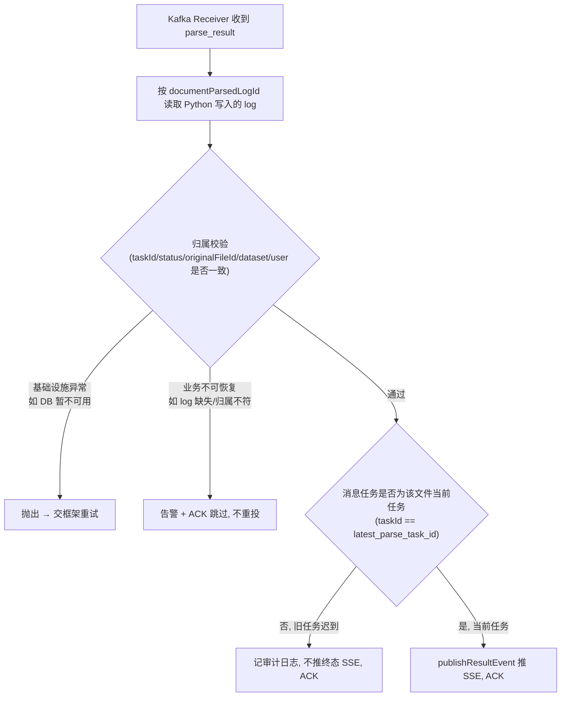
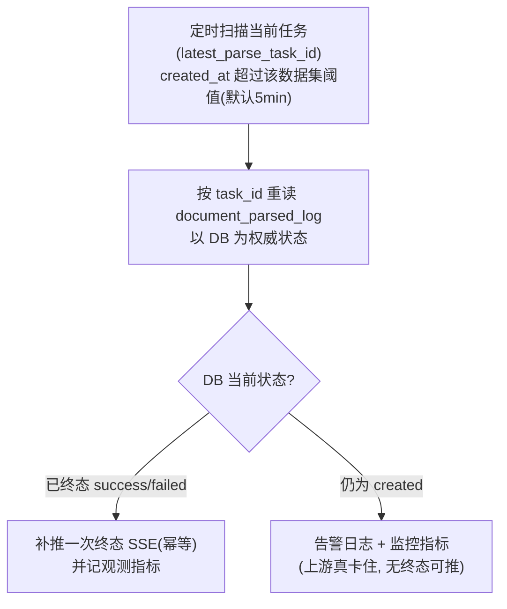

# parse-result-consumer-resilience Brief

> 来源：GitHub issue ql-link/LinkRag-Service#15（已按修订后理解重写）与父需求 ql-link/LinkRag#44。
> 本 Brief 已纠正原 issue 的前提假设：原方案假设“Java 收到 parse_result 后更新业务状态”，与迁移后实现不符，相应机制已收敛为“不做”。

## 0. 现状前提（决定范围的关键事实）

`feat(parse): 按 Python 契约迁移 Java 解析链路` 之后的真实分工：

- **Python = 权威记账人**：解析流水线结束后，先把终态写入 `document_parsed_log.task_status`（`created` → `success`/`failed`），再通过 `tolink.rag.parse_result` 发通知。`KnowledgeParsedLog` 实体注释即写明“Python 创建并推进该记录，Java 仅读取校验和查询”。
- **Java = 传话人**：`KnowledgeParseResultServiceImpl.handleParseResult` 只校验消息与已持久化的 `document_parsed_log` 是否一致，校验通过即调用 `KnowledgeParseSseServiceImpl.publishResultEvent` 转发给 SSE 订阅端。**Java 从不依据 parse_result 回写业务状态。**
- parse_result 消息体仅含 `task_id / original_file_id / document_parsed_log_id / dataset_id / user_id / task_status / failure_reason / parse_finished_at`，**不含 `previous_task_id`/重试链**。当前任务由 Java 侧 `KnowledgeParseFile.latest_parse_task_id` 指针标识。

因此原方案中“防止业务状态被重复更新/被旧任务覆盖”的机制在当前架构下没有保护对象，详见 §1“本次不做”。

## 1. 需求摘要

### 做什么

增强 Java 端 parse_result **消费侧**的接收兜底，仅覆盖“传话人会被坏消息堵死、会传错对象、会漏话”三个真实问题：

1. **ACK 治理**：区分业务不可恢复消息与基础设施异常，避免坏消息反复重投阻塞消费。
2. **SSE 当前任务过滤**：旧任务迟到/乱序结果不再向前端误推终态事件。
3. **卡住任务观测告警 + 以 DB 为准兜底**：发现通知丢失/长期未到导致的长期非终态任务并告警。

### 为什么做

- **坏消息处置粗糙、瞬时故障会丢消息**：`KnowledgeParseResultKafkaReceiver.receive` 中 `handleParseResult` 对所有校验失败一律抛 `BusinessException`（日志不存在 / `task_id` 不符 / 状态不符 / 归属不符），异常冒泡到 Kafka 默认错误处理。当前栈为 **spring-kafka 2.7.4，无自定义容器工厂 / `ErrorHandler` / 手动 ack**，默认即 `SeekToCurrentErrorHandler` + `FixedBackOff(0L, 9)`（最多 10 次投递、**无退避**、随后仅记 ERROR 日志并跳过、**无 DLQ**）。由此带来两个真实问题：(1) 业务不可恢复的坏消息会被**毫秒级连投 10 次**造成无谓重处理与短暂分区停顿，最后被静默丢弃、无任何告警；(2) 因为没有退避，**瞬时基础设施故障**（如 DB 抖动几毫秒）会在一瞬间耗尽 10 次重试，把一条**本可成功的合法消息丢掉** → SSE 终态永不转发 → 用户卡在“解析中”。这正是“漏话”的一条隐蔽来源。
- **传错对象**：`publishResultEvent` 按 `original_file_id` 推送 SSE，不校验消息所属任务是否为该文件的当前任务。文件重试后，旧任务迟到的 `failed` 会给正在查看该文件的前端误推“解析失败”，即使当前任务已成功。
- **漏话无人管**：通知丢失或长期未到时，`document_parsed_log` 可能长期停在 `created`，Java 侧目前没有任何扫描或告警，前端长期停在“解析中”。

### 本次不做

- 不修改 Python 端消息体，不新增 `previous_task_id`/`retry_of_task_id`，不改 toLink-Rag 的 MQ 发送、流水线、schema 或迁移脚本。
- 不在 Java 侧重建 **Consumer 幂等账本**——Java 不写状态，重复消费最坏只是再转发一次 SSE，无害。
- 不在 Java 侧建 **终态不可逆状态机**——终态归 Python；每个 `task_id` 在 `document_parsed_log` 独立成行，库层不会互相覆盖。
- 不维护 **`retry_of_task_id` 链表**——已有 `latest_parse_task_id` 当前任务指针。
- 不在 Java 侧记录 **`sent_at`**——`document_parsed_log` 由 Python 拥有；首版用 `created_at` 近似投递时间。
- 不引入 Java 侧解析任务自动重试。
- 不引入 DLQ（死信队列）；消费失败以告警日志 + 监控指标兜底，不静默丢弃。
- 不改动缓存补偿（`tolink.cache.evict`）消费链路；parse_result 的容器工厂改动与其隔离。
- 不把 Python 数据库作为 Java 业务状态的常规权威源；以 DB 为准的兜底只在通知超时场景触发。

## 2. 业务流程

### 2.1 接收主流程

### 2.2 卡住任务兜底流程

### 2.3 流程详解

- **正常接收**：消费侧先按 `document_parsed_log_id` 读取 Python 写入的日志，再校验 `task_id`、状态、归属字段一致。这一段维持现有语义，仅改“校验失败后的处置方式”。
- **失败分流**：把失败拆成两类——业务不可恢复（消息本身无法对应到合法记录，重投也不会变好）走告警 + ACK 跳过；基础设施异常（读库失败等瞬时问题）才交框架重试。
- **当前任务判定**：转发 SSE 前，以 `KnowledgeParseFile.latest_parse_task_id` 为“当前任务”锚点。消息 `task_id` 不等于该指针时视为旧任务/乱序，只记审计、不推终态事件。
- **MQ 通知降级为“提醒”**：前端断连/丢消息时已通过结果查询（按 `latest_parse_task_id` 取终态）从 DB 兜底。本次强化这一思路——消费侧不把单条 MQ 通知当唯一真相，丢失/重复/乱序在“以 DB 为准”下退化为无害或可观测。
- **卡住自检（以 DB 为准补推）**：定时扫描当前任务（`latest_parse_task_id`）中 `created_at` 超过该数据集阈值的记录，按 `task_id` **重读 `document_parsed_log` 取 DB 权威状态**：
  - DB 已是终态（`success`/`failed`）→ 说明终态已落库但 SSE 实时事件可能因消息丢失/消费失败未送达 → **以 DB 为准补推一次终态 SSE**（幂等，重复送达对前端无害）。
  - DB 仍为 `created` → 上游（Python）确实卡住或失败未推进，DB 没有终态可推 → **告警日志 + 监控指标**，等待人工/外部处理。
  - 这是观测补偿 + 以 DB 为准的兜底，不改变 Python 投递行为，也不是解析重试。
  - **范围限制（诚实标注）**：扫描以 `created` 作为入口筛选；若“消息丢失且 DB 已终态”的任务恰好不在扫描入口集合内，仍依赖前端结果查询（`listParseResults` 按 `latest_parse_task_id` 读 DB）自愈。本兜底覆盖“扫描时点重读发现已终态”的窗口，兜底范围与扫描入口的精确口径在 technical_design 收敛。

## 3. 核心模块与实现思路

### 3.1 ACK 治理（最高优先）

- **位置**：`link-service` 的 `KnowledgeParseResultKafkaReceiver` 与 `KnowledgeParseResultServiceImpl`；新增 parse_result **专用监听容器工厂**。
- **现状（已核实）**：spring-kafka 2.7.4，未配置容器工厂 / `ErrorHandler` / 手动 ack，parse_result 与 cache_compensation **共用 Spring Boot 默认容器工厂**，走默认 `SeekToCurrentErrorHandler` + `FixedBackOff(0L, 9)`（10 次立即重试 → 记日志跳过 → 无 DLQ）。`handleParseResult` 对所有校验失败一律抛 `BusinessException`，无差别进入该默认重试。
- **方案（已定）**：
  - **容器工厂范围**：为 parse_result **单开专用容器工厂 + 错误处理器**，仅 `KnowledgeParseResultKafkaReceiver` 的 `@KafkaListener` 指向它；缓存补偿继续用默认工厂，不受影响。
  - **失败分类**：
    - **业务不可恢复**（`task_id` / 状态 / 归属**不匹配**——逻辑矛盾，重试无意义）：定义专用的不可重试异常类型，错误处理器登记为 not-retryable，**立即 recover**：记**告警日志 + 监控指标**后提交跳过，不空转重试。
    - **暧昧（log 不存在）**：可能是跨库写可见性/主从延迟的瞬时缺失，按可重试处理；带退避重试仍缺失则告警 + 跳过。
    - **基础设施异常**（读库失败等瞬时问题）：可重试，用**带退避的重试**（替换无退避的默认 `FixedBackOff`，量级为几次/几秒，具体值在 TD 定）；重试耗尽后告警 + 跳过。
  - **不做 DLQ**：消息内容与 DB 冗余、卡住扫描兜底，v1 不引入 DLQ；recover 动作为**告警日志 + 监控指标**，不静默丢弃。DLQ 作为后续可选增强。
  - **手动 ACK**：不引入；继续容器托管 offset + 自定义错误处理器。
- **关键决策**：ACK/重试以“业务坏消息不空转、瞬时故障消息不被静默丢弃、不波及缓存补偿消费”为准。重试安全性由 `handleParseResult` 的幂等性保证（仅校验 + 重推 SSE，重跑无副作用）。

### 3.2 SSE 当前任务过滤

- **位置**：`KnowledgeParseSseServiceImpl.publishResultEvent` 及其调用链上的 `handleParseResult`。
- **现状**：按 `original_file_id` 推送，不校验是否当前任务。
- **思路**：转发前比对消息 `task_id` 与该文件 `latest_parse_task_id`：相等则正常推送终态；不等（旧任务/乱序）则记审计、不推 `parse_failed`/`parse_success`。
- **关键决策**：这是“乱序”问题在当前架构下唯一真实的残留，发生在 SSE 展示层而非库层。

### 3.3 卡住任务扫描与告警

- **位置**：`link-service` 的定时任务 / 调度模块（新增）。
- **职责**：发现通知未到/未被正确处理导致的长期非终态任务，并以 DB 为准补推或告警。
- **方案（已定）**：
  - 扫描当前任务（`latest_parse_task_id`）中 `created_at` 超阈值的记录，按 `task_id` 重读 `document_parsed_log` 取 DB 权威状态：终态 → 补推一次终态 SSE（首版即含，非可选开关）；仍 `created` → 告警日志 + 监控指标。
  - **阈值**：默认 5 分钟（文件上传解析为用户在线等待场景，超过即视为异常），**支持按数据集（dataset）覆盖**，缺省回落默认值；扫描间隔单独配置。
  - **告警载体**：告警日志 + 监控指标（无 DLQ、不接外部通道）；告警内容含 `task_id`、`original_file_id`、`document_parsed_log_id`、`dataset_id`、创建时间、超时时长、环境，确保可回查 DB。
- **关键决策**：首版以 `created_at` 近似投递时间，不引入 Java 侧 `sent_at`；扫描是观测补偿 + 以 DB 为准的兜底，不是解析重试。补推 SSE 复用 `publishResultEvent` 且经当前任务过滤，保证只对当前任务、幂等地推送。

## 4. 风险与不确定性

| 风险 / 问题 | 触发条件 | 影响 | 当前判断 / 应对方向 |
| :--- | :--- | :--- | :--- |
| 默认错误处理无退避、无 DLQ（已核实 spring-kafka 2.7.4） | 业务坏消息或瞬时故障消息进入默认 `SeekToCurrentErrorHandler`+`FixedBackOff(0,9)` | 坏消息 10 次空转后静默丢弃；瞬时故障消息毫秒级耗尽重试被误丢，SSE 终态不转发 | parse_result 专用容器工厂 + 可分类不可重试异常的 `ErrorHandler` + 带退避重试 + 告警日志/监控指标（不加 DLQ） |
| 专用容器工厂与默认工厂行为分叉 | 新工厂仅覆盖 parse_result，缓存补偿仍走默认 | 两条消费路径错误处理语义不同，易混淆 | 在配置与文档中标注两者差异；本次只承诺 parse_result 行为，缓存补偿不在范围 |
| 无 DLQ 下坏消息仅留日志/指标 | recover 后消息不再可重放 | 需要事后取证时无原始消息 | v1 接受（内容与 DB 冗余）；告警需含 `task_id`/`document_parsed_log_id` 等可回溯 DB 的键；如确有取证需求再加 DLQ |
| `created_at` 近似投递时间存在偏差 | Python 写 log 与实际投递存在时差 | 超时扫描误报/漏报 | 首版接受近似，阈值留余量；如需精确再跨端议 `sent_at` |
| `latest_parse_task_id` 更新时序竞争 | 重试发起与 parse_result 到达并发 | SSE 过滤误判当前任务 | 明确该指针在发起新任务时即更新；消息 taskId 不等于当前指针即视为非当前 |
| 以 DB 为准补推 SSE 的耦合 | 兜底扫描重读 Python 写入的 log | 跨项目数据依赖增强 | 仅读共享库稳定字段；只在超时兜底触发，不进常规路径 |
| 卡住扫描重复触发 | 同一卡住任务每个扫描周期反复命中 | 告警/指标噪声或重复补推 | 终态补推幂等本身无害；mode-1 告警用 gauge 指标 + warn 日志（必要时限频），去重口径在 TD 定 |
| 按数据集阈值的配置来源 | 不同数据集需不同超时阈值 | 配置维护成本 | 默认 5min + 按 dataset 覆盖；配置载体（配置项 map / dataset 表字段）在 TD 定 |

## 5. 已冻结决策

- **现状核实**：spring-kafka 2.7.4，无自定义容器工厂 / `ErrorHandler` / 手动 ack，默认 `SeekToCurrentErrorHandler`+`FixedBackOff(0L,9)`、ackMode BATCH、`enable.auto.commit=false`；parse_result 与 cache_compensation 共用默认工厂。
- **容器工厂**：parse_result 单开专用容器工厂 + 错误处理器，缓存补偿继续走默认、不受影响。
- **失败分类**：不匹配类（不可重试）→ 告警+跳过；`log 不存在`（暧昧）→ 带退避重试后仍无则告警+跳过；基础设施异常 → 带退避重试，耗尽告警+跳过。
- **重试**：替换无退避的默认 `FixedBackOff`，改为有上限退避（具体值 TD 定）。
- **DLQ**：v1 不加；失败兜底为告警日志 + 监控指标。
- **手动 ACK**：不引入，容器托管 offset。
- **卡住阈值**：默认 5 分钟，按数据集（dataset）覆盖，缺省回落默认；扫描间隔单独配置。
- **以 DB 补推 SSE**：首版即含，非可选开关（重读 DB 终态则补推、仍 `created` 则告警）。
- **告警通道**：告警日志 + 监控指标，不接飞书/邮件/外部平台。

> 留待 technical_design 收敛的实现级细节（不影响验收）：退避次数与间隔的具体值、卡住扫描去重口径、按数据集阈值的配置载体、SSE 过滤遇 `latest_parse_task_id` 为空时的取舍（拟默认 fail-open + 审计）。
