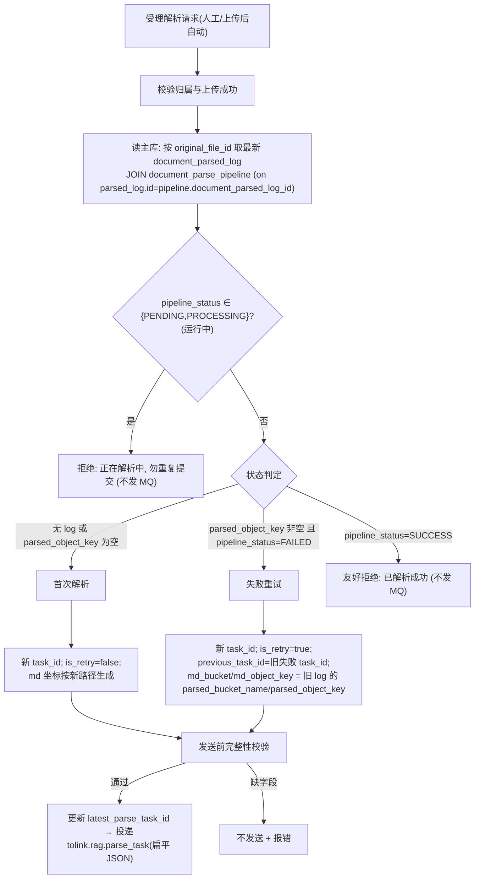
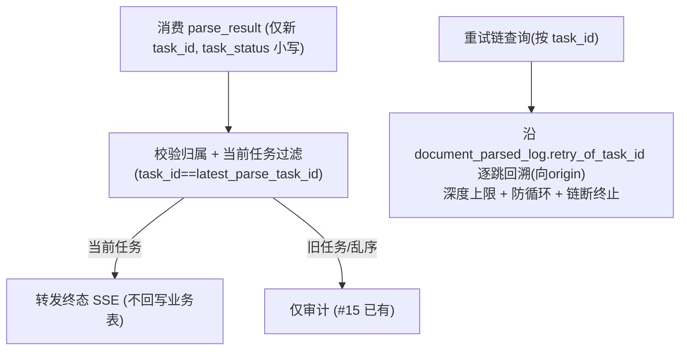

# parse-retry-and-sparse-vector-java Brief

> 来源：GitHub issue ql-link/LinkRag-Service#16（《feat(java-parse): 支持解析失败重试消息与审计字段适配》）。issue 挂在 Python 仓库，需求 1–5 全部落在 **Java 管理端（本仓库 toLink-Service）**。
> 关联前序：`knowledge_parse_pipeline_migration`（确立 Python=记账人 / Java=传话人）、`parse-result-consumer-resilience`（#15，确立"Java 不回写业务状态、靠 latest_parse_task_id 当前任务指针"）。本需求在 #15 边界上做受控演进。
> **本版已并入 Python 侧权威源**（ORM `src/models/parse_task.py` + migration 链，合并至 0009），以下结构以此为准；Python 仓库 `migrations/db.sql` 是停留在 0006 的过时快照，不可作为权威。

## 0. 现状前提（决定范围的关键事实）

### 0.1 分工（沿用，不变）

- **Python = 权威记账人**：解析+后处理流水线由 Python 推进，先写库终态再发 MQ。
- **Java = 任务投递人 + 传话人**：①受理解析请求、生成 `task_id`、维护 `document_parse_file.latest_parse_task_id` 指针、向 `tolink.rag.parse_task` 投递；②消费 `tolink.rag.parse_result` 终态后**只校验归属并转发 SSE，从不回写业务表**。
- **重试语义**：本需求的"重试" = **复用上次 Markdown 的阶段恢复**，让 Python 从失败阶段（含稀疏向量）续跑，**不是重新解析原文件**。

### 0.2 已并入的 Python 权威结构

- **后处理流水线表已改名**：`document_post_process_pipeline` → **`document_parse_pipeline`**（migration 0007，旧名线上不存在）。ORM `DocumentParsePipeline`。
- **端到端终态权威单源 = `document_parse_pipeline.pipeline_status`**，取值**全大写** `PENDING / PROCESSING / SUCCESS / FAILED`。`pipeline_status=SUCCESS` 仅在 6 阶段（cleaning→chunking→vectorizing→pretokenize→es_indexing→**sparse_vectorizing**）全成功后翻转一次——天然含稀疏阶段。
- **`document_parsed_log` 新增 `retry_of_task_id`**（0009，`VARCHAR(36) NULL`）：重试链"向前指"（本轮→上一轮），Python 写入 = `payload.previous_task_id`，Java 只读。
- **`document_parse_pipeline.superseded_by_task_id`**（0009，`VARCHAR(36) NULL`）：重试链"向后指"（旧→新），Python 用 CAS（`SET superseded_by_task_id=新 WHERE id=旧 AND superseded_by_task_id IS NULL`）占位；NULL=未被重试接管。
- **`retry_count` / `last_retry_at` 已删除**（0007，从 pipeline 表移除，ORM/运行时零残留）。Java 本就从未引用 → 本需求对它们的"清理"是空操作，仅需保证新建只读实体不引入这两列。
- **稀疏向量在 Java 侧零参与**：纯 Python pipeline 第 6 阶段，自治；`parse_task` 消息**没有任何稀疏向量字段**。Java 仅读 `pipeline_status` 判定能否重试。

### 0.3 🔴 契约漂移（已决：纳入本需求 + 运行库已迁移）

> **用户已确认（2026-05-30）**：①当前 Java 连的共享 MySQL **已应用 0007/0009**，`document_parsed_log.task_status`/`failure_reason` **真的已删**——意味着 Java 现有对这两列的映射/读取在真实库上会触发 `Unknown column`（凡 `selectById/selectList` 物化 `DocumentParsedLog` 的路径都受影响，含 #15 的消费者与卡住扫描器）。②**纳入本需求 #16 一并对齐**。下文 R0 由"阻塞项"转为"已决工作项"。

Python 权威 schema 显示 **`document_parsed_log` 已在 0007 删除 `task_status` 与 `failure_reason` 两列**；端到端终态改由 `document_parse_pipeline.pipeline_status` 表达，而 `task_status`（小写 `success/failed`）**只作为 parse_result MQ 消息字段存在**。

但 **当前 Java 仍把这两列建模在 `DocumentParsedLog` 实体上并在主代码读取**（已核实 3 文件 9 处）：

| 位置 | 读取内容 | 影响 |
| :--- | :--- | :--- |
| `DocumentParseTaskServiceImpl#hasRunningTask`（:156,:162） | `document_parsed_log.task_status=created` 判"运行中" | 列若已删 → 运行中判定失效 |
| `DocumentParseTaskServiceImpl#buildResultDTO`（:216,:217） | `log.getTaskStatus()` / `getFailureReason()` | 结果列表展示终态/失败原因 |
| `DocumentParseStuckScanner`（:59,:97,:126,:127）（#15 冻结） | `task_status=created` 扫卡住 + 读 failureReason | 卡住扫描依据失效 |
| `DocumentParseResultServiceImpl#handleParseResult`（:49）（#15 冻结） | `payload.taskStatus == logRecord.getTaskStatus()` | 消费侧状态一致性校验丢失右值 |

> 注：`DocumentParseResultServiceImpl` / `DocumentParseSseServiceImpl` 中其余 `payload.getTaskStatus()` 读的是 **MQ 消息**（合法保留，小写），不受影响；`DocumentOriginalFile.failure_reason` 是另一张表，无关。

这是 issue 文本未列出、但与"审计字段适配"同源的契约漂移。本需求把 Java 的"运行中/卡住/终态"判定从 `document_parsed_log.task_status` 迁到 `document_parse_pipeline.pipeline_status`，并移除实体对 `task_status`/`failure_reason` 的映射。**触及 #15 刚冻结的消费者与卡住扫描器**——因运行库已迁移、其现有读取本就会失败，故此对齐兼具修复性质。

## 1. 需求摘要

### 做什么

让 Java 投递端把"解析失败重试"升级为"可识别、带溯源、复用 Markdown 的阶段恢复重试"：

1. **入口识别首次 / 可重试失败 / 已成功**：受理请求时按文件读最新 `document_parsed_log` JOIN `document_parse_pipeline`，判定首次解析、失败重试、还是已成功（友好拒绝、不发 MQ）。
2. **重试任务消息构造**：重试生成新 `task_id`，带 `is_retry=true` + `previous_task_id=旧 task_id`，复用旧 `parsed_bucket_name`/`parsed_object_key` 为 `md_bucket`/`md_object_key`，其余业务字段与原任务一致；首次解析向后兼容。
3. **发送前完整性校验**：`is_retry=true` 时 `previous_task_id`/`md_bucket`/`md_object_key` 非空，缺字段不发送。
4. **审计字段读取**：Java 能读 `document_parsed_log.retry_of_task_id` 与 `document_parse_pipeline.superseded_by_task_id`，且不引入 `retry_count`/`last_retry_at`。
5. **重试链回溯查询**：按 `task_id` 沿 `retry_of_task_id` 回溯，设深度上限、链断安全终止、防循环。
6. **（本需求附加·契约对齐）收口 `task_status`/`failure_reason` 漂移**：移除 `DocumentParsedLog` 对这两列的映射，把 Java 4 处读取（`hasRunningTask` / `buildResultDTO` / `DocumentParseStuckScanner` / `handleParseResult` 状态校验）迁到 `document_parse_pipeline.pipeline_status`（大写枚举）；前端态映射改由 `pipeline_status` + `parsed_object_key` 推导，失败原因取 `pipeline.failure_reason`。

### 为什么做

- 后处理流水线（含稀疏向量阶段）可能在 Markdown 已产出后失败；现状 Java"人工重试"只会无脑重发、重建 Markdown 路径，浪费已完成产物、无法阶段恢复、无溯源。
- 现状 Java **无法区分"已成功"与"可重试"**：对已成功文件再次点解析仍会投递 MQ，造成无意义重复处理。

### 本次不做（非目标）

- 不改解析方式 / 不设重试次数上限 / 不做重试链 UI。
- 不在发 MQ 前调 Python 健康检查。
- 不处理 parse_result 幂等/丢失/乱序兜底（#15 已覆盖，复用其当前任务过滤与卡住扫描）。
- 不改 `DocumentParseResultMQ` 消息体（仍不带 `previous_task_id`）。
- 不让 Java 依据 parse_result 回写业务表。
- 不在 Python 仓库改动；`document_parse_pipeline` 建表与写入归 Python，Java 只读。

## 2. 业务流程

### 2.1 投递主流程（首次 / 重试 / 拒绝识别）

### 2.2 结果接收与重试链查询

### 2.3 流程详解

- **判定数据源（关键）**：用 `document_parsed_log.parsed_object_key`（回答"Markdown 是否产出"）+ `document_parse_pipeline.pipeline_status`（回答"端到端成败/是否在跑"）。两表通过 `document_parsed_log.id = document_parse_pipeline.document_parsed_log_id`（或共同 `task_id`）关联。**不要用 `task_status` 做判定**——它已从表删除且语义是端到端而非 Markdown 阶段。
- **运行中判定要迁移**：现状靠 `document_parsed_log.task_status=created` 判"运行中"；迁移后改判 `pipeline_status ∈ {PENDING,PROCESSING}`（与 §0.3 漂移处理绑定）。
- **走主库**：判定查询读可写主库，避免主从延迟把刚失败任务误判为首次/已成功。本仓库单数据源、无读写分离，确认数据源即主库即可（§5 Q-D）。
- **`is_retry` 由 DB 状态推导，非 trigger_mode**：Python 编排层 `if payload.is_retry:` 分流；`is_retry` 必须由"流水线 FAILED + Markdown 已产出"推导，`trigger_mode`（upload_auto/manual_retry）只表自动/人工。**两者解耦**：人工重试也可能因无历史 log 走首次分支。
- **复用 Markdown 坐标**：重试不走 `buildMdObjectKey` 新建路径，取上一次失败任务对应 log 的 `parsed_bucket_name`/`parsed_object_key`（即"上一轮 markdown"回填来源）作为本次 `md_bucket`/`md_object_key`。
- **重试链双向**：`retry_of_task_id`（log，新→旧）+ `superseded_by_task_id`（pipeline，旧→新）。req#5 的回溯沿 `retry_of_task_id` 向 origin 走。
- **结果接收基本不变**：重试时 `latest_parse_task_id` 已切到新 task_id，现有消费按"新 task_id==当前任务"转发——这条验收基本由现状满足，只做回归确认；但 §0.3 漂移会影响 `handleParseResult:49` 的 `logRecord.getTaskStatus()` 右值（须随漂移处理一并收口）。

## 3. 核心模块与实现思路

### 3.1 投递入口与重试识别（最高优先）

- **位置**：`link-service` 的 `DocumentParseTaskServiceImpl`（`submit*` / `submit` / `buildPayload` / `hasRunningTask`）。
- **复用**：归属校验、`latest_parse_task_id` 指针更新、MQ 投递骨架。
- **新增**：投递前插入"读 log JOIN pipeline → 首次/重试/拒绝/运行中"判定；新增"已成功→友好拒绝、不发 MQ"路径；`hasRunningTask` 改判 `pipeline_status`；重试分支改写 `buildPayload`（带 `is_retry`/`previous_task_id`、复用旧 md 坐标）。
- **关键决策**：判定以 `parsed_object_key`+`pipeline_status` 为准、读主库、`is_retry` 由 DB 状态推导。

### 3.2 只读实体 + 审计字段（数据访问层）

- **位置**：`link-model` 新增 `document_parse_pipeline` 只读实体（对齐 ORM `DocumentParsePipeline`），`link-mapper` 新增 Mapper；`DocumentParsedLog` 加 `retry_of_task_id`。
- **职责**：只读 Python 写入的 `pipeline_status` / `superseded_by_task_id` / 各阶段状态、log 的 `retry_of_task_id`。
- **🔴 漂移处理（已决·纳入本需求）**：`DocumentParsedLog` 移除 `task_status`/`failure_reason` 映射、新增 `retry_of_task_id`；§0.3 四处读取迁到 `document_parse_pipeline.pipeline_status`（含 #15 的消费者/卡住扫描器）。运行库已迁移，故此项兼具修复性质，须连带回归 #15 既有测试。
- **关键决策**：只读不写；不引入 `retry_count`/`last_retry_at`；状态枚举大写、与 Python 对齐；契约同步 `docs/reference/mysql_schema.md` + 本地 `schema.sql`/`init.sql`（仅开发库，不引 Flyway）。

### 3.3 parse_task 消息扩展与完整性校验

- **位置**：`link-service` 的 `DocumentParseTaskMQ.MsgPayload` 与 `validate`。
- **新增字段**（与 Python `ParseTaskPayload` 对齐，名字已核对一致）：`is_retry`（bool，默认 false）、`previous_task_id`（string，可空）。
- **校验**：`is_retry=true` 时 `previous_task_id`/`md_bucket`/`md_object_key` 非空（否则 Python 判 `RETRY_VALIDATION_FAILED:missing_*`）；首次解析保持现有校验，向后兼容。`is_retry`+`previous_task_id` 必须**同时**带。
- **契约**：发扁平 snake_case JSON（Python `parse_msg` 兼容信封与扁平）；同步 `docs/reference/mq_contracts.md` + `docs/architecture/mq_module.md`。

### 3.4 parse_result 消费回归确认

- **位置**：`DocumentParseResultServiceImpl`（逻辑基本不动）。
- **思路**：验证重试场景"按新 task_id==latest_parse_task_id 转发终态"成立、保持"不回写业务表"边界；`handleParseResult:49` 的状态一致性校验随 §0.3 漂移处理统一收口（改与 `pipeline_status` 比对或调整校验口径）。

### 3.5 重试链回溯查询

- **位置**：`link-service` 新增 service 方法 + `DocumentParsedLogMapper` 按 `retry_of_task_id` 回溯。
- **职责**：给定 `task_id` 沿 `retry_of_task_id` 逐跳向 origin 回溯；深度上限、遇空/断链安全终止、遇环（task_id 重复）即停。
- **关键决策**：非目标"不做 UI"，首版仅后端 service + 边界测试，是否出 Controller 待 §5 Q-B。

### 3.6 主库读取与文档同步（横切）

- **主库**：单数据源、无读写分离；§3.1 判定走可写主库，确认数据源指向主库即可，无需路由 Hint。
- **文档同步**（CLAUDE.md / `.claude/doc-sync-rules.yaml`）：MQ → `mq_contracts.md`+`mq_module.md`；实体/DDL → `mysql_schema.md`+`schema.sql`/`init.sql`；并注明本需求对 #15"不维护 retry 链"边界的演进。

## 4. 风险与不确定性

| 风险 / 问题 | 触发条件 | 影响 | 当前判断 / 应对方向 |
| :--- | :--- | :--- | :--- |
| **R0 `task_status`/`failure_reason` 契约漂移（已决纳入）** | 运行库已删两列，Java `DocumentParsedLog` 仍映射，物化即 `Unknown column` | 现有运行中/卡住/终态读取已破，含 #15 冻结代码 | 已决：本需求移除两列映射、迁到 `pipeline_status`，连带回归 #15 测试；属修复性变更 |
| 状态值大小写双轨 | DB `pipeline_status` 大写 `SUCCESS/FAILED`；parse_result 消息 `task_status` 小写 `success/failed` | 判定/比对漏匹配 | 实体与判定按各自真实大小写固定；测试钉死该约定 |
| 运行中与可重试边界 | `parsed_object_key` 非空但 `pipeline_status=PROCESSING/PENDING` 或 pipeline 行未建 | 把运行中误判为可重试→重复投递 | 运行中（PENDING/PROCESSING）优先拒绝；判定顺序在 TD 收敛 |
| 复用 Markdown 坐标取错来源 | 多轮重试/多条 log 选错 `parsed_object_key` | 重试读到过期/错误 Markdown | 取"最新一条 parsed_object_key 非空且 pipeline=FAILED 任务"的 log 坐标；多轮沿 previous_task_id 串联（§5 Q-C 可确认） |
| 与 #15"不维护 retry 链"决策冲突 | #15 明确不做 retry_of_task_id 链表 | 两文档结论矛盾 | 受控反转：仅投递方向加 previous_task_id + 只读 retry 查询，不改 parse_result；文档注明演进 |
| MQ 入参字段名待核 | Java 现发 `document_parse_file_id`，Python 文档列为 `document_parse_task_id`（=parse_file.id） | 若无 alias，重试/首解字段对不上 | 现网首解可用→大概率有 alias；TD 阶段核对 Python pydantic alias |
| 主库读取无读写分离基建 | 判定走从库受主从延迟 | 刚失败任务误判 | 单数据源确认即主库；未来引读写分离再补路由（§5 Q-D） |

## 5. 待确认问题

> Python 权威源 + 用户确认已解掉原 Q1–Q5、字段命名、以及 Q-A（漂移：运行库已迁移、纳入本需求）。**无剩余冻结阻塞项**；以下非阻塞细化项已于 brief 冻结（2026-05-30）锁定默认取值，如需调整可回到 brief 修订后再推进。

- **Q-B 重试链查询是否需对外 API**（默认：否）：非目标"不做 UI"，首版仅 service + 边界测试，不出 Controller。如需运维/内部接口请指出。
- **Q-C 多轮重试的 Markdown 取值**（默认：是）：取"最新一条 `parsed_object_key` 非空且 `pipeline_status=FAILED` 的任务" log 坐标，`previous_task_id` 始终指上一轮失败任务。
- **Q-D 单数据源是否即主库**（默认：是）：判定读主库由现配置满足，无需新增路由；如实际连了只读副本请指出。
