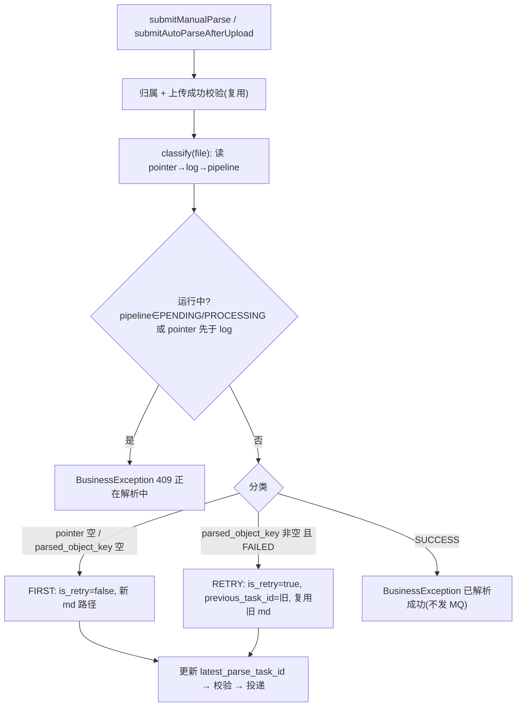

# parse-retry-and-sparse-vector-java 技术设计

- **文档状态：** 技术方案待审核
- **项目名称：** toLink-Service
- **业务域：** 文档解析 / MQ 任务投递与结果消费
- **需求名称：** parse-retry-and-sparse-vector-java（解析失败重试链路 + 审计字段适配，Java 端）
- **业务输入：** `docs/parse-retry-and-sparse-vector-java/brief.md`（v3，已冻结）
- **验收输入：** `docs/parse-retry-and-sparse-vector-java/acceptance.feature`（26 Scenario，已冻结）
- **输出文件：** `docs/parse-retry-and-sparse-vector-java/technical_design.md`
- **最后更新时间：** 2026-05-30

---

## 1. 文档修订记录

| 版本号 | 修改日期 | 修改内容简述 | 来源/提出人 | 审核状态 |
| :--- | :--- | :--- | :--- | :--- |
| v1.0 | 2026-05-30 | 初始技术设计：重试识别 + 消息扩展 + 审计字段 + 重试链查询 + task_status 漂移收口 | brief.md + acceptance.feature | 待审核 |

---

## 2. 输入依据与设计目标

### 2.1 输入依据映射

| 输入来源 | 关键结论 | 技术设计承接方式 |
| :--- | :--- | :--- |
| `brief.md` | Java=投递+传话；重试=复用旧 Markdown 的阶段恢复；判定用 `parsed_object_key`+`pipeline_status`；运行库已删 `task_status`/`failure_reason`，纳入对齐 | 入口分类 + MQ 扩展 + 新只读 pipeline 实体 + 漂移收口 |
| `acceptance.feature` | 26 Scenario：入口识别 6 / 消息构造 3 / 校验 2 / parse_result 3 / 审计+链 6 / 契约对齐 5 / 不变量 1 | 每个方法关联 ≥1 Scenario，见 §7.1 与 §10.2 |
| Python 权威源 | 表名 `document_parse_pipeline`；`pipeline_status` 大写枚举；`retry_of_task_id`/`superseded_by_task_id` 双向链；parse_task 加 `is_retry`+`previous_task_id` | 只读实体按权威列建模；MQ 字段名与 Python 对齐 |

### 2.2 技术目标

- Java 受理解析请求时正确分类**首次 / 失败重试 / 已成功 / 运行中**，已成功友好拒绝不发 MQ。
- 重试消息携带新 `task_id` + `is_retry=true` + `previous_task_id` + 复用旧 Markdown 坐标，发送前完整性校验。
- 新增 `document_parse_pipeline` 只读实体，读取 `pipeline_status` 与 `superseded_by_task_id`；`DocumentParsedLog` 新增 `retry_of_task_id`，移除已删的 `task_status`/`failure_reason`。
- 把 Java 全部"终态/运行中"判定从 `document_parsed_log.task_status` 迁到 `document_parse_pipeline.pipeline_status`（含 #15 卡住扫描器与结果消费者），并回归 #15 既有测试。
- 提供按 `task_id` 沿 `retry_of_task_id` 回溯的重试链查询（深度上限 + 防环），仅 service 层、不出对外 API。

### 2.3 非目标

- 不计算稀疏向量、不参与后处理流水线执行（纯 Python）。
- 不写 `document_parsed_log` / `document_parse_pipeline` 任何字段。
- 不改 `DocumentParseResultMQ` 消息体；不改 #15 容器工厂/退避策略。
- 不出重试链 UI / 对外 API。
- 不重命名既有 `document_parse_file_id` MQ 字段（见 §12 风险 R4）。

---

## 3. 改动范围

### 3.1 改动文件目录树

```text
toLink-Service/
├── link-model/src/main/java/com/qingluo/link/model/dto/entity/
│   ├── DocumentParsedLog.java                      # [修改] 删 task_status/failure_reason 映射，加 retry_of_task_id
│   └── DocumentParsePipeline.java                  # [新增] document_parse_pipeline 只读实体
├── link-mapper/src/main/java/com/qingluo/link/mapper/
│   └── DocumentParsePipelineMapper.java            # [新增] BaseMapper
├── link-service/src/main/java/com/qingluo/link/service/
│   ├── mq/DocumentParseTaskMQ.java                 # [修改] 加 is_retry/previous_task_id + 校验
│   ├── DocumentParseRetryChainService.java         # [新增] 重试链回溯接口
│   ├── impl/document/
│   │   ├── DocumentParseTaskServiceImpl.java       # [修改] 分类/拒绝/重试 payload/hasRunningTask/结果态
│   │   ├── DocumentParseResultServiceImpl.java     # [修改] 终态一致性校验改 pipeline_status
│   │   ├── DocumentParseStuckScanner.java          # [修改] 扫描/补推改 pipeline_status
│   │   └── DocumentParseRetryChainServiceImpl.java # [新增] 沿 retry_of_task_id 回溯
│   └── constant/ParsePipelineStatus.java           # [新增] 大写状态常量（PENDING/PROCESSING/SUCCESS/FAILED）
├── link-api/src/main/resources/schema.sql          # [修改] 测试 H2：删两列、加 retry_of_task_id、加 pipeline 表
├── docs/db/init.sql                                # [修改] 开发库脚本同步
└── docs/reference/{mq_contracts,mysql_schema,api_contracts,error_codes}.md  # [修改] 契约同步
```

### 3.2 文件级改动说明

| 文件 | 动作 | 改动目的 | 是否必须 |
| :--- | :--- | :--- | :--- |
| `DocumentParsedLog.java` | 修改 | 对齐运行库：删 `task_status`/`failure_reason`，加 `retry_of_task_id` | 是 |
| `DocumentParsePipeline.java` | 新增 | 只读 `pipeline_status`/`superseded_by_task_id` 等审计与终态字段 | 是 |
| `DocumentParsePipelineMapper.java` | 新增 | MyBatis-Plus BaseMapper | 是 |
| `ParsePipelineStatus.java` | 新增 | 大写状态常量，避免散落字面量 | 是 |
| `DocumentParseTaskMQ.java` | 修改 | 加 `is_retry`/`previous_task_id` 字段与重试校验 | 是 |
| `DocumentParseTaskServiceImpl.java` | 修改 | 入口分类、已成功拒绝、重试 payload、运行中判定、结果前端态 | 是 |
| `DocumentParseResultServiceImpl.java` | 修改 | 终态一致性校验从 `log.task_status` 改为 pipeline | 是 |
| `DocumentParseStuckScanner.java` | 修改 | 卡住扫描与补推改用 `pipeline_status`（回归 #15） | 是 |
| `DocumentParseRetryChainService(Impl).java` | 新增 | 重试链回溯查询（service 层） | 是 |
| `DocumentParseSseServiceImpl.java` | 不改 | 只读 MQ payload（小写）与 `originalFileId`；实体瘦身后照常编译 | 否 |
| `DocumentFileController.java` | 不改 | 友好拒绝经 `BusinessException` 走全局异常处理，签名不变 | 否 |
| `schema.sql` / `init.sql` | 修改 | 测试/开发库结构对齐运行库 | 是 |
| 4 份 reference 文档 | 修改 | MQ/DB/API/错误码契约同步（doc-sync 强制） | 是 |

---

## 4. 当前系统分析

| 类型 | 文件/类/方法 | 当前行为 | 问题或复用点 |
| :--- | :--- | :--- | :--- |
| Service | `DocumentParseTaskServiceImpl.submitManualParse` | 仅 `hasRunningTask` 防重后直接 `submit`，无首次/重试/已成功分类 | 需前置分类 + 拒绝分支（复用归属校验、指针更新、投递骨架） |
| Service | `DocumentParseTaskServiceImpl.submit/buildPayload` | UUID 新 taskId；`md_object_key` 总是 `buildMdObjectKey` 新建 | 重试需复用旧坐标 + 带 is_retry/previous_task_id |
| Service | `DocumentParseTaskServiceImpl.hasRunningTask` (:153-163) | 以 `document_parsed_log.task_status=created` 判运行中 | 列已删→改 `pipeline_status∈{PENDING,PROCESSING}`，保留"指针先于日志=运行中"语义 |
| Service | `DocumentParseTaskServiceImpl.buildResultDTO/frontendStatus` (:205-234) | 前端态来自 `log.task_status`，失败原因 `log.failureReason` | 改为来自 `pipeline_status` + `pipeline.failure_reason` |
| Entity | `DocumentParsedLog` (:32,:35) | 映射 `task_status`/`failure_reason` | 运行库已删两列→物化即 `Unknown column`，必须删映射；加 `retry_of_task_id` |
| MQ | `DocumentParseTaskMQ.MsgPayload/validate` | 12 字段，无重试字段；`validate` 已强制 md 非空 | 加 `is_retry`/`previous_task_id`；`is_retry=true` 再强制 previous_task_id 非空 |
| Consumer | `DocumentParseResultServiceImpl.handleParseResult` (:49) | `payload.taskStatus == logRecord.getTaskStatus()` 一致性校验 | 右值列已删→改与 `pipeline_status` 比对或收敛校验口径 |
| Scheduler | `DocumentParseStuckScanner.scan/handleCandidate/toPayload` (:53-129) | 按 `task_status=created` 粗筛 + 重读 `task_status` 判终态 + `toPayload` 取 `log.task_status/failureReason` | 全部改 `pipeline_status`；补推 payload 的状态由大写 pipeline 映射为小写 |
| SSE | `DocumentParseSseServiceImpl.buildEvent/publishResultEvent` (:77-101) | 由 MQ payload 小写 `task_status` 映射前端态 | 不改：parse_result 消息体不变，仍小写 |
| Controller | `DocumentFileController.createParseTask/parseResults` (:61,:83) | 调 `submitManualParse`/`listParseResults` | 不改：行为变化在 service 内 |

---

## 5. 总体方案设计

### 5.1 投递分类总体流程



### 5.2 模块边界

| 模块 | 职责 | 本次是否改动 |
| :--- | :--- | :--- |
| link-model | 实体：瘦身 log、新增 pipeline 只读实体 | 是 |
| link-mapper | pipeline Mapper | 是（新增） |
| link-service | 分类/重试/校验/消费/卡住扫描/重试链 | 是 |
| link-api | Controller / H2 schema | schema 是、Controller 否 |
| link-components-mq | 发送骨架 `MQSend`/`AbstractMQ` | 否（仅 DocumentParseTaskMQ 在 link-service 内改） |

---

## 6. API、消息与数据设计

### 6.1 API 设计

- 端点签名不变：`POST /api/v1/files/{fileId}/parse`、`GET .../parse-results`、`GET .../parse-events`。
- 行为变化：①已成功文件再次提交解析 → 返回业务错误（`BusinessException`，拟 409 + "文件已解析成功，无需重复解析"，错误码待 §12 R3 确认）；②`parse-results` 的 `frontendStatus`/`parseStatus` 改由 `pipeline_status` 推导。
- doc-sync：`api_contracts.md` 补充已成功拒绝响应；`error_codes.md` 登记新错误码。

### 6.2 MQ 消息设计

`DocumentParseTaskMQ`（Java→Python，扁平 JSON）新增两字段（与 Python `ParseTaskPayload` 对齐）：

| 字段 | 类型 | 首次解析 | 重试 |
| :--- | :--- | :--- | :--- |
| `is_retry` | bool | `false`（或省略） | `true` |
| `previous_task_id` | string | 省略/空 | 旧失败 `task_id` |
| `md_bucket`/`md_object_key` | string | 新建路径 | 复用旧 `parsed_bucket_name`/`parsed_object_key` |

- 发送前 `validate`：`is_retry=true` 时 `previous_task_id`/`md_bucket`/`md_object_key` 必须非空。
- `DocumentParseResultMQ` 不变；`document_parse_file_id` 字段名保持（R4）。
- doc-sync：`mq_contracts.md` 解析消息字段段、`mq_module.md`。

### 6.3 数据与存储设计

**`document_parsed_log`（修改实体映射，运行库已是此结构）：**
- 删除映射：`task_status`、`failure_reason`。
- 新增映射：`retry_of_task_id VARCHAR(36) NULL`（Python 写、Java 读）。

**`document_parse_pipeline`（新增只读实体，Python 拥有）：** 仅建模 Java 需要的列：
`id, document_parsed_log_id, task_id, document_original_file_id, document_parse_file_id, pipeline_status, failed_stage, recover_from_stage, failure_reason, superseded_by_task_id, created_at, updated_at`。**不建模** `retry_count`/`last_retry_at`（运行库已删）。

- 关联：`pipeline.document_parsed_log_id = document_parsed_log.id`（亦冗余 `task_id`/`document_original_file_id` 可直查）。
- doc-sync：`mysql_schema.md` 增 `document_parse_pipeline` 段、更新 `document_parsed_log` 列说明；`schema.sql`/`init.sql` 同步（测试/开发库）。

---

## 7. 方法级实现方案

### 7.1 方法级变更总表

| 文件 | 类/对象 | 方法/成员 | 动作 | 入参变化 | 返回变化 | 改动目的 | 对应 Scenario |
| :--- | :--- | :--- | :--- | :--- | :--- | :--- | :--- |
| DocumentParsedLog | entity | `taskStatus`/`failureReason` | 删除 | - | - | 对齐运行库删列 | 不再读取 task_status；库侧小写不混 |
| DocumentParsedLog | entity | `retryOfTaskId` | 新增 | - | - | 审计链向前指 | DAO 能读取双向重试链审计字段；沿 retry_of_task_id 回溯 |
| DocumentParsePipeline | entity | 全部 | 新增 | - | - | 只读终态/审计 | 已产出 Markdown 且失败则可重试；已成功拒绝；DAO 读审计 |
| DocumentParsePipelineMapper | mapper | - | 新增 | - | - | 读 pipeline | 同上 |
| ParsePipelineStatus | constant | PENDING/PROCESSING/SUCCESS/FAILED | 新增 | - | - | 大写枚举常量 | 库侧大写比较 |
| DocumentParseTaskMQ | MsgPayload | `isRetry`/`previousTaskId` | 新增 | +2 字段 | - | 重试溯源 | 复用旧 Markdown；首次向后兼容 |
| DocumentParseTaskMQ | - | `validate` | 修改 | - | - | 重试完整性校验 | 重试缺关键字段则不发送 |
| DocumentParseTaskServiceImpl | impl | `classify`(私有) | 新增 | file/parseFile | 枚举 FIRST/RETRY/REJECT/RUNNING | 入口分类 | 无历史→首次；未产出即首次；失败→重试；成功→拒绝；运行中拒绝 |
| DocumentParseTaskServiceImpl | impl | `submitManualParse` | 修改 | - | - | 接 classify + 拒绝分支 | 已成功拒绝；首次/重试 |
| DocumentParseTaskServiceImpl | impl | `submitAutoParseAfterUpload` | 修改 | - | - | 复用 classify（自动恒 is_retry=false） | 无历史→首次 |
| DocumentParseTaskServiceImpl | impl | `submit` | 修改 | +RetryContext | - | 透传重试上下文 | 重试 payload |
| DocumentParseTaskServiceImpl | impl | `buildPayload` | 修改 | +RetryContext | - | 填 is_retry/previous/md | 复用旧坐标；首次兼容 |
| DocumentParseTaskServiceImpl | impl | `hasRunningTask` | 修改 | - | - | 运行中改判 pipeline | 运行中拒绝；指针先于行 |
| DocumentParseTaskServiceImpl | impl | `resolveCurrentLogs`+`buildResultDTO`+`frontendStatus` | 修改 | +pipeline | - | 前端态来自 pipeline | 前端态由 pipeline_status / 指针推导 |
| DocumentParseResultServiceImpl | impl | `handleParseResult` | 修改 | - | - | 终态校验改 pipeline | 重试后按新 task_id 转发；不回写 |
| DocumentParseStuckScanner | impl | `scan`/`handleCandidate`/`toPayload` | 修改 | - | - | 卡住改判 pipeline | 卡住扫描改用 pipeline_status（回归 #15） |
| DocumentParseRetryChainService | impl | `traceChain` | 新增 | taskId | List<String> | 回溯重试链 | 正常回溯/链长 1/链断/深度上限/成环 |

### 7.2 逐方法实现设计

#### 7.2.1 `DocumentParsedLog`（实体瘦身 + 加列）
- 删除 `@TableField("task_status") taskStatus` 与 `@TableField("failure_reason") failureReason`；新增 `@TableField("retry_of_task_id") String retryOfTaskId`。
- 影响：所有 `getTaskStatus()/getFailureReason()` 调用点编译失败 → 由编译器强制收口（§7.2.6/§7.2.7/§7.2.8）。这是"漂移修复"的关键支点。
- 对应测试：实体物化不再产生 `Unknown column`（S「Java 不再读取 task_status/failure_reason」）。

#### 7.2.2 `DocumentParsePipeline` + `DocumentParsePipelineMapper`（新增只读）
- `@TableName("document_parse_pipeline")`，字段见 §6.3；只读，无写方法。
- Mapper：`interface DocumentParsePipelineMapper extends BaseMapper<DocumentParsePipeline>`。
- 对应测试：DAO 能读 `superseded_by_task_id`；分类依赖 `pipeline_status`。

#### 7.2.3 `DocumentParseTaskMQ.MsgPayload` + `validate`
- 新增 `@JSONField(name="is_retry") Boolean isRetry`（默认 false）与 `@JSONField(name="previous_task_id") String previousTaskId`。
- `@AllArgsConstructor` 参数增 2 → `buildPayload` 同步；首次解析传 `false/null`。
- `validate` 末尾追加：`if (Boolean.TRUE.equals(isRetry) && !hasText(previousTaskId)) throw ...`（md 非空已有强制）。
- 事务/异常边界：发送前抛出，不投递、不推进指针。
- 对应测试：S「重试消息缺关键字段则不发送（Outline: previous_task_id/md_bucket/md_object_key）」「字段齐全则通过并发送」。

#### 7.2.4 `DocumentParseTaskServiceImpl.classify`（新增私有）
- 入参：`DocumentOriginalFile file, DocumentParseFile parseFile`；产出枚举 + 可选 `RetryContext{previousTaskId, mdBucket, mdObjectKey}`。
- 步骤：
  1. `latestTaskId = parseFile.latestParseTaskId`；为空 → `FIRST`。
  2. `latest = findLogByTaskId(latestTaskId)`；为空（指针先于日志）→ `RUNNING`。
  3. `pipeline = pipelineMapper.selectOne(eq(taskId, latestTaskId))`；为空 → `RUNNING`。
  4. `status = pipeline.pipelineStatus`：`PENDING/PROCESSING`→`RUNNING`；`SUCCESS`→`REJECT`；`FAILED`→ `hasText(latest.parsedObjectKey)` ? `RETRY(previousTaskId=latestTaskId, mdBucket=latest.parsedBucketName, mdObjectKey=latest.parsedObjectKey)` : `FIRST`。
- 并发边界：读走主库（默认数据源即主库，R5）；与 `hasRunningTask` 的批量安全网共同收口。
- 对应测试：S1/S2/S3/S4/S5/S6。

#### 7.2.5 `submitManualParse` / `submitAutoParseAfterUpload` / `submit` / `buildPayload`
- `submitManualParse`：归属与上传校验后调 `classify`；`RUNNING`→409；`REJECT`→`BusinessException`(已成功)；`RETRY`/`FIRST`→`submit(file, parseFile, MANUAL_RETRY, retryCtxOrNull)`。
- `submitAutoParseAfterUpload`：保持 `UPLOAD_AUTO`；`classify` 仅用于 RUNNING 去重，恒按 `FIRST`（is_retry=false）投递。
- `submit(..., RetryContext ctx)`：生成新 taskId、更新指针（事务内，发送失败回滚），调 `buildPayload(taskId, trigger, parseFile, file, ctx)`。
- `buildPayload`：`ctx==null` → is_retry=false、previousTaskId=null、md 用 `buildMdObjectKey`；`ctx!=null` → is_retry=true、previousTaskId=ctx.previousTaskId、md_bucket/md_object_key=ctx 复用值。
- 对应测试：S3/S4/S7/S8/S9。

#### 7.2.6 `hasRunningTask`（改判 pipeline）
- 指针非空且 `latest==null` → true；`pipeline==null` → true；`pipeline.status∈{PENDING,PROCESSING}` → true。
- 批量安全网：`pipelineMapper.selectCount(eq(documentOriginalFileId,fileId).in(pipelineStatus, PENDING, PROCESSING)) > 0`。
- 对应测试：S5/S6。

#### 7.2.7 `resolveCurrentLogs` / `buildResultDTO` / `frontendStatus`（前端态来自 pipeline）
- `resolveCurrentLogs` 增量加载各文件当前任务的 pipeline（按 latestParseTaskId）。
- `buildResultDTO`：`parseStatus`/`failureReason` 来自 pipeline（`failure_reason`）；无 pipeline 行时按指针判定。
- `frontendStatus`：`PENDING/PROCESSING`→parsing、`SUCCESS`→parse_success、`FAILED`→parse_failed、无 pipeline 且指针非空→parsing、否则→parse_waiting。
- 对应测试：S「结果列表前端态由 pipeline_status 推导」「无流水线行时由指针推导」。

#### 7.2.8 `DocumentParseResultServiceImpl.handleParseResult`（终态校验改 pipeline）
- 现状 :49 `payload.taskStatus == logRecord.taskStatus` 失去右值。改为：按 `payload.documentParsedLogId`/`taskId` 读 pipeline，比较 `payload.taskStatus`（小写）与 `pipeline.pipelineStatus`（大写）经归一映射；若 pipeline 暂缺则按 `ParseResultPendingException`（复用 #15 退避重试）。其余归属校验、当前任务过滤、不回写边界全部保留。
- 对应测试：S「重试后按新 task_id 转发」「旧任务迟到不推」「不回写」。

#### 7.2.9 `DocumentParseStuckScanner`（卡住改判 pipeline，回归 #15）
- `scan` 粗筛：由 `document_parsed_log.task_status=created` 改为 join/按 `document_parse_pipeline.pipeline_status∈{PENDING,PROCESSING}` 且 `created_at<coarseCutoff`。
- `handleCandidate` 重读 pipeline 终态：`SUCCESS/FAILED`→补推；仍 `PENDING/PROCESSING`→告警+指标。
- `toPayload`：`taskStatus` 由大写 pipeline 映射小写（SUCCESS→success/FAILED→failed），`failureReason` 取 `pipeline.failure_reason`，其余字段不变。
- 对应测试：S「卡住扫描改用 pipeline_status 判定（回归 #15）」+ 回归 `DocumentParseStuckScannerTest`。

#### 7.2.10 `DocumentParseRetryChainService.traceChain`（新增）
- 入参 `String taskId`；返回 `List<String>` 链（从入参向 origin）。
- 步骤：`visited=Set`；循环：按 taskId 读 log → 加入链；`retryOfTaskId` 为空或对应 log 不存在 → 终止；`visited.contains(next)` → 终止（防环）；`链长≥maxDepth` → 截断终止；否则 `taskId=retryOfTaskId`。
- 配置：`@Value("${tolink.parse.retry-chain.max-depth:32}")`。
- 对应测试：S「正常回溯」「链长一」「链断终止」「深度上限截断」「成环即停」。

---

## 8. 组件与集成设计

- **MQ**：`DocumentParseTaskMQ` 经 `MQSend.send` 投递；新增字段不影响 `AbstractMQ`/序列化（fastjson `@JSONField`）。`parse_result` 消费链路、#15 容器工厂 `parseResultKafkaListenerContainerFactory` 不动。
- **数据源**：单数据源即主库（R5）；分类查询走该源。
- **契约守卫（contract-guard 思路）**：本次触及 MQ（parse_task 加字段）、DB（log 改列 + 新 pipeline 表）、API（拒绝响应）三类公共契约，§6 + §11 列出对应 doc-sync 项，提交前过 `check_docs_sync.py`。

---

## 9. 异常处理与降级策略

| 异常场景 | 处理方式 | 是否抛出 | 是否影响消息确认 |
| :--- | :--- | :--- | :--- |
| 已成功文件再次解析 | `BusinessException`（拟 409 友好提示），不发 MQ | 是 | 不涉及（HTTP 入口） |
| 运行中重复提交 | `BusinessException` 409 | 是 | 不涉及 |
| 重试 payload 缺字段 | `IllegalArgumentException`（发送前 validate），事务回滚、指针不推进 | 是 | 不涉及 |
| parse_result pipeline 暂缺 | `ParseResultPendingException`（#15 退避重试） | 是 | 退避重试后跳过 |
| 重试链断/环/超深 | 安全终止，返回已收集链，不抛 | 否 | 不涉及 |

---

## 10. 测试方案

### 10.1 方法级测试映射

| 被测文件/方法 | 测试文件 | 对应 Scenario | 断言要点 |
| :--- | :--- | :--- | :--- |
| `classify`/`submitManualParse` | `DocumentParseTaskServiceImplTest`（改/增） | S1-S6 | 分类结果、是否发 MQ、是否推进指针 |
| `buildPayload`/`validate` | `DocumentParseTaskServiceImplTest` + `DocumentParseTaskMQTest`（新增） | S7-S11 | is_retry/previous_task_id/md 复用、缺字段不发 |
| `handleParseResult` | `DocumentParseResultServiceImplTest`（改） | S12-S14 | 新 taskId 转发、旧任务不推、不回写 |
| `traceChain` | `DocumentParseRetryChainServiceImplTest`（新增） | S16-S20 | 链顺序、链长1、断链、深度上限、防环 |
| `DocumentParsePipelineMapper` | `...IntegrationTest`（新增/改） | S15 | 读 retry_of_task_id/superseded_by_task_id |
| `buildResultDTO`/`frontendStatus` | `DocumentParseTaskServiceImplTest`（改） | S22-S23 | 前端态映射 |
| `DocumentParseStuckScanner` | `DocumentParseStuckScannerTest`（改） | S「卡住扫描改 pipeline」 | 粗筛/补推/告警改 pipeline |
| 实体瘦身 | `DocumentParseResultIntegrationTest`/H2 | S「不读 task_status」 | 无 Unknown column |

### 10.2 Scenario 覆盖自检

| Scenario | 承接方法 | 承接测试 | 是否覆盖 |
| :--- | :--- | :--- | :--- |
| 无解析历史→首次 | classify | TaskServiceImplTest | ✅ |
| 未产出 Markdown 即失败→首次 | classify | TaskServiceImplTest | ✅ |
| 已产 Markdown+FAILED→重试 | classify/buildPayload | TaskServiceImplTest | ✅ |
| 已成功→友好拒绝 | submitManualParse | TaskServiceImplTest | ✅ |
| 运行中拒绝（PENDING/PROCESSING） | hasRunningTask/classify | TaskServiceImplTest | ✅ |
| 指针先于行→运行中 | classify | TaskServiceImplTest | ✅ |
| 复用旧 md+字段一致 | buildPayload | TaskServiceImplTest | ✅ |
| 首次向后兼容 | buildPayload | TaskServiceImplTest | ✅ |
| 多轮重试 previous=上一轮 | classify | TaskServiceImplTest | ✅ |
| 缺字段不发送（Outline） | validate | DocumentParseTaskMQTest | ✅ |
| 字段齐全则发送 | validate | DocumentParseTaskMQTest | ✅ |
| 新 taskId 转发终态 | handleParseResult | ResultServiceImplTest | ✅ |
| 旧任务迟到不推 | handleParseResult | ResultServiceImplTest | ✅ |
| 不回写业务表 | handleParseResult | ResultServiceImplTest | ✅ |
| DAO 读双向审计 | Pipeline/Log Mapper | IntegrationTest | ✅ |
| 正常回溯/链长1/断链/上限/防环 | traceChain | RetryChainServiceImplTest | ✅ |
| 不读 task_status/failure_reason | 实体瘦身 | IntegrationTest(H2) | ✅ |
| 前端态由 pipeline/指针推导（2 Outline） | buildResultDTO | TaskServiceImplTest | ✅ |
| 卡住扫描改 pipeline | StuckScanner | StuckScannerTest | ✅ |
| 不依赖 retry_count/last_retry_at | 实体/查询 | 编译 + grep 断言 | ✅ |
| 大小写不混 | ParsePipelineStatus + 映射 | 单测 | ✅ |

### 10.3 回归命令

```bash
mvn -pl link-service test
mvn -pl link-api test
mvn test
python3 scripts/check_docs_sync.py --working
```

---

## 11. 发布与回滚

- **发布前置**：运行库须已应用 Python 0007/0009（用户已确认）。Java 实体瘦身后依赖该结构；若部署环境未迁移会反向 `Unknown column`。
- **顺序**：先合并 Python 迁移 → 再发本 Java 变更。
- **回滚**：纯代码回滚到上一个 tag 即可；本次不引入 Java 侧 DDL 迁移工具（schema.sql 仅测试/开发库）。
- **doc-sync**：`mq_contracts.md`/`mq_module.md`、`mysql_schema.md`、`api_contracts.md`、`error_codes.md` 随码提交。

---

## 12. 风险与待确认问题

| 风险/问题 | 影响 | 建议处理 |
| :--- | :--- | :--- |
| R1 `task_status`↔`pipeline_status` 大小写映射散落 | 漏映射致状态误判 | 统一经 `ParsePipelineStatus` + 单一映射工具，单测钉死 |
| R2 `handleParseResult` 终态校验口径变更触及 #15 冻结逻辑 | 误改削弱坏消息隔离 | 保留分类/退避/不回写，仅替换右值来源；回归 #15 全部用例 |
| R3 已成功拒绝错误码未定 | 与 `error_codes.md` 约定冲突 | 拟 409 + 文案；提交前与现有码核对 |
| R4 MQ `document_parse_file_id` vs Python `document_parse_task_id` | 若无 alias 则字段对不上 | 现网首解可用→大概率有 alias；保持现字段名，联调核对，不擅自重命名 |
| R5 单数据源是否即主库 | 走从库致主从延迟误判 | 默认采纳"即主库"；如连只读副本需补路由 |
| R6 既有测试大量引用 task_status | 编译/用例红 | 随实体瘦身统一改测（ResultServiceImplTest/StuckScannerTest/IntegrationTest 等） |

---

## 13. 实施顺序

1. link-model：`DocumentParsedLog` 瘦身+加列、新增 `DocumentParsePipeline`、`ParsePipelineStatus`。
2. link-mapper：`DocumentParsePipelineMapper`。
3. link-service：`DocumentParseTaskMQ` 字段+校验 → `classify`/`submit*`/`buildPayload`/`hasRunningTask` → 结果态 → `handleParseResult` → `StuckScanner` → `RetryChainService`。
4. link-api：`schema.sql`；docs/db `init.sql`。
5. 测试：改红的既有用例 + 新增用例，跑 §10.3。
6. doc-sync：4 份 reference 文档；过 `check_docs_sync.py`。

---

## 14. 人工审核清单

- [ ] 改动文件目录树已确认（§3.1）
- [ ] 方法级变更总表已确认（§7.1）
- [ ] 消息 / 数据 / 事务边界已确认（§6、§9）
- [ ] 测试方案与 Scenario 全覆盖已确认（§10）
- [ ] R3 错误码、R4 字段名、R5 主库三项待确认项已拍板
