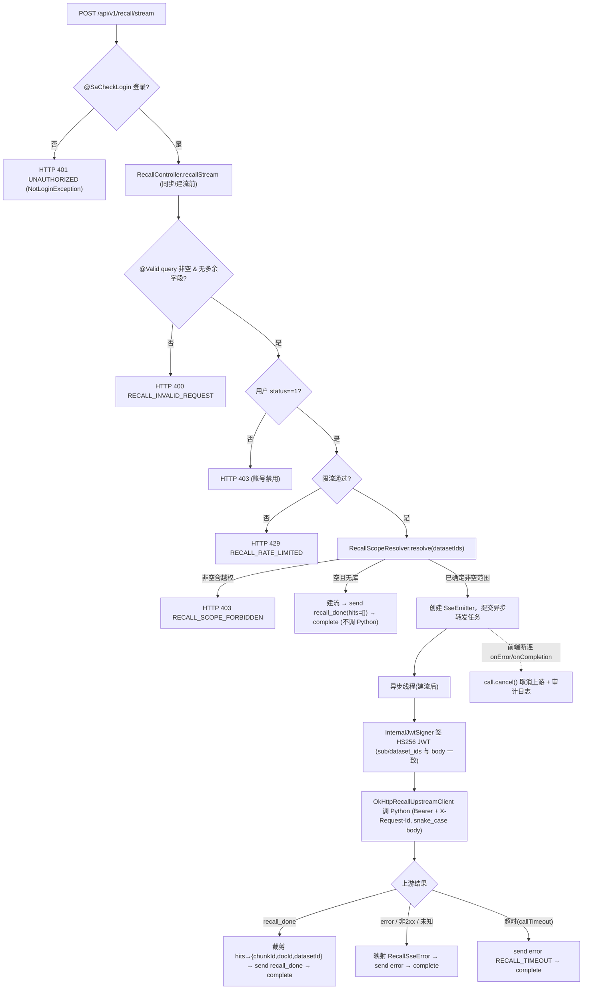

# Java 用户态召回 SSE 网关 技术设计

- **文档状态：** 技术方案待审核
- **项目名称：** toLink-Service
- **业务域：** 召回 / RAG 协作
- **需求名称：** recall-gateway
- **业务输入：** `docs/recall-gateway/brief.md`（已冻结）
- **验收输入：** `docs/recall-gateway/acceptance.feature`（已冻结，27 Scenario）
- **决策依据：** `docs/recall-gateway/feature_info.md`（范围决策 / brief 偏差登记，override brief 正文）
- **输出文件：** `docs/recall-gateway/technical_design.md`
- **最后更新时间：** 2026-05-30

---

## 1. 文档修订记录

| 版本号 | 修改日期 | 修改内容简述 | 来源/提出人 | 审核状态 |
| :--- | :--- | :--- | :--- | :--- |
| v1.0 | 2026-05-30 | 初始技术设计创建 | brief.md + acceptance.feature + feature_info.md | 待审核 |

---

## 2. 输入依据与设计目标

### 2.1 输入依据映射

| 输入来源 | 关键结论 | 技术设计承接方式 |
| :--- | :--- | :--- |
| `brief.md` | Java 作为用户态安全边界：登录/状态/dataset 权限校验后，签发内部 HS256 JWT，调用 Python `/api/v1/internal/recall/stream`，把结果裁剪为最小候选 SSE 转发 | 新增 `RecallController`(SSE 端点) + `RecallService`(校验/编排) + `RecallUpstreamClient`(okhttp 流式) + `InternalJwtSigner` + `RecallRateLimiter` |
| `acceptance.feature` | 27 Scenario：建流前校验(7) / datasetIds 展开(3) / body↔JWT 自洽(5) / recall_done 转发(2) / 错误映射(4) / 断连超时(4) / 不变量(2) | §7 方法级实现 + §10 测试映射逐条覆盖 |
| `feature_info.md` 决策① | 对前端 SSE `error.code` 用英文串码；对内沿用数字 `ErrorCode` | 新增 `ErrorCode` 召回段(30001+) 用于**建流前 HTTP**；新增 `RecallSseError` 枚举(英文码)用于**建流后 SSE**；二者命名对齐 |
| 决策② | 空 `datasetIds` = 当前用户全部库；无库返回空 hits 不调 Python；永不向 Python 传空 `dataset_ids` | `RecallScopeResolver.resolve()` 展开/校验；无库走 `emitEmptyDone` 短路 |
| 决策③ | 复用 `SysUser.status==1` | `RecallService` 同步段查 `SysUserMapper.selectById` |
| 决策④ | guava `RateLimiter` 单机按用户，默认 10/min | `RecallRateLimiter`(Guava `Cache<Long, RateLimiter>`) |
| 决策⑤ | Python 已知码透传，意外/非2xx 兜底 `RECALL_UPSTREAM_ERROR` | `RecallUpstreamClient` 解析 + `RecallSseError` 映射 |

### 2.2 技术目标

- 在 `link-api` 暴露 `POST /api/v1/recall/stream`（`text/event-stream`），作为前端唯一召回入口。
- **建流前**完成全部用户态校验，校验失败以 HTTP 错误返回（不建流、不签发 JWT、不调 Python）。
- **建流后**的任何错误统一以 SSE `error` 事件表达并关闭前端流。
- Java→Python 请求体 snake_case，且 `body.user_id`/`body.dataset_ids` 与内部 JWT `sub`/`dataset_ids` 自洽。
- 前端断连可靠 cancel 上游 okhttp call，无连接/线程泄漏。

### 2.3 非目标

- 前端直连 Python SSE（`LINK-40` 后续）。
- 普通一次性 JSON 召回、rerank/context/answer 链路。
- 系统级跨用户全库召回（需授权模型，本次不做）。
- Redis 分布式限流（首版单机）。

---

## 3. 改动范围

### 3.1 改动文件目录树

```text
toLink-Service/
├── link-model/src/main/java/com/qingluo/link/model/
│   ├── dto/request/RecallStreamRequest.java                 # [新增] 前端入参(camelCase, 拒绝未知字段)
│   ├── dto/internal/RecallUpstreamRequest.java              # [新增] 发往 Python 的 body(snake_case)
│   ├── dto/response/RecallHitDTO.java                       # [新增] 前端最小候选(chunkId/docId/datasetId)
│   ├── dto/response/RecallDoneEvent.java                    # [新增] SSE recall_done 载荷
│   ├── dto/response/RecallErrorEvent.java                   # [新增] SSE error 载荷(code/message)
│   ├── enums/ErrorCode.java                                 # [修改] 新增召回段 30001+
│   └── enums/RecallSseError.java                            # [新增] SSE 英文串码枚举 + 数字码映射
├── link-core/src/main/java/com/qingluo/link/core/
│   └── security/InternalJwtSigner.java                      # [新增] HS256 内部 JWT 签发(jjwt 0.9.1)
├── link-service/src/main/java/com/qingluo/link/service/
│   ├── RecallService.java                                   # [新增] 接口
│   ├── config/RecallProperties.java                         # [新增] @ConfigurationProperties(tolink.recall)
│   ├── recall/RecallServiceImpl.java                        # [新增] 校验/编排/SSE 转发
│   ├── recall/RecallScopeResolver.java                      # [新增] datasetIds 校验/展开
│   ├── recall/RecallRateLimiter.java                        # [新增] 按用户限流(guava)
│   ├── recall/RecallUpstreamClient.java                     # [新增] 接口(便于测试 mock)
│   └── recall/OkHttpRecallUpstreamClient.java               # [新增] okhttp 4.12.0 流式实现
├── link-api/src/main/java/com/qingluo/link/api/controller/
│   └── RecallController.java                                # [新增] POST /api/v1/recall/stream
├── link-core/src/main/java/com/qingluo/link/core/handler/
│   └── GlobalExceptionHandler.java                          # [修改] 新增 HttpMessageNotReadableException → 400
├── link-api/src/main/resources/
│   ├── application-local.yml                                # [修改] 新增 tolink.recall 段
│   └── application-dev.yml                                  # [修改] 新增 tolink.recall 段(env 占位)
└── docs/reference/api_contracts.md                          # [修改] 新增 Recall 章节
```

### 3.2 文件级改动说明

| 文件 | 动作 | 改动目的 | 是否必须 |
| :--- | :--- | :--- | :--- |
| `RecallController` | 新增 | SSE 端点，建流前同步校验，建流后委托 service | 是 |
| `RecallService` / `RecallServiceImpl` | 新增 | 校验编排 + SSE 转发主逻辑 | 是 |
| `RecallScopeResolver` | 新增 | datasetIds 归属校验 / 空列表展开本人全部库 | 是 |
| `RecallRateLimiter` | 新增 | 按用户单机限流 | 是 |
| `RecallUpstreamClient` / `OkHttpRecallUpstreamClient` | 新增 | 流式调用 Python 并解析上游 SSE；接口便于 mock | 是 |
| `InternalJwtSigner` | 新增 | HS256 签发内部 JWT | 是 |
| `RecallProperties` | 新增 | python-base-url / jwt-secret / 超时 / 限流阈值 / exp 配置化 | 是 |
| `RecallStreamRequest` / `RecallUpstreamRequest` / `RecallHitDTO` / `RecallDoneEvent` / `RecallErrorEvent` | 新增 | 入参与事件 DTO | 是 |
| `ErrorCode.java` | 修改 | 新增召回数字错误码段(建流前 HTTP) | 是 |
| `RecallSseError.java` | 新增 | SSE 英文串码 + 与数字码映射 | 是 |
| `GlobalExceptionHandler.java` | 修改 | 接 `HttpMessageNotReadableException`(多余字段/类型错误)→ 400 | 是 |
| `application-{local,dev}.yml` | 修改 | 新增 `tolink.recall` 配置 | 是 |
| `docs/reference/api_contracts.md` | 修改 | 契约同步：新增召回接口 | 是（doc-sync） |
| `.env.example`（若存在） | 修改 | 新增 `RECALL_*`、`RAG_PYTHON_BASE_URL` | 待确认 |

---

## 4. 当前系统分析

| 类型 | 文件/类/方法 | 当前行为 | 复用点 / 说明 |
| :--- | :--- | :--- | :--- |
| 登录态 | `@SaCheckLogin` + `AuthContext.getLoginUserIdOrThrow()` | 注解拦截未登录抛 `NotLoginException`；`AuthContext` 从 `StpUtil.getLoginId()` 取 userId | **复用**。未登录在方法返回 SseEmitter 前被拦截 → 天然建流前 HTTP 401 |
| 异常处理 | `GlobalExceptionHandler` | 处理 `BusinessException`(status+code+msg)、`NotLoginException`(401)、`MethodArgumentNotValidException`(400)、兜底 `Exception`(500) | **复用**；缺 `HttpMessageNotReadableException` 处理 → 需补 |
| 统一响应 | `Result<T>`(code/message/data) | `success(200)` / `error(code,message)` | **复用**于建流前 HTTP 错误 |
| 业务异常 | `BusinessException(ErrorCode)` / `(ErrorCode,msg)` / `(int,msg,int)` | 携带 code+httpStatus | **复用**；召回建流前抛此异常 |
| 错误码 | `ErrorCode` 枚举(数字+中文，10001/20001/50001 段) | — | **修改**：新增 30001 召回段 |
| dataset 归属 | `DatasetServiceImpl.getOwnedDataset(userId,datasetId)`(单个) / `DatasetMapper extends BaseMapper`(空) | LambdaQueryWrapper `eq(id)+eq(userId)` | **参考**；新增批量校验 `selectCount(in ids, eq userId)`、展开 `selectList(eq userId).map(id)` |
| 软删 | `Dataset.isDeleted` `@TableLogic` | MyBatis-Plus 查询自动过滤 is_deleted=1 | **复用**：展开/校验自动只算未删库 |
| 用户状态 | `AuthServiceImpl` `if(user.getStatus()!=1)`；`SysUser.status:Integer`；`SysUserMapper` | 登录时校验 status==1 | **复用**：召回同步段 `selectById(userId).getStatus()!=1` 则拒 |
| SSE | `DocumentParseSseServiceImpl`(MQ 驱动一对多广播，`Map<fileId,List<SseEmitter>>`) + `DocumentFileController` GET `produces=TEXT_EVENT_STREAM_VALUE` 返回 `SseEmitter` | onCompletion/onTimeout/onError + cleanup | **仅参考生命周期**；召回是请求级 1:1 代理，需异步线程读上游流转发，模型不同 |
| 配置 | `DocumentFileProperties` `@ConfigurationProperties(prefix="tolink.document-file")`；yml `${ENV:default}` | — | **参考**：新增 `RecallProperties(prefix=tolink.recall)` |
| 依赖 | okhttp `4.12.0`(link-api/oss)、jjwt `0.9.1`、guava `30.0-jre`、sa-token `1.39.0` | 均在 pom，okhttp/jjwt **无现有用法** | okhttp 无 `okhttp-sse`，采用手动读流解析 |
| 测试 | `DatasetControllerTest` `@SpringBootTest+@AutoConfigureMockMvc`，`StpUtil.login(id)` 真实登录取 token | — | **复用**测试骨架；SSE 异步用 `asyncDispatch` |

---

## 5. 总体方案设计

### 5.1 总体流程



### 5.2 模块边界

| 模块 | 职责 | 本次是否改动 |
| :--- | :--- | :--- |
| `link-api` | `RecallController`：路由、@SaCheckLogin、@Valid、建流；yml 配置 | 是（新增 Controller + 改 yml） |
| `link-service` | `RecallService` 校验编排、SSE 转发、限流、scope 解析、upstream client、Properties | 是（新增） |
| `link-core` | `InternalJwtSigner`；`GlobalExceptionHandler` 补 handler | 是（新增 + 修改） |
| `link-model` | 入参/事件/内部请求 DTO；`ErrorCode` 段；`RecallSseError` | 是（新增 + 修改） |
| `link-mapper` | `SysUserMapper`、`DatasetMapper`（均 BaseMapper，直接复用） | 否 |
| `link-components` | 无 | 否 |

---

## 6. API、消息与数据设计

### 6.1 API 设计

**前端接口（Java 对前端，camelCase）**

```http
POST /api/v1/recall/stream
satoken: <java-login-token>
Accept: text/event-stream
Content-Type: application/json

{ "query": "用户问题", "datasetIds": [1, 2] }
```

- 入参 `RecallStreamRequest`：`query`(`@NotBlank`)、`datasetIds`(`@NotNull List<Long>`，可为空列表)；`@JsonIgnoreProperties(ignoreUnknown=false)` 拒绝 `docIds/topK/sources/strict/includeContent` 等未知字段。
- 成功 SSE：`event: recall_done` / `data: {"hits":[{"chunkId":"1001","docId":10,"datasetId":1}]}`。
- 失败 SSE：`event: error` / `data: {"code":"RECALL_ALL_SOURCES_FAILED","message":"..."}`。
- 响应头：`Content-Type: text/event-stream`、`Cache-Control: no-cache`（在 Controller 通过 `HttpServletResponse` 设置；并依赖部署网关关闭缓冲）。

**建流前 HTTP 错误（双通道说明）**：建流前错误走 `GlobalExceptionHandler` 返回标准 `Result`（数字 `code` + 中文 `message` + HTTP status）。英文串码（`RecallSseError`）用于**建流后 SSE**。acceptance 中建流前场景标注的 `code=UNAUTHORIZED/RECALL_SCOPE_FORBIDDEN/RECALL_INVALID_REQUEST` 映射为「HTTP status + 对应数字 `ErrorCode`」；前端建流前靠 HTTP status 区分。（见 §12 待确认 1）

**内部接口（Java 对 Python，snake_case）**

```http
POST {tolink.recall.python-base-url}/api/v1/internal/recall/stream
Authorization: Bearer <internal-jwt>
X-Request-Id: <request-id>
Accept: text/event-stream
Content-Type: application/json

{ "query": "用户问题", "user_id": 123, "dataset_ids": [1, 2] }
```

内部 JWT（HS256）claims：`iss=tolink-java`、`aud=tolink-rag`、`sub=<userId 字符串>`、`scope=recall:execute`、`dataset_ids=<已校验范围>`、`jti=<request_id>`、`exp=<now + jwt-exp-seconds>`。

### 6.2 MQ 消息设计

无。本需求不涉及 MQ。

### 6.3 数据与存储设计

无表结构变更。读操作：
- `DatasetMapper`：`selectList(eq userId)`（展开本人全部库）、`selectCount(in ids, eq userId)`（归属校验）；`@TableLogic` 自动过滤软删。
- `SysUserMapper.selectById(userId)`：读 `status`。

### 6.4 配置设计

新增 `tolink.recall.*`（`RecallProperties`）：

| key | 默认 | env 占位 | 说明 |
| :--- | :--- | :--- | :--- |
| `python-base-url` | `http://localhost:8000` | `RAG_PYTHON_BASE_URL` | Python RAG 地址 |
| `internal-jwt-secret` | （本地联调示例值） | `RECALL_INTERNAL_JWT_SECRET` | HS256 共享密钥，Java/Python 一致 |
| `jwt-exp-seconds` | `30` | `RECALL_JWT_EXP_SECONDS` | JWT 短有效期 |
| `stream-timeout-ms` | `60000` | `RECALL_STREAM_TIMEOUT_MS` | 整体超时（okhttp callTimeout + SseEmitter timeout） |
| `connect-timeout-ms` | `3000` | `RECALL_CONNECT_TIMEOUT_MS` | 连接超时 |
| `read-timeout-ms` | `60000` | `RECALL_READ_TIMEOUT_MS` | 读取超时 |
| `rate-limit-per-minute` | `10` | `RECALL_RATE_LIMIT_PER_MINUTE` | 每用户每分钟上限 |

---

## 7. 方法级实现方案

### 7.1 方法级变更总表

| 文件 | 类/对象 | 方法/成员 | 动作 | 入参 | 返回 | 改动目的 | 对应 Scenario |
| :--- | :--- | :--- | :--- | :--- | :--- | :--- | :--- |
| RecallController | RecallController | `recallStream` | 新增 | `@Valid @RequestBody RecallStreamRequest`, `HttpServletResponse` | `SseEmitter` | 路由+建流前校验入口+设响应头 | 未登录/参数/多余字段/响应头/建流前不变量 |
| RecallServiceImpl | RecallService | `recall(Long userId, RecallStreamRequest)` | 新增 | userId, req | `SseEmitter` | 同步校验→建流→异步转发 | 状态/限流/scope/空库/转发全部 |
| RecallServiceImpl | RecallServiceImpl | `assertUserActive(userId)` | 新增 | userId | void(异常) | status!=1 拒 | 用户状态非正常 |
| RecallScopeResolver | RecallScopeResolver | `resolve(userId, datasetIds)` | 新增 | userId, List | `List<Long>`(非空范围) 或 EMPTY 标记 | 展开/校验归属 | 非空校验/空展开/无库/越权/永不空 |
| RecallRateLimiter | RecallRateLimiter | `tryAcquire(userId)` | 新增 | userId | boolean | 单机按用户限流 | 限流超阈/按用户隔离 |
| RecallServiceImpl | RecallServiceImpl | `streamFromUpstream(emitter, ctx)` | 新增 | emitter, 调用上下文 | void | 异步签JWT+调Python+转发 | recall_done/error/超时/非2xx/未知 |
| RecallServiceImpl | RecallServiceImpl | `emitDoneAndComplete` / `emitErrorAndComplete` | 新增 | emitter, payload | void | 裁剪/映射后发送并关流 | recall_done/各 error |
| InternalJwtSigner | InternalJwtSigner | `sign(userId, datasetIds, requestId)` | 新增 | userId, List, requestId | String(jwt) | HS256 签发自洽 claims | body↔JWT 自洽/HS256 claims |
| RecallUpstreamClient | RecallUpstreamClient | `stream(req, jwt, requestId, listener)` | 新增 | 内部请求, jwt, rid, listener | `RecallUpstreamCall`(可 cancel) | 流式调用抽象(可 mock) | 转发/超时/非2xx/断连 cancel |
| OkHttpRecallUpstreamClient | OkHttpRecallUpstreamClient | `stream(...)` | 新增 | 同上 | 同上 | okhttp 4.12 执行+解析上游 SSE | 同上 |
| ErrorCode | ErrorCode | `RECALL_*` 枚举值 | 新增 | — | — | 建流前 HTTP 数字码 | 建流前各错误 |
| RecallSseError | RecallSseError | 枚举 + `toEvent()` | 新增 | — | — | SSE 英文码 + 映射 | 建流后各 error |
| GlobalExceptionHandler | GlobalExceptionHandler | `handleNotReadable` | 新增 | `HttpMessageNotReadableException` | `ResponseEntity<Result>` 400 | 多余字段/类型错误→400 | query 类型错误/多余字段 |

### 7.2 逐方法实现设计

#### 7.2.1 `RecallController.recallStream`

- 修改后职责：仅做框架级校验与建流委托，保持极薄。
- 详细步骤：
  1. `@SaCheckLogin` 拦截未登录（建流前 401）。
  2. `@Valid` 触发 `query` 非空校验；`@JsonIgnoreProperties(ignoreUnknown=false)` 使多余字段在反序列化期抛 `HttpMessageNotReadableException`（建流前 400）。
  3. 设置 `response.setHeader("Cache-Control","no-cache")`（`Content-Type` 由 `produces` 决定）。
  4. `userId = AuthContext.getLoginUserIdOrThrow()`。
  5. `return recallService.recall(userId, request);`
- 异常边界：步骤 1–2 与 service 同步段抛出的异常均在返回 SseEmitter 前冒泡到 `GlobalExceptionHandler`（建流前 HTTP）。
- 对应测试：`RecallControllerTest`（建流前全部 + 响应头）。

#### 7.2.2 `RecallServiceImpl.recall`

- 详细步骤（**同步段 = 建流前**）：
  1. `assertUserActive(userId)`：`SysUserMapper.selectById(userId)`，`status==null||!=1` → `BusinessException(AUTH_DISABLED)`（403）。
  2. `if (!rateLimiter.tryAcquire(userId)) throw new BusinessException(RECALL_RATE_LIMITED)`（429）。
  3. `List<Long> scope = scopeResolver.resolve(userId, req.getDatasetIds())`：
     - 越权 → 抛 `RECALL_SCOPE_FORBIDDEN`（403）。
     - 空库标记 → 走步骤 5 的「空 done」。
  4. 创建 `SseEmitter(properties.getStreamTimeoutMs())`，注册 `onTimeout/onError/onCompletion`。
  5. **若 scope 为空库**：`emitDoneAndComplete(emitter, [])` 后直接 `return emitter`（不签 JWT、不调 Python）。
  6. 否则：`recallExecutor.submit(() -> streamFromUpstream(emitter, ctx))`，`ctx` 含 userId/query/scope/requestId。`return emitter`。
- 并发边界：每请求独立 emitter 与 okhttp call，无共享可变状态（区别于 `DocumentParseSseServiceImpl` 的共享 map）。
- 对应测试：`RecallServiceImplTest`（状态/限流/空库短路/提交异步）、`RecallControllerTest`（端到端建流后）。

#### 7.2.3 `RecallScopeResolver.resolve`

- 入参：`userId`, `datasetIds`(可空列表)。
- 返回：非空已校验 `List<Long>`；或 `ScopeResult.emptyOwnership()`（空库）。
- 步骤：
  - `datasetIds` 非空：`distinct`；`long owned = datasetMapper.selectCount(eq userId, in ids)`；`owned != ids.size()` → `BusinessException(RECALL_SCOPE_FORBIDDEN)`；否则返回 ids。
  - `datasetIds` 空：`List<Long> all = datasetMapper.selectList(eq userId).map(getId)`；`all.isEmpty()` → 返回空库标记；否则返回 all。
- 说明：`@TableLogic` 使软删库不计入（传入软删 id → owned 不足 → 越权）。
- 对应测试：`RecallScopeResolverTest`（非空归属/含越权/空展开/无库）。

#### 7.2.4 `RecallRateLimiter.tryAcquire`

- 实现：`Cache<Long, RateLimiter> limiters`（Guava `CacheBuilder` `expireAfterAccess(2,MIN)` 防内存泄漏）；`RateLimiter.create(perMinute/60.0)`；`limiters.get(userId, ()->create()).tryAcquire()`。
- 说明：单机近似「每分钟 N 次」（令牌桶按秒匀速）；按用户隔离。
- 对应测试：`RecallRateLimiterTest`（超阈返回 false / 不同用户独立）。

#### 7.2.5 `InternalJwtSigner.sign`

- jjwt 0.9.1 API：
  ```java
  Jwts.builder()
    .setIssuer("tolink-java").setAudience("tolink-rag")
    .setSubject(String.valueOf(userId))
    .claim("scope","recall:execute").claim("dataset_ids", datasetIds)
    .setId(requestId)
    .setExpiration(Date.from(Instant.now().plusSeconds(expSeconds)))
    .signWith(SignatureAlgorithm.HS256, secretKeyBytes)
    .compact();
  ```
- `sub`=String(userId)、`dataset_ids`=入参 scope（与 body 同源，保证自洽）。
- 密钥编码：见 §12 待确认 2（hex 字符串字节 vs hex 解码，需与 Python 对齐）。
- 对应测试：`InternalJwtSignerTest`（解析回 claims 断言 sub/dataset_ids/scope/alg=HS256/exp）。

#### 7.2.6 `OkHttpRecallUpstreamClient.stream`

- 用 `RecallProperties` 构建 `OkHttpClient`（connect/read/callTimeout）。`callTimeout=stream-timeout-ms` 作整体超时。
- `Request`：POST `{base}/api/v1/internal/recall/stream`，header `Authorization: Bearer <jwt>`、`X-Request-Id`、`Accept: text/event-stream`；body=snake_case JSON。
- 执行：专用线程内 `Call call = client.newCall(req); Response resp = call.execute();`
  - `resp.code() 非 2xx` → `listener.onUpstreamHttpError(code)`（建流后映射）。
  - 2xx → `BufferedSource src = resp.body().source()`，逐行 `readUtf8Line()` 解析 SSE（`event:`/`data:`），聚合一条完整事件后回调 `onRecallDone(json)` / `onUpstreamError(code,msg)`。
  - `IOException`（含 cancel/超时）→ 区分：`call.isCanceled()` → 静默（断连）；`SocketTimeoutException`/`InterruptedIOException` → `onTimeout()`；其他 → `onUnknownError()`。
- 返回 `RecallUpstreamCall` 持有 `call`，`cancel()` → `call.cancel()`。
- 对应测试：`OkHttpRecallUpstreamClientTest`（MockWebServer 注入 recall_done / error / 401 / 慢响应；可选集成）。**单元测试**主要 mock `RecallUpstreamClient` 接口。

#### 7.2.7 `RecallServiceImpl.streamFromUpstream`（建流后转发）

- 步骤：
  1. `jwt = jwtSigner.sign(userId, scope, requestId)`。
  2. `RecallUpstreamRequest up = {query, user_id=userId, dataset_ids=scope}`（断言：与 jwt 自洽）。
  3. `RecallUpstreamCall call = upstreamClient.stream(up, jwt, requestId, listener)`，把 `call` 绑定到 emitter 的 `onError/onCompletion/onTimeout` → `call.cancel()` + 审计日志。
  4. listener 回调：
     - `onRecallDone(hits)`：裁剪每项为 `RecallHitDTO{chunkId,docId,datasetId}`（保持顺序，丢弃 fused_score/scores/failed_sources，可记日志/指标）→ `emitDoneAndComplete`。
     - `onUpstreamError(code,msg)`：`RecallSseError.fromUpstream(code)` 透传已知码、未知兜底 `RECALL_UPSTREAM_ERROR` → `emitErrorAndComplete`（不含堆栈）。
     - `onUpstreamHttpError(httpStatus)`：401/403→`RECALL_INTERNAL_AUTH_FAILED`、504→`RECALL_TIMEOUT`、其他→`RECALL_UPSTREAM_ERROR`；记录 status+requestId → `emitErrorAndComplete`。
     - `onTimeout()`：`RECALL_TIMEOUT`。
- 对应测试：`RecallServiceImplTest` 用 mock `RecallUpstreamClient` 驱动各回调。

#### 7.2.8 `GlobalExceptionHandler.handleNotReadable`（修改）

- 新增 `@ExceptionHandler(HttpMessageNotReadableException.class)` → `ResponseEntity.badRequest().body(Result.error(RECALL_INVALID_REQUEST.getCode(), "请求参数不合法"))`。
- 说明：覆盖「多余字段」「query 类型错误」反序列化失败；为通用增强（其它接口同样受益）。
- 对应测试：`RecallControllerTest`（多余字段 Outline / query 非字符串）。

---

## 8. 组件与集成设计

- **okhttp 流式（无 okhttp-sse）**：手动 `readUtf8Line()` 解析。Python 首版每次仅一条 `recall_done` 或 `error` 事件后结束，解析简单、可控；不新增依赖。（备选：引 `com.squareup.okhttp3:okhttp-sse:4.12.0` 用 `EventSource`，见 §12。）
- **线程模型**：新增 `recallExecutor`（专用 `ThreadPoolTaskExecutor`，IO 型，线程名 `recall-stream-`），避免阻塞 web 容器线程。可参考 `document-upload-async` 的多池配置；首版独立小池（core=8,max=32,queue 有界，拒绝→直接 SSE error）。
- **JWT**：jjwt 0.9.1（旧 API `signWith(alg, key)`）。
- **限流**：guava `RateLimiter` + `Cache` 容器。

---

## 9. 异常处理与降级策略

| 异常场景 | 处理方式 | 通道 | SSE code / HTTP |
| :--- | :--- | :--- | :--- |
| 未登录 | `@SaCheckLogin`→`NotLoginException` | 建流前 HTTP | 401 |
| 用户禁用(status!=1) | `BusinessException(AUTH_DISABLED)` | 建流前 HTTP | 403 |
| query 空/空白 | `@Valid`→`MethodArgumentNotValidException` | 建流前 HTTP | 400 |
| 多余字段/类型错误 | `@JsonIgnoreProperties`→`HttpMessageNotReadableException` | 建流前 HTTP | 400 |
| datasetIds 越权 | `BusinessException(RECALL_SCOPE_FORBIDDEN)` | 建流前 HTTP | 403 |
| 限流超阈 | `BusinessException(RECALL_RATE_LIMITED)` | 建流前 HTTP | 429 |
| 无库（空展开） | 直接 `recall_done` 空 hits | 建流后 SSE | recall_done |
| Python error 已知码 | 透传 | 建流后 SSE | 原码（如 RECALL_ALL_SOURCES_FAILED） |
| Python 401/403 | 映射 | 建流后 SSE | RECALL_INTERNAL_AUTH_FAILED |
| Python 504 / 超时 | 映射 | 建流后 SSE | RECALL_TIMEOUT |
| Python 500/502/未知/解析失败 | 兜底，不暴露堆栈 | 建流后 SSE | RECALL_UPSTREAM_ERROR |
| 前端断连 | `onError/onCompletion`→`call.cancel()`+审计 | 非业务错误 | 无 |

---

## 10. 测试方案

### 10.1 方法级测试映射

| 被测 | 测试文件 | 手段 | 断言要点 |
| :--- | :--- | :--- | :--- |
| RecallController 建流前 | `link-api/.../RecallControllerTest` | `@SpringBootTest+@AutoConfigureMockMvc`，`StpUtil.login` | HTTP 401/403/400/429；不调 Python（`@MockBean RecallUpstreamClient` verify 无交互）；响应头 |
| RecallController 建流后 | 同上 | `asyncDispatch` + `@MockBean` 上游驱动事件 | SSE 含 `event:recall_done`/`error`，字段裁剪，关流 |
| RecallServiceImpl | `link-service/.../RecallServiceImplTest` | Mockito mock mapper/limiter/client/signer | 状态/限流/空库短路/JWT 自洽/各 error 映射 |
| RecallScopeResolver | `RecallScopeResolverTest` | Mockito mock DatasetMapper | 非空归属/越权/空展开/无库 |
| RecallRateLimiter | `RecallRateLimiterTest` | 真实 guava | 超阈 false / 用户隔离 |
| InternalJwtSigner | `InternalJwtSignerTest` | jjwt 解析 | sub/dataset_ids/scope/alg/exp |
| OkHttpRecallUpstreamClient | `OkHttpRecallUpstreamClientTest` | `MockWebServer`（okhttp 自带） | recall_done/error/401/超时/cancel 解析 |

### 10.2 Scenario 覆盖自检

| # | Scenario | 承接方法 | 承接测试 | 覆盖 |
| :-- | :--- | :--- | :--- | :--: |
| 1 | 未登录拒绝且不触达 Python | @SaCheckLogin | RecallControllerTest | ✅ |
| 2 | 用户状态非正常拒绝 | assertUserActive | RecallControllerTest/ServiceImplTest | ✅ |
| 3 | datasetIds 越权拒绝 | scopeResolver.resolve | RecallScopeResolverTest/ControllerTest | ✅ |
| 4 | query 非法(Outline×4) | @Valid + handleNotReadable | RecallControllerTest | ✅ |
| 5 | 多余字段拒绝(Outline×5) | @JsonIgnoreProperties + handleNotReadable | RecallControllerTest | ✅ |
| 6 | 限流超阈建流前拒 | rateLimiter.tryAcquire | RateLimiterTest/ControllerTest | ✅ |
| 7 | 限流按用户隔离 | rateLimiter.tryAcquire | RateLimiterTest | ✅ |
| 8 | 非空 datasetIds 按范围召回 | resolve→up.dataset_ids | ServiceImplTest | ✅ |
| 9 | 空 datasetIds 展开全部库 | resolve(空) | ScopeResolverTest/ServiceImplTest | ✅ |
| 10 | 无库返回空 hits 不调 Python | recall 空库短路 | ServiceImplTest/ControllerTest | ✅ |
| 11 | snake_case + 不透传 satoken | streamFromUpstream/up DTO | ServiceImplTest（捕获 up 请求） | ✅ |
| 12 | user_id 与 JWT sub 一致 | signer.sign + up | ServiceImplTest/SignerTest | ✅ |
| 13 | dataset_ids 与 JWT 一致 | signer.sign + up | ServiceImplTest/SignerTest | ✅ |
| 14 | HS256 + claims | signer.sign | InternalJwtSignerTest | ✅ |
| 15 | 空展开后 JWT/body 非空一致 | resolve+sign | ServiceImplTest | ✅ |
| 16 | recall_done 最小候选+保序+关流 | emitDoneAndComplete | ServiceImplTest/ControllerTest | ✅ |
| 17 | 降级元信息不外泄 | 裁剪逻辑 | ServiceImplTest | ✅ |
| 18 | 全路失败 error 透传 | RecallSseError.fromUpstream | ServiceImplTest | ✅ |
| 19 | 超时→RECALL_TIMEOUT | onTimeout | ServiceImplTest/UpstreamClientTest | ✅ |
| 20 | 非2xx 映射(Outline) | onUpstreamHttpError | ServiceImplTest | ✅ |
| 21 | 未知错误兜底不暴露堆栈 | onUnknownError | ServiceImplTest | ✅ |
| 22 | 前端断连取消 Python | emitter.onError→call.cancel | ServiceImplTest（验证 cancel）/UpstreamClientTest | ✅ |
| 23 | Python 结束关前端 SSE | emit*Complete | ServiceImplTest | ✅ |
| 24 | 响应头 SSE/no-cache/无缓冲 | Controller 设头 | RecallControllerTest（断言 header） | ✅ |
| 25 | 连接/读取/整体超时 | OkHttpClient 配置 | UpstreamClientTest / 配置断言 | ✅ |
| 26 | 建流前失败不触达Python/不签JWT | 同步段顺序 | ServiceImplTest（verifyNoInteractions） | ✅ |
| 27 | 永不向 Python 发空 dataset_ids | resolve 保证非空 | ScopeResolverTest/ServiceImplTest | ✅ |

> 27/27 覆盖。SSE 异步断言通过 `MockMvc` `request().asyncStarted()`+`asyncDispatch()`；上游用 `@MockBean RecallUpstreamClient` 注入事件，避免真实网络。

### 10.3 回归命令

```bash
mvn -pl link-service test
mvn -pl link-api test
mvn test
python3 scripts/check_docs_sync.py --working
python3 scripts/check_ai_links.py
```

---

## 11. 发布与回滚

- **发布**：纯新增接口 + 一个通用异常 handler 增强 + 配置项，不改表、不改 MQ。需在各环境配置 `RAG_PYTHON_BASE_URL`、`RECALL_INTERNAL_JWT_SECRET`（与 Python 一致）。部署网关需对 `/api/v1/recall/stream` 关闭响应缓冲。
- **回滚**：移除/不暴露 `RecallController` 即可（其余为新增类，无副作用）；`GlobalExceptionHandler` 的 `HttpMessageNotReadableException` handler 为向后兼容增强，可保留。

---

## 12. 风险与待确认问题

| # | 风险/问题 | 影响 | 建议处理 |
| :-- | :--- | :--- | :--- |
| 1 | 建流前 HTTP 错误是否需携带英文串码 | 前端建流前/后两套 code 通道 | 首版：建流前 HTTP=数字 code+status，英文码仅 SSE；若前端要统一可在 `Result` 扩展（需产品确认） |
| 2 | 内部 JWT 密钥编码方式 | Java/Python 验签不一致则全失败 | 与 Python 对齐：secret 当作 UTF-8 字节 or hex 解码字节；联调前敲定（关联 `.specs/recall-http-api/brief.md`） |
| 3 | Python `recall_done` 实际字段名/层级 | 裁剪解析依赖 hits 内字段 (`chunk_id/doc_id/dataset_id`) | 以 Python brief 为准核对，必要时调整解析 |
| 4 | 兜底码命名 `RECALL_UPSTREAM_ERROR` | 前端契约 | 确认命名；若已有约定则替换 |
| 5 | okhttp 手动解析 vs okhttp-sse | 维护成本 | 首版手动解析；若 Python 事件变复杂再引 okhttp-sse |
| 6 | recall 线程池大小/拒绝策略 | 高并发长连接资源 | 有界池 + 拒绝即 SSE error；阈值随压测调整（与 brief §9 一致，长连接资源风险首版接受） |
| 7 | 用户 `status` 语义 | 误拒/漏拒 | 复用登录口径 `==1`；若有更多状态值需补充映射 |

---

## 13. 实施顺序

1. `link-model`：`ErrorCode` 召回段、`RecallSseError`、`RecallStreamRequest`、`RecallUpstreamRequest`、`RecallHitDTO`、`RecallDoneEvent`、`RecallErrorEvent`。
2. `link-core`：`InternalJwtSigner` + `InternalJwtSignerTest`；`GlobalExceptionHandler` 补 handler。
3. `link-service`：`RecallProperties`、`RecallScopeResolver`、`RecallRateLimiter`、`RecallUpstreamClient`/`OkHttpRecallUpstreamClient`、`RecallService`/`RecallServiceImpl`、`recallExecutor` 配置；对应单测。
4. `link-api`：`RecallController` + `RecallControllerTest`（建流前 + asyncDispatch 建流后）。
5. `application-{local,dev}.yml` + `.env.example` 配置。
6. 全量 `mvn test` + 文档同步校验。
7. `docs/reference/api_contracts.md` 新增召回章节。

---

## 14. 人工审核清单

- [ ] 改动文件目录树已确认（§3.1）
- [ ] 方法级变更总表已确认（§7.1）
- [ ] 建流前 HTTP / 建流后 SSE 双通道错误表达已确认（§6.1、§12-1）
- [ ] 内部 JWT 密钥编码与 Python 对齐方案已确认（§12-2）
- [ ] 27 Scenario 覆盖自检已确认（§10.2）
- [ ] 配置项与 env 占位已确认（§6.4）
- [ ] 测试方案（SSE 异步 + 上游 mock）已确认（§10）
