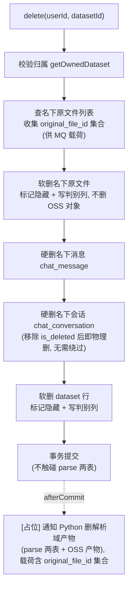
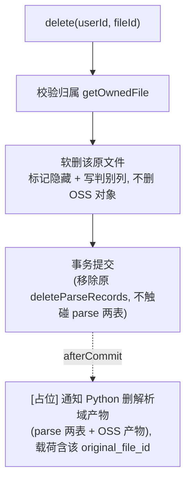
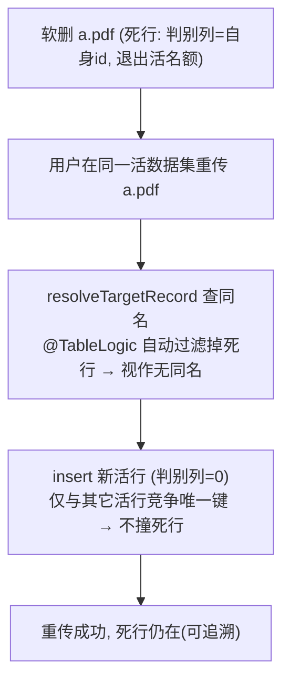

# soft-delete-dataset-file Brief

> 来源：GitHub issue ql-link/LinkRag-Service#27「删除链路：数据集/文件改为隐性删除（软删隐藏原文件 + 预留 MQ 通知 Python 删除产物）」。
> 该 issue 取代 #1 的 P2「并行硬删 OSS」设想——#1 P2 的前提（删除需物理删 OSS、需并行化）是错的；本项目删除应为**隐性删除（软删保留原文件）**，不物理删原文件，自然不存在「串行硬删 OSS 要并行化」的问题。
> 本 Brief 已对照真实代码核实现状（两个删除入口确为硬删、`@TableLogic` 现状、两张目标表的唯一键、同名复用与 afterCommit 既有模式、parse 两表的读写归属、会话/消息删除现状）。

## 0. 现状前提（决定范围的关键事实，已核实）

- **两个删除入口当前都是物理硬删**：
  - 数据集删除 `DatasetServiceImpl.delete()`（约 127–167 行）：循环对名下原文件调用 `ossService.deleteFile(PRIVATE, objectKey)` **物理删 OSS 对象** + `evictPrivateFile`，再 `documentOriginalFileMapper.delete(...)` / `chatConversationMapper.delete(...)` / `datasetMapper.deleteById(...)` 删 DB 行。
  - 文件删除 `DocumentFileServiceImpl.delete()`（约 212–236 行）：先物理删 OSS 对象 + `evictPrivateFile`，再 `deleteParseRecords(...)` 硬删解析派生行、`documentOriginalFileMapper.deleteById(...)` 硬删原文件行。
  - 两者都与「保留原文件 + 隐藏」目标完全相反，需改造。
- **软删能力本次从「会话」迁移聚焦到「原文件/数据集」**：`@TableLogic` 是 MyBatis-Plus 标准逻辑删除；`chat_conversation` 当前正用它（`ChatConversation` 带 `@TableLogic @TableField("is_deleted")`，约 49–51 行；`docs/db/init.sql` 中 `is_deleted COMMENT '软删除标记'`，且列表索引 `idx_chat_conversation_user_active_list (user_id, is_deleted, is_pinned, updated_at)` 含该列）。**本需求反而移除 `chat_conversation` 的软删（会话改纯物理删）**，同时把同一 `@TableLogic` 模式**新接到** `dataset` / `document_original_file`——即软删能力聚焦到唯一要保留的资产上（见 §3.1、§3.4）。
- **两张目标表都有唯一键，且当前都没有软删字段**（关键约束）：
  - `dataset`：`uk_dataset_user_name (user_id, name)`。
  - `document_original_file`：`uk_dataset_user_name_suffix (dataset_id, user_id, original_filename, file_suffix)`。
  - issue 原文只点了 `document_original_file` 的唯一键，**漏了 `dataset` 这张表**——数据集也有同名唯一键，软删后同名重建会撞，需一并处理。
- **`@TableLogic` 的机制边界**（本需求最大技术难点的根因）：MyBatis-Plus 的逻辑删除只影响 **ORM 层**——读查询自动追加 `AND is_deleted = 0`、`delete` 自动转 `UPDATE is_deleted = 1`、**`insert` 不受影响**；而**数据库唯一约束在 DB 层对所有物理行强制生效，软删死行仍占着唯一键名额**。因此「软删后重建/重传同名」会撞唯一约束（死行还在），这正是 issue 所警示的「删完无法重传同名」。
- **文件同名重传的复用逻辑已存在**（#26 引入）：`DocumentFileServiceImpl.resolveTargetRecord()`（约 125 行）已处理同名分流——撞到的同名记录为 `failed` 则复用旧行重置 `uploading`，为 `uploading`/`success` 则 400 拦截，无同名则 insert 新行；注释明确「受 `uk_dataset_user_name_suffix` 约束只能复用旧行」。本需求需与该逻辑兼容（软删行对它不可见，详见 §3.4）。
- **会话/消息删除现状**：单删会话 `ChatServiceImpl.deleteConversation()`（约 160 行）当前 `conversationMapper.deleteById()` 是**软删**（`@TableLogic`），同时 `messageMapper.delete(...)` **硬删**消息（`ChatMessage` 无软删字段）。即会话现状是「半软半硬」、且消息已硬删使会话软删并不能真正恢复。
- **afterCommit 投递模式已有先例**：上传链路用 `TransactionSynchronizationManager.registerSynchronization(...afterCommit...)` 在事务提交后才投递异步任务 / 解析 MQ。本需求的「通知 Python 删产物」沿用同一时机（事务提交后才发，回滚不误发）。
- **解析两表的读写归属（已核实，决定其删除归谁）**：
  - `document_parsed_log`：Java 端**全程不写**（全仓无 insert/update），由 **Python 写入**终态与 Markdown 产物定位，Java 只读校验 / 补推 SSE。
  - `document_parse_file`：Java 端**建壳**（`DocumentUploadStatusWriter` 在上传成功时 insert）并更新 `latest_parse_task_id`（`DocumentParseTaskServiceImpl`），Python **维护其终态**。
  - 两表都是**解析域派生数据**，且与 Python 侧 OSS 产物（Markdown、向量等）紧耦合——删除应整体归 Python（见 §1、§3.4）。
- **现有 MQ 契约风格**：`DocumentParseTaskMQ`→`tolink.rag.parse_task`（Java→Python，扁平 JSON）、`DocumentParseResultMQ`→`tolink.rag.parse_result`（Python→Java）。未来的「删除通知」producer 可仿此风格（本需求仅占位，不落地）。
- **schema 事实来源**：MySQL DDL 真源是 `docs/db/init.sql`；本地运行/测试 H2 schema 是 `link-api/src/main/resources/schema.sql`；文档契约是 `docs/reference/mysql_schema.md`。表结构变更须四处同步（init.sql + H2 schema + Entity + mysql_schema.md）。

## 1. 需求摘要

### 做什么

把「删除数据集」和「删除单个文件」从**物理硬删**改为**隐性删除（软删）**，核心是**保留用户上传的原文件**（DB 行 + OSS 对象都不物理删），其余衍生数据按域分别处理，并把删除语义统一为「**只有原文件/数据集软删保留，其余一律物理删**」，再为「通知 Python 删它那侧的衍生产物」预留发送时机：

1. **原文件软删保留**：`dataset`、`document_original_file` 两表接入 `@TableLogic` 软删；删除时只标记隐藏，**移除 `ossService.deleteFile` 物理删 OSS**，原文件对象本体保留（便于追溯 / 未来恢复）。
2. **唯一键判别列**：为两表的唯一键引入一个「判别列」，让软删死行不再占用「活记录」的唯一名额，从而**删完同名仍可重新创建 / 重新上传**（见 §3.1、§3.4）。
3. **衍生数据按域处理**：
   - **会话/消息（Java 自己域）一律物理硬删**：删数据集时硬删名下 `chat_conversation` + `chat_message`；并**移除 `chat_conversation` 的 `is_deleted`/`@TableLogic`**，使单删会话与级联删都成为物理硬删（不再需要绕过逻辑删）。`chat_message` 本就无软删字段。
   - **解析域整体交 Python**：`document_parse_file` / `document_parsed_log` 两张表 + Python 侧 OSS 产物（清洗文件、向量等）由 **Python 删**，随下面的 MQ 通知一起（本次占位、不实现）。Java 删除路径本次起**不再触碰 parse 表**（移除现有 `deleteParseRecords`）。
   - 原则一句话——**只保留原文件/数据集；Java 物理清掉会话/消息，整个解析域交 Python 清理。**
4. **预留 MQ 通知 Python（占位，纯设计预留）**：在删除事务提交后（afterCommit）预留「通知 Python 删除其侧衍生产物 + parse 两表」的发送点与载荷要点（被软删的 `original_file_id` 集合）；**本次只做设计预留（发送点 + 载荷要点 + 留痕日志/TODO 扩展点），不落地 producer / topic / 消息体，不实现 Python 侧**（单独立项）。

### 为什么做

- 现状硬删会**不可逆地销毁用户上传的原文件**（物理删 OSS + 删 DB 行），没有追溯 / 恢复余地；隐性删除保留原文件本体，风险更可控。
- 删除语义需统一到「以数据集为基础单位」的当前模型：早期以「对话」为基础单位，现在删数据集即应连同其会话/消息一起清掉，只把**原文件**作为需要保留的资产——会话不再需要软删，其 `is_deleted` 成为无用且易误解的字段。
- 校正 #1 P2 的错误前提（删除不应物理删 OSS，也就不需要并行化硬删）。

### 本次不做

- **不实现 MQ 通知 Python 的契约与 Python 侧产物删除**：仅在方案中预留发送时机与载荷要点（纯设计预留 / 占位），消息体 / topic / 幂等 / 重试与 Python 消费端单独立项。
- **本次起 Java 删除路径不再删 parse 两表**：`document_parse_file` / `document_parsed_log` 的删除随 Python OSS 产物一起延后到未来的 MQ 清理。**已知后果**：本次上线后，被删原文件的 parse 两表行 + Python 侧 OSS 产物都会暂时滞留（无人清理），属分阶段铺垫的已知缺口；滞留行为惰性数据，不影响活记录（见 §4）。
- **不提供用户可见的「回收站 / 恢复」功能**：软删只为后端追溯 / 未来恢复铺垫；本次不做恢复 UI / 接口。
- **不做隐藏原文件的定期物理清理（冷数据 GC）**：「隐藏超过 N 天物理清理」策略后续再议。
- **不改删除 / 创建 / 上传接口的对外形态**：删除接口的 URL、入参、HTTP 返回不变（前端对软删无感——删除后列表不再出现即可）。
- **不改 Python 端、不改既有 MQ 契约（`parse_task` / `parse_result` / `cache.evict`）、不改解析链路语义**。
- **不动缓存补偿 / MQ 投递重试**等 #1 其余项。

## 2. 业务流程

### 2.1 主流程图

**删数据集（隐性删除 + 级联）**

**删单个文件（隐性删除）**

**删后重建 / 重传同名（判别列让它走通）**

### 2.2 流程详解

- **保留原文件**：删除路径**移除所有 `ossService.deleteFile`**，OSS 原文件对象保留；原文件 DB 行只置隐藏，不物理删。
- **级联范围（数据集删除）**：先软删名下原文件，再硬删名下消息、会话，最后软删数据集行本身。**会话表去掉 `is_deleted`/`@TableLogic` 后，单删与级联删都是干净的物理硬删**（不再需要绕过逻辑删）。**解析域两表不在 Java 删除范围内**，交 Python 随 MQ 清理。
- **事务边界**：整个删除在一个事务内完成 DB 侧软删/硬删；「通知 Python」放到 **afterCommit** 才发，事务回滚则不发（避免误通知 Python 删一个其实没删成的文件）。
- **同名重建 / 重传**：依赖 `@TableLogic` 自动过滤——死行对所有读查询（列表、详情、同名校验、`resolveTargetRecord` 的 `selectOne`）都不可见；配合判别列让死行退出唯一键的「活名额」，重建/重传走原 insert 新行路径即可（见 §3.4）。

### 2.3 各表删除语义矩阵

| 表 / 资源 | 删数据集时 | 删单个文件时 | 语义 | 说明 |
| --- | --- | --- | --- | --- |
| `document_original_file` | **软删**（隐藏 + 判别列） | **软删**（隐藏 + 判别列） | 保留 | 唯一要保留的资产；OSS 对象一并保留（不删） |
| `dataset` | **软删**（隐藏 + 判别列） | — | 保留 | 保留空壳，便于整集追溯 / 未来恢复 |
| OSS 原文件对象 | **保留**（不删） | **保留**（不删） | 保留 | 随原文件软删一起保留 |
| `chat_message` | **硬删** | — | 删除 | 本就无软删字段 |
| `chat_conversation` | **硬删** | — | 删除 | **本次移除其 `is_deleted`/`@TableLogic`**，单删/级联都为物理删 |
| `document_parse_file` | **Python 删**（占位/延后） | **Python 删**（占位/延后） | 待删 | Java 建壳/Python 维护；本次 Java 不删，交 Python 随 MQ 清理 |
| `document_parsed_log` | **Python 删**（占位/延后） | **Python 删**（占位/延后） | 待删 | 纯 Python 写入；本次 Java 不删，交 Python 随 MQ 清理 |
| Python 侧 OSS 产物（清洗文件/向量等） | **Python 删**（占位/延后） | **Python 删**（占位/延后） | 待删 | 与 parse 两表打包，随删除通知一起删 |

## 3. 核心模块与实现思路

### 3.1 软删字段 + 唯一键判别列（`link-model` + DB schema）

- **位置**：`Dataset` / `DocumentOriginalFile` 实体（`link-model/.../entity`）；DDL `docs/db/init.sql` + H2 `link-api/src/main/resources/schema.sql`；契约 `docs/reference/mysql_schema.md`。
- **新增能力（已决策）**：两表加 `@TableLogic @TableField("is_deleted")`（读查询自动过滤、`delete` 自动转软删）。但仅加布尔软删字段**不足以**解决同名重建——死行仍占唯一键。再引入一个**判别列纳入唯一键**：活记录在该列取统一值（如 0）从而正常互斥；删除时把该列置为**该行专属的唯一值（如自身主键 id）**，使死行从「活名额」中退出、且历史多条死行彼此不冲突。
  - **为什么不是「把 `is_deleted` 布尔纳入唯一键」**：布尔维度只能撑一轮——`删→重传→再删` 会出现两条 `is_deleted=1` 的同名死行再次相撞。必须用「每次删除唯一」的判别值（主键 id 最稳，时间戳在级联同刻删多行时理论可撞）。
  - **效果**：`删→重传`可无限循环，每条死行完整保留（连同各自的 `object_key`/OSS 对象，追溯 / 恢复），重传走原 insert 新行、不复用不覆盖、OSS 不留孤儿。
  - 两表同构处理：`dataset` 唯一键纳入判别列、`document_original_file` 唯一键纳入判别列。
- **`@TableLogic` 与判别列的协作**：保留 `@TableLogic` 主要为了**读自动过滤**；但逻辑删的自动 `delete→update` 只会写 `is_deleted`、不会写判别列，故删除动作需**同时写入判别列**（默认推荐显式 `UPDATE set is_deleted=1, 判别列=id`；MP 会给 wrapper update 的 WHERE 自动追加 `is_deleted=0` 实现幂等）。生成列方案（活=0/删=NULL 靠 NULL 唯一性）为备选但依赖 DB 特性，列名/类型/索引迁移 DDL 留待 technical_design 定。
- **数据迁移**：存量行加 `is_deleted` 默认「未删」、判别列默认活值；旧唯一键替换为含判别列的新唯一键——因存量行都是活记录、原唯一键本就互斥，迁移不会撞已有重复（低风险，但需在 TD/迁移脚本中明确「先建新唯一键再删旧唯一键」的顺序）。

### 3.2 数据集删除链路改造（`link-service`）

- **位置**：`DatasetServiceImpl.delete()`。
- **改造**：移除对名下原文件的 `ossService.deleteFile` + `evictPrivateFile` 物理删；原文件由硬删改为**软删**（标记隐藏 + 判别列，建议批量更新名下活行）；消息与会话保持**物理硬删**（会话去 `@TableLogic` 后，`chatConversationMapper.delete(by dataset_id)` 天然为物理删，无需绕过）；数据集行由 `deleteById` 改为**软删**。
- **不再触碰 parse 表**：当前数据集删除本就未清理名下文件的解析派生行；本次维持「不碰」并明确其归属——交 Python 随 MQ 清理（不在 Java 删除事务内）。
- **MQ 载荷收集**：删除前已查名下原文件列表，顺带收集其 `original_file_id` 集合，供 afterCommit 占位通知使用。

### 3.3 文件删除链路改造（`link-service`）

- **位置**：`DocumentFileServiceImpl.delete()`。
- **改造**：移除 `ossService.deleteFile` + `evictPrivateFile` 物理删；原文件行由 `deleteById` 改为**软删**（标记隐藏 + 判别列）；**移除 `deleteParseRecords(...)`**——`document_parse_file` / `document_parsed_log` 的删除交 Python（随 MQ 清理），Java 删除路径不再触碰。
- **取舍说明（诚实标注）**：`document_parse_file` 由 Java 建壳，但其删除随解析域整体归 Python；这是「建/删不同方」的轻微不对称，换来「parse 行 + 其定位的 OSS 产物由单一方删，避免 split-brain」的一致性。若 TD 阶段认为 Java 自删 parse_file 壳更合适，可再细化（属实现级，不影响本需求验收语义）。
- **缓存**：软删保留 OSS 对象后，`evictPrivateFile` 不再是「删完必须清」的正确性要求；是否仍清本地缓存（释放磁盘）属实现细节，留待 TD。

### 3.4 会话表去软删（chat 域，`link-model` + `link-service` + DB schema）

- **位置**：`ChatConversation` 实体；`ChatServiceImpl`（`deleteConversation` / `getConversations` / `getOwnedConversation`）；`DatasetServiceImpl` 级联；DDL 三处 + `docs/reference/mysql_schema.md`。
- **改造**：
  - 实体移除 `isDeleted` 字段 + `@TableLogic` + `@TableField("is_deleted")`。
  - 单删会话 `deleteConversation` 的 `deleteById` 自动变**物理硬删**（与早就硬删的消息一致），无需改逻辑。
  - 数据集级联删会话自动变**物理硬删**，无需绕过逻辑删。
  - 列表/详情查询不引用 `is_deleted`，迁移后无隐藏行 → 行为不变、无代码改动；索引 `idx_chat_conversation_user_active_list` 去掉 `is_deleted` → `(user_id, is_pinned, updated_at)`。
- **迁移顺序（关键）**：**先物理删除存量 `is_deleted=1` 的会话行，再 `DROP` 该列**并改索引；否则列一删、过滤消失，原本隐藏的已删会话会复活到用户列表（见 §4）。
- **行为变化**：单删会话由「软删隐藏」变「物理删」。因消息本就硬删、会话软删并无真正可恢复性，故变硬删更干净、语义统一；属既有功能语义变化，已与用户确认符合预期。

### 3.5 读路径与同名重建 / 重传（`@TableLogic` 自动过滤 + 判别列）

- **读路径自动隐藏死行**：加 `@TableLogic` 后，`dataset` / `document_original_file` 的列表、详情、归属校验、`resolveTargetRecord` 的同名 `selectOne` 都自动只看活行，无需逐处改查询。
- **与既有同名复用逻辑兼容**：`resolveTargetRecord` 的「撞 `failed` 复用、撞 `uploading`/`success` 拦截」只作用于**活行**；软删死行对它不可见，因此重传同名走 **insert 新活行**路径，配合判别列不再撞死行。两套逻辑互不干扰。
- **内部下载接口**：`openOriginalFile` 经 Mapper 查询，死行将被自动过滤 → 软删文件下载返回 404（符合「已删除」预期）。删除与 Python 仍在处理旧任务之间存在窗口期（Python 可能短暂读不到原文件），属可接受边界（见 §4）。

### 3.6 通知 Python 删解析域产物（占位 / 纯设计预留）

- **时机**：删除事务 **afterCommit** 后发送（沿用上传链路的 `TransactionSynchronization` 模式），回滚不发。
- **载荷要点**：被软删的 `original_file_id` 集合（数据集删除为级联出的整批；文件删除为单个）+ 必要的 `dataset_id` / `user_id`，使 Python 能据此删除其 OSS 产物**及** `document_parse_file` / `document_parsed_log` 两表行。
- **本次范围**：仅在方案 / 代码中**预留发送点与载荷**（占位，可为留痕日志 / TODO 扩展点）；**不**落地 producer、topic、消息体、幂等与重试，**不**实现 Python 消费端——这些随单独的 MQ 契约需求设计。producer 落地时可仿 `DocumentParseTaskMQ`（`tolink.rag.*` 风格）。

### 3.7 契约与文档同步

- 两表加软删字段 + 唯一键判别列、`chat_conversation` 去 `is_deleted` + 改索引（schema 变更）→ `docs/reference/mysql_schema.md` + `docs/db/init.sql` + `link-api/src/main/resources/schema.sql` + Entity。
- 删除语义改为隐性删除、各表软删/硬删/交 Python 矩阵、保留 OSS、parse 表删除归属变化 → `docs/architecture/document_file_module.md`（删除段落）、必要时 `docs/architecture/object_storage_module.md`（删除策略约定）。
- 删除接口对外形态不变 → `docs/reference/api_contracts.md` 一般无需改（若补充「软删语义」说明则同步）。
- MQ 本次仅占位、不落地 → 暂不动 `docs/reference/mq_contracts.md`（落地时再加「删除通知」消息行）。

## 4. 风险与不确定性

| 风险 / 问题 | 触发条件 | 影响 | 当前判断 / 应对方向 |
| :--- | :--- | :--- | :--- |
| 软删后同名重建/重传撞唯一约束 | 软删 a.pdf / 数据集后，在同名作用域内重建/重传 | 列表已不见、却建不出/传不上（issue 警示的「删完无法重传同名」） | **核心应对**：唯一键纳入「判别列」（活=统一值、删=自身 id 等唯一值），死行退出活名额；两表同构。**注意**布尔维度会二次相撞，不可取（§3.1） |
| issue 漏了 `dataset` 唯一键 | 软删数据集后重建同名数据集 | 同上，作用于数据集层 | 本需求**补上** `dataset` 的判别列处理，与文件表一致 |
| 去除 `chat_conversation.is_deleted` 的迁移复活 | drop 列前未先物理清理存量 `is_deleted=1` 行 | `@TableLogic` 过滤消失，已删会话复活到用户列表 | **迁移顺序固化**：先物理删 `is_deleted=1` 行 → 再 drop 列 → 再改索引 `idx_chat_conversation_user_active_list`（去 `is_deleted`）。迁移脚本在 TD 固化 |
| 单删会话语义变化（软→硬） | 既有「删会话」功能 | 由隐藏变物理删、不可恢复 | 已与用户确认：消息本就硬删、会话软删无真实可恢复性，变硬删更一致；对外接口形态不变 |
| 解析域产物本次无人清理 | 本次软删上线、MQ 通知未实现、Java 又不删 parse 表 | 被删文件的 parse 两表行 + Python OSS 产物（清洗文件/向量）都滞留 | **已知缺口（分阶段铺垫）**：整个解析域作为延后桶，待后续 MQ 契约需求由 Python 一并清理；滞留行为惰性数据 |
| 滞留 parse 行被解析卡住扫描扫到 | 软删文件的孤儿 parse 行恰为非终态 | `DocumentParseStuckScanner` 可能对已删文件做重读/补推 | 低危噪音：任务多已终态、文件已隐藏无人订阅 SSE；彻底协同留待 Python 清理落地，必要时扫描加「跳过软删原文件」过滤（TD 可评估） |
| 删除—Python 处理旧任务的窗口期 | 文件软删后，Python 仍在跑该文件旧解析任务 | Python 经内部接口读原文件将 404 / 旧任务结果回流 | 可接受边界；原文件对象本体仍在（仅 DB 行隐藏使下载 404），彻底协同留待 MQ 契约设计 |
| 隐藏原文件长期占用存储 | 大量软删文件长期保留 OSS 对象 | 存储成本累积 | 本次不做冷数据 GC；「隐藏超 N 天物理清理」后续单独评估 |
| 读路径遗漏未经 Mapper | 某处绕过 MyBatis-Plus 直接查这两表 | 死行泄漏到用户可见结果 | 核对两表读路径均经 Mapper（`@TableLogic` 自动过滤）；TD/实现期逐处确认 |
| 唯一键迁移与存量数据 | 替换为含判别列的新唯一键 | 迁移失败 / 撞已有重复 | 存量行皆活、原唯一键本就互斥，理论不撞；按「先建新唯一键、灰度、再删旧唯一键」顺序，迁移脚本在 TD 固化 |

## 5. 决策与待确认

### 已决策（用户确认）

- **隐性删除、保留原文件**：删数据集 / 删文件都不物理删 OSS、不物理删原文件行，改软删保留。
- **两表都软删**：`dataset`、`document_original_file` 都接入 `@TableLogic` 软删；数据集行也软删（保留空壳，便于整集恢复）。
- **唯一键策略**：采用**判别列纳入唯一键**（活=0 / 删=自身 id），解决软删后同名重建/重传；两表同构（含 issue 漏掉的 `dataset`）。（DDL 细节留 TD。）
- **会话/消息一律物理硬删，且去除 `chat_conversation` 软删**：移除 `chat_conversation` 的 `is_deleted`/`@TableLogic`，单删会话与数据集级联删都改物理硬删（`chat_message` 本就无软删字段）；迁移先清 `is_deleted=1` 行再 drop 列并改索引。删除语义统一为「只有原文件/数据集软删保留，其余物理删」。
- **解析域整体交 Python**：`document_parse_file` / `document_parsed_log` 两表 + Python OSS 产物的删除交 Python（随 MQ 清理）；Java 删除路径**移除 `deleteParseRecords`**、本次起不再触碰 parse 表。
- **MQ 占位程度**：**纯设计预留**——只预留 afterCommit 发送点 + 载荷要点（留痕日志/TODO），不落 producer/topic/消息体、不接 Python。
- **需求命名**：`soft-delete-dataset-file`。

### 状态

- **brief 已冻结（2026-05-30）**，无遗留待确认项。进入 acceptance 阶段（acceptance-generator）。

> 留待 technical_design 收敛的实现级细节（不影响验收）：判别列的列名/类型与唯一键迁移 DDL、`@TableLogic` 自动删 vs 显式更新写判别列的取舍、`chat_conversation` 去列的迁移脚本与索引重建、`evictPrivateFile` 软删后是否保留、afterCommit 占位发送点的承载形式、批量软删与级联的语句组织、`document_parse_file` 壳是否仍由 Java 自删的细化、解析卡住扫描是否加「跳过软删原文件」过滤。
