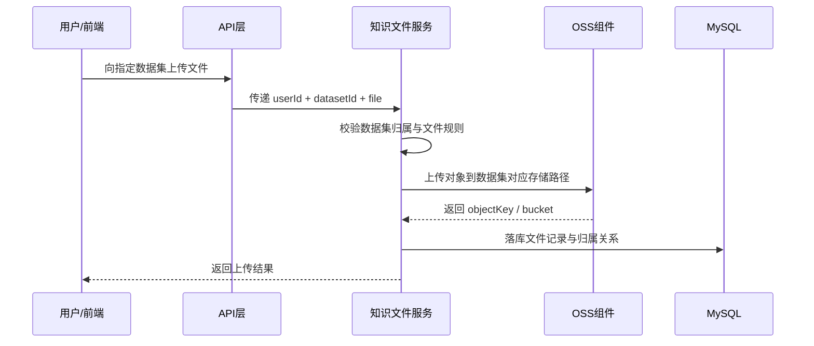
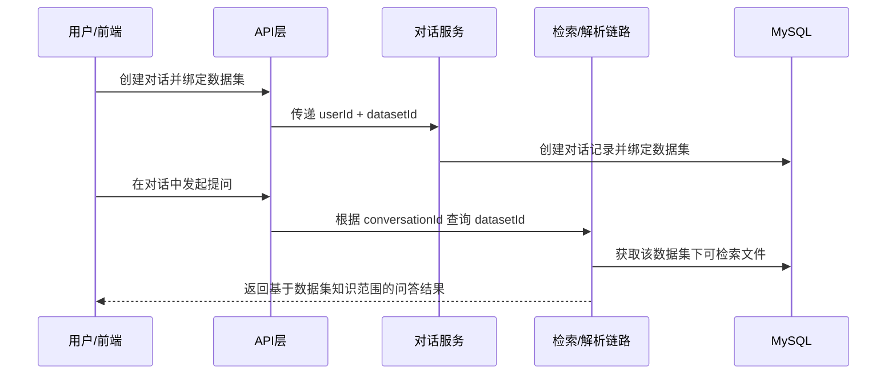

# ToLink 数据集中心化知识模型 产品需求文档 (PRD)

> **文档状态：** 草稿  
> **项目名称**：ToLink Service  
> **模块名称**：数据集中心化知识模型  
> **分支名称**：[toLink-Service]  
> **产品负责人：** [fang]  
> **最后更新时间：** 2026-04-21

---

## 1. 文档修订记录 (Change Log)

| 版本号 | 修改日期 | 修改内容简述 | 提出人 | 审核人 |
| :--- | :--- | :--- | :--- | :--- |
| v1.0 | 2026-04-21 | 初始版本创建，明确数据集中心化知识模型需求范围与业务边界 | Codex | [待补充] |

---

## 2. 需求背景与业务目标 (Overview)

### 2.1 业务概览与核心逻辑 (Business Overview)

* **业务定位：**  
  当前系统的知识文件模型仍以“对话”作为主要归属单位，文件上传、解析、检索边界与会话语义紧耦合。这种模式适合单次会话临时附件，但不适合持续沉淀可复用的知识资产。  
  本次需求的核心目标，是将系统语义调整为“数据集中心化”，参考 RAGFlow 的知识组织方式，让数据集成为文件存储、知识组织、检索边界与会话承载的上层业务单位。

* **核心逻辑主线：**  
  用户进入系统后，可拥有多个数据集。每个数据集是一个独立的知识空间，用户向数据集上传文件，系统对文件执行解析并纳入该数据集的可检索集合。用户在创建对话时，必须绑定一个数据集。对话中的问答、知识检索、文件消费行为都只能发生在所属数据集内部。数据集中的文件默认对该数据集下的所有对话可见并可检索，从而形成“数据集沉淀知识，对话消费知识”的业务闭环。

* **核心价值：**  
  该模型能解决以下问题：
  - 让知识文件脱离单个对话私有附件的语义
  - 让同一批知识文件在多个对话间复用
  - 统一数据库归属、检索范围与 MinIO 存储边界
  - 为后续演进到更完整的知识库体系打下基础

### 2.2 核心节点目标与验收准则 (Key Milestones)

| 核心功能节点 | 预期达成目标 | 关键验收点 (DoD) |
| :--- | :--- | :--- |
| **数据集实体引入** | 系统支持用户拥有多个数据集，并形成稳定归属关系 | 1. 数据集可被创建、查询、管理；2. 数据集归属用户清晰且不可越权访问 |
| **对话绑定数据集** | 每个对话创建时必须绑定且只能绑定一个数据集 | 1. 新建对话必须传入数据集标识；2. 对话创建后不可切换数据集；3. 历史对话查询可回溯所属数据集 |
| **文件归属迁移到数据集** | 知识文件主归属从对话改为数据集 | 1. 文件记录直接归属数据集；2. 文件列表可按数据集维度查询；3. 同一数据集内多个对话共享文件集合 |
| **检索边界切换到数据集** | 对话中的检索只在所属数据集内部发生 | 1. 检索请求能正确识别对话所属数据集；2. 不允许跨数据集检索文件；3. 未解析完成文件不进入可检索集合 |
| **存储语义对齐** | MinIO 对象路径与数据库归属都体现数据集维度 | 1. 对象路径包含数据集业务维度；2. 数据库存储语义与对象路径一致；3. 文件删除、迁移、查询的边界一致 |

---

## 3. 核心架构与业务流程 (Architecture & Flow)

### 3.1 核心业务时序图 (Sequence Diagrams)

#### 场景 1：用户上传文件到数据集

#### 场景 2：用户在数据集内创建并使用对话

### 3.2 状态机定义 (State Machine)

| 当前状态 | 触发动作/条件 | 流转后状态 | 备注/逆向逻辑 |
| :--- | :--- | :--- | :--- |
| 文件待上传 | 用户发起上传 | 上传中 | 文件先完成归属校验再进入上传流程 |
| 上传中 | OSS 上传成功 | 上传成功 | 成功后进入解析准备状态 |
| 上传中 | OSS 上传失败 | 上传失败 | 记录失败原因，不进入可检索集合 |
| 上传成功 | 创建解析任务 | 解析中 | 解析任务归属继承文件所属数据集 |
| 解析中 | 解析成功 | 可检索 | 对该数据集下全部对话可见 |
| 解析中 | 解析失败 | 解析失败 | 不进入可检索集合，可支持后续重试 |
| 对话待创建 | 用户指定数据集创建对话 | 对话已创建 | 对话与数据集建立固定绑定 |
| 对话已创建 | 用户继续问答 | 对话进行中 | 检索范围始终限定为所属数据集 |
| 对话进行中 | 用户删除对话 | 对话已删除 | 不应级联删除数据集文件 |

---

## 4. 功能规格与交互逻辑 (Functional Specs)

### 4.1 页面交互与功能示意 (UI & Functionality)

* **核心功能需求：**
  - 用户可以查看和管理自己的数据集
  - 用户可以在某个数据集下上传知识文件
  - 用户可以在某个数据集下创建多个对话
  - 对话内问答默认基于该数据集的知识文件进行检索
  - 用户查看文件列表时，主维度应为数据集，而不是对话

* **界面参考：**  
  本阶段为业务模型定义，不涉及具体 UI 原型，但后续前端需要体现以下信息：
  - 当前对话所属数据集
  - 当前数据集下的文件列表与状态
  - 新建对话时的数据集选择动作

### 4.2 接口契约规范

| 维度 | 要求与标准 | 备注 |
| :--- | :--- | :--- |
| **通讯协议** | 统一 RESTful API，JSON 格式交互，遵循小驼峰命名 | 与现有 ToLink API 风格保持一致 |
| **主归属参数** | 与知识文件、对话相关的接口需显式体现 `datasetId` | 数据集成为业务主维度 |
| **一致性要求** | 对话创建、文件上传、文件查询、检索调用都需能追溯到同一 `datasetId` | 避免新旧语义混用 |
| **异常处理** | 非法数据集、越权访问、跨数据集调用必须返回明确业务错误 | 不允许静默降级或自动跨集切换 |
| **异步机制** | 文件解析仍可走异步任务，但任务边界必须继承文件所属数据集 | 后续技术设计中细化 MQ/任务状态 |

### 4.3 核心业务逻辑 (按模块拆分)

#### 模块 A：数据集管理
* **业务逻辑概述：**  
  数据集是用户组织知识文件和承载多个对话的基础业务对象。用户通过数据集划分不同的知识空间。
* **核心处理规则：**  
  - 用户可拥有多个数据集  
  - 数据集必须归属唯一用户  
  - 用户只能查看和操作自己的数据集  
  - 数据集是后续对话和文件归属的共同上层容器
* **数据持久化规格：**  
  需要新增数据集实体及其与用户的归属关系。
* **并发与一致性：**  
  数据集创建与删除应保证幂等和归属一致性。
* **异常流与降级：**  
  非法数据集、越权访问、已删除数据集访问必须明确拦截。

#### 模块 B：对话与数据集绑定
* **业务逻辑概述：**  
  对话从原来的独立业务对象，调整为数据集内部的交互单元。
* **核心处理规则：**  
  - 对话创建时必须绑定一个数据集  
  - 对话一旦创建，不允许切换数据集  
  - 对话只消费数据集中的知识，不再拥有文件主归属权
* **数据持久化规格：**  
  对话记录需要增加或映射数据集归属字段。
* **并发与一致性：**  
  对话与数据集绑定必须在创建时一次完成，避免出现无数据集归属的悬挂对话。
* **异常流与降级：**  
  当数据集不存在、已删除或无权限时，禁止创建对话。

#### 模块 C：知识文件归属迁移
* **业务逻辑概述：**  
  知识文件的主归属对象从对话迁移为数据集。
* **核心处理规则：**  
  - 上传文件时必须指定数据集  
  - 文件默认对该数据集下全部对话可见  
  - 文件列表查询主维度为数据集  
  - 删除对话不删除数据集文件
* **数据持久化规格：**  
  文件记录需要直接归属数据集，不再以对话作为唯一主归属字段。
* **并发与一致性：**  
  文件归属、解析任务归属、对象路径归属要保持一致。
* **异常流与降级：**  
  非法数据集上传、跨数据集访问、文件归属不一致都必须阻断。

#### 模块 D：检索与解析边界控制
* **业务逻辑概述：**  
  检索与解析链路应继承数据集边界，而不是使用对话作为知识范围。
* **核心处理规则：**  
  - 对话中的检索只在所属数据集内进行  
  - 已解析成功文件才能进入可检索集合  
  - 同一数据集下多个对话共享检索知识池
* **数据持久化规格：**  
  解析任务需能间接追溯到数据集。
* **并发与一致性：**  
  文件解析完成后，应及时影响所属数据集的可检索集合。
* **异常流与降级：**  
  解析失败文件不得误入检索范围；跨数据集检索必须强制拦截。

---

## 5. 数据契约与存储约束 (Data & Storage)

### 5.1 数据模型与实体关系 (E-R)

核心实体关系如下：

- `用户 (User)` 1:N `数据集 (Dataset)`
- `数据集 (Dataset)` 1:N `对话 (ChatConversation)`
- `数据集 (Dataset)` 1:N `知识文件 (DocumentOriginalFile)`
- `知识文件 (DocumentOriginalFile)` 1:N `解析任务 (DocumentParseTask)`

关键语义变化：

- 文件与对话不再是直接主归属关系
- 文件与对话通过“同属一个数据集”建立业务关联
- 数据集成为知识检索、对象存储、数据库归属的统一上层实体

### 5.2 数据库组件与表结构变更 (Database & Schema Changes)

**涉及存储组件清单：**
* [x] MySQL（关系型核心业务数据）
* [ ] Redis（高频热数据缓存/分布式锁）
* [ ] Kafka（异步解耦/流计算）
* [ ] Qdrant（向量检索）
* [x] MinIO（对象存储）
* [ ] Elasticsearch（全文检索）
* [ ] 其他：__________

#### MySQL 变更

| 库名 / 表名 | 变更类型 | 核心字段说明 / 变更详情 | 备注要求 |
| :--- | :--- | :--- | :--- |
| `tolink_rag_db` / `[dataset]` | 新增表 | 存储数据集主实体，至少包含 `id`、`user_id`、`name`、`status` 等字段 | 后续技术设计中细化 |
| `tolink_rag_db` / `chat_conversation` | 新增字段/语义调整 | 增加 `dataset_id`，表示对话所属数据集 | 创建对话时必须填写 |
| `tolink_rag_db` / `document_original_file` | 新增字段/语义调整 | 增加或替换为 `dataset_id` 作为文件主归属字段 | 不再以 `conversation_id` 作为主归属语义 |
| `tolink_rag_db` / `document_parse_task` | 不再建设 | 解析任务通过 MQ 投递与回调，不新增独立任务表 | 状态快照保留在 `document_original_file` |

#### MinIO 变更

| 存储对象 | 变更类型 | 核心字段说明 / 变更详情 | 备注要求 |
| :--- | :--- | :--- | :--- |
| 原始文件对象路径 | 路径语义调整 | 对象路径必须包含数据集维度 | 具体路径模板在技术设计阶段确定 |
| 解析结果对象路径 | 路径语义调整 | 与原始文件路径语义保持一致，继承数据集归属 | 避免新旧路径规则混用 |

### 5.3 缓存与持久化策略

* **热数据归档：**  
  数据集基础信息、对话所属数据集映射、数据集下文件可检索清单，未来可作为高频缓存候选。

* **冷数据处理：**  
  历史对话、历史文件、历史解析任务在本阶段继续保留原有归档思路，但后续技术设计需单列历史迁移方案。

---

## 6. 异常处理与非功能性需求 (Exceptions & NFR)

### 6.1 稳定性与降级策略 (Reliability & Fallback)

* **外部依赖兜底：**  
  当对象存储、解析链路、检索链路异常时，系统应保证数据集归属不被破坏，不允许因为依赖异常而跨数据集兜底。

* **重试与限流：**  
  文件上传、解析任务创建、检索请求在后续实现中应支持合理重试策略，但重试过程必须保持 `datasetId` 一致。

* **补偿机制：**  
  当历史数据从“对话归属”迁移到“数据集归属”过程中出现中断，后续技术方案必须具备可回放、可补偿的迁移方案。

### 6.2 性能与扩展性要求 (Performance & Scalability)

* **性能指标：**  
  本阶段不设具体 TP99 指标，但要求新模型不能显著放大现有文件查询与对话检索链路开销。

* **吞吐能力：**  
  数据集维度的文件列表查询、对话列表查询、检索上下文定位应支持后续扩展到更高规模，而不是把知识边界继续压在单个对话上。

* **资源消耗：**  
  数据集成为新边界后，未来索引、缓存、对象路径规划必须以“数据集”为分桶思路，避免全局单表/单集合压力失控。

### 6.3 可观测性、安全与合规 (Security & Observability)

* **监控与报警：**  
  关键链路需要能追踪：
  - 用户操作了哪个数据集
  - 对话绑定了哪个数据集
  - 文件归属了哪个数据集
  - 检索发生在哪个数据集内

* **数据脱敏：**  
  若后续日志中输出对象路径或文件信息，应避免暴露用户敏感内容。

* **权限审计：**  
  必须确保用户无法访问他人数据集，也无法通过对话、文件、内部下载等链路绕过数据集边界。

### 6.4 数据埋点与运营要求

* **核心埋点：**
  - 数据集创建次数
  - 数据集内文件上传次数
  - 数据集内对话创建次数
  - 数据集维度的检索触发次数
  - 文件解析成功率

---

## 7. 遗留问题与依赖项 (Dependencies & Open Issues)

* **前置依赖：**
  - 现有知识文件模型仍以对话归属为主，后续技术方案必须明确历史数据如何映射到数据集
  - 现有接口路径和数据库字段可能与目标模型冲突，需要在设计阶段明确过渡策略

* **待确认事项：**
  - 数据集是否允许后续扩展为多人协作
  - 数据集删除是否需要级联对话与文件
  - 数据集下是否还需要再细分知识库/子目录
  - 对现有前端页面的迁移顺序和过渡展示方案
