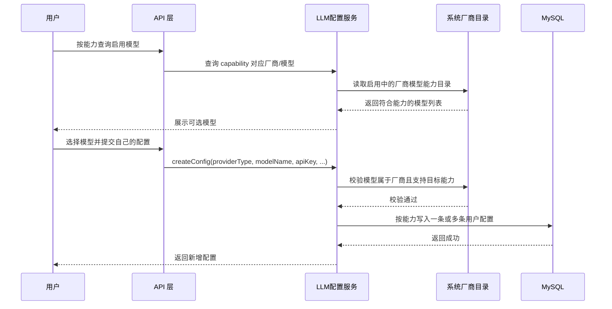
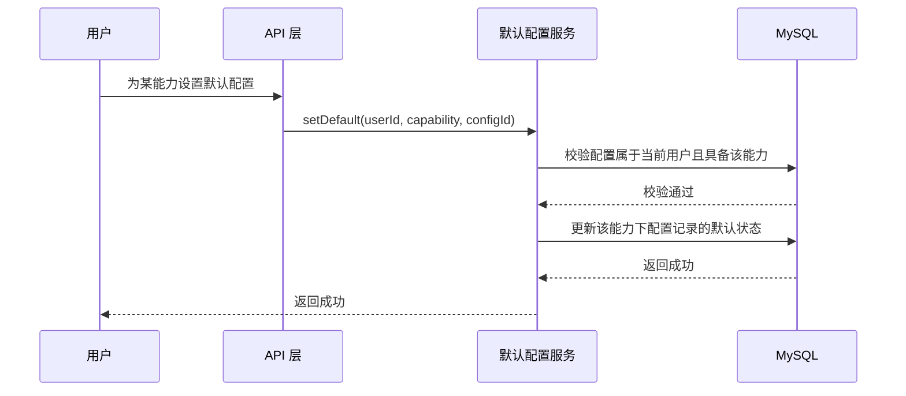

# ToLink Service LLM能力与默认配置一期 PRD

> **文档状态：** 需求已审核
> **项目名称：** ToLink Service
> **模块名称：** LLM能力与默认配置（一期）
> **分支名称：** refactor/llm-capability-default-config
> **产品负责人：** Fang / Codex
> **最后更新时间：** 2026-05-06

---

## 1. 文档修订记录 (Change Log)

| 版本号 | 修改日期 | 修改内容简述 | 提出人 | 审核人 |
| :--- | :--- | :--- | :--- | :--- |
| v1.0 | 2026-05-06 | 初始化 LLM 能力与默认配置一期 PRD，锁定能力筛选、用户配置快照与每能力默认配置关系建模 | Fang / Codex | Fang |

---

## 2. 需求背景与业务目标 (Overview)

### 2.1 业务概览与核心逻辑 (Business Overview)

- **业务定位：** 本模块负责把 ToLink 中“模型能力”从隐含概念提升为正式业务概念，为用户配置管理、默认模型选择和后续 `chat` / `embedding` / `ocr` 等业务使用统一的能力视角。
- **核心逻辑主线：** 系统先维护厂商与模型能力目录；用户按能力筛选启用中的厂商与模型后，选择一个模型并填写自己的密钥和参数创建用户配置；系统在创建时校验该模型确实支持目标能力，并按能力维度把该模型配置展开为用户配置记录；随后用户可以直接在这些能力配置记录中，为每种能力选出一条作为默认配置。
- **核心价值：** 解决当前“用户只能有一个全局默认配置、不能按能力设置默认模型、系统无法严格校验模型能力”的问题，为聊天、向量化、OCR 等不同场景选择正确模型提供稳定基础，同时避免为默认配置再额外引入独立关系表。

### 2.2 核心节点目标与验收准则 (Key Milestones)

| 核心功能节点 | 预期达成目标 | 关键验收点 (DoD) |
| :--- | :--- | :--- |
| 系统厂商能力目录 | 系统能明确表达每个厂商下每个模型支持哪些能力 | 用户侧可按能力筛选启用中的厂商和模型 |
| 用户配置创建校验 | 用户只能创建厂商已支持、且能力合法的模型配置 | 创建配置时若模型不存在或不支持目标能力，接口明确失败 |
| 按能力配置落库 | 用户配置创建后按能力生成配置记录 | `llm_user_config` 一条记录只对应一个能力 |
| 每能力默认配置 | 一个用户可以为不同能力分别设置默认配置 | 同一用户可同时存在 `CHAT` 默认、`EMBEDDING` 默认、`OCR` 默认等 |
| 统一默认配置读取 | 下游业务可按能力读取用户默认配置 | `chat`、`dataset/embedding` 等场景不再依赖唯一全局默认配置 |

---

## 3. 核心架构与业务流程 (Architecture & Flow)

### 3.1 核心业务时序图 (Sequence Diagrams)

#### 场景 1：用户按能力选择模型并创建配置



#### 场景 2：用户按能力设置默认配置



### 3.2 状态机定义 (State Machine)

| 当前状态 | 触发动作/条件 | 流转后状态 | 备注/逆向逻辑 |
| :--- | :--- | :--- | :--- |
| 厂商启用 | 用户按能力查询 | 可展示 | 仅 `is_active=true` 的厂商对用户可见 |
| 用户配置已创建 | 用户设置某能力默认配置 | 已绑定为某能力默认 | 同一条记录只对应一个能力 |
| 已存在能力默认配置 | 用户重新设置同能力默认配置 | 默认标识被切换 | 同一用户同一能力只能保留一条默认记录 |
| 用户配置被删除/禁用 | 该配置是某能力默认配置 | 该能力默认缺失 | 需在后续技术方案中明确收敛行为 |

---

## 4. 功能规格与交互逻辑 (Functional Specs)

### 4.1 页面交互与功能示意 (UI & Functionality)

- 用户在添加配置前，先看到“按能力筛选后的启用厂商与模型列表”。
- 用户点击某个模型后，填写自己的 `API Key`、超时、重试、流式等参数创建一条用户配置。
- 用户在“我的配置”中可查看能力维度的配置记录；若前端需要按模型聚合展示，可由前端或后端在展示层合并。
- 用户在设置默认配置时，不再只设置一个全局默认，而是按能力选择默认配置。

### 4.2 接口契约规范

| 维度 | 要求与标准 | 备注 |
| :--- | :--- | :--- |
| 厂商查询 | 仅返回启用中的厂商和模型 | 用户不可见禁用厂商 |
| 能力筛选 | 用户可按能力筛选可用模型 | 能力筛选不能只依赖前端静态规则 |
| 配置创建校验 | 创建时必须校验模型能力 | 后端必须作为最终校验方 |
| 默认配置设置 | 默认配置必须按能力维度设置 | 不再以单一 `is_default` 覆盖全部能力 |
| 权限边界 | 用户只能查看和设置自己的配置及默认关系 | 不允许跨用户操作 |

### 4.3 核心业务逻辑 (按模块拆分)

#### 模块 A：系统厂商能力目录

- **业务逻辑概述：** 该模块负责告诉用户系统当前有哪些可用厂商、每个厂商有哪些可选模型、每个模型支持哪些能力。
- **核心处理规则：** 只允许展示启用中的厂商；模型能力以系统厂商目录为真实来源；筛选结果必须由后端可复验。
- **数据持久化规格：** 继续复用 `llm_system_provider`，能力目录不在本期拆成独立模型表。
- **并发与一致性：** 厂商被禁用或模型能力被调整后，后续查询必须收敛到最新目录。
- **异常流与降级：** 若厂商不存在或已禁用，不允许用户继续创建对应配置。

#### 模块 B：用户模型配置

- **业务逻辑概述：** 用户配置是用户基于系统厂商目录选择具体模型后，填写自己密钥和参数生成的一组可使用配置记录；每条记录只对应一个能力。
- **核心处理规则：** 用户只能选择系统已提供且当前启用的模型；创建时必须校验模型能力，并按目标模型支持的能力拆分生成多条用户配置记录。
- **数据持久化规格：** 继续复用 `llm_user_config` 作为用户模型配置事实表，但业务语义调整为“用户在某能力下的一条模型配置”。
- **并发与一致性：** 用户配置删除、禁用或修改后，后续默认状态与下游读取必须能感知变化。
- **异常流与降级：** 若用户选择的模型不在厂商目录中，或不具备目标能力，接口必须明确失败。

#### 模块 C：用户能力默认配置

- **业务逻辑概述：** 用户可以为不同能力分别选择默认配置，而不是只能拥有一个全局默认配置。
- **核心处理规则：** 同一用户同一能力只能有一条默认配置记录；默认切换时，本能力下旧默认记录失效、新默认记录生效。
- **数据持久化规格：** 本期继续复用 `llm_user_config` 承载默认语义，但默认语义限定在“同一用户同一能力”维度。
- **并发与一致性：** 更新同一能力默认配置时，新记录生效后旧记录失效。
- **异常流与降级：** 若指定配置不属于当前用户，或该配置不具备该能力，不允许设为默认配置。

#### 模块 D：下游能力选择

- **业务逻辑概述：** `chat`、`embedding`、`ocr` 等下游业务场景应按能力读取默认配置，而不是读取一个全局默认模型。
- **核心处理规则：** 下游读取必须能指定目标能力；若某能力未配置默认值，应有明确的未配置返回口径。
- **数据持久化规格：** 本期先锁定业务规则，不在需求阶段展开为所有下游代码改造清单。
- **并发与一致性：** 默认关系调整后，下游读取应返回新默认配置。
- **异常流与降级：** 某能力无默认配置时，不能误用其他能力的默认配置兜底。

---

## 5. 数据契约与存储约束 (Data & Storage)

### 5.1 数据模型与实体关系 (E-R)

```text
llm_system_provider
    -> 定义厂商、模型与能力目录

llm_user_config
    -> 记录用户基于厂商/模型创建的能力配置记录
    -> 一条记录只对应一个 capability
    -> 在同一用户同一能力维度上表达默认配置
```

### 5.2 数据库组件与表结构变更 (Database & Schema Changes)

**涉及存储组件清单：**

- [x] MySQL（系统厂商目录、用户配置、能力默认关系）
- [x] Redis（用户配置、默认配置缓存）
- [ ] Kafka
- [ ] MinIO
- [ ] Elasticsearch

#### MySQL 变更

| 库名 / 表名 | 变更类型 | 核心字段说明 / 变更详情 | 备注要求 |
| :--- | :--- | :--- | :--- |
| `tolink_rag_db` / `llm_system_provider` | 语义复用 | 继续复用 `supported_models` 表达 `模型 -> 能力列表` | 本期不要求拆新表 |
| `tolink_rag_db` / `llm_user_config` | 结构/规则调整 | 调整为一条记录只对应一个能力，并支持同一用户同一能力唯一默认 | 建议新增能力维度约束与唯一索引 |

#### Redis 变更

| Key 名 | 变更类型 | 核心字段说明 / 变更详情 | 备注要求 |
| :--- | :--- | :--- | :--- |
| `llm:cfg:{configId}` | 复用 | 用户配置详情缓存 | 继续承载单条能力配置 |
| `llm:u_def:{userId}` | 语义调整 | 继续使用原 key，但 value 调整为 `capability -> configId` 映射 | 技术方案阶段明确 value 结构和回源策略 |
| `llm:pvd:{providerType}` | 复用 | 系统厂商详情缓存 | 继续用于厂商能力目录读取 |

### 5.3 缓存与持久化策略

- `MySQL` 是厂商目录和能力配置记录的最终事实源。
- `Redis` 只承载可回源的读缓存，不承担能力默认关系的最终真相。
- 能力默认配置缓存只缓存当前用户的默认映射，必须能从 `llm_user_config` 中按能力回源重建，不能只保存在 Redis 而不落库。
- 若继续沿用缓存一致性二期方案，默认配置 key 不新增能力后缀，而是调整 `llm:u_def:{userId}` 的 value 语义。

---

## 6. 异常处理与非功能性需求 (Exceptions & NFR)

### 6.1 稳定性与降级策略 (Reliability & Fallback)

- 当厂商目录读取失败时，不允许前端基于过期静态能力目录直接提交创建请求。
- 当用户默认配置关系读取失败时，不能误退化为任意一条启用配置。
- 当用户配置被删除或禁用时，对应能力默认状态应在后续实现中具备收敛策略。

### 6.2 性能与扩展性要求 (Performance & Scalability)

- 厂商能力筛选应支持后续增加更多能力值而不需要频繁重构主业务流程。
- 用户默认配置按能力维度读取时，应支持后续高频场景接入缓存。
- 方案应支持一个用户同时配置多个能力的默认模型，不以单一默认值限制扩展。

### 6.3 可观测性、安全与合规 (Security & Observability)

- 用户只能查看和操作自己的配置与默认关系。
- 敏感字段如 `api_key` 仍需保持加密存储与脱敏展示。
- 能力默认配置变更应具备可审计性，至少能通过数据库与日志还原变更结果。

### 6.4 数据埋点与运营要求

- 应能统计各能力的默认配置覆盖情况。
- 应能统计按能力筛选时用户常用的厂商与模型，为后续运营和默认推荐提供依据。

---

## 7. 遗留问题与依赖项 (Dependencies & Open Issues)

- 需要在技术设计中明确能力枚举的首批清单，例如 `CHAT`、`EMBEDDING`、`OCR`、`VISION`、`REASONING`、`CODE`。
- 需要在技术设计中明确 `llm_user_config.is_default` 与新增能力维度字段的联合语义，以及历史记录迁移策略。
- 需要在技术设计中明确用户按能力设置默认配置的接口形式，以及下游业务读取默认配置的统一服务入口。
- 需要在技术设计中明确 `llm:u_def:{userId}` 从单个默认配置调整为 `capability -> configId` 映射后的兼容策略。
