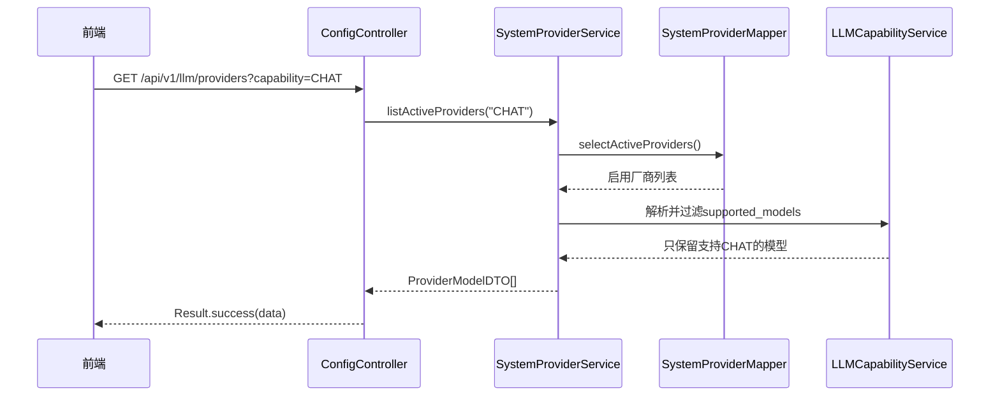
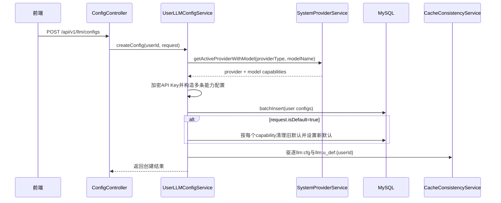
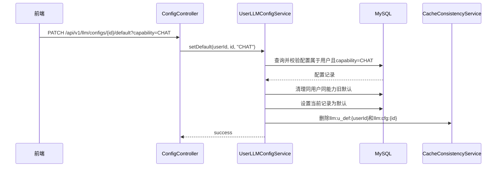

# ToLink Service LLM能力与默认配置一期技术实现文档

> **文档状态：** 技术方案已审核，代码实现已落地
> **项目名称**：ToLink Service
> **模块名称**：LLM能力与默认配置（一期）
> **需求文档**：[requirement.md](/Users/fang/Developer/Projects/toLink/toLink-Service/docs/模块开发文档/LLM能力与默认配置/一期/requirement.md)
> **分支名称**：refactor/llm-capability-default-config
> **技术负责人：** Fang / Codex
> **最后更新时间：** 2026-05-06

---

## 1. 文档修订记录 (Change Log)

| 版本号 | 修改日期 | 修改内容简述 | 修改人 | 审核人 |
| :--- | :--- | :--- | :--- | :--- |
| v1.0 | 2026-05-06 | 初始化一期技术方案，锁定 `llm_user_config` 按能力拆行、每能力默认配置、能力筛选与缓存 key 升级方案 | Fang / Codex | Fang |

---

## 2. 技术目标与实现范围 (Overview)

### 2.1 技术目标与核心思路 (Technical Goals)

- **技术目标：**
  - 将 LLM 能力维度正式收敛到 Java 侧配置管理链路中，支持用户按能力查询可用厂商和模型。
  - 复用 `llm_system_provider.supported_models` 作为系统厂商侧“模型 -> 能力列表”的事实来源。
  - 将 `llm_user_config` 的业务语义调整为“一条记录 = 一个用户在一个能力下的一条模型配置”。
  - 默认配置继续由 `llm_user_config.is_default` 承载，但作用域从“用户全局”调整为“`user_id + capability`”。
  - 配置详情、默认配置、系统厂商缓存继续接入现有 Redis 一致性与读保护能力。
- **设计原则：**
  - 不新增独立默认关系表，避免把简单的“每能力默认”拆成额外关系模型。
  - MySQL 负责真实数据、过滤和约束；Redis 只负责可回源的单对象缓存。
  - 新增查询按项目约定下沉到 MyBatis XML，不继续扩大 Service 层 `LambdaQueryWrapper` 使用。
  - 能力枚举先以字符串常量和校验服务收敛，避免本期过早引入复杂模型注册中心。
- **成功标准：**
  - 用户侧能按能力查询启用中的厂商和模型。
  - 创建用户配置时能校验厂商、模型、能力合法性，并按模型能力展开多条 `llm_user_config`。
  - 同一用户每种能力最多一条默认配置，且默认读取支持指定能力。
  - 数据库脚本、实体字段、Mapper XML、缓存 key、错误码和测试用例保持一致。

### 2.2 实现范围与边界 (In Scope / Out of Scope)

**必须实现：**

- 修正并明确 `llm_user_config.capability` 单能力字段语义。
- 新增或调整 `CreateConfigRequest`、`UpdateConfigRequest`、`UserLLMConfigDTO` 以表达能力维度。
- 新增用户侧“按能力查询启用厂商/模型”接口。
- 改造配置创建链路：校验系统厂商模型能力，并按能力拆分写入多条用户配置。
- 改造默认配置链路：默认配置按 `user_id + capability` 维度设置、清理、读取。
- 新增 `SystemProviderMapper.xml`、`UserLLMConfigMapper.xml` 中的本期查询与更新 SQL。
- 调整 Redis 默认配置 value 规则：继续使用 `llm:u_def:{userId}`，value 从单个默认配置调整为 `capability -> configId` 映射。
- 更新 `docs/db/init.sql`、`docs/db/schema.sql`、`link-api/src/test/resources/schema.sql`。

**暂不实现：**

- 不引入新的 `user_llm_default_config` 表。
- 不拆分 `llm_system_provider.supported_models` 为独立模型表或能力表。
- 不改造 Python 执行端模型选择逻辑。
- 不实现团队/租户级默认配置策略。
- 不新增 Redis 列表缓存或 Redis 能力索引集合。

### 2.3 验收项到实现点映射 (Requirement Mapping)

| 需求验收项 | 技术实现点 | 测试方式 | 责任模块 |
| :--- | :--- | :--- | :--- |
| 按能力查询启用厂商与模型 | `SystemProviderService#getActiveProvidersByCapability` 解析 `supported_models` 并过滤 | Service 单测 / API 集成测试 | `link-api` / `link-service` |
| 创建配置时校验模型能力 | 解析厂商模型能力目录，校验模型存在且能力合法 | Service 单测 | `link-service` |
| 一次创建展开多能力记录 | `createConfig` 按模型支持能力批量 insert `llm_user_config` | Service 单测 / DB 集成测试 | `link-service` / `link-mapper` |
| 每能力默认配置 | `clearOtherDefault(userId, capability, excludeId)` + `setDefault` 事务更新 | Service 单测 / API 集成测试 | `link-service` |
| 默认配置按能力读取 | 新增 `getDefaultConfig(userId, capability)`，缓存 key 带能力 | Service 单测 | `link-service` |
| 用户只能查看自己的配置 | Controller 从 `AuthContext` 获取 userId，Mapper 条件强制带 `user_id` | API 集成测试 | `link-api` / `link-service` |

---

## 3. 当前系统分析与复用基础 (Current-State Analysis)

### 3.1 相关模块盘点

| 模块 | 当前职责 | 现状说明 | 是否修改 |
| :--- | :--- | :--- | :--- |
| `link-api` | Controller / API 入口 | [ConfigController.java](/Users/fang/Developer/Projects/toLink/toLink-Service/link-api/src/main/java/com/qingluo/link/api/controller/ConfigController.java) 已有用户配置 CRUD，缺少用户侧厂商模型查询和按能力默认接口 | 是 |
| `link-service` | 业务服务 | [UserLLMConfigServiceImpl.java](/Users/fang/Developer/Projects/toLink/toLink-Service/link-service/src/main/java/com/qingluo/link/service/impl/UserLLMConfigServiceImpl.java) 当前单次创建一条配置，默认配置是用户全局；[SystemProviderServiceImpl.java](/Users/fang/Developer/Projects/toLink/toLink-Service/link-service/src/main/java/com/qingluo/link/service/impl/SystemProviderServiceImpl.java) 当前只按启用状态查厂商 | 是 |
| `link-model` | Entity / DTO / Enum | [UserLLMConfig.java](/Users/fang/Developer/Projects/toLink/toLink-Service/link-model/src/main/java/com/qingluo/link/model/dto/entity/UserLLMConfig.java) 当前字段名 `capabilities` 映射到 `capability`，与建表脚本 `capabilities JSON` 不一致 | 是 |
| `link-mapper` | Mapper / 持久化 | `SystemProviderMapper`、`UserLLMConfigMapper` 当前只有 BaseMapper，新增查询需补 XML | 是 |
| `link-core` | 异常 / 工具 / 上下文 | 复用 `AuthContext`、`ApiKeyEncryptService`、`BusinessException`、`ConflictException`、`NotFoundException` | 可能 |
| `link-components` | Redis / MQ / OSS 组件 | 复用 `CacheConsistencyService`、`CacheReadProtectionService`、`CacheKeyRouter`；本期不涉及 MQ/OSS | 是 |

### 3.2 已复用能力 (Reusable Components)

- 统一 API 响应与异常处理：
  - [Result.java](/Users/fang/Developer/Projects/toLink/toLink-Service/link-model/src/main/java/com/qingluo/link/model/dto/response/Result.java)
  - [GlobalExceptionHandler.java](/Users/fang/Developer/Projects/toLink/toLink-Service/link-api/src/main/java/com/qingluo/link/api/controller/GlobalExceptionHandler.java)
  - [ErrorCode.java](/Users/fang/Developer/Projects/toLink/toLink-Service/link-model/src/main/java/com/qingluo/link/model/enums/ErrorCode.java)
- 登录态与用户边界：
  - [AuthContext.java](/Users/fang/Developer/Projects/toLink/toLink-Service/link-core/src/main/java/com/qingluo/link/core/util/AuthContext.java)
  - Controller 中现有 `@SaCheckLogin`
- API Key 安全：
  - [ApiKeyEncryptService.java](/Users/fang/Developer/Projects/toLink/toLink-Service/link-core/src/main/java/com/qingluo/link/core/util/ApiKeyEncryptService.java)
- Redis 缓存能力：
  - [redis_component.md](/Users/fang/Developer/Projects/toLink/toLink-Service/docs/组件和数据库约定/middleware-components/redis_component.md)
  - [CacheConsistencyService.java](/Users/fang/Developer/Projects/toLink/toLink-Service/link-components/toLink-components-redis/src/main/java/com/qingluo/link/components/redis/service/CacheConsistencyService.java)
  - [CacheReadProtectionService.java](/Users/fang/Developer/Projects/toLink/toLink-Service/link-components/toLink-components-redis/src/main/java/com/qingluo/link/components/redis/service/CacheReadProtectionService.java)

### 3.3 已参考代码 (Code References)

| 文件/模块 | 参考点 | 对方案的影响 |
| :--- | :--- | :--- |
| [docs/db/init.sql](/Users/fang/Developer/Projects/toLink/toLink-Service/docs/db/init.sql) | `supported_models` 已是 `{"model":["CHAT"]}` 形态；`llm_user_config` 当前是 `capabilities JSON` | 系统厂商侧不拆表；用户配置字段需要收敛为单能力 |
| [UserLLMConfigServiceImpl.java](/Users/fang/Developer/Projects/toLink/toLink-Service/link-service/src/main/java/com/qingluo/link/service/impl/UserLLMConfigServiceImpl.java) | 当前创建单条记录，`clearOtherDefault` 按用户全局清理默认 | 需要改成按能力批量创建和按能力清理默认 |
| [SystemProviderServiceImpl.java](/Users/fang/Developer/Projects/toLink/toLink-Service/link-service/src/main/java/com/qingluo/link/service/impl/SystemProviderServiceImpl.java) | 当前启用厂商查询只过滤 `is_active` | 需要新增按 capability 过滤模型的方法 |
| [ConfigController.java](/Users/fang/Developer/Projects/toLink/toLink-Service/link-api/src/main/java/com/qingluo/link/api/controller/ConfigController.java) | 当前只有配置 CRUD，没有 provider/model 用户侧查询入口 | 本期在该 Controller 下补用户侧配置相关接口 |
| [CacheKeyRouter.java](/Users/fang/Developer/Projects/toLink/toLink-Service/link-components/toLink-components-redis/src/main/java/com/qingluo/link/components/redis/service/CacheKeyRouter.java) | 默认配置 key 当前为 `llm:u_def:{userId}` | key 可继续复用，业务缓存 service 需要调整 value 为能力默认映射 |
| [middleware_contract.md](/Users/fang/Developer/Projects/toLink/toLink-Service/docs/组件和数据库约定/middleware_contract.md) | 新查询必须走 MyBatis XML；Redis key 需要说明 TTL 与失效方式 | 技术方案和实现都要回写公共契约 |

### 3.4 现有问题与约束 (Constraints)

- `llm_user_config` 字段存在脚本和实体不一致：脚本是 `capabilities JSON`，实体映射为 `capability`。本期统一为 `capability VARCHAR(32) NOT NULL`，实体字段建议改为 `capability`，DTO 可兼容保留 `capabilities` 或新增 `capability`。
- 当前 `DUPLICATE_USER_CONFIG` 表示“同一用户同一厂商同一模型重复”，新语义下重复维度应调整为 `user_id + provider_id + model_name + capability`。
- MySQL 8 没有 PostgreSQL 那类天然 partial unique index。若要保证“同一用户同一能力只有一个默认”，建议采用事务更新 + 普通索引兜底，不在本期强上复杂生成列约束。
- `supported_models` 是 JSON 字符串，能力过滤在 Java 内存中完成。厂商规模可控时这样更简单；若后续厂商/模型数量膨胀，再拆模型表。
- 本期只完成 Java 管理端，Python 执行端仍需后续按能力读取默认配置。

---

## 4. 核心架构与实现方案 (Architecture & Solution)

### 4.1 总体设计思路 (Architecture Overview)

一期采用“系统目录不拆表，用户配置按能力拆行”的方案。

`llm_system_provider.supported_models` 继续记录厂商支持的模型与能力，例如：

```json
{
  "gpt-4o": ["CHAT", "OCR", "VISION"],
  "gpt-4-turbo": ["CHAT"]
}
```

用户创建配置时只提交 `providerType`、`modelName`、密钥和运行参数。Service 从系统厂商目录中解析该模型支持的能力列表，然后为每个能力写入一条 `llm_user_config`。这样默认配置可以直接落在每条能力记录上，不需要新建默认关系表。

列表展示层允许按模型聚合，但数据库事实层保持按能力拆行。推荐后端默认返回能力记录列表；如果前端需要“一个模型一张卡片”，后续可新增聚合响应 DTO，不改变底层表语义。

### 4.2 目标调用链路 (Call Flow)

```text
用户查询可用模型:
ConfigController -> SystemProviderService -> SystemProviderMapper(XML/Cache) -> 解析supported_models -> 按capability过滤

用户创建配置:
ConfigController -> UserLLMConfigService -> SystemProviderService校验目录
    -> ApiKeyEncryptService加密 -> UserLLMConfigMapper批量写入能力记录
    -> 按能力处理默认 -> CacheConsistencyService驱逐

用户设置默认:
ConfigController -> UserLLMConfigService -> UserLLMConfigMapper校验归属和能力
    -> 同事务清理同能力旧默认并设置新默认 -> 驱逐默认配置缓存

下游读取默认:
业务Service -> UserLLMConfigService#getDefaultConfig(userId, capability)
    -> UserLLMConfigCacheService -> Redis miss时回源MySQL
```

### 4.3 核心模块职责划分 (Module Responsibilities)

| 模块/类 | 职责 | 输入/输出边界 |
| :--- | :--- | :--- |
| `ConfigController` | 用户侧 LLM 配置入口 | 从登录态取 userId，不接收外部 userId |
| `SystemProviderService` | 系统厂商目录读取与能力过滤 | 输入 `capability`；输出启用厂商及可选模型 |
| `UserLLMConfigService` | 用户配置创建、更新、删除、默认设置与默认读取 | 输入当前 userId 和请求 DTO；输出脱敏 DTO |
| `LLMCapabilityService`（新增） | 解析 `supported_models`、校验能力枚举、模型能力匹配 | 输入 JSON 字符串、模型名、能力；输出能力列表或校验异常 |
| `UserLLMConfigMapper.xml` | 用户配置列表、按能力默认、批量状态更新 | 输入 userId/capability/configId；输出实体或影响行数 |
| `SystemProviderMapper.xml` | 厂商按唯一键、启用列表、管理端分页查询 | 输入 providerType / isActive；输出实体列表 |
| `UserLLMConfigCacheService` | 封装 `llm:cfg` 与 `llm:u_def:{userId}` 默认映射缓存 | 输入 configId / userId+capability；输出缓存实体或默认 configId |
| `SystemProviderCacheService` | 封装 `llm:pvd:{providerType}` | 输入 providerType；输出系统厂商实体 |

### 4.4 核心时序图 (Sequence Diagrams)

#### 场景 1：用户按能力查询启用模型



#### 场景 2：用户创建模型配置并展开能力记录



#### 场景 3：按能力设置默认配置



---

## 5. 接口契约与交互方案 (API Contract)

### 5.1 接口清单

| 方法 | 路径 | 说明 | 权限 |
| :--- | :--- | :--- | :--- |
| GET | `/api/v1/llm/providers` | 用户侧查询启用厂商和模型，支持按能力过滤 | 登录用户 |
| GET | `/api/v1/llm/configs` | 查询当前用户自己的能力配置记录，新增 `capability` 过滤 | 登录用户 |
| POST | `/api/v1/llm/configs` | 创建用户模型配置，按模型能力展开多条记录 | 登录用户 |
| PATCH | `/api/v1/llm/configs/{id}` | 更新单条能力配置的运行参数、启用状态等 | 登录用户 |
| PATCH | `/api/v1/llm/configs/{id}/default` | 将某条能力配置设置为该能力默认 | 登录用户 |
| GET | `/api/v1/llm/configs/default` | 查询当前用户某能力默认配置 | 登录用户 |
| DELETE | `/api/v1/llm/configs/{id}` | 删除当前用户自己的单条能力配置 | 登录用户 |

### 5.2 请求参数

| 参数 | 位置 | 类型 | 必填 | 说明 |
| :--- | :--- | :--- | :--- | :--- |
| `capability` | query/body | `String` | 部分接口必填 | 能力值，首批建议 `CHAT`、`EMBEDDING`、`OCR`、`VISION`、`REASONING`、`CODE` |
| `providerType` | query/body | `String` | 创建必填 / 列表可选 | 厂商类型 |
| `modelName` | body | `String` | 创建必填 | 模型名称 |
| `configName` | body | `String` | 创建必填 | 用户自定义配置名 |
| `apiKey` | body | `String` | 创建必填 / 更新可选 | 仅入参接收，响应不返回明文 |
| `isDefault` | body | `Boolean` | 否 | 创建时为 `true` 表示展开出的每个能力记录均设为对应能力默认 |

### 5.3 响应结构

#### `GET /api/v1/llm/providers`

```json
{
  "code": 200,
  "message": "success",
  "data": [
    {
      "providerType": "openai",
      "providerName": "OpenAI",
      "models": [
        {
          "modelName": "gpt-4o",
          "capabilities": ["CHAT", "OCR", "VISION"]
        }
      ]
    }
  ]
}
```

空结果：

```json
{
  "code": 200,
  "message": "success",
  "data": []
}
```

#### `GET /api/v1/llm/configs`

返回当前用户自己的能力配置记录。`apiKey` 只返回脱敏值。

```json
{
  "code": 200,
  "message": "success",
  "data": [
    {
      "id": 10001,
      "configName": "我的OpenAI配置",
      "providerType": "openai",
      "providerName": "OpenAI",
      "modelName": "gpt-4o",
      "capability": "CHAT",
      "apiKeyMasked": "sk-****",
      "isActive": true,
      "isDefault": true,
      "timeoutMs": 60000,
      "maxRetries": 3,
      "streamEnabled": true
    }
  ]
}
```

#### `POST /api/v1/llm/configs`

创建成功后建议返回展开后的能力配置列表，而不是单个 DTO。

```json
{
  "code": 200,
  "message": "success",
  "data": [
    {
      "id": 10001,
      "configName": "我的OpenAI配置",
      "providerType": "openai",
      "providerName": "OpenAI",
      "modelName": "gpt-4o",
      "capability": "CHAT",
      "apiKeyMasked": "sk-****",
      "isDefault": true
    }
  ]
}
```

#### `GET /api/v1/llm/configs/default?capability=CHAT`

```json
{
  "code": 200,
  "message": "success",
  "data": {
    "id": 10001,
    "configName": "我的OpenAI配置",
    "providerType": "openai",
    "providerName": "OpenAI",
    "modelName": "gpt-4o",
    "capability": "CHAT",
    "apiKeyMasked": "sk-****",
    "isActive": true,
    "isDefault": true
  }
}
```

### 5.4 异常响应

| 场景 | HTTP 状态 | 业务错误码 | message |
| :--- | :--- | :--- | :--- |
| 厂商不存在 | 404 | `10001` | 系统厂商不存在 |
| 厂商已禁用 | 400 | `10002` | 系统厂商已被禁用 |
| 用户配置不存在或不属于当前用户 | 404 | `10004` | 用户配置不存在 |
| 指定能力没有默认配置 | 404 | `10006` | 用户没有设置默认配置 |
| 模型不属于该厂商 | 400 | `10008` | 模型不被该厂商支持 |
| 模型不支持指定能力 | 400 | `10008` | 模型不支持指定能力 |
| 同一能力配置重复 | 409 | `10009` | 用户已存在该厂商相同模型和能力的配置 |
| 能力值不合法 | 400 | 新增 `10011` | 模型能力不合法 |

### 5.5 异常类与错误码定义

| 异常类 | 继承关系 | 使用场景 | 说明 |
| :--- | :--- | :--- | :--- |
| `BusinessException` | `RuntimeException` | 能力非法、模型能力不匹配 | 复用现有基类 |
| `ConflictException` | `BusinessException` | 重复创建同能力配置 | 复用 `DUPLICATE_USER_CONFIG` |
| `NotFoundException` | `BusinessException` | 厂商、用户配置、默认配置不存在 | 复用现有异常体系 |

新增错误码建议：

| 错误码 | 枚举名/常量名 | HTTP 状态 | 触发场景 | 前端提示策略 |
| :--- | :--- | :--- | :--- | :--- |
| `10011` | `INVALID_MODEL_CAPABILITY` | 400 | `capability` 不在首批能力集合内 | 提示用户选择合法能力 |

### 5.6 兼容性说明

- `GET /api/v1/llm/configs` 保持原路径，新增可选 `capability` 过滤。
- `POST /api/v1/llm/configs` 返回类型建议从单个 `UserLLMConfigDTO` 调整为 `List<UserLLMConfigDTO>`，这是前端需要适配的主要变化。
- `getDefaultConfig(Long userId)` 服务方法建议保留一个过渡实现，内部默认映射为 `CHAT`，并标记后续下线；新代码统一调用 `getDefaultConfig(Long userId, String capability)`。
- Redis key `llm:u_def:{userId}` 继续作为新写入目标，但 value 语义从单个默认配置调整为当前用户所有能力默认映射。

---

## 6. 数据契约与存储设计 (Data & Storage)

### 6.1 数据模型与实体关系 (E-R)

```text
llm_system_provider
    id
    provider_type
    supported_models: {"modelName": ["CHAT", "OCR"]}

llm_user_config
    id
    user_id
    provider_id
    model_name
    capability
    is_default
```

关系说明：

- `llm_system_provider` 定义系统可用厂商、模型和能力目录。
- `llm_user_config` 保存用户基于厂商模型创建的能力配置记录。
- 一个用户配置同一个多能力模型时，会在 `llm_user_config` 中生成多条能力记录。

### 6.2 数据库组件与结构变更 (Database & Schema Changes)

#### MySQL 变更

| 表名 | 变更类型 | 变更说明 | 备注 |
| :--- | :--- | :--- | :--- |
| `llm_system_provider` | 语义复用 | 继续使用 `supported_models JSON` 表达模型能力映射 | 不拆表 |
| `llm_user_config` | 修改 | 将 `capabilities JSON` 调整为 `capability VARCHAR(32) NOT NULL` | 一条记录只表示一个能力 |
| `llm_user_config` | 修改索引 | 唯一约束调整为 `(user_id, provider_id, model_name, capability)` | 支持同模型多能力拆行 |
| `llm_user_config` | 新增索引 | 新增 `(user_id, capability, is_active, is_default)` | 支持按能力默认读取 |

### 6.3 字段设计

#### `llm_user_config` 字段

| 字段 | 类型 | 是否必填 | 默认值 | 说明 |
| :--- | :--- | :--- | :--- | :--- |
| `capability` | `VARCHAR(32)` | 是 | 无 | 单能力值，如 `CHAT` / `EMBEDDING` / `OCR` |
| `is_default` | `BOOLEAN` | 是 | `FALSE` | 默认语义限定在同一 `user_id + capability` |
| `model_name` | `VARCHAR(128)` | 是 | 无 | 与 `capability` 共同决定一条能力配置 |

实体调整：

- `UserLLMConfig.capabilities` 建议重命名为 `capability`，映射 `@TableField("capability")`。
- `UserLLMConfigDTO` 新增 `capability` 字段；若为了前端过渡保留 `capabilities`，应明确其值等同于单能力字符串。

#### `llm_system_provider` 字段

| 字段 | 类型 | 是否必填 | 默认值 | 说明 |
| :--- | :--- | :--- | :--- | :--- |
| `supported_models` | `JSON` | 否 | `NULL` | 模型到能力列表的映射，例：`{"gpt-4o":["CHAT","VISION"]}` |

### 6.4 索引与约束

建议最终索引：

```sql
UNIQUE KEY uk_user_provider_model_capability (user_id, provider_id, model_name, capability),
KEY idx_user_capability_default (user_id, capability, is_active, is_default),
KEY idx_user_provider_active (user_id, provider_type, is_active)
```

默认唯一性策略：

- 数据库层通过普通索引优化查询。
- Service 层在事务内执行：
  - 先 `UPDATE llm_user_config SET is_default=false WHERE user_id=? AND capability=? AND id<>?`
  - 再 `UPDATE llm_user_config SET is_default=true WHERE id=? AND user_id=? AND capability=?`
- 若后续需要数据库强约束，可增加生成列或单独默认表；本期不走这条更重的路。

### 6.5 中间件与其他存储设计

| 组件 | 存储内容 | Key/Path 规则 | 备注 |
| :--- | :--- | :--- | :--- |
| Redis | 用户配置详情 | `llm:cfg:{configId}` | 复用现有 key |
| Redis | 用户默认配置映射 | `llm:u_def:{userId}` | 复用现有 key，业务语义为 `capability -> configId` |
| Redis | 系统厂商详情 | `llm:pvd:{providerType}` | 复用现有 key |
| MQ | 无 | 无 | 本期不新增 MQ |
| OSS / MinIO | 无 | 无 | 本期不涉及 |

TTL 设计：

- `llm:cfg:{configId}`：建议 1 天，使用 TTL 抖动。
- `llm:u_def:{userId}`：建议 1 天，使用 TTL 抖动；业务语义为 `capability -> configId`，当前 Java 缓存对象示例为 `{"configIds":{"CHAT":10001,"OCR":10002}}`。
- `llm:pvd:{providerType}`：建议 1 天，使用 TTL 抖动。
- 空值缓存 TTL 复用公共约定 60 秒。

### 6.6 数据迁移与回滚

- **是否需要迁移：** 需要。
- **迁移策略：**
  - 新增 `capability VARCHAR(32)` 字段时，若旧表存在 `capabilities JSON`，按 JSON 数组展开生成多条记录。
  - 旧数据若 `capabilities` 为空，则根据 `provider_type + model_name` 回查 `llm_system_provider.supported_models` 推断能力。
  - 无法推断能力的旧记录默认迁移为 `CHAT`，并在迁移日志中记录。
  - 旧全局默认配置迁移为对应能力默认；若一条旧默认展开为多能力记录，则这些能力记录均成为各自能力默认。
- **回滚策略：**
  - 保留迁移前备份表或备份 SQL。
  - 应用回滚时恢复旧 `capabilities` 字段和旧唯一索引。
  - Redis 回滚时删除 `llm:u_def:{userId}` 并允许旧版本按全局默认重新回源。

---

## 7. 核心实现逻辑 (Core Implementation)

### 7.1 Service / Component 设计

```java
public interface SystemProviderService {
    List<ProviderModelDTO> getActiveProviders(String capability);
    SystemProvider getActiveProviderOrThrow(String providerType);
}

public interface UserLLMConfigService {
    List<UserLLMConfigDTO> getConfigs(Long userId, String providerType, String capability, Boolean isActive);
    List<UserLLMConfigDTO> createConfig(Long userId, CreateConfigRequest request);
    void setDefaultConfig(Long userId, Long configId, String capability);
    UserLLMConfigDTO getDefaultConfig(Long userId, String capability);
}

public interface LLMCapabilityService {
    Map<String, List<String>> parseSupportedModels(String supportedModels);
    List<String> getModelCapabilities(SystemProvider provider, String modelName);
    void validateCapability(String capability);
}
```

### 7.2 核心方法职责

| 方法 | 职责 | 输入 | 输出 |
| :--- | :--- | :--- | :--- |
| `getActiveProviders(capability)` | 查询启用厂商并按能力过滤模型 | `capability` | 厂商模型 DTO 列表 |
| `createConfig(userId, request)` | 校验厂商模型能力，加密密钥，按能力批量写配置 | userId + request | 展开后的 DTO 列表 |
| `setDefaultConfig(userId, configId, capability)` | 设置当前用户某能力默认配置 | userId + configId + capability | void |
| `getDefaultConfig(userId, capability)` | 读取某能力默认配置 | userId + capability | DTO |
| `clearOtherDefault(userId, capability, excludeId)` | 清理同能力旧默认 | userId + capability + excludeId | affected rows |

### 7.3 关键处理流程

1. 创建配置时读取启用厂商，若厂商不存在或已禁用，抛出 `PROVIDER_NOT_FOUND` / `PROVIDER_DISABLED`。
2. 解析 `supported_models`，若 `modelName` 不存在，抛出 `MODEL_NOT_SUPPORTED`。
3. 获取该模型全部能力，逐个校验能力值属于首批枚举集合。
4. 检查当前用户是否已存在同 `provider_id + model_name + capability` 配置；存在则抛出 `DUPLICATE_USER_CONFIG`。
5. 对每个能力生成一条 `UserLLMConfig`，API Key 只加密一次后复用密文。
6. 批量插入能力记录。
7. 若请求 `isDefault=true`，对展开出的每个能力在同一事务中设置默认。
8. 写库成功后删除 `llm:cfg:{configId}` 与 `llm:u_def:{userId}`，默认映射下次读取时从 MySQL 重建。

### 7.4 并发、幂等与一致性

- **并发控制：** 创建重复能力配置依赖唯一索引兜底；业务层先查重提供友好错误，数据库唯一冲突兜底转换为 `DUPLICATE_USER_CONFIG`。
- **幂等策略：** 本期不提供请求级幂等 token；重复提交同模型同能力将返回冲突。
- **事务边界：** 创建多条能力记录、设置默认、清理旧默认必须在同一事务内完成。
- **跨组件一致性：** MySQL 成功后使用 `CacheConsistencyService` 同步删缓存；CDC 补偿沿用缓存一致性一期/二期方案。

---

## 8. 组件集成与配置方案 (Integration Design)

| 组件 | 用途 | 配置项 | 失败处理 |
| :--- | :--- | :--- | :--- |
| Redis | 配置详情、默认配置、厂商详情缓存 | 复用缓存一致性配置 | 删除失败按 `CacheConsistencyService` 现有策略处理 |
| MySQL | 厂商目录、用户能力配置、默认状态事实源 | 无新增应用配置 | SQL 异常按业务异常或系统异常处理 |
| JSON 解析 | 解析 `supported_models` | 复用 Jackson / Fastjson 现有依赖 | 解析失败视为厂商配置非法，返回系统错误或业务错误 |
| MQ | 无 | 无 | 不涉及 |
| OSS | 无 | 无 | 不涉及 |

公共契约结论：

- 本次修改 Redis key `llm:u_def:{userId}` 的 value 语义，需要在技术方案审核通过或实现落地后回写 [middleware_contract.md](/Users/fang/Developer/Projects/toLink/toLink-Service/docs/组件和数据库约定/middleware_contract.md) 的 Redis key 章节。
- 本次修改 MySQL 表字段和索引语义，需要在实现报告中记录实际 SQL，并更新 `docs/db` 脚本。

---

## 9. 权限、安全与审计设计 (Security)

### 9.1 认证与授权

| 操作 | 权限要求 | 校验位置 |
| :--- | :--- | :--- |
| 查询可用厂商模型 | 登录用户 | `@SaCheckLogin` |
| 查询自己的配置 | 登录用户，仅当前 userId | `ConfigController` + Mapper `user_id` 条件 |
| 创建配置 | 登录用户，仅写当前 userId | `ConfigController` |
| 设置默认配置 | 登录用户，仅当前 userId 且配置归属当前用户 | `UserLLMConfigService` |
| 删除配置 | 登录用户，仅当前 userId 且配置归属当前用户 | `UserLLMConfigService` |

### 9.2 敏感数据处理

- **敏感字段：** `api_key`。
- **加密策略：** 创建和更新继续复用 `ApiKeyEncryptService.encrypt`。
- **脱敏策略：** 响应继续使用 `ApiKeyEncryptService.maskApiKey`，不返回明文。
- **日志策略：** 日志不得打印 API Key 明文、请求体完整 JSON、加密密文。

### 9.3 审计要求

- 本期不新增审计表。
- 默认配置变更至少通过 `updated_at` 和服务日志定位。
- 后续若需要审计“谁在什么时候把哪个能力默认切到哪个模型”，再新增变更日志表。

---

## 10. 异常处理与降级策略 (Exceptions & Fallback)

| 异常场景 | 处理方式 | 错误码 | 用户提示 | 是否重试 |
| :--- | :--- | :--- | :--- | :--- |
| 厂商不存在 | 抛 `NotFoundException.providerNotFound()` | `10001` | 系统厂商不存在 | 否 |
| 厂商禁用 | 抛 `BusinessException(PROVIDER_DISABLED)` | `10002` | 系统厂商已被禁用 | 否 |
| 模型不存在 | 抛 `BusinessException(MODEL_NOT_SUPPORTED)` | `10008` | 模型不被该厂商支持 | 否 |
| 能力非法 | 抛 `BusinessException(INVALID_MODEL_CAPABILITY)` | `10011` | 模型能力不合法 | 否 |
| 重复配置 | 抛 `ConflictException.duplicateUserConfig()` | `10009` | 用户已存在该能力配置 | 否 |
| 默认配置不存在 | 抛 `BusinessException(NO_DEFAULT_CONFIG)` | `10006` | 用户没有设置默认配置 | 否 |
| Redis 删除失败 | 由 `CacheConsistencyService` 处理 | `50002` | 缓存删除失败 | 可重试 |
| `supported_models` JSON 非法 | 记录错误，返回业务失败 | 建议 `10008` 或新增错误码 | 厂商模型配置不合法 | 否 |

---

## 11. 测试与验证方案 (Test Plan)

### 11.1 单元测试

| 测试类 | 覆盖内容 |
| :--- | :--- |
| `LLMCapabilityServiceTest` | `supported_models` 解析、能力过滤、非法 JSON、非法能力 |
| `UserLLMConfigServiceImplTest` | 创建配置展开多能力、重复配置、设置默认按能力清理、默认读取 |
| `SystemProviderServiceImplTest` | 启用厂商过滤、按能力过滤模型、禁用厂商不返回 |
| `UserLLMConfigCacheServiceTest` | `llm:u_def:{userId}` 能缓存并回源重建 `capability -> configId` 映射 |

### 11.2 集成测试

| 测试类 | 覆盖接口/流程 |
| :--- | :--- |
| `ConfigControllerTest` | 查询配置带 capability、创建配置返回多条能力记录、设置默认、查询默认 |
| `AdminControllerProviderTest` | 管理端修改 supportedModels 后用户侧能力查询变化 |

### 11.3 回归测试

| 回归点 | 验证方式 |
| :--- | :--- |
| 用户只能查询自己的配置 | 使用两个用户数据互相查询，验证不可见 |
| API Key 不泄露 | 检查所有响应只有 `apiKeyMasked` |
| 旧配置列表接口兼容 | 不传 `capability` 时返回当前用户全部能力记录 |
| 缓存驱逐 | 更新、删除、设置默认后验证对应 key 被删除 |

### 11.4 验证命令

```bash
mvn -pl link-service -am test
mvn -pl link-api -am test
```

---

## 12. 发布与上线方案 (Release Plan)

### 12.1 配置项

| 配置项 | 默认值 | 说明 |
| :--- | :--- | :--- |
| 无新增应用配置 | 无 | 本期能力集合先由代码常量控制 |

### 12.2 发布步骤

1. 备份 `llm_user_config` 和 `llm_system_provider`。
2. 执行表结构迁移，将 `capabilities` 收敛为 `capability` 单能力字段并展开历史数据。
3. 发布 Java 应用代码。
4. 删除旧默认配置缓存 `llm:u_def:{userId}`，让新读链路按能力默认映射回源并回填。
5. 执行接口回归：能力查询、创建配置、设置默认、默认读取。

### 12.3 回滚方案

- 回滚 Java 应用到旧版本。
- 恢复迁移前备份表或执行反向迁移脚本。
- 清理 `llm:u_def:{userId}`，恢复旧版本全局默认读取口径。

---

## 13. 遗留问题与依赖项 (Dependencies & Open Issues)

- **前置依赖：** 缓存一致性二期的 `provider` / `llm-config` cache owner service 若尚未实现，本期实现时需要同步补齐或在本模块内落地最小 owner service。
- **待确认事项：** `POST /api/v1/llm/configs` 返回值从单个 DTO 调整为列表，前端需要同步适配。
- **待确认事项：** 能力首批枚举是否包含 `IMAGE`、`AUDIO` 等更细能力，本期先按 PRD 中 `CHAT`、`EMBEDDING`、`OCR`、`VISION`、`REASONING`、`CODE` 落地。
- **后续事项：** Python 执行端后续要统一调用按能力默认配置，不应继续读取全局默认。
