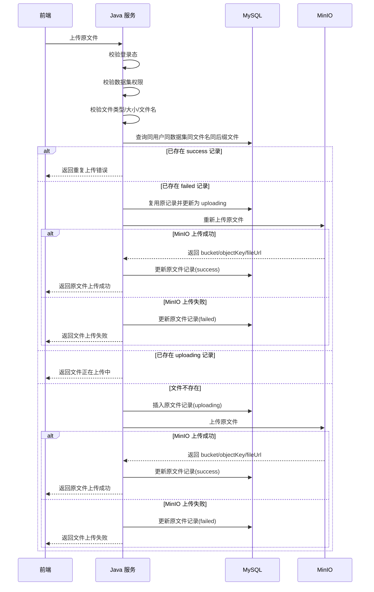

# ToLink Service 文件上传与解析协同重构 一期技术实现文档

> **文档状态：** 草稿
> **项目名称**：ToLink Service
> **模块名称**：文件上传与解析协同重构（一期）
> **需求文档**：`docs/模块开发文档/文件上传与解析/一期/requirement.md`
> **分支名称**：skill-test
> **技术负责人：** AI 协作草拟
> **最后更新时间：** 2026-04-25

---

## 1. 文档修订记录 (Change Log)
*规范：任何技术方案调整必须在此记录，避免口头变更和实现偏差。*

| 版本号 | 修改日期 | 修改内容简述 | 修改人 | 审核人 |
| :--- | :--- | :--- | :--- | :--- |
| v1.0 | 2026-04-25 | 初始版本创建，明确三表模型、MQ 投递、MinIO 存储与解析进度通道 | AI | 待审核 |
| v1.1 | 2026-04-25 | 收缩一期范围：本期只实现原文件上传，MQ 投递、解析进度和 Python 解析链路移至二期 | AI | 待审核 |
| v1.2 | 2026-04-25 | 拆分一期实现主体与二期预留边界；一期技术方案只保留上传链路实现内容 | AI | 待审核 |

---

## 2. 技术目标与实现范围 (Overview)

### 2.1 技术目标与核心思路 (Technical Goals)

* **技术目标：** 一期重构原文件上传链路，使 Java 端负责上传入口、原文件记录落库、MinIO 存储、上传状态更新和上传结果返回。
* **设计原则：** 本期只落原文件上传事实，不实现解析任务、MQ 投递、Python 解析、解析进度和解析结果文件。
* **成功标准：** 同一用户在同一数据集下，相同文件名和相同后缀的原文件不可重复上传；原文件能成功写入 MinIO；原文件表能记录上传状态和对象定位信息；前端能获得明确上传结果。

### 2.2 实现范围与边界 (In Scope / Out of Scope)

**本期必须实现：**

- 重建原文件上传主链路。
- 新增或调整原文件表。
- 支持同一用户在同一数据集下，按文件名和后缀识别原文件唯一。
- 支持原文件上传到 MinIO 并回写对象定位信息。
- 提供原文件上传、列表、详情接口。
- 上传失败时记录可识别状态和失败原因。

**本期明确不实现：**

- 不创建解析任务表。
- 不创建解析文件表。
- 不投递解析 MQ。
- 不定义 MQ 消息体。
- 不接入 Python 解析服务。
- 不实现解析百分比进度通道。
- 不提供解析任务状态、解析结果、解析历史查询接口。
- 不实现解析结果版本切换。
- 不进入向量化、检索、问答消费链路。
- 不修改 OSS、MQ、Redis framework 抽象。

### 2.3 验收项到实现点映射 (Requirement Mapping)

| 需求验收项 | 技术实现点 | 测试方式 | 责任模块 |
| :--- | :--- | :--- | :--- |
| 原文件上传 | 上传接口、原文件记录、MinIO 上传、上传状态回写 | Controller 集成测试 | `link-api` / `link-service` |
| 原文件唯一 | `dataset_id + user_id + original_filename + file_suffix` 唯一约束与业务前置校验 | Mapper / 接口测试 | `link-model` / `link-mapper` |
| 上传结果反馈 | 上传成功返回原文件信息；上传失败返回明确业务错误 | 接口测试 | `link-api` / `link-service` |
| 文件列表与详情 | 按数据集查询原文件列表，按文件 ID 查询详情 | Controller 集成测试 | `link-api` / `link-service` |

---

## 3. 当前系统分析与复用基础 (Current-State Analysis)

### 3.1 相关模块盘点

| 模块 | 当前职责 | 本期处理方式 | 是否修改 |
| :--- | :--- | :--- | :--- |
| `link-api` | Controller / API 入口 | 提供上传、列表、详情入口 | 是 |
| `link-service` | 业务服务 | 承担上传校验、原文件记录、MinIO 调用、状态回写 | 是 |
| `link-model` | Entity / DTO / Enum | 调整原文件实体、上传状态枚举、出入参 DTO | 是 |
| `link-mapper` | Mapper / 持久化 | 提供原文件写入、查重、列表、详情查询 | 是 |
| `link-core` | 通用异常 / 鉴权上下文 | 复用异常和登录上下文能力 | 否 |
| `link-components` | OSS / MQ / Redis 组件 | 本期只复用 OSS，不改 framework | 否 |

### 3.2 已复用能力 (Reusable Components)

- OSS：复用 `IOssService` 上传原文件，私有文件访问继续复用项目已有受控访问能力。
- 鉴权：复用 `@SaCheckLogin` 和 `AuthContext.getLoginUserIdOrThrow()`。
- 异常：复用 `BusinessException` 和统一 `Result<T>` 出参。
- 数据访问：复用现有 MyBatis / MyBatis-Plus 风格的 Mapper 组织方式。

### 3.3 已参考代码 (Code References)

| 文件/模块 | 参考点 | 对方案的影响 |
| :--- | :--- | :--- |
| `link-api/src/main/java/com/qingluo/link/api/controller/KnowledgeFileController.java` | 当前上传、列表、详情入口 | 新接口可沿用 storage 业务入口，但字段语义按新模型收敛 |
| `link-service/src/main/java/com/qingluo/link/service/impl/KnowledgeFileServiceImpl.java` | 当前上传、MinIO、解析通知混合实现 | 本期需要拆出只服务原文件上传的逻辑 |
| `link-model/src/main/java/com/qingluo/link/model/dto/entity/KnowledgeOriginalFile.java` | 当前原文件实体字段 | 原文件模型只保留上传事实和对象定位职责 |
| `docs/组件和数据库约定/middleware-components/oss_component.md` | OSS 组件职责和接入方式 | 业务层只使用 OSS 服务，不改 OSS framework |
| `docs/组件和数据库约定/middleware_contract.md` | MySQL、OSS 公共约定 | 表命名、公共字段、对象存储定位按项目契约收敛 |

### 3.4 现有问题与约束 (Constraints)

- 当前原文件模型中存在解析通知类字段，职责与一期目标不一致，本期接口语义不再依赖这些字段。
- 当前文件上传、解析通知、解析结果查询逻辑耦合在同一业务链路中，本期只保留上传主链路。
- 已检查 `docs/db/schema.sql`，当前文件未包含完整目标表结构定义，实现前需要补充正式 DDL 或迁移脚本。

---

## 4. 核心架构与实现方案 (Architecture & Solution)

### 4.1 总体设计思路 (Architecture Overview)

一期采用“一表一链路”模型：

- `document_original_file`：保存原文件上传事实、MinIO 定位信息和上传状态。
- Java Controller：接收上传、列表、详情请求。
- Java Service：完成权限校验、文件校验、同名校验、原文件记录、MinIO 上传、状态回写。
- MinIO：保存原始文件对象。
- MySQL：保存原文件结构化信息。

解析任务、解析结果、解析进度、MQ 消息体不进入一期实现主体。

### 4.2 一期调用链路 (Call Flow)

```text
前端选择文件
  -> Java Controller 接收上传请求
  -> Java Service 校验登录态、数据集权限、文件规则、同名约束
  -> MySQL 插入原文件记录(uploading)
  -> MinIO 保存原文件
  -> MySQL 回写 bucket/objectKey/fileUrl/upload_status
  -> Java Controller 返回上传结果
```

### 4.3 核心模块职责划分 (Module Responsibilities)

| 模块/类 | 本期职责 | 输入/输出边界 |
| :--- | :--- | :--- |
| `KnowledgeFileController` | 上传、列表、详情 HTTP 入口 | HTTP 请求 / `Result<T>` |
| `KnowledgeFileService` | 原文件上传、查询、状态更新 | userId、datasetId、fileId、file / DTO |
| `KnowledgeOriginalFileMapper` | 原文件持久化和查询 | Entity / DB |
| `IOssService` | 保存原文件对象 | MultipartFile / bucket、objectKey、访问定位 |
| `AuthContext` | 获取当前登录用户 | 登录态 / userId |

### 4.4 一期核心时序图 (Sequence Diagram)



---

## 5. 接口契约与交互方案 (API Contract)

### 5.1 一期接口清单

| 方法 | 路径 | 说明 | 权限 |
| :--- | :--- | :--- | :--- |
| POST | `/api/v1/datasets/{datasetId}/files` | 上传原文件 | 登录用户 |
| GET | `/api/v1/datasets/{datasetId}/files` | 查询数据集原文件列表 | 登录用户 |
| GET | `/api/v1/files/{fileId}` | 查询单个原文件详情 | 登录用户 |

说明：一期上传接口可以临时接收 `parseImmediately` 参数以兼容前端开关，但本期必须忽略该参数，不触发解析链路，也不返回解析任务信息。

### 5.2 请求参数

| 参数 | 位置 | 类型 | 必填 | 说明 |
| :--- | :--- | :--- | :--- | :--- |
| `datasetId` | path | Long | 是 | 数据集 ID |
| `file` | multipart | File | 是 | 原文件 |
| `parseImmediately` | query/form | Boolean | 否 | 一期可接收但不触发解析 |
| `fileId` | path | Long | 是 | 原文件 ID |
| `page` | query | Integer | 否 | 当前页 |
| `pageSize` | query | Integer | 否 | 每页数量 |

### 5.3 上传响应结构

```json
{
  "code": 200,
  "message": "success",
  "data": {
    "fileId": 1,
    "datasetId": 10,
    "originalFilename": "demo.pdf",
    "fileSuffix": "pdf",
    "fileSize": 102400,
    "uploadStatus": "success",
    "isUploadSuccess": true
  }
}
```

### 5.4 异常响应

| 场景 | HTTP 状态 | 业务错误码 | message |
| :--- | :--- | :--- | :--- |
| 未登录 | 401 | 401 | 请先登录 |
| 数据集不存在或无权访问 | 404 | 404 | 数据集不存在或无权访问 |
| 已成功的同名同后缀原文件重复 | 400 | 400 | 当前数据集下已存在同名同后缀原文件 |
| 失败原文件重试上传 | 200 / 500 | 200 / 500 | 重试成功返回上传成功；重试失败返回文件上传失败 |
| 同名同后缀文件正在上传中 | 409 | 409 | 文件正在上传中，请稍后重试 |
| 文件类型或大小不合法 | 400 | 400 | 当前文件不符合上传要求 |
| 原文件上传 MinIO 失败 | 500 | 500 | 文件上传失败，请稍后重试 |

### 5.5 兼容性说明

- 本期按“重新设计”处理，不承诺兼容旧解析相关返回字段。
- 旧 `parse_notice_status`、原文件上的 `parse_task_id` 等字段不作为新接口契约。
- 若前端保留“立即解析”开关，本期接口只接收参数并返回上传结果，不返回 `taskId`。

---

## 6. 数据契约与存储设计 (Data & Storage)

### 6.1 一期数据模型与实体关系 (E-R)

```text
dataset 1 - N document_original_file
user    1 - N document_original_file
```

### 6.2 数据库组件与结构变更 (Database & Schema Changes)

#### MySQL 变更

| 表名 | 变更类型 | 变更说明 | 备注 |
| :--- | :--- | :--- | :--- |
| `document_original_file` | 重建/调整 | 只保存原文件上传事实、MinIO 定位和上传状态 | 不保存解析任务、解析进度、解析结果 |

### 6.3 字段设计：`document_original_file`

| 字段 | 类型 | 是否必填 | 默认值 | 说明 |
| :--- | :--- | :--- | :--- | :--- |
| `id` | bigint | 是 | 自增 | 主键 |
| `dataset_id` | bigint | 是 | 无 | 数据集 ID |
| `user_id` | bigint | 是 | 无 | 上传用户 |
| `original_filename` | varchar | 是 | 无 | 原始文件名 |
| `file_suffix` | varchar | 是 | 无 | 文件后缀 |
| `file_size` | bigint | 是 | 0 | 文件大小 |
| `content_type` | varchar | 否 | null | MIME 类型 |
| `bucket_name` | varchar | 否 | null | 原文件 bucket，固定为 `rag-raw` |
| `object_key` | varchar | 否 | null | 原文件对象 key |
| `file_url` | varchar | 否 | null | Java 内部受控访问地址或对象访问定位 |
| `upload_status` | varchar | 是 | `uploading` | `uploading/success/failed` |
| `is_upload_success` | boolean | 是 | false | 上传成功冗余判断 |
| `failure_reason` | varchar | 否 | null | 上传失败原因 |
| `created_at` | datetime | 是 | 当前时间 | 创建时间 |
| `updated_at` | datetime | 是 | 当前时间 | 更新时间 |

说明：

- `bucket_name` 表示对象所在存储桶；一期原文件固定写入 `rag-raw`。
- `object_key` 表示对象在 bucket 内的唯一路径；一期重构后不再使用纯数字目录，用户和数据集目录必须带语义前缀。
- `file_url` 不建议保存 MinIO 私有直连签名 URL，优先保存 Java 内部受控访问地址或可稳定解析的访问定位。

### 6.4 索引与约束

- `document_original_file`：唯一索引 `uk_dataset_user_filename_suffix(dataset_id, user_id, original_filename, file_suffix)`。
- `document_original_file`：普通索引 `idx_dataset_user(dataset_id, user_id)`。
- `document_original_file`：普通索引 `idx_upload_status(upload_status)`，用于排查上传失败或未完成记录。

### 6.5 OSS / MinIO 存储约束

| 存储对象 | Bucket | Object Key 规则 | 说明 |
| :--- | :--- | :--- | :--- |
| 原文件 | `rag-raw` | `original/user-{userId}/dataset-{datasetId}/{yyyy}/{MM}/{dd}/{fileId}/{originalFilename}` | 一期目标 object key 规则；`userId` 与 `datasetId` 必须加语义前缀，不直接使用纯数字目录 |

补充约束：

- 现有代码路径为 `{userId}/{datasetId}/{yyyy}/{MM}/{dd}/{originalFilename}`，一期重构后调整为上表规则。
- 文件名不做额外业务规范化；大小写敏感，`A.pdf` 与 `a.pdf` 视为不同文件名。
- 文件名和后缀相同即认为是同一份原文件，不按文件内容 hash 区分。
- `{fileId}` 用于降低同名文件、重传残留和对象覆盖风险；唯一规则仍以“数据集 + 用户 + 文件名 + 后缀”数据库唯一索引为准。
- object key 不包含 bucket，bucket 单独记录在 `bucket_name`。
- 原文件 bucket 固定为 `rag-raw`，不再使用 provider 默认私有 bucket 名称作为业务语义。

### 6.6 数据迁移与回滚

* **是否需要迁移：** 一期需要调整原文件表。若已有原文件数据需要保留，实施前需补充迁移脚本。
* **迁移策略：** 优先保留可映射的原文件基础字段；解析通知、解析任务、解析结果字段不迁入一期接口语义。
* **回滚策略：** 上线前保留旧表备份；若回滚，停止新接口写入，恢复旧服务版本和旧表结构。

---

## 7. 核心实现逻辑 (Core Implementation)

### 7.1 Service / Component 设计

```java
public interface KnowledgeFileService {
    KnowledgeFileUploadDTO upload(Long userId, Long datasetId, MultipartFile file, boolean parseImmediately);
    KnowledgeFileDTO detail(Long userId, Long fileId);
    PageResult<KnowledgeFileDTO> list(Long userId, Long datasetId, int page, int pageSize);
}
```

### 7.2 核心方法职责

| 方法 | 职责 | 输入 | 输出 |
| :--- | :--- | :--- | :--- |
| `upload` | 校验、写原文件、上传 MinIO、回写上传状态 | userId、datasetId、file、parseImmediately | 上传结果 DTO |
| `uploadObjectWithTimeout` | 将 OSS 上传任务提交到专用线程池，并等待上传结果 | file、objectKey | OSS 返回值或超时异常 |
| `detail` | 查询原文件详情并校验用户权限 | userId、fileId | 文件 DTO |
| `list` | 查询数据集原文件列表并校验用户权限 | userId、datasetId、page、pageSize | 分页 DTO |

### 7.3 上传关键处理流程

1. Controller 获取当前登录用户。
2. Service 校验数据集存在且当前用户有权限。
3. Service 校验文件名、文件大小、文件类型等基础规则。
4. Service 基于 `dataset_id + user_id + original_filename + file_suffix` 查询已有原文件记录。
5. 若已有记录为 `success`，拒绝重复上传。
6. 若已有记录为 `uploading` 且未超过 1 分钟上传超时时间，返回“文件正在上传中”。
7. 若已有记录为 `uploading` 且已超过 1 分钟上传超时时间，后台补偿任务会将该记录更新为 `failed` 并写入超时失败原因；后续上传按失败记录重试流程处理。
8. 若已有记录为 `failed`，复用该记录，将状态更新为 `uploading`，清理旧 `failure_reason`，并复用原 `object_key` 重新上传 MinIO；若 MinIO 中已存在同 object key 残留对象，直接覆盖。
9. 若不存在已有记录，Service 插入原文件记录，状态为 `uploading`。
10. Service 将 OSS 上传动作提交到专用线程池 `knowledgeFileUploadExecutor`，请求线程等待线程池任务返回。
11. 线程池任务调用 OSS 组件上传原文件到 MinIO，请求线程最多等待 30 秒。
12. MinIO 上传成功后，Service 回写 `bucket_name`、`object_key`、`file_url`、`upload_status=success`、`is_upload_success=true`、`failure_reason=null`。
13. MinIO 上传失败、网络异常、线程池拒绝、请求等待超时或服务异常可感知时，Service 必须回写 `upload_status=failed`、`is_upload_success=false`、`failure_reason`。
14. 对未能在请求链路中回写失败的 `uploading` 记录，后台补偿任务按 1 分钟上传超时口径转为 `failed`。
15. 本期流程结束，不创建解析任务，不发送 MQ。

### 7.4 并发、幂等与一致性

- **并发控制：** 同一用户、同一数据集、同一文件名、同一后缀的原文件依赖唯一索引兜底；业务层上传前先查重，DB 唯一约束处理竞态。
- **幂等策略：** 一期以 `dataset_id + user_id + original_filename + file_suffix` 作为重复上传识别口径；`success` 拒绝重复，`failed` 复用原记录重试，`uploading` 阻止并发重复提交。
- **事务边界：** 原文件记录创建和状态回写在 Java 本地事务中处理；MinIO 与 DB 非强事务。
- **失败一致性：** MinIO 上传失败、网络异常、请求中断或服务异常可感知时，必须落库为失败状态，避免用户误判为上传完成。
- **上传线程模型：** OSS 上传不直接在请求线程中创建线程，而是提交到专用线程池；请求线程最多等待 30 秒，超时后记录失败，后续重试复用并覆盖原 `object_key`。
- **上传超时补偿：** 文件一般不大，本期上传超时时间按 1 分钟定义；超过 1 分钟仍为 `uploading` 且没有成功或失败状态更新的记录，由后台补偿任务更新为 `failed` 并写入超时失败原因。
- **残留对象覆盖：** 失败记录重试时复用原 `object_key`；即使 MinIO 中已有同 key 残留对象，也直接覆盖。
- **DB 回写失败口径：** MinIO 上传成功但 DB 回写失败属于低概率异常，本期按错误日志和告警处理；如出现对象已存在但 DB 未成功记录的孤儿对象，进入后续人工排查或清理。

---

## 8. 组件集成与配置方案 (Integration Design)

| 组件 | 本期用途 | 配置项 | 失败处理 |
| :--- | :--- | :--- | :--- |
| OSS / MinIO | 保存原文件 | `tolink.oss.*` | 上传失败更新原文件失败原因 |
| MySQL | 保存原文件结构化记录 | `tolink_rag_db` | 写入失败抛业务异常 |

说明：MQ、Redis、Python 回调不属于一期组件集成范围。

---

## 9. 权限、安全与审计设计 (Security)

### 9.1 认证与授权

| 操作 | 权限要求 | 校验位置 |
| :--- | :--- | :--- |
| 上传文件 | 登录且拥有目标数据集权限 | Controller 获取 userId，Service 校验 dataset |
| 查询文件列表 | 登录且拥有目标数据集权限 | Service 查询条件带 userId / dataset 权限 |
| 查询文件详情 | 登录且文件属于当前用户可访问数据集 | Service 查询条件带 userId / dataset 权限 |

### 9.2 敏感数据处理

- 不在日志中打印完整私有 URL、签名 URL 或对象存储凭据。
- `file_url` 优先使用 Java 内部受控下载地址，不暴露 MinIO 私有直连信息。
- 上传失败日志保留必要排查信息，但不记录文件正文内容。

### 9.3 审计要求

- 记录上传失败、MinIO 上传失败、同名同后缀文件重复拒绝等关键事件。
- 日志建议包含 `user_id`、`dataset_id`、`original_filename`、`upload_status`，避免记录敏感对象存储凭据。

---

## 10. 异常处理与降级策略 (Exceptions & Fallback)

| 异常场景 | 处理方式 | 错误码 | 用户提示 | 是否重试 |
| :--- | :--- | :--- | :--- | :--- |
| 未登录 | 统一鉴权拦截 | 401 | 请先登录 | 否 |
| 数据集不存在或无权访问 | Service 拒绝操作 | 404 | 数据集不存在或无权访问 | 否 |
| 已成功的同名同后缀原文件重复 | 业务校验 + 唯一索引兜底 | 400 | 当前数据集下已存在同名同后缀原文件 | 否 |
| 失败原文件重试上传 | 复用原失败记录重新上传 MinIO | 200 / 500 | 重试成功返回上传成功；重试失败返回上传失败 | 是 |
| 同名同后缀文件正在上传中 | 阻止并发重复提交 | 409 | 文件正在上传中，请稍后重试 | 是 |
| 上传中记录超时 | 后台补偿任务在 1 分钟无状态更新后置为 `failed` | 200 / 500 | 文件上传失败，请重新上传 | 是 |
| 文件类型或大小不合法 | 上传前校验拒绝 | 400 | 当前文件不符合上传要求 | 否 |
| MinIO 上传原文件失败 | 更新原文件失败状态 | 500 | 文件上传失败，请稍后重试 | 是 |
| 数据库写入失败 | 抛业务异常并记录日志 | 500 | 文件上传失败，请稍后重试 | 是 |
| MinIO 成功但数据库回写失败 | 记录错误日志和告警，后续人工排查或清理孤儿对象 | 500 | 文件上传状态异常，请联系管理员或稍后重试 | 是 |

---

## 11. 测试与验证方案 (Test Plan)

### 11.1 单元测试

| 测试类 | 覆盖内容 |
| :--- | :--- |
| `KnowledgeFileServiceImplTest` | 上传校验、同名拒绝、MinIO 成功、MinIO 失败、原文件状态回写 |
| `KnowledgeOriginalFileMapperTest` | 数据集 + 用户 + 文件名 + 后缀唯一查询、列表查询、详情查询 |

### 11.2 集成测试

| 测试类 | 覆盖接口/流程 |
| :--- | :--- |
| `KnowledgeFileControllerTest` | 上传、列表、详情 |

### 11.3 回归测试

| 回归点 | 验证方式 |
| :--- | :--- |
| 数据集权限 | 非本人可访问数据集不能上传或查询 |
| 原文件重复上传 | 同一用户在同一数据集下，相同文件名和相同后缀只能成功一次 |
| MinIO 异常 | 上传失败时原文件状态可识别 |
| 旧解析字段隔离 | 新接口不返回旧解析通知字段作为业务契约 |

### 11.4 验证命令

```bash
mvn -pl link-api -am test
mvn -pl link-service -am test
```

---

## 12. 发布与上线方案 (Release Plan)

### 12.1 配置项

| 配置项 | 默认值 | 说明 |
| :--- | :--- | :--- |
| `tolink.oss.*` | 沿用现有 | MinIO / local provider 配置 |

### 12.2 发布步骤

1. 合入一期数据库 DDL，创建或调整原文件表和索引。
2. 部署 Java 服务，启用新上传、列表、详情接口。
3. 联调前端批量上传和上传结果展示。
4. 观察上传失败、MinIO 上传失败、同名重复拒绝日志。

### 12.3 回滚方案

- 回滚 Java 服务到旧版本。
- 停止新上传接口写入。
- 保留新表数据用于排查，不直接删除。
- 如已迁移旧数据，使用上线前备份恢复旧表。

---

## 13. 二期预留边界 (Phase 2 Reserved Scope)

本节只记录二期边界，避免一期实现遗漏扩展空间；不作为本期开发内容。

### 13.1 二期能力范围

- 解析任务创建。
- MQ 投递解析任务。
- MQ 消息体定义。
- Python 消费解析任务。
- Python 解析进度百分比上报。
- 解析任务状态推进。
- 解析结果文件保存。
- 最新解析文件记录维护。
- 失败文件再次解析。

### 13.2 二期数据对象

- `document_parse_task`：记录每次解析任务的生命周期、解析时间、结果和失败原因。
- `document_parsed_file`：记录每个原文件当前最新成功解析文件，并在成功解析后维护成功解析次数。

### 13.3 二期不在本期定稿的内容

- MQ topic、group、routing key、消息体字段。
- Python 回调接口与鉴权方式。
- Redis 解析进度 key 和 TTL。
- 解析任务表、解析文件表正式字段和索引。
- MQ 发送失败、任务补发、解析失败重试的技术策略。
