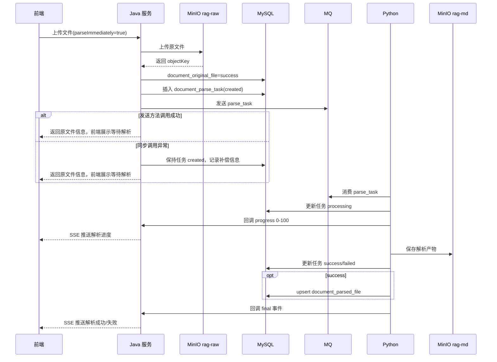
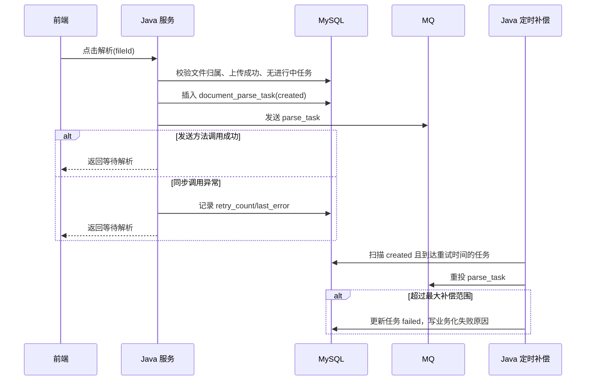

# ToLink Service 文件上传与解析协同重构二期技术实现文档

> **文档状态：** 技术方案待审核
> **项目名称**：ToLink Service
> **模块名称**：文件上传与解析协同重构（二期）
> **需求文档**：`docs/模块开发文档/文件上传与解析/二期/requirement.md`
> **分支名称**：feature/knowledge_file_upload_and_parse
> **技术负责人：** AI 协作草拟
> **最后更新时间：** 2026-04-26

---

## 1. 文档修订记录 (Change Log)

| 版本号 | 修改日期 | 修改内容简述 | 修改人 | 审核人 |
| :--- | :--- | :--- | :--- | :--- |
| v1.0 | 2026-04-25 | 初始化二期技术方案，沉淀解析任务、MQ、Python、进度、解析文件设计 | AI | 待审核 |
| v1.1 | 2026-04-26 | 按新版 PRD 和一期真实代码重建设计，改为 Java 创建任务、MQ 简化补偿、Python 直接写库、SSE 进度反馈 | AI | 待审核 |

---

## 2. 技术目标与实现范围 (Overview)

### 2.1 技术目标与核心思路 (Technical Goals)

* **技术目标：** 在一期原文件上传成功链路上，补齐“解析任务创建、MQ 投递、Python 解析、SSE 进度反馈、结果查询、失败重试”的二期解析协同能力。
* **设计原则：** 原文件表只记录上传事实；解析任务表记录每次解析尝试；解析产物表只记录每个原文件最新成功解析产物；Java 负责创建任务、投递 MQ、SSE 推送和前端查询；Python 负责消费任务、解析文件、写任务状态和最新解析产物。
* **成功标准：** 只上传模式和上传立即解析模式均可工作；同一原文件在等待解析或解析中时不能重复提交；前端可通过 SSE 看到百分比进度；所有文件完成后可查询文件名和解析结果；MQ 临时投递失败不直接暴露给用户，超过补偿范围后进入解析失败。

### 2.2 实现范围与边界 (In Scope / Out of Scope)

**必须实现：**

- 新增解析任务表 `document_parse_task` 和实体、Mapper。
- 调整 `document_parsed_file` 为“最新成功解析产物表”，补充成功解析次数。
- 上传接口 `parseImmediately=true` 时，在原文件上传成功后自动创建解析任务并投递 MQ。
- 新增手动解析接口，基于已上传成功的原文件创建解析任务并投递 MQ。
- 新增 `parse_task` MQ 消息模型，复用项目 `AbstractMQ` / `MQSend`。
- 新增 MQ 投递补偿定时任务，扫描长期停留 `created` 的任务重投。
- 新增 SSE 进度通道，Python 回调 Java 后由 Java 推给浏览器。
- 新增 Python 内部回调接口，用于上报解析进度和最终结果事件。
- 新增解析结果查询接口，按本次文件列表返回文件名、解析结果和业务化失败原因。
- 禁止同一原文件在 `created` / `processing` 任务存在时再次提交解析。

**暂不实现：**

- 不引入 Redis 保存解析进度。
- 不新增批次表，批量结束由前端按本次文件列表自行判断。
- 不提供解析产物预览和下载。
- 不做解析产物历史版本人工切换。
- 不做向量化、检索、问答消费链路。
- 不改 MQ / OSS framework 抽象。
- 不采用 Java 消费 `parse_result` MQ 后写解析结果的旧链路。
- 不实现本地消息表 / Outbox；该能力作为三期候选目标。
- 不调整一期原文件删除链路；原文件软删除、解析产物由 Java 物理删除等删除策略放到三期独立处理。

### 2.3 验收项到实现点映射 (Requirement Mapping)

| 需求验收项 | 技术实现点 | 测试方式 | 责任模块 |
| :--- | :--- | :--- | :--- |
| 自动解析 | `KnowledgeFileServiceImpl.upload` 上传成功后调用解析任务服务 | Controller / Service 测试 | `link-api` / `link-service` |
| 手动解析 | 新增文件解析提交接口，校验文件归属和上传状态 | Controller / Service 测试 | `link-api` / `link-service` |
| 禁止重复点击解析 | 查询同原文件 `created/processing` 任务并拒绝新任务 | Service 测试 | `link-service` |
| MQ 投递与补偿 | `KnowledgeParseTaskMQ` + `MQSend` + 定时补偿扫描 | MQ 序列化测试 / Service 测试 | `link-service` |
| SSE 进度条 | `SseEmitter` 注册、Python 进度回调、按 fileId 推送事件 | Controller 测试 | `link-api` / `link-service` |
| 最终结果展示 | 结果查询接口按 fileIds 返回文件名和解析结果 | Controller / Mapper 测试 | `link-api` / `link-service` |
| 最新解析产物 | Python 写 `document_parsed_file`，Java 只查询不预览下载 | Mapper / 接口测试 | Python / `link-service` |

---

## 3. 当前系统分析与复用基础 (Current-State Analysis)

### 3.1 相关模块盘点

| 模块 | 当前职责 | 现状说明 | 是否修改 |
| :--- | :--- | :--- | :--- |
| `link-api` | Controller / API 入口 | 已有 `KnowledgeFileController`、`InternalKnowledgeFileController` 和统一异常处理 | 是 |
| `link-service` | 业务服务 | 已有一期上传实现、旧解析结果 MQ 消费链路、上传线程池和定时补偿 | 是 |
| `link-model` | Entity / DTO / Enum | 已有 `KnowledgeOriginalFile`、`KnowledgeParsedFile`、`KnowledgeFileDTO`、`Result`、`ErrorCode` | 是 |
| `link-mapper` | Mapper / 持久化 | 已有原文件和解析文件 Mapper | 是 |
| `link-core` | 通用异常 / 工具 | 已有 `BusinessException`、`ErrorCode`、全局异常处理 | 是 |
| `link-components` | MQ / OSS framework | 已有 `AbstractMQ`、`MQSend`、`IOssService`、`PrivateFileResolver` | 否 |

### 3.2 已复用能力 (Reusable Components)

- **统一响应：** 复用 `Result<T>`，成功为 `code=200,message=success`。
- **异常体系：** 复用 `BusinessException`、`ErrorCode`、`GlobalExceptionHandler`。
- **登录鉴权：** 复用 `@SaCheckLogin` 和 `AuthContext.getLoginUserIdOrThrow()`。
- **内部服务鉴权：** 复用 `InternalKnowledgeFileController` 中 `Authorization: Bearer {serviceToken}` 的服务间鉴权风格。
- **MQ：** 复用 `AbstractMQ` / `MQSend`；业务消息放在 `link-service`，不改 `link-components`。
- **OSS：** 原文件继续复用一期对象定位；解析产物由 Python 写入 `rag-md`，Java 只保存和查询元数据。

### 3.3 已参考代码 (Code References)

| 文件/模块 | 参考点 | 对方案的影响 |
| :--- | :--- | :--- |
| `link-api/src/main/java/com/qingluo/link/api/controller/KnowledgeFileController.java` | 文件上传、列表、详情、删除入口 | 二期继续扩展文件解析接口，沿用登录态和 `Result<T>` |
| `link-api/src/main/java/com/qingluo/link/api/controller/InternalKnowledgeFileController.java` | 内部服务 Token 校验、原文件下载 | Python 进度/结果回调接口沿用 Bearer 服务 Token |
| `link-service/src/main/java/com/qingluo/link/service/impl/KnowledgeFileServiceImpl.java` | 一期上传、超时补偿、object key 生成 | 上传成功后接入自动解析；原文件表仍不写解析状态 |
| `link-service/src/main/java/com/qingluo/link/service/KnowledgeFileService.java` | 原文件服务边界说明 | 二期解析逻辑独立为解析任务服务，避免原文件服务过胖 |
| `link-model/src/main/java/com/qingluo/link/model/dto/entity/KnowledgeOriginalFile.java` | 原文件表实体、旧解析字段为非表字段 | 二期新增解析任务表承载解析状态，不恢复原文件解析字段 |
| `link-model/src/main/java/com/qingluo/link/model/dto/entity/KnowledgeParsedFile.java` | 当前解析文件实体 | 二期调整为最新成功解析产物模型 |
| `docs/db/init.sql` | 当前原文件表和解析文件表 DDL | 二期新增任务表并调整解析文件表 |
| `link-service/src/main/java/com/qingluo/link/service/mq/KnowledgeParseResultMQ.java` | 旧解析结果 MQ envelope 写法 | 新增 `KnowledgeParseTaskMQ` 改为二期约定的扁平消息体 |
| `link-service/src/main/java/com/qingluo/link/service/mq/kafka/KnowledgeParseResultKafkaReceiver.java` | 旧 Kafka 结果消费入口 | 二期不再作为解析结果写库主链路 |
| `link-service/src/main/java/com/qingluo/link/service/impl/KnowledgeParseResultServiceImpl.java` | 旧 Java 写解析文件逻辑 | 二期应删除或禁用，避免和 Python 直接写库双写 |
| `link-components/toLink-components-mq/.../KafkaMQSend.java` | Kafka `send()` 当前异步发送不等待 ack | 二期 MQ 补偿只能覆盖同步调用异常，强一致留到三期 Outbox |
| `docs/组件和数据库约定/middleware-components/kafka_component.md` | MQ 组件接入方式 | 业务新增消息模型，不改 framework |
| `docs/组件和数据库约定/middleware-components/oss_component.md` | OSS 组件接入方式 | Java 不直接预览/下载解析产物，不改 OSS framework |
| `docs/组件和数据库约定/middleware_contract.md` | MySQL / MQ / OSS 约定 | 本期会形成新的解析任务、SSE、解析产物路径契约，需要回写公共契约 |

### 3.4 现有问题与约束 (Constraints)

- `docs/组件和数据库约定/middleware_contract.md` 中原文件 OSS 路径已按一期真实代码回写为 `original/user-{userId}/dataset-{datasetId}/{yyyy}/{MM}/{dd}/{fileId}/{filename}`，本技术方案评审时需一并确认。
- 当前 `document_parsed_file` 同时包含解析状态和最新结果信息；二期需要把状态历史移到 `document_parse_task`。
- 当前旧 `parse_result` 消费链路会由 Java 写解析文件；二期若继续启用会和 Python 直接写库冲突，必须删除、禁用或改为非主链路。
- 当前 Kafka `MQSend.send()` 不等待 broker ack，不能把“方法未抛异常”等同于消息已可靠落盘；二期通过 `created` 补偿降低风险，三期再考虑 Outbox。
- SSE 进度为单机内存连接管理；多 Java 实例下的跨节点进度分发不在二期解决，移动到三期。

---

## 4. 核心架构与实现方案 (Architecture & Solution)

### 4.1 总体设计思路 (Architecture Overview)

二期采用“三张表 + MQ 下发 + 回调事件 + SSE 推送”的模型：

- `document_original_file`：一期已落地，只负责原文件上传事实。
- `document_parse_task`：二期新增，记录每一次解析任务和状态流转。
- `document_parsed_file`：二期调整，只记录当前最新成功解析产物和成功解析次数。
- `tolink.rag.parse_task`：Java 创建任务后下发给 Python。
- Python 回调 Java：进度和最终结果事件统一走内部回调接口。
- Java SSE：将 Python 回调事件推给当前浏览器连接；不持久化百分比进度。

### 4.2 目标调用链路 (Call Flow)

```text
只上传:
前端上传文件 -> Java 上传 MinIO -> Java 写原文件 success -> 返回原文件信息 -> 前端展示已上传待解析

上传并立即解析:
前端上传文件(parseImmediately=true) -> Java 上传 MinIO -> Java 写原文件 success
-> Java 创建解析任务(created) -> Java 投递 parse_task -> 返回原文件信息 -> 前端展示等待解析

手动解析:
前端点击解析 -> Java 校验文件归属/上传成功/无进行中任务
-> Java 创建解析任务(created) -> Java 投递 parse_task -> 返回等待解析

解析执行:
Python 消费 parse_task -> Python 更新任务 processing -> Python 回调 Java 进度
-> Java SSE 推送进度 -> Python 保存解析产物到 rag-md
-> Python 写任务 success/failed 和最新解析产物 -> Python 回调 Java 最终事件
-> Java SSE 推送最终结果 -> 前端展示本次所有文件结果，并自行判断是否全部完成
```

### 4.3 核心模块职责划分 (Module Responsibilities)

| 模块/类 | 职责 | 输入/输出边界 |
| :--- | :--- | :--- |
| `KnowledgeFileController` | 保留上传/列表/详情/删除；新增手动解析、解析结果查询、SSE 订阅入口 | 用户 HTTP 请求 / `Result<T>` 或 `SseEmitter` |
| `InternalKnowledgeFileController` | 保留原文件内部下载；新增 Python 解析事件回调入口 | Bearer 服务 Token + 回调事件 |
| `KnowledgeFileServiceImpl` | 一期上传成功后按 `parseImmediately` 调用解析任务服务 | 原文件上传请求 / `KnowledgeFileDTO` |
| `KnowledgeParseTaskService` | 创建任务、禁止重复解析、投递 MQ、补偿重投、查询结果 | fileId、userId、triggerMode |
| `KnowledgeParseSseService` | 管理 SSE 连接和按文件推送进度/最终事件 | userId、fileId、event |
| `KnowledgeParseTaskMQ` | `parse_task` 消息模型 | 扁平 JSON 消息体 |
| `KnowledgeParseTaskMapper` | 解析任务表持久化 | Entity / DB |
| `KnowledgeParsedFileMapper` | 最新解析产物查询 | Entity / DB |

### 4.4 核心时序图 (Sequence Diagrams)

#### 场景 1：上传并立即解析



#### 场景 2：手动解析与补偿重投



---

## 5. 接口契约与交互方案 (API Contract)

### 5.1 接口清单

| 方法 | 路径 | 说明 | 权限 |
| :--- | :--- | :--- | :--- |
| POST | `/api/v1/datasets/{datasetId}/files` | 一期上传接口，二期支持 `parseImmediately=true` 自动提交解析 | 登录用户 |
| POST | `/api/v1/files/{fileId}/parse` | 手动发起解析或失败后再次解析 | 登录用户 |
| GET | `/api/v1/datasets/{datasetId}/files/parse-events` | SSE 订阅本次文件列表的解析进度和最终事件 | 登录用户 |
| GET | `/api/v1/datasets/{datasetId}/files/parse-results` | 查询本次文件列表的解析结果汇总 | 登录用户 |
| POST | `/api/v1/internal/parse-tasks/{taskId}/events` | Python 上报进度和最终事件 | 内部服务 Token |

说明：

- 自动解析不要求前端拿 `task_id`；上传成功后前端本地把该文件切到“等待解析”。
- 手动解析响应也不向前端暴露 `task_id`，前端按 `fileId` 订阅和查询。
- 如后续排障需要任务历史，可在管理端另行设计，不纳入二期前端主链路。

### 5.2 请求参数

| 接口 | 参数 | 位置 | 类型 | 必填 | 说明 |
| :--- | :--- | :--- | :--- | :--- | :--- |
| 上传 | `parseImmediately` | query/form | boolean | 否 | `true` 表示上传成功后自动提交解析 |
| 手动解析 | `fileId` | path | Long | 是 | 原文件 ID |
| SSE 订阅 | `datasetId` | path | Long | 是 | 数据集 ID |
| SSE 订阅 | `fileIds` | query | String | 是 | 本次关注的文件 ID 列表，逗号分隔 |
| 结果查询 | `fileIds` | query | String | 是 | 本次文件 ID 列表，逗号分隔 |
| Python 回调 | `taskId` | path | String | 是 | 解析任务业务 ID |
| Python 回调 | `eventType` | body | String | 是 | `processing/progress/success/failed` |
| Python 回调 | `progress` | body | Integer | 否 | 百分比，0-100 |
| Python 回调 | `failureReason` | body | String | 否 | 业务化失败原因 |

### 5.3 响应结构

手动解析提交响应：

```json
{
  "code": 200,
  "message": "success",
  "data": {
    "fileId": 10000,
    "originalFilename": "demo.pdf",
    "frontendStatus": "parse_waiting"
  }
}
```

SSE 事件数据：

```json
{
  "fileId": 10000,
  "originalFilename": "demo.pdf",
  "frontendStatus": "parsing",
  "progress": 68,
  "parseStatus": "processing",
  "failureReason": null
}
```

结果查询响应：

```json
{
  "code": 200,
  "message": "success",
  "data": [
    {
      "fileId": 10000,
      "originalFilename": "demo.pdf",
      "frontendStatus": "parse_success",
      "parseStatus": "success",
      "failureReason": null
    }
  ]
}
```

### 5.4 异常响应

| 场景 | HTTP 状态 | 业务错误码 | message |
| :--- | :--- | :--- | :--- |
| 原文件不存在或无权访问 | 404 | 404 | 文件不存在或无权访问 |
| 原文件未上传成功 | 400 | 400 | 原文件尚未上传成功，不能解析 |
| 同一文件已有等待解析或解析中任务 | 409 | 409 | 文件正在解析中，请勿重复提交 |
| 解析任务不存在 | 404 | 404 | 解析任务不存在 |
| Python 回调进度非法 | 400 | 400 | 解析进度必须在 0 到 100 之间 |
| 内部接口鉴权失败 | 401 | 401 | 服务鉴权失败 |
| SSE 文件列表为空 | 400 | 400 | 请选择要查看的文件 |

### 5.5 异常类与错误码定义

| 异常类 | 继承关系 | 使用场景 | 说明 |
| :--- | :--- | :--- | :--- |
| 复用 `BusinessException` | `RuntimeException` | 文件无权访问、状态非法、重复解析、内部回调参数非法 | 保持当前 Controller 风格 |

二期优先沿用当前项目中直接构造 `BusinessException(code,message,httpStatus)` 的写法。若实现阶段补充枚举，建议在 `ErrorCode` 新增知识文件范围：

| 错误码 | 枚举名/常量名 | HTTP 状态 | 触发场景 | 前端提示策略 |
| :--- | :--- | :--- | :--- | :--- |
| 10011 | `KNOWLEDGE_FILE_NOT_FOUND` | 404 | 文件不存在或无权访问 | toast |
| 10012 | `KNOWLEDGE_FILE_NOT_UPLOADED` | 400 | 原文件未上传成功 | toast |
| 10013 | `KNOWLEDGE_FILE_PARSE_RUNNING` | 409 | 文件已有进行中解析任务 | 禁用按钮并提示 |
| 10014 | `KNOWLEDGE_PARSE_TASK_NOT_FOUND` | 404 | 任务不存在 | toast |
| 10015 | `KNOWLEDGE_PARSE_PROGRESS_INVALID` | 400 | 回调进度非法 | 内部调用方排查 |

### 5.6 兼容性说明

- 上传接口路径保持不变，`parseImmediately` 从一期兼容参数变为二期真实开关。
- `KnowledgeFileDTO` 仍只表达原文件上传事实，不混入解析任务进度。
- 旧 `parse_result` MQ 消费链路不再作为结果写库主链路；实现阶段应删除或条件禁用旧消费者，避免双写。

---

## 6. 数据契约与存储设计 (Data & Storage)

### 6.1 数据模型与实体关系 (E-R)

```text
document_original_file 1 - N document_parse_task
document_original_file 1 - 1 document_parsed_file
document_parse_task   1 - 0/1 document_parsed_file(latest_success_task_id)
```

### 6.2 数据库组件与结构变更 (Database & Schema Changes)

| 表名 | 变更类型 | 变更说明 | 备注 |
| :--- | :--- | :--- | :--- |
| `document_parse_task` | 新增 | 保存每次解析任务、状态、MQ 补偿信息、解析时间、结果和失败原因 | Java 创建，Python 更新状态和结果 |
| `document_parsed_file` | 调整 | 保存每个原文件当前最新成功解析产物和成功解析次数 | Python 成功解析后 upsert |
| `document_original_file` | 不改表结构 | 继续只保存上传事实 | 二期只读取上传成功状态和原文件定位 |

### 6.3 字段设计：`document_parse_task`

| 字段 | 类型 | 是否必填 | 默认值 | 说明 |
| :--- | :--- | :--- | :--- | :--- |
| `id` | bigint unsigned | 是 | 自增 | 主键 |
| `task_id` | varchar(36) | 是 | 无 | 解析任务业务 ID，UUID，唯一 |
| `document_original_file_id` | bigint unsigned | 是 | 无 | 原文件 ID |
| `dataset_id` | bigint unsigned | 是 | 无 | 数据集 ID |
| `user_id` | bigint unsigned | 是 | 无 | 用户 ID |
| `trigger_mode` | varchar(20) | 是 | 无 | `upload_auto/manual_retry` |
| `task_status` | varchar(16) | 是 | `created` | `created/processing/success/failed` |
| `failure_reason` | varchar(512) | 否 | null | 前端展示的业务化失败原因 |
| `dispatch_retry_count` | int | 是 | 0 | Java MQ 补偿重试次数 |
| `last_dispatch_error` | varchar(512) | 否 | null | 最近一次投递异常摘要，不直接展示给用户 |
| `last_dispatched_at` | datetime | 否 | null | 最近一次调用 MQ 发送时间 |
| `parse_started_at` | datetime | 否 | null | Python 开始解析时间 |
| `parse_finished_at` | datetime | 否 | null | Python 结束解析时间 |
| `parse_duration_ms` | bigint | 否 | null | 解析耗时 |
| `created_at` | datetime | 是 | 当前时间 | 创建时间 |
| `updated_at` | datetime | 是 | 当前时间 | 更新时间 |

### 6.4 字段设计：`document_parsed_file`

| 字段 | 类型 | 是否必填 | 默认值 | 说明 |
| :--- | :--- | :--- | :--- | :--- |
| `id` | bigint unsigned | 是 | 自增 | 主键 |
| `document_original_file_id` | bigint unsigned | 是 | 无 | 原文件 ID，唯一 |
| `dataset_id` | bigint unsigned | 是 | 无 | 数据集 ID |
| `user_id` | bigint unsigned | 是 | 无 | 用户 ID |
| `latest_success_task_id` | varchar(36) | 是 | 无 | 最新成功解析任务 ID |
| `original_filename` | varchar(255) | 是 | 无 | 原始文件名快照 |
| `parsed_filename` | varchar(255) | 否 | null | 解析产物文件名 |
| `parsed_bucket_name` | varchar(64) | 是 | `rag-md` | 解析产物 bucket |
| `parsed_object_key` | varchar(512) | 是 | 无 | 解析产物 object key |
| `parsed_file_url` | varchar(1024) | 否 | null | 内部定位地址，本期不对前端暴露 |
| `parsed_storage_path` | varchar(1024) | 否 | null | `bucket/objectKey` 组合定位 |
| `parse_count` | int | 是 | 1 | 累计成功解析次数，仅成功后递增 |
| `parsed_at` | datetime | 是 | 无 | 最新成功解析时间 |
| `created_at` | datetime | 是 | 当前时间 | 创建时间 |
| `updated_at` | datetime | 是 | 当前时间 | 更新时间 |

说明：

- `document_parsed_file` 不再保存失败状态。失败属于 `document_parse_task`。
- 本期前端不下载、不预览解析产物，因此 `parsed_file_url` 不作为前端响应字段。

### 6.5 索引与约束

- `document_parse_task`：唯一索引 `uk_parse_task_id(task_id)`。
- `document_parse_task`：普通索引 `idx_parse_task_original_status(document_original_file_id, task_status, updated_at)`，用于禁止重复解析和补偿扫描。
- `document_parse_task`：普通索引 `idx_parse_task_dataset_user(dataset_id, user_id, created_at)`，用于权限范围查询。
- `document_parse_task`：普通索引 `idx_parse_task_status_retry(task_status, dispatch_retry_count, last_dispatched_at)`，用于 MQ 补偿。
- `document_parsed_file`：唯一索引 `uk_document_parsed_original_file(document_original_file_id)`。
- `document_parsed_file`：普通索引 `idx_document_parsed_dataset_user(dataset_id, user_id, updated_at)`。
- `document_parsed_file`：普通索引 `idx_document_parsed_latest_task(latest_success_task_id)`。

### 6.6 中间件与其他存储设计

| 组件 | 存储内容 | Key/Path 规则 | 备注 |
| :--- | :--- | :--- | :--- |
| Redis | 不使用 | 无 | 本期不引入 Redis 进度 |
| MQ | 解析任务消息 | `tolink.rag.parse_task` | Java 发送，Python 消费 |
| OSS / MinIO | 原文件 | bucket `rag-raw`，object key 沿用一期真实代码 | Java 上传 |
| OSS / MinIO | 解析产物 | bucket `rag-md`，object key `parsed/user-{userId}/dataset-{datasetId}/{yyyy}/{MM}/{dd}/{taskId}/{parsedFilename}` | Python 上传 |

### 6.7 数据迁移与回滚

* **是否需要迁移：** 需要。`document_parsed_file` 现有字段语义需要调整，新增 `document_parse_task`。
* **迁移策略：** 开发环境可重建；生产环境需用 `ALTER TABLE` 新增字段、保留旧字段或迁移后删除。二期实现时以 `docs/db/init.sql` 为建库基线，同时补充变更 SQL。
* **回滚策略：** 回滚 Java 服务时暂停前端解析入口和 Python 消费；保留新增表数据用于排查，不主动删除。

---

## 7. MQ 消息体与异步协作设计

### 7.1 Topic 与发送方

| 项 | 设计 |
| :--- | :--- |
| MQ 名称 | `tolink.rag.parse_task` |
| 发送方 | Java `KnowledgeParseTaskService` |
| 消费方 | Python 解析服务 |
| 消息类型 | `MQSendType.QUEUE` |
| 幂等主键 | `task_id` |

### 7.2 消息体结构

二期 `parse_task` 消息体改为扁平 JSON，不再包一层 envelope。Python 端直接按字段读取：

```json
{
  "task_id": "9f6b7d7e-4e7b-4a3f-9f4d-8d2a1b6c7e90",
  "original_file_id": 10001,
  "user_id": 10002,
  "dataset_id": 10003,
  "file_type": "pdf",
  "source_bucket": "rag-raw",
  "source_object_key": "original/user-10002/dataset-10003/2026/04/26/10001/report.pdf",
  "source_filename": "report.pdf",
  "md_bucket": "rag-md",
  "md_object_key": "parsed/user-10002/dataset-10003/2026/04/26/9f6b7d7e-4e7b-4a3f-9f4d-8d2a1b6c7e90/report.md"
}
```

### 7.3 消息字段

| 字段 | 必填 | 说明 |
| :--- | :--- | :--- |
| `task_id` | 是 | 解析任务业务 ID，Python 更新任务状态和幂等处理必须使用 |
| `original_file_id` | 是 | 原文件 ID，对应 `document_original_file.id` |
| `user_id` | 是 | 上传用户 ID |
| `dataset_id` | 是 | 数据集 ID |
| `file_type` | 是 | 文件类型或文件后缀，如 `pdf`、`docx`、`txt` |
| `source_bucket` | 是 | 原文件 bucket，固定为 `rag-raw` |
| `source_object_key` | 是 | 原文件 object key |
| `source_filename` | 是 | 用户上传时的原始文件名 |
| `md_bucket` | 是 | 解析产物 bucket，按当前桶约定为 `rag-md` |
| `md_object_key` | 是 | Python 解析后写入 Markdown 产物的目标 object key |

### 7.4 发送失败与补偿

- Java 创建任务后立即调用 `MQSend.send(new KnowledgeParseTaskMQ(payload))`。
- 如果同步调用未抛异常，更新 `last_dispatched_at`，任务保持 `created`。
- 如果同步调用抛异常，任务仍保持 `created`，更新 `dispatch_retry_count`、`last_dispatch_error`，前端仍展示等待解析。
- 定时补偿扫描 `task_status=created` 且达到重试间隔的任务，重新投递同一个 `task_id`。
- 超过最大补偿次数后，Java 将任务置为 `failed`，`failure_reason=解析任务提交失败，请稍后重试`。
- Python 必须以 `task_id` 幂等：已是 `processing/success/failed` 的任务不得被重复消息破坏状态。

注意：当前 Kafka 发送实现不等待 broker ack，二期补偿不是严格 Outbox；数据库任务与 MQ 投递的强一致性放到三期本地消息表方案。

---

## 8. 核心实现逻辑 (Core Implementation)

### 8.1 Service / Component 设计

```java
public interface KnowledgeParseTaskService {
    FileParseSubmitDTO submitManualParse(Long userId, Long fileId);
    void submitAutoParseAfterUpload(Long userId, KnowledgeOriginalFile originalFile);
    List<FileParseResultDTO> listParseResults(Long userId, Long datasetId, List<Long> fileIds);
    int compensateCreatedTasks();
}

public interface KnowledgeParseSseService {
    SseEmitter subscribe(Long userId, Long datasetId, List<Long> fileIds);
    void publishTaskEvent(KnowledgeParseCallbackRequest request);
}
```

### 8.2 核心方法职责

| 方法 | 职责 | 输入 | 输出 |
| :--- | :--- | :--- | :--- |
| `submitAutoParseAfterUpload` | 上传成功后自动创建解析任务并投递 MQ | userId、原文件实体 | 无，失败不影响上传响应 |
| `submitManualParse` | 手动解析提交 | userId、fileId | `FileParseSubmitDTO` |
| `createTaskAndDispatch` | 统一创建任务、校验进行中任务、投递 MQ | 原文件、triggerMode | 任务实体 |
| `compensateCreatedTasks` | 扫描 `created` 任务并重投 MQ | 无 | 影响行数 |
| `subscribe` | 注册 SSE 连接并在断开时清理 | userId、datasetId、fileIds | `SseEmitter` |
| `publishTaskEvent` | 校验内部回调、查询任务归属、推送 SSE | callback request | 无 |
| `listParseResults` | 按文件列表查询最终展示结果 | userId、datasetId、fileIds | 结果列表 |

### 8.3 关键处理流程

1. 上传接口完成一期上传成功状态回写。
2. 如果 `parseImmediately=false`，直接返回 `KnowledgeFileDTO`。
3. 如果 `parseImmediately=true`，调用 `submitAutoParseAfterUpload`。
4. 解析任务服务检查原文件上传状态为 `success`。
5. 查询同一原文件是否存在 `created/processing` 任务；存在则拒绝手动解析，自动解析场景记录日志后跳过。
6. 插入 `document_parse_task`，状态为 `created`。
7. 构建 `KnowledgeParseTaskMQ` 并调用 `MQSend`。
8. Python 消费后更新任务为 `processing`，并在解析过程中回调 Java。
9. Java 收到回调后不写进度到 DB，只向当前 SSE 连接推送事件。
10. Python 解析完成后先写任务最终状态和最新解析产物，再回调 Java 最终事件。
11. 前端按本次文件列表接收 SSE 或查询结果，展示本次所有文件结果，并自行判断是否全部到达终态。

### 8.4 并发、幂等与一致性

- **重复点击控制：** 以 `document_parse_task(document_original_file_id, task_status in created/processing)` 查询拦截，同一文件不允许同时多个进行中任务。
- **MQ 幂等：** 同一个 `task_id` 可被 Java 补偿重复发送，Python 必须幂等处理。
- **任务状态更新：** Java 只创建 `created` 和处理 MQ 补偿失败；Python 负责 `processing/success/failed` 解析状态。
- **最新产物一致性：** 只有 Python 解析成功才 upsert `document_parsed_file` 并递增 `parse_count`。
- **进度一致性：** SSE 进度是运行期事件，不是最终事实；最终结果以 MySQL 任务状态和解析产物为准。
- **事务边界：** 创建任务和首次投递 MQ 不放在同一个强事务内；先提交任务记录，再投递 MQ，避免 Python 消费时找不到任务。

---

## 9. 组件集成与配置方案 (Integration Design)

| 组件 | 用途 | 配置项 | 失败处理 |
| :--- | :--- | :--- | :--- |
| MQ | Java 向 Python 投递解析任务 | `qingluopay.mq.*`，`tolink.rag.parse_task` | 任务保持 `created` 并定时补偿 |
| SSE | Java 向浏览器推送进度和最终事件 | 无新增中间件配置 | 断开后前端通过结果查询兜底 |
| OSS / MinIO | 原文件和解析产物存储 | `tolink.oss.*` | 原文件失败走一期上传失败；解析产物失败由 Python 写任务失败 |
| MySQL | 原文件、任务、最新产物事实存储 | `docs/db/init.sql` / migration | 写入失败由对应服务记录失败原因或告警 |

新增建议配置：

| 配置项 | 默认值 | 说明 |
| :--- | :--- | :--- |
| `tolink.knowledge-file.parse-dispatch-retry-interval-seconds` | 30 | `created` 任务补偿重投间隔，本期确认使用该默认值 |
| `tolink.knowledge-file.parse-dispatch-max-retry-count` | 5 | 超过后任务置为 failed，本期确认使用该默认值 |
| `tolink.knowledge-file.sse-timeout-ms` | 300000 | SSE 连接超时时间 |

---

## 10. 权限、安全与审计设计 (Security)

### 10.1 认证与授权

| 操作 | 权限要求 | 校验位置 |
| :--- | :--- | :--- |
| 上传文件 | 登录用户，数据集属于当前用户 | `KnowledgeFileServiceImpl` |
| 手动解析 | 登录用户，文件属于当前用户，原文件上传成功 | `KnowledgeParseTaskService` |
| SSE 订阅 | 登录用户，数据集和 fileIds 均属于当前用户 | `KnowledgeParseSseService` / Service |
| 结果查询 | 登录用户，只能查询自己数据集下文件 | `KnowledgeParseTaskService` |
| Python 回调 | Bearer 服务 Token | `InternalKnowledgeFileController` |

### 10.2 敏感数据处理

- MQ 消息不携带服务 Token、MinIO 密钥、签名 URL。
- Python 获取原文件时使用 MQ 中的 `source_bucket` 和 `source_object_key` 定位原文件；服务 Token 仅用于 Python 回调 Java 内部接口。
- 前端响应不返回解析产物下载地址和预览地址。
- 日志记录 `task_id`、`fileId`、`datasetId`，不打印服务 Token。

### 10.3 审计要求

- 记录解析任务创建、MQ 同步调用异常、补偿重投、超过补偿范围失败。
- 记录 Python 回调非法进度、非法 taskId、服务鉴权失败。
- 记录 Python 上报失败时的业务化失败原因。

---

## 11. 异常处理与降级策略 (Exceptions & Fallback)

| 异常场景 | 处理方式 | 错误码 | 用户提示 | 是否重试 |
| :--- | :--- | :--- | :--- | :--- |
| 原文件未上传成功 | 拒绝创建解析任务 | 400 / 10012 | 原文件尚未上传成功，不能解析 | 否 |
| 同一文件已有进行中任务 | 拒绝重复提交 | 409 / 10013 | 文件正在解析中，请勿重复提交 | 否 |
| MQ 同步调用异常 | 任务保持 `created`，记录补偿信息 | 200 | 前端仍展示等待解析 | 系统重试 |
| MQ 超过补偿范围 | 任务置为 `failed` | 无 HTTP | 解析失败，可重试 | 用户可重试 |
| Python 重复消费 | Python 按 `task_id` 幂等跳过或忽略 | 无 | 无 | 否 |
| Python 解析失败 | Python 写任务 `failed` 和业务化失败原因 | 无 HTTP | 解析失败，可重试 | 用户可重试 |
| Python 解析超时 | Python 负责将任务更新为 `failed` 并写业务化失败原因 | 无 HTTP | 解析失败，可重试 | Python 处理 |
| SSE 断开 | 清理连接，前端重连或查结果 | 200 | 继续显示解析中或最终状态 | 前端重连 |
| Python 回调鉴权失败 | 拒绝处理 | 401 | 不展示给普通用户 | Python 排查 |

---

## 12. 测试与验证方案 (Test Plan)

### 12.1 单元测试

| 测试类 | 覆盖内容 |
| :--- | :--- |
| `KnowledgeParseTaskServiceImplTest` | 手动解析、自动解析、原文件状态校验、重复点击限制、MQ 异常补偿信息 |
| `KnowledgeParseDispatchCompensationTest` | `created` 任务扫描、重投、超过最大次数置失败 |
| `KnowledgeParseTaskMQTest` | 扁平消息体序列化、必填字段校验 |
| `KnowledgeParseSseServiceTest` | SSE 订阅、推送、断开清理、无连接时忽略 |

### 12.2 集成测试

| 测试类 | 覆盖接口/流程 |
| :--- | :--- |
| `KnowledgeFileControllerTest` | 上传接口 `parseImmediately=true/false` 行为兼容 |
| `KnowledgeParseControllerTest` | 手动解析、重复解析拦截、结果查询 |
| `InternalKnowledgeParseControllerTest` | Python 回调鉴权、进度范围校验、最终事件推送 |

### 12.3 回归测试

| 回归点 | 验证方式 |
| :--- | :--- |
| 一期上传链路 | `parseImmediately=false` 时仍只上传并返回原文件 DTO |
| 上传失败重试 | 原文件失败重试仍复用 object_key，不触发解析 |
| 原文件删除 | 二期不调整一期删除链路，软删除和解析产物级联清理放到三期 |
| 旧解析结果消费 | 确认旧 `parse_result` Java 写库链路不再自动生效 |

### 12.4 验证命令

```bash
mvn -pl link-api -am -Dtest=KnowledgeFileControllerTest,KnowledgeParseControllerTest,InternalKnowledgeParseControllerTest test
mvn -pl link-service -am -Dtest=KnowledgeParseTaskServiceImplTest,KnowledgeParseDispatchCompensationTest,KnowledgeParseTaskMQTest,KnowledgeParseSseServiceTest test
```

---

## 13. 发布与上线方案 (Release Plan)

### 13.1 配置项

| 配置项 | 默认值 | 说明 |
| :--- | :--- | :--- |
| `qingluopay.mq.*` | 沿用现有 | MQ vendor、扫描包、topic 自动创建配置 |
| `tolink.oss.*` | 沿用现有 | MinIO / local provider 配置 |
| `tolink.knowledge-file.service-token` | 沿用现有 | Python 内部下载和回调鉴权 |
| `tolink.knowledge-file.parse-dispatch-retry-interval-seconds` | 30 | MQ 补偿重试间隔，本期确认使用该默认值 |
| `tolink.knowledge-file.parse-dispatch-max-retry-count` | 5 | MQ 最大补偿次数，本期确认使用该默认值 |
| `tolink.knowledge-file.sse-timeout-ms` | 300000 | SSE 超时时间 |

### 13.2 发布步骤

1. 合入数据库变更，新增 `document_parse_task` 并调整 `document_parsed_file`。
2. 部署 Java 服务，开启解析提交、SSE、Python 回调和 MQ 补偿。
3. 确认 MQ 名称 `tolink.rag.parse_task` 可用。
4. 部署 Python 解析服务，确认可消费 MQ、通过服务 Token 读取原文件、写 MySQL、写 `rag-md`、回调 Java。
5. 联调只上传、上传立即解析、手动解析、SSE 进度、最终结果汇总和失败重试。

### 13.3 回滚方案

- 前端关闭自动解析和手动解析入口。
- 停止 Python 消费新解析任务。
- 回滚 Java 服务到一期版本。
- 保留 `document_parse_task` 和 `document_parsed_file` 数据用于排查。
- 如需恢复旧 Java `parse_result` 消费链路，必须先确认不会与 Python 直接写库形成双写。

---

## 14. 公共契约影响 (Middleware Contract Impact)

本期触碰 MySQL、MQ、OSS、统一 API 和内部服务回调，属于公共契约变更。已同步回写 `docs/组件和数据库约定/middleware_contract.md`，技术方案评审时需一并确认：

- **MySQL 约定：** 新增 `document_parse_task`，调整 `document_parsed_file` 为最新解析产物表。
- **MQ 约定：** 明确 `tolink.rag.parse_task` 的扁平消息体字段和 Java/Python 职责；旧 `parse_result` 不再作为二期主链路。
- **OSS 约定：** 修正一期原文件 object key 真实格式；新增解析产物 bucket `rag-md` 和 object key 格式。
- **API 约定：** 明确 Python 内部回调使用 Bearer 服务 Token；SSE 为解析进度推送方式。

---

## 15. 待确认问题 (Open Issues)

- Python 端已确认按照 Java 端技术文档约定的表结构、状态枚举、唯一索引和更新时间规则写库。
- 原文件软删除、解析产物由 Java 端删除、删除时历史任务保留等策略移动到三期，本期不处理。
- SSE 多实例跨节点进度分发移动到三期，本期不解决。
- 解析任务超时由 Python 端负责更新任务失败状态和业务化失败原因，Java 端不额外做 `processing` 超时补偿。
