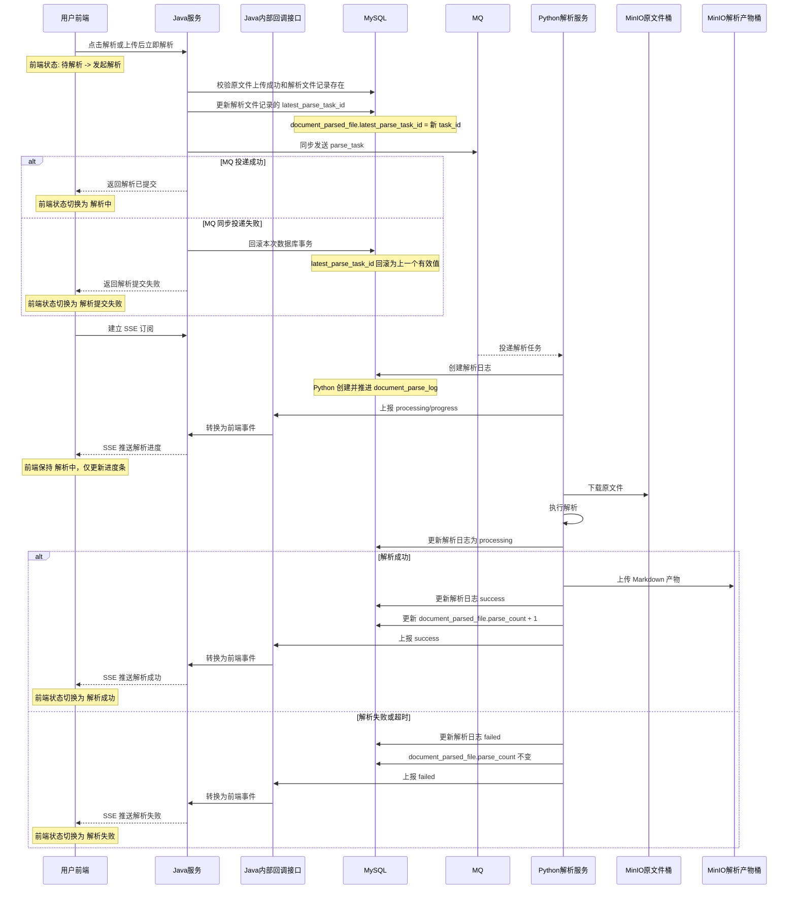
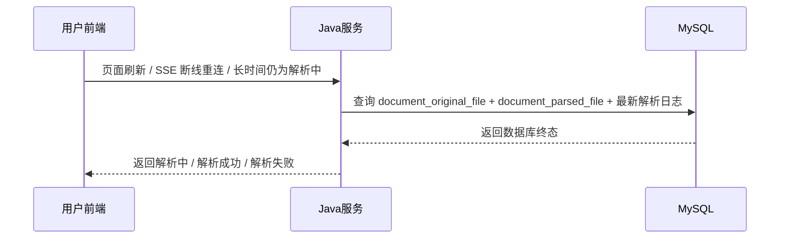

# ToLink Service 文件解析 MQ 投递与解析日志重构二期技术实现文档

> **文档状态：** 技术方案待审核
> **项目名称**：ToLink Service
> **模块名称**：文件解析 MQ 投递与解析日志重构（二期）
> **需求文档**：`docs/模块开发文档/文件上传与解析重构/二期/requirement.md`
> **分支名称**：`dev`
> **技术负责人：** Fang / Codex
> **最后更新时间：** 2026-04-29

---

## 1. 文档修订记录 (Change Log)

| 版本号 | 修改日期 | 修改内容简述 | 修改人 | 审核人 |
| :--- | :--- | :--- | :--- | :--- |
| v1.0 | 2026-04-29 | 基于已确认 PRD 初始化二期技术实现文档 | Fang / Codex | 待审核 |
| v1.1 | 2026-04-29 | 确认事务边界、MQ 消息体、单一 SSE 通道、回调兜底和旧链路替换策略 | Fang / Codex | 待审核 |

---

## 2. 技术目标与实现范围 (Overview)

### 2.1 技术目标与核心思路 (Technical Goals)

- **技术目标：** 在一期“原文件上传成功后初始化 `document_parsed_file`”的基础上，补齐二期解析提交、MQ 下发、Python 回调、前端进度展示和结果查询闭环。
- **设计原则：**
  - 原文件表 `document_original_file` 只记录上传事实，继续保持一期职责不变。
  - 解析聚合记录 `document_parsed_file` 继续作为原文件一对一聚合对象，只维护 `latest_parse_task_id` 和 `parse_count`。
  - `document_parse_log` 作为解析日志表由 Python 创建和维护；Java 只负责生成 `task_id`、更新 `latest_parse_task_id` 并同步发送 MQ。
  - Java 负责解析受理、事务内更新 `latest_parse_task_id`、同步发送 MQ、前端 SSE 推送和结果查询。
  - Python 负责消费任务、创建解析日志、执行解析、写终态和通过内部回调上报 `processing/progress/success/failed` 事件。
- **成功标准：**
  - 手动解析和上传后自动解析都能走通。
  - Java 采用“先更新数据库、再同步发送 MQ、发送失败回滚数据库事务”方案，不留下错误的 `latest_parse_task_id`。
  - 进度和终态统一走一个 SSE 通道，`progress` 每 `1` 秒上报一次。
  - 结果查询以数据库终态为准；收到终态事件时不额外查库，只在断线/刷新/超时等待时兜底查库。
  - 旧 `parse_result` 结果回传链路不再作为主链路。

### 2.2 实现范围与边界 (In Scope / Out of Scope)

**必须实现：**

- Java 解析提交服务重构：按 PRD 新口径校验原文件、解析聚合记录和进行中任务。
- `parse_task` MQ 消息体补齐 `parsed_file_id` 等字段，按扁平 JSON 发送。
- 前端状态折叠规则对应的后端查询与 SSE 事件语义。
- Python 内部回调入口与 Java SSE 转发的单通道模型。
- MQ 同步发送失败回滚事务、前端返回 `解析提交失败` 的一致性方案。
- 旧 `parse_result` 主链路关闭或移出主路径的替换说明。

**暂不实现：**

- 不引入 Outbox / 本地消息表 / 独立消息补偿表。
- 不引入额外兼容表或双写迁移方案，当前实现直接以 `document_parse_log` 为事实口径。
- 不改 Python 仓库内代码，只定义其必须满足的消息契约与回调契约。
- 不解决多实例 Java 下的 SSE 跨节点广播一致性。
- 不做解析产物版本管理、下游向量化、检索和问答消费链路。

### 2.3 验收项到实现点映射 (Requirement Mapping)

| 需求验收项 | 技术实现点 | 测试方式 | 责任模块 |
| :--- | :--- | :--- | :--- |
| 手动解析 | `POST /api/v1/files/{fileId}/parse` + 事务内同步发送 MQ | Controller / Service 测试 | `link-api` / `link-service` |
| 自动解析 | 上传成功后按 `parseImmediately=true` 调用解析提交服务 | Controller / Service 测试 | `link-api` / `link-service` |
| 重复点击拒绝 | 查询同原文件进行中任务并返回冲突 | Service 测试 | `link-service` |
| MQ 消息体 | `KnowledgeParseTaskMQ` 增加 `parsed_file_id` 等字段 | 消息序列化测试 | `link-service` |
| SSE 进度/终态统一通道 | Python 内部回调 + `KnowledgeParseSseServiceImpl` 单通道推送 | Controller / Service 测试 | `link-api` / `link-service` |
| 查库兜底 | 结果查询接口按数据库终态返回 | Controller / Service 测试 | `link-api` / `link-service` |
| `parse_count` 规则 | 成功递增、失败不变 | Service / Mapper 测试 | `link-service` |

---

## 3. 当前系统分析与复用基础 (Current-State Analysis)

### 3.1 相关模块盘点

| 模块 | 当前职责 | 现状说明 | 是否修改 |
| :--- | :--- | :--- | :--- |
| `link-api` | Controller / API 入口 | 已有 `KnowledgeFileController`、`InternalKnowledgeFileController`、统一 `Result<T>` 出参 | 是 |
| `link-service` | 业务服务 | 已有一期上传实现、旧二期解析提交逻辑、SSE 服务、旧结果 MQ 兼容链路 | 是 |
| `link-model` | Entity / DTO / Enum | 已有 `KnowledgeOriginalFile`、`KnowledgeParsedFile`、`KnowledgeParseTask`、SSE DTO、回调 DTO | 是 |
| `link-mapper` | Mapper / 持久化 | 已有原文件、解析聚合、解析任务 Mapper | 是 |
| `link-core` | 通用异常 / 工具 | 已有 `BusinessException`、`AuthContext`、统一异常处理 | 否 |
| `link-components` | 可复用中间件组件 | 已有 `MQSend`、`AbstractMQ`、`IOssService`、`PrivateFileResolver` | 否 |

### 3.2 已复用能力 (Reusable Components)

- **MQ 组件：** 复用 `MQSend`、`AbstractMQ` 和现有 Kafka / RabbitMQ 自动装配；业务消息仍放在 `link-service`，不改 framework 抽象。
- **OSS 组件：** 复用 `IOssService` 和 `PrivateFileResolver`；Python 下载原文件仍通过 Java 内部下载接口，不暴露私有 object key 对应的真实访问凭据。
- **SSE 推送：** 复用 `KnowledgeParseSseServiceImpl` 的单机内存 `SseEmitter` 实现。
- **内部服务鉴权：** 复用 `InternalKnowledgeFileController` 当前 Bearer 服务 Token 校验方式。
- **统一响应与异常：** 复用 `Result<T>` 和 `BusinessException`。

### 3.3 已参考代码 (Code References)

| 文件/模块 | 参考点 | 对方案的影响 |
| :--- | :--- | :--- |
| `link-api/src/main/java/com/qingluo/link/api/controller/KnowledgeFileController.java` | 现有解析提交、SSE 订阅、结果查询入口 | 二期接口保持路径和前端交互形态连续 |
| `link-api/src/main/java/com/qingluo/link/api/controller/InternalKnowledgeFileController.java` | 原文件内部下载、Python 回调入口、服务 Token 鉴权 | Python 进度和终态统一复用内部回调入口 |
| `link-service/src/main/java/com/qingluo/link/service/impl/KnowledgeParseTaskServiceImpl.java` | 旧二期主逻辑由 Java 创建解析任务并带补偿重投 | 需要按新口径重构，Java 不再是解析日志写入方 |
| `link-service/src/main/java/com/qingluo/link/service/impl/KnowledgeParseSseServiceImpl.java` | 单机内存 `SseEmitter` 管理、按 fileId 推送事件 | 直接复用单一 SSE 通道方案 |
| `link-service/src/main/java/com/qingluo/link/service/mq/KnowledgeParseTaskMQ.java` | 现有任务消息模型 | 需要补齐 `parsed_file_id` 并改注释口径 |
| `link-service/src/main/java/com/qingluo/link/service/impl/KnowledgeParseResultServiceImpl.java` | 旧 `parse_result` Java 兼容处理逻辑 | 不再作为主链路，仅保留关闭/清理说明 |
| `link-model/src/main/java/com/qingluo/link/model/dto/entity/KnowledgeParsedFile.java` | `latest_parse_task_id` 和 `parse_count` 已存在 | 聚合记录可直接复用，不需要重新建模 |
| `docs/组件和数据库约定/middleware_contract.md` | MySQL/MQ/OSS 约定与 `parse_task` 字段要求 | 技术方案必须与公共契约保持一致，后续若确认新规则需回写 |
| `docs/组件和数据库约定/middleware-components/oss_component.md` | OSS 私有文件访问与 object key 约定 | 原文件下载路径和解析产物路径设计需遵循约定 |
| `docs/组件和数据库约定/middleware-components/kafka_component.md` | MQ 业务消息接入方式 | 新增/改造业务消息时不直接依赖厂商原生 API |

### 3.4 现有问题与约束 (Constraints)

- `KnowledgeParseTaskServiceImpl` 当前仍按“Java 创建解析任务表记录 + 补偿重投”设计，和 PRD 目标口径冲突。
- 当前 `KnowledgeParseResultMQ / KnowledgeParseResultKafkaReceiver / KnowledgeParseResultServiceImpl` 仍保留旧兼容链路，若不明确关闭，会与 Python 直接写库发生职责重叠。
- `KnowledgeParseTaskMQ`、测试 schema 和公共契约都必须统一使用 `document_parse_log` 口径，避免仓库内同时存在两套表名事实。
- 多实例 Java 场景下，当前 SSE 连接只存在本实例内存，不解决跨节点广播，这一点必须在技术方案中明确保留为限制。

---

## 4. 核心架构与实现方案 (Architecture & Solution)

### 4.1 总体设计思路 (Architecture Overview)

二期采用四段式调用链：

```text
前端 -> Java：解析提交 / SSE 订阅 / 结果查询
Java -> MQ：解析任务下发
Python -> Java：统一内部回调事件
Java -> 前端：统一 SSE 事件推送
前端/Java -> DB：终态兜底查询
```

设计要点：

- Java 成功受理解析请求后，前端统一进入 `解析中`，不再暴露“等待解析 / Python 未建日志”等内部中间态。
- Python 必须先写数据库终态，再上报 `success/failed` 最终事件。
- Java 收到最终事件后直接 SSE 推前端，不为了这次成功或失败额外查库。
- 查库只发生在明确兜底场景：前端刷新/重连/重新进入页面，或长时间停留 `解析中` 未收到终态事件。

### 4.2 目标调用链路 (Call Flow)

```text
只上传模式：
前端上传成功 -> 文件展示为 待解析

上传并立即解析模式：
前端上传文件(parseImmediately=true)
-> Java 上传成功后查询原文件 + 解析聚合记录
-> Java 生成 task_id
-> Java 在事务中更新 document_parsed_file.latest_parse_task_id
-> Java 同步发送 parse_task MQ
-> 发送成功：前端切为 解析中
-> 发送失败：事务回滚，前端切为 解析提交失败

手动解析模式：
前端点击解析
-> Java 校验文件归属、上传成功、无进行中任务
-> Java 生成 task_id
-> Java 在事务中更新 latest_parse_task_id
-> Java 同步发送 parse_task MQ
-> 前端切为 解析中

Python 执行模式：
Python 收到 parse_task
-> Python 创建解析日志(created)
-> Python 开始解析(processing)
-> Python 每 1 秒回调 progress
-> Java SSE 推进度给前端
-> Python 解析成功或失败后先写库
-> Python 回调 success/failed
-> Java SSE 推终态给前端
-> 前端必要时通过结果查询接口查数据库兜底
```

### 4.3 核心模块职责划分 (Module Responsibilities)

| 模块/类 | 职责 | 输入/输出边界 |
| :--- | :--- | :--- |
| `KnowledgeFileController` | 面向前端的解析提交、SSE 订阅、结果查询入口 | 登录用户请求 / `Result<T>` 或 `SseEmitter` |
| `InternalKnowledgeFileController` | 面向 Python 的原文件下载和内部事件回调入口 | Bearer 服务 Token + 回调请求 |
| `KnowledgeFileServiceImpl` | 一期上传成功后在 `parseImmediately=true` 时触发解析提交 | 上传请求 / `KnowledgeFileDTO` |
| `KnowledgeParseTaskService` | 解析受理、重复点击拦截、事务内 MQ 提交、结果查询 | `userId`、`fileId`、`triggerMode` |
| `KnowledgeParseSseService` | 管理 SSE 连接，按 fileId 推送进度和终态事件 | `fileIds`、回调事件 |
| `KnowledgeParseTaskMQ` | `parse_task` 扁平 JSON 消息模型 | 业务消息对象 / JSON 字符串 |

### 4.4 核心时序图 (Sequence Diagrams)

#### 场景 1：统一解析提交流程



#### 场景 2：结果查库兜底



---

## 5. 接口契约与交互方案 (API Contract)

### 5.1 接口清单

| 方法 | 路径 | 说明 | 权限 |
| :--- | :--- | :--- | :--- |
| POST | `/api/v1/files/{fileId}/parse` | 手动触发解析 | 登录用户 |
| GET | `/api/v1/datasets/{datasetId}/files/parse-events` | SSE 订阅进度与终态事件 | 登录用户 |
| GET | `/api/v1/datasets/{datasetId}/files/parse-results` | 查询文件列表终态结果 | 登录用户 |
| GET | `/api/v1/internal/files/{fileId}/content` | Python 下载原文件 | 内部服务 Token |
| POST | `/api/v1/internal/parse-tasks/{taskId}/events` | Python 上报 `processing/progress/success/failed` | 内部服务 Token |

### 5.2 请求参数

| 接口 | 参数 | 位置 | 类型 | 必填 | 说明 |
| :--- | :--- | :--- | :--- | :--- | :--- |
| 手动解析 | `fileId` | path | Long | 是 | 原文件 ID |
| SSE 订阅 | `datasetId` | path | Long | 是 | 数据集 ID |
| SSE 订阅 | `fileIds` | query | String | 是 | 逗号分隔文件 ID 列表 |
| 结果查询 | `datasetId` | path | Long | 是 | 数据集 ID |
| 结果查询 | `fileIds` | query | String | 是 | 逗号分隔文件 ID 列表 |
| Python 回调 | `taskId` | path | String | 是 | 解析任务业务 ID |
| Python 回调 | `eventType` | body | String | 是 | `processing/progress/success/failed` |
| Python 回调 | `progress` | body | Integer | 否 | 进度百分比，`progress` 事件有效 |
| Python 回调 | `failureReason` | body | String | 否 | 失败原因，失败类事件有效 |

### 5.3 MQ 消息体定义

#### `parse_task` 消息字段

| 字段 | 类型 | 必填 | 来源 | 说明 |
| :--- | :--- | :--- | :--- | :--- |
| `task_id` | String | 是 | Java 生成的 UUID | 本次解析任务业务唯一标识，贯穿 Java、MQ、Python、数据库和前端链路 |
| `original_file_id` | Long | 是 | `document_original_file.id` | 原文件主键 |
| `parsed_file_id` | Long | 是 | 按 `document_original_file_id` 查询到的 `document_parsed_file.id` | 解析聚合记录主键 |
| `user_id` | Long | 是 | `document_original_file.user_id` | 用户归属 |
| `dataset_id` | Long | 是 | `document_original_file.dataset_id` | 数据集归属 |
| `file_type` | String | 是 | 原文件后缀或标准化类型 | 供 Python 选择解析器或做基础校验 |
| `source_bucket` | String | 是 | 原文件 bucket | 原文件所在桶，当前为私有原文件桶 |
| `source_object_key` | String | 是 | 原文件对象 key | Python 精确下载原文件所需定位 |
| `source_filename` | String | 是 | 原始文件名 | 用于日志、产物命名或解析展示 |
| `md_bucket` | String | 是 | 目标 Markdown 产物桶 | Python 写解析结果的目标桶 |
| `md_object_key` | String | 是 | 目标 Markdown 产物对象 key | Python 写解析结果的目标路径 |

#### `parse_task` 标准 JSON 示例

```json
{
  "task_id": "3d5a9b53-4d52-4d0f-a6da-182e1dbf70a3",
  "original_file_id": 10001,
  "parsed_file_id": 20001,
  "user_id": 10000,
  "dataset_id": 30001,
  "file_type": "pdf",
  "source_bucket": "rag-raw",
  "source_object_key": "original/user-10000/dataset-30001/2026/04/29/10001/demo.pdf",
  "source_filename": "demo.pdf",
  "md_bucket": "rag-md",
  "md_object_key": "parsed/user-10000/dataset-30001/2026/04/29/3d5a9b53-4d52-4d0f-a6da-182e1dbf70a3/demo.md"
}
```

说明：

- `original_file_id` 由 Java 在发送 MQ 前，从 `document_original_file.id` 直接获取。
- `parsed_file_id` 由 Java 在发送 MQ 前，按 `document_original_file_id` 查询对应的一对一 `document_parsed_file.id` 后写入消息体。
- 消息体必须是“Python 收到即可执行”的自足结构，不依赖 Python 再回查 Java 才能启动解析。
- 消息体中禁止放服务 Token、MinIO 密钥、临时签名 URL 等敏感信息。
- 当前代码消息模型承载类为 `KnowledgeParseTaskMQ`，需要按本节字段补齐并与公共契约保持一致。

### 5.4 响应结构

#### 手动解析提交

```json
{
  "code": 200,
  "message": "success",
  "data": {
    "fileId": 10001,
    "originalFilename": "demo.pdf",
    "frontendStatus": "parsing"
  }
}
```

说明：

- 前端不感知 `task_id`，只按 `fileId` 维护视图状态。
- `frontendStatus` 是后端给前端的业务化状态，不暴露内部中间态。
- Java 成功受理并完成 MQ 投递后，提交响应直接返回 `parsing`。

#### 文件结果查询

```json
{
  "code": 200,
  "message": "success",
  "data": [
    {
      "fileId": 10001,
      "originalFilename": "demo.pdf",
      "parsedFilename": "demo.md",
      "frontendStatus": "parse_success",
      "parseStatus": "success",
      "failureReason": null
    }
  ]
}
```

#### SSE 建连确认事件

```text
event: connected
data: ok
```

说明：

- 浏览器成功建立 SSE 连接后，Java 先发送 `connected` 事件，确认订阅链路可用。
- 该事件不承载业务状态，仅用于前端确认连接建立成功。

#### SSE 业务事件体

```json
{
  "taskId": "3d5a9b53-4d52-4d0f-a6da-182e1dbf70a3",
  "fileId": 10001,
  "originalFilename": "demo.pdf",
  "eventType": "progress",
  "frontendStatus": "parsing",
  "progress": 35,
  "parseStatus": "processing",
  "failureReason": null
}
```

说明：

- `progress` 事件按每 `1` 秒推送一次。
- `success/failed` 事件不受该频率限制，必须单独推送。

#### Python 内部回调成功响应

```json
{
  "code": 200,
  "message": "success",
  "data": null
}
```

说明：

- Python 上报 `processing/progress/success/failed` 事件成功后，Java 返回统一空响应。
- Java 不在该接口响应中回传数据库终态，数据库仍由 Python 自己维护。

#### 原文件内部下载响应

```text
HTTP/1.1 200 OK
Content-Type: application/pdf
Content-Disposition: attachment; filename*=UTF-8''demo.pdf
```

说明：

- 该接口返回二进制文件流，不包裹 `Result<T>`。
- `Content-Type` 取原文件记录中的 `contentType`，缺失时回退 `application/octet-stream`。
- `Content-Disposition` 使用原始文件名，供 Python 侧或调用方按需处理。

### 5.5 异常响应

| 场景 | HTTP 状态 | 业务错误码 | message |
| :--- | :--- | :--- | :--- |
| 文件不存在或无权访问 | 404 | 复用现有 | 文件不存在或无权访问 |
| 原文件未上传成功 | 400 | 复用现有 | 原文件尚未上传成功，不能解析 |
| 同一原文件存在进行中任务 | 409 | 复用现有 | 文件正在解析中，请勿重复提交 |
| MQ 同步发送失败 | 500 | 新增或复用实现时确定 | 解析提交失败，请稍后重试 |
| Python 回调进度非法 | 400 | 复用现有或新增实现时确定 | 解析进度必须在 0 到 100 之间 |
| Python 内部接口未授权 | 401 | 复用现有 | 服务鉴权失败 |

### 5.6 异常类与错误码定义

#### 异常类设计

| 异常类 | 继承关系 | 使用场景 | 说明 |
| :--- | :--- | :--- | :--- |
| `BusinessException` | 现有基类 | 文件无权访问、状态非法、重复解析、内部回调参数非法、MQ 同步发送失败 | 保持现有异常风格，不新增独立异常基类 |

#### 错误码定义

| 错误码 | 枚举名/常量名 | HTTP 状态 | 触发场景 | 前端提示策略 |
| :--- | :--- | :--- | :--- | :--- |
| 待实现时确认 | 待实现时确认 | 500 | MQ 同步发送失败 | 展示“解析提交失败，请稍后重试” |

说明：

- 本次技术方案不提前拍死具体数字错误码，但必须沿用现有 `BusinessException` 与统一返回风格。
- 若实现阶段新增错误码，应同步评估是否需要回写公共约定。

### 5.7 兼容性说明

- **是否兼容旧接口：** 保持现有前端调用路径不变，继续使用现有解析提交、SSE 订阅和结果查询接口。
- **是否需要过渡期：** 不需要新增前端新路径，但实现阶段会把内部逻辑从旧主链路替换为新口径。
- **前端影响点：**
  - 前端状态统一收敛为 `待解析 / 解析中 / 解析成功 / 解析失败 / 解析提交失败`。
  - 前端不再区分“等待解析”和“Python 未建日志”等内部中间态。

---

## 6. 数据契约与存储设计 (Data & Storage)

### 6.1 数据模型与实体关系 (E-R)

```text
document_original_file 1 - 1 document_parsed_file
document_original_file 1 - N document_parse_log(目标态)
document_parsed_file   1 - N document_parse_log(目标态)
```

当前兼容态说明：

- 目标命名是 `document_parse_log`。
- 当前真实数据库、Entity、Mapper、测试 schema 统一以 `document_parse_log` 为准。
- 本次不改真实表结构，因此实现阶段需要在代码和文档中明确“目标口径”和“当前兼容态”的对应关系。

### 6.2 数据库组件与结构变更 (Database & Schema Changes)

#### MySQL 变更

| 表名 | 变更类型 | 变更说明 | 备注 |
| :--- | :--- | :--- | :--- |
| `document_original_file` | 读取 | 继续作为解析前置条件和原文件对象定位来源 | 二期不改变上传事实职责 |
| `document_parsed_file` | 继续复用 | 继续维护 `latest_parse_task_id` 与 `parse_count` | Java 更新 `latest_parse_task_id`；Python 成功后更新 `parse_count` |
| `document_parse_log` | 解析日志表 | 记录每次解析尝试、任务状态、失败原因和处理耗时 | Python 创建并维护 |

### 6.3 字段设计

#### `document_parsed_file` 关注字段

| 字段 | 类型 | 是否必填 | 默认值 | 说明 |
| :--- | :--- | :--- | :--- | :--- |
| `document_original_file_id` | bigint | 是 | 无 | 原文件一对一关联 |
| `latest_parse_task_id` | varchar(36) | 否 | null | 最新解析任务业务 ID |
| `parse_count` | int | 是 | 0 | 成功解析累计次数，仅成功时递增 |

#### `document_parse_log` 目标字段

| 字段 | 类型 | 是否必填 | 默认值 | 说明 |
| :--- | :--- | :--- | :--- | :--- |
| `task_id` | varchar(36) | 是 | 无 | 解析任务业务唯一标识 |
| `document_original_file_id` | bigint | 是 | 无 | 原文件 ID |
| `document_parsed_file_id` | bigint | 否 | null | 解析聚合记录 ID |
| `dataset_id` | bigint | 是 | 无 | 数据集 ID |
| `user_id` | bigint | 是 | 无 | 用户 ID |
| `task_status` | varchar(16) | 是 | `created` | `created/processing/success/failed` |
| `failure_reason` | varchar(512) | 否 | null | 失败原因 |
| `parse_started_at` | datetime | 否 | null | Python 开始解析时间 |
| `parse_finished_at` | datetime | 否 | null | Python 结束解析时间 |
| `parse_duration_ms` | bigint | 否 | null | 解析耗时 |

### 6.4 索引与约束

- `document_parsed_file.latest_parse_task_id` 继续保留索引能力，用于按最新任务回查聚合状态。
- `document_parse_log(task_id)` 需要保持业务唯一，确保 Python 侧幂等写入。
- `document_parse_log(document_original_file_id, task_status)` 需要支持“同一原文件是否存在进行中任务”的快速查询。

### 6.5 中间件与其他存储设计

| 组件 | 存储内容 | Key/Path 规则 | 备注 |
| :--- | :--- | :--- | :--- |
| MQ | 解析任务消息 | `tolink.rag.parse_task` | 继续沿用现有业务 topic |
| OSS / MinIO | 原文件对象 | 继续复用一期 `rag-raw` 私有对象定位 | Python 通过内部下载接口读取 |
| OSS / MinIO | Markdown 解析产物 | `rag-md` + `md_object_key` | 路径由 Java 在消息体中给出 |

### 6.6 数据迁移与回滚

- **是否需要迁移：** 本期仓库实现、测试 schema 和初始化 SQL 统一以 `document_parse_log` 为准，不再保留旧表名兼容层。
- **迁移策略：** 本次技术方案只定义目标态职责和代码目标结构；当前实现继续兼容旧表名和测试 schema。
- **回滚策略：** 由于本次不改真实 DDL，回滚重点在业务代码层，保持旧链路默认关闭即可，不涉及表结构回退。

---

## 7. 核心实现逻辑 (Core Implementation)

### 7.1 Service / Component 设计

```java
public interface KnowledgeParseTaskService {
    FileParseSubmitDTO submitManualParse(Long userId, Long fileId);
    void submitAutoParseAfterUpload(Long userId, KnowledgeOriginalFile originalFile);
    List<FileParseResultDTO> listParseResults(Long userId, Long datasetId, List<Long> fileIds);
}
```

### 7.2 核心方法职责

| 方法 | 职责 | 输入 | 输出 |
| :--- | :--- | :--- | :--- |
| `submitManualParse` | 手动解析提交，事务内更新 `latest_parse_task_id` 并同步发送 MQ | `userId`、`fileId` | `FileParseSubmitDTO` |
| `submitAutoParseAfterUpload` | 上传成功后自动触发解析提交 | `userId`、`originalFile` | 无 |
| `listParseResults` | 读取数据库终态并折叠前端状态 | `userId`、`datasetId`、`fileIds` | `FileParseResultDTO` 列表 |
| `subscribe` | 注册 SSE 连接 | `userId`、`datasetId`、`fileIds` | `SseEmitter` |
| `publishTaskEvent` | 接收 Python 内部回调并转推 SSE | `taskId`、回调请求 | 无 |

### 7.3 关键处理流程

1. Java 校验原文件归属、上传成功状态和解析聚合记录存在。
2. Java 生成新的 `task_id`，查询当前原文件是否存在进行中任务。
3. Java 在事务中更新 `document_parsed_file.latest_parse_task_id`，随后同步发送 `parse_task` MQ。
4. MQ 发送成功则前端进入 `解析中`；发送失败则事务回滚并返回 `解析提交失败`。
5. Python 消费后创建解析日志，开始执行解析，并按每 `1` 秒回调 `progress`。
6. Java 接收回调后不写进度到数据库，只通过单一 SSE 通道推给前端。
7. Python 解析终态先写库，再回调 `success/failed`；Java 收到后直接推前端终态事件。
8. 前端断线、刷新或长时间未收到终态时，通过结果查询接口按数据库终态恢复状态。

### 7.4 并发、幂等与一致性

- **并发控制：** 同一原文件存在进行中任务时，拒绝再次提交解析，返回 409。
- **幂等策略：**
  - Java 每次成功受理解析都生成新的 `task_id`，不复用旧任务 ID。
  - Python 以 `task_id` 作为解析日志幂等键，重复消息不能导致重复创建日志或重复累计 `parse_count`。
- **事务边界：**
  - 同一业务事务中完成读取与校验、生成 `task_id`、更新 `document_parsed_file.latest_parse_task_id`、同步发送 MQ。
  - 如果 MQ 同步发送失败，抛异常并回滚数据库事务，不留下新的 `latest_parse_task_id`。
- **跨组件一致性：**
  - 本期不使用 Outbox。
  - 最终结果以数据库真相为准，事件只负责实时通知。
  - 收到终态事件时不额外查库；仅在断线/刷新/超时等待等明确场景兜底查询数据库。

---

## 8. 组件集成与配置方案 (Integration Design)

| 组件 | 用途 | 配置项 | 失败处理 |
| :--- | :--- | :--- | :--- |
| OSS | Python 通过内部下载接口获取原文件；Python 将 Markdown 结果写入 `rag-md` | 复用一期和现有 OSS 配置 | 原文件下载失败或结果上传失败由 Python 写失败终态 |
| MQ | Java 下发 `parse_task` | 复用现有 MQ 厂商选择与发送组件 | 同步发送异常触发事务回滚 |
| SSE | Java 向前端推解析进度和终态 | `tolink.knowledge-file.sse-timeout-ms` | 推送失败只移除当前 emitter，前端通过结果查询兜底 |
| 内部回调 | Python 上报 `processing/progress/success/failed` | `Authorization: Bearer {serviceToken}` | 回调失败不改数据库真相，前端后续通过查询兜底 |

---

## 9. 权限、安全与审计设计 (Security)

### 9.1 认证与授权

| 操作 | 权限要求 | 校验位置 |
| :--- | :--- | :--- |
| 手动解析 | 登录用户且文件归属当前用户 | `KnowledgeFileController` + Service |
| SSE 订阅 | 登录用户且文件列表均归属于当前数据集和当前用户 | `KnowledgeFileController` + `KnowledgeParseSseServiceImpl` |
| 结果查询 | 登录用户且文件列表均归属于当前数据集和当前用户 | `KnowledgeFileController` + Service |
| Python 下载原文件 | Bearer 服务 Token | `InternalKnowledgeFileController` |
| Python 回调事件 | Bearer 服务 Token | `InternalKnowledgeFileController` |

### 9.2 敏感数据处理

- **敏感字段：** 服务 Token、OSS 访问凭据、私有 object key 对应的直接访问地址。
- **脱敏策略：** 不在前端响应中暴露 bucket、object key、内部下载 URL、服务 Token。
- **日志策略：** 允许记录 `task_id/fileId/userId/datasetId` 等排障主键，不记录敏感凭据。

### 9.3 审计要求

- 解析提交、回调接收、SSE 推送失败、结果查询兜底都应围绕 `task_id` 具备可追踪日志。

---

## 10. 异常处理与降级策略 (Exceptions & Fallback)

| 异常场景 | 处理方式 | 错误码 | 用户提示 | 是否重试 |
| :--- | :--- | :--- | :--- | :--- |
| 文件不存在或无权访问 | 直接抛 `BusinessException` | 复用现有 | 文件不存在或无权访问 | 否 |
| 原文件未上传成功 | 直接拒绝解析 | 复用现有 | 原文件尚未上传成功，不能解析 | 否 |
| 同一原文件已在解析中 | 返回 409 | 复用现有 | 文件正在解析中，请勿重复提交 | 否 |
| MQ 同步发送失败 | 抛异常并回滚事务 | 待实现确认 | 解析提交失败，请稍后重试 | 用户手动重试 |
| Python 回调进度非法 | 返回 400 | 复用现有或实现时新增 | 解析进度必须在 0 到 100 之间 | 调用方修正 |
| SSE 推送失败或浏览器断开 | 移除 emitter，不补发历史事件 | 无 | 前端继续显示解析中或重查结果 | 前端查询兜底 |
| Python 已写终态但事件未送达 | 不补发事件，保持数据库真相 | 无 | 前端刷新/重连后恢复终态 | 结果查询兜底 |

---

## 11. 测试与验证方案 (Test Plan)

### 11.1 单元测试

| 测试类 | 覆盖内容 |
| :--- | :--- |
| `KnowledgeParseTaskServiceImplTest` | 手动解析成功、自动解析成功、MQ 同步发送失败回滚、重复点击拒绝、`parse_count` 成功加一失败不变 |
| `KnowledgeParseTaskMQTest` | `parse_task` 消息序列化、字段完整性、`parsed_file_id` 存在性 |
| `KnowledgeParseSseServiceImplTest` | 进度/终态事件转换、单通道推送、断开连接移除 emitter |

### 11.2 集成测试

| 测试类 | 覆盖接口/流程 |
| :--- | :--- |
| `KnowledgeFileControllerTest` | 手动解析接口、SSE 订阅、结果查询、自动解析入口行为 |
| `InternalKnowledgeFileControllerTest` | Python 内部回调接口、服务 Token 校验、非法 progress 拒绝 |

### 11.3 回归测试

| 回归点 | 验证方式 |
| :--- | :--- |
| 一期上传链路不回归 | 上传成功、解析聚合初始化仍按一期口径工作 |
| 旧 `parse_result` 主链路默认关闭 | 旧 Kafka 结果消费者不参与主流程 |
| 当前测试 schema 使用 `document_parse_log` | 业务逻辑按新方案校验通过 |
| 断线/刷新兜底 | 结果查询接口返回数据库终态，前端可恢复状态 |

### 11.4 验证命令建议

```bash
mvn -pl link-api -am -Dtest=KnowledgeFileControllerTest,InternalKnowledgeFileControllerTest test
mvn -pl link-service -am -Dtest=KnowledgeParseTaskServiceImplTest,KnowledgeParseTaskMQTest test
```

---

## 12. 发布与回滚方案 (Release Plan)

- **发布前提：** 二期技术方案审核通过，代码实现与测试完成。
- **发布重点：**
  - 确保旧 `parse_result` 消费主链路保持关闭。
  - 确保 Python 端已按 MQ 契约和内部回调契约联调完成。
- **回滚策略：**
  - 若二期新代码出现问题，可回滚 Java 端业务代码到一期基础能力。
  - 由于本次不改真实数据库 DDL，回滚不涉及表结构恢复。
- **后续演进：**
  - 三期可评估 Outbox / 本地消息表，增强数据库提交与 MQ 投递之间的一致性保障。
  - 三期可继续处理解析产物版本管理、多实例 SSE 广播和更强一致性增强方案。
