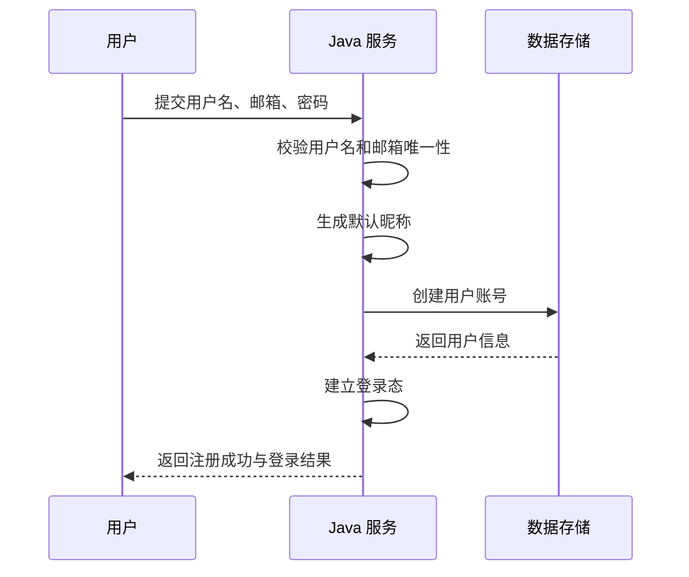
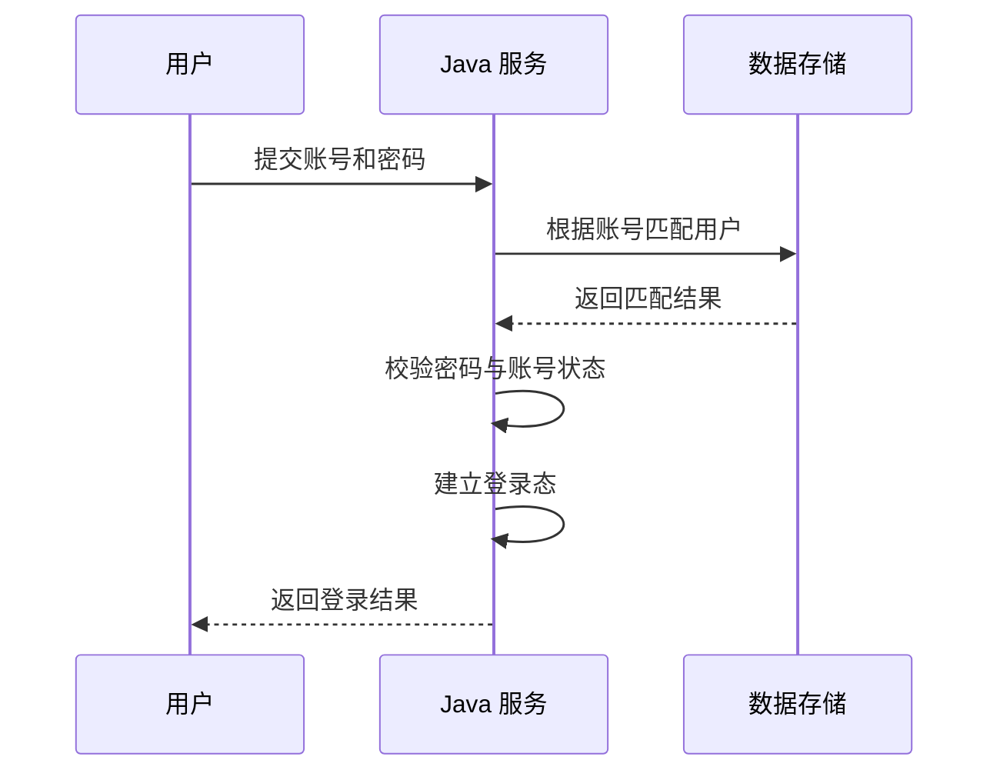
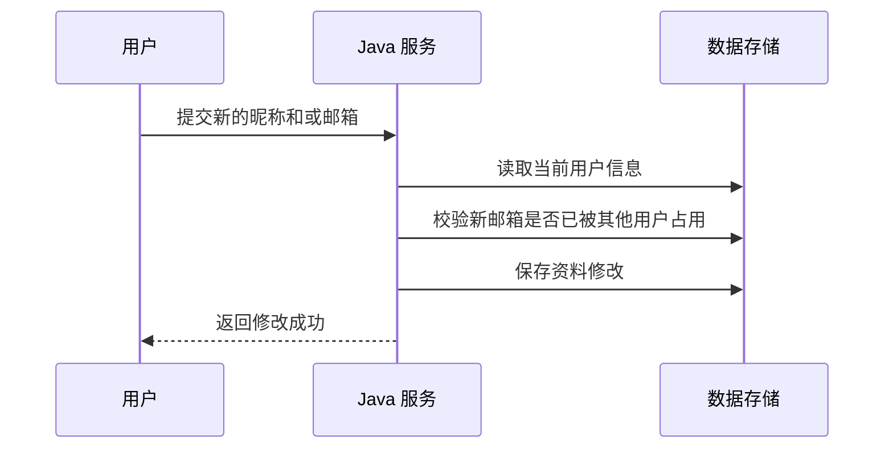

# ToLink Service 登录注册重构 一期需求文档

> **文档状态：** 草稿
> **项目名称：** ToLink Service
> **模块名称：** 登录注册重构（一期）
> **分支名称：** feat/frontend-backend-integration
> **产品负责人：** AI 协作草拟
> **最后更新时间：** 2026-05-03

---

## 1. 文档修订记录 (Change Log)

| 版本号 | 修改日期 | 修改内容简述 | 提出人 | 审核人 |
| :--- | :--- | :--- | :--- | :--- |
| v1.0 | 2026-05-03 | 初始化一期 PRD，明确登录、注册、昵称与资料修改边界 | AI | 待审核 |

## 2. 业务层 (Business Layer)

### 2.1 需求背景

- 当前现状：系统已具备用户名密码登录、用户注册和个人资料维护能力，但邮箱、用户名、昵称三类身份字段的职责边界不清晰。
- 当前问题：
  - 登录仅支持用户名，不符合“邮箱为常用登录标识”的使用习惯。
  - 注册阶段昵称与用户名同时出现，用户感知重复。
  - 个人资料允许修改邮箱，但需求侧尚未统一“邮箱是否作为核心登录标识”的规则。
- 触发原因：需要围绕登录与注册主链路完成一次后端重构，统一账号标识和展示名称的定义，为后续技术设计和实现提供稳定边界。

### 2.2 需求目标

- 业务目标：将登录入口升级为“用户名或邮箱 + 密码”，并明确邮箱、用户名、昵称在系统中的职责分工。
- 用户目标：
  - 注册时只需要填写用户名、邮箱和密码，不需要主动思考昵称。
  - 登录时可以根据习惯使用邮箱或用户名登录。
  - 注册后可修改昵称和邮箱，但不能修改用户名。
- 本次完成后的预期收益：
  - 登录标识与展示名称职责分离，降低用户理解成本。
  - 用户资料规则稳定，后续前端与接口联调边界清晰。
  - 后续扩展邮箱相关认证能力时具备稳定基础。

### 2.3 范围与分期

**本期必须完成：**

- 定义邮箱、用户名、昵称三类字段的职责边界。
- 将注册主流程调整为用户名、邮箱、密码必填。
- 将昵称从注册必填项中移出，改为后端自动生成默认昵称。
- 将登录主流程调整为统一账号输入，支持用户名或邮箱登录。
- 明确个人资料中昵称可修改、邮箱可修改、用户名不可修改。
- 明确邮箱修改时的唯一性约束。

**本期明确不做：**

- 不修改前端页面、占位文案、前端请求类型定义。
- 不做历史用户数据迁移、补齐或兼容治理。
- 不引入邮箱验证码、短信验证码、找回密码、重置密码等新认证能力。
- 不调整数据库结构、索引结构或缓存契约。
- 不在需求文档中锁定接口字段实现、SQL 写法或默认昵称的具体生成算法实现细节。

**分期结论：**

- 当前需求不拆二期，一期完成后端登录、注册和资料规则重构即可。

### 2.4 角色与参与方

| 角色/系统 | 身份说明 | 在本需求中的职责 |
| :--- | :--- | :--- |
| 业务用户 | 使用系统进行登录、注册和资料维护的普通用户 | 注册账号、登录系统、修改昵称和邮箱 |
| 管理员 | 平台管理角色 | 本期不是独立主流程角色，不新增专属认证规则 |
| Java 服务 | 认证与资料规则提供方 | 校验注册与登录规则，维护用户资料修改边界 |
| 数据存储与缓存 | 用户数据与高频读缓存能力提供方 | 存储用户主数据，并在资料变更后维持用户读取一致性 |

### 2.5 核心业务对象与职责

| 业务对象 | 业务定义 | 核心约束 |
| :--- | :--- | :--- |
| 邮箱 | 用户的登录标识之一 | 必填、唯一、可修改、可用于登录 |
| 用户名 | 用户的稳定系统标识之一 | 必填、唯一、不可修改、可用于登录 |
| 昵称 | 用户的展示名称 | 注册时由后端默认生成、可修改、可重复、不参与登录 |

### 2.6 核心业务场景

#### 场景 A：新用户注册

- 触发条件：用户首次创建账号。
- 主流程：
  - 用户提交用户名、邮箱、密码。
  - 系统校验用户名和邮箱均可用。
  - 系统为用户自动生成默认昵称。
  - 系统创建账号并完成登录态建立。
- 用户可见结果：注册成功并获得登录结果；如需后续展示个性名称，可在资料页自行修改昵称。

#### 场景 B：用户通过用户名登录

- 触发条件：用户在登录页输入用户名和密码。
- 主流程：
  - 用户在统一账号输入框填写用户名。
  - 系统识别该账号并完成密码校验。
  - 系统建立登录态并返回登录结果。
- 用户可见结果：用户名登录成功。

#### 场景 C：用户通过邮箱登录

- 触发条件：用户在登录页输入邮箱和密码。
- 主流程：
  - 用户在统一账号输入框填写邮箱。
  - 系统识别该账号并完成密码校验。
  - 系统建立登录态并返回登录结果。
- 用户可见结果：邮箱登录成功。

#### 场景 D：用户修改个人资料

- 触发条件：已登录用户进入个人资料维护并提交修改。
- 主流程：
  - 用户修改昵称和或邮箱。
  - 系统校验新邮箱是否被其他用户占用。
  - 系统保存修改结果。
- 用户可见结果：
  - 昵称修改成功后，后续资料展示使用最新昵称。
  - 邮箱修改成功后，后续登录可使用新邮箱。

### 2.7 关键异常场景

| 异常场景 | 触发条件 | 系统预期行为 | 用户可见结果 |
| :--- | :--- | :--- | :--- |
| 用户名已存在 | 注册时用户名被其他用户占用 | 系统拒绝创建账号 | 用户看到用户名已存在的明确信息 |
| 邮箱已存在 | 注册时邮箱被其他用户占用 | 系统拒绝创建账号 | 用户看到邮箱已被使用的明确信息 |
| 账号不存在 | 登录时输入的用户名或邮箱没有匹配用户 | 系统拒绝登录 | 用户看到账号不存在或等价错误提示 |
| 密码错误 | 登录账号匹配成功但密码校验失败 | 系统拒绝登录 | 用户看到密码错误的明确信息 |
| 账号被禁用 | 登录账号匹配成功但账号状态不可用 | 系统拒绝登录 | 用户看到账号已被禁用的明确信息 |
| 修改邮箱冲突 | 已登录用户将邮箱修改为其他用户已占用的邮箱 | 系统拒绝保存修改 | 用户看到邮箱已被使用的明确信息 |
| 用户尝试修改用户名 | 已登录用户试图修改用户名 | 系统不提供用户名修改能力 | 用户在本期功能中不存在修改用户名的入口或成功路径 |

### 2.8 验收标准

| 验收项 | 验收标准 | 验证方式 |
| :--- | :--- | :--- |
| 注册必填规则 | 注册时必须提供用户名、邮箱、密码 | 接口联调、测试用例验证 |
| 默认昵称生成 | 注册成功的新用户自动拥有默认昵称，无需注册时显式传入昵称 | 接口联调、数据验证 |
| 用户名登录 | 用户可使用用户名和密码成功登录 | 接口联调、测试用例验证 |
| 邮箱登录 | 用户可使用邮箱和密码成功登录 | 接口联调、测试用例验证 |
| 唯一性约束 | 注册时用户名和邮箱都不能与已有用户重复 | 测试用例验证 |
| 资料修改范围 | 已登录用户只能修改昵称和邮箱，不能修改用户名 | 接口联调、人工验证 |
| 邮箱修改校验 | 修改邮箱时若邮箱已被其他用户占用，系统必须拒绝保存 | 测试用例验证 |
| 登录态保持 | 注册成功和登录成功后，系统仍能返回现有登录结果并建立登录态 | 接口联调、测试用例验证 |

## 3. 架构约束层 (Architecture Constraint Layer)

### 3.1 主业务维度

- 本需求围绕的主业务对象：系统用户账号及其登录标识、展示名称。
- 其他对象如何归属于主业务对象：登录行为归属于用户账号，资料修改行为归属于当前登录用户。
- 明确不是主维度的对象：短信验证码、邮箱验证码、密码找回、管理员特权登录、外部身份提供方接入。

### 3.2 系统职责划分

| 端 / 系统 / 模块 | 负责内容 | 明确不负责内容 |
| :--- | :--- | :--- |
| 前端 | 后续按本期需求对接登录与注册规则 | 本期不纳入改造范围 |
| Java 端 | 承接登录、注册、资料修改规则并返回统一结果 | 不负责邮箱验证码等新增认证机制 |
| 数据存储 | 保存用户主数据 | 不负责决定登录标识优先级之外的业务规则 |
| 缓存能力 | 提供用户资料高频读取支持 | 不引入新的缓存规则或公共契约变化 |

### 3.3 核心业务流程

#### 场景 1：注册并自动生成默认昵称

#### 场景 2：使用用户名或邮箱登录

#### 场景 3：修改昵称和邮箱

### 3.4 状态与结果约束

| 业务对象 | 关键状态或结果 | 说明 |
| :--- | :--- | :--- |
| 注册结果 | 成功 / 失败 | 成功时自动建立登录态 |
| 登录结果 | 成功 / 失败 | 失败原因至少覆盖账号不存在、密码错误、账号禁用 |
| 资料修改结果 | 成功 / 失败 | 失败原因至少覆盖邮箱冲突 |

## 4. 技术边界层 (Technical Boundary Layer)

### 4.1 已锁定的实现约束

- 本期只做后端改造，不纳入前端改造任务。
- 本期不做数据库结构变更，默认复用现有用户表及现有唯一性基础。
- 本期不做历史老用户数据治理，也不补充兼容迁移流程。
- 本期仍复用现有登录态能力和现有用户资料读取能力。

### 4.2 留给技术设计阶段决定的内容

- 登录账号匹配的查询实现方式与持久层改造范围。
- 默认昵称的具体生成算法与冲突处理方式。
- 资料修改后缓存失效或更新的具体策略。
- 控制器请求模型、接口文案、错误码复用和测试改造细节。

## 5. 风险、依赖与待确认问题

### 5.1 依赖项

- 依赖现有用户表已经具备邮箱字段及其唯一性基础。
- 依赖现有登录态能力可继续承接注册成功和登录成功后的会话建立。

### 5.2 当前风险

- 历史用户不做迁移，意味着少量历史空邮箱用户不在本期保障范围内。
- 前端本期不改造，后续联调时需要单独同步请求字段语义变化。
- 默认昵称一旦上线，后续若产品希望改成更复杂的命名策略，需要在技术设计阶段留出替换空间。

### 5.3 待确认问题

- 当前无新增待确认问题，可进入技术设计前审核。
