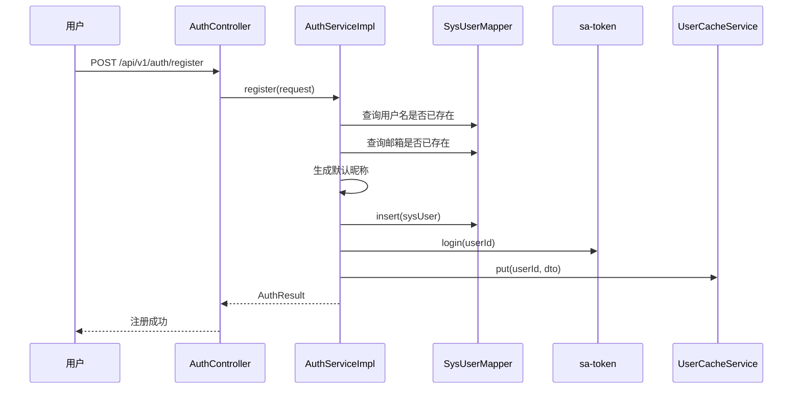
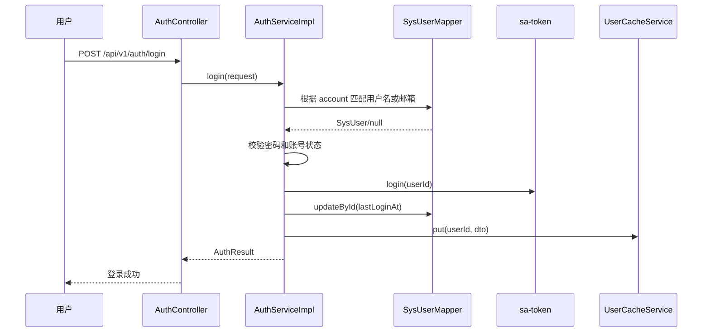

# ToLink Service 登录注册重构 一期技术实现文档

> **文档状态：** 草稿
> **项目名称：** ToLink Service
> **模块名称：** 登录注册重构（一期）
> **需求文档：** `docs/模块开发文档/登录注册重构/一期/requirement.md`
> **分支名称：** `refactor/login-register-refactor`
> **技术负责人：** AI 协作草拟
> **最后更新时间：** 2026-05-05

---

## 1. 文档修订记录 (Change Log)

| 版本号 | 修改日期 | 修改内容简述 | 修改人 | 审核人 |
| :--- | :--- | :--- | :--- | :--- |
| v1.0 | 2026-05-05 | 初始化一期技术方案，明确认证链路、持久层治理范围与测试方案 | AI | 待审核 |

## 2. 技术目标与实现范围 (Overview)

### 2.1 技术目标与核心思路 (Technical Goals)

- 技术目标：
  - 在不改数据库结构的前提下，将登录链路升级为支持“用户名或邮箱 + 密码”。
  - 将注册链路调整为用户名、邮箱、密码必填，并由后端生成默认昵称。
  - 保持现有 `AuthResult`、sa-token 登录态建立方式和用户资料读取链路不变。
  - 补齐个人资料修改邮箱时的唯一性校验。
- 设计原则：
  - 复用现有 `AuthController`、`AuthService`、`UserController`、`UserCacheService` 和异常体系。
  - 遵循 `middleware_contract.md` 的持久层规范，把本次新增用户查询从 Service 层 `LambdaQueryWrapper` 下沉为 Mapper XML。
  - 本期仅治理认证链路直接涉及的查询，不把全部历史 Wrapper 债务一并打包重构。
  - 不引入新的 Redis key、错误码或登录态协议，尽量保持前后兼容边界稳定。
- 成功标准：
  - 注册接口支持必填用户名、邮箱、密码，并返回现有 `AuthResult`。
  - 登录接口支持统一账号字段输入，并可匹配用户名或邮箱。
  - 资料修改接口在邮箱冲突时拒绝保存，并正确驱逐用户缓存。
  - 相关单元测试与集成测试覆盖注册、用户名登录、邮箱登录和邮箱冲突场景。

### 2.2 实现范围与边界 (In Scope / Out of Scope)

**必须实现：**

- 调整 `LoginRequest` 请求模型，把 `username` 更名为 `account`，更新校验提示和 Swagger 文案。
- 调整 `RegisterRequest` 请求模型，移除注册阶段的 `nickname` 输入，强制 `email` 必填。
- 在 `AuthServiceImpl` 中实现：
  - 用户名或邮箱登录查询
  - 注册默认昵称生成
  - 资料修改时邮箱唯一性校验
- 为 `SysUserMapper` 增加本期所需的自定义查询方法，并新增对应 XML Mapper。
- 同步更新认证与资料相关测试。

**暂不实现：**

- 前端页面、前端请求类型和交互文案调整。
- 历史老用户数据迁移或空邮箱兜底逻辑。
- 找回密码、验证码登录、邮箱校验链路。
- 新增数据库字段、索引、表结构或 Redis 公共契约。

### 2.3 验收项到实现点映射 (Requirement Mapping)

| 需求验收项 | 技术实现点 | 测试方式 | 责任模块 |
| :--- | :--- | :--- | :--- |
| 注册必填规则 | `RegisterRequest` 校验注解调整，`AuthServiceImpl.register` 保持唯一性校验 | Controller 集成测试、Service 单测 | `link-model`、`link-service`、`link-api` |
| 默认昵称生成 | `AuthServiceImpl.register` 内生成默认昵称并落库 | Service 单测、Controller 集成测试 | `link-service` |
| 用户名登录 | `SysUserMapper` 新增按账号查询能力，`AuthServiceImpl.login` 复用密码与状态校验 | Controller 集成测试 | `link-mapper`、`link-service` |
| 邮箱登录 | 登录查询匹配邮箱字段 | Controller 集成测试 | `link-mapper`、`link-service` |
| 唯一性约束 | 注册与资料修改复用 `DUPLICATE_USERNAME` / `DUPLICATE_EMAIL` 语义 | Service 单测 | `link-service` |
| 资料修改范围 | 继续复用 `UpdateProfileRequest`，仅允许改昵称、邮箱、手机号、头像 | UserController 现有链路回归测试 | `link-service`、`link-api` |
| 邮箱修改校验 | `AuthServiceImpl.updateProfile` 在更新前校验冲突用户 | Service 单测 | `link-service` |
| 登录态保持 | 继续复用 `StpUtil.login` 与 `AuthResult` 返回结构 | Controller 集成测试 | `link-service`、`link-api` |

## 3. 当前系统分析与复用基础 (Current-State Analysis)

### 3.1 相关模块盘点

| 模块 | 当前职责 | 现状说明 | 是否修改 |
| :--- | :--- | :--- | :--- |
| `link-api` | Controller / API 入口 | [AuthController.java](/Users/fang/Developer/Projects/toLink/toLink-Service/link-api/src/main/java/com/qingluo/link/api/controller/AuthController.java) 暴露登录、注册、登出接口；[UserController.java](/Users/fang/Developer/Projects/toLink/toLink-Service/link-api/src/main/java/com/qingluo/link/api/controller/UserController.java) 暴露资料查询与修改接口 | 是 |
| `link-service` | 业务服务 | [AuthServiceImpl.java](/Users/fang/Developer/Projects/toLink/toLink-Service/link-service/src/main/java/com/qingluo/link/service/impl/AuthServiceImpl.java) 同时负责登录、注册、资料查询、资料修改，当前使用 `LambdaQueryWrapper` 做用户查询 | 是 |
| `link-model` | Entity / DTO / Enum | [LoginRequest.java](/Users/fang/Developer/Projects/toLink/toLink-Service/link-model/src/main/java/com/qingluo/link/model/dto/request/LoginRequest.java)、[RegisterRequest.java](/Users/fang/Developer/Projects/toLink/toLink-Service/link-model/src/main/java/com/qingluo/link/model/dto/request/RegisterRequest.java)、[SysUser.java](/Users/fang/Developer/Projects/toLink/toLink-Service/link-model/src/main/java/com/qingluo/link/model/dto/entity/SysUser.java) 承载账号模型 | 是 |
| `link-mapper` | Mapper / 持久化 | [SysUserMapper.java](/Users/fang/Developer/Projects/toLink/toLink-Service/link-mapper/src/main/java/com/qingluo/link/mapper/SysUserMapper.java) 当前只有 `BaseMapper`，仓库内尚未存在 `src/main/resources/mapper` XML 目录 | 是 |
| `link-core` | 通用配置 / 异常 / 工具 | [AuthException.java](/Users/fang/Developer/Projects/toLink/toLink-Service/link-core/src/main/java/com/qingluo/link/core/exception/AuthException.java)、[ConflictException.java](/Users/fang/Developer/Projects/toLink/toLink-Service/link-core/src/main/java/com/qingluo/link/core/exception/ConflictException.java) 提供业务异常抽象 | 否 |
| `link-components` | 可复用基础组件 | Redis 双删和缓存基础能力由 `toLink-components-redis` 提供 | 否 |

### 3.2 已复用能力 (Reusable Components)

- 登录态与鉴权：复用 sa-token 的 `StpUtil.login` / `logout` 以及 `@SaCheckLogin`。
- 用户缓存：复用 [UserCacheService.java](/Users/fang/Developer/Projects/toLink/toLink-Service/link-service/src/main/java/com/qingluo/link/service/cache/UserCacheService.java) 和 [UserCacheServiceImpl.java](/Users/fang/Developer/Projects/toLink/toLink-Service/link-service/src/main/java/com/qingluo/link/service/cache/UserCacheServiceImpl.java)，继续使用 `user:info:{userId}` 和双删驱逐。
- 异常体系：复用 `AuthException`、`ConflictException`、`ErrorCode` 和 [GlobalExceptionHandler.java](/Users/fang/Developer/Projects/toLink/toLink-Service/link-api/src/main/java/com/qingluo/link/api/controller/GlobalExceptionHandler.java)。
- 用户实体与响应：复用 `SysUser`、`UserProfileDTO`、`AuthResult`，不改变返回协议。

### 3.3 已参考代码 (Code References)

| 文件/模块 | 参考点 | 对方案的影响 |
| :--- | :--- | :--- |
| [AuthServiceImpl.java](/Users/fang/Developer/Projects/toLink/toLink-Service/link-service/src/main/java/com/qingluo/link/service/impl/AuthServiceImpl.java) | 当前登录、注册、资料修改全部实现 | 本期直接在该类内重构，不新拆服务层 |
| [AuthController.java](/Users/fang/Developer/Projects/toLink/toLink-Service/link-api/src/main/java/com/qingluo/link/api/controller/AuthController.java) | 登录注册 API 路径与返回结构稳定 | 保持 URL 不变，只调整请求 DTO 语义与文案 |
| [UserController.java](/Users/fang/Developer/Projects/toLink/toLink-Service/link-api/src/main/java/com/qingluo/link/api/controller/UserController.java) | 资料修改入口已存在 | 不新增接口，复用现有 PATCH `/api/v1/user/profile` |
| [ErrorCode.java](/Users/fang/Developer/Projects/toLink/toLink-Service/link-model/src/main/java/com/qingluo/link/model/enums/ErrorCode.java) | 已存在 `DUPLICATE_USERNAME`、`DUPLICATE_EMAIL`、`USER_NOT_FOUND` 等错误码 | 本期不新增错误码 |
| [AuthControllerTest.java](/Users/fang/Developer/Projects/toLink/toLink-Service/link-api/src/test/java/com/qingluo/link/api/controller/AuthControllerTest.java) | 真实链路集成测试已覆盖注册、登录、登出、密码错误 | 需要同步请求字段与新增邮箱登录断言 |
| [AuthServiceImplTest.java](/Users/fang/Developer/Projects/toLink/toLink-Service/link-service/src/test/java/com/qingluo/link/service/impl/AuthServiceImplTest.java) | 当前只覆盖重复邮箱注册、缓存读取与资料更新 | 需要补登录与邮箱修改冲突用例 |

### 3.4 现有问题与约束 (Constraints)

- `AuthServiceImpl` 当前直接使用 `LambdaQueryWrapper`，与 `middleware_contract.md` 中“Service 层禁止直接拼查询条件”的约定冲突。
- `link-mapper` 当前没有 XML Mapper 资源目录，本期如果按约定治理查询，需要同时补建 XML 目录和 `SysUserMapper.xml`。
- 注册逻辑当前允许 `email` 为空并允许 `nickname` 前端传入，与需求文档不一致。
- 资料修改逻辑当前没有邮箱冲突校验，且变更后仅做用户缓存驱逐，不做额外衍生缓存更新。

## 4. 核心架构与实现方案 (Architecture & Solution)

### 4.1 总体设计思路 (Architecture Overview)

本期采用“保持接口主路径稳定、在 DTO 和 Service 内局部重构、顺手把认证查询下沉到 Mapper XML”的改造策略。

- API 层：
  - 保持 `/api/v1/auth/login`、`/api/v1/auth/register`、`/api/v1/user/profile` 路径不变。
  - 只更新请求 DTO 名称语义、Swagger 注释与测试数据。
- Service 层：
  - 保留 `AuthServiceImpl` 作为认证聚合服务，不新增新的业务服务拆分。
  - 把用户查询从 Wrapper 改成调用 `SysUserMapper` 自定义方法。
  - 在注册和资料修改流程中补足昵称默认生成、邮箱冲突校验。
- Mapper 层：
  - 为账号查询、用户名查重、邮箱查重、按邮箱查其他用户冲突等场景新增明确方法。
  - SQL 统一写入 `SysUserMapper.xml`，满足项目持久层规范。
- 缓存层：
  - 保持 `user:info:{userId}` TTL 与双删策略不变。
  - 资料修改成功后继续调用 `userCacheService.evict(userId)`，不新增新的缓存协议。

### 4.2 目标调用链路 (Call Flow)

```text
AuthController/UserController -> AuthServiceImpl -> SysUserMapper(+SysUserMapper.xml) -> MySQL / UserCacheService / sa-token
```

### 4.3 核心模块职责划分 (Module Responsibilities)

| 模块/类 | 职责 | 输入/输出边界 |
| :--- | :--- | :--- |
| `LoginRequest` | 承载统一账号登录请求 | 输入：`account`、`password`；输出：供 Controller 校验 |
| `RegisterRequest` | 承载注册请求 | 输入：`username`、`email`、`password`；不再接收 `nickname` |
| `AuthController` | 暴露登录/注册/登出接口 | 输入 DTO；输出 `Result<AuthResult>` |
| `UserController` | 暴露资料查询与修改接口 | 输入 `UpdateProfileRequest`；输出 `Result<Void>` |
| `AuthServiceImpl` | 编排认证、注册、资料修改业务规则 | 输入请求 DTO 和当前用户 ID；输出 `AuthResult` / `void` |
| `SysUserMapper` | 用户查询与更新持久化入口 | 输入账号、用户名、邮箱、用户 ID；输出 `SysUser` 或是否存在 |
| `UserCacheService` | 用户资料缓存读写与驱逐 | 输入用户 ID 和 `UserProfileDTO`；输出缓存命中结果 |

### 4.4 核心时序图 (Sequence Diagrams)

#### 场景 1：注册并自动生成默认昵称



#### 场景 2：统一账号登录



## 5. 接口契约与交互方案 (API Contract)

### 5.1 接口清单

| 方法 | 路径 | 说明 | 权限 |
| :--- | :--- | :--- | :--- |
| POST | `/api/v1/auth/register` | 用户注册并自动登录 | 无 |
| POST | `/api/v1/auth/login` | 用户名或邮箱登录 | 无 |
| POST | `/api/v1/auth/logout` | 当前用户登出 | 已登录 |
| GET | `/api/v1/user/profile` | 获取当前用户资料 | 已登录 |
| PATCH | `/api/v1/user/profile` | 修改当前用户资料 | 已登录 |

### 5.2 请求参数

#### `POST /api/v1/auth/login`

| 参数 | 位置 | 类型 | 必填 | 说明 |
| :--- | :--- | :--- | :--- | :--- |
| `account` | body | string | 是 | 用户名或邮箱 |
| `password` | body | string | 是 | 登录密码 |

#### `POST /api/v1/auth/register`

| 参数 | 位置 | 类型 | 必填 | 说明 |
| :--- | :--- | :--- | :--- | :--- |
| `username` | body | string | 是 | 稳定系统标识，3-64 位 |
| `email` | body | string | 是 | 登录邮箱，需符合邮箱格式 |
| `password` | body | string | 是 | 登录密码，6-128 位 |

#### `PATCH /api/v1/user/profile`

| 参数 | 位置 | 类型 | 必填 | 说明 |
| :--- | :--- | :--- | :--- | :--- |
| `nickname` | body | string | 否 | 新展示名称 |
| `email` | body | string | 否 | 新邮箱，若传入需校验未被其他用户占用 |
| `phone` | body | string | 否 | 保持现有字段 |
| `avatarUrl` | body | string | 否 | 保持现有字段 |

### 5.3 响应结构

#### `AuthResult`

注册和登录接口继续返回现有响应结构，不新增字段：

```json
{
  "code": 200,
  "message": "success",
  "data": {
    "accessToken": "token-value",
    "tokenType": "Bearer",
    "expiresIn": 604800,
    "userId": 1
  }
}
```

#### `PATCH /api/v1/user/profile`

成功时继续返回空数据成功响应：

```json
{
  "code": 200,
  "message": "success",
  "data": null
}
```

### 5.4 异常响应

| 场景 | HTTP 状态 | 业务错误码 | message |
| :--- | :--- | :--- | :--- |
| 账号不存在 | 404 | 20001 | 用户不存在 |
| 密码错误 | 401 | 20002 | 密码错误 |
| 账号禁用 | 403 | 20003 | 账号已被禁用 |
| 用户名重复 | 409 | 20006 | 用户名已存在 |
| 邮箱重复 | 409 | 20007 | 邮箱已被使用 |
| DTO 参数校验失败 | 400 | 400 | `<field>: <message>` |

### 5.5 异常类与错误码定义

#### 异常类设计

| 异常类 | 继承关系 | 使用场景 | 说明 |
| :--- | :--- | :--- | :--- |
| `AuthException` | `BusinessException` | 账号不存在、密码错误、账号禁用 | 继续复用静态工厂方法 |
| `ConflictException` | `BusinessException` | 用户名重复、邮箱重复 | 继续复用现有冲突异常 |

#### 错误码定义

| 错误码 | 枚举名/常量名 | HTTP 状态 | 触发场景 | 前端提示策略 |
| :--- | :--- | :--- | :--- | :--- |
| 20001 | `USER_NOT_FOUND` | 404 | 登录账号未匹配用户、资料查询用户不存在 | 直接展示 |
| 20002 | `INVALID_PASSWORD` | 401 | 登录密码校验失败 | 直接展示 |
| 20003 | `AUTH_DISABLED` | 403 | 用户状态非启用 | 直接展示 |
| 20006 | `DUPLICATE_USERNAME` | 409 | 注册用户名冲突 | 直接展示 |
| 20007 | `DUPLICATE_EMAIL` | 409 | 注册或资料修改邮箱冲突 | 直接展示 |

说明：

- 本期不新增异常类，也不新增错误码。
- 统一由 `GlobalExceptionHandler` 将业务异常转换为 `Result.error(code, message)`。

### 5.6 兼容性说明

- 是否兼容旧接口：兼容旧路径与旧响应结构，不兼容旧登录请求字段名 `username`。
- 是否需要过渡期：后端代码层不做双字段兼容，前端后续联调需同步切换到 `account`。
- 前端影响点：登录请求字段名变化；注册请求不再传 `nickname`。

## 6. 数据契约与存储设计 (Data & Storage)

### 6.1 数据模型与实体关系 (E-R)

- `SysUser` 仍为本次唯一核心实体。
- 登录链路读取 `SysUser.username`、`SysUser.email`、`SysUser.passwordHash`、`SysUser.status`。
- 注册链路写入 `username`、`email`、`passwordHash`、`nickname`、`role`、`status`、`last_login_at`。
- 资料修改链路仅更新 `nickname`、`email`、`phone`、`avatar_url` 中传入的字段。

### 6.2 数据库组件与结构变更 (Database & Schema Changes)

#### MySQL 变更

| 表名 | 变更类型 | 变更说明 | 备注 |
| :--- | :--- | :--- | :--- |
| `sys_user` | 无结构变更 | 只调整查询与写入逻辑 | 复用现有字段 |

### 6.3 字段设计

#### `sys_user` 读写关注字段

| 字段 | 类型 | 是否必填 | 默认值 | 说明 |
| :--- | :--- | :--- | :--- | :--- |
| `username` | varchar | 是 | 无 | 唯一用户名，注册写入，资料页不可修改 |
| `email` | varchar | 是 | 无 | 唯一邮箱，注册写入，资料页可修改 |
| `password_hash` | varchar | 是 | 无 | 密码加密结果 |
| `nickname` | varchar | 是 | 后端生成 | 展示名称，允许修改 |
| `role` | varchar | 是 | `USER` | 继续复用现有默认角色 |
| `status` | int | 是 | `1` | 继续复用启用状态语义 |
| `last_login_at` | datetime | 是 | 当前时间 | 注册成功与登录成功时更新 |

### 6.4 索引与约束

- 本期不新增索引与唯一约束，依赖现有 `sys_user` 的用户名、邮箱唯一性基础。
- 技术实现中仍会主动做重复校验，以保证业务错误码可控，而不是直接依赖数据库异常冒泡。

### 6.5 中间件与其他存储设计

| 组件 | 存储内容 | Key/Path 规则 | 备注 |
| :--- | :--- | :--- | :--- |
| Redis | 用户资料缓存 | `user:info:{userId}` | 复用现有 TTL 7 天与双删策略 |
| MQ | 无 | 无 | 本期不涉及 |
| OSS / MinIO | 无 | 无 | 本期不涉及 |
| 其他 | sa-token 会话 | 保持现有框架行为 | 不改协议 |

### 6.6 数据迁移与回滚

- 是否需要迁移：不需要。
- 迁移策略：无。
- 回滚策略：若本期回滚代码，则登录恢复为仅用户名，注册恢复为可选邮箱与显式昵称输入；不涉及数据库回滚。

## 7. 核心实现逻辑 (Core Implementation)

### 7.1 Service / Component 设计

```java
public interface AuthService {
    AuthResult login(LoginRequest request);
    AuthResult register(RegisterRequest request);
    void logout();
    UserProfileDTO getProfile(Long userId);
    void updateProfile(Long userId, UpdateProfileRequest request);
}
```

### 7.2 核心方法职责

| 方法 | 职责 | 输入 | 输出 |
| :--- | :--- | :--- | :--- |
| `AuthServiceImpl.login` | 统一账号登录、登录态建立、缓存写入 | `LoginRequest` | `AuthResult` |
| `AuthServiceImpl.register` | 校验唯一性、生成默认昵称、创建用户、自动登录 | `RegisterRequest` | `AuthResult` |
| `AuthServiceImpl.updateProfile` | 更新昵称/邮箱/手机号/头像并校验邮箱冲突 | `userId`、`UpdateProfileRequest` | `void` |
| `SysUserMapper.findByAccount` | 根据用户名或邮箱匹配用户 | `account` | `SysUser` |
| `SysUserMapper.findByUsername` | 查询用户名是否已存在 | `username` | `SysUser` |
| `SysUserMapper.findByEmail` | 查询邮箱是否已存在 | `email` | `SysUser` |
| `SysUserMapper.findByEmailExcludingUserId` | 查询某邮箱是否被其他用户占用 | `email`、`userId` | `SysUser` |

### 7.3 关键处理流程

1. 登录流程先对 `account` 做 `trim` 归一化，再通过 Mapper 一次查询匹配 `username` 或 `email`。
2. 注册流程先分别校验用户名和邮箱冲突，再生成默认昵称、编码密码、插入用户、建立登录态、写入缓存。
3. 资料修改流程先读取当前用户，再按字段更新；若请求带邮箱且与当前邮箱不同，则先做“排除自己”的邮箱冲突校验，成功后更新并驱逐缓存。
4. 默认昵称生成封装在 `AuthServiceImpl` 私有方法中，格式采用需求已确认的 `用户` + 7 位随机字母数字。

### 7.4 并发、幂等与一致性

- 并发控制：
  - 本期不额外引入分布式锁，依赖用户名/邮箱唯一性基础和业务前置校验。
  - 极端并发注册下仍可能出现 DB 唯一约束竞争，若后续发现真实表约束存在差异，再补数据库异常转业务异常。
- 幂等策略：
  - 注册接口不提供显式幂等，多次提交按现有重复校验返回冲突错误。
  - 登录接口天然非幂等但可重复执行，每次返回新登录态结果。
- 事务边界：
  - 本期保持当前单方法数据库写入模式，不新增显式事务边界。
  - 注册流程的插入、登录态建立、缓存写入维持现有先写库后登录再写缓存顺序。
- 跨组件一致性：
  - 用户资料更新后只做缓存驱逐，由后续读取回源 DB 重建缓存。
  - 本期不新增新的跨组件一致性问题。

## 8. 组件集成与配置方案 (Integration Design)

| 组件 | 用途 | 配置项 | 失败处理 |
| :--- | :--- | :--- | :--- |
| Redis | 缓存当前用户资料 | 复用现有 `user:info:{userId}`、TTL 7 天 | 更新资料后驱逐缓存，读取失败可回源 DB |
| sa-token | 登录态建立与登出 | 复用现有全局配置 | 若登录态建立失败，接口按框架异常返回 |
| MyBatis Mapper XML | 承接用户查询 SQL | 新增 `SysUserMapper.xml` | SQL 为空或映射异常时按系统异常暴露 |

## 9. 权限、安全与审计设计 (Security)

### 9.1 认证与授权

| 操作 | 权限要求 | 校验位置 |
| :--- | :--- | :--- |
| 注册 | 无 | `AuthController` + DTO 校验 |
| 登录 | 无 | `AuthController` + `AuthServiceImpl` |
| 登出 | 已登录 | sa-token |
| 获取个人资料 | 已登录 | `@SaCheckLogin` + `AuthContext` |
| 修改个人资料 | 已登录 | `@SaCheckLogin` + `AuthContext` |

### 9.2 敏感数据处理

- 敏感字段：
  - `password`
  - `passwordHash`
  - `accessToken`
- 脱敏策略：
  - 继续复用 `PasswordEncoder` 存储哈希，不明文落库。
  - 技术方案与测试示例不输出真实 token 内容。
- 日志策略：
  - 不新增打印账号密码日志。
  - 业务异常继续由 `GlobalExceptionHandler` 记录 message，不扩展敏感入参日志。

### 9.3 审计要求

- 继续使用 `last_login_at` 记录最近一次成功登录时间。
- 用户名保持不可修改，满足稳定审计标识诉求。

## 10. 异常处理与降级策略 (Exceptions & Fallback)

| 异常场景 | 处理方式 | 错误码 | 用户提示 | 是否重试 |
| :--- | :--- | :--- | :--- | :--- |
| 登录账号未匹配用户 | 抛出 `AuthException.userNotFound()` | 20001 | 用户不存在 | 否 |
| 登录密码错误 | 抛出 `AuthException.invalidPassword()` | 20002 | 密码错误 | 否 |
| 登录账号禁用 | 抛出 `AuthException.accountDisabled()` | 20003 | 账号已被禁用 | 否 |
| 注册用户名冲突 | 抛出 `ConflictException(ErrorCode.DUPLICATE_USERNAME)` | 20006 | 用户名已存在 | 否 |
| 注册邮箱冲突 | 抛出 `ConflictException(ErrorCode.DUPLICATE_EMAIL)` | 20007 | 邮箱已被使用 | 否 |
| 修改邮箱冲突 | 抛出 `ConflictException(ErrorCode.DUPLICATE_EMAIL)` | 20007 | 邮箱已被使用 | 否 |
| Redis 缓存写入失败 | 不在本期单独降级处理，沿用现有异常行为 | 50001 | 系统内部错误 | 否 |

## 11. 测试与验证方案 (Test Plan)

### 11.1 单元测试

| 测试类 | 覆盖内容 |
| :--- | :--- |
| `AuthServiceImplTest` | 重复邮箱注册、用户名/邮箱登录、默认昵称生成、邮箱修改冲突、缓存驱逐 |

### 11.2 集成测试

| 测试类 | 覆盖接口/流程 |
| :--- | :--- |
| `AuthControllerTest` | 注册成功、用户名登录成功、邮箱登录成功、登出成功、密码错误登录失败 |
| `UserControllerTest` | 资料修改时邮箱冲突与正常更新回归 |

### 11.3 回归测试

| 回归点 | 验证方式 |
| :--- | :--- |
| 注册成功后自动登录 | MockMvc / 集成测试 |
| 获取当前用户资料缓存回源链路 | 单元测试回归 |
| 登出链路 | 现有集成测试回归 |
| 用户资料更新后缓存驱逐 | 单元测试验证 |

## 12. 发布方案 (Release Plan)

- 发布前准备：
  - 完成技术方案审核。
  - 完成 DTO、Service、Mapper XML、测试改造。
- 发布步骤：
  - 正常随应用发布，无需数据库脚本和中间件配置变更。
- 回滚方案：
  - 若联调发现前端尚未同步 `account` 字段，可直接回滚代码版本。
  - 回滚不涉及数据修复和中间件清理。

## 13. 中间件契约结论

- 本次是否需要读取公共契约：需要，已读取 `middleware_contract.md` 与 `redis_component.md`。
- 本次属于“复用现有约定”还是“新增/修改公共契约”：以复用现有 MySQL、Redis、统一异常响应约定为主。
- 是否需要回写 `middleware_contract.md`：本期暂不需要。
  - 原因 1：不新增 Redis key、TTL、双删策略。
  - 原因 2：不新增错误码与统一响应结构。
  - 原因 3：虽然本期会补 `SysUserMapper.xml`，但这是对既有“持久层查询应下沉 XML”约定的落实，不形成新的公共规则。
