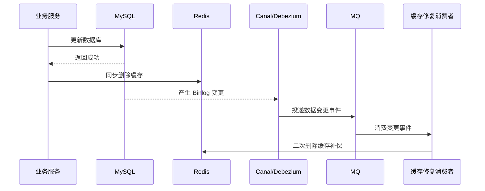
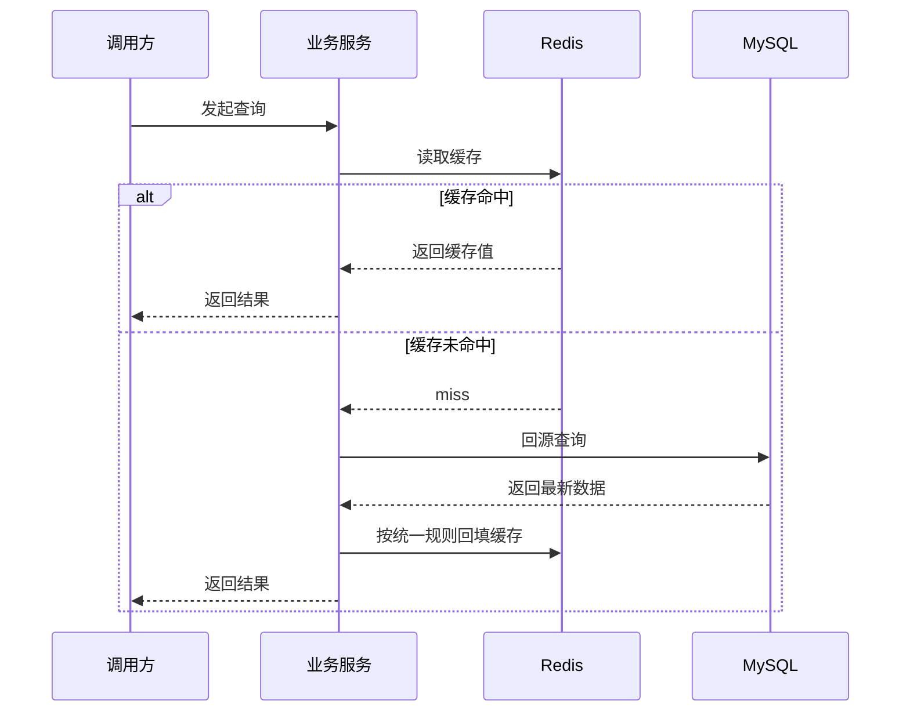

# ToLink Service 缓存一致性改造一期 PRD

> **文档状态：** 需求待审核
> **项目名称：** ToLink Service
> **模块名称：** 缓存一致性改造（一期）
> **分支名称：** refactor/cache-consistency-cdc
> **产品负责人：** Fang / Codex
> **最后更新时间：** 2026-05-06

---

## 1. 文档修订记录 (Change Log)

| 版本号 | 修改日期 | 修改内容简述 | 提出人 | 审核人 |
| :--- | :--- | :--- | :--- | :--- |
| v1.0 | 2026-05-06 | 初始化缓存一致性改造一期 PRD，锁定项目级统一框架与分期边界 | Fang / Codex | Fang |

---

## 2. 需求背景与业务目标 (Overview)

### 2.1 业务概览与核心逻辑 (Business Overview)

- **业务定位：** 一期不是某个单业务模块的局部优化，而是 ToLink Service 的项目级缓存一致性框架建设。其职责是为后续所有“高频读、可回源、需要最终一致性”的 Redis 缓存提供统一写入、失效、补偿和接入标准。
- **核心逻辑主线：** 写请求成功更新 MySQL 后，同步删除对应 Redis 缓存；随后由 MySQL Binlog/CDC 产生数据变更事件，经中间链路投递到 MQ，再由缓存修复消费者执行二次删除补偿，确保并发回填、漏删或删除失败后的缓存仍能收敛到最新状态。
- **核心价值：** 将当前依赖应用侧双删和固定时间延迟的方案，升级为“同步删除止血 + 数据变更驱动异步补偿”的统一机制，降低脏缓存窗口，减少业务模块各自实现缓存一致性逻辑的重复成本和偏差风险。

### 2.2 核心节点目标与验收准则 (Key Milestones)

| 核心功能节点 | 预期达成目标 | 关键验收点 (DoD) |
| :--- | :--- | :--- |
| 统一写路径失效策略 | 项目级缓存写请求统一采用“写库成功后同步删除缓存” | 新接入缓存的写路径不再依赖各模块自定义延迟双删口径 |
| CDC 异步补偿链路 | 框架可消费数据库变更事件并执行二次删除补偿 | 发生写后并发回填、同步删除失败或漏删时，补偿链路可再次删除对应 key |
| 公共契约治理 | Redis 与 MQ 的一致性规则形成项目级统一契约 | 缓存 key、消息字段、消费者职责和幂等边界在文档中有统一定义 |
| 接入边界管理 | 明确一期框架建设范围与二期业务迁移范围 | 一期不会被误解为完成全部业务缓存迁移，二期迁移入口和准入条件清晰 |
| 可观测与补偿要求 | 关键失败场景具备追踪与补偿口径 | 同步删除失败、CDC 事件异常、MQ 消费失败、重复消费等均有明确处理要求 |

---

## 3. 核心架构与业务流程 (Architecture & Flow)

### 3.1 核心业务时序图 (Sequence Diagrams)

#### 场景 1：写请求主链路与异步补偿



#### 场景 2：读请求回源与缓存回填



### 3.2 状态机定义 (State Machine)

| 当前状态 | 触发动作/条件 | 流转后状态 | 备注/逆向逻辑 |
| :--- | :--- | :--- | :--- |
| 业务数据已缓存 | 写请求提交成功 | 待补偿 | 应用已执行同步删除，等待 CDC 异步补偿兜底 |
| 待补偿 | CDC 事件成功消费 | 补偿完成 | 二次删除完成，缓存进入稳定收敛状态 |
| 待补偿 | MQ 消费失败或延迟 | 补偿异常 | 需要重试、告警或人工介入 |
| 缓存未命中 | 读请求回源 DB | 缓存回填 | 回填规则应与缓存 owner service 统一定义 |

### 3.3 一期范围与二期分工

| 期次 | 目标边界 | 本期要求 | 明确不做 |
| :--- | :--- | :--- | :--- |
| 一期 | 建立统一缓存一致性框架 | 锁定同步删除、CDC 事件、MQ 补偿、公共契约、观测和首批接入名单 | 不完成所有旧业务迁移 |
| 二期 | 业务接入与旧缓存清洗 | 分业务域迁移现有缓存、下线旧双删口径、补测试与交付文档 | 不再修改一期框架的核心范式，除非评审结论要求 |

---

## 4. 功能规格与交互逻辑 (Functional Specs)

### 4.1 页面交互与功能示意 (UI & Functionality)

- 一期不新增面向最终用户的业务页面。
- 一期允许新增或调整仅面向开发与运维的配置、监控或管理入口，但其职责仅限于框架接入、状态观测与故障排查。
- 一期所有变更以“框架能力”和“接入规范”形式交付，不要求前端同步感知缓存一致性链路细节。

### 4.2 接口契约规范

| 维度 | 要求与标准 | 备注 |
| :--- | :--- | :--- |
| 写路径策略 | 统一采用“写库成功后同步删除缓存” | 不以延迟双删作为新接入默认策略 |
| 事件来源 | 统一基于 MySQL Binlog/CDC 产出数据变更事件 | 不允许由业务手工拼接伪变更消息替代数据库事实 |
| MQ 契约 | 事件必须携带可唯一定位缓存 key 的业务主键、业务域和操作类型 | 便于消费者无歧义路由删除目标 |
| 消费者职责 | 一期默认执行“删除缓存”补偿，不执行异步更新缓存 | 避免引入高成本回库与序列化复杂度 |
| 幂等要求 | 事件重复消费不得造成业务副作用 | 多次删除同一 key 视为允许行为 |

### 4.3 核心业务逻辑 (按模块拆分)

#### 模块 A：缓存一致性统一框架

- **业务逻辑概述：** 统一框架负责定义缓存 owner service、写路径删除规范、读路径回填边界和异步补偿接入标准，避免各业务模块自行决定一致性策略。
- **核心处理规则：** 新接入缓存必须由明确的业务 owner service 承担 key 生成、读取、回填、失效和 TTL 规则；写请求在 DB 成功提交后先删除缓存，再交由 CDC 链路做二次删除补偿。
- **数据持久化规格：** 一期不要求新增业务主数据表，但允许为事件映射、消费幂等或补偿观测引入必要的支撑对象或配置。
- **并发与一致性：** 一期统一选择“同步删除 + 异步二次删除”的最终一致性策略，不将“异步更新缓存”作为默认路径。
- **异常流与降级：** 当 CDC、MQ 或补偿消费者不可用时，系统仍保留同步删除能力，但必须通过日志和告警暴露补偿链路异常。

#### 模块 B：CDC 事件与 MQ 补偿链路

- **业务逻辑概述：** CDC 链路负责将数据库已提交的变更事实转化为缓存补偿事件，经 MQ 分发后由消费者执行二次删除。
- **核心处理规则：** 事件源必须与数据库事实保持一致；消费者只能根据事件内容删除对应缓存，不负责重建完整缓存对象。
- **数据持久化规格：** 一期需求层仅锁定“需要有可追踪的变更事件”和“需要有消费结果观测”，不提前定义具体表字段实现。
- **并发与一致性：** 允许重复事件、乱序重试和重复删除，但要求最终不会因为补偿链路再次写入旧缓存。
- **异常流与降级：** 若事件丢失、消息积压或消费失败，必须具备可重试、可告警和可人工排查的边界。

#### 模块 C：接入治理与迁移边界

- **业务逻辑概述：** 一期只定义项目级统一方案和首批适用范围，二期再执行新旧业务迁移。
- **核心处理规则：** 只有满足“高频读、可回源、最终一致性可接受”的数据，才允许接入这套框架；运行时配置类 Redis key 与纯状态型 key 不直接复用该策略。
- **数据持久化规格：** 一期不要求把所有历史 key 改造完毕，但要明确首批候选对象和排除对象。
- **并发与一致性：** 接入治理规则需保证同一类缓存 key 的命名、定位主键和删除口径保持稳定，避免出现同一业务一会按 `id`、一会按业务编码删除的情况。
- **异常流与降级：** 对暂未迁移的历史缓存，保留现状但需在二期范围中明确其清洗计划。

---

## 5. 数据契约与存储约束 (Data & Storage)

### 5.1 数据模型与实体关系 (E-R)

```text
业务写请求 -> MySQL主数据
MySQL主数据 -> CDC变更事件
CDC变更事件 -> MQ补偿消息
MQ补偿消息 -> 缓存修复消费者
缓存修复消费者 -> Redis缓存Key
```

### 5.2 数据库组件与表结构变更 (Database & Schema Changes)

**涉及存储组件清单：**

- [x] MySQL（作为业务事实来源与 CDC 事件源）
- [x] Redis（统一缓存失效与读写承载）
- [x] MQ（缓存补偿事件分发）
- [ ] OSS
- [ ] Elasticsearch
- [ ] 其他向量数据库

**MySQL 变更**

| 库名 / 表名 | 变更类型 | 核心字段说明 / 变更详情 | 备注要求 |
| :--- | :--- | :--- | :--- |
| 业务主数据表 | 复用 | 一期不以改表为主要目标，重点是将其作为 CDC 事实源 | 若后续需要补字段支撑事件定位，应在技术设计中明确 |

**Redis 变更**

| Key 名 | 变更类型 | 核心字段说明 / 变更详情 | 备注要求 |
| :--- | :--- | :--- | :--- |
| `user:info:{userId}` | 复用 | 继续作为用户信息缓存候选接入对象 | 二期评估迁移 |
| `user:role:{userId}` | 复用 | 继续作为角色缓存候选接入对象 | 二期评估迁移 |
| `llm:cfg:{configId}` | 复用 | 继续作为用户 LLM 配置缓存候选接入对象 | 二期评估迁移 |
| `llm:u_def:{userId}` | 复用 | 继续作为用户默认配置缓存候选接入对象 | 二期评估迁移 |
| `llm:pvd:{providerType}` | 复用 | 继续作为系统厂商缓存候选接入对象 | 二期评估迁移 |

**MQ 变更**

| Topic / Queue 名 | 变更类型 | 核心字段说明 / 变更详情 | 备注要求 |
| :--- | :--- | :--- | :--- |
| 缓存补偿事件 | 新增公共事件 | 携带业务域、操作类型、缓存主键、路由信息与追踪信息 | 一期只锁定契约，不提前展开具体命名实现 |

### 5.3 缓存与持久化策略

- 一期默认采用“删除缓存”补偿，不采用“异步更新缓存”补偿。
- 读请求缓存回填仍允许存在，但必须通过缓存 owner service 统一控制。
- 运行时配置类 key（如 `knowledge:file-upload:config`）不作为一期统一框架的首批迁移对象。
- 与缓存无关的业务主数据仍以 MySQL 为最终真相来源，Redis 不承诺强一致。

---

## 6. 异常处理与非功能性需求 (Exceptions & NFR)

### 6.1 稳定性与降级策略 (Reliability & Fallback)

- 同步删除缓存失败时，写请求的处理口径、重试边界和告警要求必须统一定义。
- CDC 采集失败、MQ 投递失败、MQ 消费失败或消费积压时，必须有明确的补偿与告警机制。
- 若异步补偿链路不可用，读请求仍可通过缓存 miss 回源 DB 继续服务，但系统必须暴露一致性风险。
- 重复消费与重复删除必须被视为允许行为，不得造成额外业务副作用。

### 6.2 性能与扩展性要求 (Performance & Scalability)

- 一期框架设计不得显著拉长主写请求响应时间；主链路新增动作应限制为“写库成功后删除缓存”。
- 异步补偿链路应支持后续按业务域扩容，不要求一期完成所有业务接入。
- 不以缓存异步更新为目标，避免消费者侧频繁回库和对象重建带来的额外成本。

### 6.3 可观测性、安全与合规 (Security & Observability)

- 主写链路、CDC 事件、MQ 消费和二次删除动作必须可通过统一 traceId 或等价追踪标识关联。
- 日志中不得暴露敏感配置、API Key 或用户密钥类信息。
- 需要对同步删除失败、事件丢失风险、消费重试次数和补偿异常建立监控与报警口径。

### 6.4 数据埋点与运营要求

- 需要记录缓存补偿事件总量、成功量、失败量、重复消费量和消费延迟分布。
- 需要记录首批接入缓存 key 的命中、回源与补偿行为，为二期迁移评估提供依据。

---

## 7. 遗留问题与依赖项 (Dependencies & Open Issues)

- 一期需要在技术设计中明确采用哪种 CDC 组件与部署形态，例如 Canal 或 Debezium。
- 一期需要在技术设计中明确缓存补偿事件与现有 MQ 组件的集成方式，以及事件命名和路由规则。
- 一期需要在技术设计中明确同步删除失败是否阻断主写请求，以及对应的重试与人工介入口径。
- 二期需要基于一期框架评估首批迁移顺序，至少包括 `user` 与 `llm-config` 相关缓存。
- 现有双删文档、组件说明和公共契约需要在后续阶段统一更新，避免新旧方案长期并存导致误导。
