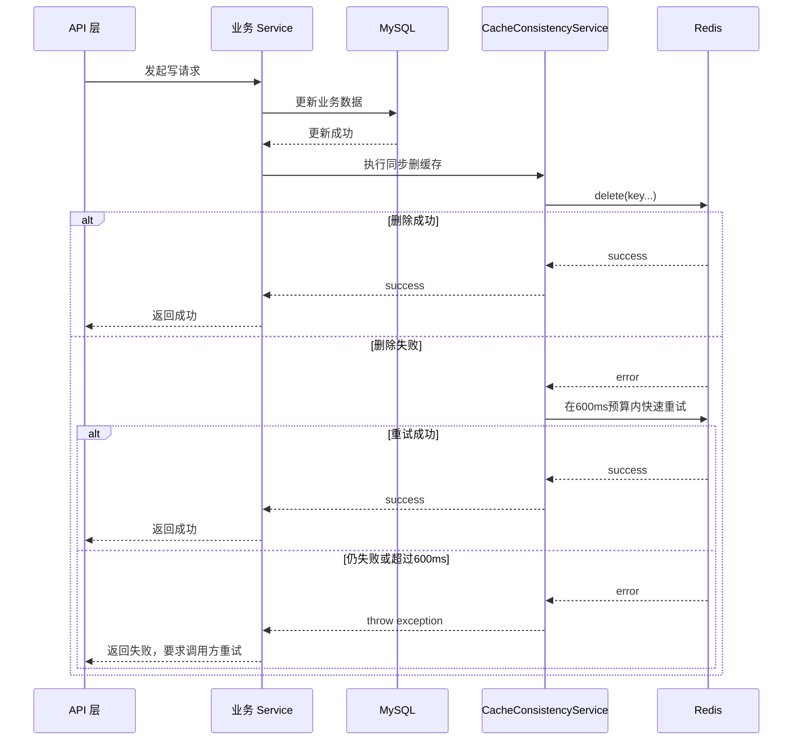
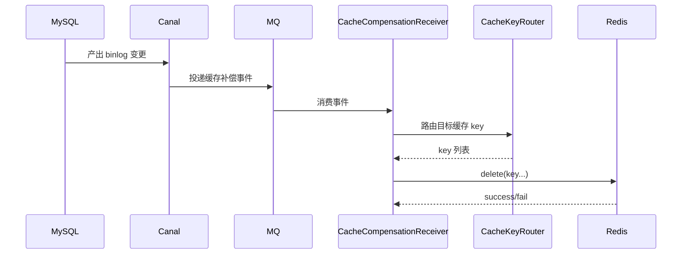
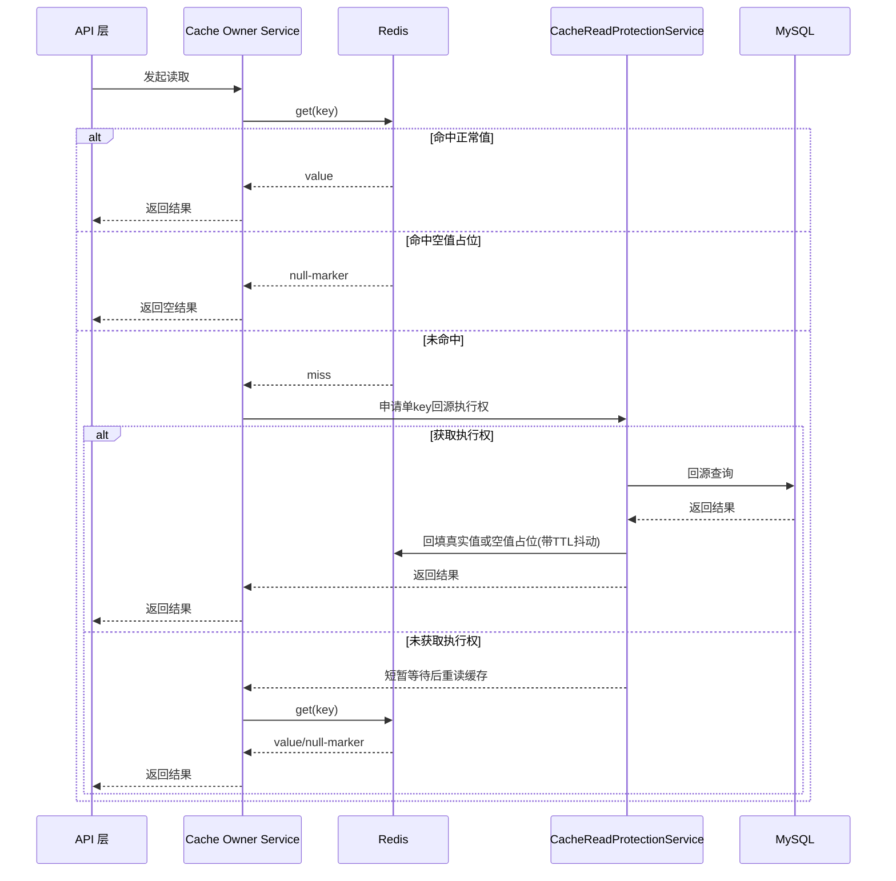

# ToLink Service 缓存一致性改造一期技术实现文档

> **文档状态：** 技术方案已落地，待最终审核确认
> **项目名称：** ToLink Service
> **模块名称：** 缓存一致性改造（一期）
> **需求文档：** [requirement.md](/Users/fang/Developer/Projects/toLink/toLink-Service/docs/模块开发文档/缓存一致性改造/一期/requirement.md)
> **分支名称：** refactor/cache-consistency-cdc
> **技术负责人：** Fang / Codex
> **最后更新时间：** 2026-05-06

---

## 1. 文档修订记录 (Change Log)

| 版本号 | 修改日期 | 修改内容简述 | 修改人 | 审核人 |
| :--- | :--- | :--- | :--- | :--- |
| v1.0 | 2026-05-06 | 初始化一期技术方案，明确 Canal + MQ + Redis 二次删除补偿链路及框架边界 | Fang / Codex | Fang |
| v1.1 | 2026-05-06 | 根据实际代码落地与测试交付进度回填文档状态，进入最终审核前确认 | Fang / Codex | Fang |

---

## 2. 技术目标与实现范围 (Overview)

### 2.1 技术目标与核心思路 (Technical Goals)

- **技术目标：**
  - 在现有 `DoubleDeleteCacheService` 之外，建立项目级统一缓存一致性框架，默认采用“写库成功后同步删除缓存 + Canal CDC 异步二次删除补偿”。
  - 复用现有 MQ 统一抽象，新增缓存补偿消息模型与消费者，打通 `MySQL -> Canal -> MQ -> Consumer -> Redis` 全链路。
  - 为二期业务迁移提供稳定的缓存 owner service、key 路由、异常处理和观测标准。
  - 在统一缓存框架中补齐缓存击穿、穿透、雪崩的基础防护能力，避免后续业务接入时重复实现。
- **设计原则：**
  - MySQL 始终是真实数据源，Redis 只承担可回源缓存。
  - 一期消费者只做删除缓存，不做回库重建、不做异步更新缓存。
  - 同步删除缓存失败时，服务端先做有限快速重试；若总同步补救时间仍超过 `600ms` 或仍未删除成功，则主请求失败，由调用方重试，避免“写库成功但脏缓存继续对外服务”。
  - Canal 事件只承载缓存补偿所需的最小业务定位信息，不把消费者设计成完整业务重建器。
  - 击穿、穿透、雪崩保护统一沉淀在 cache owner service 或通用缓存保护组件中，不允许业务模块各自散落实现。
- **成功标准：**
  - 写请求侧存在统一的同步删缓存执行入口。
  - Canal 变更事件能经 MQ 投递到 Java 消费端并完成二次删除。
  - 一期文档与契约能明确后续接入对象、排除对象和迁移方式。

### 2.2 实现范围与边界 (In Scope / Out of Scope)

**必须实现：**

- 新增项目级缓存一致性框架入口，包括同步删缓存执行器、缓存 key 路由与补偿消费者抽象。
- 设计 Canal 监听 MySQL binlog 并向现有 MQ 框架投递缓存补偿消息的链路。
- 设计缓存补偿消息模型、topic/queue 命名、消费者职责与异常处理口径。
- 设计首批接入缓存对象的 key 路由规则：
  - `user:info:{userId}`
  - `user:role:{userId}`
  - `llm:cfg:{configId}`
  - `llm:u_def:{userId}`
  - `llm:pvd:{providerType}`
- 设计 Redis、MQ、可观测性和公共契约更新要求。
- 设计缓存击穿、穿透、雪崩的统一防护策略和默认配置项。

**暂不实现：**

- 不在一期实现全部旧业务迁移。
- 不在一期实现缓存异步更新、回库重建或预热。
- 不在一期引入消费幂等表。
- 不在一期接入 `knowledge:file-upload:config` 这类运行时配置 key。

### 2.3 验收项到实现点映射 (Requirement Mapping)

| 需求验收项 | 技术实现点 | 测试方式 | 责任模块 |
| :--- | :--- | :--- | :--- |
| 写库成功后同步删除缓存 | 新增统一同步删除执行器，业务写路径通过 cache owner service 调用，并将同步补救时间预算控制在 `600ms` 内 | Service 单元测试 | `link-components-redis` / `link-service` |
| CDC 异步二次删除补偿 | 新增 Canal 事件消息模型、MQ topic、Java 消费者 | MQ 消费测试 / 集成测试 | `link-components-mq` / `link-service` |
| MQ 统一复用 | 复用 `AbstractMQ`、`MQSend`、`MQMsgReceiver` 抽象 | 组件集成测试 | `link-components-mq` |
| 一期首批 key 路由规则 | 新增缓存 key 路由器与 owner service 接口规范 | 单元测试 | `link-service` / `link-components-redis` |
| 同步删除失败阻断主请求 | 删除缓存异常透出并触发主请求失败 | Service 单元测试 / API 集成测试 | `link-service` / `link-api` |
| 击穿、穿透、雪崩保护 | 统一落地空值缓存、单 key 回源并发合并、TTL 抖动 | 单元测试 / 集成测试 / 压测 | `link-components-redis` / `link-service` |

---

## 3. 当前系统分析与复用基础 (Current-State Analysis)

### 3.1 相关模块盘点

| 模块 | 当前职责 | 现状说明 | 是否修改 |
| :--- | :--- | :--- | :--- |
| `link-api` | Controller / API 入口 | 现有写请求入口在用户、厂商、LLM 配置等 Controller，当前不直接操作 Redis | 是 |
| `link-service` | 业务服务 | 已有 `UserCacheServiceImpl`、`AuthServiceImpl`、`AdminProviderServiceImpl`、`UserLLMConfigServiceImpl` 等缓存读写与驱逐逻辑 | 是 |
| `link-model` | Entity / DTO / Enum | 现有缓存补偿暂无统一消息 DTO，需要新增补偿消息载体或辅助枚举 | 是 |
| `link-mapper` | Mapper / 持久化 | 主数据仍由 MySQL 承担，不以 Mapper 改造为主 | 否 |
| `link-core` | 通用配置 / 异常 / 工具 | 现有异常体系可复用，需要补充缓存删除失败相关错误码或异常口径 | 可能 |
| `link-components` | 可复用基础组件 | Redis 侧已有 `DoubleDeleteCacheService`，MQ 侧已有统一发送与接收抽象 | 是 |

### 3.2 已复用能力 (Reusable Components)

- Redis 组件文档：[redis_component.md](/Users/fang/Developer/Projects/toLink/toLink-Service/docs/组件和数据库约定/middleware-components/redis_component.md)
- Redis 执行能力：
  - [RedisConfig.java](/Users/fang/Developer/Projects/toLink/toLink-Service/link-components/toLink-components-redis/src/main/java/com/qingluo/link/components/redis/RedisConfig.java)
  - [RedisUtils.java](/Users/fang/Developer/Projects/toLink/toLink-Service/link-components/toLink-components-redis/src/main/java/com/qingluo/link/components/redis/RedisUtils.java)
  - [DoubleDeleteCacheService.java](/Users/fang/Developer/Projects/toLink/toLink-Service/link-components/toLink-components-redis/src/main/java/com/qingluo/link/components/redis/service/DoubleDeleteCacheService.java)
- MQ 组件能力：
  - [kafka_component.md](/Users/fang/Developer/Projects/toLink/toLink-Service/docs/组件和数据库约定/middleware-components/kafka_component.md)
  - [AbstractMQ.java](/Users/fang/Developer/Projects/toLink/toLink-Service/link-components/toLink-components-mq/src/main/java/com/qingluo/link/components/mq/AbstractMQ.java)
  - [MQSend.java](/Users/fang/Developer/Projects/toLink/toLink-Service/link-components/toLink-components-mq/src/main/java/com/qingluo/link/components/mq/MQSend.java)
  - [MQMsgReceiver.java](/Users/fang/Developer/Projects/toLink/toLink-Service/link-components/toLink-components-mq/src/main/java/com/qingluo/link/components/mq/MQMsgReceiver.java)
  - [KafkaMQAutoConfiguration.java](/Users/fang/Developer/Projects/toLink/toLink-Service/link-components/toLink-components-mq/src/main/java/com/qingluo/link/components/mq/vender/kafka/KafkaMQAutoConfiguration.java)
- 现有业务缓存封装：
  - [UserCacheServiceImpl.java](/Users/fang/Developer/Projects/toLink/toLink-Service/link-service/src/main/java/com/qingluo/link/service/cache/UserCacheServiceImpl.java)
  - [KnowledgeFileConfigCacheServiceImpl.java](/Users/fang/Developer/Projects/toLink/toLink-Service/link-service/src/main/java/com/qingluo/link/service/cache/KnowledgeFileConfigCacheServiceImpl.java)

### 3.3 已参考代码 (Code References)

| 文件/模块 | 参考点 | 对方案的影响 |
| :--- | :--- | :--- |
| [DoubleDeleteCacheService.java](/Users/fang/Developer/Projects/toLink/toLink-Service/link-components/toLink-components-redis/src/main/java/com/qingluo/link/components/redis/service/DoubleDeleteCacheService.java) | 当前双删实现与已固化 key | 一期需保留兼容，但默认策略从双删切换到同步删 + CDC 二次删 |
| [UserCacheServiceImpl.java](/Users/fang/Developer/Projects/toLink/toLink-Service/link-service/src/main/java/com/qingluo/link/service/cache/UserCacheServiceImpl.java) | 业务 cache service 封装方式 | 后续缓存 owner service 继续沿用业务封装模式 |
| [AuthServiceImpl.java](/Users/fang/Developer/Projects/toLink/toLink-Service/link-service/src/main/java/com/qingluo/link/service/impl/AuthServiceImpl.java) | 用户缓存回填与驱逐入口 | 二期迁移时需要切换到新同步删缓存执行器 |
| [StpInterfaceImpl.java](/Users/fang/Developer/Projects/toLink/toLink-Service/link-api/src/main/java/com/qingluo/link/api/stp/StpInterfaceImpl.java) | 用户角色读取对 `user:info` 的依赖 | 说明 `user:role` 和 `user:info` 需要支持联合删除路由 |
| [AdminProviderServiceImpl.java](/Users/fang/Developer/Projects/toLink/toLink-Service/link-service/src/main/java/com/qingluo/link/service/impl/AdminProviderServiceImpl.java) | 厂商缓存驱逐入口与 `providerType/id` 口径不一致 | 技术方案必须统一缓存路由主键，以 `providerType` 为准 |
| [UserLLMConfigServiceImpl.java](/Users/fang/Developer/Projects/toLink/toLink-Service/link-service/src/main/java/com/qingluo/link/service/impl/UserLLMConfigServiceImpl.java) | `llm:cfg` 失效入口 | 说明业务写路径已存在缓存失效钩子，可在二期接入新执行器 |
| [KnowledgeParseTaskMQ.java](/Users/fang/Developer/Projects/toLink/toLink-Service/link-service/src/main/java/com/qingluo/link/service/mq/KnowledgeParseTaskMQ.java) | MQ 消息模型、序列化与校验模式 | 缓存补偿消息模型可沿用“扁平 JSON + validate”风格 |
| [KnowledgeParseResultKafkaReceiver.java](/Users/fang/Developer/Projects/toLink/toLink-Service/link-service/src/main/java/com/qingluo/link/service/mq/kafka/KnowledgeParseResultKafkaReceiver.java) | Kafka 消费者注册方式 | 缓存补偿消费者可复用相同监听模式 |

### 3.4 现有问题与约束 (Constraints)

- 当前公共契约仍以“双删”描述为主，Redis 和 MQ 文档需要改写。
- MQ 组件说明文档以 [kafka_component.md](/Users/fang/Developer/Projects/toLink/toLink-Service/docs/组件和数据库约定/middleware-components/kafka_component.md) 为入口；虽然文件名带 `kafka`，但文档内容覆盖了当前 MQ 抽象、Kafka / RabbitMQ 适配和消费者接入约定。
- `AdminProviderServiceImpl` 当前在更新/删除/启停时按 `id` 驱逐，而契约 key 是 `llm:pvd:{providerType}`，这是存量不一致点。
- 现有业务缓存并非全部形成读写闭环，`llm:cfg`、`llm:u_def`、`llm:pvd` 更多处于“预留驱逐钩子”状态。
- 当前缓存读取路径尚未统一提供空值缓存、热点 key 回源合并和 TTL 抖动，系统级击穿、穿透、雪崩保护不足。

---

## 4. 核心架构与实现方案 (Architecture & Solution)

### 4.1 总体设计思路 (Architecture Overview)

一期方案将缓存一致性拆成三层：

1. **业务写路径层**  
   写请求更新 MySQL 成功后，立即调用统一同步删除执行器删除缓存；若首次删除失败，则在主线程内执行有限快速重试，累计同步补救时间预算不超过 `600ms`。超过预算或仍未删除成功时，主请求失败，由调用方重试。

2. **CDC 转发层**  
   Canal 作为 MySQL binlog 订阅端，伪装为从节点读取指定库表的 binlog 变更，将缓存补偿所需字段转换成扁平事件，投递到现有 MQ 框架承载的缓存补偿 topic。

3. **补偿消费层**  
   Java 消费者收到缓存补偿消息后，仅根据 key 路由再次删除对应 Redis key，不做回库重建、不做值更新。

4. **读路径保护层**  
   cache owner service 在缓存 miss 场景下统一使用空值缓存、单 key 并发回源合并和 TTL 抖动能力，降低缓存击穿、穿透、雪崩风险。

整体策略从现有 `DoubleDeleteCacheService` 的“本地同步删 + 定时第二删”升级为“主链路同步删 + 数据库事实驱动异步二次删”。

### 4.2 目标调用链路 (Call Flow)

```text
业务 Controller -> 业务 Service -> Mapper 更新 MySQL -> 同步删缓存执行器 -> Redis
MySQL Binlog -> Canal -> 缓存补偿 MQ -> Java MQ Consumer -> 缓存 key 路由器 -> Redis
读请求 -> cache owner service -> Redis -> miss保护/回源合并 -> MySQL -> 回填缓存
```

### 4.3 核心模块职责划分 (Module Responsibilities)

| 模块/类 | 职责 | 输入/输出边界 |
| :--- | :--- | :--- |
| `CacheConsistencyService`（新增） | 统一同步删缓存执行入口 | 输入业务域与路由主键；输出删除结果或异常 |
| `CacheKeyRouter`（新增） | 将业务域与主键映射为一个或多个 Redis key | 输入事件标识；输出 key 列表 |
| `CacheReadProtectionService`（新增） | 统一处理空值缓存、回源合并、TTL 抖动 | 输入缓存 key、TTL、回源函数；输出真实值或空结果 |
| `CacheCompensationMQ`（新增） | 定义缓存补偿 MQ 消息模型与序列化 | 输入扁平 payload；输出 MQ message |
| `CacheCompensationReceiver`（新增） | 接收并处理缓存补偿消息 | 输入原始消息；输出删除动作与日志 |
| `CanalToMqBridge`（外部/部署侧） | 监听 binlog 并投递缓存补偿消息 | 输入 MySQL binlog；输出 MQ 事件 |
| 业务 cache owner service | 封装业务 key、TTL、读取与回填逻辑 | 输入业务 ID；输出缓存对象或删除动作 |

### 4.4 核心时序图 (Sequence Diagrams)

#### 场景 1：写请求成功后同步删缓存



#### 场景 2：Canal 异步二次删除补偿



#### 场景 3：缓存 miss 时的击穿/穿透保护



---

## 5. 接口契约与交互方案 (API Contract)

### 5.1 接口清单

一期不新增面向前端的业务接口。

| 方法 | 路径 | 说明 | 权限 |
| :--- | :--- | :--- | :--- |
| 无 | 无 | 一期仅涉及框架与异步链路改造 | 无 |

### 5.2 请求参数

一期不新增对外 API 请求参数。

### 5.3 响应结构

一期不新增对外响应 DTO。  
主请求在缓存同步删除失败时，继续复用现有统一异常响应结构。
读请求命中空值占位时，对外仍按“查询结果为空”返回，不暴露缓存保护内部状态。

### 5.4 异常响应

| 场景 | HTTP 状态 | 业务错误码 | message |
| :--- | :--- | :--- | :--- |
| 写库成功但同步删缓存在 `600ms` 预算内仍失败 | 500 | 待补充缓存删除失败错误码 | 请稍后重试 |
| Canal 事件非法 | 500 / 记录日志 | 复用 MQ 消费异常口径 | 内部消费失败 |

### 5.5 异常类与错误码定义

#### 异常类设计

| 异常类 | 继承关系 | 使用场景 | 说明 |
| :--- | :--- | :--- | :--- |
| `BusinessException`（复用或新增静态工厂） | 现有异常体系 | 同步删缓存失败 | 不新增独立异常体系，保持现有风格 |

#### 错误码定义

| 错误码 | 枚举名/常量名 | HTTP 状态 | 触发场景 | 前端提示策略 |
| :--- | :--- | :--- | :--- | :--- |
| 待分配 | `CACHE_DELETE_FAILED`（建议） | 500 | Redis 同步删除与 `600ms` 内快速重试仍失败 | 提示稍后重试 |
| 复用现有 MQ 消费错误口径 | 待复用 | 500 | 补偿消息解析失败或消费异常 | 不直接暴露给普通用户 |

说明：

- 一期异常类与错误码必须复用现有 `BusinessException`、统一返回结构和全局异常处理，不单独另起异常框架。
- 具体错误码编号在实现前需核对现有枚举，避免冲突。

### 5.6 兼容性说明

- 是否兼容旧接口：是，业务对外 API 不变。
- 是否需要过渡期：是，一期框架上线后，二期逐步迁移业务写路径。
- 前端影响点：无直接变更，仅在同步删缓存失败时可能收到更多“请稍后重试”类错误。

---

## 6. 数据契约与存储设计 (Data & Storage)

### 6.1 数据模型与实体关系 (E-R)

```text
业务表行变更
  -> Canal binlog 事件
  -> 缓存补偿消息
  -> 业务域路由
  -> Redis key 列表
```

### 6.2 数据库组件与结构变更 (Database & Schema Changes)

#### MySQL 变更
| 表名 | 变更类型 | 变更说明 | 备注 |
| :--- | :--- | :--- | :--- |
| 业务主数据表 | 无结构改造为主 | 作为 Canal 订阅事实源 | 一期不以改表为目标 |

### 6.3 字段设计

一期不新增业务表字段；事件字段在消息设计中定义。

#### `cache_compensation_event` 消息字段

| 字段 | 类型 | 是否必填 | 默认值 | 说明 |
| :--- | :--- | :--- | :--- | :--- |
| `domain` | `String` | 是 | 无 | 业务域，如 `user`、`llm-config` |
| `entity_type` | `String` | 是 | 无 | 业务对象类型，如 `user_info`、`provider`、`user_llm_config` |
| `operation` | `String` | 是 | 无 | `insert` / `update` / `delete` |
| `route_key` | `String` | 是 | 无 | 缓存路由主键，值必须与 Redis key 生成规则匹配 |
| `extra_route_keys` | `List<String>` | 否 | 空 | 一次变更需联动删除多个 key 时使用 |
| `trace_id` | `String` | 否 | 空 | 链路追踪标识 |
| `event_time` | `String` | 是 | 无 | 事件产生时间，ISO 8601 |

#### 统一缓存保护补充约定

| 项目 | 设计要求 |
| :--- | :--- |
| 空值缓存 | 对允许缓存空结果的查询写入短 TTL 空值占位，避免穿透 |
| 回源合并 | 同一热点 key 在 miss 时仅允许一个线程回源，其余线程短暂等待后重读 |
| TTL 抖动 | 正常缓存 TTL 在基础值上增加随机抖动，避免批量同时过期 |

### 6.4 索引与约束

- 不新增数据库索引。
- 业务缓存路由主键必须和现有唯一定位字段一致：
  - `user` 相关以 `userId`
  - `llm:cfg` 以 `configId`
  - `llm:u_def` 以 `userId`
  - `llm:pvd` 以 `providerType`

### 6.5 中间件与其他存储设计

| 组件 | 存储内容 | Key/Path 规则 | 备注 |
| :--- | :--- | :--- | :--- |
| Redis | 用户信息、角色、LLM 配置、默认配置、系统厂商缓存 | 延续现有 `domain:type:identifier` 规则 | 一期只设计删除路由 |
| MQ | 缓存补偿事件 | 建议命名 `tolink.cache.evict` | 复用现有 `AbstractMQ` 抽象 |
| Canal | MySQL binlog 订阅与事件转发 | 订阅指定库表 | 不在 Java 进程内实现 |

建议新增统一缓存保护内部 key：

| Key 名 | 变更类型 | 变更说明 | 备注 |
| :--- | :--- | :--- | :--- |
| `cache:lock:{cacheKey}` | 新增内部 key | 单 key 回源合并锁 | 仅框架内部使用，短 TTL |

### 6.6 数据迁移与回滚

- **是否需要迁移：** 一期不做历史缓存数据迁移，只做框架接入能力。
- **迁移策略：** 二期按业务域逐步切换到新执行器并下线双删。
- **回滚策略：** 若一期框架上线后异常，可停止 Canal -> MQ 补偿链路，并回退业务写路径到原 `DoubleDeleteCacheService`。

---

## 7. 核心实现逻辑 (Core Implementation)

### 7.1 Service / Component 设计

```java
public interface CacheConsistencyService {

    void evict(CacheEvictRequest request);
}
```

### 7.2 核心方法职责

| 方法 | 职责 | 输入 | 输出 |
| :--- | :--- | :--- | :--- |
| `CacheConsistencyService.evict` | 在 `600ms` 预算内同步删除指定业务缓存 | `CacheEvictRequest` | 无，失败抛异常 |
| `CacheKeyRouter.route` | 将业务域和主键映射为 Redis key 列表 | 业务域、操作类型、主键字段 | `List<String>` |
| `CacheReadProtectionService.loadWithProtection` | 在 miss 场景下统一处理穿透/击穿/雪崩保护 | cacheKey、TTL、回源函数 | 真实值或空结果 |
| `CacheCompensationReceiver.receive` | 消费补偿事件并执行二次删除 | 原始 MQ 消息 | 无 |
| `CacheCompensationMQ.getMessage` | 序列化缓存补偿消息 | payload | JSON 字符串 |

### 7.3 关键处理流程

1. 业务 Service 更新 MySQL 成功后，通过 `CacheConsistencyService` 执行同步删除。
2. 若首次删除失败，服务端在 `600ms` 总预算内执行有限快速重试。
3. 若删除在预算内成功，则主请求继续返回成功。
4. 若删除在预算内仍失败，则立即抛出业务异常，主请求失败并要求调用方重试。
5. MySQL 变更由 Canal 订阅，Canal 根据库表映射组装缓存补偿消息。
6. Canal 将消息投递到 `tolink.cache.evict`。
7. Java 消费者收到消息后使用 `CacheKeyRouter` 路由出目标 key 列表。
8. 消费者仅调用 Redis 删除这些 key，并记录成功/失败日志与指标。
9. 读请求在 miss 场景下统一走 `CacheReadProtectionService`，防止并发回源、空值穿透和集中失效。

### 7.4 并发、幂等与一致性

- **并发控制：** 一期不引入分布式锁，依赖“同步删除 + 二次删除”降低脏缓存窗口。
- **幂等策略：** 删除缓存天然幂等；重复消费同一消息只会重复 delete。
- **事务边界：** 业务写路径以“DB 更新成功后删除缓存”为边界；一期不扩展为事务提交后钩子框架，若现有业务已用事务，需在二期评估进一步收敛。
- **跨组件一致性：** MySQL 为最终真相，Redis 允许最终一致；Canal + MQ 仅承担补偿删除。
- **缓存击穿：** 对热点 key 的 miss 回源增加单 key 并发合并，任一时刻仅允许一个执行线程回源 DB，其他线程等待后重读缓存。
- **缓存穿透：** 对确认不存在且允许缓存空结果的查询写入空值占位，空值 TTL 短于正常 TTL。
- **缓存雪崩：** 对正常缓存 TTL 增加随机抖动，避免大量 key 在同一时刻集中失效；二期再评估是否需要批量预热。

---

## 8. 组件集成与配置方案 (Integration Design)

| 组件 | 用途 | 配置项 | 失败处理 |
| :--- | :--- | :--- | :--- |
| Canal | 监听 MySQL binlog 并投递缓存补偿事件 | 订阅库表、MQ 目标、位点管理 | Canal 异常需告警并暂停补偿链路 |
| MQ | 承载缓存补偿事件 | vendor、topic/queue、consumer group | 失败重试，消费异常记录日志 |
| Redis | 承担同步删除、二次删除与读路径保护目标 | 无新增连接配置为主 | 删除失败先在 `600ms` 预算内快速重试，仍失败则同步抛错 / 异步记录告警 |
| Kafka/RabbitMQ 现有抽象 | 统一发送与消费 | `MQVenderChoose`、`MQProperties` | 复用现有 vendor 切换机制 |

建议新增配置项：

| 配置项 | 默认值 | 说明 |
| :--- | :--- | :--- |
| `tolink.cache-consistency.enabled` | `false` | 总开关，逐步启用 |
| `tolink.cache-consistency.sync-delete-required` | `true` | 同步删缓存失败是否阻断主请求 |
| `tolink.cache-consistency.sync-delete-max-wait-ms` | `600` | 同步删缓存快速重试总预算 |
| `tolink.cache-consistency.null-cache-ttl-seconds` | `60` | 空值占位 TTL |
| `tolink.cache-consistency.ttl-jitter-seconds` | `300` | 正常缓存 TTL 抖动上限 |
| `tolink.cache-consistency.load-wait-ms` | `50` | 未获取回源执行权时的等待时间 |
| `tolink.cache-consistency.canal.topic` | `tolink.cache.evict` | 缓存补偿事件 topic |
| `tolink.cache-consistency.consumer.group-id` | `tolink-cache-evict` | Kafka 消费组或等价消费者组 |

---

## 9. 权限、安全与审计设计 (Security)

### 9.1 认证与授权

| 操作 | 权限要求 | 校验位置 |
| :--- | :--- | :--- |
| 业务写请求同步删缓存 | 复用业务原有权限 | 各业务 Service |
| 缓存补偿消息消费 | 仅服务内部执行 | MQ 消费端 |

### 9.2 敏感数据处理

- **敏感字段：** API Key、用户密钥、内部 Token、Redis 连接信息。
- **脱敏策略：** 补偿消息中不传敏感值，只传缓存路由所需的业务标识。
- **日志策略：** 日志记录业务域、主键、topic、traceId，不记录缓存 value。

### 9.3 审计要求

- 需要记录每次同步删缓存的业务域、主键和结果。
- 需要记录每次 Canal 补偿消息的接收、删除结果和失败原因。

---

## 10. 异常处理与降级策略 (Exceptions & Fallback)

| 异常场景 | 处理方式 | 错误码 | 用户提示 | 是否重试 |
| :--- | :--- | :--- | :--- | :--- |
| 同步删缓存在 `600ms` 预算内仍失败 | 主请求失败并抛出业务异常 | `CACHE_DELETE_FAILED`（建议） | 请稍后重试 | 是，由调用方重试 |
| 热点 key 并发 miss | 仅一个线程回源，其余线程等待后重读缓存 | 无 | 无直接提示 | 否 |
| 不存在对象被频繁查询 | 返回空值占位结果并短 TTL 缓存 | 无 | 返回空结果 | 否 |
| 大量 key 集中过期 | 通过 TTL 抖动降低集中回源峰值 | 无 | 无直接提示 | 否 |
| Canal 未产生事件 | 记录告警，依赖主链路已删除缓存 | 无直接前端错误码 | 无直接提示 | 由运维修复 |
| MQ 投递失败 | Canal/中间链路重试并告警 | 无直接前端错误码 | 无直接提示 | 是 |
| MQ 消费失败 | 消费端重试并记录日志 | 无直接前端错误码 | 无直接提示 | 是 |
| 补偿消息字段不足 | 拒绝消费并告警 | 无直接前端错误码 | 无直接提示 | 视消息修复后重投 |

---

## 11. 测试与验证方案 (Test Plan)

### 11.1 单元测试

| 测试类 | 覆盖内容 |
| :--- | :--- |
| `CacheConsistencyServiceTest`（新增） | 同步删除成功、`600ms` 预算内重试成功、预算超时后抛错、key 路由 |
| `CacheKeyRouterTest`（新增） | 5 类首批 key 路由规则 |
| `CacheCompensationMQTest`（新增） | 消息序列化、字段校验 |
| `CacheReadProtectionServiceTest`（新增） | 空值缓存、回源合并、TTL 抖动 |

### 11.2 集成测试

| 测试类 | 覆盖接口/流程 |
| :--- | :--- |
| `CacheCompensationReceiverIntegrationTest`（新增） | 消费 MQ 消息后删除 Redis |
| 业务域现有 Service 测试增强 | 写库成功后同步删缓存失败即整体失败 |
| 读缓存保护集成测试（新增） | 热点 miss 并发场景仅一次回源、空值占位生效 |

### 11.3 回归测试

| 回归点 | 验证方式 |
| :--- | :--- |
| 用户信息查询与资料修改 | 校验缓存删除与读回填不回归 |
| 厂商维护链路 | 校验 `providerType` 路由统一 |
| LLM 配置修改链路 | 校验 `llm:cfg` / `llm:u_def` 路由规则 |
| 上传配置运行时覆盖 | 确认 `knowledge:file-upload:config` 未被错误接入新框架 |
| 热点读场景 | 校验缓存击穿保护生效 |
| 不存在对象查询 | 校验空值缓存防穿透生效 |
| TTL 集中失效场景 | 校验 TTL 抖动后回源峰值下降 |

### 11.4 验证命令

```bash
mvn -pl link-service,link-api,link-components/toLink-components-redis,link-components/toLink-components-mq -am test
```

---

## 12. 发布与上线方案 (Release Plan)

### 12.1 配置项

| 配置项 | 默认值 | 说明 |
| :--- | :--- | :--- |
| `tolink.cache-consistency.enabled` | `false` | 总开关，逐步启用 |
| `tolink.cache-consistency.sync-delete-required` | `true` | 同步删缓存失败是否阻断主请求 |
| `tolink.cache-consistency.canal.topic` | `tolink.cache.evict` | 缓存补偿事件 topic |
| `tolink.cache-consistency.consumer.group-id` | `tolink-cache-evict` | Kafka 消费组或等价消费者组 |

### 12.2 发布步骤

1. 先上线缓存一致性框架代码与配置开关，默认关闭业务接入。
2. 配置 Canal 订阅指定业务表，并验证 `tolink.cache.evict` 能收到补偿消息。
3. 开启消费者，验证 Redis 二次删除补偿链路。
4. 在二期逐步切换业务写路径接入新同步删除执行器。

### 12.3 回滚方案

- 关闭 `tolink.cache-consistency.enabled`。
- 停止 Canal 到缓存补偿 topic 的投递。
- 业务侧临时回退到 `DoubleDeleteCacheService`。

---

## 13. 遗留问题与依赖项 (Dependencies & Open Issues)

- 后续若 MQ 组件文档继续扩展到非 Kafka 主场景，可评估是否将 `kafka_component.md` 重命名为更通用的 `mq_component.md`，避免文件名与文档职责不完全一致。
- 需要在实现前核对现有错误码枚举，为 `CACHE_DELETE_FAILED` 分配合法编号。
- 需要在二期明确业务写路径是否进一步统一为事务提交后再删缓存。
- 需要在未来需求中评估是否引入：
  - 异步更新缓存
  - 缓存重建/预热
  - 消费幂等表
  - 死信队列与补偿重放工具
- 需要在实现阶段明确哪些查询允许缓存空结果，避免把权限不足、临时失败等非“对象不存在”场景写成空值占位。
- 需要在后续阶段回写 `middleware_contract.md` 的 Redis 一致性策略与 MQ 契约章节。
