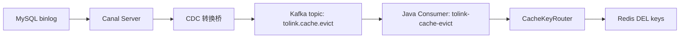

# ToLink Service Canal / CDC 缓存补偿部署文档

> **文档状态：** 待部署验证
> **项目名称**：ToLink Service
> **模块名称**：缓存一致性改造（二期）
> **关联技术文档**：[technical_design.md](/Users/fang/Developer/Projects/toLink/toLink-Service/docs/模块开发文档/缓存一致性改造/二期/technical_design.md)
> **关联公共契约**：[middleware_contract.md](/Users/fang/Developer/Projects/toLink/toLink-Service/docs/组件和数据库约定/middleware_contract.md)
> **最后更新时间：** 2026-05-06

---

## 1. 文档目标

本文档用于指导后续部署 `MySQL binlog -> Canal -> CDC 转换桥 -> Kafka -> Java 缓存补偿消费者 -> Redis 删除` 链路。

本链路只承担“写库后的二次删缓存补偿”，不替代主请求中的同步删缓存。Java 主链路已经在写库成功后调用 `CacheConsistencyService` 同步删除 Redis；Canal / CDC 的职责是在 binlog 变更到达后再次删除同一批 key，降低同步删除失败、网络抖动、并发回填导致的脏缓存风险。

---

## 2. 职责边界

| 组件 | 职责 | 不负责 |
| :--- | :--- | :--- |
| MySQL | 开启 binlog，提供业务表变更事实 | 不生成 Java 可消费的缓存补偿消息 |
| Canal Server | 订阅 MySQL binlog，输出 row change event | 不理解 ToLink 的 Redis key 路由 |
| CDC 转换桥 | 将 Canal row change event 转换为 `tolink.cache.evict` 扁平 JSON | 不直接删除 Redis |
| Kafka | 承载缓存补偿事件 topic | 不保证业务幂等语义 |
| Java Consumer | 消费 `tolink.cache.evict`，调用统一 key router 删除缓存 | 不重建缓存，不修改数据库 |
| Redis | 存放可回源缓存 | 不作为真实数据源 |

关键结论：

- **必须存在 CDC 转换桥**。Canal 原始事件不能直接投递给 Java 当前消费者。
- Java 侧当前只接收项目约定的扁平 JSON 消息，入口为 `CacheCompensationKafkaReceiver`。
- 二次删除必须幂等，重复事件只会重复删除 Redis key，不应产生业务副作用。

---

## 3. 链路架构



Java 消费端处理路径：

```text
CacheCompensationKafkaReceiver
    -> CacheCompensationMQ.parseMsg
    -> CacheCompensationMQReceiver
    -> CacheConsistencyService.evictCompensation
    -> CacheKeyRouter.route
    -> Redis DEL
```

---

## 4. 部署前提

### 4.1 MySQL 前提

MySQL 需要开启 row 格式 binlog：

```ini
[mysqld]
server-id=1
log-bin=mysql-bin
binlog_format=ROW
binlog_row_image=FULL
```

检查命令：

```sql
SHOW VARIABLES LIKE 'log_bin';
SHOW VARIABLES LIKE 'binlog_format';
SHOW VARIABLES LIKE 'binlog_row_image';
SHOW MASTER STATUS;
```

期望结果：

- `log_bin = ON`
- `binlog_format = ROW`
- `binlog_row_image = FULL`
- `SHOW MASTER STATUS` 能看到当前 binlog 文件和 position

### 4.2 Canal 用户权限

建议单独创建 Canal 只读复制用户：

```sql
CREATE USER 'canal'@'%' IDENTIFIED BY 'change-me';
GRANT SELECT, REPLICATION SLAVE, REPLICATION CLIENT ON *.* TO 'canal'@'%';
FLUSH PRIVILEGES;
```

安全要求：

- 生产环境密码必须由运维密钥管理，不写入仓库。
- Canal 用户只授予订阅 binlog 所需权限，不授予写权限。

### 4.3 Kafka 前提

Kafka 需要存在缓存补偿 topic：

```text
tolink.cache.evict
```

建议 topic 参数：

| 参数 | 建议值 | 说明 |
| :--- | :--- | :--- |
| partitions | `1` 起步 | 当前事件量较小；后续可按吞吐扩展 |
| replicas | `1`/`3` | 本地或开发环境可为 1，生产建议 3 |
| cleanup.policy | `delete` | 普通事件流 |
| retention.ms | `604800000` | 默认保留 7 天，可按运维策略调整 |

创建示例：

```bash
kafka-topics.sh \
  --bootstrap-server <kafka-bootstrap> \
  --create \
  --topic tolink.cache.evict \
  --partitions 1 \
  --replication-factor 1
```

---

## 5. Java 侧配置

### 5.1 MQ 厂商配置

当前 Kafka 消费器通过 MQ 厂商开关启用。应用配置需确保：

```yaml
qingluopay:
  mq:
    vendor: kafka
    vender: kafka
```

说明：

- 历史配置中同时存在 `vendor` / `vender` 两种写法，部署时建议两者都配置为 `kafka`，避免环境差异导致消费者未装配。
- 若使用 RabbitMQ，本部署文档不适用当前 Kafka 消费端，需要另行补 RabbitMQ 接收器。

### 5.2 Kafka 连接配置

示例：

```yaml
spring:
  kafka:
    bootstrap-servers: <kafka-bootstrap>
    consumer:
      auto-offset-reset: latest
      enable-auto-commit: false
```

缓存补偿消费组：

```yaml
tolink:
  cache-consistency:
    consumer:
      group-id: tolink-cache-evict
```

### 5.3 缓存一致性配置

同步删除预算仍由 Redis 组件配置控制。测试环境如需临时放行同步删失败，可以配置：

```yaml
tolink:
  cache-consistency:
    sync-delete-required: false
```

生产建议：

- `sync-delete-required` 保持默认严格模式。
- Canal / CDC 只作为二次补偿，不作为主请求成功的唯一保障。

---

## 6. CDC 转换桥消息契约

CDC 转换桥必须把 Canal row change event 转换为如下扁平 JSON，并投递到 Kafka topic `tolink.cache.evict`。

### 6.1 消息字段

| 字段 | 必填 | 示例 | 说明 |
| :--- | :--- | :--- | :--- |
| `event_id` | 是 | `mysql-bin.000001:123456:llm_user_config:10001:update` | 事件唯一标识，用于日志追踪和人工排障 |
| `cache_target` | 是 | `llm_config` | 逻辑缓存目标，必须匹配 `CacheEvictTarget` |
| `route_id` | 是 | `10001` | 路由主键，交给 `CacheKeyRouter` 生成 Redis key |
| `source_table` | 否 | `llm_user_config` | 来源表名 |
| `operation_type` | 是 | `UPDATE` | `INSERT` / `UPDATE` / `DELETE` |
| `trace_id` | 否 | `canal-xxx` | 链路追踪 ID |
| `occurred_at` | 是 | `2026-05-06T19:30:00+08:00` | 事件发生时间 |

Java 侧最小校验字段：

- `event_id`
- `cache_target`
- `route_id`
- `operation_type`
- `occurred_at`

### 6.2 支持的 cache_target

| cache_target | route_id | 实际删除 key | 典型来源表 |
| :--- | :--- | :--- | :--- |
| `user` | `userId` | `user:info:{userId}`、`user:role:{userId}` | `sys_user` |
| `user_info` | `userId` | `user:info:{userId}` | `sys_user` |
| `user_role` | `userId` | `user:role:{userId}` | `sys_user` |
| `llm_config` | `configId` | `llm:cfg:{configId}` | `llm_user_config` |
| `user_default_llm_config` | `userId` | `llm:u_def:{userId}` | `llm_user_config` |
| `system_provider` | `providerType` | `llm:pvd:{providerType}` | `llm_system_provider` |

### 6.3 消息示例

用户配置详情缓存删除：

```json
{
  "event_id": "mysql-bin.000001:123456:llm_user_config:10001:update",
  "cache_target": "llm_config",
  "route_id": "10001",
  "source_table": "llm_user_config",
  "operation_type": "UPDATE",
  "trace_id": "canal-20260506-0001",
  "occurred_at": "2026-05-06T19:30:00+08:00"
}
```

用户默认配置映射缓存删除：

```json
{
  "event_id": "mysql-bin.000001:123457:llm_user_config:10000:update-default",
  "cache_target": "user_default_llm_config",
  "route_id": "10000",
  "source_table": "llm_user_config",
  "operation_type": "UPDATE",
  "trace_id": "canal-20260506-0002",
  "occurred_at": "2026-05-06T19:30:01+08:00"
}
```

系统厂商缓存删除：

```json
{
  "event_id": "mysql-bin.000001:123458:llm_system_provider:openai:update",
  "cache_target": "system_provider",
  "route_id": "openai",
  "source_table": "llm_system_provider",
  "operation_type": "UPDATE",
  "trace_id": "canal-20260506-0003",
  "occurred_at": "2026-05-06T19:30:02+08:00"
}
```

---

## 7. 表到缓存事件映射

### 7.1 `sys_user`

| 变更类型 | cache_target | route_id 来源 | 说明 |
| :--- | :--- | :--- | :--- |
| `INSERT` | 通常不发 | 无 | 新用户首次读取通常无旧缓存 |
| `UPDATE` | `user` | `id` | 用户基础信息和角色可能同时变化，联合删除 |
| `DELETE` | `user` | `id` | 删除用户相关缓存 |

### 7.2 `llm_system_provider`

| 变更类型 | cache_target | route_id 来源 | 说明 |
| :--- | :--- | :--- | :--- |
| `INSERT` | `system_provider` | `provider_type` | 防止已有空值缓存 |
| `UPDATE` | `system_provider` | `provider_type` | 厂商名称、URL、模型能力、启用状态变化均删除 |
| `DELETE` | `system_provider` | `provider_type` | 删除厂商详情缓存 |

注意：

- 如果 `provider_type` 被更新，CDC 转换桥应同时对旧值和新值各发一条 `system_provider` 删除事件。

### 7.3 `llm_user_config`

| 变更类型 | 事件 1 | 事件 2 | route_id 来源 | 说明 |
| :--- | :--- | :--- | :--- | :--- |
| `INSERT` | `llm_config` | `user_default_llm_config` | `id` / `user_id` | 防止空值缓存和默认映射旧值 |
| `UPDATE` | `llm_config` | `user_default_llm_config` | `id` / `user_id` | 配置详情或默认状态变化都需要删除 |
| `DELETE` | `llm_config` | `user_default_llm_config` | `id` / `user_id` | 删除详情缓存和默认映射缓存 |

注意：

- `llm:u_def:{userId}` 当前缓存用户能力默认映射，任何可能影响默认配置结果的 `llm_user_config` 变化都建议删除。
- 如果 `user_id` 被更新，CDC 转换桥应同时对旧 `user_id` 和新 `user_id` 各发一条 `user_default_llm_config` 删除事件。当前业务不建议更新配置归属用户。

---

## 8. Canal 部署步骤

### 8.1 部署 Canal Server

示例目录：

```text
canal/
├── conf/
│   ├── canal.properties
│   └── tolink/
│       └── instance.properties
└── logs/
```

`canal.properties` 关键配置示例：

```properties
canal.serverMode=tcp
canal.destinations=tolink
canal.instance.global.spring.xml=classpath:spring/default-instance.xml
```

`conf/tolink/instance.properties` 示例：

```properties
canal.instance.master.address=<mysql-host>:3306
canal.instance.dbUsername=canal
canal.instance.dbPassword=<canal-password>
canal.instance.connectionCharset=UTF-8
canal.instance.defaultDatabaseName=tolink_rag_db
canal.instance.filter.regex=tolink_rag_db\\.sys_user,tolink_rag_db\\.llm_system_provider,tolink_rag_db\\.llm_user_config
canal.instance.filter.black.regex=
```

启动：

```bash
bin/startup.sh
tail -f logs/canal/canal.log
tail -f logs/tolink/tolink.log
```

### 8.2 部署 CDC 转换桥

转换桥可以是独立 Java / Python / Go 进程，最低职责：

1. 连接 Canal destination `tolink`。
2. 读取 row change event。
3. 根据 `database.table`、`eventType`、before/after 字段生成一条或多条 `tolink.cache.evict` 消息。
4. 投递 Kafka。
5. 记录成功与失败日志，失败时具备重试或死信留档能力。

伪代码：

```text
for event in canal.poll():
    if event.table == "sys_user":
        send(cache_target="user", route_id=event.row.id)

    if event.table == "llm_system_provider":
        send(cache_target="system_provider", route_id=event.row.provider_type)
        if provider_type changed:
            send(cache_target="system_provider", route_id=event.before.provider_type)

    if event.table == "llm_user_config":
        send(cache_target="llm_config", route_id=event.row.id)
        send(cache_target="user_default_llm_config", route_id=event.row.user_id)
        if user_id changed:
            send(cache_target="user_default_llm_config", route_id=event.before.user_id)
```

### 8.3 启动 Java 服务

确认配置：

```yaml
qingluopay:
  mq:
    vendor: kafka
    vender: kafka

tolink:
  cache-consistency:
    consumer:
      group-id: tolink-cache-evict
```

启动后检查日志：

```text
Subscribed to topic(s): tolink.cache.evict
groupId=tolink-cache-evict
```

---

## 9. 验证清单

### 9.1 Kafka 消息直投验证

先绕过 Canal，直接投递合法消息验证 Java 消费端：

```bash
kafka-console-producer.sh \
  --bootstrap-server <kafka-bootstrap> \
  --topic tolink.cache.evict
```

输入：

```json
{"event_id":"manual-001","cache_target":"llm_config","route_id":"10001","source_table":"llm_user_config","operation_type":"UPDATE","trace_id":"manual","occurred_at":"2026-05-06T19:30:00+08:00"}
```

期望：

- Java 日志出现“收到缓存补偿 MQ 消息”。
- Redis 中 `llm:cfg:10001` 被删除。
- 重复发送同一消息不会报错，不产生业务副作用。

### 9.2 Canal 到 Kafka 验证

步骤：

1. 在 Redis 手动写入测试 key，例如 `llm:cfg:10001`。
2. 修改 `llm_user_config.id = 10001` 的测试记录。
3. 检查 CDC 转换桥日志是否生成 `llm_config` 事件。
4. 检查 Kafka topic 是否收到消息。
5. 检查 Java 消费端是否删除 Redis key。

示例 SQL：

```sql
UPDATE llm_user_config
SET priority = priority + 1
WHERE id = 10001;
```

### 9.3 默认配置映射验证

步骤：

1. 手动写入或触发生成 `llm:u_def:{userId}`。
2. 修改该用户某条 `llm_user_config.is_default`。
3. CDC 转换桥应发出 `user_default_llm_config` 事件。
4. Java 消费后应删除 `llm:u_def:{userId}`。
5. 下次读取默认配置时从 MySQL 回源并重新写入缓存。

### 9.4 系统厂商验证

步骤：

1. 手动写入或触发生成 `llm:pvd:{providerType}`。
2. 修改 `llm_system_provider.supported_models` 或 `is_active`。
3. CDC 转换桥应发出 `system_provider` 事件。
4. Java 消费后应删除 `llm:pvd:{providerType}`。

---

## 10. 监控与告警

建议至少监控：

| 指标 | 告警建议 | 说明 |
| :--- | :--- | :--- |
| Canal 延迟 | 持续超过 30 秒告警 | binlog 到 Canal 消费延迟 |
| CDC 转换桥失败数 | 连续失败或失败率超过阈值告警 | 消息转换或 Kafka 投递失败 |
| Kafka consumer lag | 持续增长告警 | Java 消费端堆积 |
| Java 消费异常日志 | 出现非法 payload 或未知 `cache_target` 告警 | 契约不一致 |
| Redis 删除失败 | 连续失败告警 | Redis 不可用或网络异常 |

日志建议包含：

- `event_id`
- `cache_target`
- `route_id`
- `source_table`
- `operation_type`
- `trace_id`
- Kafka partition / offset

---

## 11. 回滚方案

### 11.1 停止补偿链路

如果 Canal / CDC 转换桥异常导致错误删除或消息风暴：

1. 停止 CDC 转换桥。
2. 保留 Java 主请求同步删缓存。
3. 观察 Redis 和业务接口是否恢复稳定。
4. 定位转换规则或表映射问题后再恢复。

### 11.2 暂停 Java 消费

如果只需要暂停 Java 侧消费：

- 临时关闭 Kafka consumer 所在服务实例，或
- 将 `qingluopay.mq.vendor` / `qingluopay.mq.vender` 调整为非 Kafka 并重启，或
- 在 Kafka 层暂停/隔离 `tolink-cache-evict` 消费组。

注意：

- 暂停 Java 消费期间，主链路同步删缓存仍然生效。
- Kafka topic 中积压的旧补偿事件恢复消费后可能批量删除缓存，这是可接受的，但会造成短时间回源增加。

### 11.3 清理缓存兜底

若发生契约错误或历史脏缓存无法准确定位，可以按业务域批量清理相关 Redis key：

```text
user:info:*
user:role:*
llm:cfg:*
llm:u_def:*
llm:pvd:*
```

生产环境批量删除必须走运维审批，优先使用 scan + 分批删除，避免阻塞 Redis。

---

## 12. 常见问题

### 12.1 Canal 已启动，但 Java 没有消费日志

检查顺序：

1. Kafka topic `tolink.cache.evict` 是否存在。
2. CDC 转换桥是否真的把 Canal 事件投递到 Kafka。
3. Java 配置 `qingluopay.mq.vendor` / `qingluopay.mq.vender` 是否为 `kafka`。
4. Java 日志是否订阅 `tolink.cache.evict`。
5. 消息体是否为 Java 约定的扁平 JSON，而不是 Canal 原始 JSON。

### 12.2 Java 消费报 `Unknown cache target`

原因：

- `cache_target` 不在 `CacheEvictTarget` 枚举中。

处理：

- 检查 CDC 转换桥表映射。
- 当前允许值包括：`user`、`user_info`、`user_role`、`llm_config`、`user_default_llm_config`、`system_provider`。

### 12.3 修改默认配置后仍读到旧默认

检查顺序：

1. 主请求是否写库成功后同步删除了 `llm:u_def:{userId}`。
2. CDC 转换桥是否针对 `llm_user_config` 发出了 `user_default_llm_config` 事件。
3. `route_id` 是否为 `user_id`，不是 `configId`。
4. Redis 中旧 `llm:u_def:{userId}` 是否仍存在。

### 12.4 为什么不直接让 Canal 删除 Redis

原因：

- Redis key 路由是 Java 项目公共契约，集中在 `CacheKeyRouter`。
- Canal 侧直接删除 Redis 会复制一套 key 规则，后续 key 改动容易分叉。
- 当前设计让 Canal / CDC 只发逻辑事件，由 Java 统一路由和删除，便于演进和审计。

---

## 13. 部署验收结论模板

部署完成后按以下格式记录：

| 检查项 | 结果 | 证据 |
| :--- | :--- | :--- |
| MySQL binlog 已开启 ROW/FULL | 待填写 | `SHOW VARIABLES` 截图或输出 |
| Canal 已订阅目标表 | 待填写 | Canal 日志 |
| CDC 转换桥能生成扁平 JSON | 待填写 | 转换桥日志 / Kafka 消息 |
| Kafka topic 可消费 | 待填写 | `kafka-console-consumer` 输出 |
| Java 消费组已启动 | 待填写 | Java 启动日志 |
| `llm:cfg:{configId}` 可被补偿删除 | 待填写 | Redis 前后对比 |
| `llm:u_def:{userId}` 可被补偿删除 | 待填写 | Redis 前后对比 |
| `llm:pvd:{providerType}` 可被补偿删除 | 待填写 | Redis 前后对比 |

最终结论：

```text
Canal / CDC 缓存补偿链路：通过 / 不通过 / 有条件通过
遗留问题：
下一步动作：
```
