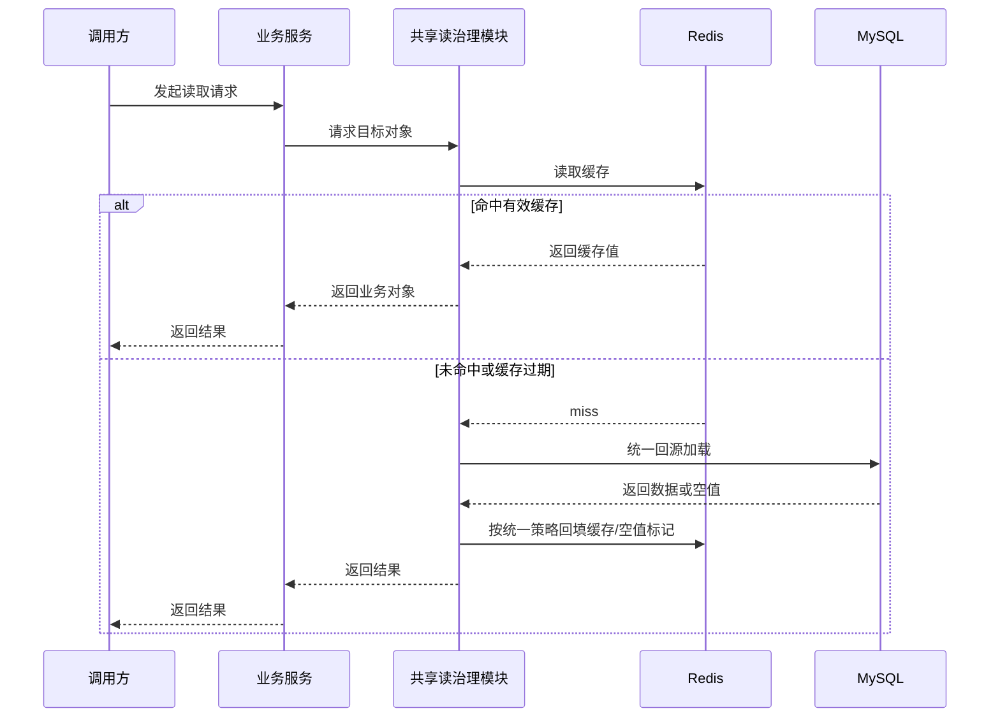
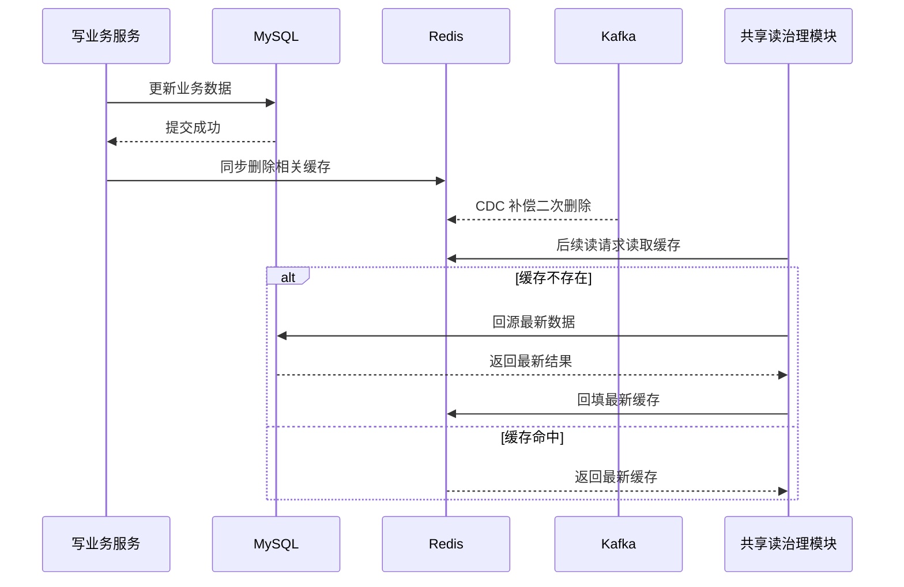

# ToLink Service 缓存一致性改造二期 PRD

> **文档状态：** 需求待审核
> **项目名称：** ToLink Service
> **模块名称：** 缓存一致性改造（二期）
> **分支名称：** refactor/cache-consistency-cdc
> **产品负责人：** Fang / Codex
> **最后更新时间：** 2026-05-06

---

## 1. 文档修订记录 (Change Log)

| 版本号 | 修改日期 | 修改内容简述 | 提出人 | 审核人 |
| :--- | :--- | :--- | :--- | :--- |
| v1.0 | 2026-05-06 | 初始化缓存一致性改造二期 PRD，锁定共享读治理模块与 `provider` / `llm-config` 读链路接入范围 | Fang / Codex | Fang |

---

## 2. 需求背景与业务目标 (Overview)

### 2.1 业务概览与核心逻辑 (Business Overview)

- **业务定位：** 二期是一期缓存一致性框架的业务接入与能力补全阶段，重点不是新增写侧范式，而是将缓存读治理能力从 `user` 单点实践沉淀为项目级共享模块，并推广到 `provider` 与 `llm-config`。
- **核心逻辑主线：** 读请求优先访问 Redis，命中则直接返回；未命中时通过统一读保护模块执行回源合并、空值判定和缓存回填；写请求继续沿用一期“写库成功后同步删缓存 + CDC/MQ 二次删除补偿”的一致性主链路，保证读写闭环收敛。
- **核心价值：** 降低 `provider` 与 `llm-config` 读高峰下的 DB 直压风险，统一处理缓存穿透、击穿、雪崩问题，并把这些能力沉淀为后续业务可直接复用的共享模块，避免每个业务域重复实现一套读缓存防护逻辑。

### 2.2 核心节点目标与验收准则 (Key Milestones)

| 核心功能节点 | 预期达成目标 | 关键验收点 (DoD) |
| :--- | :--- | :--- |
| 共享读治理模块 | 项目内形成统一复用的缓存读保护模块 | 空值缓存、回源合并、TTL 抖动、key 回填、owner service 接入口径可由多业务复用 |
| `provider` 读链路接入 | 系统厂商读取场景接入缓存治理 | 厂商查询优先走缓存，未命中按统一规则回源并回填 `llm:pvd:{providerType}` |
| `llm-config` 读链路接入 | 用户配置读取场景接入缓存治理 | 配置详情、默认配置等读取场景优先走缓存，未命中按统一规则回源并回填 |
| 穿透/击穿/雪崩治理抽象 | 非功能能力从单业务实现提升为共享能力 | 不再只在 `user` 域有效，首批至少支持 `provider` 与 `llm-config` |
| Canal 部署说明 | 为后续生产部署提供清晰文档 | 文档说明 Canal 角色、部署前置条件、与现有 Kafka 契约的衔接方式及验收检查点 |

---

## 3. 核心架构与业务流程 (Architecture & Flow)

### 3.1 核心业务时序图 (Sequence Diagrams)

#### 场景 1：读请求缓存命中与未命中回源



#### 场景 2：写侧驱逐后读侧收敛



### 3.2 状态机定义 (State Machine)

| 当前状态 | 触发动作/条件 | 流转后状态 | 备注/逆向逻辑 |
| :--- | :--- | :--- | :--- |
| 缓存命中 | 读请求到达 | 直接返回 | 不触发 DB 回源 |
| 缓存未命中 | 共享模块判定需回源 | 回源加载中 | 需要合并同 key 并发请求 |
| 回源返回真实数据 | 统一回填完成 | 已缓存 | 进入正常热数据状态 |
| 回源返回空结果 | 写入空值缓存 | 空值保护中 | 用于防止持续穿透 |
| 写请求提交成功 | 同步删除缓存 | 待重新回填 | 后续由读请求回源重建或由补偿确保清理 |

### 3.3 二期范围拆解

| 目标域 | 本期要求 | 明确不做 |
| :--- | :--- | :--- |
| `provider` | 完成系统厂商读取场景缓存接入和 owner service 闭环 | 不新增新的厂商业务模型 |
| `llm-config` | 完成用户配置详情、默认配置等读场景缓存接入和 owner service 闭环 | 不新增新的配置业务语义 |
| 共享模块 | 提供项目级可复用读治理能力 | 不把所有历史缓存一次性全部迁移 |
| Canal 文档 | 输出部署与验收说明 | 不执行实际部署、压测和生产割接 |

---

## 4. 功能规格与交互逻辑 (Functional Specs)

### 4.1 页面交互与功能示意 (UI & Functionality)

- 二期不新增用户可见页面，也不改变现有管理端接口的对外业务语义。
- 二期改造重点在服务端读取路径、缓存对象回填规则和中间件配套文档。
- 对前端和调用方的直接影响仅限于读取结果延迟与稳定性改善，不引入新的调用参数或页面交互步骤。

### 4.2 接口契约规范

| 维度 | 要求与标准 | 备注 |
| :--- | :--- | :--- |
| 读路径入口 | 业务读取必须优先通过共享缓存读治理能力接入 | 不允许 `provider`、`llm-config` 继续各自散落实现缓存读逻辑 |
| owner service 职责 | 每类缓存对象必须有明确 owner service 负责 key、回源、回填与失效边界 | 避免 key 规则与加载逻辑分散在多个 service |
| 空值缓存 | 对允许返回空的业务对象建立统一空值保护规则 | 防止恶意或高频 miss 持续打到 DB |
| 并发合并 | 同一 key 并发 miss 需按统一口径合并回源 | 防止热点 key 击穿 |
| TTL 策略 | 统一支持基础 TTL + 抖动策略 | 防止同批 key 同时过期形成雪崩 |
| Canal 文档契约 | 文档需说明消息来源、投递关系和验收方式 | 供后续部署人员按文档执行 |

### 4.3 核心业务逻辑 (按模块拆分)

#### 模块 A：共享缓存读治理模块

- **业务逻辑概述：** 该模块负责把缓存穿透、击穿、雪崩等治理能力从单业务实现提升为公共能力，向业务 service 提供统一缓存读取、统一回源和统一回填的复用入口。
- **核心处理规则：** 共享模块必须支持真实对象缓存、空值缓存、同 key 并发回源合并、TTL 抖动和 key 回填规则，不要求业务方重复手写防护逻辑。
- **数据持久化规格：** 本模块不新增业务主数据对象，但会约束缓存对象、空值标记和 key 生命周期的统一行为。
- **并发与一致性：** 当相同 key 的缓存 miss 并发出现时，只允许一个请求承担主回源职责，其余请求复用结果或等待统一返回。
- **异常流与降级：** 当 Redis 不可用或缓存回填失败时，业务仍可直接回源 DB 返回结果，但必须保留可观测性，不能静默吞掉读治理失效。

#### 模块 B：`provider` 读链路治理

- **业务逻辑概述：** 系统厂商配置属于高频读取、低频修改、可回源对象，适合接入统一缓存读治理模块。
- **核心处理规则：** 厂商读取必须以 `providerType` 为稳定缓存主键口径，避免再次出现按 `id` 与按 `providerType` 混用的路由分裂。
- **数据持久化规格：** 本期需求层只锁定“厂商对象可回源并可回填到 Redis”，不提前约束具体序列化实现。
- **并发与一致性：** 写侧继续沿用一期同步删缓存与补偿删除策略，读侧保证 miss 时回源的是最新数据库事实。
- **异常流与降级：** 若查询到厂商不存在或已失效，需明确是否进入空值缓存保护，避免无效查询持续打库。

#### 模块 C：`llm-config` 读链路治理

- **业务逻辑概述：** 用户 LLM 配置和默认配置是典型的用户态高频读取对象，需要统一纳入缓存读治理范围。
- **核心处理规则：** 配置详情缓存和默认配置缓存需由同一业务域下的 owner service 统一管理，避免详情 key、默认 key、用户维度 key 分散在不同代码入口。
- **数据持久化规格：** 二期只锁定对象级缓存模型，不在需求阶段细化为字段级缓存结构。
- **并发与一致性：** 当配置更新、删除、启停或默认项切换后，后续读请求必须能通过删缓存 + 回源重建获得最新结果。
- **异常流与降级：** 若用户默认配置不存在、配置被删除或不可用，需支持空值保护或明确的未配置返回口径。

#### 模块 D：Canal 部署说明文档

- **业务逻辑概述：** 该文档是二期的交付物之一，用于指导后续把数据库变更事实稳定投递到现有 Kafka 缓存补偿链路。
- **核心处理规则：** 文档必须说明 Canal 在整条缓存一致性链路中的职责边界、部署前置条件、关键配置项类别、消息流向和联调检查点。
- **数据持久化规格：** 文档说明应围绕现有数据库、Kafka 和缓存补偿 topic 契约展开，不要求在本期落地新的数据库对象。
- **并发与一致性：** 文档需明确生产部署后如何验证重复投递、顺序偏差和消费补偿不会破坏删缓存幂等性。
- **异常流与降级：** 文档需说明 Canal 不可用时系统仍依赖同步删缓存主链路运行，但会损失异步补偿兜底能力。

---

## 5. 数据契约与存储约束 (Data & Storage)

### 5.1 数据模型与实体关系 (E-R)

```text
provider / llm-config 读请求
    -> 共享缓存读治理模块
        -> Redis 目标 key
        -> MySQL 回源结果
        -> Redis 回填或空值标记

provider / llm-config 写请求
    -> MySQL 主数据变更
    -> Redis 同步删缓存
    -> Kafka 缓存补偿删除
```

### 5.2 数据库组件与表结构变更 (Database & Schema Changes)

**涉及存储组件清单：**

- [x] MySQL（读回源事实来源）
- [x] Redis（缓存对象、空值标记、TTL 生命周期承载）
- [x] Kafka（沿用一期缓存补偿事件链路）
- [x] Canal（作为后续 CDC 部署方案文档对象）
- [ ] OSS
- [ ] Elasticsearch

**MySQL 变更**

| 库名 / 表名 | 变更类型 | 核心字段说明 / 变更详情 | 备注要求 |
| :--- | :--- | :--- | :--- |
| `llm_system_provider` | 复用 | 作为 `provider` 缓存回源事实来源 | 二期不以改表为目标 |
| `llm_user_config` | 复用 | 作为用户 LLM 配置缓存回源事实来源 | 二期不以改表为目标 |

**Redis 变更**

| Key 名 | 变更类型 | 核心字段说明 / 变更详情 | 备注要求 |
| :--- | :--- | :--- | :--- |
| `llm:pvd:{providerType}` | 复用 | 系统厂商缓存 key | 二期接入统一读治理 |
| `llm:cfg:{configId}` | 复用 | 用户配置详情缓存 key | 二期接入统一读治理 |
| `llm:u_def:{userId}` | 复用 | 用户默认配置缓存 key | 二期接入统一读治理 |
| 空值保护 key | 新增规则 | 用于承载 `provider` / `llm-config` 空值缓存标记 | 具体命名在技术设计中明确 |

**Kafka / Canal 变更**

| Topic / 组件 | 变更类型 | 核心字段说明 / 变更详情 | 备注要求 |
| :--- | :--- | :--- | :--- |
| `tolink.cache.evict` | 复用 | 继续承载缓存补偿删除事件 | 二期只补 Canal 接入说明，不扩展新语义 |
| Canal 部署文档 | 新增交付物 | 描述 DB Binlog 到 Kafka 的部署与联调说明 | 文档交付，不执行部署 |

### 5.3 缓存与持久化策略

- 二期缓存策略仍以“缓存失效后按需回源重建”为主，不采用主动预热或异步写缓存。
- 共享模块必须允许业务对象定义基础 TTL，并统一叠加抖动策略，降低批量同时过期风险。
- 对允许返回空的 `provider` / `llm-config` 查询结果，需要有统一空值缓存策略，防止反复回源。
- 同一业务对象的缓存 key 生成与回填入口必须稳定，避免同一对象被多处重复写入不同 key。

---

## 6. 异常处理与非功能性需求 (Exceptions & NFR)

### 6.1 稳定性与降级策略 (Reliability & Fallback)

- Redis 读取失败、回填失败或共享模块异常时，业务读请求应允许直接回源 DB 返回结果，但必须有日志与告警边界。
- 对热点 key 的并发 miss，系统必须具备统一合并回源能力，避免瞬时 DB 放大。
- 对不存在对象的重复读取，系统必须具备空值保护能力，避免缓存穿透。
- 对批量 key 生命周期集中到期的场景，系统必须具备 TTL 抖动能力，降低缓存雪崩风险。

### 6.2 性能与扩展性要求 (Performance & Scalability)

- 共享缓存读治理模块需支持后续更多业务域接入，不能仅为 `provider` 或 `llm-config` 写死专用模式。
- `provider` 与 `llm-config` 接入后，不应显著增加常规缓存命中路径的响应开销。
- 通用读治理能力应允许不同业务对象定义各自 TTL、空值策略和回源函数，但对外接入模式保持统一。

### 6.3 可观测性、安全与合规 (Security & Observability)

- 需要记录缓存命中、空值命中、回源次数、回源合并次数和回填失败情况，便于评估读治理效果。
- `llm-config` 相关日志和缓存对象处理不得泄露 API Key 明文或其他敏感配置内容。
- Canal 文档需明确部署后应关注的日志、topic、消费组和关键校验点，便于后续运维接手。

### 6.4 数据埋点与运营要求

- 需要能够区分 `provider` 与 `llm-config` 两类业务对象的缓存命中与回源表现。
- 需要保留一期写侧补偿链路与二期读侧回源链路的联合观测能力，便于判断删缓存后重建是否稳定。

---

## 7. 遗留问题与依赖项 (Dependencies & Open Issues)

- 需要在技术设计中明确共享读治理模块是基于现有 `CacheReadProtectionService` 演进，还是补一层更清晰的 owner/service 模板抽象。
- 需要在技术设计中明确 `provider` 与 `llm-config` 首批具体接入哪些查询入口，尤其是列表、详情、默认配置等边界。
- 需要在技术设计中明确空值缓存 key、TTL、序列化边界和失效时机。
- 需要在技术设计中明确 Canal 文档落到哪个目录、覆盖哪些部署参数类别和联调检查点。
- 本期不包含真实 Canal 部署，因此 DB -> Canal -> Kafka 生产链路仍需后续专项联调验证。
