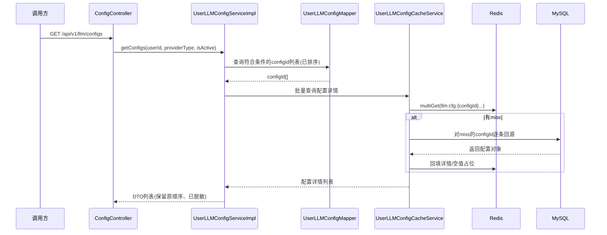
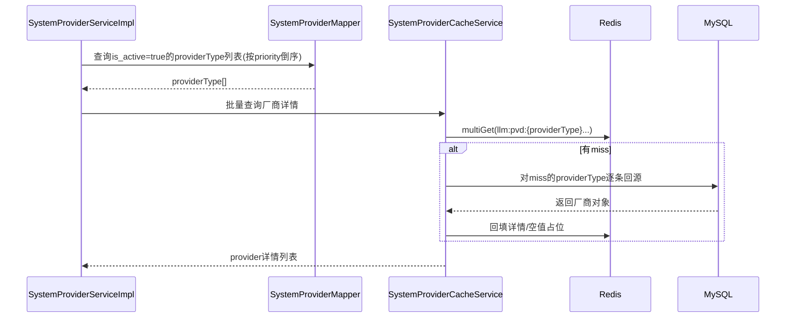

# ToLink Service 缓存一致性改造二期技术实现文档

> **文档状态：** 技术方案待审核
> **项目名称**：ToLink Service
> **模块名称**：缓存一致性改造（二期）
> **需求文档**：[requirement.md](/Users/fang/Developer/Projects/toLink/toLink-Service/docs/模块开发文档/缓存一致性改造/二期/requirement.md)
> **分支名称**：refactor/cache-consistency-cdc
> **技术负责人：** Fang / Codex
> **最后更新时间：** 2026-05-06

---

## 1. 文档修订记录 (Change Log)

| 版本号 | 修改日期 | 修改内容简述 | 修改人 | 审核人 |
| :--- | :--- | :--- | :--- | :--- |
| v1.0 | 2026-05-06 | 初始化二期技术方案，锁定复用既有读保护能力、`provider`/`llm-config` 读链路接入方式与 Canal 文档交付边界 | Fang / Codex | Fang |

---

## 2. 技术目标与实现范围 (Overview)

### 2.1 技术目标与核心思路 (Technical Goals)

- **技术目标：**
  - 直接复用现有 [CacheReadProtectionService.java](/Users/fang/Developer/Projects/toLink/toLink-Service/link-components/toLink-components-redis/src/main/java/com/qingluo/link/components/redis/service/CacheReadProtectionService.java) 作为单条查询读治理底层能力，继续承载空值缓存、单 key 回源合并、TTL 抖动。
  - 为 `provider` 与 `llm-config` 建立业务级 cache owner service，统一管理 key、TTL、读写转换、回源和驱逐入口。
  - 将用户侧列表查询明确落为“`MySQL` 负责条件过滤与排序，`Redis` 负责批量补详情”的聚合模式，避免在二期引入列表缓存或 Redis 集合索引。
  - 补齐 [canal_deployment.md](/Users/fang/Developer/Projects/toLink/toLink-Service/docs/模块开发文档/缓存一致性改造/二期/canal_deployment.md) 的部署说明文档，为后续生产部署 `DB -> Canal -> Kafka -> CacheEvict` 链路提供交付物。
- **设计原则：**
  - `MySQL` 仍是真实数据源，`Redis` 只承担高频、可回源对象缓存。
  - 列表查询不缓存整份列表，也不把 Redis 当作具备完整条件查询能力的数据库使用。
  - 单条查询防护能力已经由 `CacheReadProtectionService` 提供，二期不重构这套框架，只补业务侧规范接入。
  - 写侧继续沿用一期“写库成功后同步删缓存 + Kafka 二次删除补偿”，二期不改写主一致性范式。
  - 新增查询逻辑尽量复用现有接口和异常体系，不新增本期不必要的 API 与错误码。
- **成功标准：**
  - `provider` 单项详情、`llm-config` 单项详情、默认配置都能通过统一读治理模块完成读取与回填。
  - `provider` 可用厂商列表、用户配置列表采用“DB 查轻量结果 + Redis 批量补详情”的方式组装返回。
  - `provider` 与 `llm-config` 的 cache owner service 成为后续新增缓存业务的可复用范式。
  - Canal 文档覆盖职责边界、部署前提、Kafka 对接点与验收检查项。

### 2.2 实现范围与边界 (In Scope / Out of Scope)

**必须实现：**

- 为 `provider` 和 `llm-config` 新增业务 cache owner service。
- 直接复用 `CacheReadProtectionService`，在业务 cache owner service 中统一接入空值缓存、回源合并、TTL 抖动。
- 改造 `SystemProviderServiceImpl#getActiveProviders` 与 `UserLLMConfigServiceImpl#getConfigs` / `getDefaultConfig` 的读路径。
- 为列表查询增加“批量补详情”的聚合模式，不走串行逐条 Redis round trip。
- 输出 Canal 部署说明文档。

**暂不实现：**

- 不新增列表缓存 key。
- 不新增 Redis 索引集合 key。
- 不新增或改造用户侧新的 HTTP 接口，只改造当前已有 Service/Controller 读链路。
- 不执行真实 Canal 部署、压测、生产割接。
- 不在二期把所有历史缓存业务统一迁移。

### 2.3 验收项到实现点映射 (Requirement Mapping)

| 需求验收项 | 技术实现点 | 测试方式 | 责任模块 |
| :--- | :--- | :--- | :--- |
| 共享读治理能力复用 | 复用 `CacheReadProtectionService`，在业务 cache owner service 中统一接入 | 组件单测 / 业务单测 | `link-components/toLink-components-redis` / `link-service` |
| `provider` 读链路接入 | `SystemProviderCacheService` + `SystemProviderServiceImpl` 读路径改造 | Service 单测 / 集成测试 | `link-service` |
| `llm-config` 读链路接入 | `UserLLMConfigCacheService` + `UserLLMConfigServiceImpl` 读路径改造 | Service 单测 / 集成测试 | `link-service` |
| 列表查询展示全部结果 | `MySQL` 查主键/排序 + `Redis` 批量补详情聚合 | Service 单测 / API 集成测试 | `link-service` / `link-api` |
| 三项防护能力复用 | 空值缓存、回源合并、TTL 抖动由现有共享组件统一承载，业务侧只做接入 | 组件单测 / 业务回归测试 | `link-components-redis` / `link-service` |
| Canal 文档交付 | 新增 `canal_deployment.md` | 文档审阅 | `docs/模块开发文档/缓存一致性改造/二期` |

---

## 3. 当前系统分析与复用基础 (Current-State Analysis)

### 3.1 相关模块盘点

| 模块 | 当前职责 | 现状说明 | 是否修改 |
| :--- | :--- | :--- | :--- |
| `link-api` | Controller / API 入口 | [ConfigController.java](/Users/fang/Developer/Projects/toLink/toLink-Service/link-api/src/main/java/com/qingluo/link/api/controller/ConfigController.java) 已暴露用户配置列表接口；当前仓库未提供用户侧厂商列表 HTTP 入口 | 可能 |
| `link-service` | 业务服务 | [SystemProviderServiceImpl.java](/Users/fang/Developer/Projects/toLink/toLink-Service/link-service/src/main/java/com/qingluo/link/service/impl/SystemProviderServiceImpl.java) 与 [UserLLMConfigServiceImpl.java](/Users/fang/Developer/Projects/toLink/toLink-Service/link-service/src/main/java/com/qingluo/link/service/impl/UserLLMConfigServiceImpl.java) 仍主要直查 MySQL | 是 |
| `link-model` | Entity / DTO / Enum | 现有 `SystemProvider`、`UserLLMConfig`、`UserLLMConfigDTO` 足够复用，本期不以新增模型为主 | 否 |
| `link-mapper` | Mapper / 持久化 | 当前 `SystemProviderMapper`、`UserLLMConfigMapper` 只提供 `BaseMapper` 能力，列表轻量查询仍使用 `LambdaQueryWrapper`，与项目 MySQL 约定存在历史债务 | 是 |
| `link-core` | 异常 / 工具 / 上下文 | `AuthContext`、`NotFoundException`、`ApiKeyEncryptService` 继续复用 | 否 |
| `link-components` | Redis / MQ 复用组件 | 一期已落地 [CacheConsistencyService.java](/Users/fang/Developer/Projects/toLink/toLink-Service/link-components/toLink-components-redis/src/main/java/com/qingluo/link/components/redis/service/CacheConsistencyService.java) 与 [CacheReadProtectionService.java](/Users/fang/Developer/Projects/toLink/toLink-Service/link-components/toLink-components-redis/src/main/java/com/qingluo/link/components/redis/service/CacheReadProtectionService.java) | 是 |

### 3.2 已复用能力 (Reusable Components)

- Redis 契约与组件说明：
  - [middleware_contract.md](/Users/fang/Developer/Projects/toLink/toLink-Service/docs/组件和数据库约定/middleware_contract.md)
  - [redis_component.md](/Users/fang/Developer/Projects/toLink/toLink-Service/docs/组件和数据库约定/middleware-components/redis_component.md)
- 一期一致性能力：
  - [CacheConsistencyService.java](/Users/fang/Developer/Projects/toLink/toLink-Service/link-components/toLink-components-redis/src/main/java/com/qingluo/link/components/redis/service/CacheConsistencyService.java)
  - [CacheEvictTarget.java](/Users/fang/Developer/Projects/toLink/toLink-Service/link-components/toLink-components-redis/src/main/java/com/qingluo/link/components/redis/service/CacheEvictTarget.java)
  - [CacheReadProtectionService.java](/Users/fang/Developer/Projects/toLink/toLink-Service/link-components/toLink-components-redis/src/main/java/com/qingluo/link/components/redis/service/CacheReadProtectionService.java)
- 现有业务缓存封装：
  - [UserCacheServiceImpl.java](/Users/fang/Developer/Projects/toLink/toLink-Service/link-service/src/main/java/com/qingluo/link/service/cache/UserCacheServiceImpl.java)
- 现有写路径驱逐入口：
  - [AdminProviderServiceImpl.java](/Users/fang/Developer/Projects/toLink/toLink-Service/link-service/src/main/java/com/qingluo/link/service/impl/AdminProviderServiceImpl.java)
  - [UserLLMConfigServiceImpl.java](/Users/fang/Developer/Projects/toLink/toLink-Service/link-service/src/main/java/com/qingluo/link/service/impl/UserLLMConfigServiceImpl.java)

### 3.3 已参考代码 (Code References)

| 文件/模块 | 参考点 | 对方案的影响 |
| :--- | :--- | :--- |
| [CacheReadProtectionService.java](/Users/fang/Developer/Projects/toLink/toLink-Service/link-components/toLink-components-redis/src/main/java/com/qingluo/link/components/redis/service/CacheReadProtectionService.java) | 已具备空值缓存、回源合并、TTL 抖动基础实现 | 二期直接复用，不做框架级重构 |
| [UserCacheServiceImpl.java](/Users/fang/Developer/Projects/toLink/toLink-Service/link-service/src/main/java/com/qingluo/link/service/cache/UserCacheServiceImpl.java) | 已验证业务 cache service 封装模式可行 | `provider` / `llm-config` 沿用同类 cache owner/service 模式 |
| [SystemProviderServiceImpl.java](/Users/fang/Developer/Projects/toLink/toLink-Service/link-service/src/main/java/com/qingluo/link/service/impl/SystemProviderServiceImpl.java) | 当前 `getActiveProviders`、`getByProviderType` 全走 `LambdaQueryWrapper` 查库 | 需要拆分列表聚合和单项缓存加载职责 |
| [UserLLMConfigServiceImpl.java](/Users/fang/Developer/Projects/toLink/toLink-Service/link-service/src/main/java/com/qingluo/link/service/impl/UserLLMConfigServiceImpl.java) | 当前 `getConfigs`、`getDefaultConfig` 全走 DB，写侧已具备驱逐入口 | 适合接入“列表轻量查 + Redis 批量补详情”模式 |
| [ConfigController.java](/Users/fang/Developer/Projects/toLink/toLink-Service/link-api/src/main/java/com/qingluo/link/api/controller/ConfigController.java) | 当前唯一明确对外暴露的用户配置读取接口 | 二期 API 兼容性以“不改接口语义”为前提 |
| [SystemProviderService.java](/Users/fang/Developer/Projects/toLink/toLink-Service/link-service/src/main/java/com/qingluo/link/service/SystemProviderService.java) | 已有 `getActiveProviders()`、`getByProviderType()` 服务入口 | 无需新增 provider HTTP 接口也能先沉淀服务层方案 |

### 3.4 现有问题与约束 (Constraints)

- Redis 单项详情 key 已存在，但当前缺少“按列表场景批量补详情”的业务接入方式。
- 当前仓库不存在用户侧可用厂商列表 HTTP 入口，二期技术方案以服务层能力先落地，后续新增接口时直接复用。
- `middleware_contract.md` 明确新查询不应继续扩大 `LambdaQueryWrapper` 使用范围，因此二期若新增主键轻量查询，应回到 XML Mapper 方案。
- `llm-config` 涉及 `apiKeyMasked` 等脱敏逻辑，Redis 中缓存对象与对外返回 DTO 的转换边界必须保持清晰，不能把敏感字段处理散落到 Controller。
- 本期只做 Java 侧与文档侧交付，Canal 仍是后续部署对象，不能在方案中伪装成已完成生产接入。

---

## 4. 核心架构与实现方案 (Architecture & Solution)

### 4.1 总体设计思路 (Architecture Overview)

二期把缓存读链路拆成两层：

1. **单对象缓存层**  
   由业务 cache owner service 负责维护 key、TTL、对象序列化、单条回源与驱逐。  
   底层直接复用现有 `CacheReadProtectionService`：
   - 空值缓存
   - 单 key 回源并发合并
   - TTL 抖动
   二期不重构这套底层能力，只新增 `provider` 与 `llm-config` 的业务接入封装。

2. **列表聚合层**  
   列表查询不直接缓存整份列表，也不维护 Redis 集合索引。  
   统一采用：
   - `MySQL` 负责按业务条件查轻量结果与排序
   - `Redis` 负责批量补详情
   - `Java` 负责聚合并按原始顺序返回  
   这既保留 MySQL 的过滤和排序能力，也避免 Redis 侧为多条件查询引入额外索引维护成本。

### 4.2 目标调用链路 (Call Flow)

```text
ConfigController -> UserLLMConfigServiceImpl
    -> UserLLMConfigMapper(XML: 查询ID列表/默认ID)
    -> UserLLMConfigCacheService(批量取详情/单条回源)
    -> DTO 聚合返回

SystemProviderServiceImpl
    -> SystemProviderMapper(XML: 查询启用providerType列表)
    -> SystemProviderCacheService(批量取详情/单条回源)
    -> List<SystemProvider> 返回
```

### 4.3 核心模块职责划分 (Module Responsibilities)

| 模块/类 | 职责 | 输入/输出边界 |
| :--- | :--- | :--- |
| `CacheReadProtectionService` | 复用现有底层共享防护能力 | 输入单 key、TTL、loader；输出对象或空结果 |
| `SystemProviderCacheService` | 封装 `llm:pvd:{providerType}` 详情缓存、批量读取、单条回源 | 输入 `providerType` 列表；输出 `SystemProvider` 列表或 map |
| `UserLLMConfigCacheService` | 封装 `llm:cfg:{configId}`、`llm:u_def:{userId}` 缓存 | 输入 `configId` / `userId`；输出 `UserLLMConfig` |
| `SystemProviderServiceImpl` | 用户侧可用厂商读聚合 | 输入业务条件；输出排序后的厂商列表 |
| `UserLLMConfigServiceImpl` | 用户配置列表与默认配置读聚合 | 输入 `userId`、筛选条件；输出脱敏 DTO 列表或默认 DTO |
| `SystemProviderMapper.xml` | 查询启用厂商主键集合与排序 | 输入筛选条件；输出 `providerType` 列表 |
| `UserLLMConfigMapper.xml` | 查询配置 ID 列表、默认配置 ID | 输入 `userId`、筛选条件；输出 `configId` 或单个默认 `configId` |

### 4.4 核心时序图 (Sequence Diagrams)

#### 场景 1：用户配置列表查询



#### 场景 2：可用厂商列表查询



---

## 5. 接口契约与交互方案 (API Contract)

### 5.1 接口清单

| 方法 | 路径 | 说明 | 权限 |
| :--- | :--- | :--- | :--- |
| GET | `/api/v1/llm/configs` | 查询当前用户自己的配置列表；二期只改内部读链路 | 登录用户 |
| GET | `Service: SystemProviderService#getActiveProviders` | 查询用户侧可用厂商列表的服务层入口；当前未直接暴露 HTTP 接口 | 服务内调用 |
| GET | `Service: UserLLMConfigService#getDefaultConfig` | 查询当前用户默认配置；当前为服务层入口 | 服务内调用 |

### 5.2 请求参数

| 参数 | 位置 | 类型 | 必填 | 说明 |
| :--- | :--- | :--- | :--- | :--- |
| `providerType` | query | `String` | 否 | 厂商类型过滤 |
| `isActive` | query | `Boolean` | 否 | 配置启用状态过滤 |
| `userId` | context | `Long` | 是 | 从登录态获取当前用户 |

### 5.3 响应结构

#### `GET /api/v1/llm/configs`

成功响应结构保持不变：

```json
{
  "code": 200,
  "message": "success",
  "data": [
    {
      "id": 101,
      "configName": "OpenAI Main",
      "providerType": "openai",
      "providerName": "OpenAI",
      "modelName": "gpt-4o-mini",
      "apiKeyMasked": "sk-****",
      "priority": 100,
      "isActive": true,
      "isDefault": true
    }
  ]
}
```

#### `SystemProviderService#getActiveProviders`

- 无新增对外响应结构。
- 若后续新增用户侧 HTTP 入口，直接复用 `List<SystemProvider>` 的现有业务字段，不在本期新增 DTO。

### 5.4 异常响应

| 场景 | HTTP 状态 | 业务错误码 | message |
| :--- | :--- | :--- | :--- |
| 查询默认配置但不存在 | 404 | 复用现有 | `用户配置不存在` |
| 根据 `providerType` 查询厂商不存在 | 404 | 复用现有 | `厂商不存在` |
| Redis 读取/回填异常 | 200/500 | 不新增公开错误码 | 对读请求默认降级回源，不向前端暴露 Redis 细节 |

### 5.5 异常类与错误码定义

#### 异常类设计

| 异常类 | 继承关系 | 使用场景 | 说明 |
| :--- | :--- | :--- | :--- |
| `NotFoundException` | 现有异常体系 | 默认配置不存在、厂商不存在 | 继续复用 |
| `BusinessException` | 现有异常体系 | 若后续需要包装批量聚合场景的业务校验失败 | 本期默认不新增 |

#### 错误码定义

| 错误码 | 枚举名/常量名 | HTTP 状态 | 触发场景 | 前端提示策略 |
| :--- | :--- | :--- | :--- | :--- |
| 复用现有 | 复用现有 | 404 | 默认配置不存在、厂商不存在 | 沿用现有前端提示 |

说明：

- 二期不新增错误码，继续复用现有 `NotFoundException` 与统一返回结构。
- Redis 组件侧故障默认作为内部降级处理，不把缓存组件细节透传给调用方。

### 5.6 兼容性说明

- 是否兼容旧接口：是。
- 是否需要过渡期：否。
- 前端影响点：无接口结构变化，仅性能和稳定性改善。

---

## 6. 数据契约与存储设计 (Data & Storage)

### 6.1 数据模型与实体关系 (E-R)

```text
用户配置列表查询
    -> MySQL 按 userId/providerType/isActive 查询 configId 列表
    -> Redis 按 llm:cfg:{configId} 批量补详情
    -> Java 转 DTO 并返回

可用厂商列表查询
    -> MySQL 查询启用中的 providerType 列表
    -> Redis 按 llm:pvd:{providerType} 批量补详情
    -> Java 聚合返回
```

### 6.2 数据库组件与结构变更 (Database & Schema Changes)

#### MySQL 变更

| 表名 | 变更类型 | 变更说明 | 备注 |
| :--- | :--- | :--- | :--- |
| `llm_system_provider` | 无结构变更 | 新增 XML 轻量查询入口 | 不改表 |
| `llm_user_config` | 无结构变更 | 新增 XML 轻量查询入口 | 不改表 |

### 6.3 字段设计

- 本期不涉及新增表字段。
- 技术变更集中在查询入口、缓存对象管理与文档交付。

### 6.4 索引与约束

- 不新增数据库索引。
- 查询仍依赖现有表上的业务字段筛选能力。
- 若后续发现 `userId + providerType + isActive` 查询性能不足，再单独评估索引调整，不在本期一并扩大范围。

### 6.5 中间件与其他存储设计

| 组件 | 存储内容 | Key/Path 规则 | 备注 |
| :--- | :--- | :--- | :--- |
| Redis | 系统厂商详情 | `llm:pvd:{providerType}` | TTL 在二期技术实现中明确 |
| Redis | 用户配置详情 | `llm:cfg:{configId}` | TTL 在二期技术实现中明确 |
| Redis | 用户默认配置 | `llm:u_def:{userId}` | 继续沿用一期 key |
| Redis | 空值占位 | 复用原 key 写入 `NULL_MARKER` | 不新增独立空值 key |
| Kafka | 缓存补偿删除 | `tolink.cache.evict` | 继续沿用一期 topic |
| Canal 文档 | 部署说明文档 | `docs/模块开发文档/缓存一致性改造/二期/canal_deployment.md` | 文档交付，非运行态组件 |

### 6.6 数据迁移与回滚

* **是否需要迁移：** 不涉及 DB 结构迁移；涉及缓存读路径切换。
* **迁移策略：** 复用现有 `CacheReadProtectionService`，新增业务 cache owner service 后，再逐步切换 `SystemProviderServiceImpl` 和 `UserLLMConfigServiceImpl` 的读入口。
* **回滚策略：** 若读缓存逻辑异常，可回退到直接查库实现；Redis 中已有 key 不需额外数据迁移脚本。

---

## 7. 核心实现逻辑 (Core Implementation)

### 7.1 Service / Component 设计

```java
public interface CacheOwnerService<ID, T> {

    String buildKey(ID id);

    T get(ID id);

    T getOrLoad(ID id);

    Map<ID, T> batchGetOrLoad(List<ID> ids);

    void evict(ID id);
}
```

说明：

- 最终类名未必必须叫 `CacheOwnerService`，但职责必须收敛到这个层级。
- 这只是业务接入层职责示意，不代表二期要重构 Redis framework。
- 业务 service 不再直接散落写 `RedisTemplate`，统一依赖业务 cache owner service。

### 7.2 核心方法职责

| 方法 | 职责 | 输入 | 输出 |
| :--- | :--- | :--- | :--- |
| `SystemProviderCacheService#getOrLoad` | 读取单个厂商详情 | `providerType` | `SystemProvider` |
| `SystemProviderCacheService#batchGetOrLoad` | 批量补齐厂商详情 | `List<String>` | `Map<String, SystemProvider>` |
| `UserLLMConfigCacheService#getOrLoad` | 读取单个配置详情 | `configId` | `UserLLMConfig` |
| `UserLLMConfigCacheService#getDefaultOrLoad` | 读取默认配置 | `userId` | `UserLLMConfig` |
| `UserLLMConfigCacheService#batchGetOrLoad` | 批量补齐配置详情 | `List<Long>` | `Map<Long, UserLLMConfig>` |
| `SystemProviderServiceImpl#getActiveProviders` | 查主键并组装启用厂商列表 | 无 | `List<SystemProvider>` |
| `UserLLMConfigServiceImpl#getConfigs` | 查 ID 列表并组装用户配置列表 | `userId/providerType/isActive` | `List<UserLLMConfigDTO>` |

### 7.3 关键处理流程

1. 列表查询先走 Mapper XML 只查主键/排序字段，不在这一步拉全量详情对象。
2. cache owner service 对详情 key 做 `multiGet`，把命中的对象直接转为结果 map。
3. 对 miss 的对象按单条查询能力逐个 `getOrLoad`，让空值缓存、回源合并、TTL 抖动统一生效。
4. 业务 service 按原始 ID 顺序重排并聚合返回，确保列表顺序与 MySQL 结果一致。
5. `llm-config` 最终出参在 service 层统一做脱敏 DTO 转换，不把 DTO 缓存在 Redis。

### 7.4 并发、幂等与一致性

- **并发控制：** 单对象 miss 时继续由 `CacheReadProtectionService` 的 `ReentrantLock` 机制合并同 key 回源。
- **幂等策略：** 读路径无额外写副作用；重复回填同一详情 key 可视为允许行为。
- **事务边界：** 写侧事务边界不变，继续由业务更新 MySQL 后调用 `CacheConsistencyService` 驱逐详情 key 和默认配置 key。
- **跨组件一致性：** 读侧遵循“删缓存后按需回源重建”的最终一致性策略；列表查询自身不维护额外缓存状态。

---

## 8. 组件集成与配置方案 (Integration Design)

| 组件 | 用途 | 配置项 | 失败处理 |
| :--- | :--- | :--- | :--- |
| Redis | 单对象详情缓存、空值占位、TTL 抖动 | 复用 `CacheConsistencyProperties` 的空值 TTL、抖动、等待参数 | 读失败默认回源 DB |
| MySQL | 条件过滤、主键列表、miss 回源 | 新增 Mapper XML 查询方法 | 查询失败直接透出业务异常 |
| Kafka | 写侧补偿删缓存 | 复用 `tolink.cache.evict` | 二期不新增消息语义 |
| Canal 文档 | 后续部署说明 | 文档中列配置分类而非具体生产值 | 文档缺失不影响本地运行，但影响后续部署交付 |

---

## 9. 权限、安全与审计设计 (Security)

### 9.1 认证与授权

| 操作 | 权限要求 | 校验位置 |
| :--- | :--- | :--- |
| 查询当前用户配置列表 | 登录用户且只能查自己的配置 | `ConfigController` + `AuthContext` |
| 查询用户默认配置 | 登录用户且只能查自己的配置 | service 内按 `userId` 过滤 |
| 查询可用厂商列表 | 仅返回启用中的厂商 | `SystemProviderServiceImpl` 读取时固定 `isActive=true` |

### 9.2 敏感数据处理

- **敏感字段：** `apiKey`、潜在自定义配置中的密钥类字段。
- **脱敏策略：** Redis 中缓存实体仍存储加密后的 `apiKey`，对外输出时继续通过 [ApiKeyEncryptService.java](/Users/fang/Developer/Projects/toLink/toLink-Service/link-core/src/main/java/com/qingluo/link/core/util/ApiKeyEncryptService.java) 转换 `apiKeyMasked`。
- **日志策略：** cache owner service 和聚合读日志中不得打印原始 `apiKey` 或完整 `extraConfig`。

### 9.3 审计要求

- 记录缓存命中、miss、空值命中、批量补详情 miss 数量等指标，便于评估读治理效果。
- Canal 部署文档中需列出部署后应重点观察的 topic、消费组和 Redis 删除日志。

---

## 10. 异常处理与降级策略 (Exceptions & Fallback)

| 异常场景 | 处理方式 | 错误码 | 用户提示 | 是否重试 |
| :--- | :--- | :--- | :--- | :--- |
| Redis 读取失败 | 记录日志并直接回源 DB | 不新增 | 不向用户暴露缓存细节 | 否 |
| Redis 批量读取部分 miss | 对 miss 部分逐条回源并回填 | 不新增 | 无感知 | 否 |
| 回源查询对象不存在 | 写入空值占位并返回空/NotFound | 复用现有 | 沿用现有提示 | 否 |
| 默认配置不存在 | 复用 `NotFoundException.userConfigNotFound()` | 复用现有 | 沿用现有提示 | 否 |
| Canal 未部署 | 写侧仍靠同步删缓存运行，文档中标记补偿兜底缺失 | 不适用 | 不影响本地读接口 | 否 |

---

## 11. 测试与验证方案 (Test Plan)

### 11.1 单元测试

| 测试类 | 覆盖内容 |
| :--- | :--- |
| `CacheReadProtectionServiceTest` | 空值缓存、回源合并、TTL 抖动 |
| `SystemProviderCacheServiceTest` | 单项厂商缓存、批量补详情、空值场景 |
| `UserLLMConfigCacheServiceTest` | 配置详情缓存、默认配置缓存、批量补详情 |
| `SystemProviderServiceImplTest` | 启用厂商列表的聚合读顺序与过滤 |
| `UserLLMConfigServiceImplTest` | 用户配置列表聚合、默认配置读取与脱敏 |

### 11.2 集成测试

| 测试类 | 覆盖接口/流程 |
| :--- | :--- |
| `ConfigControllerTest` | `GET /api/v1/llm/configs` 在命中、miss、过滤条件下的返回一致性 |
| `CacheConsistencyKafkaFlowTest` | 写侧驱逐后读侧回源重建不回退到旧值 |

### 11.3 回归测试

| 回归点 | 验证方式 |
| :--- | :--- |
| `provider` 写链路同步删缓存 | 复用一期测试用例回归 |
| `llm-config` 写链路同步删缓存 | 复用一期测试用例回归 |
| 用户缓存既有逻辑 | `UserCacheServiceImpl` 相关测试回归 |
| 敏感字段脱敏 | 配置列表/默认配置读返回中不暴露明文 `apiKey` |

### 11.4 发布与验收建议

- 实现完成后同步补齐：
  - [implementation_report.md](/Users/fang/Developer/Projects/toLink/toLink-Service/docs/模块开发文档/缓存一致性改造/二期/implementation_report.md)
  - [testing_delivery.md](/Users/fang/Developer/Projects/toLink/toLink-Service/docs/模块开发文档/缓存一致性改造/二期/testing_delivery.md)
  - [canal_deployment.md](/Users/fang/Developer/Projects/toLink/toLink-Service/docs/模块开发文档/缓存一致性改造/二期/canal_deployment.md)
- 进入实现前需同步评审以下事项：
  - 共享抽象最终类名与包结构
  - Mapper XML 轻量查询方法命名
  - `provider` / `llm-config` 的 TTL 取值
  - 是否需要补用户侧可用厂商 HTTP 入口
