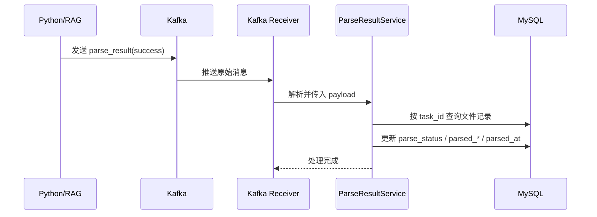
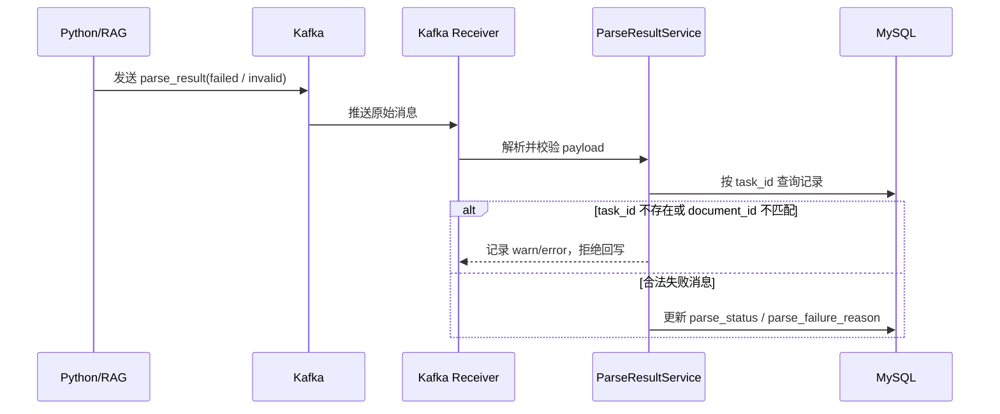

# LLM 与 Java MQ 对接 技术实现文档

> **文档状态：** 草稿  
> **项目名称**：ToLink Service  
> **模块名称**：LLM 与 Java MQ 对接  
> **需求文档**：[2026-04-21-LLM与Java-MQ对接需求分析.md](/Users/fang/Developer/Projects/toLink/toLink-Service/docs/需求与技术文档/文件上传模块/2026-04-21-LLM与Java-MQ对接需求分析.md)  
> **分支名称**：[toLink-Service]  
> **技术负责人：** Fang  
> **最后更新时间：** 2026-04-21

---

## 1. 文档修订记录 (Change Log)

| 版本号 | 修改日期 | 修改内容简述 | 修改人 | 审核人 |
| :--- | :--- | :--- | :--- | :--- |
| v1.0 | 2026-04-21 | 初始版本创建，明确一期仅补 `parse_result` 消费与回写，保持现有 MQ 组件和业务包结构 | Codex | [待补充] |

---

## 2. 技术目标与范围 (Overview)

### 2.1 技术目标 (Technical Goals)

* **核心目标：**
  - 在现有 `parse_task` 发送能力基础上，补齐 `parse_result` 的 Java 消费与状态回写闭环。
  - 实现方式必须对齐当前代码结构：MQ 抽象放在 `link-components`，业务消费与回写逻辑放在 `link-service`。
  - 一期只支持 Kafka 联调与验收，不扩展 `cache_sync`、`usage_report`。

* **成功标准：**
  - Java 能消费 `tolink.rag.parse_result`。
  - 消费成功后能按 `task_id + document_id` 正确回写 `document_original_file`。
  - 幂等、乱序、校验失败场景都有明确代码行为和测试覆盖。

### 2.2 实现范围 (In Scope / Out of Scope)

**必须实现：**

- 复用现有 `AbstractMQ` / `MQSend` / Kafka MQ 组件结构。
- 新增 `parse_result` 消息模型。
- 新增 Kafka 结果消息消费者。
- 新增解析结果回写服务逻辑。
- 为成功回写、失败回写、幂等忽略、校验失败补测试。

**暂不实现：**

- 不新增 `cache_sync` 消息实现。
- 不新增 `usage_report` 消息实现。
- 不引入 RabbitMQ 结果消费实现。
- 不新增独立解析任务表。
- 不新增管理端补偿入口或补偿任务调度。

### 2.3 验收项到实现点映射

| 需求验收项 | 技术实现点 | 测试方式 | 责任模块 |
| :--- | :--- | :--- | :--- |
| Java 消费 `parse_result` | Kafka consumer + 业务 receiver | Service/集成测试 | `link-service` / `link-components` |
| 成功回写解析结果 | 回写 `parsed_*`、`parsed_at`、成功状态 | Mapper/Service 测试 | `link-service` / `link-model` |
| 失败回写解析状态 | 回写 `parse_failure_reason`、失败状态 | Mapper/Service 测试 | `link-service` |
| `task_id` 幂等控制 | 按 `parse_task_id` 查询和状态判断 | 单元测试 | `link-service` |
| 成功不被失败覆盖 | 已成功时忽略后续失败消息 | 单元测试 | `link-service` |

---

## 3. 当前系统分析 (Current-State Analysis)

### 3.1 相关模块盘点

| 模块 | 当前职责 | 现状说明 | 是否修改 |
| :--- | :--- | :--- | :--- |
| `link-api` | Controller / API 入口 | 当前不负责 MQ 消费，不需要新增对外接口 | 否 |
| `link-service` | 业务服务 | 已有 `KnowledgeFileServiceImpl` 负责 `parse_task` 发送，但无 `parse_result` 消费闭环 | 是 |
| `link-model` | Entity / DTO / Enum | `KnowledgeOriginalFile` 已有 `parse_task_id`、`parse_status`、`parsed_*` 字段，可直接复用 | 可能小改 |
| `link-mapper` | Mapper / 持久化 | 已有 `KnowledgeOriginalFileMapper`，支持直接按条件查询/更新 | 否 |
| `link-core` | 通用配置 / 异常 / 工具 | `BusinessException` 可复用 | 否 |
| `link-components` | 可复用基础组件 | 已有 Kafka/RabbitMQ MQ 抽象与自动配置，但无业务结果消息 listener | 是，按现有模式扩展 |

### 3.2 已复用能力

- `AbstractMQ`：统一消息模型接口
- `MQSend`：统一消息发送接口
- `MQMsgReceiver`：框架侧接收器接口
- `KafkaMQAutoConfiguration`：Kafka vendor 自动装配
- `MQProperties`：扫描包与 topic 自动创建配置
- `KnowledgeOriginalFile`：已具备解析状态和结果字段
- `KnowledgeOriginalFileMapper`：可直接用于按 `parse_task_id` 查询和更新
- `BusinessException`：统一业务异常

### 3.3 已参考代码

| 文件/模块 | 参考点 | 对方案的影响 |
| :--- | :--- | :--- |
| [KnowledgeFileServiceImpl.java](/Users/fang/Developer/Projects/toLink/toLink-Service/link-service/src/main/java/com/qingluo/link/service/impl/KnowledgeFileServiceImpl.java) | 已有 `parse_task` 发送逻辑与内部 MQ 模型定义 | `parse_result` 设计应保持同级业务归属，不拆到新模块 |
| [KnowledgeOriginalFile.java](/Users/fang/Developer/Projects/toLink/toLink-Service/link-model/src/main/java/com/qingluo/link/model/dto/entity/KnowledgeOriginalFile.java) | 已有解析结果字段 | 一期不新增表，直接回写现有字段 |
| [MQProperties.java](/Users/fang/Developer/Projects/toLink/toLink-Service/link-components/toLink-components-mq/src/main/java/com/qingluo/link/components/mq/MQProperties.java) | MQ 扫描与 vendor 配置入口 | 新消息模型应继续走 `scan-base-packages` 扫描 |
| [KafkaMQAutoConfiguration.java](/Users/fang/Developer/Projects/toLink/toLink-Service/link-components/toLink-components-mq/src/main/java/com/qingluo/link/components/mq/vender/kafka/KafkaMQAutoConfiguration.java) | Kafka topic 自动创建策略 | `parse_result` topic 可沿用自动创建能力 |
| [MQVenderChoose.java](/Users/fang/Developer/Projects/toLink/toLink-Service/link-components/toLink-components-mq/src/main/java/com/qingluo/link/components/mq/MQVenderChoose.java) | Kafka/RabbitMQ vendor 选择常量 | 一期仍通过 `qingluopay.mq.vender=kafka` 激活 |
| [application-local.yml](/Users/fang/Developer/Projects/toLink/toLink-Service/link-api/src/main/resources/application-local.yml) | 当前启用 Kafka | 技术方案以 Kafka 为实际运行基线 |

### 3.4 现有问题与约束

- 当前只有 `parse_task` 发送，没有 `parse_result` 消费端。
- 项目内尚未形成统一的业务级 Kafka listener 模式，需要在现有 MQ 抽象基础上补齐。
- 当前 `KnowledgeFileServiceImpl` 内部 `KnowledgeParseTaskMQ` 为私有内部类，仅适合发送场景，不适合作为双向消息公共模型。
- 一期必须保持现有包结构风格，不做大规模重构。
- 一期 Kafka 为唯一验收基线，因此消费端优先落 Kafka，不在本轮补 RabbitMQ。

---

## 4. 总体方案设计 (Architecture & Solution)

### 4.1 总体设计思路

本方案采用“保留现有发送实现 + 增加结果消息模型 + 增加 Kafka 业务消费者 + 增加回写服务”的最小闭环改造策略。

边界约定如下：

- MQ 基础抽象和 vendor 自动配置仍放在 `link-components/toLink-components-mq`。
- 业务消息模型、业务 receiver、状态回写逻辑放在 `link-service`。
- 不在 `link-api` 增加新的 controller，因为本期是内部 MQ 链路，不是外部 API 功能。
- 结果回写不新增表，直接更新 `document_original_file`。

### 4.2 目标调用链路

```text
Python/RAG -> Kafka(tolink.rag.parse_result) -> Kafka Listener -> MQ Receiver -> ParseResultService -> KnowledgeOriginalFileMapper -> MySQL
```

### 4.3 核心模块职责划分

| 模块/类 | 职责 | 输入/输出边界 |
| :--- | :--- | :--- |
| `KnowledgeParseResultMQ` | 定义 `parse_result` 消息模型、解析与序列化规则 | 输入 JSON，输出 payload |
| `KnowledgeParseResultKafkaReceiver` | 订阅 Kafka topic，接收原始消息并转交业务 receiver | 输入 MQ 字符串消息 |
| `KnowledgeParseResultMQ.MQReceiver` | 业务接收回调接口 | 输入 payload |
| `KnowledgeParseResultConsumer` | 业务消费实现，负责校验和回写状态 | 输入 payload，输出无 |
| `KnowledgeParseResultService` | 封装状态回写规则、幂等和乱序处理 | 输入 payload，输出更新结果 |
| `KnowledgeOriginalFileMapper` | 查询和更新原文件记录 | 输入 `parse_task_id` / `id` |

### 4.4 包结构设计

为保持与现有代码结构一致，建议新增类分布如下：

```text
link-service/src/main/java/com/qingluo/link/service/mq/
  KnowledgeParseResultMQ.java

link-service/src/main/java/com/qingluo/link/service/mq/kafka/
  KnowledgeParseResultKafkaReceiver.java

link-service/src/main/java/com/qingluo/link/service/impl/
  KnowledgeParseResultConsumer.java
  KnowledgeParseResultServiceImpl.java

link-service/src/main/java/com/qingluo/link/service/
  KnowledgeParseResultService.java
```

说明：

- `service/mq/`：放业务 MQ 消息模型，避免继续把消息模型写成 `KnowledgeFileServiceImpl` 的内部类。
- `service/mq/kafka/`：放 Kafka listener，和 vendor 相关，但仍归业务模块管理。
- `service/impl/`：放业务 receiver 实现和回写 service 实现，保持与项目现有 `*ServiceImpl` 风格一致。

### 4.5 核心时序图

#### 场景 1：Python/RAG 回传成功结果


#### 场景 2：收到失败或无效结果消息


---

## 5. API 设计 (API Contract)

### 5.1 接口清单

本期不新增对外 HTTP API。

| 方法 | 路径 | 说明 | 权限 |
| :--- | :--- | :--- | :--- |
| - | - | 无新增对外接口 | - |

### 5.2 请求参数

无新增对外 HTTP 请求参数。

### 5.3 响应结构

无新增对外 HTTP 响应结构。

### 5.4 异常响应

无新增对外 HTTP 异常响应。本期异常主要体现在内部 MQ 消费日志和状态更新行为上。

### 5.5 兼容性说明

- 是否兼容旧接口：兼容，现有文件上传、查询接口不需要改动
- 是否需要过渡期：不需要
- 前端影响点：前端无需改接口，但文件状态会在 MQ 回写后出现更完整的成功/失败结果

---

## 6. 数据与存储设计 (Data & Storage)

### 6.1 数据模型关系

- `document_original_file` 作为原文件主记录，同时承担解析结果快照存储。
- `parse_result` 消息不单独落表，只作为异步输入。

### 6.2 数据库变更清单

#### MySQL 变更

| 表名 | 变更类型 | 变更说明 | 备注 |
| :--- | :--- | :--- | :--- |
| `document_original_file` | 无 | 一期直接复用现有字段，不新增表结构 | 当前字段已满足 |

### 6.3 字段设计

本期直接复用已有字段：

| 表 | 字段 | 类型 | 是否必填 | 默认值 | 说明 |
| :--- | :--- | :--- | :--- | :--- | :--- |
| `document_original_file` | `parse_task_id` | varchar(36) | 是 | 无 | 作为主幂等键 |
| `document_original_file` | `parse_status` | varchar(16) | 是 | `not_started` | 解析状态 |
| `document_original_file` | `is_parse_success` | boolean | 是 | `false` | 是否解析成功 |
| `document_original_file` | `parsed_bucket_name` | varchar | 否 | null | 解析结果 bucket |
| `document_original_file` | `parsed_object_key` | varchar | 否 | null | 解析结果对象路径 |
| `document_original_file` | `parsed_file_url` | varchar | 否 | null | 解析结果访问地址 |
| `document_original_file` | `parsed_at` | datetime | 否 | null | 成功回写时间 |
| `document_original_file` | `parse_failure_reason` | varchar(512) | 否 | null | 解析失败原因 |

### 6.4 索引与约束

- 继续使用现有唯一索引：`uk_document_original_parse_task_id(parse_task_id)`
- 不新增额外索引
- 通过唯一索引保证按 `task_id` 精确定位记录

### 6.5 对象存储 / 缓存 / 其他存储设计

| 组件 | 存储内容 | Key/Path 规则 | 备注 |
| :--- | :--- | :--- | :--- |
| MinIO | 解析结果对象 | 由 Python/RAG 写入 `rag-parsed` 或后续约定 bucket | Java 只保存地址信息 |
| Kafka | `parse_result` 异步消息 | topic=`tolink.rag.parse_result` | 一期联调基线 |

### 6.6 数据迁移与回滚

* **是否需要迁移：** 不需要  
* **迁移策略：** 无表结构调整  
* **回滚策略：** 代码回滚后不影响现有数据结构  

---

## 7. 核心实现设计 (Core Implementation)

### 7.1 Service 接口设计

```java
public interface KnowledgeParseResultService {

    void handleParseResult(KnowledgeParseResultMQ.MsgPayload payload);
}
```

### 7.2 核心方法职责

| 方法 | 职责 | 输入 | 输出 |
| :--- | :--- | :--- | :--- |
| `KnowledgeParseResultKafkaReceiver.receive(String msg)` | Kafka 原始消息接入与解析 | 原始 JSON 字符串 | 无 |
| `KnowledgeParseResultMQ.parseMsg(String msg)` | 解析 envelope 和 payload | 原始 JSON 字符串 | `MsgPayload` |
| `KnowledgeParseResultService.handleParseResult(...)` | 幂等校验、状态判断、持久化回写 | `MsgPayload` | 无 |
| `KnowledgeParseResultConsumer.receive(...)` | 业务 receiver 实现，桥接 listener 与 service | `MsgPayload` | 无 |

### 7.3 关键业务流程

1. Kafka listener 监听 `tolink.rag.parse_result`。
2. 将原始消息交给 `KnowledgeParseResultMQ.parseMsg(...)` 解析。
3. 按 `parse_task_id` 查询 `document_original_file`。
4. 校验 `document_id` 是否一致。
5. 按当前数据库状态决定回写、忽略还是拒绝：
   - 当前为 `success`：忽略后续成功和失败
   - 当前为 `failed`，收到成功：允许覆盖
   - 当前为 `pending/not_started`：正常回写
6. 写库成功后记录 info 日志；校验失败或消息非法时记录 warn/error 日志。

### 7.4 并发、幂等与一致性

- **并发控制：**
  - 依赖数据库唯一索引 `parse_task_id`
  - 回写时以单条记录为原子更新单位

- **幂等策略：**
  - 以 `parse_task_id` 作为主幂等键
  - 以 `document_id` 作为辅助一致性校验
  - 已成功状态不允许被覆盖

- **事务边界：**
  - 单次 `parse_result` 消费处理使用本地数据库事务
  - 不引入分布式事务

- **跨组件一致性：**
  - Kafka 只负责传递结果
  - Java 只在成功落库后视为消费成功
  - 消费异常时依赖 Kafka 重试机制

### 7.5 状态回写规则

**成功消息：**

- `parse_status = success`
- `is_parse_success = true`
- `parsed_bucket_name = payload.parsed_bucket_name`
- `parsed_object_key = payload.parsed_object_key`
- `parsed_file_url = payload.parsed_file_url`
- `parsed_at = now()`
- `parse_failure_reason = null`

**失败消息：**

- `parse_status = failed`
- `is_parse_success = false`
- `parse_failure_reason = payload.failure_reason`
- 不覆盖已有的 `parsed_*` 成功结果字段

**拒绝回写场景：**

- `task_id` 查不到记录
- `document_id` 与数据库记录不匹配
- 已成功记录收到后续失败消息

---

## 8. 组件与集成设计 (Integration Design)

| 组件 | 用途 | 配置项 | 失败处理 |
| :--- | :--- | :--- | :--- |
| Kafka | 接收 `parse_result` 消息 | `spring.kafka.*`、`qingluopay.mq.vender=kafka` | 消费异常抛出，由 Kafka 重试 |
| MQ 抽象组件 | 屏蔽业务侧对 MQ vendor 的直接依赖 | `MQProperties` | 不可用时不影响 `parse_task` 以外逻辑 |
| MySQL | 保存解析状态和结果快照 | `document_original_file` | 回写异常时记录日志并触发消息重试 |

---

## 9. 权限、安全与审计 (Security)

### 9.1 认证与授权

| 操作 | 权限要求 | 校验位置 |
| :--- | :--- | :--- |
| 消费 `parse_result` | 内部系统行为，无用户权限校验 | Kafka consumer 内部处理 |
| 更新原文件解析状态 | 必须通过 `task_id + document_id` 校验 | `KnowledgeParseResultService` |

### 9.2 敏感数据处理

- **敏感字段：**
  - `file_url`
  - `parsed_file_url`
- **脱敏策略：**
  - 日志不打印内部鉴权 token
  - 日志只打印 `task_id`、`document_id`、`dataset_id`、`parsed_object_key`
- **日志策略：**
  - 成功回写：`info`
  - 幂等忽略：`info` 或 `warn`
  - 非法消息/校验失败：`warn`
  - 消费异常/数据库异常：`error`

### 9.3 审计要求

- 需要记录以下关键日志：
  - 收到结果消息
  - 成功回写
  - 失败回写
  - 幂等忽略
  - `task_id` 未命中
  - `document_id` 不匹配

---

## 10. 测试方案 (Testing)

### 10.1 测试分层

| 测试类型 | 覆盖内容 | 测试文件建议位置 |
| :--- | :--- | :--- |
| 单元测试 | 消息解析、状态回写规则、幂等判断 | `link-service/src/test/java/...` |
| 集成测试 | Kafka listener -> service -> mapper 回写闭环 | `link-service` 或 `link-api` 测试模块 |
| 回归测试 | 现有 `parse_task` 发送行为不受影响 | 现有 `KnowledgeFileControllerTest` / `KnowledgeFileServiceImplTest` |

### 10.2 必测场景

- 成功结果回写成功
- 失败结果回写成功
- `task_id` 查无记录时拒绝回写
- `document_id` 不匹配时拒绝回写
- 已成功记录收到失败消息时忽略
- 已失败记录收到成功消息时允许覆盖
- 消息 JSON 非法时消费失败

### 10.3 TDD 执行顺序

1. 先写 `parse_result` 回写 service 的单元测试。
2. 再写 Kafka consumer/receiver 的最小集成测试。
3. 再补生产代码。
4. 最后回归 `parse_task` 既有测试。

---

## 11. 风险与发布计划 (Risk & Rollout)

### 11.1 主要风险

- 当前项目里没有现成的业务 Kafka listener 范式，需要首次落地。
- 若 Python/RAG 消息字段不稳定，会直接影响回写结果。
- 若 Kafka 消费异常处理不当，可能导致重复消费或状态未更新。

### 11.2 风险应对

- 严格按文档约定固定 `parse_result` payload 字段。
- 先按最小闭环实现，不引入补偿表和额外 topic。
- 用幂等规则保护重复消费和乱序回写。

### 11.3 发布顺序

1. 先补 `parse_result` 消息模型与回写 service。
2. 再补 Kafka consumer。
3. 完成测试后联调 Python/RAG。
4. 联调通过后再评估补偿能力二期设计。

---

## 12. 假设与待确认

### 12.1 当前假设

- `parse_result` 的 envelope 结构与对接文档保持一致。
- Python/RAG 会稳定回传 `task_id`、`document_id`、`success`、`status`、结果地址字段。
- 一期 Kafka topic 仍由现有自动创建逻辑管理。

### 12.2 低风险待确认项

| 编号 | 问题 | 影响 |
| :--- | :--- | :--- |
| Q-1 | 成功回写日志使用 `info` 还是 `debug` | 只影响日志噪音，不影响架构 |
| Q-2 | Kafka consumer group 是否固定命名为 `tolink-java-parse-result-worker` | 影响配置命名，不影响代码边界 |
