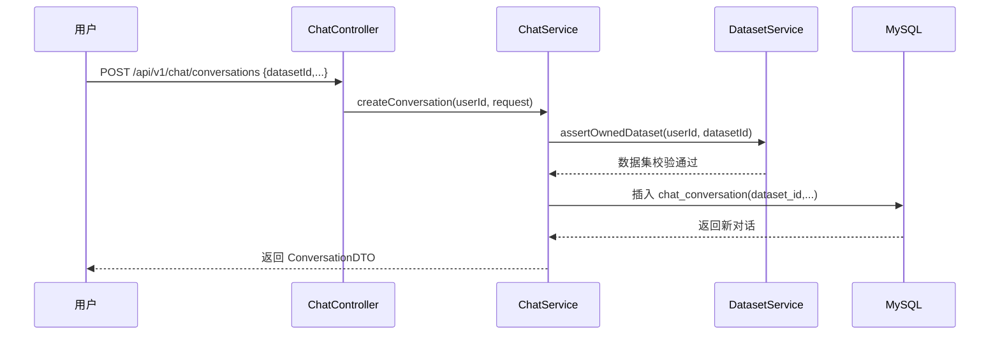
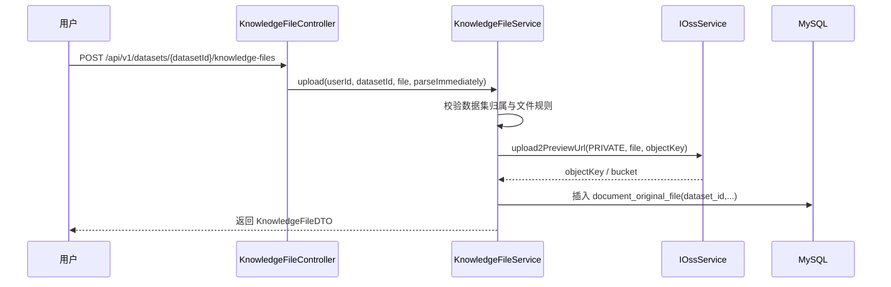

# 数据集中心化知识模型 技术实现文档

> **文档状态：** 草稿  
> **项目名称**：ToLink Service  
> **模块名称**：数据集中心化知识模型  
> **需求文档**：[2026-04-21-dataset-centered-knowledge-model-requirements.md](/Users/fang/Developer/Projects/toLink/toLink-Service/docs/superpowers/specs/2026-04-21-dataset-centered-knowledge-model-requirements.md)  
> **代码说明**：[2026-04-21-数据集中心化知识模型-当前代码实现说明.md](/Users/fang/Developer/Projects/toLink/toLink-Service/docs/需求与技术文档/文件上传模块/2026-04-21-数据集中心化知识模型-当前代码实现说明.md)  
> **分支名称**：[toLink-Service]  
> **技术负责人：** Fang  
> **最后更新时间：** 2026-04-21

---

## 1. 文档修订记录 (Change Log)

| 版本号 | 修改日期 | 修改内容简述 | 修改人 | 审核人 |
| :--- | :--- | :--- | :--- | :--- |
| v1.0 | 2026-04-21 | 初始版本创建，明确数据集实体、对话绑定、文件归属迁移、对象路径规则与测试方案 | Fang | [待补充] |

---

## 2. 技术目标与范围 (Overview)

### 2.1 技术目标 (Technical Goals)

* **核心目标：**
  - 将知识文件主归属从“对话”迁移为“数据集”。
  - 让对话创建时必须绑定 `datasetId`，并在后续流程中以 `datasetId` 作为检索边界。
  - 让数据库归属关系、服务层调用链和 MinIO 对象路径都围绕数据集组织。

* **成功标准：**
  - 系统中存在可用的数据集主实体。
  - 对话、文件、解析任务链路都能追溯到所属数据集。
  - 原始文件的 MinIO 路径符合 `rag-raw/{userId}/{datasetId}/{yyyy}/{MM}/{dd}/{originalFilename}` 约定。
  - 新旧“对话中心”语义被收敛，不再新增基于 `conversationId` 的文件归属逻辑。

### 2.2 实现范围 (In Scope / Out of Scope)

**必须实现：**

- 新增数据集实体、表结构、Mapper、Service、Controller。
- 修改对话创建接口与实体模型，使 `datasetId` 成为必填归属字段。
- 修改知识文件接口与服务，使文件上传、查询按数据集维度执行。
- 修改对象 key 生成规则与文件归属规则。
- 修改测试库 Schema 和初始化脚本，使其支持新数据模型。

**暂不实现：**

- 多用户协作数据集。
- 一个对话绑定多个数据集。
- 数据集下再细分二级知识库。
- 历史数据迁移工具、双模型兼容期。

### 2.3 验收项到实现点映射

| 需求验收项 | 技术实现点 | 测试方式 | 责任模块 |
| :--- | :--- | :--- | :--- |
| 用户拥有多个数据集 | 新增 `dataset` 表、实体、CRUD 接口 | `DatasetControllerTest` | `link-api` / `link-service` / `link-model` / `link-mapper` |
| 对话必须绑定数据集 | `chat_conversation.dataset_id` 必填，创建接口改造 | `ChatControllerTest` | `link-api` / `link-service` / `link-model` |
| 文件归属数据集 | `document_original_file.dataset_id` 生效，文件接口改造 | `KnowledgeFileControllerTest` | `link-api` / `link-service` / `link-model` |
| 检索边界限制为数据集 | 对话 -> 数据集 -> 文件集合的服务层约束 | Service/集成测试 | `link-service` |
| MinIO 路径按数据集组织 | 对象 key 生成规则更新 | 单元测试 + OSS 行为测试 | `link-service` / `link-components` |

---

## 3. 当前系统分析 (Current-State Analysis)

### 3.1 相关模块盘点

| 模块 | 当前职责 | 现状说明 | 是否修改 |
| :--- | :--- | :--- | :--- |
| `link-api` | Controller / API 入口 | 现有对话与知识文件接口均以对话为主维度 | 是 |
| `link-service` | 业务服务 | `ChatServiceImpl`、`KnowledgeFileServiceImpl` 直接围绕 `conversationId` 组织业务 | 是 |
| `link-model` | Entity / DTO / Enum | 对话和知识文件实体均缺少 `datasetId` | 是 |
| `link-mapper` | Mapper / 持久化 | 当前 Mapper 均基于现有表结构，无数据集实体 | 是 |
| `link-core` | 通用配置 / 异常 / 工具 | 现有认证、异常、统一响应可直接复用 | 否 |
| `link-components` | 可复用基础组件 | OSS 组件已支持上传、删除、下载，但路径规则仍由业务层决定 | 是，复用为主 |

### 3.2 已复用能力

- 认证与用户识别：`AuthContext.getLoginUserIdOrThrow()`、`@SaCheckLogin`
- 统一响应：`Result<T>`
- 分页模型：`PageResult` + `PageHelper`
- OSS 组件：`IOssService`、`PrivateFileResolver`、`MinioFileService`、`LocalFileService`
- 解析任务链路：`MQSend`
- 统一异常模型：`BusinessException`、`NotFoundException`

### 3.3 已参考代码

| 文件/模块 | 参考点 | 对方案的影响 |
| :--- | :--- | :--- |
| [ChatController.java](/Users/fang/Developer/Projects/toLink/toLink-Service/link-api/src/main/java/com/qingluo/link/api/controller/ChatController.java) | 现有对话接口风格、认证方式 | 新接口应保持现有 REST 风格，只调整请求字段 |
| [ChatServiceImpl.java](/Users/fang/Developer/Projects/toLink/toLink-Service/link-service/src/main/java/com/qingluo/link/service/impl/ChatServiceImpl.java) | 对话创建、列表、删除逻辑 | 需在创建与查询逻辑中引入数据集归属校验 |
| [KnowledgeFileController.java](/Users/fang/Developer/Projects/toLink/toLink-Service/link-api/src/main/java/com/qingluo/link/api/controller/KnowledgeFileController.java) | 当前文件接口依赖 `conversationId` | 需整体切换为按 `datasetId` 组织 |
| [KnowledgeFileServiceImpl.java](/Users/fang/Developer/Projects/toLink/toLink-Service/link-service/src/main/java/com/qingluo/link/service/impl/KnowledgeFileServiceImpl.java) | 文件上传、对象 key、删除、解析任务流程 | 当前实现是主要改造对象 |
| [ChatConversation.java](/Users/fang/Developer/Projects/toLink/toLink-Service/link-model/src/main/java/com/qingluo/link/model/dto/entity/ChatConversation.java) | 对话实体字段结构 | 需新增 `datasetId` |
| [KnowledgeOriginalFile.java](/Users/fang/Developer/Projects/toLink/toLink-Service/link-model/src/main/java/com/qingluo/link/model/dto/entity/KnowledgeOriginalFile.java) | 文件实体字段结构 | 需新增 `datasetId`，调整 `conversationId` 语义 |
| [IOssService.java](/Users/fang/Developer/Projects/toLink/toLink-Service/link-components/toLink-components-oss/src/main/java/com/qingluo/link/components/oss/service/IOssService.java) | 组件边界 | 对象路径规则仍应留在业务层实现 |

### 3.4 现有问题与约束

- 当前文件归属围绕 `conversationId`，与数据集中心化目标冲突。
- 当前对话创建接口不传 `datasetId`，不满足新模型。
- 当前文件上传接口和列表接口绑定在 `/chat/conversations/{conversationId}` 下，语义需要重构。
- 用户已明确同意：
  - 直接修改对话创建接口，`datasetId` 必填
  - 直接把知识文件接口切换到数据集维度
  - 历史数据无需兼容迁移
  - MinIO 完整路径语义固定为 `rag-raw/{userId}/{datasetId}/{yyyy}/{MM}/{dd}/{originalFilename}`

---

## 4. 总体方案设计 (Architecture & Solution)

### 4.1 总体设计思路

本方案采用“新增数据集领域对象 + 将对话和文件同时归属到数据集 + 调整文件接口主维度”的方式。

核心思路如下：

- 新增 `dataset` 领域实体，作为知识文件和对话的共同上层归属。
- 对话创建时必须完成“用户 -> 数据集 -> 对话”的绑定。
- 知识文件上传和列表查询统一切换为“数据集维度”。
- 对话中的检索范围不再由 `conversationId` 直接决定，而是通过 `conversationId -> datasetId -> dataset files` 间接决定。
- OSS 组件维持模板化能力，业务层负责生成对象 key：`{userId}/{datasetId}/{yyyy}/{MM}/{dd}/{originalFilename}`。

### 4.2 目标调用链路

```text
DatasetController -> DatasetService -> DatasetMapper
ChatController -> ChatService -> ChatConversationMapper
KnowledgeFileController -> KnowledgeFileService -> KnowledgeOriginalFileMapper -> IOssService
KnowledgeFileService -> MQSend / PrivateFileResolver
```

### 4.3 核心模块职责划分

| 模块/类 | 职责 | 输入/输出边界 |
| :--- | :--- | :--- |
| `DatasetController` | 数据集创建、列表、详情、删除接口 | 输入 `userId` + request，输出 `DatasetDTO` |
| `DatasetService` | 数据集归属校验与业务规则 | 输入 `userId` + `datasetId`，输出数据集实体/DTO |
| `ChatController` | 创建和查询对话 | 输入 `datasetId`、分页参数，输出 `ConversationDTO` |
| `ChatServiceImpl` | 创建绑定数据集的对话、校验对话归属 | 输入 `userId` + `datasetId`，输出对话 DTO |
| `KnowledgeFileController` | 数据集维度文件上传和列表查询 | 输入 `datasetId` + file，输出 `KnowledgeFileDTO/PageResult` |
| `KnowledgeFileServiceImpl` | 校验数据集归属、生成对象 key、文件落库、解析任务创建 | 输入 `userId` + `datasetId` + file |
| `IOssService` | 上传、删除、下载对象 | 输入 bucket/place + objectKey，输出对象存储结果 |

### 4.4 解析任务设计原则

- 文件解析任务通过 MQ 发放，不引入独立的解析任务表。
- `document_original_file` 只保留解析结果快照和必要的任务追踪字段，如 `parse_task_id`、`parse_status`、`is_parse_success`。
- 解析任务的异步投递、消费、回调由 MQ 链路承载，不以数据库任务表作为调度中心。
- 如果后续出现“任务审计列表”“失败任务批量重试”“任务运营统计”等强需求，再单独评估是否补充任务表。

### 4.5 解析结果回写原则

- Python/RAG 解析完成后，通过 `tolink.rag.parse_result` 回传解析结果。
- Java 消费端只回写 `document_original_file`，不建设本地解析任务表。
- 回写主键以 `parse_task_id` 为准，`document_id` 作为辅助校验字段。
- 成功回写时更新：
  - `parse_status = success`
  - `is_parse_success = true`
  - `parsed_bucket_name`
  - `parsed_object_key`
  - `parsed_file_url`
  - `parsed_at`
  - 清空 `parse_failure_reason`
- 失败回写时更新：
  - `parse_status = failed`
  - `is_parse_success = false`
  - `parse_failure_reason`
- 幂等规则：
  - 已成功的记录不允许再被失败消息覆盖
  - 失败记录允许被后续成功消息覆盖
  - `task_id` 不匹配时拒绝回写并记录错误日志

### 4.6 核心时序图

#### 场景 1：在数据集下创建对话


#### 场景 2：向数据集上传知识文件


---

## 5. API 设计 (API Contract)

### 5.1 接口清单

| 方法 | 路径 | 说明 | 权限 |
| :--- | :--- | :--- | :--- |
| POST | `/api/v1/datasets` | 创建数据集 | 登录用户 |
| GET | `/api/v1/datasets` | 查询当前用户数据集列表 | 登录用户 |
| GET | `/api/v1/datasets/{datasetId}` | 查询数据集详情 | 数据集所有者 |
| DELETE | `/api/v1/datasets/{datasetId}` | 删除数据集 | 数据集所有者 |
| POST | `/api/v1/chat/conversations` | 创建对话，`datasetId` 必填 | 登录用户 |
| GET | `/api/v1/chat/conversations` | 查询当前用户对话列表 | 登录用户 |
| POST | `/api/v1/datasets/{datasetId}/knowledge-files` | 向数据集上传知识文件 | 数据集所有者 |
| GET | `/api/v1/datasets/{datasetId}/knowledge-files` | 查询数据集文件列表 | 数据集所有者 |
| POST | `/api/v1/knowledge-files/{fileId}/parse-tasks` | 创建解析任务 | 文件所属数据集所有者 |
| DELETE | `/api/v1/knowledge-files/{fileId}` | 删除文件 | 文件所属数据集所有者 |

### 5.2 请求参数

| 参数 | 位置 | 类型 | 必填 | 说明 |
| :--- | :--- | :--- | :--- | :--- |
| `datasetId` | body | `Long` | 是 | 创建对话时绑定的数据集 ID |
| `title` | body | `String` | 否 | 对话标题 |
| `lastConfigId` | body | `Long` | 否 | 上次使用的配置 ID |
| `datasetId` | path | `Long` | 是 | 上传文件或查询文件列表时指定的数据集 ID |
| `file` | multipart | `MultipartFile` | 是 | 上传的知识文件 |
| `parseImmediately` | form/query | `boolean` | 否 | 是否立即创建解析任务 |

### 5.3 响应结构

```json
{
  "code": 200,
  "message": "success",
  "data": {}
}
```

新增或调整的响应 DTO：

- `ConversationDTO`：增加 `datasetId`
- `KnowledgeFileDTO`：增加 `datasetId`
- 新增 `DatasetDTO`

### 5.4 异常响应

| 场景 | HTTP 状态 | 业务错误码 | message |
| :--- | :--- | :--- | :--- |
| 数据集不存在或无权访问 | 404 / 403 | 404 / 403 | `数据集不存在或无权访问` |
| 创建对话未传数据集 | 400 | 400 | `数据集不能为空` |
| 文件上传时数据集无效 | 404 / 403 | 404 / 403 | `数据集不存在或无权访问` |
| 文件名非法 | 400 | 400 | `文件名包含非法字符` |
| 同一数据集下文件重名 | 400 | 400 | `当前数据集下已存在同名原文件，请先重命名后再上传` |
| 删除对象失败 | 500 | 500 | `删除原文件失败，请稍后重试` |

### 5.5 兼容性说明

- **是否兼容旧接口：** 不兼容。旧的“按对话上传文件”接口视为直接废弃。
- **是否需要过渡期：** 当前不需要，用户已明确同意直接切换。
- **前端影响点：**
  - 创建对话时需传 `datasetId`
  - 文件上传和文件列表入口需从对话页迁移到数据集页或带数据集上下文的对话页

---

## 6. 数据与存储设计 (Data & Storage)

### 6.1 数据模型关系

- `sys_user` 1:N `dataset`
- `dataset` 1:N `chat_conversation`
- `dataset` 1:N `document_original_file`

关键语义：

- 对话不再承载文件主归属。
- 文件与对话通过“同属一个数据集”发生关联。
- 数据集成为数据库和对象存储的统一边界。
- 文件解析任务仅通过 MQ 发放，不单独建设任务表。

### 6.2 数据库变更清单

#### MySQL 变更

| 表名 | 变更类型 | 变更说明 | 备注 |
| :--- | :--- | :--- | :--- |
| `dataset` | 新增 | 存储用户的数据集实体 | 新增主表 |
| `chat_conversation` | 修改 | 增加 `dataset_id` | 创建对话必填 |
| `document_original_file` | 修改 | 增加 `dataset_id`，下调 `conversation_id` 语义 | 文件主归属迁移 |

#### 建表/改表原则

- 主键统一使用 `BIGINT UNSIGNED AUTO_INCREMENT`。
- 时间字段统一使用 `DATETIME NOT NULL DEFAULT CURRENT_TIMESTAMP`，更新时间字段使用 `DEFAULT CURRENT_TIMESTAMP ON UPDATE CURRENT_TIMESTAMP`。
- 字符集统一建议 `utf8mb4`，排序规则建议 `utf8mb4_general_ci`。
- 本期不强制上外键，归属一致性由 Service 校验 + 索引 + 唯一约束保证，保持与当前项目风格一致。

### 6.3 字段设计

#### 6.3.1 `dataset` 新增表设计

| 字段 | 类型 | 是否必填 | 默认值 | 说明 |
| :--- | :--- | :--- | :--- | :--- |
| `id` | `BIGINT UNSIGNED` | 是 | 自增 | 数据集主键 |
| `user_id` | `BIGINT UNSIGNED` | 是 | 无 | 所属用户 ID |
| `name` | `VARCHAR(128)` | 是 | 无 | 数据集名称，同一用户下唯一 |
| `description` | `VARCHAR(512)` | 否 | `NULL` | 数据集描述 |
| `status` | `VARCHAR(16)` | 是 | `ACTIVE` | 数据集状态，预留扩展 |
| `created_at` | `DATETIME` | 是 | `CURRENT_TIMESTAMP` | 创建时间 |
| `updated_at` | `DATETIME` | 是 | `CURRENT_TIMESTAMP` | 更新时间 |

建议说明：

- `name` 允许用户可读命名，不参与对象存储路径拼接。
- `status` 本期可仅使用 `ACTIVE`，但字段保留，便于后续扩展冻结、归档等状态。
- 若后续需要“默认数据集”能力，可在后续版本新增 `is_default`，本期不建议预埋。

#### 6.3.2 `chat_conversation` 改表设计

当前实体 [ChatConversation.java](/Users/fang/Developer/Projects/toLink/toLink-Service/link-model/src/main/java/com/qingluo/link/model/dto/entity/ChatConversation.java) 已有 `id/user_id/last_config_id/last_model_name/title/is_pinned/created_at/updated_at` 等字段，本期新增并强化归属字段，同时取消软删除语义。

| 字段 | 类型 | 是否必填 | 默认值 | 说明 |
| :--- | :--- | :--- | :--- | :--- |
| `id` | `BIGINT UNSIGNED` | 是 | 自增 | 对话主键 |
| `user_id` | `BIGINT UNSIGNED` | 是 | 无 | 对话所属用户 |
| `dataset_id` | `BIGINT UNSIGNED` | 是 | 无 | 对话所属数据集，本期新增 |
| `last_config_id` | `BIGINT UNSIGNED` | 否 | `NULL` | 上次使用的知识配置 |
| `last_model_name` | `VARCHAR(128)` | 否 | `NULL` | 上次使用模型名 |
| `title` | `VARCHAR(255)` | 是 | 无 | 对话标题 |
| `is_pinned` | `TINYINT(1)` | 是 | `0` | 是否置顶 |
| `created_at` | `DATETIME` | 是 | `CURRENT_TIMESTAMP` | 创建时间 |
| `updated_at` | `DATETIME` | 是 | `CURRENT_TIMESTAMP` | 更新时间 |

建议说明：

- `dataset_id` 为创建对话必填字段，不允许为 `NULL`。
- 对话归属按 `(user_id, dataset_id)` 双维度校验，防止用户构造他人数据集 ID。
- 现有 `user_id` 仍保留，不做仅依赖 `dataset_id` 的弱归属设计，便于查询与权限判定。

#### 6.3.3 `document_original_file` 改表设计

当前实体 [KnowledgeOriginalFile.java](/Users/fang/Developer/Projects/toLink/toLink-Service/link-model/src/main/java/com/qingluo/link/model/dto/entity/KnowledgeOriginalFile.java) 已承载上传、解析、删除等完整状态，本期重点调整为“文件归属数据集”。

| 字段 | 类型 | 是否必填 | 默认值 | 说明 |
| :--- | :--- | :--- | :--- | :--- |
| `id` | `BIGINT UNSIGNED` | 是 | 自增 | 原始文件主键 |
| `dataset_id` | `BIGINT UNSIGNED` | 是 | 无 | 文件所属数据集，本期新增 |
| `user_id` | `BIGINT UNSIGNED` | 是 | 无 | 上传用户 ID |
| `original_filename` | `VARCHAR(255)` | 是 | 无 | 原始文件名，按用户上传名称保存 |
| `file_suffix` | `VARCHAR(32)` | 否 | `NULL` | 文件后缀，如 `pdf` |
| `file_size` | `BIGINT UNSIGNED` | 是 | `0` | 文件字节数 |
| `content_type` | `VARCHAR(128)` | 否 | `NULL` | MIME 类型 |
| `bucket_name` | `VARCHAR(64)` | 是 | `rag-raw` | 存储桶名称 |
| `object_key` | `VARCHAR(512)` | 是 | 无 | 对象 key，不含 bucket 前缀 |
| `file_url` | `VARCHAR(512)` | 否 | `NULL` | 预览或下载 URL，按现有组件输出 |
| `upload_status` | `VARCHAR(32)` | 是 | `UPLOADED` 或现有默认值 | 上传状态 |
| `is_upload_success` | `TINYINT(1)` | 是 | `1` | 上传是否成功 |
| `parse_notice_status` | `VARCHAR(32)` | 否 | `NULL` | 解析任务通知状态 |
| `parse_task_id` | `VARCHAR(64)` | 否 | `NULL` | 外部解析任务 ID |
| `parse_status` | `VARCHAR(32)` | 否 | `NULL` | 解析状态 |
| `is_parse_success` | `TINYINT(1)` | 否 | `NULL` | 解析是否成功 |
| `parsed_bucket_name` | `VARCHAR(64)` | 否 | `NULL` | 解析产物桶 |
| `parsed_object_key` | `VARCHAR(512)` | 否 | `NULL` | 解析产物对象 key |
| `parsed_file_url` | `VARCHAR(512)` | 否 | `NULL` | 解析产物 URL |
| `parsed_at` | `DATETIME` | 否 | `NULL` | 解析完成时间 |
| `parse_failure_reason` | `VARCHAR(512)` | 否 | `NULL` | 解析失败原因 |
| `failure_reason` | `VARCHAR(512)` | 否 | `NULL` | 上传或通用失败原因 |
| `parse_notice_retry_count` | `INT UNSIGNED` | 是 | `0` | 解析通知重试次数 |
| `last_parse_notice_at` | `DATETIME` | 否 | `NULL` | 最近一次通知时间 |
| `created_at` | `DATETIME` | 是 | `CURRENT_TIMESTAMP` | 创建时间 |
| `updated_at` | `DATETIME` | 是 | `CURRENT_TIMESTAMP` | 更新时间 |

建议说明：

- `bucket_name + object_key` 是 OSS 删除和下载的唯一定位信息，必须落库。
- `object_key` 存储格式为 `{userId}/{datasetId}/{yyyy}/{MM}/{dd}/{originalFilename}`。
- `original_filename` 必须保存用户原文件名，不做 UUID 改名；同一数据集下重名直接报错。
- `conversation_id` 本期直接从表结构中移除，文件主归属仅保留 `dataset_id`。
- 文件删除采用物理删除，不保留数据库软删除记录。

### 6.4 索引与约束

#### 6.4.1 索引设计

- `dataset`
  - `PRIMARY KEY (id)`
  - `KEY idx_dataset_user_updated (user_id, updated_at)`
  - `UNIQUE KEY uk_dataset_user_name (user_id, name)`
- `chat_conversation`
  - `PRIMARY KEY (id)`
  - `KEY idx_chat_conversation_user_pinned_updated (user_id, is_pinned, updated_at)`
  - `KEY idx_chat_conversation_dataset_updated (dataset_id, updated_at)`
- `document_original_file`
  - `PRIMARY KEY (id)`
  - `KEY idx_document_original_user_created (user_id, created_at)`
  - `KEY idx_document_original_dataset_created (dataset_id, created_at)`
  - `UNIQUE KEY uk_document_original_dataset_filename (dataset_id, original_filename)`

#### 6.4.2 约束策略

- 数据集重名控制：
  - 使用 `uk_dataset_user_name (user_id, name)`。
  - 同一用户下不能存在两个同名数据集。
- 文件重名控制：
  - 使用 `uk_document_original_dataset_filename (dataset_id, original_filename)`。
  - 同一数据集下不能存在两个同名原文件。
- 归属一致性控制：
  - 应用层校验 `dataset.user_id == loginUserId`。
  - 应用层校验 `chat_conversation.dataset_id` 与访问上下文一致。
  - 应用层校验 `document_original_file.dataset_id` 属于当前用户可访问数据集。

#### 6.4.3 建议 DDL 片段

```sql
CREATE TABLE `dataset` (
  `id` BIGINT UNSIGNED NOT NULL AUTO_INCREMENT COMMENT '主键',
  `user_id` BIGINT UNSIGNED NOT NULL COMMENT '所属用户ID',
  `name` VARCHAR(128) NOT NULL COMMENT '数据集名称',
  `description` VARCHAR(512) DEFAULT NULL COMMENT '数据集描述',
  `status` VARCHAR(16) NOT NULL DEFAULT 'ACTIVE' COMMENT '状态',
  `created_at` DATETIME NOT NULL DEFAULT CURRENT_TIMESTAMP COMMENT '创建时间',
  `updated_at` DATETIME NOT NULL DEFAULT CURRENT_TIMESTAMP ON UPDATE CURRENT_TIMESTAMP COMMENT '更新时间',
  PRIMARY KEY (`id`),
  KEY `idx_dataset_user_updated` (`user_id`, `updated_at`),
  UNIQUE KEY `uk_dataset_user_name` (`user_id`, `name`)
) ENGINE=InnoDB DEFAULT CHARSET=utf8mb4 COMMENT='数据集表';

ALTER TABLE `chat_conversation`
  ADD COLUMN `dataset_id` BIGINT UNSIGNED NOT NULL COMMENT '所属数据集ID' AFTER `user_id`,
  DROP COLUMN `is_deleted`,
  ADD KEY `idx_chat_conversation_dataset_updated` (`dataset_id`, `updated_at`);

ALTER TABLE `document_original_file`
  ADD COLUMN `dataset_id` BIGINT UNSIGNED NOT NULL COMMENT '所属数据集ID' AFTER `id`,
  DROP COLUMN `conversation_id`,
  DROP COLUMN `is_deleted`,
  ADD KEY `idx_document_original_dataset_created` (`dataset_id`, `created_at`),
  ADD UNIQUE KEY `uk_document_original_dataset_filename` (`dataset_id`, `original_filename`);
```

### 6.5 对象存储 / 缓存 / 其他存储设计

| 组件 | 存储内容 | Key/Path 规则 | 备注 |
| :--- | :--- | :--- | :--- |
| MinIO | 原始知识文件 | `rag-raw/{userId}/{datasetId}/{yyyy}/{MM}/{dd}/{originalFilename}` | bucket 为 `rag-raw`，object key 为去掉 `rag-raw/` 之后的部分 |
| Redis | 本阶段不新增强依赖缓存 | 暂不设计 | 可后续增加数据集详情和文件列表缓存 |

### 6.6 数据迁移与回滚

* **是否需要迁移：** 不需要复杂迁移，当前数据仅测试使用。
* **迁移策略：**
  - 直接修改测试 Schema 和初始化脚本。
  - 新代码按新模型落库。
* **回滚策略：**
  - 回滚 DDL 变更。
  - 恢复旧版测试初始化脚本。

---

## 7. 核心实现设计 (Core Implementation)

### 7.1 Service 接口设计

```java
public interface DatasetService {
    DatasetDTO create(Long userId, CreateDatasetRequest request);
    PageResult<DatasetDTO> list(Long userId, int page, int pageSize);
    DatasetDTO detail(Long userId, Long datasetId);
    void delete(Long userId, Long datasetId);
    DatasetDTO assertOwnedDataset(Long userId, Long datasetId);
}
```

### 7.2 核心方法职责

| 方法 | 职责 | 输入 | 输出 |
| :--- | :--- | :--- | :--- |
| `DatasetService.create` | 创建数据集并绑定用户 | `userId`, `CreateDatasetRequest` | `DatasetDTO` |
| `ChatService.createConversation` | 校验数据集归属并创建对话 | `userId`, `CreateConversationRequest` | `ConversationDTO` |
| `KnowledgeFileService.upload` | 校验数据集归属、生成对象 key、上传文件、落库文件记录 | `userId`, `datasetId`, `file`, `parseImmediately` | `KnowledgeFileDTO` |
| `KnowledgeFileService.list` | 查询数据集下文件列表 | `userId`, `datasetId`, filters | `PageResult<KnowledgeFileDTO>` |
| `KnowledgeFileService.delete` | 删除对象并物理删除文件记录 | `userId`, `fileId` | `void` |

### 7.3 关键业务流程

1. 所有与对话、文件相关的入口先校验数据集归属。
2. 创建对话时将 `datasetId` 写入 `chat_conversation`。
3. 上传文件时生成对象 key：`{userId}/{datasetId}/{yyyy}/{MM}/{dd}/{originalFilename}`。
4. 文件落库时写入 `dataset_id`、`bucket_name=rag-raw`、`object_key`。
5. 检索链路通过 `conversationId -> datasetId -> dataset files` 组织可检索范围。

### 7.4 并发、幂等与一致性

- **并发控制：**
  - 数据集名称在同用户维度下通过唯一约束控制重名。
  - 文件名在同数据集维度下通过应用层校验 + DB 唯一约束兜底。
- **幂等策略：**
  - 文件上传接口不做重复请求幂等，重复上传同名文件直接报错。
  - 删除接口保持“对象删除成功后再删除数据库记录”顺序。
- **事务边界：**
  - 对话创建、文件落库、文件删除维持 Service 层事务控制。
- **跨组件一致性：**
  - 文件上传：OSS 成功后再更新数据库状态。
  - 文件删除：OSS 删除成功后再删除数据库记录。

### 7.5 数据集/文件删除的事务与失败补偿

#### 7.5.1 文件删除

- **事务边界：**
  - 文件删除分为“删除 OSS 原始对象”和“删除数据库记录”两步。
  - Service 层事务只覆盖数据库删除，不覆盖 OSS 远程调用。
  - 实际执行顺序固定为：先删 OSS，再删数据库。
- **失败补偿原则：**
  - 若 OSS 删除失败，则数据库记录不删除，接口直接返回失败。
  - 若 OSS 删除成功、数据库删除失败，则事务回滚数据库变更，但 OSS 对象已不可恢复，需记录错误日志并人工/脚本补偿数据库。
  - 因此数据库记录仍是删除链路中的最终状态源，不能先删数据库再删 OSS。
- **补偿建议：**
  - 记录 `fileId`、`datasetId`、`objectKey`、异常栈。
  - 后续可通过离线巡检脚本扫描“数据库存在但 OSS 不存在”或“OSS 已删但数据库未删”的不一致记录并修复。

#### 7.5.2 数据集删除

- **事务边界：**
  - 数据集删除包含：
    1. 查询数据集下全部原始文件
    2. 逐个删除 OSS 原始对象
    3. 删除 `chat_message`
    4. 删除 `chat_conversation`
    5. 删除 `document_original_file`
    6. 删除 `dataset`
  - 其中数据库 3~6 步可纳入同一 Service 层事务。
  - 第 2 步 OSS 删除属于跨组件调用，不纳入数据库事务。
- **失败补偿原则：**
  - 只要任意一个 OSS 对象删除失败，整个数据集删除流程立即中断，数据库不进入物理删除阶段。
  - 若全部 OSS 对象删除成功，但数据库事务提交失败，则需要记录数据集级错误日志，并通过补偿任务继续完成数据库清理。
  - 不允许出现“数据集记录已删，但仍残留大量 OSS 文件”的顺序设计。
- **补偿建议：**
  - 记录 `datasetId`、`userId`、涉及的 `fileId/objectKey` 列表。
  - 后续可补一个“删除失败重试任务”或“数据集清理脚本”，基于日志或数据库状态重放删除流程。

#### 7.5.3 一致性取舍说明

- 当前方案优先保证“不要误删数据库主记录”。
- 因为 OSS 删除不可回滚，所以删除顺序必须是“先 OSS，后数据库”。
- 该设计会带来一种可接受的不一致窗口：
  - OSS 已删，但数据库事务失败，短时间内数据库仍保留记录。
- 本期通过“错误日志 + 补偿脚本/重试机制”处理该窗口，不引入分布式事务。

---

## 8. 组件与集成设计 (Integration Design)

| 组件 | 用途 | 配置项 | 失败处理 |
| :--- | :--- | :--- | :--- |
| OSS | 上传、删除、下载原始知识文件 | `tolink.oss.*` | 上传/删除失败返回业务异常 |
| MQ | 创建解析任务 | 现有 MQ 配置 | 发送失败仅影响解析任务状态 |
| Redis | 当前不新增强依赖 | 无 | 无 |
| 第三方接口 | 当前无新增外部接口 | 无 | 无 |

---

## 9. 权限、安全与审计 (Security)

### 9.1 认证与授权

| 操作 | 权限要求 | 校验位置 |
| :--- | :--- | :--- |
| 创建数据集 | 登录用户 | `DatasetController` + `DatasetService` |
| 创建对话 | 登录用户且拥有目标数据集 | `ChatController` + `ChatService` |
| 上传文件 | 登录用户且拥有目标数据集 | `KnowledgeFileController` + `KnowledgeFileService` |
| 查询文件列表 | 登录用户且拥有目标数据集 | `KnowledgeFileController` + `KnowledgeFileService` |
| 删除文件 | 登录用户且文件属于本人数据集 | `KnowledgeFileService` |

### 9.2 敏感数据处理

- **敏感字段：** 原始文件名、对象路径、内部下载 URL。
- **脱敏策略：** 日志中不默认完整输出对象路径和下载地址。
- **日志策略：** 记录 `userId`、`datasetId`、`conversationId`、`fileId` 等标识，不记录文件内容。

### 9.3 审计要求

- 文件上传、删除、解析任务创建都应能够追溯到 `datasetId`。
- 对话创建和查询应可追溯数据集归属。

---

## 10. 异常处理与降级策略 (Exceptions & Fallback)

| 异常场景 | 处理方式 | 错误码 | 用户提示 | 是否重试 |
| :--- | :--- | :--- | :--- | :--- |
| 数据集不存在或无权访问 | 抛出业务异常 | 404 / 403 | `数据集不存在或无权访问` | 否 |
| 创建对话缺少 `datasetId` | 参数校验失败 | 400 | `数据集不能为空` | 否 |
| 文件名非法 | 抛出业务异常 | 400 | `文件名包含非法字符` | 否 |
| 数据集内文件重名 | 应用层 + DB 唯一约束拦截 | 400 | `当前数据集下已存在同名原文件，请先重命名后再上传` | 否 |
| MinIO 上传失败 | 标记上传失败并返回业务错误 | 500 | `文件上传失败，请稍后重试` | 否 |
| MinIO 删除失败 | 数据库不执行删除 | 500 | `删除原文件失败，请稍后重试` | 否 |

---

## 11. 测试方案 (Test Plan)

### 11.1 单元测试

| 测试类 | 覆盖内容 |
| :--- | :--- |
| `DatasetServiceImplTest` | 数据集创建、归属校验、删除 |
| `ChatServiceImplTest` | 创建对话必须绑定数据集 |
| `KnowledgeFileServiceImplTest` | 数据集归属校验、对象 key 生成、删除行为 |
| `DatasetObjectKeyGeneratorTest` | MinIO 对象 key 规则 |

### 11.2 集成测试

| 测试类 | 覆盖接口/流程 |
| :--- | :--- |
| `DatasetControllerTest` | 数据集创建、列表、详情、删除 |
| `ChatControllerTest` | 创建对话时传 `datasetId`、对话列表回传 `datasetId` |
| `KnowledgeFileControllerTest` | 数据集维度上传、查询、解析、删除、内部下载 |

### 11.3 回归测试

| 回归点 | 验证方式 |
| :--- | :--- |
| OSS provider 行为 | `LocalFileServiceTest` / `MinioFileServiceTest` |
| 解析任务投递 | `KnowledgeFileControllerTest` + MQ 测试 |
| 文件内部下载 | `KnowledgeFileControllerTest` |

### 11.4 验证命令

```bash
mvn -pl link-api -am test
mvn -pl link-service -am test
mvn -pl link-components/toLink-components-oss -am test
```

---

## 12. 发布方案 (Release Plan)

### 12.1 配置项

| 配置项 | 默认值 | 说明 |
| :--- | :--- | :--- |
| `tolink.oss.minio.private-bucket-name` | `rag-raw` | 数据集原始文件存储桶 |
| `tolink.knowledge-file.internal-base-url` | 现有配置 | 文件内部下载基础地址 |

### 12.2 发布步骤

1. 更新数据库初始化脚本与测试 Schema。
2. 新增数据集表和相关代码结构。
3. 修改对话接口、知识文件接口和服务层逻辑。
4. 跑通数据集、对话、文件上传与解析相关测试。

### 12.3 回滚方案

- 回滚代码分支。
- 回滚初始化脚本与测试 Schema。
- 清理开发环境中按新模型创建的测试数据。

---

## 13. 风险与权衡 (Risks & Trade-offs)

| 风险 | 影响 | 缓解方案 |
| :--- | :--- | :--- |
| 直接切换接口主维度 | 前端需同步改造 | 文档中明确不保留旧接口并一次性切换 |
| 文件和对话同时改归属模型 | 改动面大 | 按“先数据集、再对话、再文件”的顺序实施 |
| `conversation_id` 旧语义残留 | 容易混淆实现 | 在实体和 SQL 中明确其为过渡字段或直接下线 |
| `rag-raw` 固定桶约束 | 部署配置要求更严格 | 在配置和文档中显式约定 |

---

## 14. 待确认问题 (Open Questions)

| 编号 | 问题 | 影响 | 建议确认人 |
| :--- | :--- | :--- | :--- |
| Q-1 | 数据集删除是否需要级联删除对话与文件 | 影响删除策略与回收流程，但不阻塞第一阶段实现 | 产品负责人 |

---

## 15. 变更记录

| 日期 | 变更 | 作者 |
| :--- | :--- | :--- |
| 2026-04-21 | 创建文档 | Codex |
